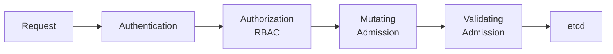

# 5.8.4 Subchapter Review: Authentication, Authorization, and Admission Control

This review covers the material presented in Notes 5.8.1 (Authentication Methods), 5.8.2 (RBAC Deep Dive), and 5.8.3 (Admission Controllers).

**Backlinks:** [5.8.1 - Authentication](./5.8.1_Authentication_Methods.md) | [5.8.2 - RBAC](./5.8.2_RBAC_Deep_Dive.md) | [5.8.3 - Admission Controllers](./5.8.3_Admission_Controllers.md)

---

## Quick Command Reference

| Command | Purpose |
|---------|---------|
| `kubectl auth whoami` | Show current identity |
| `kubectl auth can-i VERB RESOURCE` | Check permission |
| `kubectl auth can-i --list` | List all permissions |
| `kubectl auth can-i --as=USER` | Check as different user |
| `kubectl auth can-i --as-group=GROUP` | Check as group member |
| `kubectl certificate approve NAME` | Approve CSR |
| `kubectl get csr` | List certificate signing requests |
| `kubectl create role NAME --verb=V --resource=R` | Create Role |
| `kubectl create clusterrole NAME` | Create ClusterRole |
| `kubectl create rolebinding NAME --role=R --user=U` | Create RoleBinding |
| `kubectl create serviceaccount NAME` | Create ServiceAccount |
| `kubectl get roles,rolebindings -n NS` | List RBAC resources |
| `kubectl get mutatingwebhookconfigurations` | List mutating webhooks |
| `kubectl get validatingwebhookconfigurations` | List validating webhooks |
| `kubectl label ns NS pod-security.kubernetes.io/enforce=PROFILE` | Set PSS |

---

## Cheatsheet: Security Flow



### Authentication Methods

| Method | Credential | Best For |
|--------|------------|----------|
| **X.509 Certificates** | Client cert + key | Cluster admins, CI/CD |
| **ServiceAccount Tokens** | JWT | Pod-to-API |
| **OIDC** | ID Token | Enterprise SSO |
| **Webhook** | Custom token | Legacy systems |

### RBAC Components

| Component | Scope | Purpose |
|-----------|-------|---------|
| **Role** | Namespace | Permissions in namespace |
| **ClusterRole** | Cluster | Permissions cluster-wide |
| **RoleBinding** | Namespace | Bind to subjects in namespace |
| **ClusterRoleBinding** | Cluster | Bind to subjects cluster-wide |

### Built-in ClusterRoles

| Role | Access Level |
|------|--------------|
| `cluster-admin` | Full access |
| `admin` | Full namespace (no RBAC) |
| `edit` | Read/write (no secrets) |
| `view` | Read-only |

### Pod Security Standards

| Profile | Allows Privileged | Allows hostNetwork | Requires runAsNonRoot |
|---------|-------------------|--------------------|-----------------------|
| **Privileged** | ✅ | ✅ | ❌ |
| **Baseline** | ❌ | ❌ | ❌ |
| **Restricted** | ❌ | ❌ | ✅ |

### RBAC Verbs

| Verb | HTTP Method |
|------|-------------|
| `get` | GET (single) |
| `list` | GET (list) |
| `watch` | GET (stream) |
| `create` | POST |
| `update` | PUT |
| `patch` | PATCH |
| `delete` | DELETE |
| `deletecollection` | DELETE (bulk) |

---

## Interview Questions (Scenario-Based)

### Question 1

**Scenario:** A developer reports they cannot deploy to the `production` namespace but can deploy to `staging`. Both namespaces exist, and the developer can run `kubectl get pods` in both.

**Question:** What RBAC resources should you check? How would you diagnose and fix this?

**Answer:**

**Diagnosis steps:**

```bash
# Check what the developer can do
kubectl auth can-i create deployments --as=alice -n production
# no

kubectl auth can-i create deployments --as=alice -n staging
# yes

# List RoleBindings in both namespaces
kubectl get rolebindings -n production -o wide
kubectl get rolebindings -n staging -o wide

# Check if developer is in correct group
kubectl auth can-i create deployments --as-group=developers -n production
```

**Likely cause:** RoleBinding exists in `staging` but not in `production`.

**Fix:**

```bash
# Create RoleBinding in production
kubectl create rolebinding developer-deploy \
  --clusterrole=edit \
  --user=alice \
  -n production

# Or if using groups
kubectl create rolebinding developer-deploy \
  --clusterrole=edit \
  --group=developers \
  -n production
```

### Question 2

**Scenario:** A CI/CD pipeline needs to deploy applications but should only be able to update Deployments, not delete them or access Secrets.

**Question:** Design the RBAC configuration for this CI/CD ServiceAccount.

**Answer:**

```yaml
# ci-cd-role.yaml
apiVersion: rbac.authorization.k8s.io/v1
kind: Role
metadata:
  namespace: production
  name: ci-cd-deployer
rules:
# Deployments - read and update only (no delete)
- apiGroups: ["apps"]
  resources: ["deployments"]
  verbs: ["get", "list", "watch", "patch", "update"]
  
# Pods - view and delete for rollout
- apiGroups: [""]
  resources: ["pods"]
  verbs: ["get", "list", "delete"]
  
# ConfigMaps - read/write for config updates
- apiGroups: [""]
  resources: ["configmaps"]
  verbs: ["get", "list", "create", "update", "patch"]
  
# Services - read only
- apiGroups: [""]
  resources: ["services"]
  verbs: ["get", "list"]
  
# Explicitly NO secrets access
---
apiVersion: v1
kind: ServiceAccount
metadata:
  name: ci-cd-bot
  namespace: production
---
apiVersion: rbac.authorization.k8s.io/v1
kind: RoleBinding
metadata:
  name: ci-cd-binding
  namespace: production
subjects:
- kind: ServiceAccount
  name: ci-cd-bot
  namespace: production
roleRef:
  kind: Role
  name: ci-cd-deployer
  apiGroup: rbac.authorization.k8s.io
```

**Verification:**

```bash
kubectl auth can-i delete deployments --as=system:serviceaccount:production:ci-cd-bot -n production
# no

kubectl auth can-i get secrets --as=system:serviceaccount:production:ci-cd-bot -n production
# no

kubectl auth can-i update deployments --as=system:serviceaccount:production:ci-cd-bot -n production
# yes
```

### Question 3

**Scenario:** Your security team requires that all pods in the `secure` namespace:
1. Must have a `team` label
2. Cannot run as root
3. Cannot use privileged containers

**Question:** How would you enforce these policies?

**Answer:**

**Option 1: Pod Security Standards + Validating Webhook**

```yaml
# Namespace with PSS restricted
apiVersion: v1
kind: Namespace
metadata:
  name: secure
  labels:
    pod-security.kubernetes.io/enforce: restricted
    pod-security.kubernetes.io/enforce-version: latest
```

For the `team` label requirement, use OPA Gatekeeper or Kyverno:

**OPA Gatekeeper:**

```yaml
# ConstraintTemplate
apiVersion: templates.gatekeeper.sh/v1
kind: ConstraintTemplate
metadata:
  name: k8srequiredlabels
spec:
  crd:
    spec:
      names:
        kind: K8sRequiredLabels
      validation:
        openAPIV3Schema:
          type: object
          properties:
            labels:
              type: array
              items:
                type: string
  targets:
  - target: admission.k8s.gatekeeper.sh
    rego: |
      package k8srequiredlabels
      violation[{"msg": msg}] {
        provided := {label | input.review.object.metadata.labels[label]}
        required := {label | label := input.parameters.labels[_]}
        missing := required - provided
        count(missing) > 0
        msg := sprintf("Missing required labels: %v", [missing])
      }
---
# Constraint
apiVersion: constraints.gatekeeper.sh/v1beta1
kind: K8sRequiredLabels
metadata:
  name: require-team-label
spec:
  match:
    kinds:
    - apiGroups: [""]
      kinds: ["Pod"]
    namespaces: ["secure"]
  parameters:
    labels: ["team"]
```

**Option 2: Kyverno**

```yaml
apiVersion: kyverno.io/v1
kind: ClusterPolicy
metadata:
  name: secure-namespace-policies
spec:
  validationFailureAction: Enforce
  rules:
  - name: require-team-label
    match:
      any:
      - resources:
          kinds: ["Pod"]
          namespaces: ["secure"]
    validate:
      message: "Pods in 'secure' namespace must have 'team' label"
      pattern:
        metadata:
          labels:
            team: "?*"
            
  - name: disallow-privileged
    match:
      any:
      - resources:
          kinds: ["Pod"]
          namespaces: ["secure"]
    validate:
      message: "Privileged containers are not allowed"
      pattern:
        spec:
          containers:
          - securityContext:
              privileged: "!true"
              
  - name: require-non-root
    match:
      any:
      - resources:
          kinds: ["Pod"]
          namespaces: ["secure"]
    validate:
      message: "Pods must run as non-root"
      pattern:
        spec:
          securityContext:
            runAsNonRoot: true
```

### Question 4

**Scenario:** After deploying a new mutating webhook, all pod creations in the cluster are failing with "context deadline exceeded".

**Question:** How would you diagnose and fix this issue?

**Answer:**

**Immediate mitigation:**

```bash
# Set failurePolicy to Ignore (allows pods while debugging)
kubectl patch mutatingwebhookconfiguration webhook-name \
  --type='json' \
  -p='[{"op": "replace", "path": "/webhooks/0/failurePolicy", "value": "Ignore"}]'

# Or delete the webhook entirely (emergency)
kubectl delete mutatingwebhookconfiguration webhook-name
```

**Diagnosis:**

```bash
# Check webhook configuration
kubectl get mutatingwebhookconfiguration webhook-name -o yaml

# Check if webhook service exists and has endpoints
kubectl get svc -n webhook-namespace webhook-service
kubectl get endpoints -n webhook-namespace webhook-service

# Check webhook pod logs
kubectl logs -n webhook-namespace deployment/webhook-server

# Check webhook pod status
kubectl get pods -n webhook-namespace

# Test webhook connectivity from API server
kubectl run test --image=curlimages/curl --rm -it -- \
  curl -k https://webhook-service.webhook-namespace.svc:443/mutate
```

**Common causes and fixes:**

| Cause | Fix |
|-------|-----|
| Webhook pod not running | `kubectl rollout restart deployment webhook-server` |
| Service selector mismatch | Fix service selector to match pod labels |
| Webhook not listening on expected port | Check container port configuration |
| Network policy blocking | Allow traffic from API server |
| TLS certificate issues | Regenerate certificates, update caBundle |
| Webhook timeout too short | Increase `timeoutSeconds` in webhook config |

### Question 5

**Scenario:** A user `bob` with the `developer` group membership reports: "I can create Pods but I cannot view the logs with `kubectl logs`."

**Question:** What RBAC permission is missing? How would you fix it?

**Answer:**

**Problem:** `kubectl logs` requires permission on `pods/log` subresource, not just `pods`.

**Diagnosis:**

```bash
# Check current permissions
kubectl auth can-i get pods --as=bob
# yes

kubectl auth can-i get pods/log --as=bob
# no

# Find existing role
kubectl get rolebindings -A -o json | jq '.items[] | select(.subjects[]?.name=="bob" or .subjects[]?.name=="developers")'
```

**Fix – Update existing Role:**

```yaml
# developer-role.yaml
apiVersion: rbac.authorization.k8s.io/v1
kind: Role
metadata:
  namespace: dev
  name: developer
rules:
- apiGroups: [""]
  resources: ["pods"]
  verbs: ["get", "list", "watch", "create", "delete"]
- apiGroups: [""]
  resources: ["pods/log"]  # Add this
  verbs: ["get"]
- apiGroups: [""]
  resources: ["pods/exec"]  # Also useful for debugging
  verbs: ["create"]
```

```bash
kubectl apply -f developer-role.yaml

# Verify
kubectl auth can-i get pods/log --as=bob
# yes
```

---

## Topics Covered in This Subchapter

| Topic | Found in Note |
|-------|---------------|
| X.509 Certificate authentication | 5.8.1 |
| ServiceAccount tokens | 5.8.1 |
| OIDC authentication | 5.8.1 |
| Webhook token authentication | 5.8.1 |
| User impersonation | 5.8.1 |
| Roles and ClusterRoles | 5.8.2 |
| RoleBindings and ClusterRoleBindings | 5.8.2 |
| RBAC verbs and API groups | 5.8.2 |
| Built-in ClusterRoles (admin, edit, view) | 5.8.2 |
| kubectl auth can-i | 5.8.2 |
| Pod Security Standards (PSS) | 5.8.3 |
| Mutating admission webhooks | 5.8.3 |
| Validating admission webhooks | 5.8.3 |
| OPA Gatekeeper | 5.8.3 |
| Kyverno policies | 5.8.3 |

---

**End of Subchapter 5.8 Review**

**Next:** Proceed to [Subchapter 5.9](../Subchapter_5.9/5.9.1_Troubleshooting_Control_Plane.md) – Troubleshooting, Monitoring, Dashboard Tools, kubectl Cheatsheet + JSONPath, and Final Module 5 Exam.

Structure of 5.9:
- **5.9.1** Control Plane Troubleshooting (API Server, etcd, Scheduler, Controller Manager)
- **5.9.2** Compute Plane Troubleshooting (Worker nodes, pods, networking, DNS)
- **5.9.3** Monitoring with Prometheus, Grafana, and Logging (EFK/Loki)
- **5.9.4** Dashboard Tools and k9s Cheatsheet (Kubernetes Dashboard, Lens, k9s TUI)
- **5.9.5** Complete kubectl Cheatsheet + JSONPath Reference (merged)
- **5.9.6** Subchapter Review + Final Module 5 Exam
