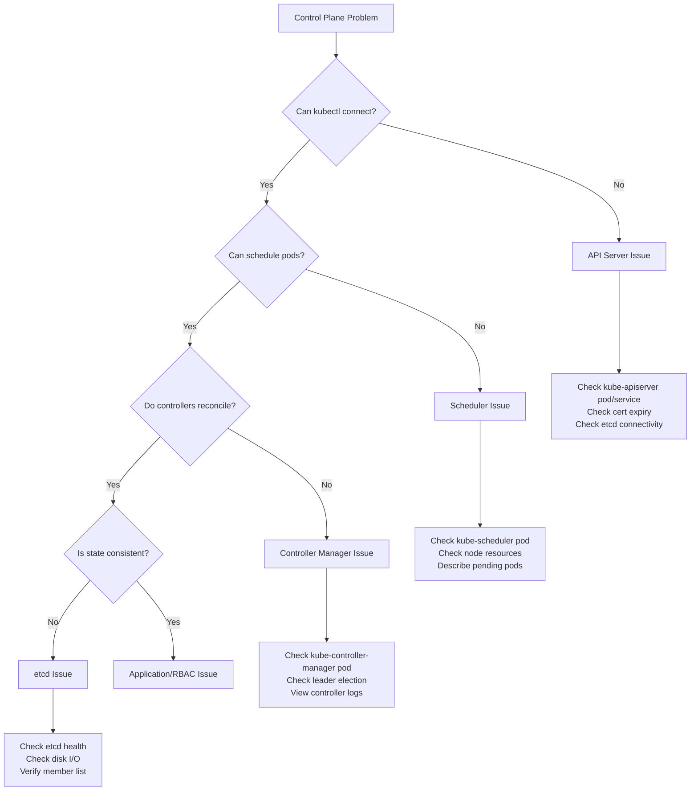

# 5.9.1 Troubleshooting Control Plane Components

#### Why Control Plane Troubleshooting Matters

When the control plane breaks, the entire cluster management layer stops. You cannot deploy new workloads, scale, or make configuration changes. Existing pods on worker nodes continue running, but cluster intelligence is blind. Control plane failures typically involve:

* **API Server** – All kubectl commands fail
* **etcd** – Cluster state is lost or stale
* **Scheduler** – Pods stuck in Pending forever
* **Controller Manager** – Deployments don't reconcile, ReplicaSets drift

This note covers diagnosing and fixing each control plane component. Note 5.9.2 covers worker node (compute plane) troubleshooting; note 5.9.3 covers monitoring.

**Backlinks:** [5.1.1 - Architecture](../Subchapter_5.1/5.1.1_K8s_Architecture_Components.md) | [5.2.2 - etcd Backup](../Subchapter_5.2/5.2.2_etcd_Backup_Restore_and_Disaster_Recovery.md) | [5.2.1 - HA Architecture](../Subchapter_5.2/5.2.1_HA_Cluster_Architecture_Multi_Master.md)

---

## Part 1: Control Plane Troubleshooting Overview



### Control Plane Components Location

| Component | kubeadm Cluster | Systemd-managed |
|-----------|----------------|-----------------|
| **kube-apiserver** | Static pod: `/etc/kubernetes/manifests/kube-apiserver.yaml` | `/etc/systemd/system/kube-apiserver.service` |
| **etcd** | Static pod: `/etc/kubernetes/manifests/etcd.yaml` | `/etc/systemd/system/etcd.service` |
| **kube-scheduler** | Static pod: `/etc/kubernetes/manifests/kube-scheduler.yaml` | `/etc/systemd/system/kube-scheduler.service` |
| **kube-controller-manager** | Static pod: `/etc/kubernetes/manifests/kube-controller-manager.yaml` | `/etc/systemd/system/kube-controller-manager.service` |

---

## Part 2: API Server Troubleshooting

### Symptom: kubectl Commands Fail

```bash
# Error: connection refused
kubectl get pods
# The connection to the server localhost:8080 was refused

# Error: certificate issues
# Unable to connect to the server: x509: certificate signed by unknown authority
```

### Diagnosis Steps

```bash
# --- Step 1: Check API server pod (kubeadm) ---
# SSH to control plane node first
ssh master-1

# View kube-apiserver pod
kubectl get pod -n kube-system kube-apiserver-master-1
# If kubectl is broken, use crictl
crictl pods --name kube-apiserver
crictl ps | grep apiserver

# --- Step 2: Check API server logs ---
kubectl logs -n kube-system kube-apiserver-master-1
# or directly via crictl
crictl logs $(crictl ps | grep apiserver | awk '{print $1}')

# --- Step 3: Check static pod manifest ---
cat /etc/kubernetes/manifests/kube-apiserver.yaml

# --- Step 4: Check API server health endpoint ---
curl -k https://localhost:6443/healthz
# Expected: ok

# --- Step 5: Check etcd connectivity ---
ETCDCTL_API=3 etcdctl \
  --cacert=/etc/kubernetes/pki/etcd/ca.crt \
  --cert=/etc/kubernetes/pki/etcd/server.crt \
  --key=/etc/kubernetes/pki/etcd/server.key \
  endpoint health
```

### Common API Server Issues

| Symptom | Cause | Fix |
|---------|-------|-----|
| `connection refused to port 6443` | API server not running | Check pod, restart static pod by touching manifest |
| `x509: certificate expired` | TLS cert expired | Renew with `kubeadm certs renew all` |
| `etcd connection refused` | etcd down | Fix etcd first |
| `localhost:8080 refused` | KUBECONFIG not set | `export KUBECONFIG=/etc/kubernetes/admin.conf` |
| `401 Unauthorized` | Token/cert mismatch | Regenerate kubeconfig |

### Certificate Renewal

```bash
# Check certificate expiry
kubeadm certs check-expiration
# CERTIFICATE                EXPIRES                  RESIDUAL TIME   EXTERNALLY MANAGED
# admin.conf                 Jan 15, 2026 11:00 UTC   364d            no
# apiserver                  Jan 15, 2026 11:00 UTC   364d            no
# ...

# Renew all certificates
kubeadm certs renew all

# Renew specific cert
kubeadm certs renew apiserver

# After renewal, restart static pods
# Move manifest out and back (triggers kubelet restart)
mv /etc/kubernetes/manifests/kube-apiserver.yaml /tmp/
sleep 5
mv /tmp/kube-apiserver.yaml /etc/kubernetes/manifests/
```

### Restart Static Pods (kubeadm)

```bash
# Method 1: Touch the manifest (triggers kubelet)
touch /etc/kubernetes/manifests/kube-apiserver.yaml

# Method 2: Move manifest temporarily
mv /etc/kubernetes/manifests/kube-apiserver.yaml /tmp/
sleep 5
mv /tmp/kube-apiserver.yaml /etc/kubernetes/manifests/

# Method 3: Edit manifest (kubelet detects change)
vim /etc/kubernetes/manifests/kube-apiserver.yaml
# Save → kubelet recreates pod

# Verify API server is back
kubectl get componentstatuses
curl -k https://localhost:6443/healthz
```

---

## Part 3: etcd Troubleshooting

### Symptom: Cluster State Issues

```bash
# API server logs show etcd errors
kubectl logs -n kube-system kube-apiserver-master-1 | grep etcd
# failed to connect to etcd: dial tcp 127.0.0.1:2379: connect: connection refused
```

### etcd Diagnosis Commands

```bash
# Set etcdctl environment
export ETCDCTL_API=3
export ETCD_CERTS="--cacert=/etc/kubernetes/pki/etcd/ca.crt \
  --cert=/etc/kubernetes/pki/etcd/server.crt \
  --key=/etc/kubernetes/pki/etcd/server.key"

# Check etcd pod
kubectl get pod -n kube-system etcd-master-1
crictl ps | grep etcd

# Check etcd health
etcdctl endpoint health $ETCD_CERTS \
  --endpoints=https://127.0.0.1:2379
# https://127.0.0.1:2379 is healthy: successfully committed proposal

# Check etcd member list
etcdctl member list $ETCD_CERTS \
  --endpoints=https://127.0.0.1:2379 -w table
# +------------------+---------+----------+---------------------------+---------------------------+
# |       ID         | STATUS  |   NAME   |        PEER ADDRS         |      CLIENT ADDRS         |
# +------------------+---------+----------+---------------------------+---------------------------+
# | 8211f1d0f64f3269 | started | master-1 | https://10.0.0.10:2380    | https://10.0.0.10:2379    |
# +------------------+---------+----------+---------------------------+---------------------------+

# Check etcd leader
etcdctl endpoint status $ETCD_CERTS \
  --endpoints=https://127.0.0.1:2379 -w table

# Check etcd logs
kubectl logs -n kube-system etcd-master-1
crictl logs $(crictl ps | grep etcd | awk '{print $1}')
```

### etcd Quorum and Member Management

```bash
# Quorum requirement: (n/2)+1 members must be healthy
# 3 members: 2 needed for quorum
# 5 members: 3 needed for quorum

# Remove failed member (after hardware failure)
etcdctl member remove <member-id> $ETCD_CERTS \
  --endpoints=https://127.0.0.1:2379

# Add new member
etcdctl member add master-2 \
  --peer-urls=https://10.0.0.11:2380 $ETCD_CERTS \
  --endpoints=https://127.0.0.1:2379
```

### etcd Defragmentation (Performance)

```bash
# Check etcd database size
etcdctl endpoint status $ETCD_CERTS \
  --endpoints=https://127.0.0.1:2379 -w table
# dbSize shows current size

# Defragment (free up space)
etcdctl defrag $ETCD_CERTS \
  --endpoints=https://127.0.0.1:2379

# Set compaction (remove old revisions)
etcdctl compact $(etcdctl endpoint status $ETCD_CERTS \
  --endpoints=https://127.0.0.1:2379 -w json | jq '.[][\"Status\"][\"header\"][\"revision\"]') \
  $ETCD_CERTS --endpoints=https://127.0.0.1:2379
```

### etcd Disk Issues

```bash
# etcd is extremely sensitive to disk latency
# Check disk I/O
iostat -x 1 10
# await > 10ms can cause etcd leader elections

# Check fsync latency (etcd logs)
kubectl logs -n kube-system etcd-master-1 | grep "slow fdatasync"

# etcd on SSD: required for production
# Place etcd data on dedicated fast disk
# etcd manifest: --data-dir=/var/lib/etcd (map to SSD)
```

---

## Part 4: Scheduler Troubleshooting

### Symptom: Pods Stuck in Pending

```bash
kubectl get pods
# NAME      READY   STATUS    RESTARTS   AGE
# mypod     0/1     Pending   0          5m

kubectl describe pod mypod
# Events:
#   Type     Reason            Message
#   Warning  FailedScheduling  0/3 nodes are available: 3 Insufficient cpu
```

### Scheduler Diagnosis

```bash
# Check scheduler pod
kubectl get pod -n kube-system kube-scheduler-master-1
kubectl logs -n kube-system kube-scheduler-master-1

# View scheduler static manifest
cat /etc/kubernetes/manifests/kube-scheduler.yaml

# Check scheduler binding decisions
kubectl get events --field-selector reason=Scheduled
kubectl get events --field-selector reason=FailedScheduling

# Check if scheduler is the leader (HA)
kubectl get lease -n kube-system kube-scheduler
# NAME            HOLDER                              AGE
# kube-scheduler  master-1_8ab3c4d5-xxxx             5d
```

### Scheduling Failure Categories

| Error Message | Root Cause | Fix |
|--------------|------------|-----|
| `Insufficient cpu` | CPU requests exceed node capacity | Add nodes / reduce requests |
| `Insufficient memory` | Memory requests exceed node capacity | Add nodes / reduce requests |
| `node(s) had untolerated taint` | Pod missing toleration | Add toleration to pod |
| `node(s) didn't match node selector` | nodeSelector label missing | Add label to node |
| `pod has unbound PVCs` | PVC not bound | Fix StorageClass or create PV |
| `0/N nodes are available` | All nodes blocked | Check all conditions above |

```bash
# Check node capacity vs allocated
kubectl describe nodes | grep -A 6 "Allocated resources"
# Resource           Requests   Limits
# cpu                1950m/2    2500m/2
# memory             1Gi/2Gi    1Gi/2Gi

# Check node resources
kubectl top nodes
```

---

## Part 5: Controller Manager Troubleshooting

### Symptom: Deployments Don't Reconcile

```bash
# Deployment shows wrong replica count but doesn't self-heal
kubectl get deployment myapp
# READY   UP-TO-DATE   AVAILABLE
# 2/5     2            2        ← Should be 5/5

# ReplicaSet not creating pods
kubectl get rs -l app=myapp
kubectl describe rs myapp-xxxxx
```

### Controller Manager Diagnosis

```bash
# Check controller manager pod
kubectl get pod -n kube-system kube-controller-manager-master-1
kubectl logs -n kube-system kube-controller-manager-master-1

# Check leader election (HA clusters)
kubectl get lease -n kube-system kube-controller-manager

# Check specific controller logs
kubectl logs -n kube-system kube-controller-manager-master-1 | grep -i "deployment-controller"
kubectl logs -n kube-system kube-controller-manager-master-1 | grep -i "error"
```

### Controller Manager Issues

| Issue | Symptom | Fix |
|-------|---------|-----|
| CM not running | Deployments don't scale | Restart static pod |
| Leader election failed | Multiple CMs fighting | Check network, restart |
| Node lifecycle issues | Pods not evicted from failed nodes | Check `--node-monitor-grace-period` |
| Endpoint controller broken | Services have wrong endpoints | Check CM logs |

```bash
# Force controller manager restart
touch /etc/kubernetes/manifests/kube-controller-manager.yaml
```

---

## Part 6: Component Status Check (All at Once)

```bash
# Check all control plane components at once
kubectl get componentstatuses
# NAME                 STATUS    MESSAGE   ERROR
# controller-manager   Healthy   ok
# scheduler            Healthy   ok
# etcd-0               Healthy   {"health":"true"}

# Note: componentstatuses is deprecated in newer K8s
# Alternative:
kubectl get pods -n kube-system

# Check all system pod statuses
kubectl get pods -n kube-system -o wide

# Check API server, scheduler, controller-manager health
curl -k https://localhost:6443/healthz        # API Server
curl -k https://localhost:10257/healthz       # Controller Manager
curl -k https://localhost:10259/healthz       # Scheduler
```

### Full Control Plane Health Check Script

```bash
#!/bin/bash
echo "=== API Server Health ==="
curl -sk https://localhost:6443/healthz

echo -e "\n=== etcd Health ==="
ETCDCTL_API=3 etcdctl \
  --cacert=/etc/kubernetes/pki/etcd/ca.crt \
  --cert=/etc/kubernetes/pki/etcd/server.crt \
  --key=/etc/kubernetes/pki/etcd/server.key \
  endpoint health --endpoints=https://127.0.0.1:2379

echo -e "\n=== Scheduler Health ==="
curl -sk https://localhost:10259/healthz

echo -e "\n=== Controller Manager Health ==="
curl -sk https://localhost:10257/healthz

echo -e "\n=== Control Plane Pods ==="
kubectl get pods -n kube-system | grep -E "apiserver|etcd|scheduler|controller"

echo -e "\n=== Certificate Expiry ==="
kubeadm certs check-expiration 2>/dev/null | head -20
```

---

## Part 7: Cluster Upgrade Troubleshooting

### kubeadm Upgrade Issues

```bash
# Plan upgrade
kubeadm upgrade plan
# [upgrade] fetching cluster k8s version from API server
# Components that must be upgraded manually after you have upgraded the control plane with 'kubeadm upgrade apply':
# COMPONENT   CURRENT   TARGET
# kubelet     v1.28.0   v1.29.0

# Apply upgrade to control plane
kubeadm upgrade apply v1.29.0

# If upgrade fails
kubeadm upgrade apply v1.29.0 --dry-run  # Dry run first

# Check version skew (kubelet must be within 1 minor version of API server)
kubectl get nodes
# NAME     STATUS   ROLES   VERSION
# master   Ready    cp      v1.29.0
# worker   Ready    <none>  v1.28.0  ← OK (1 minor version skew allowed)
```

---

## Part 8: Quick Control Plane Diagnostic Commands

```bash
# === API SERVER ===
kubectl get pod -n kube-system kube-apiserver-$(hostname)
kubectl logs -n kube-system kube-apiserver-$(hostname) --tail=50
curl -k https://localhost:6443/healthz
kubeadm certs check-expiration

# === etcd ===
ETCDCTL_API=3 etcdctl endpoint health \
  --cacert=/etc/kubernetes/pki/etcd/ca.crt \
  --cert=/etc/kubernetes/pki/etcd/server.crt \
  --key=/etc/kubernetes/pki/etcd/server.key \
  --endpoints=https://127.0.0.1:2379
ETCDCTL_API=3 etcdctl member list \
  --cacert=/etc/kubernetes/pki/etcd/ca.crt \
  --cert=/etc/kubernetes/pki/etcd/server.crt \
  --key=/etc/kubernetes/pki/etcd/server.key \
  --endpoints=https://127.0.0.1:2379

# === SCHEDULER ===
kubectl get pod -n kube-system kube-scheduler-$(hostname)
kubectl logs -n kube-system kube-scheduler-$(hostname) --tail=50
kubectl get lease -n kube-system kube-scheduler

# === CONTROLLER MANAGER ===
kubectl get pod -n kube-system kube-controller-manager-$(hostname)
kubectl logs -n kube-system kube-controller-manager-$(hostname) --tail=50
kubectl get lease -n kube-system kube-controller-manager

# === EVENTS ===
kubectl get events -n kube-system --sort-by='.lastTimestamp'
kubectl get events --all-namespaces --sort-by='.lastTimestamp' | tail -30
```

---

## Summary Table: Control Plane Components

| Component | Port | Health Check | Log Command | Static Pod Path |
|-----------|------|-------------|-------------|-----------------|
| **kube-apiserver** | 6443 | `curl -k https://localhost:6443/healthz` | `kubectl logs -n kube-system kube-apiserver-...` | `/etc/kubernetes/manifests/kube-apiserver.yaml` |
| **etcd** | 2379 | `etcdctl endpoint health` | `kubectl logs -n kube-system etcd-...` | `/etc/kubernetes/manifests/etcd.yaml` |
| **kube-scheduler** | 10259 | `curl -k https://localhost:10259/healthz` | `kubectl logs -n kube-system kube-scheduler-...` | `/etc/kubernetes/manifests/kube-scheduler.yaml` |
| **kube-controller-manager** | 10257 | `curl -k https://localhost:10257/healthz` | `kubectl logs -n kube-system kube-controller-manager-...` | `/etc/kubernetes/manifests/kube-controller-manager.yaml` |

---

**Next note (5.9.2)** covers **Compute Plane Troubleshooting** – worker node failures, kubelet issues, CNI problems, pod-level debugging.

**Backlinks:** [5.1.1 - Architecture](../Subchapter_5.1/5.1.1_K8s_Architecture_Components.md) | [5.2.2 - etcd](../Subchapter_5.2/5.2.2_etcd_Backup_Restore_and_Disaster_Recovery.md) | [5.8.1 - Authentication](../Subchapter_5.8/5.8.1_Authentication_Methods.md)
