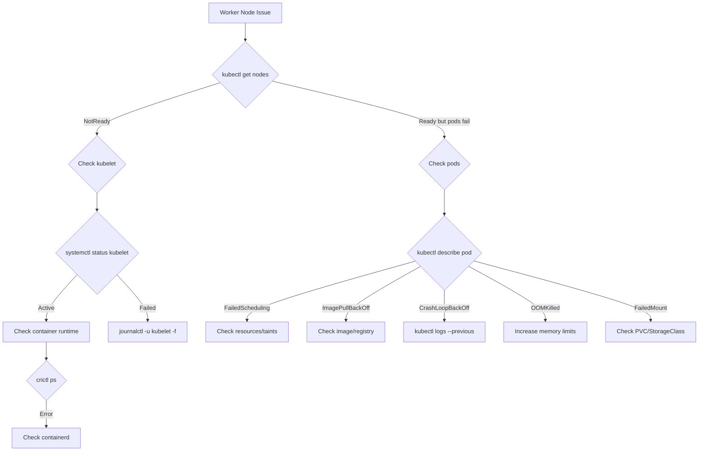

# 5.9.2 Troubleshooting Compute Plane: Worker Nodes, Pods, and Networking

#### Why Compute Plane Troubleshooting Matters

Worker nodes are where workloads run. Failures here impact application availability directly. Unlike control plane failures (which affect management), compute plane failures affect running applications. This note covers:

* **Worker node health** – kubelet, container runtime, disk, memory
* **Pod-level debugging** – CrashLoopBackOff, OOMKilled, ImagePullBackOff, Pending
* **Networking** – CNI failures, DNS, Service connectivity
* **Systematic debugging workflows**

Note 5.9.1 covers control plane troubleshooting; note 5.9.3 covers monitoring.

**Backlinks:** [5.3.1 - Pod Fundamentals](../Subchapter_5.3/5.3.1_Pod_Fundamentals_and_Lifecycle.md) | [5.4.1 - Services](../Subchapter_5.4/5.4.1_Services_ClusterIP_NodePort_LoadBalancer.md) | [5.9.1 - Control Plane](./5.9.1_Troubleshooting_Control_Plane.md)

> **Tip:** For any pod problem, run these three commands in order: `kubectl describe pod <name>` (see the `Events:` section — 60% of root causes), `kubectl logs <name> --previous` (last crash's output), then `kubectl get pod <name> -o yaml` (check probes, limits, env). Memorise this sequence for the CKA exam.

> **Warning:** `kubectl exec` into a failing container often doesn't work — the container might not even be running. Use `kubectl debug <pod> -it --image=busybox --target=<container>` (ephemeral debug container) to inspect the pod's filesystem and network namespace without restarting it.

---

## Part 1: Worker Node Troubleshooting Workflow



---

## Part 2: Node NotReady Deep Dive

### Node Conditions

```bash
# Check node status
kubectl get nodes
# NAME       STATUS     ROLES    AGE   VERSION
# worker-1   NotReady   <none>   10d   v1.29.0

# Detailed conditions
kubectl describe node worker-1
# Conditions:
#   Type                 Status  LastHeartbeatTime           Reason
#   MemoryPressure       False   ...
#   DiskPressure         True    ...   KubeletHasDiskPressure   ← PROBLEM
#   PIDPressure          False   ...
#   Ready                False   ...   KubeletNotReady
#   NetworkUnavailable   False   ...
```

| Condition | Status: True Means | Action |
|-----------|-------------------|--------|
| `Ready` | Node is healthy | Normal |
| `MemoryPressure` | Memory low → kubelet evicts pods | Free memory, add nodes |
| `DiskPressure` | Disk full → kubelet evicts pods | Clean images/logs |
| `PIDPressure` | Too many processes | Reduce pod density |
| `NetworkUnavailable` | CNI not configured | Install/fix CNI |

### On-Node Diagnosis

```bash
# SSH to the worker node first
ssh worker-1

# === 1. kubelet status ===
systemctl status kubelet
# ● kubelet.service - kubelet: The Kubernetes Node Agent
#    Loaded: loaded
#    Active: active (running)  ← or failed

# If failed:
journalctl -u kubelet -f
journalctl -u kubelet --since "10 minutes ago" | tail -50

# === 2. Container runtime ===
systemctl status containerd
crictl ps  # List running containers
crictl images  # List cached images

# === 3. Disk space ===
df -h
# Most important: /var (containerd images, pod logs)
du -sh /var/lib/containerd  # Image cache
du -sh /var/log/pods         # Pod logs

# Clean up
crictl rmi --prune  # Remove unused images
journalctl --vacuum-size=500M  # Trim journal logs
find /var/log/pods -name "*.log" -size +100M  # Large log files

# === 4. Memory ===
free -h
# Swap should be off
swapon --show  # Should be empty

# === 5. Network ===
ip addr show
ip route show
ping 10.96.0.1  # Kubernetes service CIDR gateway
curl -k https://<api-server-ip>:6443/healthz

# === 6. kubelet config ===
cat /var/lib/kubelet/config.yaml
cat /etc/kubernetes/kubelet.conf
```

### Fix and Restart kubelet

```bash
# Fix and restart kubelet
systemctl daemon-reload
systemctl restart kubelet

# Watch node become Ready
kubectl get nodes -w

# If kubelet config is wrong, regenerate
kubeadm reset  # Last resort (removes all cluster config)
kubeadm join ...  # Rejoin
```

---

## Part 3: Pod Status Deep Dive

### Systematic Pod Debugging

```bash
# Step 1: Get pod status
kubectl get pods -o wide
kubectl get pods --all-namespaces

# Step 2: Describe for events
kubectl describe pod mypod
# Focus on:
# - Status section
# - Conditions section  
# - Events section (scroll to bottom)

# Step 3: Get logs
kubectl logs mypod
kubectl logs mypod --previous  # Previous container (post-crash)
kubectl logs mypod -c sidecar  # Specific container
kubectl logs mypod --all-containers  # All containers

# Step 4: Exec into pod
kubectl exec -it mypod -- /bin/sh

# Step 5: Check pod in cluster context
kubectl get events --field-selector involvedObject.name=mypod
```

---

## Part 4: CrashLoopBackOff

### Symptom

```bash
kubectl get pods
# NAME      READY   STATUS             RESTARTS   AGE
# mypod     0/1     CrashLoopBackOff   5          3m
```

### Diagnosis

```bash
# 1. View previous container logs (MOST IMPORTANT)
kubectl logs mypod --previous

# 2. Check exit code
kubectl get pod mypod -o jsonpath='{.status.containerStatuses[0].lastState.terminated.exitCode}'
# 0 = success (but restarting with Always policy)
# 1 = generic error
# 137 = OOMKilled (128 + 9 SIGKILL)
# 143 = SIGTERM (graceful shutdown failed)
# 127 = command not found

# 3. Check events
kubectl describe pod mypod | grep -A 15 Events

# 4. Check restart count and last state
kubectl get pod mypod -o yaml | grep -A 15 lastState
```

### Exit Code Reference

| Exit Code | Signal | Meaning |
|-----------|--------|---------|
| 0 | - | Success (but Always restartPolicy restarts it) |
| 1 | - | Generic error |
| 2 | - | Misuse of shell built-in |
| 126 | - | Permission denied |
| 127 | - | Command not found |
| 130 | SIGINT | Ctrl+C |
| 137 | SIGKILL | OOMKilled or force killed |
| 143 | SIGTERM | Graceful shutdown requested |

### Common Causes and Fixes

```bash
# Cause: Wrong command
kubectl logs mypod --previous
# /bin/sh: myapp: not found

# Fix: Check command in pod spec
kubectl get pod mypod -o yaml | grep -A 5 command

# Cause: Missing config file
# /etc/config.yaml: no such file or directory

# Fix: Mount ConfigMap
kubectl get configmaps
kubectl get pod mypod -o yaml | grep -A 10 volumeMounts

# Cause: Dependency not ready
# Error: dial tcp postgres:5432: connection refused

# Fix: Add initContainer
cat <<EOF | kubectl apply -f -
initContainers:
- name: wait-db
  image: busybox
  command: ['sh', '-c', 'until nc -z postgres 5432; do sleep 2; done']
EOF
```

### Debug Override (Crash Before Logs)

```bash
# Override command to sleep so you can exec in
kubectl get pod mypod -o yaml > /tmp/debug-pod.yaml

# Edit: change command to sleep
# command: ["sleep", "3600"]
# args: []

# Replace pod
kubectl delete pod mypod
kubectl apply -f /tmp/debug-pod.yaml

# Exec in and run original command manually
kubectl exec -it mypod -- /bin/sh
/app # ./myapp  # See the actual error
```

---

## Part 5: ImagePullBackOff and ErrImagePull

### Symptom

```bash
kubectl get pods
# NAME    READY   STATUS             RESTARTS   AGE
# mypod   0/1     ImagePullBackOff   0          1m
```

### Diagnosis

```bash
# Check events for image pull error
kubectl describe pod mypod | grep -A 10 Events
# Failed to pull image "myapp:v2": rpc error: code = NotFound desc = failed to pull

# Check image name in pod spec
kubectl get pod mypod -o jsonpath='{.spec.containers[*].image}'

# Test pull manually on node
crictl pull myapp:v2
# or
docker pull myapp:v2
```

### Fix: Private Registry

```bash
# Create docker registry secret
kubectl create secret docker-registry regcred \
  --docker-server=registry.example.com \
  --docker-username=myuser \
  --docker-password=mypassword \
  --docker-email=me@example.com

# Reference in pod
kubectl patch deployment myapp -p '
{
  "spec": {
    "template": {
      "spec": {
        "imagePullSecrets": [{"name": "regcred"}]
      }
    }
  }
}'

# Verify secret
kubectl get secret regcred -o yaml
```

### Common Image Issues

| Error | Cause | Fix |
|-------|-------|-----|
| `not found` | Wrong tag/name | Fix image name |
| `unauthorized` | No auth to private registry | Add `imagePullSecrets` |
| `no such host` | DNS failure | Check CoreDNS |
| `connection refused` | Registry unreachable | Check network/firewall |
| `x509: certificate signed by unknown authority` | Self-signed registry cert | Add CA to node trust |

---

## Part 6: OOMKilled (Out of Memory)

### Symptom

```bash
kubectl get pods
# NAME    READY   STATUS      RESTARTS   AGE
# mypod   0/1     OOMKilled   2          5m

kubectl describe pod mypod | grep -A 5 "Last State"
# Last State:   Terminated
#   Reason:     OOMKilled
#   Exit Code:  137
```

### Diagnosis

```bash
# Check memory limits
kubectl get pod mypod -o jsonpath='{.spec.containers[0].resources}'

# Check actual memory usage (before OOM)
kubectl top pod mypod --containers
kubectl top pods --all-namespaces | sort -k4 -nr | head -10

# Check node memory
kubectl top nodes
kubectl describe node worker-1 | grep -A 10 "Allocatable"
```

### Fix: Increase Memory Limits

```bash
# For deployment
kubectl set resources deployment myapp \
  --requests=memory=512Mi \
  --limits=memory=1Gi

# Or edit inline
kubectl edit deployment myapp
# spec.template.spec.containers[0].resources:
#   requests:
#     memory: 512Mi
#   limits:
#     memory: 1Gi

# Verify
kubectl rollout status deployment myapp
kubectl top pod -l app=myapp
```

---

## Part 7: Pending Pods

### Symptom

```bash
kubectl get pods
# NAME    READY   STATUS    RESTARTS   AGE
# mypod   0/1     Pending   0          10m
```

### Diagnosis

```bash
# Check scheduling events (most revealing)
kubectl describe pod mypod | grep -A 20 Events
# 0/3 nodes are available: insufficient cpu (2)
# 0/3 nodes are available: 1 node(s) had untolerated taint (1)
# 0/3 nodes are available: pod has unbound PersistentVolumeClaims (3)

# Check node resources
kubectl top nodes
kubectl describe nodes | grep -A 8 "Allocated resources"

# Check node taints
kubectl describe nodes | grep Taints

# Check PVC status
kubectl get pvc
```

### Fix Per Cause

```bash
# --- Fix: Insufficient CPU/Memory ---
# Option 1: Reduce pod requests
kubectl patch pod mypod --patch '{"spec":{"containers":[{"name":"app","resources":{"requests":{"cpu":"100m","memory":"128Mi"}}}]}}'

# Option 2: Add node
kubeadm join ...  # kubeadm
# or scale node group in cloud

# --- Fix: Taint toleration ---
kubectl taint nodes worker-1 key-  # Remove taint
# or add toleration to pod spec

# --- Fix: PVC not bound ---
kubectl get pvc mypvc
# Look for STATUS = Pending

kubectl describe pvc mypvc
# Events: waiting for first consumer or no storageclass found

# Create/fix StorageClass
kubectl get storageclass
kubectl patch storageclass standard -p '{"metadata":{"annotations":{"storageclass.kubernetes.io/is-default-class":"true"}}}'
```

---

## Part 8: Network Troubleshooting

### CNI Issues

```bash
# Symptom: pods can't communicate
kubectl exec pod-a -- ping <pod-b-ip>
# unreachable

# Check CNI pods (Calico example)
kubectl get pods -n calico-system
kubectl get pods -n kube-system | grep -E "calico|flannel|cilium|weave"

# Check CNI logs
kubectl logs -n calico-system $(kubectl get pods -n calico-system -l k8s-app=calico-node -o name | head -1)

# Check CNI config on node
ls /etc/cni/net.d/
cat /etc/cni/net.d/10-calico.conflist

# Reinstall CNI if broken
kubectl apply -f https://raw.githubusercontent.com/projectcalico/calico/v3.27/manifests/calico.yaml
```

### Service Connectivity Issues

```bash
# Test service from pod
kubectl run test --rm -it --image=nicolaka/netshoot -- bash
# Inside netshoot:
curl http://myservice.mynamespace.svc.cluster.local:8080
nslookup myservice
dig myservice.mynamespace.svc.cluster.local

# Check service endpoints (most common issue)
kubectl get endpoints myservice
# NAME        ENDPOINTS         AGE
# myservice   <none>   ← PROBLEM: no pods match selector

# Check if pods match service selector
kubectl get pods --show-labels -l app=myapp
kubectl get svc myservice -o jsonpath='{.spec.selector}'

# Fix: Add missing labels to pods
kubectl label pods mypod app=myapp

# Test kube-proxy rules
iptables -t nat -L KUBE-SERVICES -n | grep myservice
```

---

## Part 9: CoreDNS Troubleshooting

### DNS Resolution Failures

```bash
# Symptom: pod can't resolve service names
kubectl exec mypod -- nslookup kubernetes.default
# Server:    10.96.0.10
# ;; connection timed out; no servers could be reached

# Step 1: Check CoreDNS pods
kubectl get pods -n kube-system -l k8s-app=kube-dns
kubectl describe pods -n kube-system -l k8s-app=kube-dns

# Step 2: Check CoreDNS logs
kubectl logs -n kube-system -l k8s-app=kube-dns

# Step 3: Check CoreDNS ConfigMap
kubectl get cm -n kube-system coredns -o yaml

# Step 4: Verify DNS service
kubectl get svc -n kube-system kube-dns
# NAME       TYPE        CLUSTER-IP   PORT(S)                  AGE
# kube-dns   ClusterIP   10.96.0.10   53/UDP,53/TCP,9153/TCP   10d

# Step 5: Test DNS from debug pod
kubectl run dns-test --rm -it --image=busybox -- /bin/sh
nslookup kubernetes.default
nslookup google.com  # External DNS
```

### CoreDNS ConfigMap (Corefile)

```bash
kubectl get cm -n kube-system coredns -o yaml
# data:
#   Corefile: |
#     .:53 {
#         errors
#         health {
#            lameduck 5s
#         }
#         ready
#         kubernetes cluster.local in-addr.arpa ip6.arpa {
#            pods insecure
#            fallthrough in-addr.arpa ip6.arpa
#            ttl 30
#         }
#         prometheus :9153
#         forward . /etc/resolv.conf {
#            max_concurrent 1000
#         }
#         cache 30
#         loop
#         reload
#         loadbalance
#     }
```

### Restart CoreDNS

```bash
kubectl rollout restart deployment -n kube-system coredns
kubectl get pods -n kube-system -l k8s-app=kube-dns -w
```

---

## Part 10: Quick Diagnostic Commands

```bash
# === ALL PODS STATUS ===
kubectl get pods --all-namespaces -o wide

# === FAILING PODS ===
kubectl get pods -A | grep -Ev "Running|Completed"

# === RECENT EVENTS ===
kubectl get events --all-namespaces --sort-by='.lastTimestamp' | tail -30

# === POD LOGS ===
kubectl logs mypod --previous
kubectl logs mypod -c container-name --previous

# === EXEC DEBUG ===
kubectl exec -it mypod -- /bin/sh
kubectl debug mypod -it --image=busybox --target=mypod

# === RESOURCE USAGE ===
kubectl top pods --all-namespaces --sort-by=memory
kubectl top nodes

# === NODE DEBUG ===
kubectl debug node/worker-1 -it --image=ubuntu
# Inside: chroot /host → access node filesystem

# === FORCE DELETE STUCK PODS ===
kubectl delete pod mypod --force --grace-period=0

# === CORDON AND DRAIN ===
kubectl cordon worker-1              # No new pods
kubectl drain worker-1 --ignore-daemonsets --delete-emptydir-data
kubectl uncordon worker-1            # Re-enable

# === NETWORK DEBUG ===
kubectl run netshoot --rm -it --image=nicolaka/netshoot -- bash
```

---

## Summary: Pod Status and Fixes

| Status | Common Cause | First Command | Fix |
|--------|-------------|---------------|-----|
| **Pending** | Insufficient resources, taint, PVC | `kubectl describe pod` | Add nodes, toleration, PV |
| **ContainerCreating** | Image pull, volume mount | `kubectl describe pod` | Fix image/registry/PVC |
| **ImagePullBackOff** | Wrong image/no auth | `kubectl describe pod` | Fix image name, add secret |
| **CrashLoopBackOff** | App error on startup | `kubectl logs --previous` | Fix app, config, deps |
| **OOMKilled** | Memory limit too low | `kubectl describe pod` | Increase memory limit |
| **Evicted** | Node disk/memory pressure | `kubectl describe pod` | Clean node, add capacity |
| **Terminating** | Finalizer blocking deletion | `kubectl get pod -o yaml` | Remove finalizer, force delete |
| **Unknown** | Node lost communication | `kubectl get nodes` | Fix kubelet on node |

### Worker Node Troubleshooting Commands

| Command | Purpose |
|---------|---------|
| `systemctl status kubelet` | Check kubelet service |
| `journalctl -u kubelet -f` | kubelet logs |
| `systemctl status containerd` | Check container runtime |
| `crictl ps` | List running containers |
| `crictl images` | List cached images |
| `crictl rmi --prune` | Remove unused images |
| `df -h` | Disk usage |
| `free -h` | Memory usage |
| `kubectl cordon NODE` | Stop scheduling new pods |
| `kubectl drain NODE --ignore-daemonsets` | Evict all pods |
| `kubectl uncordon NODE` | Resume scheduling |

---

**Next note (5.9.3)** covers **Monitoring with Prometheus, Grafana, and Logging**.

**Backlinks:** [5.9.1 - Control Plane](./5.9.1_Troubleshooting_Control_Plane.md) | [5.4.1 - Services](../Subchapter_5.4/5.4.1_Services_ClusterIP_NodePort_LoadBalancer.md) | [5.3.1 - Pod Fundamentals](../Subchapter_5.3/5.3.1_Pod_Fundamentals_and_Lifecycle.md)
