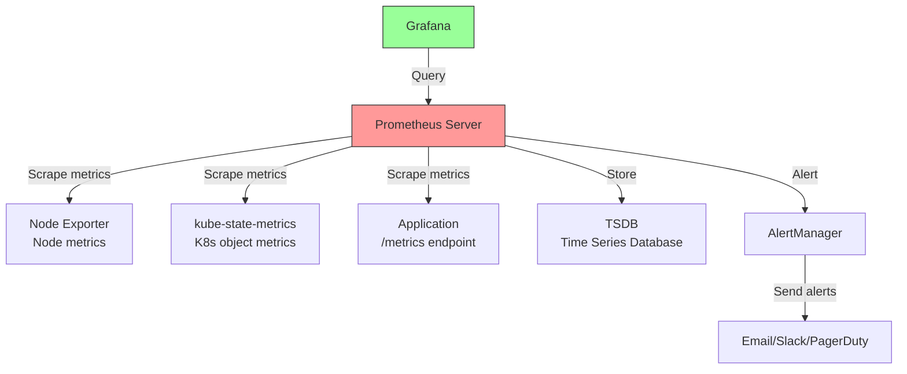
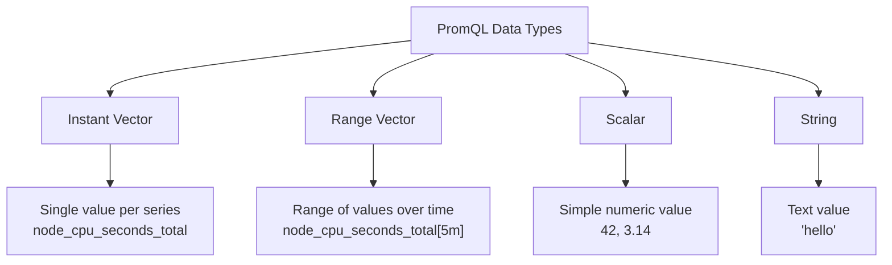

# 5.9.3 Monitoring with Prometheus, Grafana, and Logging: Observability Stack

#### Why Monitoring Matters

`kubectl get pods` tells you if a pod is running. But running doesn't mean healthy. Monitoring provides:

* **Metrics** – CPU, memory, request rates, error rates (Prometheus)

* **Visualization** – Dashboards for trends and anomalies (Grafana)

* **Logging** – Centralized log aggregation (EFK/Loki)

* **Alerting** – Proactive notifications (AlertManager)

This note covers Prometheus, Grafana, and logging stacks. Notes 5.9.1 and 5.9.2 covered control plane and compute plane troubleshooting; note 5.9.4 covers Dashboard tools and k9s; note 5.9.6 is the final review.

**Backlinks:** [5.6.2 - HPA Metrics](../Subchapter_5.6/5.6.2_Autoscaling_HPA_VPA_Cluster_Autoscaler.md) | [5.9.2 - Compute Troubleshooting](./5.9.2_Troubleshooting_Compute_Plane_and_Pods.md) | [5.9.1 - Control Plane Troubleshooting](./5.9.1_Troubleshooting_Control_Plane.md) | [5.1.1 - Architecture](../Subchapter_5.1/5.1.1_K8s_Architecture_Components.md)

***

## Part 1: Prometheus Architecture



### Prometheus Components

| Component             | Purpose                                                |
| --------------------- | ------------------------------------------------------ |
| **Prometheus Server** | Scrapes, stores, queries metrics                       |
| **AlertManager**      | Routes alerts to receivers                             |
| **Exporters**         | Expose metrics from systems (node, kube-state-metrics) |
| **Grafana**           | Dashboard visualization                                |
| **Pushgateway**       | Short-lived job metrics (batch jobs)                   |

***

## Part 2: Installing Prometheus Stack (kube-prometheus-stack)

The easiest way to deploy full monitoring is with the Prometheus community Helm chart.

```bash
# Add repo
helm repo add prometheus-community https://prometheus-community.github.io/helm-charts
helm repo update

# Install kube-prometheus-stack
helm install prometheus prometheus-community/kube-prometheus-stack \
  --namespace monitoring \
  --create-namespace \
  --set grafana.adminPassword=admin
```

### Components Installed

```bash
kubectl get pods -n monitoring
# NAME                                                     READY   STATUS
# prometheus-grafana-xxx                                   2/2     Running
# prometheus-kube-state-metrics-xxx                        1/1     Running
# prometheus-prometheus-node-exporter-xxx                  1/1     Running
# prometheus-prometheus-pushgateway-xxx                    1/1     Running
# prometheus-server-xxx                                    2/2     Running
# alertmanager-prometheus-alertmanager-xxx                 2/2     Running
```

### Accessing Services

```bash
# Port-forward Prometheus
kubectl port-forward -n monitoring svc/prometheus-server 9090:80
# Access: http://localhost:9090

# Port-forward Grafana
kubectl port-forward -n monitoring svc/prometheus-grafana 3000:80
# Access: http://localhost:3000 (admin/admin)
```

***

## Part 3: PromQL – Query Language Deep Dive

### PromQL Data Types



### Basic Queries

```promql
# === KUBERNETES RESOURCE METRICS ===

# CPU usage per pod (as percentage of 1 core)
sum(rate(container_cpu_usage_seconds_total{container!=""}[5m])) by (pod, namespace) * 100

# Memory usage per pod (working set, excludes cache)
sum(container_memory_working_set_bytes{container!=""}) by (pod, namespace)

# Memory usage percentage per pod
sum(container_memory_working_set_bytes{container!=""}) by (pod) / 
sum(kube_pod_container_resource_limits{resource="memory"}) by (pod) * 100

# Pod restart count
sum(kube_pod_container_status_restarts_total) by (namespace, pod)

# Pods not ready
kube_pod_status_ready{condition="false"} == 1

# === NODE METRICS ===

# Node CPU utilization (percentage)
100 - (avg by(instance) (rate(node_cpu_seconds_total{mode="idle"}[5m])) * 100)

# Node memory utilization (percentage)
100 * (1 - (node_memory_MemAvailable_bytes / node_memory_MemTotal_bytes))

# Node disk usage (percentage)
100 - ((node_filesystem_avail_bytes{mountpoint="/"} * 100) / node_filesystem_size_bytes{mountpoint="/"})

# Node network receive rate (bytes/sec)
rate(node_network_receive_bytes_total{device!~"lo|veth.*"}[5m])

# === REQUEST METRICS (for applications exposing /metrics) ===

# Request rate per second
sum(rate(http_requests_total[1m])) by (service)

# Error rate (5xx responses)
sum(rate(http_requests_total{status=~"5.."}[5m])) / sum(rate(http_requests_total[5m])) * 100

# 95th percentile latency
histogram_quantile(0.95, sum(rate(http_request_duration_seconds_bucket[5m])) by (le, service))

# Apdex score (threshold 0.5s)
(
  sum(rate(http_request_duration_seconds_bucket{le="0.5"}[5m])) +
  sum(rate(http_request_duration_seconds_bucket{le="2.0"}[5m])) / 2
) / sum(rate(http_request_duration_seconds_count[5m]))
```

### PromQL Functions Reference

| Function | Purpose | Example |
|----------|---------|---------|
| `rate()` | Per-second average over time (for counters) | `rate(http_requests_total[5m])` |
| `irate()` | Instant per-second rate (last 2 points) | `irate(http_requests_total[5m])` |
| `increase()` | Total increase over time | `increase(http_requests_total[1h])` |
| `sum()` | Aggregate values | `sum(metric) by (label)` |
| `avg()` | Average values | `avg(metric) by (node)` |
| `max()` | Maximum value | `max(metric)` |
| `min()` | Minimum value | `min(metric)` |
| `count()` | Count series | `count(up == 1)` |
| `topk()` | Top K values | `topk(10, metric)` |
| `bottomk()` | Bottom K values | `bottomk(5, metric)` |
| `histogram_quantile()` | Percentile from histogram | `histogram_quantile(0.99, sum(rate(bucket[5m])) by (le))` |
| `absent()` | Returns 1 if no series exists | `absent(up{job="myapp"})` |
| `changes()` | Count value changes | `changes(metric[1h])` |
| `delta()` | Difference between first/last | `delta(metric[1h])` |
| `deriv()` | Per-second derivative | `deriv(metric[5m])` |
| `predict_linear()` | Predict future value | `predict_linear(metric[1h], 3600)` |
| `label_replace()` | Modify labels | `label_replace(metric, "dst", "$1", "src", "(.*)")` |
| `vector()` | Create constant vector | `vector(1)` |

### Advanced PromQL Patterns

```promql
# === GOLDEN SIGNALS ===

# Latency (95th percentile)
histogram_quantile(0.95, 
  sum(rate(http_request_duration_seconds_bucket[5m])) by (le, service)
)

# Traffic (requests per second)
sum(rate(http_requests_total[5m])) by (service)

# Errors (error rate)
sum(rate(http_requests_total{status=~"5.."}[5m])) by (service) /
sum(rate(http_requests_total[5m])) by (service)

# Saturation (resource utilization)
sum(rate(container_cpu_usage_seconds_total[5m])) by (pod) /
sum(kube_pod_container_resource_limits{resource="cpu"}) by (pod)

# === RATE OF CHANGE ===

# Predict disk full in 4 hours
predict_linear(node_filesystem_avail_bytes{mountpoint="/"}[1h], 4*3600) < 0

# Memory leak detection (positive derivative)
deriv(container_memory_working_set_bytes[1h]) > 0

# === AGGREGATION ACROSS LABELS ===

# CPU by namespace (ignore pod)
sum(rate(container_cpu_usage_seconds_total[5m])) by (namespace)

# Without specific label
sum without(pod) (rate(container_cpu_usage_seconds_total[5m]))

# === FILTERING ===

# Only critical namespaces
sum(rate(container_cpu_usage_seconds_total{namespace=~"prod|staging"}[5m])) by (namespace)

# Exclude system namespaces
sum(rate(container_cpu_usage_seconds_total{namespace!~"kube-.*|default"}[5m])) by (namespace)

# === JOINS (label matching) ===

# Pod CPU with deployment labels
sum(rate(container_cpu_usage_seconds_total[5m])) by (pod) 
* on(pod) group_left(deployment) 
kube_pod_labels{label_app="myapp"}

# === TIME OFFSET ===

# Compare to 1 day ago
rate(http_requests_total[5m]) / rate(http_requests_total[5m] offset 1d)

# === SUBQUERIES ===

# Average of max CPU over 1 hour (calculated every 5m)
avg_over_time(max(rate(container_cpu_usage_seconds_total[5m]))[1h:5m])
```

### Recording Rules (Pre-compute expensive queries)

```yaml
# prometheus-rules.yaml
groups:
- name: kubernetes.rules
  rules:
  # Pre-compute pod CPU usage
  - record: pod:container_cpu_usage:rate5m
    expr: sum(rate(container_cpu_usage_seconds_total{container!=""}[5m])) by (pod, namespace)
  
  # Pre-compute namespace CPU
  - record: namespace:container_cpu_usage:rate5m
    expr: sum(rate(container_cpu_usage_seconds_total{container!=""}[5m])) by (namespace)
  
  # Pre-compute request rate
  - record: service:http_requests:rate5m
    expr: sum(rate(http_requests_total[5m])) by (service)
  
  # Pre-compute error rate
  - record: service:http_errors:rate5m
    expr: sum(rate(http_requests_total{status=~"5.."}[5m])) by (service)
```

***

## Part 4: AlertManager Configuration

### Alert Rules Example

```yaml
# prometheus-rules.yaml
groups:
- name: kubernetes-apps
  rules:
  - alert: HighPodRestarts
    expr: kube_pod_container_status_restarts_total > 5
    for: 10m
    labels:
      severity: warning
    annotations:
      summary: "Pod {{ $labels.pod }} is restarting frequently"
      description: "Pod {{ $labels.pod }} has restarted {{ $value }} times in the last 10 minutes"

  - alert: PodCrashLooping
    expr: kube_pod_container_status_restarts_total > 10
    for: 5m
    labels:
      severity: critical
    annotations:
      summary: "Pod {{ $labels.pod }} is crash looping"

  - alert: NodeHighMemoryUsage
    expr: (1 - (node_memory_MemAvailable_bytes / node_memory_MemTotal_bytes)) * 100 > 90
    for: 10m
    labels:
      severity: warning
    annotations:
      summary: "Node {{ $labels.node }} has high memory usage"
      description: "Memory usage is {{ $value }}%"

  - alert: NodeNotReady
    expr: kube_node_status_condition{condition="Ready",status="true"} == 0
    for: 5m
    labels:
      severity: critical
    annotations:
      summary: "Node {{ $labels.node }} is not ready"

  - alert: CPUThrottlingHigh
    expr: sum(increase(container_cpu_cfs_throttled_seconds_total[5m])) by (pod) > 0
    for: 5m
    labels:
      severity: warning
    annotations:
      summary: "Pod {{ $labels.pod }} is experiencing CPU throttling"

  - alert: PVCUsageHigh
    expr: (kubelet_volume_stats_used_bytes / kubelet_volume_stats_capacity_bytes) * 100 > 85
    for: 5m
    labels:
      severity: warning
    annotations:
      summary: "PVC {{ $labels.persistentvolumeclaim }} is {{ $value }}% full"
```

### AlertManager Configuration

```yaml
# alertmanager-config.yaml
global:
  slack_api_url: 'https://hooks.slack.com/services/xxx'

route:
  group_by: ['alertname', 'namespace']
  group_wait: 10s
  group_interval: 10s
  repeat_interval: 1h
  receiver: 'default-receiver'
  routes:
  - match:
      severity: critical
    receiver: critical-receiver
    continue: true
  - match:
      severity: warning
    receiver: warning-receiver

receivers:
- name: 'default-receiver'
  slack_configs:
  - channel: '#alerts'
    title: '{{ .GroupLabels.alertname }}'
    text: '{{ range .Alerts }}{{ .Annotations.summary }}\n{{ end }}'

- name: 'critical-receiver'
  pagerduty_configs:
  - service_key: 'xxx'
  slack_configs:
  - channel: '#critical-alerts'
    title: '🚨 CRITICAL: {{ .GroupLabels.alertname }}'
```

***

## Part 5: Grafana Dashboards

### Pre-built Dashboards

```bash
# List available dashboards
kubectl get configmap -n monitoring | grep grafana-dashboard

# Common dashboards installed:
# - Kubernetes / Compute Resources / Cluster
# - Kubernetes / Compute Resources / Namespace (Pods)
# - Kubernetes / Compute Resources / Node (Pods)
# - Kubernetes / Networking / Cluster
# - Node Exporter / Nodes
```

### Import Dashboard by ID

```bash
# In Grafana UI:
# 1. Click "+" → "Import"
# 2. Enter dashboard ID:
#    - 315: Kubernetes Cluster Monitoring (Prometheus)
#    - 6417: Kubernetes / Views / Global
#    - 8588: Kubernetes / Compute Resources / Cluster
#    - 1860: Node Exporter Full
# 3. Select Prometheus data source
```

### Custom Dashboard JSON

```json
{
  "dashboard": {
    "title": "Pod Resource Usage",
    "panels": [
      {
        "title": "CPU Usage per Pod",
        "targets": [
          {
            "expr": "sum(rate(container_cpu_usage_seconds_total[5m])) by (pod)",
            "legendFormat": "{{ pod }}"
          }
        ],
        "gridPos": { "h": 8, "w": 12, "x": 0, "y": 0 }
      },
      {
        "title": "Memory Usage per Pod",
        "targets": [
          {
            "expr": "sum(container_memory_working_set_bytes) by (pod)",
            "legendFormat": "{{ pod }}"
          }
        ],
        "gridPos": { "h": 8, "w": 12, "x": 12, "y": 0 }
      }
    ]
  }
}
```

***

## Part 6: Logging with Loki (Lightweight)

Loki is a Prometheus-inspired log aggregation system.

### Installing Loki Stack

```bash
# Add Grafana repo
helm repo add grafana https://grafana.github.io/helm-charts
helm repo update

# Install Loki stack
helm install loki grafana/loki-stack \
  --namespace monitoring \
  --create-namespace \
  --set grafana.enabled=true \
  --set promtail.enabled=true
```

### LogQL – Loki Query Language

```logql
# Basic log queries
{namespace="prod", pod="myapp"}

# Filter by regex
{namespace="prod"} |= "error"
{namespace="prod"} != "debug"
{namespace="prod"} |~ "5\\d{2}"

# Log rate over time
rate({namespace="prod"}[5m])

# Count error logs
count_over_time({namespace="prod"} |= "error" [5m])

# Logs with JSON parsing
{namespace="prod"} | json | level="error"
```

### Log CLI with `kubectl logs` vs Loki

| Feature                  | kubectl logs | Loki  |
| ------------------------ | ------------ | ----- |
| Pod logs                 | Yes          | Yes   |
| Cross-pod search         | No           | Yes   |
| Cross-namespace          | No           | Yes   |
| Historical               | Limited      | Yes   |
| Query language           | No           | LogQL |
| Integration with Grafana | No           | Yes   |

***

## Part 7: EFK Stack (Elasticsearch, Fluentd, Kibana)

For larger deployments, EFK provides full-text search.

### Installing EFK

```bash
# Add Elastic repo
helm repo add elastic https://helm.elastic.co
helm repo update

# Install Elasticsearch
helm install elasticsearch elastic/elasticsearch \
  --namespace logging \
  --create-namespace \
  --set replicas=1 \
  --set resources.requests.memory=2Gi

# Install Kibana
helm install kibana elastic/kibana \
  --namespace logging

# Install Fluentd (log collector)
helm install fluentd elastic/fluentd \
  --namespace logging \
  --set elasticsearch.host=elasticsearch-master
```

### Fluentd Configuration

```yaml
# fluentd-config.yaml
apiVersion: v1
kind: ConfigMap
metadata:
  name: fluentd-config
data:
  fluent.conf: |
    <source>
      @type tail
      path /var/log/containers/*.log
      pos_file /var/log/fluentd-containers.log.pos
      tag kubernetes.*
      read_from_head true
      <parse>
        @type json
        time_format %Y-%m-%dT%H:%M:%S.%NZ
      </parse>
    </source>

    <filter kubernetes.**>
      @type kubernetes_metadata
    </filter>

    <match **>
      @type elasticsearch
      host elasticsearch-master
      port 9200
      logstash_format true
      logstash_prefix kubernetes
      <buffer>
        @type memory
        flush_interval 5s
      </buffer>
    </match>
```

***

## Part 8: Monitoring Best Practices

### Metrics to Monitor

| Category       | Metrics                           | Alert Threshold |
| -------------- | --------------------------------- | --------------- |
| **Node**       | CPU, memory, disk, network        | >80%            |
| **Pod**        | Restarts, OOM kills, ready status | Restarts >5     |
| **Container**  | CPU throttling, memory limit      | Throttling >0   |
| **API Server** | Request latency, error rate       | >1s, >1%        |
| **etcd**       | Leader changes, database size     | >3 changes/hour |
| **PVC**        | Usage percentage                  | >85%            |
| **Ingress**    | 5xx errors, latency               | >1% error, >2s  |

### Resource Monitoring Commands

```bash
# Quick resource checks
kubectl top nodes
kubectl top pods --all-namespaces

# Historical (with metrics-server retention)
# For longer retention, use Prometheus
```

### Setting Up Alerts

```bash
# Check AlertManager configuration
kubectl get secret -n monitoring alertmanager-prometheus-kube-prometheus-alertmanager -o jsonpath='{.data.alertmanager\.yaml}' | base64 -d

# View active alerts
kubectl port-forward -n monitoring svc/prometheus-server 9090:80
# http://localhost:9090/alerts

# View AlertManager UI
kubectl port-forward -n monitoring svc/prometheus-alertmanager 9093:9093
```

***

## Quick Task: Monitor a Test Application

*Deploy a test application and observe metrics.*

1. Deploy a stress test pod that consumes CPU.
2. Access Prometheus and query CPU usage.
3. Create a Grafana dashboard for the metric.
4. Configure an alert for high CPU usage.

> **Ready Solution:**
>
> ```bash
> # Task 1
> kubectl run stress-test --image=polinux/stress -- --cpu 2 --timeout 300
>
> # Task 2 (Prometheus port-forward)
> kubectl port-forward -n monitoring svc/prometheus-server 9090:80
> # Query: sum(rate(container_cpu_usage_seconds_total{pod="stress-test"}[1m]))
>
> # Task 3 (Grafana port-forward)
> kubectl port-forward -n monitoring svc/prometheus-grafana 3000:80
> # Create dashboard with the same query
>
> # Task 4 (Create PrometheusRule)
> cat << EOF | kubectl apply -f -
> apiVersion: monitoring.coreos.com/v1
> kind: PrometheusRule
> metadata:
>   name: stress-test-alert
>   namespace: monitoring
> spec:
>   groups:
>   - name: stress-test
>     rules:
>     - alert: HighCPUUsage
>       expr: sum(rate(container_cpu_usage_seconds_total{pod="stress-test"}[1m])) > 1.5
>       for: 1m
>       labels:
>         severity: warning
>       annotations:
>         summary: "High CPU usage on stress-test pod"
> EOF
> ```

***

## Summary Table: Monitoring Components

| Component              | Purpose                            | Port |
| ---------------------- | ---------------------------------- | ---- |
| **Prometheus Server**  | Metrics collection, storage, query | 9090 |
| **AlertManager**       | Alert routing                      | 9093 |
| **Grafana**            | Dashboards                         | 3000 |
| **Node Exporter**      | Node metrics (CPU, memory, disk)   | 9100 |
| **kube-state-metrics** | K8s object metrics                 | 8080 |
| **Loki**               | Log aggregation                    | 3100 |
| **Elasticsearch**      | Log storage (EFK)                  | 9200 |
| **Kibana**             | Log visualization (EFK)            | 5601 |

### PromQL Quick Reference

| Function               | Purpose                 |
| ---------------------- | ----------------------- |
| `rate()`               | Per-second average      |
| `irate()`              | Instant per-second rate |
| `sum()`                | Aggregate by labels     |
| `avg()`                | Average                 |
| `topk()`               | Top K values            |
| `histogram_quantile()` | Percentile              |

### Alert Severity Levels

| Severity   | Meaning                   | Response                 |
| ---------- | ------------------------- | ------------------------ |
| `critical` | Immediate action required | Page on-call engineer    |
| `warning`  | Investigate soon          | Slack/email notification |
| `info`     | Informational             | Dashboard annotation     |

***

**Next note (5.9.4)** covers **Dashboard Tools and k9s** – Kubernetes Dashboard, Lens/OpenLens, k9s TUI cheatsheet, kubectx/kubens, Stern, and Headlamp.

After that: 5.9.5 (kubectl Cheatsheet + JSONPath) → 5.9.6 (Final Review and Module 5 Exam).

**Backlinks:** [5.6.2 - Metrics](../Subchapter_5.6/5.6.2_Autoscaling_HPA_VPA_Cluster_Autoscaler.md) | [5.8.1 - Pod Status](./5.9.2_Troubleshooting_Compute_Plane_and_Pods.md) | [5.1.1 - Nodes](../Subchapter_5.1/5.1.1_K8s_Architecture_Components.md) | [5.7.2 - Helm](../Subchapter_5.7/5.7.2_Helm_Charts_Values_Templates_Releases.md)
