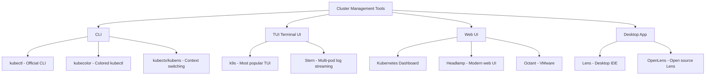

# 5.9.4 Kubernetes Dashboard Tools and k9s Cheatsheet

#### Why GUI and TUI Tools Matter

`kubectl` is powerful but verbose for day-to-day cluster management. Dashboard tools provide:

* **Real-time visibility** – See pod statuses, resource usage at a glance
* **Navigation speed** – Navigate resources without typing long commands  
* **Log streaming** – View logs interactively
* **Resource editing** – Edit resources with YAML editors

This note covers the Kubernetes Dashboard, Lens IDE, k9s (the most popular TUI), and Headlamp.

**Backlinks:** [5.9.1 - Control Plane Troubleshooting](./5.9.1_Troubleshooting_Control_Plane.md) | [5.9.2 - Compute Troubleshooting](./5.9.2_Troubleshooting_Compute_Plane_and_Pods.md) | [5.9.3 - Monitoring](./5.9.3_Monitoring_Prometheus_Grafana_and_Logging.md) | [5.1.2 - Cluster Setup](../Subchapter_5.1/5.1.2_Cluster_Setup_kubeadm_Kind_Multi_Node.md)

---

## Part 1: Tool Overview



---

## Part 2: Kubernetes Dashboard (Official Web UI)

### Installation

```bash
# Install Kubernetes Dashboard
kubectl apply -f https://raw.githubusercontent.com/kubernetes/dashboard/v2.7.0/aio/deploy/recommended.yaml

# Check installation
kubectl get pods -n kubernetes-dashboard
# NAME                                        READY   STATUS    RESTARTS   AGE
# dashboard-metrics-scraper-xxx               1/1     Running   0          30s
# kubernetes-dashboard-xxx                    1/1     Running   0          30s
```

### Access Dashboard

```bash
# Method 1: kubectl proxy
kubectl proxy
# Access: http://localhost:8001/api/v1/namespaces/kubernetes-dashboard/services/https:kubernetes-dashboard:/proxy/

# Method 2: Port-forward
kubectl port-forward -n kubernetes-dashboard svc/kubernetes-dashboard 8443:443
# Access: https://localhost:8443
```

### Create ServiceAccount for Dashboard Access

```yaml
# dashboard-admin.yaml
apiVersion: v1
kind: ServiceAccount
metadata:
  name: dashboard-admin
  namespace: kubernetes-dashboard
---
apiVersion: rbac.authorization.k8s.io/v1
kind: ClusterRoleBinding
metadata:
  name: dashboard-admin
roleRef:
  apiGroup: rbac.authorization.k8s.io
  kind: ClusterRole
  name: cluster-admin
subjects:
- kind: ServiceAccount
  name: dashboard-admin
  namespace: kubernetes-dashboard
```

```bash
kubectl apply -f dashboard-admin.yaml

# Get token for login
kubectl create token dashboard-admin -n kubernetes-dashboard
# Copy the token and paste in dashboard login screen
```

### Dashboard Features

| Feature | Description |
|---------|-------------|
| **Overview** | Cluster summary, recent events |
| **Workloads** | Pods, Deployments, StatefulSets, DaemonSets |
| **Service Discovery** | Services, Ingress, Endpoints |
| **Config** | ConfigMaps, Secrets |
| **Storage** | PVs, PVCs, StorageClasses |
| **RBAC** | Roles, ClusterRoles, Bindings |
| **Logs** | Real-time pod logs |
| **Exec** | Terminal in pods |
| **YAML Editor** | Edit any resource |

---

## Part 3: Lens Desktop IDE (Most Feature-Rich)

Lens is an open-source Kubernetes IDE that runs as a desktop application.

### Installation

```bash
# Linux (snap)
sudo snap install kontena-lens --classic

# Linux (AppImage)
wget https://api.k8slens.dev/binaries/Lens-latest-amd64.AppImage
chmod +x Lens-latest-amd64.AppImage
./Lens-latest-amd64.AppImage

# macOS
brew install --cask lens

# Windows
winget install Mirantis.Lens
```

### Key Lens Features

| Feature | Access Path | Description |
|---------|-------------|-------------|
| **Multi-cluster** | Left sidebar | Manage multiple clusters at once |
| **Workloads** | Workloads menu | View all controllers and pods |
| **Live logs** | Pod → Logs tab | Stream logs with filtering |
| **Exec** | Pod → Terminal | Shell into containers |
| **Port forwarding** | Pod → Port Forward | Forward ports from UI |
| **Resource usage** | Enabled with metrics-server | CPU/Memory gauges |
| **Helm** | Helm menu | Browse and manage Helm releases |
| **Extensions** | Extensions menu | Plugin marketplace |

### OpenLens (Free Version)

```bash
# OpenLens is the open-source, free version of Lens
# Download from: https://github.com/MuhammedKalkan/OpenLens/releases
wget https://github.com/MuhammedKalkan/OpenLens/releases/latest/download/OpenLens.AppImage
chmod +x OpenLens.AppImage
./OpenLens.AppImage
```

---

## Part 4: k9s – The Most Popular TUI

k9s is a terminal-based Kubernetes UI that provides real-time cluster monitoring and management.

### Installation

```bash
# Linux (binary)
curl -sS https://webinstall.dev/k9s | bash
# or
wget https://github.com/derailed/k9s/releases/latest/download/k9s_Linux_amd64.tar.gz
tar xzf k9s_Linux_amd64.tar.gz
sudo mv k9s /usr/local/bin/

# macOS
brew install k9s

# Verify
k9s version
```

### Starting k9s

```bash
# Start k9s with current context
k9s

# Start with specific context
k9s --context my-cluster

# Start with specific namespace
k9s --namespace production

# Start in read-only mode
k9s --readonly

# Start with specific log level
k9s --logLevel debug
```

### k9s Navigation – Complete Cheatsheet

#### Global Navigation

| Key | Action |
|-----|--------|
| `:` | Command mode – type resource type |
| `?` | Help / keyboard shortcuts |
| `q` | Quit / go back |
| `Ctrl+C` | Exit k9s |
| `Ctrl+A` | Toggle header |
| `Ctrl+Z` | Suspend k9s (bg) |

#### Resource Commands (type after `:`)

| Command | Resource |
|---------|---------|
| `:pod` or `:po` | Pods |
| `:deployment` or `:deploy` | Deployments |
| `:service` or `:svc` | Services |
| `:configmap` or `:cm` | ConfigMaps |
| `:secret` | Secrets |
| `:node` or `:no` | Nodes |
| `:namespace` or `:ns` | Namespaces |
| `:statefulset` or `:sts` | StatefulSets |
| `:daemonset` or `:ds` | DaemonSets |
| `:job` | Jobs |
| `:cronjob` or `:cj` | CronJobs |
| `:ingress` or `:ing` | Ingress |
| `:pv` | PersistentVolumes |
| `:pvc` | PersistentVolumeClaims |
| `:sc` | StorageClasses |
| `:hpa` | HorizontalPodAutoscalers |
| `:role` | Roles |
| `:rolebinding` or `:rb` | RoleBindings |
| `:clusterrole` or `:cr` | ClusterRoles |
| `:clusterrolebinding` or `:crb` | ClusterRoleBindings |
| `:serviceaccount` or `:sa` | ServiceAccounts |
| `:networkpolicy` or `:netpol` | NetworkPolicies |
| `:ep` | Endpoints |
| `:ev` | Events |
| `:ctx` | Contexts (switch clusters) |

#### Pod Actions (when viewing pods)

| Key | Action |
|-----|--------|
| `Enter` | View pod detail |
| `l` | View logs |
| `s` | Shell into container (exec) |
| `d` | Describe pod |
| `e` | Edit pod YAML |
| `Ctrl+D` | Delete pod |
| `Ctrl+K` | Kill pod (force delete) |
| `y` | View YAML |
| `f` | Port forward |
| `u` | Sort by CPU |
| `i` | Sort by memory |
| `Shift+L` | Toggle label display |
| `Ctrl+U` | Upload file |
| `/` | Filter/search |
| `Escape` | Clear filter |

#### Log Viewer Keys

| Key | Action |
|-----|--------|
| `f` | Toggle follow mode |
| `w` | Toggle line wrap |
| `/` | Search in logs |
| `0-9` | Tail last N*100 lines (e.g., `1`=100, `5`=500) |
| `Ctrl+S` | Save logs to file |
| `c` | Clear screen |
| `p` | Show previous container logs |
| `Ctrl+A` | Toggle autoscroll |

#### Navigation Keys

| Key | Action |
|-----|--------|
| `↑`/`↓` | Move up/down |
| `g` | Go to top |
| `G` | Go to bottom |
| `←`/`→` | Navigate panels |
| `Tab` | Next container (multi-container pods) |
| `space` | Select item |
| `n` | Next occurrence (in search) |
| `N` | Previous occurrence |

#### Namespace and Context

| Key | Action |
|-----|--------|
| `Ctrl+space` | Switch namespace |
| `:ctx` | Switch cluster context |
| `0` | All namespaces view |

#### Sorting

| Key | Action |
|-----|--------|
| `/` then column name | Sort by column |
| `Shift+A` | Sort by age |
| `Shift+C` | Sort by CPU |
| `Shift+M` | Sort by memory |
| `Shift+R` | Sort by restarts |

### k9s Configuration

```yaml
# ~/.config/k9s/config.yaml
k9s:
  refreshRate: 2          # Refresh every 2 seconds
  headless: false         # Show header
  logoless: false         # Show logo
  crumbsless: false       # Show breadcrumbs
  readOnly: false         # Read-only mode
  noIcons: false
  currentContext: my-cluster
  currentCluster: my-cluster
  shellPod:
    image: busybox         # Default debug image for shell
    namespace: default
    limits:
      cpu: 100m
      memory: 100Mi
  logger:
    tail: 100             # Default log tail lines
    buffer: 5000          # Log buffer size
    sinceSeconds: 60      # Show last 60 seconds
    fullScreenLogs: false
    textWrap: false
    showTime: false
```

### k9s Hotkey Config

```yaml
# ~/.config/k9s/hotkeys.yaml
hotKey:
  hn:
    shortCut: Shift-0
    description: View nodes
    command: nodes
  hp:
    shortCut: Shift-1
    description: View pods
    command: pods
  hs:
    shortCut: Shift-2
    description: View services
    command: services
```

### k9s Skin/Theme

```bash
# Available themes
ls ~/.config/k9s/skins/
# dracula.yaml, monokai.yaml, nord.yaml, etc.

# Set theme in config
vim ~/.config/k9s/config.yaml
# ui:
#   skin: dracula
```

---

## Part 5: Stern – Multi-Pod Log Streaming

Stern streams logs from multiple pods simultaneously.

### Installation

```bash
# macOS
brew install stern

# Linux
wget https://github.com/stern/stern/releases/latest/download/stern_linux_amd64.tar.gz
tar xzf stern_linux_amd64.tar.gz
sudo mv stern /usr/local/bin/
```

### Stern Commands

```bash
# Stream logs from all pods matching "myapp" in current namespace
stern myapp

# Stream from specific namespace
stern myapp --namespace production

# Stream from multiple namespaces
stern myapp --all-namespaces

# Stream with label selector
stern --selector app=myapp

# Stream with specific container
stern myapp --container sidecar

# Stream with timestamps
stern myapp --timestamps

# Show last 50 lines then follow
stern myapp --tail 50

# Filter by regex
stern myapp --include "ERROR|WARN"

# Exclude pattern
stern myapp --exclude "health-check"

# Show logs since duration
stern myapp --since 1h
```

---

## Part 6: kubectx and kubens – Context/Namespace Switching

```bash
# Install
brew install kubectx  # macOS
# or
sudo apt install kubectx  # Ubuntu/Debian

# kubectx – switch cluster context
kubectx                  # List all contexts
kubectx my-cluster       # Switch to my-cluster
kubectx -               # Switch to previous context
kubectx -d my-cluster   # Delete context

# kubens – switch namespace
kubens                   # List all namespaces
kubens production        # Switch to production namespace
kubens -                # Switch to previous namespace
```

---

## Part 7: Headlamp – Modern Web UI

Headlamp is a modern, open-source Kubernetes web UI.

```bash
# Install as kubectl plugin
kubectl krew install headlamp-server

# Or install as binary
wget https://github.com/headlamp-k8s/headlamp/releases/latest/download/headlamp_linux_amd64.tar.gz
tar xzf headlamp_linux_amd64.tar.gz
sudo mv headlamp /usr/local/bin/

# Run as in-cluster service
kubectl apply -f https://raw.githubusercontent.com/headlamp-k8s/headlamp/main/kubernetes-headlamp.yaml

# Port-forward to access
kubectl port-forward -n kube-system svc/headlamp 4466:80
# Access: http://localhost:4466
```

---

## Part 8: kubecolor – Colored kubectl Output

```bash
# Install
go install github.com/hidetatz/kubecolor/cmd/kubecolor@latest
# or
brew install hidetatz/tap/kubecolor

# Use instead of kubectl
kubecolor get pods
kubecolor describe pod mypod

# Alias
echo 'alias kubectl=kubecolor' >> ~/.bashrc
source ~/.bashrc
```

---

## Part 9: Tool Comparison Matrix

| Tool | Type | Best For | Cost | Auth Methods |
|------|------|----------|------|--------------|
| **kubectl** | CLI | Scripting, automation | Free | kubeconfig |
| **k9s** | TUI | Terminal power users | Free | kubeconfig |
| **Kubernetes Dashboard** | Web | Simple web access | Free | Token, kubeconfig |
| **Lens / OpenLens** | Desktop | Multi-cluster management | Free (OpenLens) | kubeconfig |
| **Headlamp** | Web | Modern open-source UI | Free | Token, OIDC |
| **Stern** | CLI | Multi-pod log streaming | Free | kubeconfig |
| **Octant** | Web | Local developer tool | Free | kubeconfig |

---

## Summary: k9s Quick Reference Card

```
┌────────────────────────────────────────────────────────────────────┐
│                       k9s Quick Reference                          │
├─────────────────────────────┬──────────────────────────────────────┤
│ Navigation                  │ Pod Actions                          │
│ : → command mode            │ l  → logs                           │
│ ? → help                    │ s  → shell (exec)                   │
│ q → back/quit               │ d  → describe                       │
│ / → search/filter           │ e  → edit YAML                      │
│ Ctrl+C → exit               │ y  → view YAML                      │
│ g/G → top/bottom            │ f  → port-forward                   │
├─────────────────────────────┤ Ctrl+D → delete                     │
│ Common Resources (:cmd)     │ Ctrl+K → kill (force)               │
│ :po  → pods                 ├──────────────────────────────────────┤
│ :deploy → deployments       │ Log Viewer                           │
│ :svc → services             │ f → follow logs                     │
│ :ns  → namespaces           │ w → wrap lines                      │
│ :no  → nodes                │ / → search in logs                  │
│ :cm  → configmaps           │ p → previous container logs         │
│ :sec → secrets              │ Ctrl+S → save logs                  │
│ :pvc → PVCs                 ├──────────────────────────────────────┤
│ :ctx → contexts             │ Sorting                              │
│ :ev  → events               │ Shift+A → by age                    │
│ :hpa → HPA                  │ Shift+C → by CPU                    │
│ :rb  → rolebindings         │ Shift+M → by memory                 │
│ :sa  → serviceaccounts      │ Shift+R → by restarts               │
└─────────────────────────────┴──────────────────────────────────────┘
```

---

**Next note (5.9.5)** covers the **Complete kubectl Cheatsheet and JSONPath Reference** – every kubectl command pattern organized by use case, plus JSONPath, custom columns, jq integration, and practical scripts.

**Backlinks:** [5.9.1 - Control Plane Troubleshooting](./5.9.1_Troubleshooting_Control_Plane.md) | [5.1.1 - Architecture](../Subchapter_5.1/5.1.1_K8s_Architecture_Components.md)
