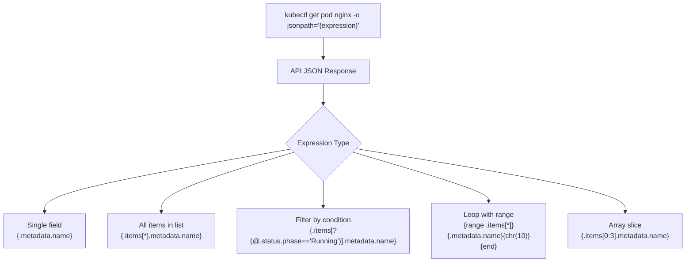

# 5.9.5 Complete kubectl Cheatsheet and JSONPath Reference

#### Why This Reference Matters

`kubectl` is the primary interface to Kubernetes. This combined note covers every `kubectl` command pattern you need for daily operations, troubleshooting, CKA/CKAD/CKS exams, and production work — plus JSONPath for extracting precise data from the Kubernetes API. Both topics are deeply intertwined: `kubectl get -o jsonpath` is one of the most powerful and frequently tested command patterns.

**Backlinks:** [5.9.1 - Control Plane Troubleshooting](./5.9.1_Troubleshooting_Control_Plane.md) | [5.9.2 - Compute Plane Troubleshooting](./5.9.2_Troubleshooting_Compute_Plane_and_Pods.md) | [5.1.1 - Architecture](../Subchapter_5.1/5.1.1_K8s_Architecture_Components.md) | [5.3.1 - Pods](../Subchapter_5.3/5.3.1_Pod_Fundamentals_and_Lifecycle.md)

---

## SECTION 1: kubectl Cheatsheet

---

## Part 1: kubectl Configuration and Context

```bash
# === KUBECONFIG ===
kubectl config view                          # View merged kubeconfig
kubectl config view --raw                    # Show certificates decoded
kubectl config view --minify                 # Show current context only

# === CONTEXT MANAGEMENT ===
kubectl config get-contexts                  # List all contexts
kubectl config current-context              # Show current context
kubectl config use-context my-cluster       # Switch context
kubectl config delete-context my-cluster    # Delete context
kubectl config rename-context old new       # Rename context

# === NAMESPACE (set default for session) ===
kubectl config set-context --current --namespace=mynamespace
kubectl config set-context my-context --namespace=prod --cluster=my-cluster --user=admin

# === ADD CLUSTER / USER / CONTEXT ===
kubectl config set-cluster my-cluster --server=https://1.2.3.4:6443 --certificate-authority=ca.crt
kubectl config set-credentials admin --client-certificate=admin.crt --client-key=admin.key
kubectl config set-credentials admin --token=mytoken

# === MERGE KUBECONFIGS ===
KUBECONFIG=~/.kube/config:~/new-config kubectl config view --flatten > ~/.kube/merged-config

# === CLUSTER INFO ===
kubectl cluster-info
kubectl cluster-info dump                   # Full cluster diagnostic dump
kubectl version                             # Client and server versions
kubectl version --short
```

---

## Part 2: Get (List Resources)

```bash
# === BASIC GET ===
kubectl get pods
kubectl get pods -n production              # Specific namespace
kubectl get pods --all-namespaces           # All namespaces
kubectl get pods -A                         # Shorthand for --all-namespaces
kubectl get pods -o wide                    # Extra columns (node, IP)
kubectl get pods -o yaml                    # Full YAML output
kubectl get pods -o json                    # Full JSON output
kubectl get pods -o name                    # Names only (pod/nginx)
kubectl get pods -w                         # Watch mode (streaming)

# === MULTIPLE RESOURCE TYPES ===
kubectl get pods,svc,deploy
kubectl get all                             # Most common resource types
kubectl get all -n mynamespace

# === LABEL SELECTORS ===
kubectl get pods -l app=nginx               # Single label
kubectl get pods -l app=nginx,tier=frontend # Multiple labels (AND)
kubectl get pods -l 'app in (nginx,apache)' # Set-based: in
kubectl get pods -l 'app notin (mysql)'     # Set-based: notin
kubectl get pods -l '!deprecated'           # Label must NOT exist
kubectl get pods --show-labels              # Show all labels in output

# === FIELD SELECTORS ===
kubectl get pods --field-selector status.phase=Running
kubectl get pods --field-selector spec.nodeName=worker-1
kubectl get pods --field-selector metadata.namespace=default,status.phase=Running

# === SORTING ===
kubectl get pods --sort-by=.metadata.creationTimestamp  # Oldest first
kubectl get pods --sort-by=.metadata.name               # Alphabetical
kubectl get events --sort-by='.lastTimestamp'           # Most recent last

# === ALL RESOURCE TYPES (quick reference) ===
kubectl get nodes                       kubectl get namespaces
kubectl get services (svc)              kubectl get deployments (deploy)
kubectl get replicasets (rs)            kubectl get statefulsets (sts)
kubectl get daemonsets (ds)             kubectl get jobs
kubectl get cronjobs (cj)              kubectl get configmaps (cm)
kubectl get secrets                     kubectl get persistentvolumes (pv)
kubectl get persistentvolumeclaims (pvc) kubectl get storageclasses (sc)
kubectl get ingress (ing)              kubectl get networkpolicies (netpol)
kubectl get serviceaccounts (sa)       kubectl get roles
kubectl get rolebindings               kubectl get clusterroles
kubectl get clusterrolebindings        kubectl get horizontalpodautoscalers (hpa)
kubectl get poddisruptionbudgets (pdb) kubectl get priorityclasses (pc)
kubectl get events                     kubectl get endpoints (ep)
kubectl get limitranges                kubectl get resourcequotas
kubectl get apiservices                kubectl get customresourcedefinitions (crd)
kubectl get mutatingwebhookconfigurations    kubectl get validatingwebhookconfigurations
```

---

## Part 3: Describe (Detailed Info)

```bash
# === DESCRIBE ===
kubectl describe pod nginx
kubectl describe pod nginx -n production
kubectl describe node worker-1
kubectl describe deployment myapp
kubectl describe svc my-service
kubectl describe pvc my-pvc
kubectl describe pv my-pv
kubectl describe ingress my-ingress
kubectl describe configmap my-config
kubectl describe secret my-secret

# === TARGETED DESCRIBE PATTERNS ===
kubectl describe pod nginx | grep -A 20 Events      # Show only events section
kubectl describe node worker-1 | grep -A 5 Conditions
kubectl describe node worker-1 | grep -A 10 "Allocated resources"
kubectl describe pods -A | grep -B 5 "OOMKilled"
kubectl describe pods -A | grep -E "Name:|Reason:|Message:"
```

---

## Part 4: Create and Apply

```bash
# === APPLY (Declarative — recommended) ===
kubectl apply -f manifest.yaml              # Create or update
kubectl apply -f ./directory/              # All YAMLs in directory
kubectl apply -f https://url/manifest.yaml # From URL
kubectl apply -k ./kustomize-dir/          # Kustomize directory

# === CREATE (Imperative) ===
kubectl create deployment nginx --image=nginx --replicas=3
kubectl create service clusterip mysvc --tcp=80:80
kubectl create service nodeport mysvc --tcp=80:80 --node-port=30080
kubectl create service loadbalancer mysvc --tcp=80:80
kubectl create configmap myconfig --from-literal=key=value
kubectl create configmap myconfig --from-file=./config.properties
kubectl create configmap myconfig --from-env-file=.env
kubectl create secret generic mysecret --from-literal=password=pass123
kubectl create secret docker-registry regcred \
  --docker-server=registry.io \
  --docker-username=user \
  --docker-password=pass \
  --docker-email=user@example.com
kubectl create secret tls my-tls --cert=tls.crt --key=tls.key
kubectl create namespace mynamespace
kubectl create serviceaccount mysa
kubectl create role pod-reader --verb=get,list,watch --resource=pods
kubectl create clusterrole node-reader --verb=get,list --resource=nodes
kubectl create rolebinding alice-reader --role=pod-reader --user=alice
kubectl create clusterrolebinding alice-node --clusterrole=node-reader --user=alice
kubectl create job myjob --image=busybox -- echo done
kubectl create cronjob mycron --image=busybox --schedule="*/5 * * * *" -- echo hello
kubectl create quota myquota --hard=cpu=2,memory=4Gi,pods=20

# === RUN (Quick Pod) ===
kubectl run nginx --image=nginx                         # Create pod
kubectl run nginx --image=nginx --port=80
kubectl run nginx --image=nginx --env="KEY=val"
kubectl run nginx --image=nginx --command -- sleep 3600
kubectl run nginx --image=nginx --labels="app=nginx,tier=web"
kubectl run nginx --image=nginx --requests="cpu=100m,memory=128Mi" --limits="cpu=500m,memory=256Mi"
kubectl run nginx --image=nginx --serviceaccount=mysa
kubectl run nginx --image=nginx --restart=Never         # Bare Pod (no controller)
kubectl run nginx --image=nginx --restart=OnFailure     # Job
kubectl run nginx --image=nginx -it --rm -- /bin/sh     # Interactive, auto-delete

# === DRY RUN (generate YAML without creating) ===
kubectl run nginx --image=nginx --restart=Never --dry-run=client -o yaml > pod.yaml
kubectl create deployment myapp --image=myapp:v1 --dry-run=client -o yaml
kubectl create service clusterip mysvc --tcp=80:80 --dry-run=client -o yaml
kubectl expose deployment nginx --port=80 --dry-run=client -o yaml
kubectl create configmap myconfig --from-literal=k=v --dry-run=client -o yaml
kubectl create secret generic mysecret --from-literal=pw=secret --dry-run=client -o yaml
```

---

## Part 5: Edit, Set, and Patch

```bash
# === EDIT (Interactive YAML editor) ===
kubectl edit pod nginx
kubectl edit deployment myapp
kubectl edit configmap myconfig -n production

# === SET (Modify specific fields) ===
kubectl set image deployment/myapp myapp=myapp:v2             # Update container image
kubectl set image daemonset/fluentd fluentd=fluentd:v2
kubectl set image deployment/myapp myapp=myapp:v2 --record   # Record in rollout history
kubectl set resources deployment myapp \
  --requests=cpu=100m,memory=128Mi \
  --limits=cpu=500m,memory=256Mi
kubectl set env deployment myapp KEY=value                    # Set env var
kubectl set env deployment myapp --from=configmap/myconfig   # Env from ConfigMap
kubectl set env deployment myapp --from=secret/mysecret
kubectl set serviceaccount deployment myapp mysa             # Change service account

# === PATCH (JSON/Strategic merge) ===
# Strategic merge patch (default — merges with existing spec)
kubectl patch deployment myapp -p '{"spec":{"replicas":5}}'
kubectl patch pod nginx -p '{"spec":{"terminationGracePeriodSeconds":0}}'
kubectl patch svc myservice -p '{"spec":{"type":"NodePort"}}'

# JSON Patch (RFC 6902 — precise operations)
kubectl patch deployment myapp --type=json \
  -p='[{"op":"replace","path":"/spec/replicas","value":3}]'
kubectl patch deployment myapp --type=json \
  -p='[{"op":"add","path":"/spec/template/spec/containers/0/env/-","value":{"name":"DEBUG","value":"true"}}]'

# Merge patch
kubectl patch svc myservice --type=merge -p '{"spec":{"type":"LoadBalancer"}}'

# === REPLACE ===
kubectl replace -f updated-manifest.yaml    # Replace (resource must exist)
kubectl replace --force -f pod.yaml         # Delete + recreate (useful for immutable fields)
```

---

## Part 6: Scale and Rollout

```bash
# === SCALE ===
kubectl scale deployment myapp --replicas=5
kubectl scale statefulset mydb --replicas=3
kubectl scale --current-replicas=3 --replicas=5 deployment/myapp  # Conditional scale

# === ROLLOUT ===
kubectl rollout status deployment myapp          # Watch rollout progress
kubectl rollout history deployment myapp         # Show revision history
kubectl rollout history deployment myapp --revision=2  # Inspect specific revision
kubectl rollout undo deployment myapp            # Rollback to previous revision
kubectl rollout undo deployment myapp --to-revision=1  # Rollback to specific revision
kubectl rollout pause deployment myapp           # Pause rollout (canary testing)
kubectl rollout resume deployment myapp          # Resume paused rollout
kubectl rollout restart deployment myapp         # Trigger rolling restart
kubectl rollout restart daemonset fluentd
kubectl rollout restart statefulset mydb

# === HPA ===
kubectl autoscale deployment myapp --min=2 --max=10 --cpu-percent=50
kubectl get hpa
kubectl describe hpa myapp
```

---

## Part 7: Expose (Services)

```bash
kubectl expose pod nginx --port=80 --type=ClusterIP
kubectl expose pod nginx --port=80 --type=NodePort --name=nginx-np
kubectl expose deployment myapp --port=80 --target-port=8080 --type=LoadBalancer
kubectl expose deployment myapp --port=80 --type=ClusterIP --name=myapp-svc
kubectl expose statefulset mydb --port=5432 --name=mydb-svc
kubectl expose replicaset myrs --port=80
```

---

## Part 8: Logs, Exec, Copy, Port-Forward

```bash
# === LOGS ===
kubectl logs nginx                              # Current logs
kubectl logs nginx --previous                  # Previous (crashed) container
kubectl logs nginx -c sidecar                  # Specific container
kubectl logs nginx --all-containers            # All containers in pod
kubectl logs nginx -f                          # Follow/stream logs
kubectl logs nginx --tail=100                  # Last 100 lines
kubectl logs nginx --since=1h                  # Since 1 hour ago
kubectl logs nginx --since-time="2024-01-15T10:00:00Z"
kubectl logs -l app=nginx --all-containers     # All pods matching label
kubectl logs -l app=nginx -f --max-log-requests=10  # Follow multiple pods
kubectl logs job/myjob                         # Job pod logs
kubectl logs -n kube-system -l k8s-app=kube-dns   # CoreDNS logs

# === EXEC ===
kubectl exec nginx -- ls /app
kubectl exec nginx -- env | grep DATABASE
kubectl exec -it nginx -- /bin/sh              # Interactive shell
kubectl exec -it nginx -- /bin/bash
kubectl exec -it nginx -c sidecar -- /bin/bash # Specific container

# === PORT FORWARD ===
kubectl port-forward pod/nginx 8080:80
kubectl port-forward deployment/myapp 8080:80
kubectl port-forward svc/myservice 8080:80
kubectl port-forward svc/myservice 8080:80 --address=0.0.0.0  # Allow external access
kubectl port-forward -n kube-system svc/prometheus-server 9090:80

# === COPY ===
kubectl cp nginx:/etc/nginx/nginx.conf ./nginx.conf
kubectl cp ./local-config.yaml nginx:/tmp/
kubectl cp mynamespace/nginx:/var/log/nginx ./logs/
kubectl cp nginx:/app/config.json -c sidecar ./config.json  # From specific container
```

---

## Part 9: Delete

```bash
# === DELETE ===
kubectl delete pod nginx
kubectl delete pod nginx --grace-period=0          # Immediate termination
kubectl delete pod nginx --force --grace-period=0  # Force delete (stuck pods)
kubectl delete -f manifest.yaml
kubectl delete -f ./directory/

# === DELETE BY LABEL ===
kubectl delete pods -l app=nginx
kubectl delete deploy,svc,cm -l app=myapp

# === DELETE ALL IN NAMESPACE ===
kubectl delete pods --all -n mynamespace
kubectl delete all --all -n mynamespace            # All resources in namespace
kubectl delete namespace mynamespace               # Namespace + everything in it

# === WAIT FOR DELETE ===
kubectl delete pod nginx --wait=true
kubectl wait --for=delete pod/nginx --timeout=60s
```

---

## Part 10: Labels, Annotations, Taints

```bash
# === LABELS ===
kubectl label pods nginx app=web              # Add label
kubectl label pods nginx app=api --overwrite  # Update existing label
kubectl label pods nginx app-                 # Remove label (trailing dash)
kubectl label nodes worker-1 disktype=ssd     # Label a node
kubectl label node worker-1 region-           # Remove node label

# === ANNOTATIONS ===
kubectl annotate pod nginx description="My nginx pod"
kubectl annotate deployment myapp kubernetes.io/change-cause="v2 release" --overwrite
kubectl annotate pod nginx description-       # Remove annotation

# === TAINTS ===
kubectl taint nodes worker-1 dedicated=gpu:NoSchedule
kubectl taint nodes worker-1 dedicated-        # Remove taint (trailing dash)
kubectl taint nodes worker-1 maintenance=true:NoExecute
kubectl taint nodes worker-1 key:NoSchedule-   # Remove specific effect taint
```

---

## Part 11: Node Management

```bash
# === NODE STATUS ===
kubectl get nodes
kubectl get nodes -o wide
kubectl describe node worker-1
kubectl top nodes

# === CORDON / DRAIN / UNCORDON ===
kubectl cordon worker-1                        # Prevent new pods from scheduling
kubectl uncordon worker-1                      # Re-enable scheduling
kubectl drain worker-1 --ignore-daemonsets     # Evict pods (pre-maintenance)
kubectl drain worker-1 --ignore-daemonsets --delete-emptydir-data
kubectl drain worker-1 --ignore-daemonsets --force  # Force (even local storage pods)

# === DEBUG NODE ===
kubectl debug node/worker-1 -it --image=ubuntu
# Inside container: chroot /host  → full node filesystem access
```

---

## Part 12: Debug and Troubleshoot

```bash
# === EPHEMERAL CONTAINERS (debug) ===
kubectl debug mypod -it --image=busybox --target=mypod       # Attach to running pod ns
kubectl debug mypod -it --image=ubuntu -- bash                # Copy of pod, new container
kubectl debug node/worker-1 -it --image=ubuntu               # Debug node

# === EVENTS ===
kubectl get events
kubectl get events -n production
kubectl get events --sort-by='.lastTimestamp'
kubectl get events --field-selector reason=FailedScheduling
kubectl get events --field-selector involvedObject.name=mypod

# === TOP (metrics-server required) ===
kubectl top pods
kubectl top pods --all-namespaces
kubectl top pods -l app=nginx
kubectl top pods --containers                  # Per-container breakdown
kubectl top nodes

# === WAIT ===
kubectl wait --for=condition=ready pod/nginx --timeout=60s
kubectl wait --for=condition=available deployment/myapp --timeout=120s
kubectl wait --for=jsonpath='{.status.phase}'=Running pod/nginx

# === API HEALTH ===
kubectl get --raw /healthz
kubectl get --raw /readyz
kubectl get --raw /livez
kubectl get componentstatuses  # (deprecated but still functional)
```

---

## Part 13: RBAC and Auth

```bash
# === AUTH CHECK ===
kubectl auth can-i get pods                     # Check own permission
kubectl auth can-i get pods --as=alice          # Check as another user
kubectl auth can-i get pods --as=alice -n prod  # In specific namespace
kubectl auth can-i --list                       # List all my permissions
kubectl auth can-i --list --as=alice            # List alice's permissions
kubectl auth whoami                             # Show current identity

# === CREATE RBAC RESOURCES ===
kubectl create role pod-reader --verb=get,list,watch --resource=pods
kubectl create rolebinding alice-reader --role=pod-reader --user=alice -n default
kubectl create rolebinding alice-reader --role=pod-reader --serviceaccount=default:mysa
kubectl create clusterrole node-reader --verb=get,list --resource=nodes
kubectl create clusterrolebinding alice-node-reader --clusterrole=node-reader --user=alice

# === SERVICE ACCOUNT TOKENS ===
kubectl create token mysa                       # Create ServiceAccount token (k8s 1.24+)
kubectl create token mysa --duration=24h
kubectl get secret -o jsonpath='{.data.token}' | base64 -d   # Old-style token
```

---

## Part 14: API Resources and Documentation

```bash
# === API RESOURCES ===
kubectl api-resources                           # All available resources
kubectl api-resources --namespaced=true         # Namespace-scoped only
kubectl api-resources --namespaced=false        # Cluster-scoped only
kubectl api-resources --api-group=apps          # Resources in apps group
kubectl api-resources --verbs=list,get          # Resources supporting specific verbs
kubectl api-versions                            # All API versions/groups

# === EXPLAIN (built-in docs — essential for exams) ===
kubectl explain pod
kubectl explain pod.spec
kubectl explain pod.spec.containers
kubectl explain pod.spec.containers.readinessProbe
kubectl explain pod.spec.containers.readinessProbe.httpGet
kubectl explain deployment --recursive          # All fields recursively
kubectl explain networkpolicy.spec.ingress

# === RAW API ACCESS ===
kubectl get --raw /api/v1/namespaces/default/pods
kubectl get --raw /apis/apps/v1/namespaces/default/deployments
kubectl proxy &                                 # Start local API proxy
curl http://localhost:8001/api/v1/pods         # Access via proxy
```

---

## Part 15: Imperative Patterns for Exam Speed

```bash
# === GENERATE YAML FAST ===
# Pod
kubectl run nginx --image=nginx --restart=Never --port=80 --labels="app=nginx" --dry-run=client -o yaml > pod.yaml

# Deployment
kubectl create deployment nginx --image=nginx --replicas=3 --dry-run=client -o yaml > deploy.yaml

# Service from deployment
kubectl expose deployment nginx --port=80 --type=ClusterIP --dry-run=client -o yaml > svc.yaml

# ConfigMap
kubectl create configmap app-config \
  --from-literal=DB_HOST=mysql \
  --from-literal=DB_PORT=3306 \
  --dry-run=client -o yaml > cm.yaml

# Secret
kubectl create secret generic app-secret \
  --from-literal=password=mypassword \
  --dry-run=client -o yaml > secret.yaml

# Job
kubectl create job myjob --image=busybox --dry-run=client -o yaml -- echo done > job.yaml

# CronJob
kubectl create cronjob mycron --image=busybox --schedule="*/5 * * * *" --dry-run=client -o yaml -- echo hello

# Namespace
kubectl create namespace prod --dry-run=client -o yaml

# ServiceAccount + Role + RoleBinding (one shot)
kubectl create serviceaccount mysa -n production
kubectl create role reader --verb=get,list,watch --resource=pods -n production
kubectl create rolebinding mysa-reader --role=reader --serviceaccount=production:mysa -n production

# NetworkPolicy (must write YAML — no imperative command)
# Use: kubectl explain networkpolicy.spec
```

---

## Part 16: Output Formats and Custom Columns

```bash
# === OUTPUT FORMATS ===
kubectl get pods -o wide          # Extra columns
kubectl get pods -o yaml          # Full YAML
kubectl get pods -o json          # Full JSON
kubectl get pods -o name          # Resource names (pod/nginx)
kubectl get pods -o jsonpath=...  # JSONPath extraction (see Section 2)
kubectl get pods -o go-template='{{range .items}}{{.metadata.name}}{{"\n"}}{{end}}'

# === CUSTOM COLUMNS ===
kubectl get pods -o custom-columns='NAME:.metadata.name,STATUS:.status.phase'

# Pods with full detail
kubectl get pods -o custom-columns=\
'NAME:.metadata.name,\
NAMESPACE:.metadata.namespace,\
STATUS:.status.phase,\
IP:.status.podIP,\
NODE:.spec.nodeName,\
IMAGE:.spec.containers[0].image'

# Deployments
kubectl get deployments -o custom-columns=\
'NAME:.metadata.name,\
DESIRED:.spec.replicas,\
READY:.status.readyReplicas,\
UP-TO-DATE:.status.updatedReplicas,\
IMAGE:.spec.template.spec.containers[0].image'

# Nodes
kubectl get nodes -o custom-columns=\
'NAME:.metadata.name,\
STATUS:.status.conditions[-1:].type,\
VERSION:.status.nodeInfo.kubeletVersion,\
OS:.status.nodeInfo.osImage,\
RUNTIME:.status.nodeInfo.containerRuntimeVersion'

# Services
kubectl get svc -o custom-columns=\
'NAME:.metadata.name,\
TYPE:.spec.type,\
CLUSTER-IP:.spec.clusterIP,\
PORT:.spec.ports[0].port'

# PVCs
kubectl get pvc -o custom-columns=\
'NAME:.metadata.name,\
STATUS:.status.phase,\
VOLUME:.spec.volumeName,\
CAPACITY:.status.capacity.storage,\
STORAGECLASS:.spec.storageClassName'
```

---

## Part 17: Aliases for Speed

```bash
# Add to ~/.bashrc or ~/.zshrc for daily use and exam prep
alias k='kubectl'
alias kg='kubectl get'
alias kd='kubectl describe'
alias kl='kubectl logs'
alias ke='kubectl exec -it'
alias kaf='kubectl apply -f'
alias kdel='kubectl delete'

# Resource shortcuts
alias kgp='kubectl get pods'
alias kgpw='kubectl get pods -w'
alias kgpa='kubectl get pods -A'
alias kgs='kubectl get svc'
alias kgd='kubectl get deploy'
alias kgn='kubectl get nodes'
alias kgns='kubectl get ns'
alias kgcm='kubectl get cm'
alias kgsec='kubectl get secret'
alias kgpvc='kubectl get pvc'
alias kgpv='kubectl get pv'
alias kgrs='kubectl get rs'
alias kgss='kubectl get sts'
alias kgds='kubectl get ds'
alias kgj='kubectl get job'
alias kgcj='kubectl get cj'
alias kging='kubectl get ing'
alias kgnp='kubectl get netpol'
alias kghpa='kubectl get hpa'
alias kgev='kubectl get events --sort-by=.lastTimestamp'

# Context/namespace
alias kcx='kubectl config use-context'
alias kns='kubectl config set-context --current --namespace'

# Logs
alias klf='kubectl logs -f'
alias klp='kubectl logs --previous'

# Dry-run helpers
alias kdr='kubectl run --dry-run=client -o yaml'
alias kdry='kubectl create --dry-run=client -o yaml'
```

---

## Part 18: kubectl Flags Quick Reference

| Flag | Short | Purpose |
|------|-------|---------|
| `--namespace` | `-n` | Specify namespace |
| `--all-namespaces` | `-A` | All namespaces |
| `--output` | `-o` | Output format |
| `--selector` | `-l` | Label selector |
| `--watch` | `-w` | Stream changes |
| `--filename` | `-f` | File or URL |
| `--recursive` | `-R` | Recursive directory apply |
| `--force` | | Force operation |
| `--grace-period` | | Seconds before deletion |
| `--dry-run=client` | | Print only, don't create |
| `--field-selector` | | Filter by object field |
| `--sort-by` | | Sort output |
| `--show-labels` | | Include labels column |
| `--container` | `-c` | Target container |
| `--previous` | `-p` | Previous container (logs) |
| `--follow` | `-f` | Stream logs |
| `--tail` | | Last N lines |
| `--since` | | Duration (e.g. `1h`, `30m`) |
| `--as` | | Impersonate user |
| `--as-group` | | Impersonate group |
| `--record` | | Record command in annotation |

---

## SECTION 2: JSONPath Reference

---

## Part 1: JSONPath Syntax Fundamentals



### JSONPath Expression Reference

| Expression | Meaning | Example |
|-----------|---------|---------|
| `.field` | Access a field | `.metadata.name` |
| `['field']` | Bracket notation | `['metadata']['name']` |
| `[*]` | All array elements | `.items[*]` |
| `[N]` | Nth element (0-based) | `.items[0]` |
| `[-1:]` | Last element | `.status.conditions[-1:]` |
| `[N:M]` | Array slice | `.items[0:3]` |
| `[?(@.field=='val')]` | Filter expression | `[?(@.status.phase=='Running')]` |
| `..` | Recursive descent | `..containers[*].image` |
| `{range}{end}` | Loop over array | `{range .items[*]}{.name}{end}` |
| `{"\n"}` | Newline literal | `{"\n"}` |
| `{"\t"}` | Tab literal | `{"\t"}` |

---

## Part 2: Basic JSONPath Queries

```bash
# === SINGLE FIELD FROM ONE RESOURCE ===
kubectl get pod nginx -o jsonpath='{.metadata.name}'
# nginx

kubectl get pod nginx -o jsonpath='{.status.phase}'
# Running

kubectl get pod nginx -o jsonpath='{.status.podIP}'
# 10.244.1.5

kubectl get pod nginx -o jsonpath='{.spec.nodeName}'
# worker-1

kubectl get pod nginx -o jsonpath='{.spec.containers[0].image}'
# nginx:alpine

kubectl get pod nginx -o jsonpath='{.spec.containers[*].image}'
# nginx:alpine sidecar:v1   ← space-separated

kubectl get pod nginx -o jsonpath='{.status.containerStatuses[0].restartCount}'
# 3

kubectl get pod nginx -o jsonpath='{.spec.containers[0].resources.limits.memory}'
# 256Mi

kubectl get deployment myapp -o jsonpath='{.spec.replicas}'
# 3

kubectl get service myapp -o jsonpath='{.spec.clusterIP}'
# 10.96.45.200

kubectl get node worker-1 -o jsonpath='{.status.nodeInfo.kubeletVersion}'
# v1.29.0
```

---

## Part 3: List Queries (items[*])

```bash
# === ALL ITEMS — space-separated (default) ===
kubectl get pods -o jsonpath='{.items[*].metadata.name}'
# nginx-abc mysql-xyz redis-def

# === ALL ITEMS — one per line with range ===
kubectl get pods -o jsonpath='{range .items[*]}{.metadata.name}{"\n"}{end}'
# nginx-abc
# mysql-xyz
# redis-def

# === NAME + STATUS (tabular) ===
kubectl get pods -o jsonpath='{range .items[*]}{.metadata.name}{"\t"}{.status.phase}{"\n"}{end}'
# nginx-abc    Running
# mysql-xyz    Running
# redis-def    Pending

# === POD + NODE + IP ===
kubectl get pods -o jsonpath='{range .items[*]}{.metadata.name}{"\t"}{.spec.nodeName}{"\t"}{.status.podIP}{"\n"}{end}'

# === ALL NODE NAMES ===
kubectl get nodes -o jsonpath='{range .items[*]}{.metadata.name}{"\n"}{end}'

# === NODE NAME + INTERNAL IP ===
kubectl get nodes -o jsonpath='{range .items[*]}{.metadata.name}{"\t"}{.status.addresses[0].address}{"\n"}{end}'
# master-1    10.0.0.10
# worker-1    10.0.0.11
# worker-2    10.0.0.12

# === ALL CONTAINER IMAGES (all pods, all namespaces) ===
kubectl get pods -A -o jsonpath='{range .items[*]}{.metadata.namespace}{"\t"}{.metadata.name}{range .spec.containers[*]}{"\t"}{.image}{"\n"}{end}{end}'

# === SERVICE + TYPE + CLUSTER-IP ===
kubectl get svc -o jsonpath='{range .items[*]}{.metadata.name}{"\t"}{.spec.type}{"\t"}{.spec.clusterIP}{"\n"}{end}'
```

---

## Part 4: Filter Queries

```bash
# === FILTER: only Running pods ===
kubectl get pods -o jsonpath='{.items[?(@.status.phase=="Running")].metadata.name}'

# === FILTER: pods on specific node ===
kubectl get pods -A -o jsonpath='{.items[?(@.spec.nodeName=="worker-1")].metadata.name}'

# === FILTER: services of type LoadBalancer ===
kubectl get svc -o jsonpath='{.items[?(@.spec.type=="LoadBalancer")].metadata.name}'

# === FILTER: pods with high restart count ===
kubectl get pods -A -o jsonpath='{.items[?(@.status.containerStatuses[0].restartCount>3)].metadata.name}'

# === FILTER: nodes with Ready status ===
kubectl get nodes -o jsonpath='{.items[?(@.status.conditions[-1:].type=="Ready")].metadata.name}'

# === FILTER: secrets of specific type ===
kubectl get secrets -A -o jsonpath='{.items[?(@.type=="kubernetes.io/tls")].metadata.name}'
```

---

## Part 5: Complex Multi-Field Queries

```bash
# === POD + LABEL + STATUS ===
kubectl get pods -o jsonpath='{range .items[*]}{.metadata.name}{"\t"}{.metadata.labels.app}{"\t"}{.status.phase}{"\n"}{end}'

# === ALL IMAGES IN CLUSTER (deduplicated) ===
kubectl get pods -A -o jsonpath='{range .items[*]}{range .spec.containers[*]}{.image}{"\n"}{end}{end}' | sort -u

# === PVC STATUS + BOUND VOLUME ===
kubectl get pvc -o jsonpath='{range .items[*]}{.metadata.name}{"\t"}{.status.phase}{"\t"}{.spec.volumeName}{"\n"}{end}'

# === SECRETS BY TYPE ===
kubectl get secrets -A -o jsonpath='{range .items[*]}{.metadata.namespace}{"\t"}{.metadata.name}{"\t"}{.type}{"\n"}{end}'

# === CONTAINERS WITH RESOURCE LIMITS ===
kubectl get pods -o jsonpath='{range .items[*]}{.metadata.name}{range .spec.containers[*]}{"\t"}{.name}{"\t"}{.resources.limits.memory}{"\n"}{end}{end}'

# === LAST CONDITION ON EACH NODE ===
kubectl get nodes -o jsonpath='{range .items[*]}{.metadata.name}{"\t"}{.status.conditions[-1:].type}{"\t"}{.status.conditions[-1:].status}{"\n"}{end}'

# === LOADBALANCER EXTERNAL IPs ===
kubectl get svc -A -o jsonpath='{range .items[?(@.spec.type=="LoadBalancer")]}{.metadata.namespace}{"\t"}{.metadata.name}{"\t"}{.status.loadBalancer.ingress[0].ip}{"\n"}{end}'
```

---

## Part 6: Custom Columns (table output)

```bash
# === BASIC ===
kubectl get pods -o custom-columns='NAME:.metadata.name,STATUS:.status.phase'

# === PODS FULL ===
kubectl get pods -o custom-columns=\
'NAME:.metadata.name,STATUS:.status.phase,RESTARTS:.status.containerStatuses[0].restartCount,NODE:.spec.nodeName,IP:.status.podIP'

# === DEPLOYMENTS ===
kubectl get deploy -o custom-columns=\
'NAME:.metadata.name,DESIRED:.spec.replicas,READY:.status.readyReplicas,IMAGE:.spec.template.spec.containers[0].image'

# === NODES ===
kubectl get nodes -o custom-columns=\
'NAME:.metadata.name,READY:.status.conditions[-1].type,VERSION:.status.nodeInfo.kubeletVersion,OS:.status.nodeInfo.osImage'

# === SERVICES ===
kubectl get svc -o custom-columns=\
'NAME:.metadata.name,TYPE:.spec.type,CLUSTER-IP:.spec.clusterIP,PORT:.spec.ports[0].port'

# === PVC ===
kubectl get pvc -o custom-columns=\
'NAME:.metadata.name,STATUS:.status.phase,VOLUME:.spec.volumeName,CAPACITY:.status.capacity.storage,SC:.spec.storageClassName'
```

---

## Part 7: JSONPath + jq Integration

```bash
# === COMBINE WITH JQ ===
# All pod names as JSON array
kubectl get pods -o json | jq '[.items[].metadata.name]'

# Pods with high restart count
kubectl get pods -A -o json | jq -r '.items[] | select(.status.containerStatuses[0].restartCount > 3) | "\(.metadata.namespace)/\(.metadata.name): \(.status.containerStatuses[0].restartCount) restarts"'

# All container images in cluster
kubectl get pods -A -o json | jq -r '.items[].spec.containers[].image' | sort -u

# Services with their selectors
kubectl get svc -A -o json | jq -r '.items[] | "\(.metadata.namespace)/\(.metadata.name): \(.spec.selector)"'

# Nodes and capacity
kubectl get nodes -o json | jq -r '.items[] | "\(.metadata.name): CPU=\(.status.capacity.cpu) Memory=\(.status.capacity.memory)"'

# Pods without resource limits
kubectl get pods -A -o json | jq -r '.items[] | select(.spec.containers[].resources.limits == null) | "\(.metadata.namespace)/\(.metadata.name)"'

# Pods running as root
kubectl get pods -A -o json | jq -r '.items[] | select(.spec.securityContext.runAsUser == null or .spec.securityContext.runAsUser == 0) | "\(.metadata.namespace)/\(.metadata.name)"'
```

---

## Part 8: Practical JSONPath Scripts

```bash
# === HEALTH CHECK SCRIPT ===
echo "=== Non-Running Pods ==="
kubectl get pods -A -o jsonpath='{range .items[?(@.status.phase!="Running")]}{.metadata.namespace}{"\t"}{.metadata.name}{"\t"}{.status.phase}{"\n"}{end}'

echo -e "\n=== High Restart Count (>3) ==="
kubectl get pods -A -o jsonpath='{range .items[?(@.status.containerStatuses[0].restartCount>3)]}{.metadata.namespace}{"\t"}{.metadata.name}{"\t"}{.status.containerStatuses[0].restartCount}{"\n"}{end}'

# === WAIT FOR DEPLOYMENT READY IN CI/CD ===
until kubectl get deployment myapp -o jsonpath='{.status.readyReplicas}' | grep -q "3"; do
  echo "Waiting for deployment to be ready..."
  sleep 5
done
echo "Deployment is ready!"

# === FIND UNBOUND PVCs ===
kubectl get pvc -A -o jsonpath='{range .items[?(@.status.phase!="Bound")]}{.metadata.namespace}{"\t"}{.metadata.name}{"\t"}{.status.phase}{"\n"}{end}'

# === FIND SERVICES WITH NO ENDPOINTS ===
kubectl get endpoints -A -o jsonpath='{range .items[?(@.subsets==null)]}{.metadata.namespace}{"\t"}{.metadata.name}{"\n"}{end}'

# === IMAGE AUDIT — find :latest tags ===
kubectl get pods -A -o jsonpath='{range .items[*]}{.metadata.namespace}{"\t"}{.metadata.name}{range .spec.containers[*]}{"\t"}{.image}{"\n"}{end}{end}' | grep ":latest"

# === NODE SUMMARY ===
kubectl get nodes -o jsonpath='{range .items[*]}{.metadata.name}{"\t"}{.status.conditions[-1:].type}{"\t"}{.status.nodeInfo.kubeletVersion}{"\n"}{end}'

# === TLS SECRETS AUDIT ===
kubectl get secrets -A -o jsonpath='{range .items[?(@.type=="kubernetes.io/tls")]}{.metadata.namespace}{"\t"}{.metadata.name}{"\n"}{end}'
```

---

## Part 9: go-template Output

```bash
# Basic go-template
kubectl get pods -o go-template='{{range .items}}{{.metadata.name}}{{"\n"}}{{end}}'

# Conditional output
kubectl get pods -o go-template='{{range .items}}{{if eq .status.phase "Running"}}{{.metadata.name}}{{"\n"}}{{end}}{{end}}'

# Nested range
kubectl get pods -o go-template='{{range .items}}{{.metadata.name}}{{range .spec.containers}} image={{.image}}{{end}}{{"\n"}}{{end}}'
```

---

## Summary: JSONPath Quick-Reference Card

### Expression Cheatsheet

| Goal | JSONPath |
|------|---------|
| Pod name | `{.metadata.name}` |
| All pod names | `{.items[*].metadata.name}` |
| All names, one/line | `{range .items[*]}{.metadata.name}{"\n"}{end}` |
| First container image | `{.spec.containers[0].image}` |
| All container images | `{.spec.containers[*].image}` |
| Pod IP | `{.status.podIP}` |
| Node name | `{.spec.nodeName}` |
| Restart count | `{.status.containerStatuses[0].restartCount}` |
| Running pods only | `{.items[?(@.status.phase=="Running")].metadata.name}` |
| Memory limit | `{.spec.containers[0].resources.limits.memory}` |
| Last condition type | `{.status.conditions[-1:].type}` |
| LB external IP | `{.status.loadBalancer.ingress[0].ip}` |
| Service type | `{.spec.type}` |
| Replicas | `{.spec.replicas}` |
| Node kubelet version | `{.status.nodeInfo.kubeletVersion}` |

---

**Next note (5.9.6)** is the **Subchapter Review and Final Module 5 Exam** — comprehensive questions covering all 9 subchapters of Module 5.

**Backlinks:** [5.9.1 - Control Plane Troubleshooting](./5.9.1_Troubleshooting_Control_Plane.md) | [5.9.2 - Compute Plane Troubleshooting](./5.9.2_Troubleshooting_Compute_Plane_and_Pods.md) | [5.9.4 - Dashboard/k9s](./5.9.4_Dashboard_Tools_and_k9s_Cheatsheet.md) | [5.1.1 - Architecture](../Subchapter_5.1/5.1.1_K8s_Architecture_Components.md)
