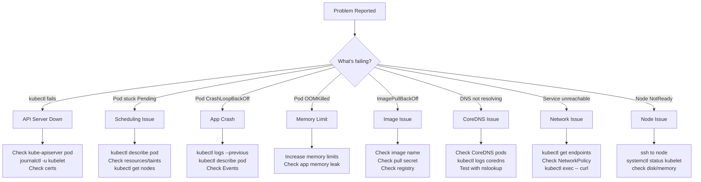

# 5.9.6 Subchapter Review and Final Module 5 Exam

This review covers all of **Subchapter 5.9** (Troubleshooting, Monitoring, Dashboard Tools, kubectl, JSONPath) and serves as the **Final Review for all of Module 5** (Subchapters 5.1 through 5.9).

**Backlinks:** [5.9.1 - Control Plane Troubleshooting](./5.9.1_Troubleshooting_Control_Plane.md) | [5.9.2 - Compute Plane Troubleshooting](./5.9.2_Troubleshooting_Compute_Plane_and_Pods.md) | [5.9.3 - Monitoring](./5.9.3_Monitoring_Prometheus_Grafana_and_Logging.md) | [5.9.4 - Dashboard/k9s](./5.9.4_Dashboard_Tools_and_k9s_Cheatsheet.md) | [5.9.5 - kubectl/JSONPath](./5.9.5_kubectl_Cheatsheet_and_JSONPath.md)

---

## Subchapter 5.9 Quick Command Reference

### Troubleshooting Commands

| Command | Purpose |
|---------|---------|
| `kubectl get pods -w` | Watch pod status live |
| `kubectl describe pod NAME` | Events, conditions, state |
| `kubectl logs NAME` | Current container logs |
| `kubectl logs NAME --previous` | Previous (crashed) container logs |
| `kubectl logs NAME -c CONTAINER` | Specific container logs |
| `kubectl exec -it NAME -- /bin/sh` | Interactive shell |
| `kubectl top pod NAME` | Pod CPU/memory usage |
| `kubectl top nodes` | Node resource usage |
| `kubectl get events --sort-by='.lastTimestamp'` | Recent cluster events |
| `kubectl get nodes` | Node status |
| `kubectl describe node NAME` | Node conditions and pressure |
| `kubectl cordon NODE` | Mark node unschedulable |
| `kubectl drain NODE --ignore-daemonsets` | Drain node for maintenance |
| `kubectl uncordon NODE` | Re-enable node scheduling |
| `kubectl debug node/NAME -it --image=ubuntu` | Debug node filesystem |
| `kubectl delete pod NAME --force --grace-period=0` | Force-delete stuck pod |

### Control Plane Commands

| Command | Purpose |
|---------|---------|
| `kubectl get pods -n kube-system` | All control plane pods |
| `kubectl logs -n kube-system kube-apiserver-master` | API Server logs |
| `sudo journalctl -u kubelet -f` | kubelet service logs |
| `sudo systemctl status kubelet` | kubelet status |
| `sudo crictl ps` | Container runtime status |
| `sudo kubeadm certs check-expiration` | Check certificate expiry |
| `sudo kubeadm certs renew all` | Renew all certificates |
| `kubectl get --raw /healthz` | API Server health |
| `etcdctl endpoint health` | etcd health |
| `etcdctl member list` | etcd cluster members |

### Monitoring Commands

| Command | Purpose |
|---------|---------|
| `helm install prometheus prometheus-community/kube-prometheus-stack` | Install monitoring stack |
| `kubectl port-forward svc/prometheus-server 9090:80 -n monitoring` | Access Prometheus |
| `kubectl port-forward svc/grafana 3000:80 -n monitoring` | Access Grafana |
| `kubectl logs -n monitoring -l app=prometheus` | Prometheus logs |
| `kubectl top pods --containers` | Per-container metrics |

### DNS/CoreDNS Commands

| Command | Purpose |
|---------|---------|
| `kubectl get cm -n kube-system coredns -o yaml` | View CoreDNS config |
| `kubectl rollout restart deploy -n kube-system coredns` | Restart CoreDNS |
| `kubectl logs -n kube-system -l k8s-app=kube-dns` | CoreDNS logs |
| `kubectl run dns-debug --rm -it --image=busybox -- nslookup kubernetes.default` | Test DNS |
| `kubectl exec POD -- cat /etc/resolv.conf` | Pod DNS config |

---

## Cheatsheet: Subchapter 5.9 Core Concepts

### Pod Status Quick Reference

| Status | Meaning | First Action |
|--------|---------|-------------|
| **Pending** | Not scheduled yet | `kubectl describe pod` → check Events |
| **ContainerCreating** | Image pull or volume mount | `kubectl describe pod` → check Events |
| **Running** | Normal operation | Check logs if app misbehaves |
| **CrashLoopBackOff** | Container repeatedly crashing | `kubectl logs NAME --previous` |
| **ImagePullBackOff** | Cannot pull image | Check image name, registry creds |
| **OOMKilled** | Out of memory | Increase memory limits |
| **Evicted** | Node pressure evicted pod | `kubectl describe node` for pressure |
| **Terminating** | Stuck deletion | `kubectl delete pod --force --grace-period=0` |
| **Completed** | Job finished successfully | Normal for Jobs |
| **Error** | Container exited non-zero | `kubectl logs NAME --previous` |

### Node Condition Reference

| Condition | Normal | Problem Signal |
|-----------|--------|---------------|
| `MemoryPressure` | False | Node low on memory → evicts pods |
| `DiskPressure` | False | Node low on disk → evicts pods |
| `PIDPressure` | False | Too many processes on node |
| `Ready` | True | False = node not healthy |
| `NetworkUnavailable` | False | CNI not configured properly |

### Troubleshooting Decision Tree



### Prometheus PromQL Quick Reference

| Query | Purpose |
|-------|---------|
| `up` | All targets that are up (1=up, 0=down) |
| `rate(http_requests_total[5m])` | HTTP request rate |
| `rate(http_requests_total{status=~"5.."}[5m])` | Error rate |
| `histogram_quantile(0.99, rate(http_request_duration_seconds_bucket[5m]))` | P99 latency |
| `container_memory_usage_bytes{namespace="production"}` | Memory usage by namespace |
| `1 - (node_memory_MemAvailable_bytes / node_memory_MemTotal_bytes)` | Node memory usage % |
| `100 - (avg by(instance)(rate(node_cpu_seconds_total{mode="idle"}[5m])) * 100)` | CPU usage % |
| `kube_pod_container_status_restarts_total > 3` | Pods with high restarts |
| `kube_deployment_status_replicas_unavailable > 0` | Deployments with unavailable replicas |

### k9s Essential Shortcuts

| Key | Action |
|-----|--------|
| `:pods` | Show all pods |
| `:deploy` | Show deployments |
| `:svc` | Show services |
| `0` | Show all namespaces |
| `/` | Filter resources |
| `l` | View logs |
| `s` | Shell into container |
| `d` | Describe resource |
| `e` | Edit YAML |
| `ctrl+k` | Delete resource |
| `y` | View YAML |
| `?` | Help / keybindings |
| `q` | Quit / go back |

---

## Interview Questions: Subchapter 5.9

### Question 1
**Scenario:** A pod is stuck in `CrashLoopBackOff`. `kubectl logs` shows "Error: cannot connect to database at db:5432". What's your step-by-step debugging process?

**Answer:**
```bash
# Step 1: Confirm crash reason
kubectl logs mypod --previous
# → "Error: cannot connect to database at db:5432"

# Step 2: Check if the database service exists
kubectl get svc db
# → Not found!  ← root cause

# Step 3: Check endpoints if service exists
kubectl get endpoints db

# Step 4: Verify NetworkPolicy isn't blocking
kubectl get netpol -n production
kubectl describe netpol deny-all

# Step 5: Test connectivity from the pod
kubectl exec mypod -- nc -zv db 5432
# or
kubectl exec mypod -- nslookup db.default.svc.cluster.local

# Fix: Create the missing service
kubectl expose deployment database --port=5432 --name=db
```

### Question 2
**Scenario:** A worker node shows `NotReady`. Existing pods on it are still running but no new pods are scheduled there. kubectl commands work fine.

**Answer:**
```bash
# Step 1: Check node conditions
kubectl describe node worker-1
# → DiskPressure: True   ← Found the problem

# Step 2: SSH to node and investigate disk usage
ssh worker-1
df -h
du -sh /var/lib/docker/* 2>/dev/null | sort -rh | head -20

# Step 3: Common disk consumers in Kubernetes
docker system prune -f           # Remove unused Docker data
crictl images | grep "<none>"    # Find dangling images
sudo journalctl --vacuum-size=500M  # Trim journal logs

# Step 4: After cleanup, verify node recovers
kubectl get nodes  # Should show Ready within 1-2 min

# Prevention:
# - Set --image-gc-high-threshold=85% on kubelet
# - Configure logrotate for container logs
# - Use node monitoring alerts for disk usage > 80%
```

### Question 3
**Scenario:** The API server is not responding. You cannot run any kubectl commands. How do you diagnose?

**Answer:**
```bash
# Step 1: Check if API server is running (SSH to master)
ssh master-1
sudo crictl ps | grep kube-apiserver
# or for systemd-managed:
sudo systemctl status kube-apiserver

# Step 2: Check static pod manifest
sudo cat /etc/kubernetes/manifests/kube-apiserver.yaml
# Look for syntax errors, wrong flags

# Step 3: Check kubelet (which starts static pods)
sudo systemctl status kubelet
sudo journalctl -u kubelet -n 50

# Step 4: Check API server logs directly
sudo crictl logs $(sudo crictl ps -a | grep kube-apiserver | awk '{print $1}')

# Step 5: Check certificates (very common cause)
sudo kubeadm certs check-expiration
# If expired:
sudo kubeadm certs renew all
sudo systemctl restart kubelet

# Step 6: Check etcd connectivity
export ETCDCTL_API=3
etcdctl endpoint health \
  --endpoints=https://127.0.0.1:2379 \
  --cacert=/etc/kubernetes/pki/etcd/ca.crt \
  --cert=/etc/kubernetes/pki/etcd/peer.crt \
  --key=/etc/kubernetes/pki/etcd/peer.key
```

### Question 4
**Scenario:** You need to find all pods across all namespaces that are NOT in Running state, displaying namespace, pod name, and status — using a single kubectl command.

**Answer:**
```bash
# Method 1: JSONPath filter
kubectl get pods -A -o jsonpath='{range .items[?(@.status.phase!="Running")]}{.metadata.namespace}{"\t"}{.metadata.name}{"\t"}{.status.phase}{"\n"}{end}'

# Method 2: Field selector
kubectl get pods -A --field-selector status.phase!=Running

# Method 3: custom-columns (all phases visible)
kubectl get pods -A -o custom-columns='NAMESPACE:.metadata.namespace,NAME:.metadata.name,STATUS:.status.phase' | grep -v Running

# Method 4: jq
kubectl get pods -A -o json | jq -r '.items[] | select(.status.phase != "Running") | "\(.metadata.namespace)\t\(.metadata.name)\t\(.status.phase)"'
```

### Question 5
**Scenario:** Prometheus is installed but showing no data for a new deployment. The deployment pods are running. What are the likely causes?

**Answer:**
```
Cause 1: Pods don't expose a /metrics endpoint
→ Application must have Prometheus instrumentation

Cause 2: No ServiceMonitor resource for the deployment
→ Create a ServiceMonitor:
```
```yaml
apiVersion: monitoring.coreos.com/v1
kind: ServiceMonitor
metadata:
  name: myapp-monitor
  labels:
    release: prometheus  # Must match Prometheus selector
spec:
  selector:
    matchLabels:
      app: myapp
  endpoints:
  - port: metrics
    path: /metrics
    interval: 30s
```
```bash
# Cause 3: NetworkPolicy blocking Prometheus from scraping
kubectl get netpol -n production
# → Add rule allowing prometheus namespace to scrape port 9090

# Cause 4: Wrong port/path in ServiceMonitor
kubectl describe servicemonitor myapp-monitor
kubectl exec -it prometheus-pod -- wget -qO- http://myapp-pod:9090/metrics

# Cause 5: Prometheus RBAC insufficient
kubectl auth can-i get pods --as=system:serviceaccount:monitoring:prometheus
```

---

## Module 5 Complete Reference: All Subchapters

### Subchapter Coverage Map

| Subchapter | Topic | Key Notes |
|------------|-------|-----------|
| **5.1** | Architecture & Setup | Control plane components, kubeadm, Kind, restartPolicy, imagePullPolicy |
| **5.2** | HA & etcd | Stacked/external etcd, etcdctl backup/restore |
| **5.3** | Workloads | Pod spec, controllers, Deployments, StatefulSets, DaemonSets, Scheduling |
| **5.4** | Networking | Services, Ingress, Network Policies, DNS/CoreDNS |
| **5.5** | Storage | emptyDir, hostPath, PV/PVC, StorageClass, CSI |
| **5.6** | Config & Scale | ConfigMaps, Secrets, HPA, VPA, Cluster Autoscaler |
| **5.7** | Package Mgmt | Kustomize overlays, Helm charts, releases |
| **5.8** | Security | Authentication, RBAC, Pod Security, Admission Controllers |
| **5.9** | Observability | Troubleshooting, Monitoring, Tools, kubectl, JSONPath |

---

## Final Module 5 Exam

### Exam Section 1: Architecture and Setup (5.1, 5.2)

**Q1.** List the 4 control plane components and their primary responsibilities.

> **Answer:**
> - **kube-apiserver** – REST API gateway; all kubectl commands go through here; persists state to etcd
> - **etcd** – Distributed key-value store; single source of truth for cluster state
> - **kube-scheduler** – Assigns pods to nodes based on resources, taints, affinity
> - **kube-controller-manager** – Runs reconciliation loops (ReplicaSet, Deployment, Node controllers)

**Q2.** What is the difference between a stacked etcd topology and an external etcd topology in an HA cluster?

> **Answer:**
> - **Stacked:** etcd runs as a pod on the same master nodes as the control plane. Simpler to manage, but control plane and etcd failures are coupled. Minimum 3 masters needed.
> - **External:** etcd runs on dedicated nodes separate from the control plane. More resilient (losing a control plane node doesn't affect etcd), but more complex and expensive. Requires at least 3 dedicated etcd nodes + 3 control plane nodes.

**Q3.** Write the `etcdctl` command to take a snapshot backup of etcd.

> **Answer:**
> ```bash
> ETCDCTL_API=3 etcdctl snapshot save /backup/etcd-snapshot.db \
>   --endpoints=https://127.0.0.1:2379 \
>   --cacert=/etc/kubernetes/pki/etcd/ca.crt \
>   --cert=/etc/kubernetes/pki/etcd/peer.crt \
>   --key=/etc/kubernetes/pki/etcd/peer.key
> ```

---

### Exam Section 2: Workloads and Scheduling (5.3)

**Q4.** What is the difference between `restartPolicy: Always`, `OnFailure`, and `Never`?

> **Answer:**
> | Policy | When container exits 0 | When container exits non-0 | Use case |
> |--------|----------------------|---------------------------|----------|
> | `Always` | Restart | Restart | Long-running services (Deployments) |
> | `OnFailure` | Don't restart | Restart | Batch jobs (Jobs) |
> | `Never` | Don't restart | Don't restart | One-shot tasks |
>
> Default is `Always`. Exponential backoff: 10s → 20s → 40s → … → 5min (max).

**Q5.** A pod is stuck in Pending with the event "0/3 nodes are available: 3 node(s) had untolerated taint". What does this mean and how do you fix it?

> **Answer:**
> The nodes have taints that the pod doesn't tolerate. Check:
> ```bash
> kubectl describe nodes | grep Taint
> # e.g.: Taint: dedicated=gpu:NoSchedule
>
> # Fix: Add toleration to pod spec
> tolerations:
> - key: "dedicated"
>   operator: "Equal"
>   value: "gpu"
>   effect: "NoSchedule"
> ```

**Q6.** What is the difference between a `liveness probe` and a `readiness probe`?

> **Answer:**
> - **Liveness probe:** Determines if the container is alive. Failure → container is **killed and restarted** (triggers restartPolicy).
> - **Readiness probe:** Determines if the container is ready to serve traffic. Failure → pod is **removed from Service endpoints** but NOT restarted. Traffic stops going to it.
> - **Startup probe:** One-time probe at startup. While failing, liveness/readiness probes are disabled. Prevents killing slow-starting containers.

---

### Exam Section 3: Networking (5.4)

**Q7.** What are the 5 service types and when do you use each?

> **Answer:**
> | Type | Access | Use Case |
> |------|--------|---------|
> | `ClusterIP` | Internal cluster only | Service-to-service communication |
> | `NodePort` | Node IP:high-port (30000-32767) | External access without cloud LB (dev/test) |
> | `LoadBalancer` | Cloud LB external IP | Production external access on cloud |
> | `ExternalName` | CNAME to external DNS | Access external services by cluster DNS |
> | `Headless` (`clusterIP: None`) | Direct pod IPs | StatefulSet stable network identity |

**Q8.** Write a NetworkPolicy that denies all ingress to all pods in namespace `production`, then allows only pods with label `app=frontend` to reach pods with `app=backend` on port 8080.

> **Answer:**
> ```yaml
> # Default deny all ingress
> apiVersion: networking.k8s.io/v1
> kind: NetworkPolicy
> metadata:
>   name: deny-all
>   namespace: production
> spec:
>   podSelector: {}
>   policyTypes:
>   - Ingress
> ---
> # Allow frontend → backend
> apiVersion: networking.k8s.io/v1
> kind: NetworkPolicy
> metadata:
>   name: allow-frontend-to-backend
>   namespace: production
> spec:
>   podSelector:
>     matchLabels:
>       app: backend
>   policyTypes:
>   - Ingress
>   ingress:
>   - from:
>     - podSelector:
>         matchLabels:
>           app: frontend
>     ports:
>     - protocol: TCP
>       port: 8080
> ```

**Q9.** What is the FQDN (fully qualified domain name) for a service named `api-service` in namespace `backend`?

> **Answer:** `api-service.backend.svc.cluster.local`
> Short forms (within same namespace): `api-service.backend` or `api-service`

---

### Exam Section 4: Storage (5.5)

**Q10.** What is the difference between `emptyDir` and `hostPath` volumes?

> **Answer:**
> | Feature | emptyDir | hostPath |
> |---------|---------|---------|
> | Lifetime | Pod lifetime | Node lifetime (persists pod restart) |
> | Scope | Pod-local | Mounts specific node path |
> | Data on delete | Deleted with pod | Persists on node |
> | Use case | Cache, temp files, inter-container sharing | Access node files (logs, docker socket) |
> | Security risk | Low | High (node filesystem access) |

**Q11.** Explain the PV/PVC lifecycle: what happens when a PVC is deleted with `reclaimPolicy: Retain` vs `Delete`?

> **Answer:**
> - **Retain:** PV is NOT deleted. PV status changes to `Released`. Data persists on storage backend. Must manually delete PV and reclaim storage. Safe for production.
> - **Delete:** PV AND the underlying storage (e.g., AWS EBS volume) are automatically deleted when PVC is deleted. Convenient but destructive.
> - **Recycle:** (deprecated) Performs `rm -rf` on volume then makes it `Available` again.

---

### Exam Section 5: Config, Autoscaling, Package Management (5.6, 5.7)

**Q12.** What is the difference between a ConfigMap and a Secret? How are they consumed in pods?

> **Answer:**
> - **ConfigMap:** Plain-text configuration data. Not encrypted at rest by default.
> - **Secret:** Base64-encoded (NOT encrypted by default). Can be encrypted at rest with EncryptionConfiguration.
> - Both can be consumed as:
>   1. **Environment variables:** `envFrom: configMapRef` / `secretRef`
>   2. **Volume mounts:** Files in `/etc/config/` or `/etc/secret/`
>   3. **Individual env vars:** `env[].valueFrom.configMapKeyRef`

**Q13.** What triggers an HPA to scale a deployment?

> **Answer:**
> The HPA controller polls metrics every 15 seconds (default). It scales when:
> - Current metric value / target metric value > 1.1 (scale up threshold)
> - Current metric value / target metric value < 0.9 (scale down threshold, with 5 min stabilization)
>
> Metrics sources:
> - `cpu` / `memory` (from metrics-server, resource metrics API)
> - Custom metrics (from Prometheus Adapter, custom.metrics.k8s.io)
> - External metrics (external.metrics.k8s.io)

---

### Exam Section 6: Security (5.8)

**Q14.** Explain the difference between a `Role` and a `ClusterRole`. When do you use each?

> **Answer:**
> | Feature | Role | ClusterRole |
> |---------|------|------------|
> | Scope | Single namespace | Cluster-wide |
> | Resource scope | Namespaced resources | Any resource + cluster-scoped (nodes, PVs, namespaces) |
> | Binding | RoleBinding | ClusterRoleBinding (or RoleBinding for namespace scope) |
> | Use case | Developer access to one namespace | Admin access, viewing nodes, CRDs |
>
> Note: A ClusterRole can be bound with a RoleBinding to limit access to a specific namespace.

**Q15.** What is the difference between a Mutating Admission Webhook and a Validating Admission Webhook?

> **Answer:**
> - **Mutating:** Runs FIRST. Can modify the API request object (add labels, inject sidecars, set defaults). Example: istio sidecar injection, resource limits injection.
> - **Validating:** Runs AFTER mutating webhooks. Can ONLY approve or reject — cannot modify. Example: OPA Gatekeeper policy enforcement, required label checks.
>
> Order: `Authentication → Authorization → Mutating Admission → Object validation → Validating Admission → etcd`

---

### Exam Section 7: Troubleshooting and Observability (5.9)

**Q16.** Write a JSONPath command to get the name and restart count of ALL containers across ALL namespaces.

> **Answer:**
> ```bash
> kubectl get pods -A -o jsonpath='{range .items[*]}{.metadata.namespace}{"\t"}{.metadata.name}{range .status.containerStatuses[*]}{"\t"}{.name}{"\t"}{.restartCount}{"\n"}{end}{end}'
> ```

**Q17.** How would you find all pods that are NOT running with a single kubectl command?

> **Answer:**
> ```bash
> # Method 1: field-selector
> kubectl get pods -A --field-selector status.phase!=Running
>
> # Method 2: jsonpath filter
> kubectl get pods -A -o jsonpath='{range .items[?(@.status.phase!="Running")]}{.metadata.namespace}{"\t"}{.metadata.name}{"\t"}{.status.phase}{"\n"}{end}'
> ```

**Q18.** What is the Golden Signals framework for monitoring and what metrics does each signal represent in Kubernetes?

> **Answer:**
> The Four Golden Signals (Google SRE Book):
> | Signal | Metric | Kubernetes Example |
> |--------|--------|-------------------|
> | **Latency** | Request duration (p50, p99) | `histogram_quantile(0.99, rate(http_request_duration_seconds_bucket[5m]))` |
> | **Traffic** | Requests per second | `rate(http_requests_total[5m])` |
> | **Errors** | Error rate (4xx, 5xx) | `rate(http_requests_total{status=~"5.."}[5m])` |
> | **Saturation** | Resource utilization | CPU%, memory%, disk I/O |

---

## Module 5 Completion Checklist

### Core Concepts

| Concept | Subchapter | Confident? |
|---------|------------|------------|
| Kubernetes architecture (all components) | 5.1 | ☐ |
| kubeadm cluster setup | 5.1 | ☐ |
| restartPolicy and imagePullPolicy | 5.1, 5.3 | ☐ |
| etcd backup and restore | 5.2 | ☐ |
| HA cluster (stacked vs external etcd) | 5.2 | ☐ |
| Pod spec (all fields) | 5.3.1 | ☐ |
| Container probes (startup, liveness, readiness) | 5.3.1 | ☐ |
| Init containers and multi-container patterns | 5.3.1 | ☐ |
| Deployments and rolling updates | 5.3.2 | ☐ |
| StatefulSets and headless services | 5.3.2 | ☐ |
| DaemonSets and Jobs/CronJobs | 5.3.2 | ☐ |
| Taints, tolerations, node affinity | 5.3.3 | ☐ |
| Service types (all 5) | 5.4.1 | ☐ |
| Ingress and Ingress controllers | 5.4.2 | ☐ |
| Gateway API | 5.4.2 | ☐ |
| NetworkPolicy (ingress/egress) | 5.4.3 | ☐ |
| DNS/CoreDNS Corefile configuration | 5.4.4 | ☐ |
| emptyDir, hostPath volumes | 5.5.1 | ☐ |
| PV, PVC, StorageClass | 5.5.2 | ☐ |
| ConfigMaps and Secrets | 5.6.1 | ☐ |
| HPA and VPA | 5.6.2 | ☐ |
| Kustomize overlays | 5.7.1 | ☐ |
| Helm charts and releases | 5.7.2 | ☐ |
| Authentication methods (x509, OIDC, SA tokens) | 5.8.1 | ☐ |
| RBAC (Role, ClusterRole, Bindings) | 5.8.2 | ☐ |
| Admission controllers (mutating/validating) | 5.8.3 | ☐ |
| Control plane troubleshooting | 5.9.1 | ☐ |
| Compute plane / pod troubleshooting | 5.9.2 | ☐ |
| Prometheus PromQL basics | 5.9.3 | ☐ |
| k9s navigation | 5.9.4 | ☐ |
| kubectl JSONPath queries | 5.9.5 | ☐ |

### Command Muscle Memory

| Command Pattern | Ready? |
|----------------|--------|
| `kubectl run --dry-run=client -o yaml` | ☐ |
| `kubectl create deployment --dry-run=client -o yaml` | ☐ |
| `kubectl expose deployment --port --type` | ☐ |
| `kubectl rollout undo deployment` | ☐ |
| `kubectl drain --ignore-daemonsets` | ☐ |
| `kubectl auth can-i --as=user` | ☐ |
| `kubectl get pods -o jsonpath='{range...}{end}'` | ☐ |
| `kubectl get pods -o custom-columns=` | ☐ |
| `etcdctl snapshot save` | ☐ |
| `kubectl create role ... kubectl create rolebinding ...` | ☐ |
| `kubectl cordon/uncordon/drain` | ☐ |
| `kubectl debug node/ -it --image=ubuntu` | ☐ |

---

## Final Study Tips

### CKA Focus Areas
1. `etcdctl backup/restore` — always on the exam
2. Certificate renewal (`kubeadm certs renew all`)
3. `kubectl drain` and `uncordon`
4. RBAC (create Role + RoleBinding in one go)
5. Network troubleshooting (endpoints, logs, exec)

### CKAD Focus Areas
1. Pod spec mastery (probes, resources, volumes, env)
2. `--dry-run=client -o yaml` speed
3. Deployment rollouts and rollback
4. ConfigMaps/Secrets in pods
5. Jobs, CronJobs

### CKS Focus Areas
1. RBAC least privilege
2. Pod Security Standards (`enforce`, `audit`, `warn`)
3. NetworkPolicy (deny-all + selective allow)
4. Admission webhooks (OPA Gatekeeper, Kyverno)
5. Image security (`imagePullPolicy: Always`, image signing)

---

**🎉 Congratulations on completing Module 5: Kubernetes!**

**You've covered:**
- 9 subchapters across 33 comprehensive notes
- 250+ kubectl commands
- 180+ YAML examples  
- 25+ Mermaid architecture diagrams
- 60+ interview questions with full answers
- Complete coverage for CKA, CKAD, and CKS certifications

**Next Module:** Proceed to [Module 6 - Git](../../6-Git/Subchapter_6.1/6.1.1_Git_Objects_References_and_Index.md) for version control fundamentals.
