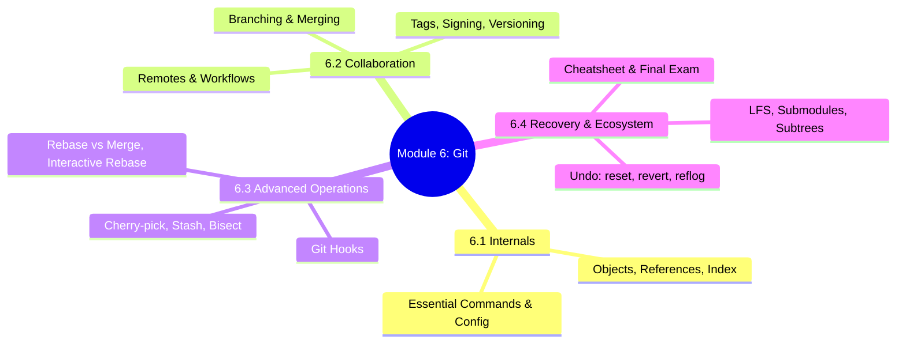
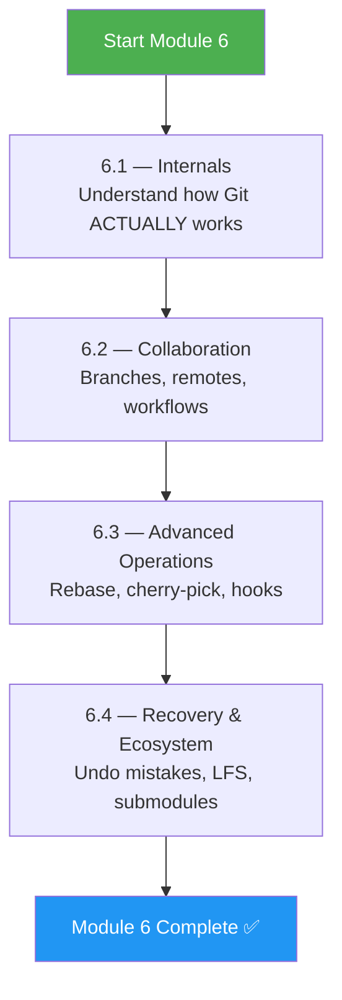
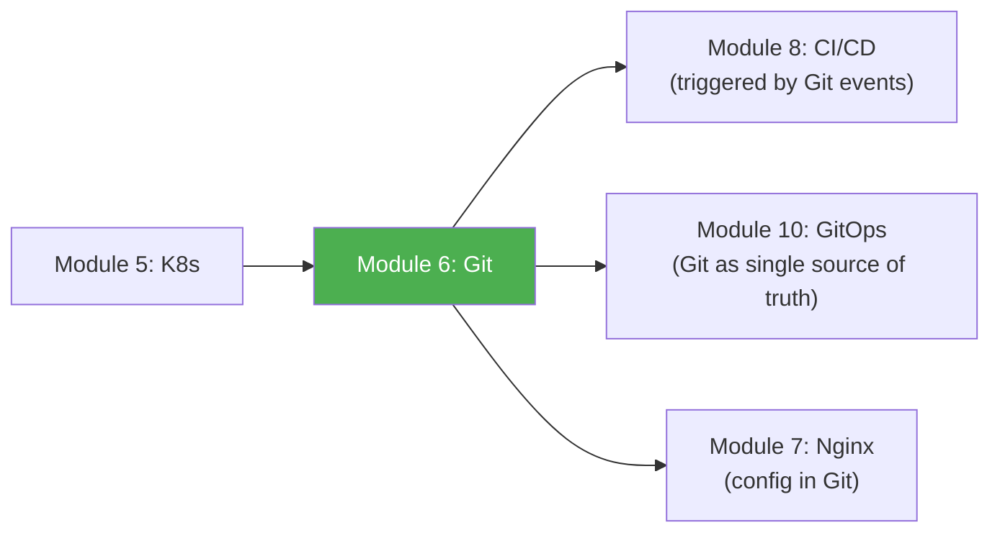

# Module 6 Approach Guide — Git Version Control

## Module Overview

---

## Who Is This Module For?

Git is the **single source of truth** for every DevOps workflow. GitOps, CI/CD pipelines, infrastructure-as-code, configuration management — they all start with a Git repository. This module goes far beyond `git add/commit/push`.

**Target audience:**
- Engineers who use Git daily but panic during merge conflicts or rebase
- Platform engineers managing monorepos, release workflows, and branch protection
- Anyone preparing for GitOps (Module 10) or CI/CD (Module 8) — Git mastery is prerequisite

---

## Prerequisites

| Prerequisite | Required? | Notes |
|---|---|---|
| Module 1 (Linux) completed | **Yes** | Git runs on Linux; you'll use CLI constantly |
| Git installed | **Yes** | `apt install git` or `yum install git` |
| A GitHub/GitLab account | Recommended | For practicing remotes, PRs, and collaboration |
| GPG key (for signing) | Optional | Covered in 6.2.3 |

---

## How to Approach This Module

### Study Strategy

1. **Start with internals (6.1)** — Understanding blobs, trees, and commits makes everything else click.
2. **Practice branching workflows on a real repo** — Create feature branches, merge, rebase, resolve conflicts.
3. **Force yourself to use rebase** — It's scary at first, but interactive rebase is the most powerful Git tool.
4. **Learn reflog immediately** — It's your safety net. Nothing is ever truly lost in Git.
5. **Set up hooks** — Pre-commit hooks catch problems before they enter history.

---

## Time Estimates

| Subchapter | Reading | Practice | Total |
|---|---|---|---|
| 6.1 Internals | 2 hrs | 1.5 hrs | **3.5 hrs** |
| 6.2 Collaboration | 2.5 hrs | 3 hrs | **5.5 hrs** |
| 6.3 Advanced Operations | 2.5 hrs | 3 hrs | **5.5 hrs** |
| 6.4 Recovery & Ecosystem | 2 hrs | 2.5 hrs | **4.5 hrs** |
| **Total** | **9 hrs** | **10 hrs** | **~19 hrs** |

> **Realistic timeline:** 1.5–2 weeks at 2 hours/day.

---

## Practice Lab Ideas

| Lab | Covers | Difficulty |
|---|---|---|
| Create a repo, explore `.git/` directory, find the blob/tree/commit objects manually | 6.1 | ⭐⭐ |
| Simulate a Git Flow workflow: feature branch → PR → merge → release tag | 6.2 | ⭐⭐⭐ |
| Create a merge conflict on purpose, resolve it three ways (merge, rebase, ours/theirs) | 6.2, 6.3 | ⭐⭐⭐ |
| Use `git bisect` to find which commit introduced a bug in a 50-commit history | 6.3 | ⭐⭐⭐ |
| Set up pre-commit + commit-msg hooks that lint code and enforce conventional commits | 6.3 | ⭐⭐⭐ |
| Accidentally `git reset --hard`, recover using `reflog` | 6.4 | ⭐⭐⭐⭐ |

---

## What Success Looks Like

By the end of Module 6, you should be able to:

- [ ] Explain Git's object model (blob, tree, commit, tag) and how references work
- [ ] Use interactive rebase to squash, reorder, edit, and split commits
- [ ] Manage multiple remotes and resolve complex merge conflicts
- [ ] Set up Git hooks for automated quality checks
- [ ] Recover from any Git mistake using reflog, reset, and revert
- [ ] Decide when to use LFS vs submodules vs subtrees
- [ ] Sign commits and tags with GPG

---

## Connection to Other Modules

**Git is the trigger for everything.** CI/CD pipelines (Module 8) run on push/PR events. GitOps (Module 10) reconciles cluster state from Git repos. Every Kubernetes manifest, Nginx config, and Python script lives in Git.

> **Next module:** [Module 7 — Nginx](../7-Nginx/Module_7_Approach_Guide.md)
