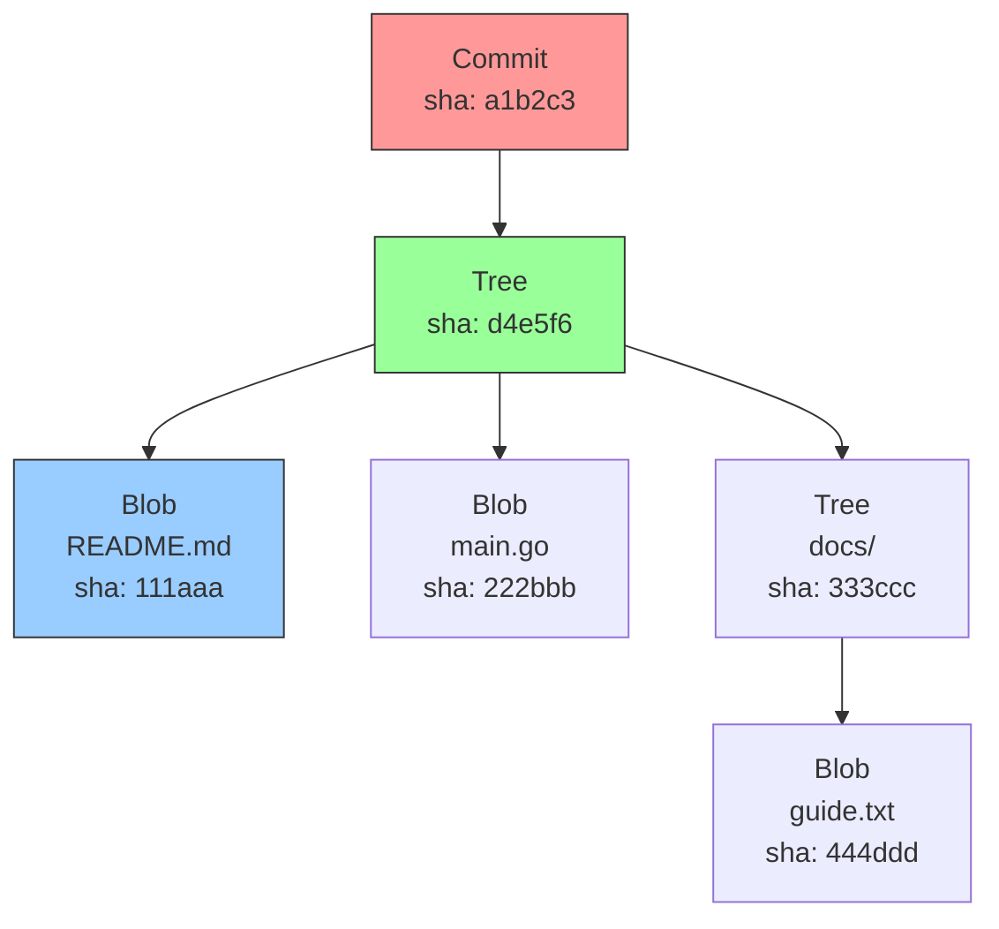
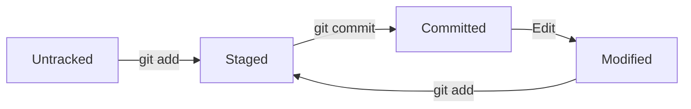

6.1.1 Git Objects, References, and Index: What's Really Inside .git

#### Why Git Internals Matter

You use Git every day, but understanding what happens under the hood transforms you from a casual user to a confident power user. Knowing Git's object model helps you:

- Recover seemingly lost commits (using `git reflog`)
- Understand why certain operations are fast or slow
- Debug weird repository states
- Appreciate why Git is a content-addressable filesystem

This note covers Git's object model. Note 6.1.2 covers essential commands; note 6.1.3 is the subchapter review.

***

## Part 1: The `.git` Directory – Your Repository's Brain

```bash
# Create a new repository and explore .git
mkdir myrepo && cd myrepo
git init
ls -la .git/
```

### `.git` Directory Structure

```
.git/
├── HEAD                # Current branch reference
├── config              # Repository-specific configuration
├── description         # Repository description (for GitWeb)
├── hooks/              # Client/server-side scripts
├── info/               # Additional info (excludes file)
├── objects/            # Git object database
│   ├── info/
│   └── pack/
├── refs/               # References to objects
│   ├── heads/          # Local branches
│   ├── remotes/        # Remote branches
│   └── tags/           # Tags
├── index               # Staging area (binary file)
└── logs/               # Reflogs (where HEAD moved)
    ├── HEAD
    └── refs/
```

***

## Part 2: Git Objects – The Content-Addressable Filesystem

Git is fundamentally a **content-addressable filesystem** with a VCS interface. Every piece of content is stored as an object, identified by its SHA-1 hash.

### The Four Object Types

| Object Type | Stores                                                       | Created By              |
| ----------- | ------------------------------------------------------------ | ----------------------- |
| **Blob**    | File content                                                 | `git add`               |
| **Tree**    | Directory structure (filenames, modes, blob/tree references) | `git add`, `git commit` |
| **Commit**  | Snapshot metadata (tree, parent, author, message)            | `git commit`            |
| **Tag**     | Annotated tag information                                    | `git tag -a`            |

### Object Relationships



### Exploring Objects

```bash
# Create a file and commit it
echo "Hello Git" > hello.txt
git add hello.txt
git commit -m "First commit"

# Find the commit SHA
git log --oneline
# a1b2c3d First commit

# View commit object
git cat-file -p a1b2c3d
# tree 1234567890abcdef...
# parent (none for first commit)
# author Alice <alice@example.com> 1234567890 -0700
# committer Alice <alice@example.com> 1234567890 -0700
#
# First commit

# View tree object
git cat-file -p 1234567
# 100644 blob 9876543210...    hello.txt

# View blob object (file content)
git cat-file -p 9876543
# Hello Git

# Check object type
git cat-file -t a1b2c3d
# commit
```

### SHA-1 Hashes

```bash
# Compute SHA-1 of file content (Git's method)
echo "Hello Git" | git hash-object --stdin
# 9876543210abcdef...

# Git uses SHA-1 (40 chars) or SHA-256 (64 chars) in newer versions
```

***

## Part 3: The Index (Staging Area)

The index is a binary file (`.git/index`) that tracks what will go into the next commit.

### How the Index Works

```bash
# Stage a file (adds to index)
git add hello.txt

# View staged changes
git diff --cached

# View index contents (low-level)
git ls-files --stage
# 100644 9876543210... 0       hello.txt
# Format: mode hash stage filename

# Unstage a file
git rm --cached hello.txt
git reset HEAD hello.txt
```

### Index States

| State          | Meaning                  | How to Achieve  |
| -------------- | ------------------------ | --------------- |
| **Unmodified** | File matches last commit | After commit    |
| **Modified**   | File changed, not staged | Edit file       |
| **Staged**     | File added to index      | `git add`       |
| **Untracked**  | New file, never staged   | Create new file |



***

## Part 4: References (Refs)

References are pointers to commits. They live in `.git/refs/`.

### Branch References

```bash
# Branches are files containing commit SHAs
cat .git/refs/heads/main
# a1b2c3d4e5f6...

# Create a branch (creates new reference)
git branch feature
cat .git/refs/heads/feature
# a1b2c3d4e5f6... (same as main)

# Switch branch (updates HEAD)
git checkout feature
cat .git/HEAD
# ref: refs/heads/feature
```

### HEAD – Where You Are Now

HEAD is a special reference pointing to the current branch (or commit in detached HEAD state).

```bash
# HEAD as symbolic reference
cat .git/HEAD
# ref: refs/heads/main

# Detached HEAD (checkout a commit directly)
git checkout a1b2c3d
cat .git/HEAD
# a1b2c3d4e5f6... (commit SHA directly)
```

### Remote References

```bash
# After cloning, remote branches are stored
cat .git/refs/remotes/origin/main
# a1b2c3d4e5f6...

# Fetch updates remote refs
git fetch origin
```

### Tags

```bash
# Lightweight tag (just a reference)
git tag v1.0
cat .git/refs/tags/v1.0
# a1b2c3d4e5f6...

# Annotated tag (tag object + reference)
git tag -a v1.1 -m "Release 1.1"
# Creates object in .git/objects/
```

***

## Part 5: The Reflog – Your Safety Net

The reflog records where HEAD has pointed (local movements only, not pushed).

```bash
# View reflog
git reflog
# a1b2c3d HEAD@{0}: commit: Second commit
# 9876543 HEAD@{1}: commit: First commit

# Recover a "lost" commit
git checkout HEAD@{1}
git branch recover-branch HEAD@{1}
```

**What reflog tracks:**

- Branch switches (`git checkout`)
- Commits (`git commit`)
- Resets (`git reset`)
- Merges, rebases, cherry-picks

**Reflog expiration:** Default 90 days for reachable commits, 30 days for unreachable.

***

## Part 6: Packfiles – Efficient Storage

Git periodically packs multiple objects into a single file (packfile) to save space.

```bash
# Force garbage collection
git gc

# Packfiles are in .git/objects/pack/
ls -la .git/objects/pack/
# pack-abc123.idx
# pack-abc123.pack

# Check packfile contents
git verify-pack -v .git/objects/pack/pack-abc123.idx
```

**When Git packs:**

- After `git gc` (garbage collection)
- Automatically after many loose objects
- When pushing to remote

***

## Quick Task: Explore Git Internals

_Create a repository and examine its internal structure._

1. Initialize a new repository.
2. Create a file, add it, and commit.
3. Explore `.git/objects/` to find the blob, tree, and commit objects.
4. Use `git cat-file -p` to examine each object.
5. View `.git/refs/heads/main` to see the branch reference.
6. View `.git/HEAD` to see the current branch.

> **Ready Solution:**
>
>

***

## Summary Table: Git Objects

| Object | Stores             | Command to View                | Example                       |
| ------ | ------------------ | ------------------------------ | ----------------------------- |
| Blob   | File content       | `git cat-file -p <blob-sha>`   | File contents                 |
| Tree   | Directory listing  | `git cat-file -p <tree-sha>`   | Filenames, modes, SHAs        |
| Commit | Snapshot metadata  | `git cat-file -p <commit-sha>` | Tree, parent, author, message |
| Tag    | Annotated tag info | `git cat-file -p <tag-sha>`    | Tag name, target, message     |

### Git Directory Reference

| Path                 | Purpose                  |
| -------------------- | ------------------------ |
| `.git/HEAD`          | Current branch reference |
| `.git/config`        | Repository configuration |
| `.git/objects/`      | Object database          |
| `.git/refs/heads/`   | Local branch references  |
| `.git/refs/remotes/` | Remote branch references |
| `.git/refs/tags/`    | Tag references           |
| `.git/index`         | Staging area             |
| `.git/logs/HEAD`     | Reflog                   |

### Object Types and Commands

| Command                  | Purpose                  |
| ------------------------ | ------------------------ |
| `git cat-file -t <sha>`  | Show object type         |
| `git cat-file -p <sha>`  | Show object content      |
| `git cat-file -s <sha>`  | Show object size         |
| `git ls-tree <tree-sha>` | List tree contents       |
| `git rev-parse <ref>`    | Resolve reference to SHA |

***

**Next note (6.1.2)** will cover **Essential Git Commands and Configuration** – `init`, `clone`, `add`, `commit`, `status`, `log`, `diff`, `.gitignore`, and configuration.

**Backward references:** None (this is foundational for the module).
