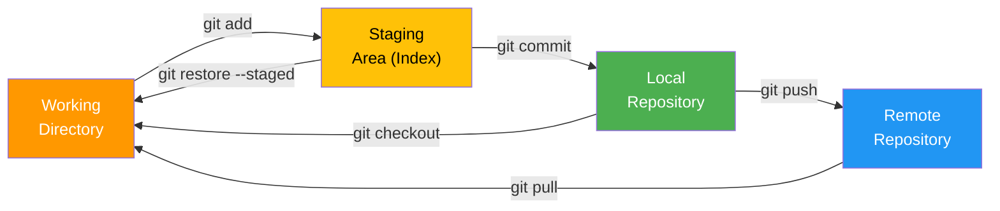

# 6.1.2 Essential Git Commands and Configuration: Your Daily Toolkit

**Backlinks:** [6.1.1 - Git Objects and Internals](./6.1.1_Git_Objects_References_and_Index.md)

**Next note:** [6.1.3 - Subchapter Review](./6.1.3_Subchapter_Review.md)

---

#### Why These Commands Matter

Git has over 150 commands, but you'll use about 15 of them daily. Mastering the essential commands makes you productive without memorizing everything. This note covers the core workflow commands you'll use every day.

This note covers essential commands and configuration. Note 6.1.1 covered Git internals; note 6.1.3 is the subchapter review.

***

### Git Workflow Areas



## Part 1: Getting Started – init, clone, config

### git init – Create a New Repository

```bash
# Create new repository in current directory
git init

# Create new repository in specific directory
git init myproject

# Initialize with default branch name (main)
git init --initial-branch=main
```

### git clone – Copy an Existing Repository

```bash
# Clone via HTTPS
git clone https://github.com/user/repo.git

# Clone via SSH
git clone git@github.com:user/repo.git

# Clone into specific directory
git clone https://github.com/user/repo.git myfolder

# Clone specific branch
git clone -b develop https://github.com/user/repo.git

# Shallow clone (only latest commit, faster)
git clone --depth 1 https://github.com/user/repo.git

# Clone with all submodules
git clone --recursive https://github.com/user/repo.git
```

### git config – Configure Git

```bash
# Set user name and email (required for commits)
git config --global user.name "Alice Smith"
git config --global user.email "alice@example.com"

# Set default editor
git config --global core.editor "vim"

# Set default branch name
git config --global init.defaultBranch main

# Enable colored output
git config --global color.ui auto

# Set diff tool
git config --global diff.tool vimdiff

# View all configurations
git config --list
git config --global --list

# Set configuration for specific repository (remove --global)
git config user.name "Bob Jones"

# Aliases (shortcuts)
git config --global alias.co checkout
git config --global alias.br branch
git config --global alias.st status
git config --global alias.lg "log --oneline --graph --all"
```

### Configuration Levels

| Level      | Location         | Scope               | Command    |
| ---------- | ---------------- | ------------------- | ---------- |
| **System** | `/etc/gitconfig` | All users on system | `--system` |
| **Global** | `~/.gitconfig`   | Your user           | `--global` |
| **Local**  | `.git/config`    | Current repository  | (default)  |

***

## Part 2: Basic Workflow – add, commit, status, log

### git status – Check What's Changed

```bash
# Show working directory and staging area status
git status

# Short format
git status -s
# M modified.txt   (staged)
#  M working.txt   (modified, not staged)
# ?? newfile.txt   (untracked)
```

### git add – Stage Changes

```bash
# Stage specific file
git add hello.txt

# Stage multiple files
git add file1.txt file2.txt

# Stage all changes in current directory
git add .

# Stage all changes in entire repository
git add -A

# Stage only modified/deleted (not untracked)
git add -u

# Stage interactively (patch mode)
git add -p
# Choose y/n/s/e for each hunk

# Stage part of a file (edit mode)
git add -e hello.txt
```

### git commit – Save Changes

```bash
# Commit with message
git commit -m "Add hello.txt"

# Commit with multi-line message
git commit -m "Add hello.txt" -m "Also update README"

# Stage all tracked changes and commit (skip git add)
git commit -a -m "Update all tracked files"

# Amend last commit (change message or add forgotten files)
git commit --amend -m "New message"
git commit --amend --no-edit  # Keep same message

# Add forgotten file to last commit
git add forgotten.txt
git commit --amend --no-edit
```

### git log – View History

```bash
# Full log
git log

# One line per commit
git log --oneline

# Graph with branches
git log --oneline --graph --all

# Last N commits
git log -5

# Commits by author
git log --author="Alice"

# Commits with specific message
git log --grep="bugfix"

# Commits affecting specific file
git log -- hello.txt

# Commits in date range
git log --since="2 weeks ago" --until="yesterday"

# Pretty format
git log --pretty=format:"%h - %an, %ar : %s"

# Show changes in each commit
git log -p
```

***

## Part 3: Comparing Changes – diff, show

### git diff – See What Changed

```bash
# Changes not yet staged
git diff

# Changes staged (will be committed)
git diff --staged
git diff --cached

# Changes between two commits
git diff a1b2c3d e4f5g6h

# Changes between branches
git diff main..feature

# Changes for specific file
git diff -- hello.txt

# Word diff (easier to read)
git diff --word-diff
```

### git show – View Commit Details

```bash
# Show latest commit
git show

# Show specific commit
git show a1b2c3d

# Show only commit message and stats
git show --stat a1b2c3d

# Show only file names changed
git show --name-only a1b2c3d

# Show specific file from commit
git show a1b2c3d:path/to/file.txt
```

***

## Part 4: Removing and Moving – rm, mv

### git rm – Remove Files

```bash
# Remove file from working directory and stage deletion
git rm hello.txt

# Remove file from Git but keep on disk (stop tracking)
git rm --cached config.env

# Remove directory recursively
git rm -r old-folder/

# Force remove (if file has uncommitted changes)
git rm -f hello.txt
```

### git mv – Move/Rename Files

```bash
# Rename file (equivalent to git rm + git add)
git mv oldname.txt newname.txt

# Move file to directory
git mv hello.txt docs/hello.txt
```

***

## Part 5: .gitignore – Ignoring Files

### .gitignore Syntax

```gitignore
# Comments start with hash

# Ignore specific file
secret.env

# Ignore directory
node_modules/
dist/

# Wildcards
*.log
*.tmp

# Negate pattern (don't ignore)
!important.log

# Directory wildcard
**/temp/

# Ignore files in any directory with name "temp"
**/temp

# Ignore file at root only
/config.yml
/README.md
```

### Example .gitignore for Different Projects

**Node.js:**

```gitignore
node_modules/
npm-debug.log
.env
.DS_Store
dist/
build/
coverage/
*.log
```

**Python:**

```gitignore
__pycache__/
*.py[cod]
*.so
.Python
env/
venv/
.env
*.egg-info/
dist/
build/
```

**Go:**

```gitignore
*.exe
*.test
*.out
/vendor/
/bin/
/dist/
```

**Java:**

```gitignore
*.class
*.jar
*.war
target/
build/
.gradle/
```

### Global .gitignore

```bash
# Create global ignore file for OS-specific files
git config --global core.excludesfile ~/.gitignore_global

# Add to ~/.gitignore_global
echo ".DS_Store" >> ~/.gitignore_global
echo "Thumbs.db" >> ~/.gitignore_global
```

***

## Part 6: Working with Remotes

```bash
# Add remote repository
git remote add origin https://github.com/user/repo.git

# Show remotes
git remote -v
# origin  https://github.com/user/repo.git (fetch)
# origin  https://github.com/user/repo.git (push)

# Show remote branches
git remote show origin

# Rename remote
git remote rename origin upstream

# Remove remote
git remote remove upstream
```

### git fetch, pull, push

```bash
# Fetch changes from remote (doesn't merge)
git fetch origin

# Fetch and merge (pull)
git pull origin main

# Pull with rebase instead of merge
git pull --rebase origin main

# Push changes to remote
git push origin main

# Push and set upstream (tracking)
git push -u origin main

# Delete remote branch
git push origin --delete feature-branch

# Push all tags
git push --tags
```

***

## Part 7: Aliases – Speed Up Your Workflow

```bash
# Common aliases
git config --global alias.co checkout
git config --global alias.br branch
git config --global alias.st status
git config --global alias.lg "log --oneline --graph --all"
git config --global alias.unstage "reset HEAD --"
git config --global alias.last "log -1 HEAD"
git config --global alias.undo "reset --soft HEAD^"

# Usage
git co main
git br feature
git st
git lg
git unstage hello.txt
git last
git undo
```

***

## Quick Task: Essential Commands Practice

_Create a repository and practice the basic workflow\._

1. Create a new repository and configure user email.
2. Create a file, add it, and commit.
3. Modify the file, check status, diff, then commit.
4. View commit history in one-line format.
5. Add a `.gitignore` to ignore `.log` files.
6. Create an alias for `git log --oneline --graph`.

> **Ready Solution:**

***

## Summary Table: Essential Git Commands

| Command      | Purpose              | Example                 |
| ------------ | -------------------- | ----------------------- |
| `git init`   | Create new repo      | `git init myproject`    |
| `git clone`  | Copy existing repo   | `git clone https://...` |
| `git status` | Check what's changed | `git status -s`         |
| `git add`    | Stage changes        | `git add .`             |
| `git commit` | Save changes         | `git commit -m "msg"`   |
| `git log`    | View history         | `git log --oneline`     |
| `git diff`   | See changes          | `git diff --staged`     |
| `git show`   | View commit          | `git show a1b2c3d`      |
| `git rm`     | Remove files         | `git rm file.txt`       |
| `git mv`     | Move/rename          | `git mv old new`        |
| `git remote` | Manage remotes       | `git remote -v`         |
| `git fetch`  | Download from remote | `git fetch origin`      |
| `git pull`   | Fetch + merge        | `git pull origin main`  |
| `git push`   | Upload to remote     | `git push origin main`  |

### Configuration Levels

| Level  | Scope        | File             |
| ------ | ------------ | ---------------- |
| System | All users    | `/etc/gitconfig` |
| Global | Your user    | `~/.gitconfig`   |
| Local  | Current repo | `.git/config`    |

### .gitignore Common Patterns

| Pattern          | Matches                     |
| ---------------- | --------------------------- |
| `*.log`          | All .log files              |
| `build/`         | build directory             |
| `!important.log` | important.log (not ignored) |
| `**/temp/`       | temp directory anywhere     |
| `/README.md`     | README.md at root only      |

***

**Next note (6.1.3)** will be the Subchapter Review for Git Internals and Essential Commands, including a cheatsheet and scenario-based interview questions.

**Backward references:**

- Git internals from 6.1.1 (objects, refs, index)
- Command-line basics from Module 1 (using terminal)
