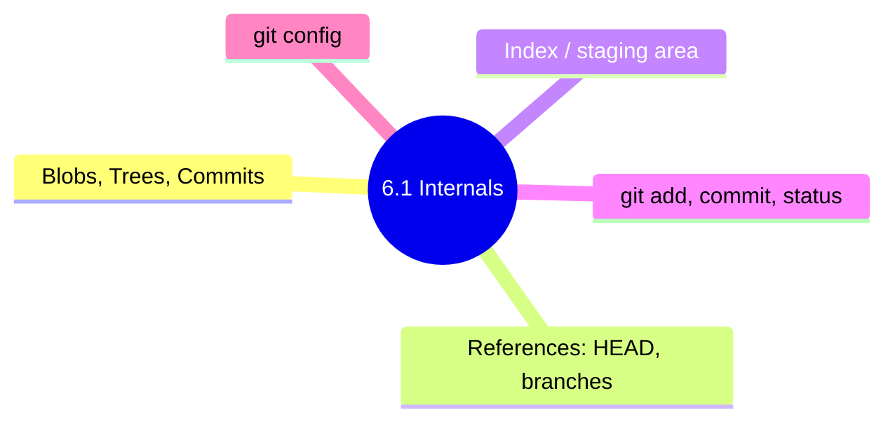

# 6.1.3 Subchapter 6.1 Review: Git Internals and Essential Commands

**Backlinks:** [6.1.1 - Git Objects and Internals](./6.1.1_Git_Objects_References_and_Index.md) | [6.1.2 - Essential Git Commands](./6.1.2_Essential_Git_Commands_and_Configuration.md)

**Next:** [6.2.1 - Branching and Merging Strategies](../Subchapter_6.2/6.2.1_Branching_and_Merging_Strategies.md)



---

This review covers only the material presented in Notes 6.1.1 (Git Objects, References, and Index) and 6.1.2 (Essential Git Commands and Configuration). No forward referencing beyond what was explicitly introduced.

---

## Cheatsheet: Git Internals and Essential Commands

### Git Objects

| Object | Stores | View Command |
|--------|--------|--------------|
| Blob | File content | `git cat-file -p <blob-sha>` |
| Tree | Directory structure | `git cat-file -p <tree-sha>` |
| Commit | Snapshot metadata | `git cat-file -p <commit-sha>` |
| Tag | Annotated tag info | `git cat-file -p <tag-sha>` |

### `.git` Directory Structure

```
.git/
├── HEAD           # Current branch reference
├── config         # Repository configuration
├── objects/       # Object database
├── refs/heads/    # Local branches
├── refs/remotes/  # Remote branches
├── refs/tags/     # Tags
├── index          # Staging area
└── logs/          # Reflog
```

### Essential Git Commands

| Command | Purpose | Example |
|---------|---------|---------|
| `git init` | Create new repo | `git init myproject` |
| `git clone` | Copy existing repo | `git clone https://github.com/user/repo.git` |
| `git status` | Check what's changed | `git status -s` |
| `git add` | Stage changes | `git add .` |
| `git commit` | Save changes | `git commit -m "message"` |
| `git log` | View history | `git log --oneline --graph` |
| `git diff` | See changes | `git diff --staged` |
| `git show` | View commit | `git show a1b2c3d` |
| `git rm` | Remove files | `git rm file.txt` |
| `git mv` | Move/rename | `git mv old new` |
| `git remote` | Manage remotes | `git remote -v` |
| `git fetch` | Download from remote | `git fetch origin` |
| `git pull` | Fetch + merge | `git pull origin main` |
| `git push` | Upload to remote | `git push origin main` |

### Git Configuration Levels

| Level | Scope | File | Command |
|-------|-------|------|---------|
| System | All users | `/etc/gitconfig` | `--system` |
| Global | Your user | `~/.gitconfig` | `--global` |
| Local | Current repo | `.git/config` | (default) |

### Essential Configurations

```bash
git config --global user.name "Your Name"
git config --global user.email "your@email.com"
git config --global core.editor vim
git config --global init.defaultBranch main
git config --global color.ui auto
```

### Git Aliases

```bash
git config --global alias.co checkout
git config --global alias.br branch
git config --global alias.st status
git config --global alias.lg "log --oneline --graph --all"
git config --global alias.unstage "reset HEAD --"
```

### .gitignore Common Patterns

| Pattern | Matches |
|---------|---------|
| `*.log` | All .log files |
| `node_modules/` | node_modules directory |
| `dist/` | dist directory |
| `!important.log` | important.log (not ignored) |
| `**/temp/` | temp directory anywhere |
| `/README.md` | README.md at root only |

### Git Object Commands

| Command | Purpose |
|---------|---------|
| `git cat-file -t <sha>` | Show object type |
| `git cat-file -p <sha>` | Show object content |
| `git cat-file -s <sha>` | Show object size |
| `git ls-tree <tree-sha>` | List tree contents |
| `git rev-parse <ref>` | Resolve reference to SHA |

---

## Comparison Tables

### Git States

| State | Meaning | How to Reach |
|-------|---------|--------------|
| **Untracked** | New file, never staged | Create new file |
| **Modified** | Changed, not staged | Edit tracked file |
| **Staged** | Added to index | `git add` |
| **Committed** | Saved to repository | `git commit` |

### Configuration Levels

| Level | Scope | Override Order |
|-------|-------|----------------|
| System | All users | Lowest priority |
| Global | Your user | Overrides system |
| Local | Current repo | Highest priority |

### Remote Commands

| Command | Effect |
|---------|--------|
| `git fetch` | Download changes (no merge) |
| `git pull` | Download + merge |
| `git push` | Upload changes |

---

## Interview Questions (Scenario-Based)

These questions assume only knowledge from Subchapter 6.1. Answers reference only concepts from 6.1.1 and 6.1.2.

### Question 1

**Scenario:** A developer runs `git commit` but forgot to add a file. They haven't pushed yet.

**Question:** How can they add the forgotten file to the last commit without creating a new commit? What are the implications?

**Answer:**

**Solution:** Use `git commit --amend`

```bash
# Add forgotten file
git add forgotten.txt

# Amend last commit (preserve original message)
git commit --amend --no-edit

# Or change message as well
git commit --amend -m "New commit message"
```

**Implications:**
- **Local only:** Safe if commit hasn't been pushed
- **Changes commit SHA** – the amended commit gets a new hash
- **If already pushed:** Amending causes divergence; need `git push --force` (dangerous on shared branches)

**If already pushed to shared branch (not recommended):**
```bash
git push --force-with-lease origin main
```

**Best practice:** Only amend commits that haven't been pushed to shared branches.

### Question 2

**Scenario:** A developer accidentally added a large file (500MB) and committed it. They later removed it, but the repository size is still huge.

**Question:** Why is the repository still large? How can they permanently remove the file from Git history?

**Answer:**

**Why it's still large:** Git stores every version of every file permanently. Even though the file was removed in a later commit, the blob object still exists in the object database.

**Solution:** Use `git filter-branch` or `git filter-repo` (modern)

**Using `git filter-repo` (recommended):**
```bash
# Install git-filter-repo
pip install git-filter-repo

# Remove file from entire history
git filter-repo --path large-file.bin --invert-paths

# Force push (rewrites history)
git push --force --all
```

**Using `git filter-branch` (legacy):**
```bash
git filter-branch --force --index-filter \
  "git rm --cached --ignore-unmatch large-file.bin" \
  --prune-empty --tag-name-filter cat -- --all
```

**After removal:**
```bash
# Clean up references
git reflog expire --expire=now --all
git gc --prune=now --aggressive

# Force push
git push --force --all
git push --force --tags
```

**Warning:** Rewriting history affects all collaborators. Coordinate with team and force everyone to clone fresh.

### Question 3

**Scenario:** A team has multiple developers committing to the same repository. A developer runs `git pull` and gets a merge conflict.

**Question:** What causes merge conflicts? How do you resolve them? What commands show which commits caused the conflict?

**Answer:**

**What causes merge conflicts:** When two developers modify the same lines in the same file, Git cannot automatically determine which change to keep.

**Resolve conflicts:**
```bash
# After git pull shows conflict
git status
# both modified:   file.txt

# Edit file.txt to resolve conflicts
# Conflict markers:
# <<<<<<< HEAD
# your changes
# =======
# incoming changes
# >>>>>>> branch

# After resolving
git add file.txt
git commit -m "Resolve merge conflict"
```

**Commands to see conflicting commits:**
```bash
# Show merge base (common ancestor)
git merge-base main feature

# Show commits on each branch since merge base
git log main...feature

# Show conflicts in detail
git diff --merge

# Show who made conflicting changes
git blame file.txt
```

**Prevent conflicts:**
- Pull frequently (`git pull --rebase`)
- Communicate about shared files
- Keep branches short-lived
- Use feature flags

### Question 4

**Scenario:** A developer types `git log` and sees a long list. They want to see a compact view with branch structure.

**Question:** What command shows a compact graph with branches? How would you create a permanent alias for this?

**Answer:**

**Command:**
```bash
git log --oneline --graph --all --decorate
```

**Output example:**
```
* a1b2c3d (HEAD -> main) Fix bug
* e4f5g6h Add feature
| * i7j8k9l (feature-branch) WIP
|/  
* m9n0o1p Initial commit
```

**Create permanent alias:**
```bash
# Single line alias
git config --global alias.lg "log --oneline --graph --all --decorate"

# Or with more detail
git config --global alias.tree "log --graph --pretty=format:'%C(yellow)%h%C(cyan)%d%Creset %s %C(white)- %an, %ar%Creset' --all"

# Usage
git lg
git tree
```

**Other useful log formats:**
```bash
# Last 5 commits
git log -5 --oneline

# Commits by author
git log --author="Alice" --oneline

# Commits with grep
git log --grep="bugfix" --oneline

# Commits affecting file
git log --oneline -- hello.txt
```

### Question 5

**Scenario:** A developer wants to ignore all `.log` files, except `important.log`. They also want to ignore the entire `node_modules` directory.

**Question:** Write the `.gitignore` file that achieves this.

**Answer:**

```gitignore
# Ignore all .log files
*.log

# Except important.log
!important.log

# Ignore node_modules directory
node_modules/

# Ignore build outputs
dist/
build/
*.exe
*.dll

# Ignore environment files
.env
.env.local
.env.*.local

# Ignore OS files
.DS_Store
Thumbs.db

# Ignore IDE files
.vscode/
.idea/
*.swp
*.swo

# Ignore logs directory (if separate)
logs/
*.pid
*.seed
```

**Verify .gitignore:**
```bash
# Check what files are ignored
git status --ignored

# Check if a specific file would be ignored
git check-ignore -v debug.log

# Debug .gitignore patterns
git check-ignore -v node_modules/
```

**Pattern explanation:**
- `*.log` – matches any file ending with .log
- `!important.log` – negates the pattern for important.log
- `node_modules/` – matches the directory and all contents
- Order matters: negation must come after the general pattern

---

## Topics Covered in This Subchapter (Self-Check)

| Topic | Found in Note |
|-------|---------------|
| Git object types (blob, tree, commit, tag) | 6.1.1 |
| `.git` directory structure | 6.1.1 |
| Index (staging area) | 6.1.1 |
| References (HEAD, branches, tags) | 6.1.1 |
| Reflog | 6.1.1 |
| Packfiles and garbage collection | 6.1.1 |
| `git init`, `git clone` | 6.1.2 |
| `git config` (global, local, system) | 6.1.2 |
| `git status` | 6.1.2 |
| `git add` (including `-p`, `-A`, `-u`) | 6.1.2 |
| `git commit` (including `--amend`) | 6.1.2 |
| `git log` (oneline, graph, author, grep) | 6.1.2 |
| `git diff` (staged, between commits) | 6.1.2 |
| `git show` | 6.1.2 |
| `git rm`, `git mv` | 6.1.2 |
| `.gitignore` patterns and syntax | 6.1.2 |
| Remote commands (`git remote`, `fetch`, `pull`, `push`) | 6.1.2 |
| Git aliases | 6.1.2 |

## Bridge Concepts (Not in Notes but Added for Clarity)

| Concept | Explanation |
|---------|-------------|
| `git filter-repo` | Modern tool for rewriting Git history. More powerful and safer than `filter-branch`. |
| `git blame` | Shows who last modified each line of a file. Used in Q3 for conflict resolution. |
| `git merge-base` | Finds the common ancestor commit between two branches. Used to understand conflict origins. |
| `git cherry-pick` | Apply specific commits to current branch. Covered in 6.3.2. |
| `git reflog` | Records where HEAD has pointed. Used to recover lost commits. Covered in 6.4.1. |

---

**End of Subchapter 6.1 Review**

**Next:** Proceed to Subchapter 6.2 – Branching, Merging, and Remote Workflows (branch management, merge strategies, Git Flow, GitHub Flow, pull requests).

Congratulations on completing Subchapter 6.1! You now understand Git's internals and essential daily commands. You can initialize repositories, stage changes, commit, view history, and configure Git for your workflow.
