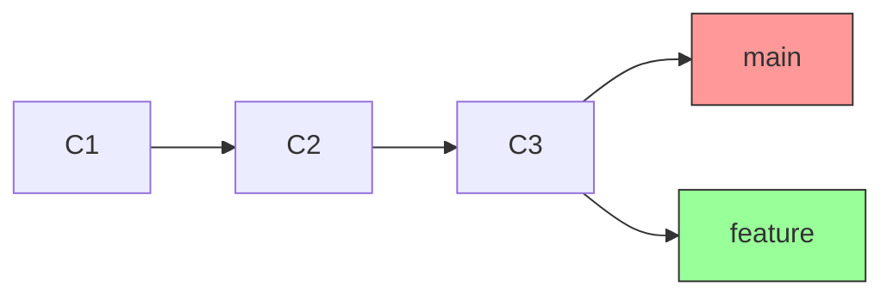
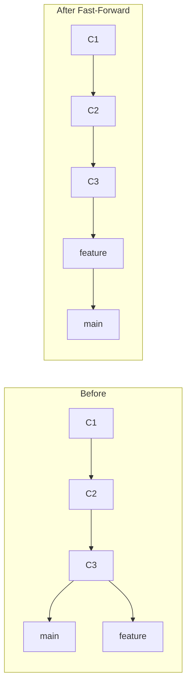
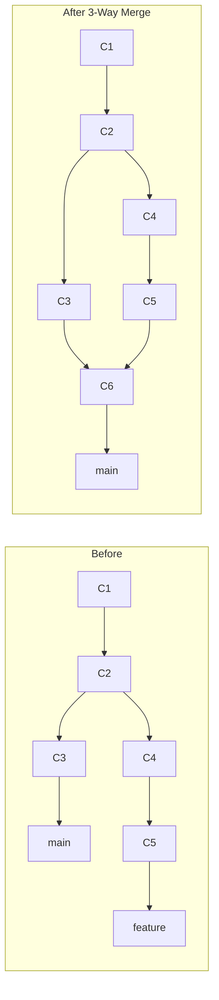
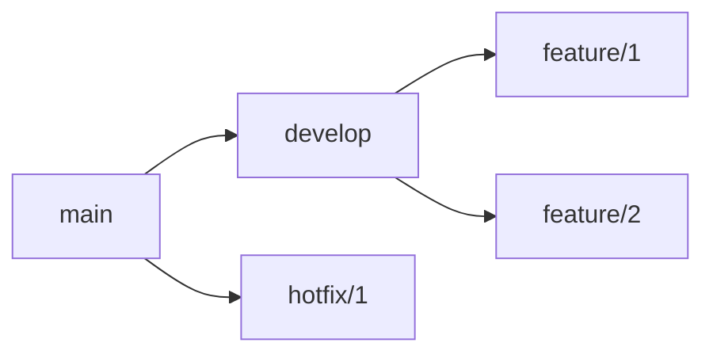

# 6.2.1 Branching and Merging Strategies: Organizing Your Work

**Backlinks:** [6.1.1 - Git Objects](../Subchapter_6.1/6.1.1_Git_Objects_References_and_Index.md) | [6.1.2 - Essential Commands](../Subchapter_6.1/6.1.2_Essential_Git_Commands_and_Configuration.md) | [6.1.3 - Subchapter Review](../Subchapter_6.1/6.1.3_Subchapter_Review.md)

**Next note:** [6.2.2 - Remotes and Collaboration Workflows](./6.2.2_Remotes_and_Collaboration_Workflows.md)

---

#### Why Branching Matters

Branches are Git's killer feature. They allow multiple lines of development to proceed independently:
- **Feature branches** – Develop new features without affecting main
- **Bugfix branches** – Fix issues in isolation
- **Release branches** – Prepare releases while development continues
- **Hotfix branches** – Emergency fixes to production

This note covers branching and merging. Note 6.2.2 covers remotes and collaboration workflows; note 6.2.3 covers tags, signing, and versioning; note 6.2.4 is the subchapter review.

**Backward references:** Git objects and references from 6.1.1 (branches are refs); essential commands from 6.1.2 (add, commit, log).

---

## Part 1: Branch Basics

### What is a Branch?

A branch is simply a movable pointer to a commit. The default branch is usually `main` or `master`.



### Creating and Switching Branches

```bash
# List branches
git branch
git branch -v          # With last commit
git branch -vv         # With tracking info

# Create branch (stays at current commit)
git branch feature-branch

# Create and switch to branch
git checkout -b feature-branch
# or modern syntax
git switch -c feature-branch

# Switch branch
git checkout main
git switch main        # modern syntax

# Delete branch (safe - prevents unmerged deletion)
git branch -d feature-branch

# Force delete (even if unmerged)
git branch -D feature-branch
```

### Branch Naming Conventions

| Type | Convention | Example |
|------|------------|---------|
| Feature | `feature/description` | `feature/user-authentication` |
| Bugfix | `bugfix/description` | `bugfix/login-error` |
| Hotfix | `hotfix/description` | `hotfix/critical-patch` |
| Release | `release/version` | `release/v1.2.0` |
| Chore | `chore/description` | `chore/update-dependencies` |

---

## Part 2: Merging – Combining Branches

### Fast-Forward Merge

When the current branch has all commits from the target branch, Git simply moves the pointer forward.



```bash
git checkout main
git merge feature
# Fast-forward (no merge commit created)
```

### 3-Way Merge

When branches have diverged, Git creates a merge commit with two parents.



```bash
git checkout main
git merge feature
# 3-way merge (creates merge commit)
```

### Merge Commands

```bash
# Basic merge
git merge feature

# Merge with commit message
git merge feature -m "Merge feature branch"

# Merge without fast-forward (always create merge commit)
git merge --no-ff feature

# Merge and squash all commits into one
git merge --squash feature
git commit -m "Add feature as single commit"

# Abort merge if conflicts
git merge --abort
```

### Merge Strategies: `recursive` vs `ort`

Git 2.33+ introduced `ort` (Ostensibly Recursive's Twin) as the new default merge strategy, replacing the older `recursive` strategy. Understanding this matters when diagnosing merge behavior.

```bash
# Explicitly choose a strategy
git merge -s ort feature         # New default (Git 2.33+)
git merge -s recursive feature   # Legacy default (Git < 2.33)
git merge -s ours feature        # Keep current branch, discard theirs entirely
git merge -s octopus feature1 feature2  # Merge 3+ branches at once

# Check your Git version (determines default strategy)
git --version
# git version 2.43.0  → uses 'ort' by default
```

| Strategy | Default In | Strengths | Weaknesses |
|----------|-----------|-----------|------------|
| **`ort`** | Git 2.33+ | 5–500× faster, better rename detection, cleaner conflict output | Requires Git 2.33+ |
| **`recursive`** | Git < 2.33 | Battle-tested, universal | Slow on large repos, weaker rename detection |
| **`ours`** | Manual | Keeps your version entirely (useful for "we already handled this") | Discards all incoming changes silently |
| **`octopus`** | Multi-branch | Merges N branches in one commit | Cannot handle conflicts |

**Strategy options** (fine-tuning with `-X`):

```bash
# Auto-resolve conflicts by preferring one side
git merge -X ours feature     # On conflict, keep current branch's version
git merge -X theirs feature   # On conflict, keep incoming branch's version

# Rename detection threshold (ort is better at this)
git merge -X rename-threshold=50 feature   # Lower = more aggressive rename detection

# Ignore whitespace changes during merge
git merge -X ignore-space-change feature
```

**Why `ort` matters in practice:**
- **Monorepos with many files:** `ort` can be 500× faster than `recursive` on repos with thousands of files
- **Rename detection:** `ort` correctly handles files that were renamed on both branches — `recursive` often generates false conflicts
- **Memory usage:** `ort` uses significantly less memory for complex merges

---

## Part 3: Merge Conflicts – Resolution

### What Causes Conflicts

When Git cannot automatically merge changes to the same lines in a file.

```bash
# After merge conflict
git status
# both modified:   file.txt
```

### Conflict Markers

```diff
<<<<<<< HEAD
This is the current branch's version
=======
This is the incoming branch's version
>>>>>>> feature-branch
```

### Resolving Conflicts

```bash
# Method 1: Manual edit
# Edit file.txt, remove markers, keep desired content
vim file.txt
git add file.txt
git commit

# Method 2: Use ours (keep current branch version)
git checkout --ours file.txt
git add file.txt
git commit

# Method 3: Use theirs (keep incoming branch version)
git checkout --theirs file.txt
git add file.txt
git commit

# Method 4: Use merge tool
git mergetool
# Opens configured diff tool (vimdiff, meld, etc.)
```

### Conflict Resolution Tools

```bash
# Configure merge tool
git config --global merge.tool vimdiff
git config --global mergetool.vimdiff.cmd "vimdiff -c 'wincmd J' $LOCAL $BASE $REMOTE $MERGED"

# Use meld (GUI)
git config --global merge.tool meld

# Launch tool
git mergetool
```

### Preventing Conflicts

| Practice | Benefit |
|----------|---------|
| Pull frequently | Stay up to date |
| Keep branches short-lived | Less divergence |
| Communicate about shared files | Avoid overlapping work |
| Use feature flags | Merge incomplete work safely |

---

## Part 4: Branch Management Strategies

### Long-Running Branches



| Branch | Purpose | Base | Merges Into |
|--------|---------|------|-------------|
| `main` | Production-ready code | – | – |
| `develop` | Integration branch | `main` | `main` (releases) |
| `feature/*` | New features | `develop` | `develop` |
| `release/*` | Release preparation | `develop` | `main`, `develop` |
| `hotfix/*` | Emergency fixes | `main` | `main`, `develop` |

### Branch Lifecycle Example

```bash
# Start feature from develop
git checkout develop
git pull origin develop
git checkout -b feature/new-dashboard

# Work on feature (multiple commits)
echo "dashboard code" > dashboard.js
git add dashboard.js
git commit -m "Add dashboard layout"
# ... more commits

# Merge feature back to develop
git checkout develop
git merge --no-ff feature/new-dashboard
git branch -d feature/new-dashboard
git push origin develop
```

---

## Part 5: Viewing Branch Structure

### Visualizing Branches

```bash
# Simple branch list
git branch
# * main
#   feature

# Branch with last commit
git branch -v
# * main     a1b2c3d [ahead 1] Update README
#   feature  e4f5g6h Add feature

# Branch with tracking
git branch -vv
# * main     a1b2c3d [origin/main: ahead 1] Update README
#   feature  e4f5g6h [origin/feature] Add feature

# Graph log
git log --oneline --graph --all --decorate

# Show only branches
git log --oneline --graph --branches --decorate

# Show merges only
git log --merges --oneline

# Show commits not on main
git log main..feature --oneline
```

### Comparing Branches

```bash
# Show differences between branches
git diff main..feature

# Show commits in feature not in main
git log main..feature --oneline

# Show commits in either but not both
git log main...feature --oneline

# Show merge base
git merge-base main feature
```

---

## Part 6: Cherry-Picking (Preview)

Cherry-picking applies specific commits to the current branch. (Detailed in 6.3.2)

```bash
# Apply a single commit
git cherry-pick a1b2c3d

# Apply a range of commits
git cherry-pick a1b2c3d..e4f5g6h

# Cherry-pick with edit
git cherry-pick -e a1b2c3d

# Continue after conflict resolution
git cherry-pick --continue
git cherry-pick --abort
```

---

## Quick Task: Branching and Merging Practice

*Practice creating branches, merging, and resolving conflicts.*

1. Create a repository with `main` branch.
2. Create a `feature` branch and add a file.
3. Switch back to `main`, add a different file.
4. Merge `feature` into `main` (3-way merge).
5. Create a conflict by modifying same line in both branches, then resolve it.

> **Ready Solution:**
>
> ```bash
> # Task 1
> mkdir branching-practice && cd branching-practice
> git init
> echo "Initial content" > file.txt
> git add file.txt
> git commit -m "Initial commit"
>
> # Task 2
> git checkout -b feature
> echo "Feature content" > feature.txt
> git add feature.txt
> git commit -m "Add feature.txt"
>
> # Task 3
> git checkout main
> echo "Main content" > main.txt
> git add main.txt
> git commit -m "Add main.txt"
>
> # Task 4
> git merge feature
> # 3-way merge (creates merge commit)
>
> # Task 5 (conflict)
> git checkout -b conflict-branch
> echo "Branch version" > shared.txt
> git add shared.txt
> git commit -m "Branch version"
>
> git checkout main
> echo "Main version" > shared.txt
> git add shared.txt
> git commit -m "Main version"
>
> git merge conflict-branch
> # CONFLICT in shared.txt
> # Edit shared.txt to resolve
> git add shared.txt
> git commit -m "Resolve conflict"
> ```

---

## Summary Table: Branching Commands

| Command | Purpose |
|---------|---------|
| `git branch` | List branches |
| `git branch <name>` | Create branch |
| `git checkout -b <name>` | Create and switch |
| `git switch -c <name>` | Create and switch (modern) |
| `git checkout <name>` | Switch branch |
| `git switch <name>` | Switch branch (modern) |
| `git branch -d <name>` | Delete branch (safe) |
| `git branch -D <name>` | Delete branch (force) |
| `git merge <branch>` | Merge branch into current |
| `git merge --no-ff <branch>` | Merge with commit |
| `git merge --squash <branch>` | Squash commits before merge |
| `git merge --abort` | Abort merge |
| `git mergetool` | Launch merge tool |

### Merge Types

| Type | Condition | Result |
|------|-----------|--------|
| Fast-forward | Current branch has all commits | Pointer moves forward |
| 3-way | Branches diverged | Merge commit with 2 parents |
| Squash | `--squash` flag | Single commit with all changes |

### Conflict Resolution Options

| Option | Effect |
|--------|--------|
| Manual edit | Edit file, remove markers |
| `--ours` | Keep current branch version |
| `--theirs` | Keep incoming branch version |
| `git mergetool` | Use external merge tool |

---

**Next note (6.2.2)** will cover **Remotes and Collaboration Workflows** – `git remote`, `fetch`, `pull`, `push`, Git Flow, GitHub Flow, Trunk-Based Development, and pull requests.

**Backward references:**
- Git references from 6.1.1 (remote refs)
- Essential commands from 6.1.2 (push, pull, fetch)
