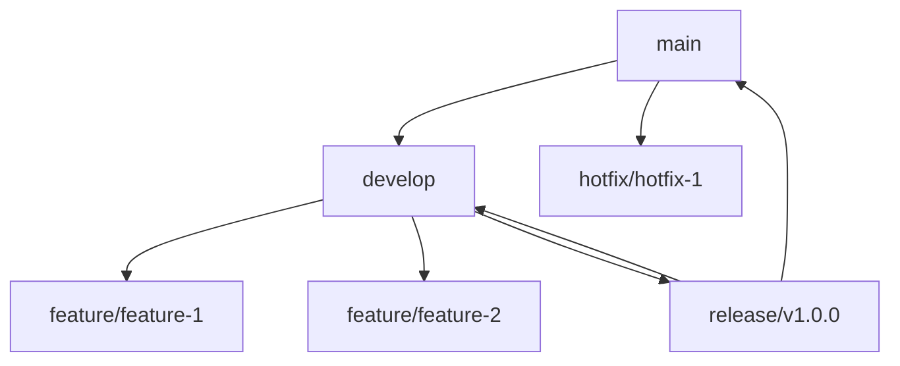
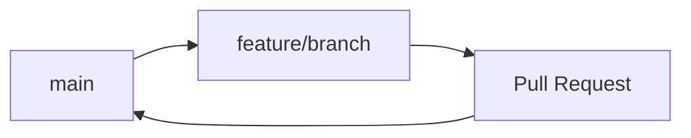
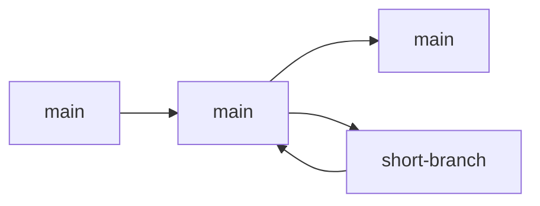

## Subchapter 6.2 – Branching, Merging, and Remote Workflows

### 6.2.2 Remotes and Collaboration Workflows: Working with Teams

#### Why Remotes Matter

Git is distributed – every clone is a full repository. Remotes enable collaboration by synchronizing changes between repositories:
- **Push** – Share your commits with others
- **Pull** – Get others' commits
- **Fetch** – See what changed without merging

This note covers remotes and collaboration workflows. Note 6.2.1 covered branching and merging; note 6.2.3 is the subchapter review.

**Backward references:** Git references from 6.1.1 (remote refs stored in `.git/refs/remotes/`); essential commands from 6.1.2 (push, pull, fetch).

---

## Part 1: Remote Basics

### What is a Remote?

A remote is a named reference to another repository. `origin` is the default name for the cloned repository.

```bash
# View remotes
git remote -v
# origin  https://github.com/user/repo.git (fetch)
# origin  https://github.com/user/repo.git (push)

# Add a remote
git remote add upstream https://github.com/other/repo.git

# Show remote details
git remote show origin

# Rename remote
git remote rename origin upstream

# Remove remote
git remote remove upstream
```

### Remote References

Remote branches are stored in `.git/refs/remotes/<remote>/`.

```bash
# List remote branches
git branch -r
# origin/main
# origin/develop
# origin/feature/login

# List all branches (local + remote)
git branch -a

# Show remote branch details
git ls-remote origin
```

---

## Part 2: Fetch, Pull, Push

### git fetch – Download Without Merging

Fetch downloads objects and refs but doesn't update working directory.

```bash
# Fetch all branches from origin
git fetch origin

# Fetch specific branch
git fetch origin main

# Fetch all remotes
git fetch --all

# Fetch and prune (remove deleted remote branches)
git fetch --prune origin

# Fetch tags
git fetch --tags
```

**After fetch:** Remote branches are updated (`origin/main`), but local `main` unchanged.

### git pull – Fetch + Merge

```bash
# Pull from tracking branch
git pull

# Pull specific branch
git pull origin main

# Pull with rebase (instead of merge)
git pull --rebase origin main

# Pull and fast-forward only (fail if not fast-forward)
git pull --ff-only

# Pull with specific merge strategy
git pull -X ours origin main
```

### git push – Upload Changes

```bash
# Push to tracking branch
git push

# Push specific branch
git push origin main

# Push and set upstream (tracking)
git push -u origin feature-branch

# Push all branches
git push --all origin

# Push tags
git push --tags

# Delete remote branch
git push origin --delete feature-branch

# Force push (dangerous on shared branches)
git push --force origin main

# Safer force push (fails if remote has unexpected changes)
git push --force-with-lease origin main

# Push to different remote name
git push upstream main
```

---

## Part 3: Tracking Branches (Upstream)

### Setting Upstream

```bash
# Set upstream when pushing
git push -u origin feature-branch

# Set upstream for existing branch
git branch -u origin/feature-branch

# Check tracking
git branch -vv
# * main       a1b2c3d [origin/main: ahead 1] Add feature
#   feature    e4f5g6h [origin/feature] Update code
```

### Tracking Information

| Symbol | Meaning |
|--------|---------|
| `[origin/main]` | Up to date |
| `[origin/main: ahead 1]` | Local has 1 commit not in remote |
| `[origin/main: behind 2]` | Remote has 2 commits not local |
| `[origin/main: ahead 1, behind 1]` | Diverged |

### Sync Commands

```bash
# Check status relative to remote
git status
# Your branch is ahead of 'origin/main' by 1 commit.

# Pull latest changes
git pull --rebase

# Push changes
git push
```

---

## Part 4: Collaboration Workflows

### Git Flow

A strict branching model for projects with scheduled releases.



| Branch | Purpose | Base | Merges Into |
|--------|---------|------|-------------|
| `main` | Production releases | – | – |
| `develop` | Integration branch | `main` | `main` (releases) |
| `feature/*` | New features | `develop` | `develop` |
| `release/*` | Release preparation | `develop` | `main`, `develop` |
| `hotfix/*` | Emergency fixes | `main` | `main`, `develop` |

**Git Flow Commands:**
```bash
# Start feature
git flow feature start user-auth

# Finish feature
git flow feature finish user-auth

# Start release
git flow release start v1.0.0

# Finish release
git flow release finish v1.0.0

# Start hotfix
git flow hotfix start critical-fix

# Finish hotfix
git flow hotfix finish critical-fix
```

### GitHub Flow (Simpler)

A lightweight workflow for continuous delivery.



**Rules:**
1. Anything in `main` is deployable
2. Create descriptive branches from `main`
3. Open pull requests for discussion
4. Merge after review and passing tests
5. Deploy immediately after merge

**GitHub Flow Commands:**
```bash
# Start feature
git checkout main
git pull origin main
git checkout -b feature/new-thing

# Work, commit, push
git push -u origin feature/new-thing

# Open Pull Request on GitHub/GitLab

# After merge, delete branch
git checkout main
git pull origin main
git branch -d feature/new-thing
```

### Trunk-Based Development

Developers commit directly to `main` (or short-lived branches). Best for CI/CD.



**Rules:**
- Main branch is always releasable
- Branches live less than 1 day
- Use feature flags for incomplete work
- Pair programming for complex changes

### Workflow Comparison

| Workflow | Complexity | Release Cadence | Branch Lifetime | Best For |
|----------|------------|-----------------|-----------------|----------|
| **Git Flow** | High | Scheduled | Days to weeks | Large projects, multiple versions |
| **GitHub Flow** | Low | Continuous | Hours to days | Web apps, CI/CD |
| **Trunk-Based** | Very Low | Continuous | Minutes to hours | High-velocity teams |

---

## Part 5: Pull Requests (Merge Requests)

### What is a Pull Request?

A pull request is a request to merge changes from one branch to another, with code review and discussion.

### Typical PR Workflow

```bash
# 1. Create feature branch
git checkout -b feature/add-login
git add .
git commit -m "Add login feature"
git push -u origin feature/add-login

# 2. Open Pull Request on GitHub/GitLab/Bitbucket

# 3. Code review happens online

# 4. After approval, merge via UI or command line

# 5. Pull latest main
git checkout main
git pull origin main

# 6. Delete feature branch
git branch -d feature/add-login
```

### PR Commands (GitHub CLI)

```bash
# Install GitHub CLI
brew install gh          # macOS
sudo apt install gh      # Ubuntu

# Authenticate
gh auth login

# Create PR
gh pr create --title "Add login" --body "Implements user login"

# List PRs
gh pr list

# Checkout PR locally
gh pr checkout 123

# Merge PR via CLI
gh pr merge 123 --merge
```

---

## Part 6: Syncing with Upstream (Fork Workflow)

When working with forks (common in open source):

```bash
# Clone your fork
git clone https://github.com/yourname/repo.git
cd repo

# Add upstream remote
git remote add upstream https://github.com/original/repo.git

# Fetch upstream changes
git fetch upstream

# Update main with upstream
git checkout main
git merge upstream/main

# Push to your fork
git push origin main

# Update feature branch with upstream
git checkout feature-branch
git rebase main
```

---

## Part 7: Troubleshooting Remotes

### Common Issues

**Issue 1: Rejected push (non-fast-forward)**
```bash
# Remote has changes you don't have
git pull --rebase origin main
git push origin main
```

**Issue 2: "failed to push some refs"**
```bash
# Fetch and merge first
git fetch origin
git merge origin/main
git push
```

**Issue 3: Detached HEAD after pull**
```bash
# Check what branch you're on
git branch
# * (HEAD detached at origin/main)

# Reattach to branch
git checkout main
git pull origin main
```

**Issue 4: Wrong remote URL**
```bash
# Check current URL
git remote -v

# Change URL
git remote set-url origin https://new-url.git
```

**Issue 5: Credential issues**
```bash
# Cache credentials
git config --global credential.helper cache

# Store credentials (unencrypted)
git config --global credential.helper store

# Use SSH instead of HTTPS
git remote set-url origin git@github.com:user/repo.git
```

---

## Quick Task: Remote Workflow Practice

*Practice collaboration workflow with a remote.*

1. Create a repository on GitHub (or GitLab).
2. Clone it locally.
3. Create a feature branch, add a file, and push it.
4. Open a Pull Request (if using GitHub/GitLab).
5. Merge the PR.
6. Pull the changes to your local main.

> **Ready Solution:**
>
> ```bash
> # Task 1-2
> # Create repo on GitHub first, then:
> git clone https://github.com/yourname/repo.git
> cd repo
>
> # Task 3
> git checkout -b feature/hello
> echo "Hello World" > hello.txt
> git add hello.txt
> git commit -m "Add hello.txt"
> git push -u origin feature/hello
>
> # Task 4
> # Open browser, go to GitHub, create Pull Request
>
> # Task 5
> # Click "Merge" in GitHub UI
>
> # Task 6
> git checkout main
> git pull origin main
> ```

---

## Summary Table: Remote Commands

| Command | Purpose |
|---------|---------|
| `git remote -v` | List remotes |
| `git remote add <name> <url>` | Add remote |
| `git remote remove <name>` | Remove remote |
| `git fetch <remote>` | Download without merging |
| `git fetch --prune` | Fetch and clean deleted branches |
| `git pull` | Fetch + merge |
| `git pull --rebase` | Fetch + rebase |
| `git push` | Upload changes |
| `git push -u` | Push and set upstream |
| `git push --force-with-lease` | Safer force push |
| `git branch -vv` | Show tracking info |
| `git ls-remote` | Show remote refs |

### Workflow Comparison

| Workflow | Branches | Merges | PR Required | Release Cadence |
|----------|----------|--------|-------------|-----------------|
| Git Flow | 5+ types | Many | Yes | Scheduled |
| GitHub Flow | main + features | PR merge | Yes | Continuous |
| Trunk-Based | main (+ short-lived) | Fast-forward | Optional | Continuous |

### Remote States

| State | Meaning | Command |
|-------|---------|---------|
| `ahead` | Local commits not in remote | `git push` |
| `behind` | Remote commits not local | `git pull` |
| `diverged` | Both have unique commits | `git pull --rebase` |

---

**Next note (6.2.3)** will be the Subchapter Review for Branching, Merging, and Remote Workflows, including a cheatsheet and scenario-based interview questions.

**Backward references:**
- Branching from 6.2.1 (branch creation, merging)
- Git references from 6.1.1 (remote refs)
- Essential commands from 6.1.2 (push, pull, fetch)
