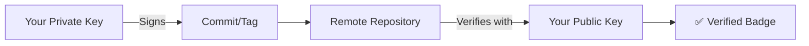

# 6.2.3 Tags, Signing, and Versioning: Marking Releases and Verifying Integrity

**Backlinks:** [6.2.1 - Branching and Merging](./6.2.1_Branching_and_Merging_Strategies.md) | [6.2.2 - Remotes and Collaboration Workflows](./6.2.2_Remotes_and_Collaboration_Workflows.md)

**Next note:** [6.2.4 - Subchapter 6.2 Review](./6.2.4_Subchapter_Review.md)

---

#### Why Tags and Signing Matter

Tags mark specific points in history as important — typically releases. Signing with GPG or SSH proves that a commit or tag actually came from you, which is critical in supply-chain security.

This note covers tags, semantic versioning, GPG/SSH commit signing, `git describe`, and release workflows. Tags naturally extend the branching/remotes material from 6.2.1 and 6.2.2 because releases are cut from branches and tags are pushed through remotes.

**Backward references:** Commits and refs from 6.1.1 (tags are references to commit objects); remotes from 6.2.2 (pushing tags to remotes); release branches from 6.2.2 (Git Flow).

---

## Part 1: Git Tags — Marking Releases

### Lightweight vs Annotated Tags

Git has two types of tags:

| Type | Storage | Stores | Use Case |
|------|---------|--------|----------|
| **Lightweight** | Plain ref (`.git/refs/tags/`) | Points directly to a commit | Private/local bookmarks |
| **Annotated** | Full Git object in `.git/objects/` | Tagger info, date, message, optional GPG sig | Official releases |

```bash
# Lightweight tag (just a pointer, no metadata)
git tag v1.0

# Annotated tag (full object — preferred for releases)
git tag -a v1.0.0 -m "Release version 1.0.0"

# Tag a specific commit (not HEAD)
git tag -a v0.9.0 a1b2c3d -m "Beta release"

# List all tags
git tag
git tag -l "v1.*"        # List tags matching pattern
git tag --sort=version:refname  # Sort by version

# Show tag details
git show v1.0.0

# View tag object vs commit
git cat-file -t v1.0.0   # "tag" for annotated, "commit" for lightweight
git cat-file -p v1.0.0   # Show annotated tag object content
```

### Annotated Tag Object Structure

```
object a1b2c3d4e5f6...    ← the commit SHA it points to
type commit
tag v1.0.0
tagger Alice <alice@example.com> 1234567890 -0700

Release version 1.0.0
- Added user authentication
- Fixed login bug
- Updated dependencies
```

### Pushing Tags to Remote

Tags are **not** pushed by default with `git push`. You must explicitly push them.

```bash
# Push a single tag
git push origin v1.0.0

# Push all tags at once
git push origin --tags

# Push only annotated tags (recommended)
git push origin --follow-tags

# Delete a remote tag
git push origin --delete v1.0.0
git push origin :refs/tags/v1.0.0   # older syntax

# Delete a local tag
git tag -d v1.0.0

# Fetch all remote tags
git fetch --tags
```

### Checking Out a Tag (Detached HEAD)

```bash
# Checkout a tag — puts you in detached HEAD state
git checkout v1.0.0
# HEAD is now at a1b2c3d Release version 1.0.0

# To work on a tagged release, create a branch from it
git checkout -b hotfix/v1.0.1 v1.0.0

# Or just inspect without modifying
git log v1.0.0 --oneline
```

---

## Part 2: Semantic Versioning (SemVer)

The de facto standard for release versioning is **Semantic Versioning**: `MAJOR.MINOR.PATCH`.

```
v2.4.1
│ │ └── PATCH — bug fix, backward compatible
│ └──── MINOR — new feature, backward compatible
└────── MAJOR — breaking change, NOT backward compatible
```

### SemVer Rules

| Version Bump | When | Example |
|-------------|------|---------|
| **MAJOR** | Breaking API change | `1.5.3` → `2.0.0` |
| **MINOR** | New backward-compatible feature | `1.5.3` → `1.6.0` |
| **PATCH** | Bug fix, backward-compatible | `1.5.3` → `1.5.4` |
| **Pre-release** | Alpha/beta/RC | `2.0.0-alpha.1`, `2.0.0-rc.2` |
| **Build metadata** | Build info | `1.0.0+20240115` |

```bash
# Tag workflow following SemVer
git tag -a v1.0.0 -m "Initial stable release"
git push origin v1.0.0

# Bugfix release
git tag -a v1.0.1 -m "Fix authentication bug"
git push origin v1.0.1

# New feature release
git tag -a v1.1.0 -m "Add OAuth2 support"
git push origin v1.1.0

# Breaking change
git tag -a v2.0.0 -m "New API — breaking changes in auth endpoints"
git push origin v2.0.0
```

### Conventional Commits

A commit message convention that enables automated changelog generation and SemVer bumping:

```
<type>[optional scope]: <description>

[optional body]

[optional footer(s)]
```

| Type | SemVer Impact | Example |
|------|---------------|---------|
| `fix:` | PATCH | `fix: resolve login redirect loop` |
| `feat:` | MINOR | `feat: add OAuth2 support` |
| `feat!:` or `BREAKING CHANGE:` footer | MAJOR | `feat!: redesign auth API` |
| `docs:` | none | `docs: update README install steps` |
| `chore:` | none | `chore: update dependencies` |
| `refactor:` | none | `refactor: extract auth middleware` |
| `test:` | none | `test: add login unit tests` |
| `perf:` | PATCH | `perf: optimize database queries` |
| `ci:` | none | `ci: add GitHub Actions workflow` |

```bash
# Examples of conventional commit messages
git commit -m "fix: resolve null pointer in user service"
git commit -m "feat(auth): add Google OAuth2 login"
git commit -m "feat!: remove deprecated v1 API endpoints

BREAKING CHANGE: All /api/v1/* endpoints have been removed.
Migrate to /api/v2/* equivalents."
```

### git describe — Dynamic Version from Tags

`git describe` generates a human-readable name based on the nearest tag:

```bash
# Show version relative to nearest tag
git describe
# v1.0.0-14-ga1b2c3d
# Format: <tag>-<commits-since-tag>-g<abbreviated-SHA>

# Show only for tagged commits (exact match only)
git describe --exact-match
# v1.0.0  (if currently on a tagged commit)
# fatal: no tag exactly matches 'a1b2c3d'  (if not)

# Always produce output (even without tags)
git describe --always
# a1b2c3d  (just SHA if no tags)

# Include lightweight tags
git describe --tags

# Match only tags matching a pattern
git describe --match "v[0-9]*"

# Use in CI/CD to embed version
VERSION=$(git describe --tags --always --dirty)
echo "Building version: $VERSION"
```

---

## Part 3: GPG and SSH Commit Signing

### Why Sign Commits?

Signing commits cryptographically proves that:
1. A commit came from a specific person (identity verification)
2. The commit content hasn't been tampered with

Without signing, anyone with push access can forge author names. Signed commits show a **Verified** badge on GitHub/GitLab.



### GPG Signing Setup

```bash
# Check for existing GPG keys
gpg --list-secret-keys --keyid-format LONG

# Generate a new GPG key (RSA 4096-bit)
gpg --full-generate-key
# Choose: RSA and RSA, 4096, 0 (never expires)

# Get your key ID
gpg --list-secret-keys --keyid-format LONG
# sec   rsa4096/3AA5C34371567BD2 2024-01-15 [SC]
#                  ^^^^^^^^^^^^^ This is your key ID

# Export public key (paste into GitHub/GitLab)
gpg --armor --export 3AA5C34371567BD2

# Configure Git to use your key
git config --global user.signingkey 3AA5C34371567BD2

# Sign commits by default (all commits)
git config --global commit.gpgsign true

# Sign tags by default
git config --global tag.gpgsign true
```

### Signing Commits and Tags

```bash
# Sign a single commit
git commit -S -m "Add feature with signature"

# Sign all commits (if gpgsign=true, this is automatic)
git commit -m "This is auto-signed"

# Sign an annotated tag
git tag -s v1.0.0 -m "Signed release v1.0.0"

# Verify a commit signature
git verify-commit a1b2c3d
# gpg: Good signature from "Alice Smith <alice@example.com>"

# Verify a tag signature
git verify-tag v1.0.0
# gpg: Good signature from "Alice Smith <alice@example.com>"

# Show signatures in log
git log --show-signature
git log --format="%H %G? %aN" --show-signature
# G = Good signature
# B = Bad signature
# U = Unknown signer
# N = No signature
```

### SSH Signing (Modern Alternative to GPG)

Git 2.34+ supports signing with SSH keys — much simpler than GPG:

```bash
# Configure SSH signing
git config --global gpg.format ssh
git config --global user.signingkey ~/.ssh/id_ed25519.pub

# Sign commits with SSH key
git config --global commit.gpgsign true
git commit -m "SSH-signed commit"

# Create an allowed_signers file (for verification)
echo "alice@example.com namespaces=\"git\" $(cat ~/.ssh/id_ed25519.pub)" > ~/.ssh/allowed_signers
git config --global gpg.ssh.allowedSignersFile ~/.ssh/allowed_signers

# Verify SSH-signed commit
git verify-commit HEAD
```

### Signature Status in git log

```bash
# Show abbreviated signature status
git log --format="%h %G? %GS %s"
# a1b2c3d G Alice Smith <alice@example.com> Add feature
# e4f5g6h N  Add other feature
#          ^-- G=Good, N=No sig, B=Bad, U=Untrusted, E=Error
```

---

## Part 4: Release Workflows

### GitHub/GitLab Release Workflow

```bash
# 1. Ensure main is clean and tested
git checkout main
git pull origin main

# 2. Create release branch (Git Flow)
git checkout -b release/v1.2.0

# 3. Bump version files
echo "1.2.0" > VERSION
sed -i 's/version = ".*"/version = "1.2.0"/' pyproject.toml
git add VERSION pyproject.toml
git commit -m "chore: bump version to 1.2.0"

# 4. Merge to main
git checkout main
git merge --no-ff release/v1.2.0 -m "Release v1.2.0"

# 5. Tag the release
git tag -s v1.2.0 -m "Release v1.2.0

Changelog:
- feat: add OAuth2 support
- fix: resolve login redirect loop
- docs: update API reference"

# 6. Push with tags
git push origin main --follow-tags

# 7. Merge back to develop
git checkout develop
git merge --no-ff release/v1.2.0
git push origin develop

# 8. Delete release branch
git branch -d release/v1.2.0
git push origin --delete release/v1.2.0
```

### GitHub CLI Release

```bash
# Create a GitHub release from a tag
gh release create v1.2.0 \
  --title "v1.2.0 - OAuth2 Support" \
  --notes "## What's Changed
- feat: add OAuth2 support
- fix: resolve login redirect loop" \
  --latest

# Upload release artifacts
gh release upload v1.2.0 dist/app-linux-amd64 dist/app-darwin-amd64

# List releases
gh release list

# Download a release
gh release download v1.2.0
```

### Automated Versioning with git describe in CI/CD

```bash
# In .github/workflows/release.yml or GitLab CI:
VERSION=$(git describe --tags --always --dirty=-dev)
# Examples:
# v1.2.0           → exact tag (clean release)
# v1.2.0-3-ga1b2c3 → 3 commits after v1.2.0
# v1.2.0-dirty     → uncommitted changes

# Embed in binary
go build -ldflags "-X main.Version=$VERSION" ./cmd/app

# Docker image tag
docker build -t myapp:$VERSION .
docker push myapp:$VERSION
```

---

## Part 5: Advanced Tag Operations

### Listing and Filtering Tags

```bash
# List tags matching pattern
git tag -l "v1.*"
git tag -l "v*.*.0"   # Major releases only

# Sort tags by version (requires Git 2.7+)
git tag --sort=version:refname
git tag --sort=-version:refname   # Descending

# Show latest tag
git describe --tags --abbrev=0

# Count commits since last tag
git rev-list v1.0.0..HEAD --count
```

### Moving and Replacing Tags

```bash
# Force move a lightweight tag (not recommended for pushed tags)
git tag -f v1.0.0 a1b2c3d

# Delete and recreate annotated tag
git tag -d v1.0.0
git push origin --delete v1.0.0
git tag -a v1.0.0 a1b2c3d -m "Re-tagged release"
git push origin v1.0.0
```

### Tag-based Deployment

```bash
# Deploy only on version tags (GitHub Actions example)
# on:
#   push:
#     tags:
#       - 'v*'

# Check if current commit is tagged
if git describe --exact-match --tags HEAD 2>/dev/null; then
  echo "On tagged release, deploying..."
else
  echo "Not a tagged release, skipping deploy"
fi
```

---

## Quick Task: Tag and Sign Practice

1. Create a repository with a few commits.
2. Create a lightweight tag `v0.1` on the first commit.
3. Create an annotated tag `v1.0.0` on HEAD with a release message.
4. Push the annotated tag to a remote.
5. Use `git describe` to see how commits are described.
6. (Optional) Set up GPG or SSH signing and create a signed tag.

> **Ready Solution:**
> ```bash
> mkdir tag-practice && cd tag-practice
> git init && echo "init" > file.txt
> git add . && git commit -m "Initial commit"
>
> # Lightweight tag on first commit
> git tag v0.1
>
> # Add more commits
> echo "feature" >> file.txt
> git add . && git commit -m "feat: add feature"
>
> # Annotated tag on HEAD
> git tag -a v1.0.0 -m "First stable release"
>
> # Describe from HEAD
> git describe
> # v1.0.0
>
> # Add one more commit
> echo "patch" >> file.txt
> git add . && git commit -m "fix: apply patch"
>
> # Describe again
> git describe
> # v1.0.0-1-ga1b2c3d  (1 commit after v1.0.0)
>
> # Push (requires a remote)
> # git push origin v1.0.0 --follow-tags
> ```

---

## Summary Table: Tags and Signing

### Tag Commands

| Command | Purpose |
|---------|---------|
| `git tag v1.0` | Create lightweight tag |
| `git tag -a v1.0 -m "msg"` | Create annotated tag |
| `git tag -s v1.0 -m "msg"` | Create signed annotated tag |
| `git tag` | List all tags |
| `git tag -l "v1.*"` | List tags matching pattern |
| `git tag --sort=version:refname` | Sort by version |
| `git show v1.0` | Show tag details |
| `git tag -d v1.0` | Delete local tag |
| `git push origin v1.0` | Push single tag |
| `git push origin --tags` | Push all tags |
| `git push origin --follow-tags` | Push annotated tags only |
| `git push origin --delete v1.0` | Delete remote tag |
| `git fetch --tags` | Fetch all remote tags |
| `git describe` | Describe relative to nearest tag |
| `git describe --exact-match` | Match exact tag only |

### Signing Commands

| Command | Purpose |
|---------|---------|
| `git commit -S -m "msg"` | Sign a single commit |
| `git tag -s v1.0 -m "msg"` | Sign an annotated tag |
| `git verify-commit <sha>` | Verify commit signature |
| `git verify-tag v1.0` | Verify tag signature |
| `git log --show-signature` | Show signatures in log |
| `git log --format="%h %G?"` | Show signature status (`G`/`N`/`B`) |

### Conventional Commit Types

| Type | When to Use | SemVer Impact |
|------|-------------|---------------|
| `fix:` | Bug fix | PATCH |
| `feat:` | New feature | MINOR |
| `feat!:` | Breaking change | MAJOR |
| `docs:` | Documentation only | None |
| `chore:` | Maintenance | None |
| `refactor:` | Code restructure | None |
| `test:` | Tests | None |
| `perf:` | Performance improvement | PATCH |
| `ci:` | CI/CD changes | None |

### SemVer Quick Reference

| Change | Bump | Example |
|--------|------|---------|
| Bug fix | PATCH | `1.2.3` → `1.2.4` |
| New feature (backward compatible) | MINOR | `1.2.3` → `1.3.0` |
| Breaking change | MAJOR | `1.2.3` → `2.0.0` |
| Pre-release | Suffix | `2.0.0-alpha.1` |

---

**Next note (6.2.4)** is the **Subchapter 6.2 Review** — a cheatsheet and scenario-based interview questions covering branching, merging, remotes, collaboration workflows, and now tags/signing/versioning.

**Backward references:**
- Tags as refs from 6.1.1 (`.git/refs/tags/`)
- Remote push workflow from 6.2.2 (`git push --follow-tags`)
- Release branches from 6.2.2 (Git Flow release workflow)

**Forward references:**
- Git hooks (6.3.3) can enforce Conventional Commits and signed commits
- `git describe` output (this note) is used in CI build metadata (Module 8)
- Signed tags verification pairs with Git hooks server-side policy (6.3.3)
