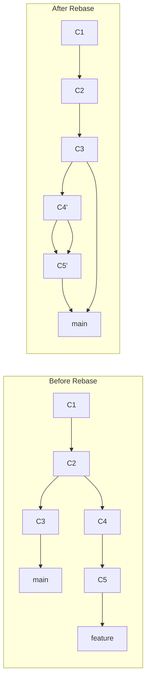

# 6.3.1 Rebase vs Merge and Interactive Rebase: Rewriting History

**Backlinks:** [6.2.1 - Branching and Merging](../Subchapter_6.2/6.2.1_Branching_and_Merging_Strategies.md) | [6.2.3 - Tags, Signing, and Versioning](../Subchapter_6.2/6.2.3_Tags_Signing_and_Versioning.md) | [6.2.4 - Subchapter 6.2 Review](../Subchapter_6.2/6.2.4_Subchapter_Review.md)

**Next note:** [6.3.2 - Cherry-pick, Stash, and Bisect](./6.3.2_Cherry_pick_Stash_and_Bisect.md)

---

#### Why Rebase Matters

Rebasing is a powerful but controversial Git feature. It allows you to:
- **Create linear history** – No merge commits, easier to follow
- **Clean up commits** – Squash, reorder, edit before sharing
- **Update feature branches** – Incorporate latest changes without merge commits

This note covers rebase vs merge and interactive rebase. Note 6.3.2 covers cherry-pick, stash, and bisect; note 6.3.3 covers Git hooks; note 6.3.4 is the subchapter review.

**Backward references:** Branching and merging from 6.2.1; Git references from 6.1.1 (commits are immutable, rebase creates new SHAs).

> **Warning:** Never rebase commits that have been pushed to a shared branch. Rebasing rewrites history — if teammates have already pulled those commits, their branches and yours will diverge in confusing ways. The rule of thumb: *rebase local, merge shared.*

> **Tip:** Lost a commit after a rebase gone wrong? `git reflog` is your time machine — it records every HEAD movement for 90 days. `git reset --hard HEAD@{2}` jumps back to what HEAD was two actions ago.

---

## Part 1: Rebase vs Merge – The Great Debate

### What is Rebase?

Rebase moves the entire feature branch to begin at the tip of the target branch, rewriting commit history.



### Merge vs Rebase Visualized

**Merge (creates merge commit):**
```
*   a1b2c3d (HEAD -> main) Merge branch 'feature'
|\
| * e4f5g6h (feature) Add feature
| * i7j8k9l Start feature
* | m9n0o1p Update README
|/
* q1r2s3t Initial commit
```

**Rebase (linear history):**
```
* a1b2c3d (HEAD -> main) Add feature
* e4f5g6h Start feature
* i7j8k9l Update README
* m9n0o1p Initial commit
```

### Rebase Commands

```bash
# Rebase feature branch onto main
git checkout feature
git rebase main

# Rebase with conflicts
git rebase main
# CONFLICT in file.txt
# Fix conflicts, then:
git add file.txt
git rebase --continue

# Skip a commit
git rebase --skip

# Abort rebase
git rebase --abort
```

### Interactive Rebase (Preview)

```bash
# Rebase last 3 commits interactively
git rebase -i HEAD~3

# Rebase from specific commit
git rebase -i a1b2c3d
```

### Merge vs Rebase – Trade-offs

| Aspect | Merge | Rebase |
|--------|-------|--------|
| **History** | Non-linear (merge commits) | Linear (no merge commits) |
| **Commit SHAs** | Preserved | New SHAs |
| **Conflict resolution** | Once | Once per commit (can be many) |
| **Safety on shared branches** | Safe | Dangerous (rewrites history) |
| **Ease of understanding** | Shows when branch was updated | Hides when updates happened |
| **Use case** | Shared branches, public history | Local branches, cleaning history |

### Golden Rule of Rebase

**Never rebase branches that others have based work on.**

If you rebase a shared branch:
- Other developers' work becomes based on old commits
- They will have diverged histories
- Resolving this is painful and error-prone

```bash
# SAFE: Rebase local branch before pushing
git checkout feature
git rebase main
git push --force-with-lease origin feature

# DANGEROUS: Rebasing main after others have pulled
git checkout main
git rebase feature  # DON'T DO THIS ON SHARED BRANCH
```

---

## Part 2: Interactive Rebase – Cleaning History

Interactive rebase lets you modify commits before sharing.

### Interactive Rebase Actions

| Action | Abbrev | Effect |
|--------|--------|--------|
| `pick` | `p` | Use commit as is |
| `reword` | `r` | Change commit message |
| `edit` | `e` | Stop to amend commit content |
| `squash` | `s` | Combine with previous commit |
| `fixup` | `f` | Like squash, discard message |
| `drop` | `d` | Remove commit |
| `exec` | `x` | Run command |

### Interactive Rebase Workflow

```bash
# Start interactive rebase on last 4 commits
git rebase -i HEAD~4

# Editor opens with:
pick a1b2c3d Add login feature
pick e4f5g6h Fix typo in login
pick i7j8k9l Add logout feature
pick m9n0o1p Fix logout bug

# Rebase commands:
# p, pick = use commit
# r, reword = use commit, but edit message
# e, edit = use commit, but stop to amend
# s, squash = use commit, but meld into previous commit
# f, fixup = like squash, discard commit message
# d, drop = remove commit
```

### Common Interactive Rebase Operations

**1. Squash multiple commits into one:**

```bash
# Original
pick a1b2c3d Add login UI
pick e4f5g6h Add login validation
pick i7j8k9l Add login API call

# Change to:
pick a1b2c3d Add login UI
squash e4f5g6h Add login validation
squash i7j8k9l Add login API call
```

**2. Reword a commit message:**

```bash
# Original
pick a1b2c3d Fix bug

# Change to:
reword a1b2c3d Fix login authentication bug
```

**3. Edit a commit (add forgotten file):**

```bash
# Original
pick a1b2c3d Add feature

# Change to:
edit a1b2c3d Add feature

# After rebase stops:
git add forgotten-file.txt
git commit --amend
git rebase --continue
```

**4. Drop a commit:**

```bash
# Original
pick a1b2c3d Add feature
pick e4f5g6h Temporary debug code
pick i7j8k9l Fix bug

# Change to:
pick a1b2c3d Add feature
drop e4f5g6h Temporary debug code
pick i7j8k9l Fix bug
```

**5. Reorder commits:**

```bash
# Original
pick a1b2c3d Add logout
pick e4f5g6h Add login

# Change to (swap order):
pick e4f5g6h Add login
pick a1b2c3d Add logout
```

---

## Part 3: Autosquash — The Professional Rebase Workflow

The `--autosquash` flag combined with `fixup!` and `squash!` commit prefixes is how experienced engineers use interactive rebase in daily development. Instead of manually editing the rebase todo list, you create specially-named commits that Git automatically reorders and marks for squashing.

### The `fixup!` and `squash!` Workflow

```bash
# Step 1: Make your initial commit
git commit -m "feat: add user authentication"

# Step 2: Later, you realize you forgot something related to that commit
# Instead of a generic "fix" commit, prefix with fixup!
git commit -m "fixup! feat: add user authentication"

# Step 3: Even later, another fix for the same commit
git commit -m "fixup! feat: add user authentication"

# Step 4: When ready to clean up, autosquash does the work
git rebase -i --autosquash HEAD~5
```

**What happens in the editor:**

```bash
# Without --autosquash (manual ordering):
pick a1b2c3d feat: add user authentication
pick e4f5g6h feat: add payment module
pick i7j8k9l fixup! feat: add user authentication
pick m9n0o1p fixup! feat: add user authentication

# With --autosquash (Git reorders automatically):
pick a1b2c3d feat: add user authentication
fixup i7j8k9l fixup! feat: add user authentication
fixup m9n0o1p fixup! feat: add user authentication
pick e4f5g6h feat: add payment module
```

### `fixup!` vs `squash!`

| Prefix | During Rebase | Commit Message |
|--------|--------------|----------------|
| `fixup! <msg>` | Auto-marked as `fixup` | Original message kept, fixup message **discarded** |
| `squash! <msg>` | Auto-marked as `squash` | Both messages **combined** (you edit the result) |

```bash
# fixup! — silent fix (message discarded)
git commit -m "fixup! feat: add login"
# After rebase: "feat: add login" (fixup message gone)

# squash! — combine messages (you'll edit)
git commit -m "squash! feat: add login"
# After rebase: editor opens with both messages to combine
```

### Make Autosquash the Default

```bash
# Enable autosquash globally (no need to pass --autosquash every time)
git config --global rebase.autosquash true

# Now every interactive rebase auto-reorders fixup!/squash! commits
git rebase -i HEAD~10   # --autosquash is implied

# Create fixup commits even faster with --fixup flag
git commit --fixup=a1b2c3d    # Creates "fixup! <message of a1b2c3d>"
git commit --squash=a1b2c3d   # Creates "squash! <message of a1b2c3d>"
```

**Complete professional workflow:**

```bash
# 1. Work on feature with meaningful commits
git commit -m "feat: add user dashboard"
git commit -m "feat: add dashboard charts"

# 2. Reviewer requests changes to the dashboard commit
# Fix the issue, create a fixup commit
git add corrected-file.js
git commit --fixup=HEAD~1    # Points to "feat: add user dashboard"

# 3. Before merging PR, clean up
git rebase -i --autosquash origin/main
# fixup commits auto-reorder — just save and close editor

# 4. Force push cleaned branch
git push --force-with-lease --force-if-includes origin feature
```

---

## Part 4: Practical Interactive Rebase Examples

### Example 1: Clean Up WIP Commits

```bash
# Before: messy commit history
git log --oneline
# a1b2c3d Fix typo
# e4f5g6h Add feature
# i7j8k9l WIP
# m9n0o1p WIP
# q1r2s3t Initial commit

# Interactive rebase
git rebase -i HEAD~4

# In editor:
squash a1b2c3d Fix typo
squash e4f5g6h Add feature
squash i7j8k9l WIP
pick m9n0o1p WIP
# (reorder so WIP is first, then squash others into it)

# Result: single clean commit
# a1b2c3d Add feature (with all changes)
```

### Example 2: Split a Commit

```bash
# Start with commit that does too much
git rebase -i HEAD~1
# Change 'pick' to 'edit'

# Reset to remove changes
git reset HEAD^

# Add changes in parts
git add file1.txt
git commit -m "Add file1 feature"

git add file2.txt
git commit -m "Add file2 feature"

# Continue rebase
git rebase --continue
```

### Example 3: Fix Author Information

```bash
git rebase -i HEAD~3
# Change 'pick' to 'edit' on commit

git commit --amend --author="Correct Name <email@example.com>"
git rebase --continue
```

---

## Part 5: Rebase Workflows

### Updating Feature Branch with Rebase

```bash
# Before rebase: feature is behind main
# A---B---C (main)
#      \
#       D---E (feature)

# Rebase feature onto main
git checkout feature
git rebase main

# After rebase: feature is now on top of main
# A---B---C (main)
#          \
#           D'---E' (feature)
```

### Pull with Rebase (Instead of Merge)

```bash
# Instead of git pull (which merges)
git pull --rebase origin main

# Configure as default
git config --global pull.rebase true
```

### Rebase Before Push

```bash
# Rebase local feature on latest main
git checkout feature
git fetch origin
git rebase origin/main

# Resolve conflicts if any

# Force push (since commit SHAs changed)
git push --force-with-lease origin feature
```

---

## Part 6: Rebase Risks and Recovery

### Common Rebase Problems

**Problem 1: Rebase conflict on every commit**
```bash
# If each commit has conflicts, use:
git rebase --interactive --exec "git commit --amend --no-edit"
```

**Problem 2: Lost commits after rebase**
```bash
# Use reflog to find lost commits
git reflog
# a1b2c3d HEAD@{0}: rebase: checkout main
# e4f5g6h HEAD@{1}: commit: Add feature

# Reset to pre-rebase state
git reset --hard HEAD@{1}
```

**Problem 3: Diverged branch after rebase**
```bash
# If someone pushed to the branch you rebased
git pull --rebase origin feature
# Resolve conflicts, then push
git push --force-with-lease origin feature
```

### Recovering from Failed Rebase

```bash
# Abort rebase
git rebase --abort

# Or skip current commit
git rebase --skip

# Or continue after fixing conflicts
git add resolved-file.txt
git rebase --continue
```

---

## Quick Task: Interactive Rebase Practice

*Practice cleaning commit history with interactive rebase.*

1. Create a repository with 5 messy commits.
2. Use interactive rebase to squash the first 3 commits into one.
3. Reword the 4th commit message.
4. Drop the 5th commit.
5. Verify the final history.

> **Ready Solution:**
>
> ```bash
> # Task 1
> mkdir rebase-practice && cd rebase-practice
> git init
> echo "file1" > file1.txt && git add . && git commit -m "WIP1"
> echo "file2" > file2.txt && git add . && git commit -m "WIP2"
> echo "file3" > file3.txt && git add . && git commit -m "WIP3"
> echo "file4" > file4.txt && git add . && git commit -m "Add feature"
> echo "temp" > temp.txt && git add . && git commit -m "DEBUG: temporary"
>
> # Task 2-5
> git rebase -i HEAD~5
> # In editor:
> pick a1b2c3d WIP1
> squash e4f5g6h WIP2
> squash i7j8k9l WIP3
> reword m9n0o1p Add feature
> drop q1r2s3t DEBUG: temporary
>
> # After saving:
> # Edit commit message for reword
> # Verify:
> git log --oneline
> # Should show 2 commits: squashed + reworded
> ```

---

## Summary Table: Rebase vs Merge

| Operation | Command | When to Use |
|-----------|---------|-------------|
| Merge | `git merge feature` | Shared branches, preserving history |
| Rebase | `git rebase main` | Local branches, clean history |
| Pull with rebase | `git pull --rebase` | Avoid merge commits on pull |
| Interactive rebase | `git rebase -i HEAD~N` | Cleaning history before push |

### Interactive Rebase Actions

| Action | Abbrev | Effect |
|--------|--------|--------|
| `pick` | `p` | Use commit as is |
| `reword` | `r` | Change commit message |
| `edit` | `e` | Stop to amend commit |
| `squash` | `s` | Combine with previous commit |
| `fixup` | `f` | Squash, discard message |
| `drop` | `d` | Remove commit |
| `exec` | `x` | Run command |

### Rebase Safety Rules

| Rule | Explanation |
|------|-------------|
| Never rebase shared branches | Others have work based on old SHAs |
| Use `--force-with-lease` | Safer than `--force` |
| Rebase local branches before push | Clean history, no impact on others |
| Keep reflog for recovery | `git reflog` to find lost commits |

---

**Next note (6.3.2)** will cover **Cherry-pick, Stash, and Bisect** – applying specific commits, saving uncommitted work, and binary search for bugs.

**Backward references:**
- Branching from 6.2.1 (rebase moves branches)
- Git objects from 6.1.1 (rebase creates new commit SHAs)
- Merging from 6.2.1 (rebase vs merge comparison)
