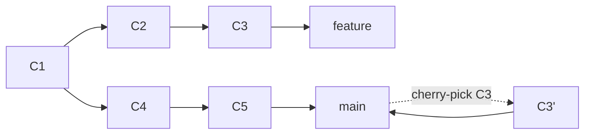
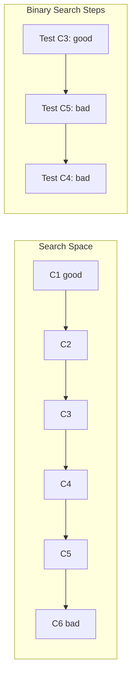

### 6.3.2 Cherry-pick, Stash, and Bisect: Selective Commits and Bug Hunting

#### Why These Tools Matter

Sometimes you need more than basic branching and merging:
- **Cherry-pick** – Apply a specific commit from another branch without merging everything
- **Stash** – Temporarily save uncommitted work to switch branches
- **Bisect** – Binary search to find which commit introduced a bug

This note covers these advanced tools. Note 6.3.1 covered rebase; note 6.3.3 is the subchapter review.

**Backward references:** Commits from 6.1.1 (cherry-pick applies commit objects); branching from 6.2.1 (stash helps switch branches); Git objects from 6.1.1 (bisect uses commit history).

---

## Part 1: Cherry-pick – Selective Commit Application

### What is Cherry-pick?

Cherry-pick applies the changes from one or more specific commits to your current branch.



### Basic Cherry-pick

```bash
# Cherry-pick a single commit
git cherry-pick a1b2c3d

# Cherry-pick a range of commits
git cherry-pick a1b2c3d..e4f5g6h

# Cherry-pick multiple specific commits
git cherry-pick a1b2c3d e4f5g6h i7j8k9l

# Cherry-pick with edit (modify commit before applying)
git cherry-pick -e a1b2c3d

# Cherry-pick without committing (stage changes only)
git cherry-pick -n a1b2c3d
```

### Cherry-pick with Conflicts

```bash
git cherry-pick a1b2c3d
# CONFLICT in file.txt

# Resolve conflicts manually, then:
git add file.txt
git cherry-pick --continue

# Skip this commit
git cherry-pick --skip

# Abort cherry-pick
git cherry-pick --abort
```

### Practical Cherry-pick Examples

**Example 1: Backport a bugfix to release branch**
```bash
# On release branch
git checkout release/v1.0
git cherry-pick a1b2c3d  # bugfix commit from main
git push origin release/v1.0
```

**Example 2: Extract specific commits from feature branch**
```bash
# Apply only the useful commits, not entire feature
git checkout main
git cherry-pick e4f5g6h i7j8k9l  # only working commits
```

**Example 3: Undo a cherry-pick**
```bash
# Cherry-pick created a commit, revert it
git revert a1b2c3d
```

### Cherry-pick vs Merge vs Rebase

| Operation | Use Case | Preserves History |
|-----------|----------|-------------------|
| **Merge** | Combine entire branches | Yes (merge commit) |
| **Rebase** | Move entire branch | Rewrites (linear) |
| **Cherry-pick** | Select specific commits | Copies commits |

---

## Part 2: Stash – Temporarily Save Work

### What is Stash?

Stash saves your uncommitted changes (working directory and staging area) so you can switch branches without committing incomplete work.

### Basic Stash Commands

```bash
# Save current changes
git stash
git stash push -m "WIP: login feature"

# List stashes
git stash list
# stash@{0}: On feature: WIP: login feature
# stash@{1}: On main: WIP: database config

# Apply latest stash (keep in stash list)
git stash apply

# Apply specific stash
git stash apply stash@{1}

# Pop latest stash (apply and remove from list)
git stash pop

# Pop specific stash
git stash pop stash@{1}

# Show stash content
git stash show
git stash show -p stash@{0}  # show full diff

# Remove latest stash
git stash drop

# Remove specific stash
git stash drop stash@{1}

# Remove all stashes
git stash clear
```

### Stash Options

```bash
# Stash including untracked files
git stash -u
git stash --include-untracked

# Stash all files (including ignored)
git stash -a
git stash --all

# Create branch from stash
git stash branch new-feature stash@{0}
```

### Practical Stash Examples

**Example 1: Switch branches without committing**
```bash
# Working on feature, need to fix urgent bug on main
git stash push -m "WIP: feature in progress"
git checkout main
# Fix bug, commit, push
git checkout feature
git stash pop
# Continue working
```

**Example 2: Apply same changes to multiple branches**
```bash
# Make changes, stash them
echo "common change" > common.txt
git add common.txt
git stash push -m "Common change"

# Apply to multiple branches
git checkout branch-a
git stash apply
git commit -m "Apply common change"

git checkout branch-b
git stash apply
git commit -m "Apply common change"

# Clean up
git stash drop
```

**Example 3: Recover accidentally dropped stash**
```bash
git fsck --unreachable | grep commit | cut -d' ' -f3 | xargs git show --oneline
# Find stash commit and create branch
git branch recovered-stash a1b2c3d
```

---

## Part 3: Bisect – Find the Buggy Commit

### What is Bisect?

Bisect performs a binary search through your commit history to find which commit introduced a bug.



### Basic Bisect Workflow

```bash
# Start bisect
git bisect start

# Mark current commit as bad (has bug)
git bisect bad

# Mark an old commit as good (no bug)
git bisect good a1b2c3d

# Git checks out a commit in the middle
# Test the commit for the bug
# If bug exists: git bisect bad
# If bug doesn't exist: git bisect good

# Repeat until Git identifies the buggy commit
# When found, Git shows the commit SHA

# End bisect
git bisect reset
```

### Bisect with Script

```bash
# Automate with script that returns 0 for good, non-0 for bad
git bisect start
git bisect bad HEAD
git bisect good a1b2c3d
git bisect run ./test-bug.sh

# Example test script (test-bug.sh)
#!/bin/bash
# Build and test
make
./run-tests | grep -q "ERROR"
# Returns 0 if test passes (good), non-0 if fails (bad)
```

### Practical Bisect Example

```bash
# Scenario: Web app started returning 500 errors
# Last known good commit: a1b2c3d (yesterday)
# Current commit: e4f5g6h (now has bug)

git bisect start
git bisect bad e4f5g6h
git bisect good a1b2c3d

# Git checks out commit in between
# Test: curl http://localhost:8080/health
# If returns 200 (good): git bisect good
# If returns 500 (bad): git bisect bad

# After ~log2(commits) steps, Git shows:
# a1b2c3d is the first bad commit

git bisect reset
```

### Bisect Commands

| Command | Purpose |
|---------|---------|
| `git bisect start` | Start bisect session |
| `git bisect bad [commit]` | Mark commit as bad |
| `git bisect good [commit]` | Mark commit as good |
| `git bisect reset` | End bisect session |
| `git bisect log` | Show bisect history |
| `git bisect replay logfile` | Replay bisect session |
| `git bisect run <script>` | Automatic bisect |

---

## Part 4: Combining Tools – Real-World Workflows

### Workflow 1: Emergency Hotfix with Cherry-pick

```bash
# On main branch, fix urgent bug
git checkout main
git checkout -b hotfix/critical-bug
# Fix bug, commit
git commit -m "Fix critical bug"
git push origin hotfix/critical-bug

# After review, merge to main
git checkout main
git merge hotfix/critical-bug

# Cherry-pick fix to release branch
git checkout release/v1.0
git cherry-pick a1b2c3d
git push origin release/v1.0
```

### Workflow 2: Context Switch with Stash

```bash
# Working on feature
git checkout feature/new-dashboard
# Make changes, not ready to commit
echo "work in progress" > dashboard.js

# Urgent bug on main
git stash push -m "WIP: dashboard"
git checkout main
git checkout -b bugfix/urgent
# Fix bug, commit, push, merge
git checkout feature/new-dashboard
git stash pop
# Continue work
```

### Workflow 3: Find Regression with Bisect

```bash
# Last release was good, current is bad
git bisect start
git bisect bad HEAD
git bisect good v1.0.0

# Use script to automate testing
cat > test-api.sh << 'EOF'
#!/bin/bash
# Start app
docker-compose up -d
sleep 5
# Test endpoint
curl -f http://localhost:8080/health > /dev/null 2>&1
# Cleanup
docker-compose down
exit $?
EOF
chmod +x test-api.sh

git bisect run ./test-api.sh

# Git finds the buggy commit
git bisect reset
```

---

## Quick Task: Stash and Cherry-pick Practice

*Practice using stash and cherry-pick.*

1. Create a repository with two branches: `main` and `feature`.
2. On `feature`, make uncommitted changes and stash them.
3. Switch to `main` and make a commit.
4. Apply the stash back to `feature`.
5. Cherry-pick the commit from `main` into `feature`.

> **Ready Solution:**
>
> ```bash
> # Task 1
> mkdir practice && cd practice
> git init
> echo "main file" > main.txt
> git add . && git commit -m "Initial on main"
> git checkout -b feature
> echo "feature file" > feature.txt
> git add . && git commit -m "Feature initial"
>
> # Task 2
> echo "uncommitted work" > work.txt
> git stash push -m "WIP on feature"
>
> # Task 3
> git checkout main
> echo "main update" > main-update.txt
> git add . && git commit -m "Update main"
>
> # Task 4
> git checkout feature
> git stash pop
>
> # Task 5
> git cherry-pick main
> # (resolve conflicts if any)
> ```

---

## Summary Table: Cherry-pick, Stash, Bisect

### Cherry-pick Commands

| Command | Purpose |
|---------|---------|
| `git cherry-pick <commit>` | Apply specific commit |
| `git cherry-pick <a>..<b>` | Apply commit range |
| `git cherry-pick -e` | Edit commit before applying |
| `git cherry-pick -n` | Stage changes only |
| `git cherry-pick --continue` | Continue after conflicts |
| `git cherry-pick --abort` | Abort cherry-pick |

### Stash Commands

| Command | Purpose |
|---------|---------|
| `git stash` | Save changes |
| `git stash push -m "msg"` | Save with message |
| `git stash list` | List stashes |
| `git stash apply` | Apply latest stash |
| `git stash pop` | Apply and remove |
| `git stash drop` | Remove stash |
| `git stash clear` | Remove all stashes |
| `git stash branch <name>` | Create branch from stash |

### Bisect Commands

| Command | Purpose |
|---------|---------|
| `git bisect start` | Start bisect |
| `git bisect bad [commit]` | Mark as bad |
| `git bisect good [commit]` | Mark as good |
| `git bisect reset` | End bisect |
| `git bisect run <script>` | Automatic bisect |
| `git bisect log` | Show history |

### Use Case Comparison

| Tool | When to Use |
|------|-------------|
| **Cherry-pick** | Need specific commits from another branch |
| **Stash** | Need to switch branches without committing |
| **Bisect** | Need to find which commit introduced a bug |

---

**Next note (6.3.3)** will be the Subchapter Review for Advanced Git, including a cheatsheet and scenario-based interview questions.

**Backward references:**
- Commits from 6.1.1 (cherry-pick applies commits)
- Branching from 6.2.1 (stash helps switch branches)
- Merge from 6.2.1 (cherry-pick vs merge)
