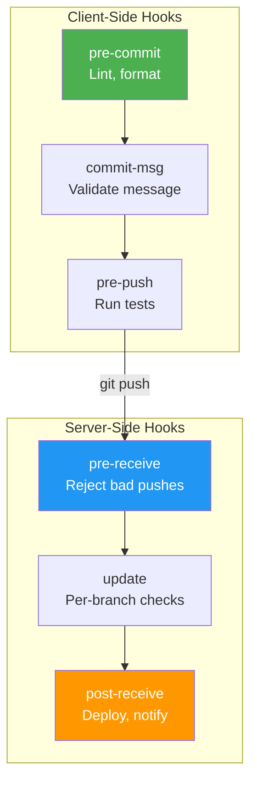

# 6.3.3 Git Hooks: Automating the Git Lifecycle

**Backlinks:** [6.3.1 - Rebase vs Merge and Interactive Rebase](./6.3.1_Rebase_vs_Merge_and_Interactive_Rebase.md) | [6.3.2 - Cherry-pick, Stash, and Bisect](./6.3.2_Cherry_pick_Stash_and_Bisect.md) | [6.2.3 - Tags, Signing, and Versioning](../Subchapter_6.2/6.2.3_Tags_Signing_and_Versioning.md)

**Next note:** [6.3.4 - Subchapter 6.3 Review](./6.3.4_Subchapter_Review.md)

---

#### Why Git Hooks Matter

Git hooks are scripts that Git executes automatically before or after key events like commits, pushes, and merges. They are the foundation of:

- **Code quality enforcement** — Lint code before every commit
- **Security gates** — Block secrets from being committed
- **Commit message standards** — Enforce Conventional Commits format
- **CI pre-flight checks** — Run tests before push
- **Automated deployments** — Deploy on server-side receive

This note covers client-side hooks, server-side hooks, the `hooks/` directory, sharing hooks with teams, and the popular `pre-commit` framework.

**Backward references:** `.git/hooks/` directory from 6.1.1; commit workflow from 6.1.2; push workflow from 6.2.2.

---

### Git Hook Execution Points



## Part 1: How Git Hooks Work

### The `hooks/` Directory

Hooks live in `.git/hooks/`. Git ships with sample hooks (`.sample` extension — disabled by default).

```bash
ls -la .git/hooks/
# applypatch-msg.sample
# commit-msg.sample
# fsmonitor-watchman.sample
# post-update.sample
# pre-applypatch.sample
# pre-commit.sample
# pre-merge-commit.sample
# pre-push.sample
# pre-rebase.sample
# pre-receive.sample
# prepare-commit-msg.sample
# update.sample
# push-to-checkout.sample

# Enable a hook: remove .sample extension and make executable
cp .git/hooks/pre-commit.sample .git/hooks/pre-commit
chmod +x .git/hooks/pre-commit
```

### Hook Rules

1. Hook scripts must be **executable** (`chmod +x`)
2. They can be written in **any scripting language** (bash, Python, Node, Ruby, etc.)
3. Exit with **0** to allow the operation to proceed
4. Exit with **non-zero** to abort the operation
5. They live in `.git/hooks/` which is **NOT tracked by Git** (use a framework to share them)

---

## Part 2: Client-Side Hooks

### Hook Execution Order (Commit Workflow)

```
git commit
    │
    ├─► pre-commit        (runs first — lint, tests, secret scan)
    │
    ├─► prepare-commit-msg (populate default message)
    │
    ├─► commit-msg        (validate commit message format)
    │
    └─► post-commit       (notification, tagging, logging)
```

### pre-commit Hook

Runs before the commit message editor opens. Most common use: linting and formatting.

```bash
#!/bin/bash
# .git/hooks/pre-commit

echo "Running pre-commit checks..."

# 1. Check for debug statements
if git diff --cached --name-only | xargs grep -l "console.log\|debugger\|import pdb" 2>/dev/null; then
    echo "❌ Found debug statements. Remove them before committing."
    exit 1
fi

# 2. Run linter on staged files
STAGED_FILES=$(git diff --cached --name-only --diff-filter=ACM | grep "\.py$")
if [ -n "$STAGED_FILES" ]; then
    echo "Running flake8..."
    flake8 $STAGED_FILES
    if [ $? -ne 0 ]; then
        echo "❌ Linting failed. Fix errors before committing."
        exit 1
    fi
fi

# 3. Run TypeScript type check
if [ -f "tsconfig.json" ]; then
    echo "Running TypeScript check..."
    npx tsc --noEmit
    if [ $? -ne 0 ]; then
        echo "❌ TypeScript errors found."
        exit 1
    fi
fi

echo "✅ Pre-commit checks passed."
exit 0
```

### commit-msg Hook

Validates the commit message format. Receives the path to the file containing the message.

```bash
#!/bin/bash
# .git/hooks/commit-msg

COMMIT_MSG_FILE=$1
COMMIT_MSG=$(cat "$COMMIT_MSG_FILE")

# Enforce Conventional Commits format
# Pattern: type(scope): description
CONVENTIONAL_PATTERN="^(feat|fix|docs|style|refactor|perf|test|chore|ci|build|revert)(\([a-z0-9-]+\))?: .{1,72}"

if ! echo "$COMMIT_MSG" | grep -qE "$CONVENTIONAL_PATTERN"; then
    echo "❌ Invalid commit message format."
    echo ""
    echo "Expected: type(scope): description"
    echo "Examples:"
    echo "  feat(auth): add OAuth2 login"
    echo "  fix: resolve null pointer in user service"
    echo "  docs: update README install instructions"
    echo ""
    echo "Types: feat|fix|docs|style|refactor|perf|test|chore|ci|build|revert"
    exit 1
fi

# Enforce message length (first line ≤ 72 chars)
FIRST_LINE=$(head -1 "$COMMIT_MSG_FILE")
if [ ${#FIRST_LINE} -gt 72 ]; then
    echo "❌ Commit message first line is ${#FIRST_LINE} chars (max 72)."
    exit 1
fi

echo "✅ Commit message is valid."
exit 0
```

### prepare-commit-msg Hook

Modifies the default commit message before the editor opens. Useful for auto-populating ticket numbers from branch names.

```bash
#!/bin/bash
# .git/hooks/prepare-commit-msg

COMMIT_MSG_FILE=$1
COMMIT_SOURCE=$2
SHA1=$3

# Extract ticket number from branch name
# Branch format: feature/PROJ-123-add-login
BRANCH=$(git symbolic-ref --short HEAD 2>/dev/null)
TICKET=$(echo "$BRANCH" | grep -oE "[A-Z]+-[0-9]+" | head -1)

# Only prepend on fresh commits (not amend, merge, squash)
if [ -z "$COMMIT_SOURCE" ] && [ -n "$TICKET" ]; then
    # Prepend ticket to message
    sed -i "1s/^/[$TICKET] /" "$COMMIT_MSG_FILE"
fi
```

### post-commit Hook

Runs after a commit is created. Non-blocking — exit code doesn't affect the commit.

```bash
#!/bin/bash
# .git/hooks/post-commit

# Send notification (e.g., to Slack)
COMMIT_MSG=$(git log -1 --pretty=%B)
AUTHOR=$(git log -1 --pretty=%an)
BRANCH=$(git symbolic-ref --short HEAD)

echo "✅ Committed by $AUTHOR on $BRANCH: $COMMIT_MSG"

# Update a local dev dashboard, etc.
# curl -X POST https://hooks.slack.com/... -d "{\"text\": \"$AUTHOR committed: $COMMIT_MSG\"}"
```

---

## Part 3: Pre-push and Other Client Hooks

### pre-push Hook

Runs before `git push`. Receives remote name and URL via arguments. Can read refs being pushed from stdin.

```bash
#!/bin/bash
# .git/hooks/pre-push

REMOTE=$1
URL=$2

echo "Pre-push checks for remote: $REMOTE ($URL)"

# Run full test suite before push
echo "Running tests..."
npm test
if [ $? -ne 0 ]; then
    echo "❌ Tests failed. Push aborted."
    exit 1
fi

# Prevent direct push to main/master
BRANCH=$(git symbolic-ref HEAD | sed 's/refs\/heads\///')
if [ "$BRANCH" = "main" ] || [ "$BRANCH" = "master" ]; then
    echo "❌ Direct push to $BRANCH is not allowed. Use a Pull Request."
    exit 1
fi

echo "✅ Pre-push checks passed."
exit 0
```

### pre-rebase Hook

Runs before `git rebase`. Can prevent rebasing protected branches.

```bash
#!/bin/bash
# .git/hooks/pre-rebase

UPSTREAM=$1
REBASING_BRANCH=$2

# Prevent rebasing main branch
if [ "$REBASING_BRANCH" = "main" ] || [ -z "$REBASING_BRANCH" ]; then
    echo "❌ Rebasing main branch is not allowed."
    exit 1
fi

exit 0
```

### post-merge Hook

Runs after a successful merge. Useful for updating dependencies when `package.json` or `requirements.txt` changes.

```bash
#!/bin/bash
# .git/hooks/post-merge

# Check if dependency files changed
CHANGED=$(git diff-tree -r --name-only --no-commit-id ORIG_HEAD HEAD)

if echo "$CHANGED" | grep -q "package.json"; then
    echo "📦 package.json changed — running npm install..."
    npm install
fi

if echo "$CHANGED" | grep -q "requirements.txt"; then
    echo "🐍 requirements.txt changed — running pip install..."
    pip install -r requirements.txt
fi
```

### post-checkout Hook

Runs after `git checkout` or `git switch`. Can be used to update environment, set up dependencies.

```bash
#!/bin/bash
# .git/hooks/post-checkout

PREVIOUS_HEAD=$1
NEW_HEAD=$2
IS_BRANCH_CHECKOUT=$3  # 1 = branch checkout, 0 = file checkout

# Only on branch checkout
if [ "$IS_BRANCH_CHECKOUT" = "1" ]; then
    BRANCH=$(git symbolic-ref --short HEAD)
    echo "Switched to branch: $BRANCH"

    # Auto-install dependencies if package.json changed
    if ! git diff --quiet "$PREVIOUS_HEAD" "$NEW_HEAD" -- package.json; then
        echo "📦 Installing npm dependencies..."
        npm install
    fi
fi
```

### Client-Side Hook Summary

| Hook | Trigger | Abort-able | Common Use |
|------|---------|-----------|-----------|
| `pre-commit` | Before commit message editor | Yes | Lint, format, secret scan |
| `prepare-commit-msg` | Populate default message | Yes | Auto-add ticket numbers |
| `commit-msg` | After message entered | Yes | Validate message format |
| `post-commit` | After commit created | No | Notifications, logging |
| `pre-rebase` | Before rebase starts | Yes | Block rebasing protected branches |
| `post-rewrite` | After amend/rebase | No | Update related systems |
| `pre-merge-commit` | Before merge commit created | Yes | Run pre-merge checks |
| `post-merge` | After merge completes | No | Install dependencies |
| `pre-push` | Before push to remote | Yes | Run tests, block direct push to main |
| `post-checkout` | After checkout/switch | No | Set up environment |

---

## Part 4: Server-Side Hooks

Server-side hooks run on the **remote repository** (GitHub, GitLab self-hosted, Gitea, Bitbucket Server). They are the enforcement layer for team policies.

### Server-Side Hook Execution Order

```
git push (from client)
    │
    ├─► pre-receive       (runs once per push — validate all refs)
    │
    ├─► update            (runs once per ref being updated)
    │
    └─► post-receive      (runs after all refs updated — CI trigger, notifications)
```

### pre-receive Hook

Receives all refs being pushed at once. Most powerful server-side hook.

```bash
#!/bin/bash
# hooks/pre-receive  (on server)

while read OLD_SHA NEW_SHA REF_NAME; do
    echo "Receiving push to: $REF_NAME"
    echo "  Old SHA: $OLD_SHA"
    echo "  New SHA: $NEW_SHA"

    # Block force-push to main
    if echo "$REF_NAME" | grep -q "refs/heads/main"; then
        # Check if it's a force push (non-fast-forward)
        if [ "$OLD_SHA" != "0000000000000000000000000000000000000000" ]; then
            if ! git merge-base --is-ancestor "$OLD_SHA" "$NEW_SHA"; then
                echo "❌ Force push to main is not allowed."
                exit 1
            fi
        fi
    fi

    # Validate commit messages in the push
    COMMITS=$(git log --format="%H %s" "$OLD_SHA..$NEW_SHA" 2>/dev/null)
    while IFS= read -r line; do
        SHA=$(echo "$line" | cut -d' ' -f1)
        MSG=$(echo "$line" | cut -d' ' -f2-)
        if ! echo "$MSG" | grep -qE "^(feat|fix|docs|chore|refactor|test|ci|perf):"; then
            echo "❌ Commit $SHA has invalid message: $MSG"
            echo "   Use Conventional Commits format"
            exit 1
        fi
    done <<< "$COMMITS"
done

exit 0
```

### update Hook

Called once per branch being updated. More granular than pre-receive.

```bash
#!/bin/bash
# hooks/update  (on server)

REF_NAME=$1
OLD_SHA=$2
NEW_SHA=$3

# Protect specific branches
PROTECTED_BRANCHES="main master release/.*"

for PROTECTED in $PROTECTED_BRANCHES; do
    if echo "$REF_NAME" | grep -qE "refs/heads/$PROTECTED"; then
        # Only allow push if user is in allowed list
        PUSHER=$(git config hooks.allowedPusher)
        if [ "$GL_USERNAME" != "admin" ] && [ "$GL_USERNAME" != "ci-bot" ]; then
            echo "❌ Only admins can push to $REF_NAME"
            exit 1
        fi
    fi
done

exit 0
```

### post-receive Hook

Runs after all updates complete. Used to trigger CI, send notifications, deploy.

```bash
#!/bin/bash
# hooks/post-receive  (on server)

while read OLD_SHA NEW_SHA REF_NAME; do
    BRANCH=$(echo "$REF_NAME" | sed 's/refs\/heads\///')
    
    # Trigger CI/CD on push to main
    if [ "$BRANCH" = "main" ]; then
        echo "🚀 Triggering deployment for main..."
        curl -X POST "https://ci.example.com/api/trigger" \
             -H "Authorization: Bearer $CI_TOKEN" \
             -d "{\"branch\": \"$BRANCH\", \"sha\": \"$NEW_SHA\"}"
    fi

    # Send Slack notification
    COMMIT_COUNT=$(git rev-list --count "$OLD_SHA..$NEW_SHA")
    echo "📬 $COMMIT_COUNT commits pushed to $BRANCH"
done

exit 0
```

---

## Part 5: Sharing Hooks with Teams

The biggest limitation of `.git/hooks/` is that it's **not tracked by Git** — hooks aren't shared when cloning. Here are the solutions:

### Method 1: Custom hooks path (Git 2.9+)

```bash
# Store hooks in a tracked directory
mkdir -p .githooks

# Create hooks in .githooks/
cat > .githooks/pre-commit << 'EOF'
#!/bin/bash
echo "Running pre-commit..."
# your checks
EOF
chmod +x .githooks/pre-commit

# Tell Git to use this directory
git config core.hooksPath .githooks

# Or set globally for all repos
git config --global core.hooksPath ~/.githooks
```

### Method 2: The `pre-commit` Framework (Most Popular)

The `pre-commit` Python framework manages hooks as plugins, with hundreds of ready-made hooks.

```bash
# Install pre-commit
pip install pre-commit

# Create .pre-commit-config.yaml in repo root
cat > .pre-commit-config.yaml << 'EOF'
repos:
  # Trailing whitespace, end-of-file, etc.
  - repo: https://github.com/pre-commit/pre-commit-hooks
    rev: v4.5.0
    hooks:
      - id: trailing-whitespace
      - id: end-of-file-fixer
      - id: check-yaml
      - id: check-json
      - id: check-merge-conflict
      - id: detect-private-key
      - id: no-commit-to-branch
        args: ['--branch', 'main', '--branch', 'master']

  # Python linting
  - repo: https://github.com/astral-sh/ruff-pre-commit
    rev: v0.1.9
    hooks:
      - id: ruff
        args: [--fix]
      - id: ruff-format

  # Conventional commits
  - repo: https://github.com/compilerla/conventional-pre-commit
    rev: v3.0.0
    hooks:
      - id: conventional-pre-commit
        stages: [commit-msg]
        args: [feat, fix, docs, chore, refactor, test, ci, perf]

  # Secret scanning
  - repo: https://github.com/Yelp/detect-secrets
    rev: v1.4.0
    hooks:
      - id: detect-secrets
        args: ['--baseline', '.secrets.baseline']

  # Shell script linting
  - repo: https://github.com/shellcheck-py/shellcheck-py
    rev: v0.9.0.6
    hooks:
      - id: shellcheck

  # YAML linting
  - repo: https://github.com/adrienverge/yamllint
    rev: v1.35.1
    hooks:
      - id: yamllint

  # Dockerfile linting
  - repo: https://github.com/hadolint/hadolint
    rev: v2.12.0
    hooks:
      - id: hadolint
EOF

# Install the hooks
pre-commit install                    # Install pre-commit hook
pre-commit install --hook-type commit-msg  # Install commit-msg hook
pre-commit install --hook-type pre-push    # Install pre-push hook

# Run manually on all files
pre-commit run --all-files

# Update all hooks to latest versions
pre-commit autoupdate

# Skip hooks for a single commit (emergency)
git commit --no-verify -m "hotfix: emergency patch"

# Run a specific hook only
pre-commit run trailing-whitespace
pre-commit run detect-private-key --all-files
```

### Method 3: Husky (JavaScript/Node.js Projects)

```bash
# Install husky
npm install --save-dev husky

# Initialize
npx husky init

# This creates .husky/ directory and adds npm prepare script

# Create pre-commit hook
echo "npx lint-staged" > .husky/pre-commit
chmod +x .husky/pre-commit

# Create commit-msg hook (with commitlint)
npm install --save-dev @commitlint/cli @commitlint/config-conventional
echo "npx --no -- commitlint --edit \$1" > .husky/commit-msg
chmod +x .husky/commit-msg

# Configure commitlint
echo "export default { extends: ['@commitlint/config-conventional'] };" > commitlint.config.js

# Configure lint-staged in package.json
# "lint-staged": {
#   "*.{js,ts}": ["eslint --fix", "prettier --write"],
#   "*.py": ["black", "flake8"],
#   "*.go": ["gofmt -w"]
# }
```

### Method 4: Lefthook (Fast, Polyglot Alternative)

Lefthook is a Go-based hook manager that's significantly faster than the Python `pre-commit` framework — especially on large repos. It runs hooks in parallel by default and requires no runtime (single binary).

```bash
# Install Lefthook
# macOS
brew install lefthook
# npm (works in any project)
npm install lefthook --save-dev
# Go
go install github.com/evilmartians/lefthook@latest

# Initialize in repository
lefthook install
```

**`.lefthook.yml` configuration:**

```yaml
# .lefthook.yml
pre-commit:
  parallel: true
  commands:
    lint-python:
      glob: "*.py"
      run: ruff check {staged_files}
    lint-js:
      glob: "*.{js,ts}"
      run: eslint {staged_files}
    check-secrets:
      run: detect-secrets-hook {staged_files}
    format:
      glob: "*.{js,ts,py}"
      run: prettier --check {staged_files}

commit-msg:
  commands:
    conventional:
      run: |
        MSG=$(cat {1})
        echo "$MSG" | grep -qE "^(feat|fix|docs|chore|refactor|test|ci|perf)(\([a-z-]+\))?: .+"

pre-push:
  commands:
    test:
      run: npm test
      tags: slow

# Skip slow hooks during development
# LEFTHOOK_EXCLUDE=slow git push
```

**Why Lefthook over pre-commit:**

| Aspect | `pre-commit` (Python) | Lefthook (Go) |
|--------|----------------------|---------------|
| **Startup time** | ~500ms (Python interpreter) | ~5ms (compiled binary) |
| **Parallelism** | Sequential by default | Parallel by default |
| **Runtime dependency** | Requires Python | Single binary, no runtime |
| **Config format** | YAML with repo URLs | YAML with inline commands |
| **Hook marketplace** | 800+ plugins | Use any CLI tool directly |
| **Best for** | Teams with many languages | Speed-critical, large repos |

### Hook Sharing Comparison

| Method | Language | Tracked by Git | Team Onboarding | Best For |
|--------|----------|----------------|-----------------|---------|
| `core.hooksPath` | Any | Yes (if in tracked dir) | `git config core.hooksPath .githooks` | Simple teams |
| `pre-commit` framework | Python | Yes (`.pre-commit-config.yaml`) | `pip install pre-commit && pre-commit install` | Any language |
| Husky | JavaScript | Yes (`.husky/`) | `npm install` (via prepare script) | Node.js projects |
| Lefthook | Go | Yes (`.lefthook.yml`) | `lefthook install` | Fast, polyglot |

---

## Part 6: Secret Scanning Hooks

Preventing secrets from being committed is critical. Here's a dedicated pre-commit hook:

```bash
#!/bin/bash
# .git/hooks/pre-commit — Secret Scanner

STAGED_FILES=$(git diff --cached --name-only)

# Patterns to detect secrets
SECRET_PATTERNS=(
    "password\s*=\s*['\"][^'\"]+['\"]"
    "api_key\s*=\s*['\"][^'\"]+['\"]"
    "secret\s*=\s*['\"][^'\"]+['\"]"
    "token\s*=\s*['\"][^'\"]+['\"]"
    "aws_access_key_id\s*=\s*['\"][^'\"]+['\"]"
    "AKIA[0-9A-Z]{16}"                    # AWS Access Key ID
    "-----BEGIN (RSA|EC|DSA) PRIVATE KEY-----"  # Private keys
    "[0-9a-f]{32}"                         # MD5 hash-like tokens
    "ghp_[A-Za-z0-9]{36}"                 # GitHub Personal Access Token
    "sk-[A-Za-z0-9]{48}"                  # OpenAI API key
)

FOUND_SECRET=0
for FILE in $STAGED_FILES; do
    for PATTERN in "${SECRET_PATTERNS[@]}"; do
        if git show ":$FILE" 2>/dev/null | grep -qiE "$PATTERN"; then
            echo "❌ Potential secret found in $FILE: pattern '$PATTERN'"
            FOUND_SECRET=1
        fi
    done
done

if [ $FOUND_SECRET -ne 0 ]; then
    echo ""
    echo "Remove secrets and use environment variables or a secrets manager."
    echo "To bypass this check (not recommended): git commit --no-verify"
    exit 1
fi

exit 0
```

---

## Quick Task: Hook Practice

1. Create a repository and write a `pre-commit` hook that blocks any file with `TODO:` comments.
2. Write a `commit-msg` hook that requires messages to start with a Jira ticket `[PROJ-XXX]`.
3. Test that a commit is blocked, then fix it and commit successfully.

> **Ready Solution:**
> ```bash
> mkdir hook-practice && cd hook-practice
> git init
>
> # Pre-commit hook
> cat > .git/hooks/pre-commit << 'HOOK'
> #!/bin/bash
> if git diff --cached | grep -q "TODO:"; then
>     echo "❌ Found TODO: comments. Resolve before committing."
>     exit 1
> fi
> exit 0
> HOOK
> chmod +x .git/hooks/pre-commit
>
> # commit-msg hook
> cat > .git/hooks/commit-msg << 'HOOK'
> #!/bin/bash
> if ! grep -qE "^\[PROJ-[0-9]+\]" "$1"; then
>     echo "❌ Message must start with [PROJ-XXX]"
>     exit 1
> fi
> exit 0
> HOOK
> chmod +x .git/hooks/commit-msg
>
> # Test blocked commit
> echo "function foo() { // TODO: implement this }" > code.js
> git add code.js
> git commit -m "[PROJ-123] Add foo"  # Blocked by pre-commit
>
> # Fix and retry
> echo "function foo() { return 42; }" > code.js
> git add code.js
> git commit -m "[PROJ-123] Add foo"  # Blocked by commit-msg? No — valid
>
> # Test invalid commit message
> git commit -m "Add foo without ticket"  # Blocked by commit-msg
> ```

---

## Summary Table: Git Hooks

### Client-Side Hooks Reference

| Hook | When | Abort-able | Primary Use |
|------|------|-----------|-------------|
| `pre-commit` | Before editor opens | ✅ | Lint, format, scan for secrets |
| `prepare-commit-msg` | Populate default message | ✅ | Auto-add ticket numbers |
| `commit-msg` | After message entered | ✅ | Validate message format |
| `post-commit` | After commit created | ❌ | Notifications |
| `pre-rebase` | Before rebase | ✅ | Block rebasing main |
| `post-merge` | After merge | ❌ | Install dependencies |
| `post-checkout` | After checkout/switch | ❌ | Set up environment |
| `pre-push` | Before push | ✅ | Run tests, block direct pushes to main |
| `post-rewrite` | After amend/rebase | ❌ | Update related systems |

### Server-Side Hooks Reference

| Hook | When | Abort-able | Primary Use |
|------|------|-----------|-------------|
| `pre-receive` | Before any ref updated | ✅ | Validate all pushed commits |
| `update` | Per ref being updated | ✅ | Per-branch policy enforcement |
| `post-receive` | After all refs updated | ❌ | Trigger CI, send notifications |

### `pre-commit` Framework Key Hooks

| Hook ID | What it Does |
|---------|-------------|
| `trailing-whitespace` | Removes trailing whitespace |
| `end-of-file-fixer` | Ensures files end with newline |
| `check-yaml` | Validates YAML syntax |
| `check-json` | Validates JSON syntax |
| `detect-private-key` | Blocks private key files |
| `no-commit-to-branch` | Blocks direct commits to main |
| `check-merge-conflict` | Blocks unresolved conflict markers |

---

**Next note (6.3.4)** is the **Subchapter 6.3 Review** — a cheatsheet and scenario-based interview questions covering rebase, cherry-pick, stash, bisect, and Git hooks.

**Backward references:**
- `.git/hooks/` directory from 6.1.1
- Commit workflow from 6.1.2
- Push workflow from 6.2.2
- Conventional commits and signed tags from 6.2.3
- Interactive rebase (pre-push hooks often run tests before rewriting history) from 6.3.1

**Forward references:**
- Server-side hooks integrate with CI/CD pipelines (Module 8)
- `pre-commit` secret scanning complements `.gitignore` discipline from 6.1.2
- Hook-enforced undo/reset safety rails pair with reset/revert from 6.4.1
