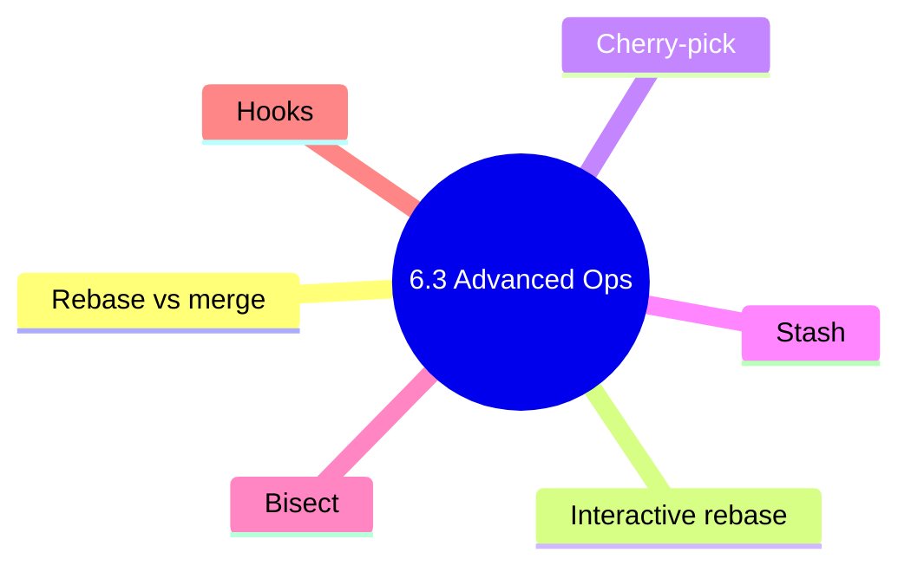

# 6.3.4 Subchapter 6.3 Review: Advanced Git — Rebase, Cherry-pick, Stash, Bisect, and Hooks

**Backlinks:** [6.3.1 - Rebase vs Merge](./6.3.1_Rebase_vs_Merge_and_Interactive_Rebase.md) | [6.3.2 - Cherry-pick, Stash, Bisect](./6.3.2_Cherry_pick_Stash_and_Bisect.md) | [6.3.3 - Git Hooks](./6.3.3_Git_Hooks.md)

**Next:** [6.4.1 - Undoing Mistakes](../Subchapter_6.4/6.4.1_Undoing_Mistakes_reset_revert_reflog.md)



---

This review covers the material presented in Notes 6.3.1 (Rebase vs Merge and Interactive Rebase), 6.3.2 (Cherry-pick, Stash, and Bisect), and 6.3.3 (Git Hooks). No forward referencing beyond what was explicitly introduced.

---

## Cheatsheet: Advanced Git

### Rebase vs Merge

| Operation | Command | When to Use |
|-----------|---------|-------------|
| Merge | `git merge feature` | Shared branches, preserving history |
| Rebase | `git rebase main` | Local branches, clean history |
| Pull with rebase | `git pull --rebase` | Avoid merge commits on pull |
| Interactive rebase | `git rebase -i HEAD~N` | Cleaning history before push |

### Interactive Rebase Actions

| Action | Abbrev | Effect |
|--------|--------|--------|
| `pick` | `p` | Use commit as is |
| `reword` | `r` | Change commit message |
| `edit` | `e` | Stop to amend commit |
| `squash` | `s` | Combine with previous commit |
| `fixup` | `f` | Squash, discard message |
| `drop` | `d` | Remove commit |
| `exec` | `x` | Run command |

### Rebase Safety Rules

| Rule | Explanation |
|------|-------------|
| Never rebase shared branches | Others have work based on old SHAs |
| Use `--force-with-lease` | Safer than `--force` |
| Rebase local branches before push | Clean history, no impact on others |
| Keep reflog for recovery | `git reflog` to find lost commits |

### Cherry-pick Commands

| Command | Purpose |
|---------|---------|
| `git cherry-pick <commit>` | Apply specific commit |
| `git cherry-pick <a>..<b>` | Apply commit range |
| `git cherry-pick -e` | Edit commit before applying |
| `git cherry-pick -n` | Stage changes only |
| `git cherry-pick --continue` | Continue after conflicts |
| `git cherry-pick --abort` | Abort cherry-pick |

### Stash Commands

| Command | Purpose |
|---------|---------|
| `git stash` | Save changes |
| `git stash push -m "msg"` | Save with message |
| `git stash list` | List stashes |
| `git stash apply` | Apply latest stash |
| `git stash pop` | Apply and remove |
| `git stash drop` | Remove stash |
| `git stash clear` | Remove all stashes |
| `git stash branch <name>` | Create branch from stash |
| `git stash -u` | Include untracked files |
| `git stash -a` | Include ignored files |

### Bisect Commands

| Command | Purpose |
|---------|---------|
| `git bisect start` | Start bisect |
| `git bisect bad [commit]` | Mark as bad |
| `git bisect good [commit]` | Mark as good |
| `git bisect reset` | End bisect |
| `git bisect run <script>` | Automatic bisect |
| `git bisect log` | Show history |

### Git Hooks — Client-Side

| Hook | Trigger | Abort-able | Primary Use |
|------|---------|-----------|-------------|
| `pre-commit` | Before commit is created | ✅ | Lint, format, fast tests |
| `prepare-commit-msg` | After message template loaded | ❌ | Auto-insert issue numbers |
| `commit-msg` | After message entered | ✅ | Validate Conventional Commits |
| `post-commit` | After commit | ❌ | Notifications, logging |
| `pre-push` | Before `git push` | ✅ | Full test suite, build |
| `pre-rebase` | Before rebase starts | ✅ | Block rebase on shared branch |
| `post-merge` | After merge | ❌ | Restart dev server, reinstall deps |
| `post-checkout` | After `git checkout` | ❌ | Reload IDE config per branch |
| `post-rewrite` | After `commit --amend` / `rebase` | ❌ | Update derived artifacts |

### Git Hooks — Server-Side

| Hook | Trigger | Abort-able | Primary Use |
|------|---------|-----------|-------------|
| `pre-receive` | Before any ref updated | ✅ | Validate all pushed commits |
| `update` | Per ref being updated | ✅ | Per-branch policy enforcement |
| `post-receive` | After all refs updated | ❌ | Trigger CI, notifications |

### `pre-commit` Framework

| Command | Purpose |
|---------|---------|
| `pip install pre-commit` | Install framework |
| `pre-commit install` | Install hooks from `.pre-commit-config.yaml` |
| `pre-commit run --all-files` | Run hooks manually on every file |
| `pre-commit autoupdate` | Update hook versions |
| `SKIP=hookid git commit` | Skip a specific hook once |
| `git commit --no-verify` | Bypass all hooks (use sparingly) |

### Hook Installation Paths

| Location | Scope |
|----------|-------|
| `.git/hooks/<name>` | Per-clone, not versioned |
| `core.hooksPath <dir>` | Per-repo shared hooks directory (versioned) |
| `~/.config/git/hooks/` | User default for all repos |

---

## Comparison Tables

### Merge vs Rebase vs Cherry-pick

| Operation | Use Case | Preserves History | SHAs Change |
|-----------|----------|-------------------|-------------|
| Merge | Combine entire branches | Yes (merge commit) | No |
| Rebase | Move entire branch | Rewrites (linear) | Yes |
| Cherry-pick | Select specific commits | Copies commits | Yes (new SHA) |

### Stash vs Commit vs Branch

| Operation | Use Case | Preserves Work | Visible to Others |
|-----------|----------|----------------|-------------------|
| Commit | Save permanent work | Yes | Yes (after push) |
| Stash | Save temporary work | Yes | No |
| Branch | Isolate work | Yes (after commit) | Yes |

### Interactive Rebase Actions

| Action | When to Use | Example |
|--------|-------------|---------|
| `pick` | Keep commit as is | Default |
| `reword` | Fix typo in message | `reword a1b2c3d` |
| `edit` | Add forgotten file | `edit e4f5g6h` then `git commit --amend` |
| `squash` | Combine small WIP commits | `squash i7j8k9l` into previous |
| `fixup` | Combine, discard message | `fixup m9n0o1p` |
| `drop` | Remove unwanted commit | `drop q1r2s3t` |

---

## Interview Questions (Scenario-Based)

These questions assume only knowledge from Subchapter 6.3. Answers reference only concepts from 6.3.1 and 6.3.2.

### Question 1

**Scenario:** A developer has a feature branch with 10 messy commits (including "WIP", "fix typo", "temp"). They want to merge into `main` with a single clean commit.

**Question:** How can they squash all commits into one before merging? What are the trade-offs?

**Answer:**

**Solution: Interactive rebase**

```bash
# Squash last 10 commits
git rebase -i HEAD~10

# In editor, change all but first commit to 'squash' or 'fixup':
pick a1b2c3d First commit
squash e4f5g6h WIP
squash i7j8k9l Fix typo
squash m9n0o1p Temp
# ... etc

# After saving, edit the combined commit message
git push --force-with-lease origin feature
```

**Alternative (simpler):**
```bash
# Soft reset to the commit before feature started
git reset --soft <commit-before-feature>
git commit -m "Add complete feature"

# Then force push
git push --force-with-lease origin feature
```

**Trade-offs of squashing:**

| Aspect | Pro | Con |
|--------|-----|-----|
| **History** | Clean, readable | Lose detailed commit history |
| **Bisect** | Easier (one commit per feature) | Harder to pinpoint within feature |
| **Review** | Easier for large PRs | Lose intermediate work |
| **Revert** | One revert removes entire feature | Can't revert part of feature |

**When to squash:**
- Before merging feature branches
- For WIP commits that don't add value
- When preparing for release

**When not to squash:**
- Commits have meaningful separate changes
- Team uses `git bisect` on detailed commits
- Public branches others have based work on

### Question 2

**Scenario:** A critical bug was found in production. The team knows the bug appeared sometime in the last 2 weeks (between commit `a1b2c3d` and `e4f5g6h`). There are 200 commits in that range.

**Question:** How can Git help find the exact commit that introduced the bug? What commands would you use?

**Answer:**

**Solution: Use `git bisect` for binary search**

```bash
# Start bisect
git bisect start

# Mark current commit as bad (has bug)
git bisect bad e4f5g6h

# Mark known good commit (no bug)
git bisect good a1b2c3d

# Git checks out a commit in the middle
# Test the commit for the bug
# If bug exists: git bisect bad
# If bug doesn't exist: git bisect good

# Repeat until Git identifies the buggy commit
# After ~8 steps (log2 200), Git shows:
# a1b2c3d is the first bad commit

# End bisect
git bisect reset
```

**Automated bisect with script:**

```bash
# Create test script that returns 0 for good, non-0 for bad
cat > test-bug.sh << 'EOF'
#!/bin/bash
# Deploy to test environment
./deploy.sh
# Run test that triggers the bug
curl -f http://test-env/health | grep -q "OK"
exit $?
EOF
chmod +x test-bug.sh

# Run automatic bisect
git bisect start
git bisect bad e4f5g6h
git bisect good a1b2c3d
git bisect run ./test-bug.sh

git bisect reset
```

**Benefits of bisect:**

| Feature | Benefit |
|---------|---------|
| Binary search | O(log n) steps instead of O(n) |
| Automation | Can run with test scripts |
| Precision | Finds exact commit, not just range |
| Integration | Works with any test framework |

### Question 3

**Scenario:** A developer is working on a feature branch and has uncommitted changes. A critical bug needs immediate fixing on `main`.

**Question:** How can they save their work, fix the bug, and resume without losing progress? What are the options?

**Answer:**

**Solution: Use `git stash`**

```bash
# Save current uncommitted work
git stash push -m "WIP: feature in progress"

# Verify stash is saved
git stash list
# stash@{0}: On feature: WIP: feature in progress

# Switch to main and fix bug
git checkout main
git checkout -b hotfix/urgent-bug
# Fix bug
git add .
git commit -m "Fix critical bug"
git push origin hotfix/urgent-bug

# After hotfix is merged (or for testing)
git checkout main
git pull origin main

# Return to feature branch and restore work
git checkout feature
git stash pop
# Continue working
```

**Alternative options:**

| Option | Command | When to Use |
|--------|---------|-------------|
| **Commit (temporary)** | `git commit -m "WIP"` | If you don't mind temporary commits |
| **Stash** | `git stash` | Default, keeps work off commit history |
| **Create branch** | `git checkout -b temp` | If you want to preserve exact state |
| **Worktree** | `git worktree add ../hotfix main` | For simultaneous work on both |

**Stash variants:**

```bash
# Include untracked files
git stash -u

# Include all files (including ignored)
git stash -a

# Create branch from stash (if you forgot branch)
git stash branch recover-branch stash@{0}
```

**Recover from lost stash:**

```bash
# Find lost stashes
git fsck --unreachable | grep commit | cut -d' ' -f3 | xargs git show --oneline

# Create branch from recovered commit
git branch recovered-stash a1b2c3d
```

### Question 4

**Scenario:** A developer accidentally merged a feature branch that wasn't ready. The merge commit is `a1b2c3d`. They want to remove the merge but keep the commits after it.

**Question:** How can they undo the merge without rewriting history (safe for shared branch)? What command would they use?

**Answer:**

**Solution: Use `git revert` with `-m` flag**

```bash
# Find the merge commit SHA
git log --oneline --merges
# a1b2c3d Merge branch 'feature' into main

# Revert the merge (keep first parent)
git revert -m 1 a1b2c3d

# The `-m 1` means: keep the first parent (main branch)
# This creates a new commit that undoes all changes from the merge
```

**Why `-m` is needed:**
- Merge commits have two parents
- `-m 1` = keep changes from the branch you were on (main)
- `-m 2` = keep changes from the merged branch (feature)

**After revert, to re-merge later (after fixing feature):**

```bash
# First revert the revert
git revert <revert-commit-sha>

# Then merge the fixed feature
git merge feature/fixed
```

**Alternative (if branch hasn't been pushed or no one has pulled):**

```bash
# Reset to commit before merge
git reset --hard <commit-before-merge>

# Force push (dangerous on shared branches)
git push --force-with-lease origin main
```

**Comparison of methods:**

| Method | Safe for shared? | Rewrites history? | Creates new commit? |
|--------|------------------|-------------------|---------------------|
| `git revert` | Yes | No | Yes |
| `git reset` | No (if pushed) | Yes | No |
| `git revert` then re-merge | Yes | No | Yes (two commits) |

### Question 5

**Scenario:** A hotfix was applied to `main` branch (commit `a1b2c3d`). The team also needs this fix on the `release/v1.0` branch, but they don't want to merge the entire `main` branch (which has other unreleased features).

**Question:** How can they apply only the hotfix to the release branch? What command would they use?

**Answer:**

**Solution: Use `git cherry-pick`**

```bash
# On release branch
git checkout release/v1.0

# Cherry-pick the hotfix commit from main
git cherry-pick a1b2c3d

# If conflicts occur, resolve them
git add .
git cherry-pick --continue

# Push the updated release branch
git push origin release/v1.0
```

**Alternative if hotfix consists of multiple commits:**

```bash
# Cherry-pick a range of commits
git cherry-pick a1b2c3d..e4f5g6h

# Or list specific commits
git cherry-pick a1b2c3d e4f5g6h i7j8k9l
```

**Cherry-pick vs merge for backporting:**

| Aspect | Cherry-pick | Merge |
|--------|-------------|-------|
| **Selective commits** | Yes (pick specific) | No (all or nothing) |
| **Commit history** | Copies commits (new SHAs) | Preserves commits |
| **Future merges** | May cause duplicate commits | Cleaner (merge base updated) |
| **Use case** | Hotfix to old release | Regular feature merging |

**Preventing duplicate commits in future:**

```bash
# After cherry-picking to release, also merge release back to main
git checkout main
git merge release/v1.0
# Git will skip already-applied changes (if cherry-pick preserved original SHA)
# But cherry-pick creates new SHA, so may still show conflicts

# Better: Use `git cherry-pick -x` to record original commit
git cherry-pick -x a1b2c3d
# Adds "(cherry picked from commit a1b2c3d)" to message
```

---

## Topics Covered in This Subchapter (Self-Check)

| Topic | Found in Note |
|-------|---------------|
| Rebase vs merge trade-offs | 6.3.1 |
| Interactive rebase actions (pick, squash, reword, edit, drop) | 6.3.1 |
| Squashing commits | 6.3.1 |
| Rewording commit messages | 6.3.1 |
| Editing commits (adding forgotten files) | 6.3.1 |
| Golden rule of rebasing | 6.3.1 |
| Pull with rebase | 6.3.1 |
| Cherry-pick single commit | 6.3.2 |
| Cherry-pick range of commits | 6.3.2 |
| Cherry-pick with conflicts | 6.3.2 |
| Stash basic commands (push, pop, apply, list, drop) | 6.3.2 |
| Stash with untracked/ignored files | 6.3.2 |
| Create branch from stash | 6.3.2 |
| Bisect basic workflow (start, bad, good, reset) | 6.3.2 |
| Bisect with script (bisect run) | 6.3.2 |
| Bisect log and replay | 6.3.2 |
| Client-side hooks (`pre-commit`, `commit-msg`, `pre-push`, etc.) | 6.3.3 |
| Server-side hooks (`pre-receive`, `update`, `post-receive`) | 6.3.3 |
| Making hooks executable (`chmod +x`) | 6.3.3 |
| `pre-commit` framework and `.pre-commit-config.yaml` | 6.3.3 |
| Husky for JavaScript/Node projects | 6.3.3 |
| `core.hooksPath` for shared, versioned hooks | 6.3.3 |
| Bypassing hooks (`--no-verify`, `SKIP=`) | 6.3.3 |
| Secret-scanning pre-commit hook | 6.3.3 |

## Bridge Concepts (Not in Notes but Added for Clarity)

| Concept | Explanation |
|---------|-------------|
| `--force-with-lease` | Safer alternative to `--force`. Checks that remote branch hasn't been updated by someone else. |
| `git worktree` | Allows multiple branches to be checked out simultaneously in different directories. Useful for parallel work. |
| `git fsck` | Filesystem integrity check. Can find unreachable commits (lost stashes, dropped commits). |
| `git cherry-pick -x` | Adds original commit SHA to message. Helps track where cherry-picked commits originated. |
| `git reflog` | Records where HEAD has pointed. Used to recover lost commits after rebase or reset. |

---

**End of Subchapter 6.3 Review**

**Next:** Proceed to Subchapter 6.4 – Undoing Mistakes, Git LFS, Submodules, and Subtrees (reset, revert, reflog, Git LFS, submodules, subtrees, plus the Module 6 Final Exam).

Congratulations on completing Subchapter 6.3! You can now rewrite history with interactive rebase, selectively apply commits with cherry-pick, save uncommitted work with stash, binary search for bugs with bisect, and automate Git lifecycle events with client-side and server-side hooks.
