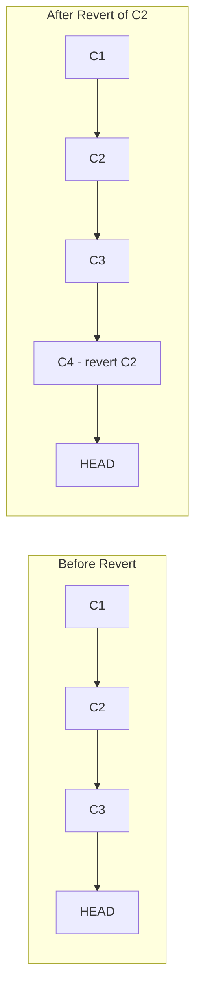

# 6.4.1 Undoing Mistakes: reset, revert, and reflog

**Backlinks:** [6.3.3 - Git Hooks](../Subchapter_6.3/6.3.3_Git_Hooks.md) | [6.3.4 - Subchapter 6.3 Review](../Subchapter_6.3/6.3.4_Subchapter_Review.md)

**Next note:** [6.4.2 - Git LFS, Submodules, Subtrees](./6.4.2_Git_LFS_Submodules_and_Subtrees.md)

---

#### Why Undoing Matters

Everyone makes mistakes in Git. Knowing how to safely undo changes is essential:
- **Unstage a file** – `git reset HEAD <file>`
- **Discard local changes** – `git checkout -- <file>` or `git restore <file>`
- **Undo a commit** – `git reset` (local) or `git revert` (shared)
- **Recover lost commits** – `git reflog`

This note covers undoing mistakes. Note 6.4.2 covers Git LFS and submodules; note 6.4.3 is the subchapter review.

**Backward references:** Git objects from 6.1.1 (reset moves branch pointer); commits from 6.1.2 (revert creates new commit); reflog from 6.1.1 (records HEAD movements).

---

## Part 1: Undoing Local Changes (Working Directory)

### Discard Changes in Working Directory

```bash
# Discard changes to a specific file (restore to last commit)
git checkout -- file.txt
# Modern syntax
git restore file.txt

# Discard all changes in working directory
git checkout -- .
git restore .

# Discard changes to all tracked files
git restore .
```

### Unstage Files (Remove from Staging Area)

```bash
# Unstage a specific file (keep changes in working directory)
git reset HEAD file.txt
# Modern syntax
git restore --staged file.txt

# Unstage all files
git reset HEAD
git restore --staged .

# Unstage and discard changes (remove from staging AND working directory)
git checkout HEAD -- file.txt
# or
git restore --source=HEAD --staged --worktree file.txt
```

### `git restore --source` — Restore from Any Commit

The `--source` flag lets you restore a file to the state it was in at **any** commit, not just HEAD:

```bash
# Restore file to its state 3 commits ago
git restore --source=HEAD~3 file.txt

# Restore file from a specific commit SHA
git restore --source=a1b2c3d file.txt

# Restore file from a specific tag
git restore --source=v1.0.0 config.yaml

# Restore AND stage (replace both working directory and index)
git restore --source=a1b2c3d --staged --worktree file.txt

# Restore entire directory from an older commit
git restore --source=HEAD~5 src/
```

### Why `restore` Replaced `checkout` for File Operations

Git 2.23 introduced `git restore` (and `git switch`) to split the overloaded `git checkout` into purpose-specific commands. The old `checkout` did too many different things:

```bash
# OLD (confusing — checkout does 4 different things):
git checkout main              # Switch branch
git checkout -b feature        # Create + switch branch
git checkout -- file.txt       # Discard file changes
git checkout a1b2c3d -- file.txt  # Restore file from commit

# NEW (clear intent — each command does ONE thing):
git switch main                # Switch branch
git switch -c feature          # Create + switch branch
git restore file.txt           # Discard file changes
git restore --source=a1b2c3d file.txt  # Restore from commit
```

| Old Command | New Command | Purpose |
|------------|-------------|---------|
| `git checkout <branch>` | `git switch <branch>` | Switch branches |
| `git checkout -b <branch>` | `git switch -c <branch>` | Create and switch |
| `git checkout -- <file>` | `git restore <file>` | Discard working changes |
| `git checkout HEAD -- <file>` | `git restore --staged --worktree <file>` | Unstage + discard |
| `git checkout <sha> -- <file>` | `git restore --source=<sha> <file>` | Restore from specific commit |
| `git reset HEAD <file>` | `git restore --staged <file>` | Unstage only |

**Recommendation:** Use `git restore` and `git switch` in new workflows. They're safer because they won't accidentally switch branches when you meant to restore a file (a common `checkout` mistake).

---

## Part 2: git reset – Move Branch Pointer

`git reset` moves the current branch pointer to a different commit. It has three modes:

### Reset Modes

| Mode | Effect on Working Directory | Effect on Staging Area | Effect on Commit History |
|------|---------------------------|----------------------|-------------------------|
| **--soft** | No change | No change | Branch pointer moves |
| **--mixed** (default) | No change | Resets to match commit | Branch pointer moves |
| **--hard** | Resets to match commit | Resets to match commit | Branch pointer moves |

```mermaid
graph LR
    subgraph Before Reset
        A[C1] --> B[C2] --> C[C3] --> D[HEAD->main]
    end
    subgraph After --soft reset to C2
        A2[C1] --> B2[C2] --> C3[C3] --> D2[HEAD->main]
        style C3 stroke-dasharray: 5 5
    end
    subgraph After --mixed reset to C2
        A3[C1] --> B3[C2] --> D3[HEAD->main]
        style C3 stroke-dasharray: 5 5
    end
```

### git reset --soft (Undo Commit, Keep Changes Staged)

```bash
# Undo last commit, keep changes staged
git reset --soft HEAD~1

# Undo last 3 commits, keep changes staged
git reset --soft HEAD~3

# Changes are still staged, ready to commit again
git status
# Changes to be committed: (modified: file.txt)
```

**Use case:** You committed too early; want to add more files to the same commit.

### git reset --mixed (Undo Commit, Unstage Changes)

```bash
# Undo last commit, unstage changes (keep in working directory)
git reset HEAD~1
# or
git reset --mixed HEAD~1

# Changes are in working directory, not staged
git status
# Changes not staged for commit: (modified: file.txt)
```

**Use case:** You committed, but want to split into multiple commits.

### git reset --hard (Discard Everything)

```bash
# Discard last commit AND all changes
git reset --hard HEAD~1

# Discard last 3 commits (permanently!)
git reset --hard HEAD~3

# Reset to specific commit
git reset --hard a1b2c3d
```

**Warning:** `--hard` discards uncommitted changes permanently. Cannot recover (except via reflog).

### Reset to Specific Commits

```bash
# Reset to a specific commit SHA
git reset --soft a1b2c3d
git reset --mixed a1b2c3d
git reset --hard a1b2c3d

# Reset to commit relative to HEAD
git reset HEAD~2  # Two commits back

# Reset to upstream branch
git reset --hard origin/main
```

---

## Part 3: git revert – Safe Undo for Shared Branches

`git revert` creates a **new commit** that undoes changes from a previous commit. It's safe for shared branches because it doesn't rewrite history.



### Basic Revert

```bash
# Revert the last commit
git revert HEAD

# Revert a specific commit
git revert a1b2c3d

# Revert without auto-commit (stage changes only)
git revert -n a1b2c3d
git commit -m "Revert a1b2c3d"

# Revert a range of commits
git revert a1b2c3d..e4f5g6h
```

### Revert with Conflicts

```bash
git revert a1b2c3d
# CONFLICT in file.txt

# Resolve conflicts, then:
git add file.txt
git revert --continue

# Or abort
git revert --abort
```

### Revert vs Reset Comparison

| Aspect | git revert | git reset |
|--------|-----------|-----------|
| **History rewriting** | No (adds new commit) | Yes (removes commits) |
| **Safe for shared branches** | Yes | No (if pushed) |
| **Recoverability** | Easy (revert of revert) | Hard (needs reflog) |
| **Use case** | Undo already-pushed commits | Undo local commits |

### Revert a Merge Commit

```bash
# Find merge commit SHA
git log --oneline --merges
# a1b2c3d Merge branch 'feature'

# Revert merge (keep main branch changes)
git revert -m 1 a1b2c3d
```

---

## Part 4: git reflog – Recover Lost Commits

The reflog records where HEAD has pointed. It's your safety net for recovering lost commits.

### View Reflog

```bash
# View full reflog
git reflog
# a1b2c3d HEAD@{0}: reset: moving to HEAD~1
# e4f5g6h HEAD@{1}: commit: Add feature
# i7j8k9l HEAD@{2}: commit: Update README

# View reflog for specific branch
git reflog main

# Show reflog with dates
git reflog --date=local
```

### Recover Lost Commits

```bash
# Scenario 1: After `git reset --hard` that removed commits
git reflog
# Find the commit before reset (e.g., HEAD@{1})
git reset --hard HEAD@{1}

# Scenario 2: After `git commit --amend` that overwrote a commit
git reflog
# Find the original commit (e.g., HEAD@{1})
git cherry-pick HEAD@{1}

# Scenario 3: After deleting a branch
git reflog
# Find the last commit of deleted branch
git checkout -b recovered-branch a1b2c3d
```

### Reflog Expiration

```bash
# Default expiration: 90 days for reachable, 30 days for unreachable
git reflog expire --expire=now --all

# Show reflog expiration settings
git config gc.reflogExpire
# 90.days
```

---

## Part 5: Other Undo Commands

### git clean – Remove Untracked Files

```bash
# Show what would be removed (dry run)
git clean -n

# Remove untracked files
git clean -f

# Remove untracked directories
git clean -fd

# Remove ignored files as well
git clean -fx

# Interactive clean
git clean -i
```

### git rm – Remove Tracked Files

```bash
# Remove file from Git and working directory
git rm file.txt
git commit -m "Remove file.txt"

# Remove from Git only (keep on disk)
git rm --cached file.txt

# Remove directory recursively
git rm -r old-folder/
```

### git commit --amend – Fix Last Commit

```bash
# Change last commit message
git commit --amend -m "New message"

# Add forgotten file to last commit
git add forgotten.txt
git commit --amend --no-edit

# Amend without changing message
git commit --amend --no-edit
```

---

## Part 6: Undo Workflow Examples

### Example 1: Accidentally committed to wrong branch

```bash
# Save current work
git stash

# Switch to correct branch
git checkout correct-branch

# Apply the commit
git cherry-pick wrong-branch

# Switch back and clean up
git checkout wrong-branch
git reset --hard HEAD~1
git stash pop
```

### Example 2: Committed too early (need to add more files)

```bash
# Undo commit but keep changes staged
git reset --soft HEAD~1

# Add forgotten files
git add forgotten.txt

# Commit again
git commit -m "Complete feature"
```

### Example 3: Need to split a commit into multiple commits

```bash
# Undo commit and unstage changes
git reset HEAD~1

# Add first part
git add file1.txt
git commit -m "Part 1"

# Add second part
git add file2.txt
git commit -m "Part 2"
```

### Example 4: Discard all local changes and reset to origin

```bash
# Fetch latest from remote
git fetch origin

# Reset local branch to match remote
git reset --hard origin/main

# Remove untracked files
git clean -fd
```

---

## Quick Task: Undo Practice

*Practice undoing mistakes safely.*

1. Create a commit, then use `git reset --soft` to undo it (keep changes staged).
2. Create another commit, then use `git reset --mixed` to undo it (unstage changes).
3. Create a third commit, then use `git revert` to undo it safely.
4. Use `git reflog` to view your history.
5. Practice recovering a "lost" commit using reflog.

> **Ready Solution:**
>
> ```bash
> # Setup
> mkdir undo-practice && cd undo-practice
> git init
> echo "file1" > file1.txt && git add . && git commit -m "Commit 1"
> echo "file2" > file2.txt && git add . && git commit -m "Commit 2"
> echo "file3" > file3.txt && git add . && git commit -m "Commit 3"
>
> # Task 1
> git reset --soft HEAD~1
> git status  # file3.txt staged
>
> # Task 2
> git reset HEAD~1
> git status  # file2.txt modified but not staged
>
> # Task 3
> git add . && git commit -m "Commit 2 again"
> git revert HEAD --no-edit
>
> # Task 4
> git reflog
>
> # Task 5 (recover from reflog)
> git reset --hard HEAD@{3}  # back to before reverts
> ```

---

## Summary Table: Undo Commands

| Operation | Command | Safety | Use Case |
|-----------|---------|--------|----------|
| Discard working changes | `git restore file` | Safe | Local changes only |
| Unstage file | `git restore --staged file` | Safe | Remove from staging |
| Undo commit (keep changes) | `git reset --soft HEAD~1` | Safe (local) | Add more files |
| Undo commit (unstage changes) | `git reset HEAD~1` | Safe (local) | Split commit |
| Discard commits and changes | `git reset --hard HEAD~1` | Dangerous | Local only |
| Safe undo (shared branch) | `git revert HEAD` | Safe | Already pushed |
| Recover lost commits | `git reflog` | Safe | After mistakes |
| Remove untracked files | `git clean -fd` | Dangerous | Clean working dir |

### Reset Modes Comparison

| Mode | Working Dir | Staging | Commit History | Command |
|------|-------------|---------|----------------|---------|
| `--soft` | Unchanged | Unchanged | Moved | `git reset --soft HEAD~1` |
| `--mixed` (default) | Unchanged | Reset | Moved | `git reset HEAD~1` |
| `--hard` | Reset | Reset | Moved | `git reset --hard HEAD~1` |

### Revert vs Reset

| Aspect | Revert | Reset |
|--------|--------|-------|
| New commit | Yes | No |
| History rewrite | No | Yes |
| Safe after push | Yes | No |
| Recoverable | Easy | Via reflog |

---

**Next note (6.4.2)** will cover **Git LFS, Submodules, and Subtrees** – handling large files, managing repositories within repositories, and alternatives.

**Backward references:**
- Git objects from 6.1.1 (reset moves branch pointer)
- Commits from 6.1.2 (revert creates new commit)
- Reflog from 6.1.1 (records HEAD movements)
