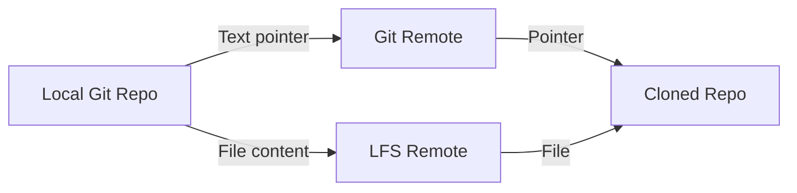

# 6.4.2 Git LFS, Submodules, and Subtrees: Managing Large Files and Dependencies

**Backlinks:** [6.4.1 - Undoing Mistakes](./6.4.1_Undoing_Mistakes_reset_revert_reflog.md)

**Next note:** [6.4.3 - Subchapter 6.4 Review](./6.4.3_Subchapter_Review.md)

---

#### Why These Tools Matter

Standard Git works well for source code but struggles with:
- **Large files** – Binaries, datasets, videos (bloat repository)
- **External dependencies** – Reusing code from other repositories
- **Vendor code** – Keeping third-party libraries in sync

This note covers solutions: Git LFS for large files, submodules for repository references, and subtrees as an alternative.

This note covers Git LFS, submodules, and subtrees. Note 6.4.1 covered undoing mistakes; note 6.4.3 is the subchapter review.

**Backward references:** Git objects from 6.1.1 (LFS replaces blobs with pointers); remotes from 6.2.2 (submodules are separate repositories).

---

## Part 1: Git LFS (Large File Storage)

### What is Git LFS?

Git LFS replaces large files with text pointers in Git, storing the actual file content on a remote server.

```
Standard Git: Full file in repository → Repository bloat
Git LFS: Text pointer in repository → Actual file on LFS server
```

### Installing Git LFS

```bash
# Ubuntu/Debian
curl -s https://packagecloud.io/install/repositories/github/git-lfs/script.deb.sh | sudo bash
sudo apt install git-lfs

# macOS
brew install git-lfs

# Windows (download installer from git-lfs.github.com)

# Initialize LFS (once per user)
git lfs install

# Verify
git lfs version
```

### Tracking Large Files

```bash
# Track file types
git lfs track "*.psd"
git lfs track "*.zip"
git lfs track "*.tar.gz"
git lfs track "models/*.bin"

# Track specific file
git lfs track "assets/logo.png"

# View tracked patterns
git lfs track
# Listing tracked patterns
# *.psd (.gitattributes)
# *.zip (.gitattributes)

# .gitattributes is created automatically
cat .gitattributes
# *.psd filter=lfs diff=lfs merge=lfs -text
```

### Using Git LFS

```bash
# Normal Git workflow (LFS handles automatically)
git add large-file.zip
git commit -m "Add large file"
git push origin main

# Clone with LFS files
git clone https://github.com/user/repo.git
# LFS files download automatically

# Pull LFS files manually (if skipped)
git lfs pull

# Check LFS files in repository
git lfs ls-files
# a1b2c3d4e5 * large-file.zip
```

### Git LFS Commands

| Command | Purpose |
|---------|---------|
| `git lfs track "*.ext"` | Track file pattern |
| `git lfs untrack "*.ext"` | Stop tracking |
| `git lfs ls-files` | List LFS files |
| `git lfs status` | Show LFS files changed |
| `git lfs pull` | Download LFS files |
| `git lfs push --all` | Push all LFS files |
| `git lfs migrate` | Convert existing files to LFS |
| `git lfs env` | Show LFS environment |

### Migrating Existing Repository to LFS

```bash
# Convert existing large files to LFS
git lfs migrate import --include="*.psd,*.zip" --everything

# Migrate specific branch
git lfs migrate import --include="*.bin" --branch=main

# Verify migration
git lfs ls-files
```

### Git LFS Architecture



### LFS File Pointer Example

```
version https://git-lfs.github.com/spec/v1
oid sha256:a1b2c3d4e5f67890...
size 12345678
```

### Git LFS Configuration

```bash
# Set LFS endpoint (if using custom server)
git config lfs.url https://lfs.example.com/repo.git

# Set concurrent transfers
git config lfs.concurrenttransfers 32

# Set batch size
git config lfs.batch true

# Skip LFS during clone (download later)
git lfs install --skip-smudge
git clone ...
git lfs pull
```

---

## Part 2: Git Submodules – Repositories Within Repositories

### What are Submodules?

Submodules allow you to include another Git repository as a subdirectory of your repository.

```bash
# Add a submodule
git submodule add https://github.com/user/library.git libs/library

# .gitmodules file is created
cat .gitmodules
# [submodule "libs/library"]
#   path = libs/library
#   url = https://github.com/user/library.git
```

### Submodule Commands

| Command | Purpose |
|---------|---------|
| `git submodule add <url> <path>` | Add submodule |
| `git submodule init` | Initialize submodules |
| `git submodule update` | Fetch and checkout submodule commits |
| `git clone --recursive <url>` | Clone with submodules |
| `git submodule update --remote` | Update to latest remote commit |
| `git submodule foreach <cmd>` | Run command in each submodule |
| `git submodule sync` | Update submodule URLs |

### Basic Submodule Workflow

```bash
# Clone repository with submodules
git clone https://github.com/user/main-repo.git
cd main-repo
git submodule init
git submodule update
# Or clone with recursive flag
git clone --recursive https://github.com/user/main-repo.git

# Update submodule to latest commit
cd libs/library
git checkout main
git pull origin main
cd ..
git add libs/library
git commit -m "Update library submodule"

# Update all submodules to latest
git submodule update --remote --merge
```

### Submodule State

```bash
# Check submodule status
git submodule status
# a1b2c3d4e5f6g7h8i9j0k1l2m3n4o5p6q7r8s9t0 library (heads/main)

# Show submodule differences
git diff --submodule
```

### Updating Submodules

```bash
# Update to specific commit
cd libs/library
git checkout a1b2c3d
cd ..
git add libs/library
git commit -m "Pin library to a1b2c3d"

# Update to latest from remote
git submodule update --remote libs/library
git add libs/library
git commit -m "Update library to latest"
```

### Removing Submodules

```bash
# Remove submodule (multiple steps)
git submodule deinit libs/library
git rm libs/library
rm -rf .git/modules/libs/library
git commit -m "Remove library submodule"
```

### Submodule Pitfalls

| Issue | Solution |
|-------|----------|
| Detached HEAD in submodule | Always commit submodule changes in its own repo |
| Forgetting to push submodule changes | Push submodule first, then main repo |
| Outdated submodule after clone | `git submodule update --remote` |
| Nested submodules | Use `--recursive` flags |

---

## Part 3: Git Subtree – Alternative to Submodules

Git subtree merges a subproject into your repository as a subdirectory, without the complexity of submodules.

### Subtree Commands

```bash
# Add a subtree
git subtree add --prefix=libs/library https://github.com/user/library.git main --squash

# Pull changes from subtree remote
git subtree pull --prefix=libs/library https://github.com/user/library.git main --squash

# Push changes back to subtree remote
git subtree push --prefix=libs/library https://github.com/user/library.git main

# Split subtree into separate branch (for pushing)
git subtree split --prefix=libs/library --branch library-only
```

### Subtree vs Submodule Comparison

| Aspect | Submodule | Subtree |
|--------|-----------|---------|
| **Repository independence** | Separate repo (pointer) | Merged into main repo |
| **Clone complexity** | Need `--recursive` | Simple clone |
| **Commit history** | Separate | Combined (can be squashed) |
| **Contributor friction** | High (need to manage submodules) | Low (everything in one repo) |
| **Disk usage** | Lower (shared objects) | Higher (duplicated content) |
| **Use case** | Many dependencies, frequent updates | Simple dependency, occasional updates |

### Subtree Workflow Example

```bash
# Add external library as subtree
git subtree add --prefix=vendor/jquery https://github.com/jquery/jquery.git main --squash

# Update library
git subtree pull --prefix=vendor/jquery https://github.com/jquery/jquery.git main --squash

# Make local changes (if needed)
cd vendor/jquery
# ... edit files ...
cd ../..
git add vendor/jquery
git commit -m "Customize jquery"

# Push changes back (if you have write access)
git subtree push --prefix=vendor/jquery https://github.com/your-fork/jquery.git main
```

---

## Part 4: Sparse Checkout — Work with Part of a Monorepo

`git sparse-checkout` (Git 2.25+) lets you check out only specific directories from a repository, keeping the rest as metadata only. This is the modern solution for working with monorepos — you get the full Git history but only the files you need on disk.

### Why Sparse Checkout?

In a monorepo with 50 services, most developers only work on 1–2 services. Without sparse checkout, every developer downloads and checks out **all** files — wasting disk, slowing IDE indexing, and cluttering search results.

```bash
# Enable sparse checkout on an existing clone
git sparse-checkout init --cone

# Check out only specific directories
git sparse-checkout set services/auth services/api shared/utils

# Your working directory now contains ONLY:
# /services/auth/      ← full checkout
# /services/api/       ← full checkout
# /shared/utils/       ← full checkout
# (everything else exists in .git but NOT on disk)

# Add another directory later
git sparse-checkout add services/billing

# List current sparse-checkout patterns
git sparse-checkout list
# services/auth
# services/api
# services/billing
# shared/utils

# Disable sparse checkout (check out everything again)
git sparse-checkout disable
```

### Sparse Checkout with Clone (Most Efficient)

```bash
# Clone without checking out any files + sparse mode
git clone --no-checkout --filter=blob:none https://github.com/company/monorepo.git
cd monorepo

# Enable sparse-checkout
git sparse-checkout init --cone

# Select only what you need
git sparse-checkout set services/auth shared/lib

# Now checkout (downloads only selected blobs)
git checkout main
```

**The `--filter=blob:none` flag** enables **partial clone** — Git downloads tree objects (directory structure) but fetches file blobs only on demand. Combined with sparse checkout, this means:
- Initial clone: seconds instead of minutes
- Disk usage: MBs instead of GBs
- Git operations (log, blame, diff) still work on the full history

### Cone Mode vs Non-Cone Mode

| Mode | Pattern Style | Performance | Recommended |
|------|--------------|-------------|-------------|
| **Cone** (`--cone`) | Directory-based (`services/auth`) | Fast (optimized) | ✅ Yes |
| **Non-cone** | Gitignore-style (`*.proto`) | Slower | Only for file-pattern filtering |

```bash
# Cone mode (recommended) — directories only
git sparse-checkout init --cone
git sparse-checkout set services/auth docs/

# Non-cone mode — gitignore-style patterns
git sparse-checkout init --no-cone
git sparse-checkout set '/*.md' 'services/auth/**' '!services/auth/tests/**'
```

### Sparse Checkout vs Submodules vs Subtrees

| Aspect | Sparse Checkout | Submodules | Subtrees |
|--------|----------------|------------|----------|
| **Repository** | Single repo | Multiple repos | Single repo |
| **History** | Unified | Separate per module | Unified |
| **Checkout scope** | Selected directories | Full submodule | Full subtree |
| **Best for** | Monorepos | Independent libraries | Vendored code |
| **CI/CD** | Partial clone = fast CI | Must init submodules | Transparent |
| **Learning curve** | Low | High | Moderate |

---

## Part 5: Choosing the Right Tool

### Decision Matrix

| Scenario | Recommended Tool | Why |
|----------|------------------|-----|
| **Binary assets (images, videos)** | Git LFS | Keeps repo small, stores binaries externally |
| **Shared library used by many projects** | Submodule | Centralized updates, independent versioning |
| **Simple dependency, occasional updates** | Subtree | Easy for contributors, no extra commands |
| **Vendor code that you modify** | Subtree or copy directly | Modified code is part of your repo |
| **CI/CD artifacts** | Git LFS | Large build outputs |
| **Third-party SDK** | Submodule | Track exact version |
| **Monorepo with many services** | Sparse Checkout | Only check out directories you work on |
| **Fast CI builds for monorepo** | Sparse Checkout + Partial Clone | Download only needed files, fast pipeline |

### Practical Examples

**Example 1: Game development (large assets)**
```bash
# Use Git LFS for assets
git lfs track "*.psd"
git lfs track "*.fbx"
git lfs track "*.wav"
```

**Example 2: Microservices with shared library**
```bash
# Use submodule for shared library
git submodule add https://github.com/company/common-lib.git libs/common
```

**Example 3: Documentation site with theme**
```bash
# Use subtree for theme (squash to avoid clutter)
git subtree add --prefix=themes/docs https://github.com/theme/docs-theme.git main --squash
```

---

## Quick Task: Git LFS Practice

*Practice using Git LFS to handle a large file.*

1. Install Git LFS.
2. Initialize LFS in a repository.
3. Track `.bin` files.
4. Create a large file (e.g., 10MB) and commit it.
5. Verify it's stored as an LFS object.

> **Ready Solution:**
>
> ```bash
> # Task 1
> # Install git-lfs from https://git-lfs.com
>
> # Task 2
> mkdir lfs-practice && cd lfs-practice
> git init
> git lfs install
>
> # Task 3
> git lfs track "*.bin"
> git add .gitattributes
> git commit -m "Track .bin files with LFS"
>
> # Task 4
> dd if=/dev/zero of=large.bin bs=1M count=10
> git add large.bin
> git commit -m "Add large binary file"
>
> # Task 5
> git lfs ls-files
> # Should show large.bin
>
> # Check that .gitattributes was created
> cat .gitattributes
> # *.bin filter=lfs diff=lfs merge=lfs -text
> ```

---

## Summary Table: Git LFS, Submodules, Subtrees

### Git LFS Commands

| Command | Purpose |
|---------|---------|
| `git lfs install` | Initialize LFS |
| `git lfs track "*.ext"` | Track file pattern |
| `git lfs untrack "*.ext"` | Stop tracking |
| `git lfs ls-files` | List LFS files |
| `git lfs status` | Show LFS changes |
| `git lfs pull` | Download LFS files |
| `git lfs migrate import` | Convert to LFS |

### Submodule Commands

| Command | Purpose |
|---------|---------|
| `git submodule add <url> <path>` | Add submodule |
| `git submodule init` | Initialize |
| `git submodule update` | Update submodules |
| `git clone --recursive` | Clone with submodules |
| `git submodule update --remote` | Update to latest |
| `git submodule foreach <cmd>` | Run command in each |

### Subtree Commands

| Command | Purpose |
|---------|---------|
| `git subtree add --prefix=<path> <url> <branch>` | Add subtree |
| `git subtree pull --prefix=<path> <url> <branch>` | Update |
| `git subtree push --prefix=<path> <url> <branch>` | Push changes |
| `git subtree split --prefix=<path> --branch=<name>` | Extract subtree |

### Tool Selection Guide

| Requirement | Tool |
|-------------|------|
| Large binary files | Git LFS |
| Shared library, independent updates | Submodule |
| Simple dependency, occasional updates | Subtree |
| Vendor code you modify | Subtree or copy |
| CI/CD artifacts | Git LFS |

---

**Next note (6.4.3)** is the Subchapter 6.4 Review for Undoing Mistakes, Git LFS, Submodules, and Subtrees. The **Final Exam for Module 6** and complete Git cheatsheet are in **6.4.4**.

**Backward references:**
- Git objects from 6.1.1 (LFS replaces blobs)
- Remotes from 6.2.2 (submodules have their own remotes)
- Cloning from 6.1.2 (submodules require recursive clone)
