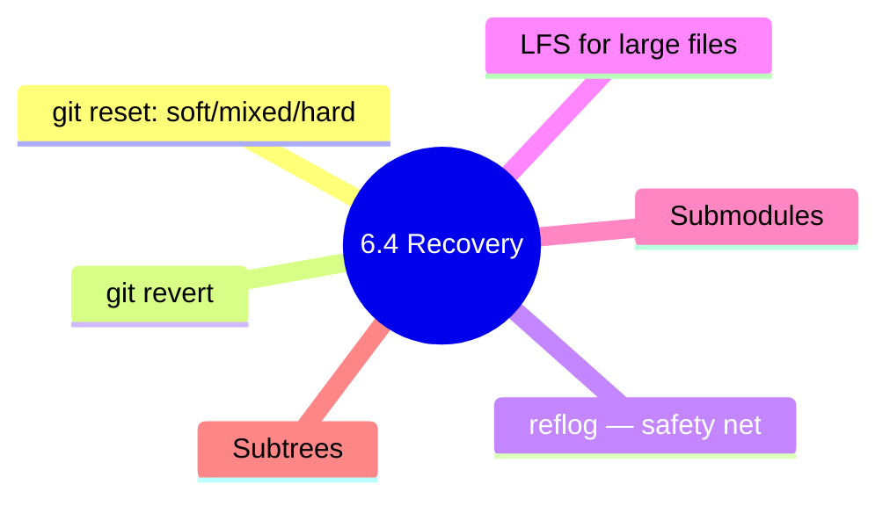

# 6.4.3 Subchapter 6.4 Review: Undoing, LFS, Submodules, and Subtrees

**Backlinks:** [6.4.1 - Undoing Mistakes](./6.4.1_Undoing_Mistakes_reset_revert_reflog.md) | [6.4.2 - Git LFS, Submodules, Subtrees](./6.4.2_Git_LFS_Submodules_and_Subtrees.md)

**Next:** [6.4.4 - Complete Git Cheatsheet and Module 6 Final Exam](./6.4.4_Git_Cheatsheet_and_Final_Exam.md)



---

This review covers only the material presented in Notes 6.4.1 (Undoing Mistakes: reset, revert, reflog) and 6.4.2 (Git LFS, Submodules, and Subtrees). The comprehensive **Module 6 Final Exam** (covering every subchapter) lives in **6.4.4**.

---

## Cheatsheet: Undoing Mistakes, Git LFS, Submodules

### Undo Commands

| Operation | Command | Safety |
|-----------|---------|--------|
| Discard working changes | `git restore <file>` | Safe |
| Unstage file | `git restore --staged <file>` | Safe |
| Undo commit (keep staged) | `git reset --soft HEAD~1` | Safe (local) |
| Undo commit (unstage) | `git reset HEAD~1` | Safe (local) |
| Discard commits and changes | `git reset --hard HEAD~1` | Dangerous |
| Safe undo (shared branch) | `git revert HEAD` | Safe |
| Recover lost commits | `git reflog` | Safe |
| Clean untracked files | `git clean -fd` | Dangerous (unrecoverable) |
| Interactive clean | `git clean -i` | Safer |

### Reset Modes

| Mode | Working Dir | Staging | HEAD | Command |
|------|-------------|---------|------|---------|
| `--soft` | Unchanged | Unchanged | Moved | `git reset --soft HEAD~1` |
| `--mixed` (default) | Unchanged | Reset | Moved | `git reset HEAD~1` |
| `--hard` | Reset | Reset | Moved | `git reset --hard HEAD~1` |

### Reflog Commands

| Command | Purpose |
|---------|---------|
| `git reflog` | Show HEAD history |
| `git reflog show <branch>` | Show branch history |
| `git reset --hard HEAD@{2}` | Reset to 2 moves ago |
| `git reflog expire --expire=now --all` | Expire all entries |

### Git LFS Commands

| Command | Purpose |
|---------|---------|
| `git lfs install` | Initialize LFS in repo/system |
| `git lfs track "*.ext"` | Track file pattern (updates `.gitattributes`) |
| `git lfs ls-files` | List LFS-tracked files |
| `git lfs pull` | Download LFS objects |
| `git lfs migrate import --include="*.psd"` | Convert existing files to LFS |
| `git lfs fetch --all` | Fetch all LFS objects |

### Submodule Commands

| Command | Purpose |
|---------|---------|
| `git submodule add <url> <path>` | Add submodule |
| `git submodule init` | Initialize `.gitmodules` config |
| `git submodule update` | Check out pinned submodule commit |
| `git submodule update --remote` | Update to latest remote commit |
| `git clone --recursive <url>` | Clone with submodules |
| `git submodule deinit <path>` | Remove submodule |

### Subtree Commands

| Command | Purpose |
|---------|---------|
| `git subtree add --prefix=<path> <url> <branch>` | Add subtree |
| `git subtree pull --prefix=<path> <url> <branch>` | Update from upstream |
| `git subtree push --prefix=<path> <url> <branch>` | Push subtree changes back |
| `git subtree split --prefix=<path> -b <branch>` | Extract subtree into branch |

### Tool Selection Guide

| Requirement | Tool |
|-------------|------|
| Large binary files (media, models) | **Git LFS** |
| Shared library with independent release cadence | **Submodule** |
| Dependency you occasionally modify inline | **Subtree** |
| Vendor code rewritten to fit your project | **Subtree** (or vendor copy) |
| Mono-repo with internal packages | Neither — use a single repo + tooling |

---

## Comparison Tables

### reset vs revert vs restore

| Command | Scope | Rewrites History? | Safe on Shared Branch? |
|---------|-------|-------------------|------------------------|
| `git restore` | Working dir / index | No | Yes |
| `git reset` | Branch pointer + (optional) index/worktree | Yes | No |
| `git revert` | Creates new inverse commit | No | **Yes** |

### Submodule vs Subtree

| Aspect | Submodule | Subtree |
|--------|-----------|---------|
| Storage | Pointer (SHA only) | Full code in parent repo |
| Clone | Requires `--recursive` | Works transparently |
| History | Separate | Merged into parent |
| Update workflow | `submodule update` | `subtree pull` |
| Best for | Independent, shared libraries | Vendored dependencies |
| Learning curve | Steep | Moderate |

### Git LFS vs Regular Git

| Aspect | Regular Git | Git LFS |
|--------|------------|---------|
| Storage | Full blob per version | Pointer file + blob on LFS server |
| Repo size | Grows with every binary change | Stays small |
| Bandwidth | High for binaries | Fetches LFS blobs on demand |
| Server support | Every Git host | Must support LFS protocol |
| Cost | Free | Often paid beyond quota |

---

## Interview Questions (Scenario-Based)

These questions assume only knowledge from Subchapter 6.4 (Notes 6.4.1 and 6.4.2).

### Question 1

**Scenario:** A developer ran `git reset --hard HEAD~5` to discard 5 commits, then immediately realized one of the discarded commits contained critical work. They have not pushed or run `git gc`.

**Question:** How do they recover the lost commit? How long do they have?

**Answer:**

**Use `git reflog` to find the lost commit:**

```bash
# View reflog — records every HEAD movement
git reflog
# a1b2c3d HEAD@{0}: reset: moving to HEAD~5
# e4f5g6h HEAD@{1}: commit: Critical feature
# i7j8k9l HEAD@{2}: commit: WIP
# ...

# Option A: Create a recovery branch pointing at the lost commit
git branch recovered e4f5g6h

# Option B: Cherry-pick the lost commit onto current branch
git cherry-pick e4f5g6h

# Option C: Hard reset back to the pre-reset state (if nothing else changed)
git reset --hard HEAD@{1}
```

**Recovery window:**

| Commit type | Default expiry |
|-------------|---------------|
| Reachable commits | 90 days (`gc.reflogExpire`) |
| Unreachable commits | 30 days (`gc.reflogExpireUnreachable`) |

After expiry, `git gc` may prune them permanently. Until then, reflog is your safety net.

---

### Question 2

**Scenario:** A developer accidentally committed `secrets.env` (containing API keys) and pushed it. They want it removed from the remote, but they must not break other teammates who have pulled.

**Question:** What is the safest remediation path?

**Answer:**

**Step 1 — Rotate the secrets immediately.** Assume the keys are compromised. No Git manipulation substitutes for revoking credentials.

**Step 2 — Remove the file from current HEAD and commit forward (non-rewriting):**

```bash
git rm --cached secrets.env
echo "secrets.env" >> .gitignore
git commit -m "Remove accidentally committed secrets file"
git push origin main
```

This leaves the secret in history but stops further exposure.

**Step 3 — Only if the secret must also be purged from history** (coordinate with team):

```bash
# Preferred modern tool
git filter-repo --path secrets.env --invert-paths

# Or BFG
java -jar bfg.jar --delete-files secrets.env

# Force push — teammates MUST re-clone
git push --force-with-lease --all
git push --force-with-lease --tags
```

**Why revert alone is not enough:** `git revert` only adds a new commit that removes the file. The old blob is still reachable via history (`git show <old-sha>:secrets.env`). Only history rewriting (or rotating the secret) truly protects you.

---

### Question 3

**Scenario:** A team is building a game. Their repo has grown to 8 GB because designers commit `.psd`, `.fbx`, and `.wav` files weekly. Clones take 15 minutes.

**Question:** How do they migrate to Git LFS without breaking history?

**Answer:**

```bash
# 1. Install LFS on every contributor's machine
git lfs install

# 2. In the repo, track the offending extensions
git lfs track "*.psd"
git lfs track "*.fbx"
git lfs track "*.wav"
git add .gitattributes
git commit -m "chore: track binary assets in LFS"

# 3. Rewrite history to move existing binaries into LFS storage
git lfs migrate import \
    --include="*.psd,*.fbx,*.wav" \
    --everything

# 4. Force-push rewritten history
git push --force-with-lease --all
git push --force-with-lease --tags

# 5. Every teammate must re-clone (history rewritten)
git clone <repo-url>
```

**Trade-offs:**

| Aspect | Before LFS | After LFS |
|--------|-----------|-----------|
| `.git/` size | 8 GB | ~300 MB |
| Clone time | 15 min | ~90 s |
| Host quota | Free/cheap | May incur LFS storage/bandwidth fees |
| Disconnected work | Full history locally | Needs LFS server for old revisions |

---

### Question 4

**Scenario:** A backend project uses a shared library as a Git submodule at `libs/core`. A developer updates `libs/core` to a new version and needs to ship that update.

**Question:** What exact sequence of commands is needed, and in what order should pushes occur?

**Answer:**

```bash
# 1. Enter the submodule
cd libs/core

# 2. Check out the new version
git fetch origin
git checkout v2.0.0   # or: git pull origin main

# 3. Push the submodule changes (if the submodule had local commits)
git push origin v2.0.0    # OR: git push origin main

# 4. Return to parent repo
cd ../..

# 5. Stage and commit the pointer bump
git add libs/core
git commit -m "chore(libs): bump core to v2.0.0"

# 6. Finally push the parent
git push origin main
```

**Push order rule:** **Submodule first, parent second.** If you push the parent first, collaborators who pull will get a pointer to a commit that doesn't yet exist in the submodule's remote — their `git submodule update` will fail.

**For collaborators pulling the update:**

```bash
git pull
git submodule update --init --recursive   # pulls the new submodule SHA
```

---

### Question 5

**Scenario:** A developer used `git reset --hard` to clean their working directory, but they had a valuable untracked file (`notes.txt`) that was never staged.

**Question:** Can they recover `notes.txt`? Why or why not?

**Answer:**

**No — untracked files are unrecoverable through Git.**

- `git reset --hard` only resets files that Git tracks (indexed or committed).
- `notes.txt` was **never added to the index**, so Git never created a blob for it.
- The reflog tracks commits, not untracked files.

**Lessons:**

| Rule | Command |
|------|---------|
| Stage early, even for WIP | `git add -N notes.txt` (marks as intent-to-add) |
| Stash before dangerous ops | `git stash -u` (`-u` includes untracked) |
| Use `git clean -i` over `-f` | Interactive preview before deletion |
| Editor backups | Some editors keep `.swp`/autosave — check them |

**This is the #1 reason to prefer `git clean -i`** (interactive) over `git clean -f` (force). The interactive mode lists every file it will delete and asks for confirmation per pattern.

---

## Topics Covered in This Subchapter (Self-Check)

| Topic | Found in Note |
|-------|---------------|
| `git restore` (working dir + staged) | 6.4.1 |
| `git reset` modes (`--soft`, `--mixed`, `--hard`) | 6.4.1 |
| `git revert` (safe undo for shared branches) | 6.4.1 |
| `git reflog` and recovery | 6.4.1 |
| `git clean -f / -fd / -i` | 6.4.1 |
| When to use reset vs revert | 6.4.1 |
| Git LFS installation and tracking | 6.4.2 |
| `git lfs migrate import` for existing repos | 6.4.2 |
| `.gitattributes` role in LFS | 6.4.2 |
| Submodule add / init / update | 6.4.2 |
| `git clone --recursive` | 6.4.2 |
| Submodule push order (submodule first, parent second) | 6.4.2 |
| Subtree add / pull / push | 6.4.2 |
| Submodule vs Subtree trade-offs | 6.4.2 |

## Bridge Concepts (Not in Notes but Added for Clarity)

| Concept | Explanation |
|---------|-------------|
| `git filter-repo` | Modern replacement for `filter-branch`. Used to purge secrets/large files from history. |
| `BFG Repo-Cleaner` | Java tool for deleting files or stripping passwords across all history in one pass. |
| `gc.reflogExpire` | Config controlling how long reflog entries survive. Default 90 days (reachable) / 30 days (unreachable). |
| `git add -N` | "Intent to add" — gets a path tracked before you stage any content. |

---

## Subchapter 6.4 Completion Checklist

| Skill | Task | ☐ |
|-------|------|---|
| **Restore** | Discard unstaged changes with `git restore` | ☐ |
| **Restore** | Unstage with `git restore --staged` | ☐ |
| **Reset** | Explain `--soft` / `--mixed` / `--hard` differences | ☐ |
| **Reset** | Undo last N commits locally | ☐ |
| **Revert** | Safely undo pushed commits | ☐ |
| **Reflog** | Recover commits lost by `reset --hard` | ☐ |
| **Clean** | Use `git clean -i` to safely remove untracked files | ☐ |
| **LFS** | Initialize LFS and track patterns | ☐ |
| **LFS** | Migrate an existing repo's binaries to LFS | ☐ |
| **Submodule** | Add, init, update, clone `--recursive` | ☐ |
| **Submodule** | Correct push order (submodule → parent) | ☐ |
| **Subtree** | Add, pull, push subtree; compare to submodule | ☐ |

---

**End of Subchapter 6.4 Review**

**Next:** [6.4.4 - Complete Git Cheatsheet and Module 6 Final Exam](./6.4.4_Git_Cheatsheet_and_Final_Exam.md) — a comprehensive Module 6 cheatsheet covering all four subchapters plus scenario-based exam questions spanning the entire Git lifecycle.
