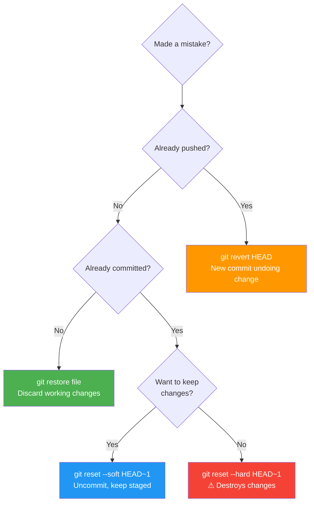

# 6.4.4 Complete Git Cheatsheet and Module 6 Final Exam

**Backlinks:** [6.4.1 - Undoing Mistakes](./6.4.1_Undoing_Mistakes_reset_revert_reflog.md) | [6.4.2 - Git LFS, Submodules, Subtrees](./6.4.2_Git_LFS_Submodules_and_Subtrees.md) | [6.4.3 - Subchapter 6.4 Review](./6.4.3_Subchapter_Review.md) | [6.2.3 - Tags, Signing, Versioning](../Subchapter_6.2/6.2.3_Tags_Signing_and_Versioning.md) | [6.3.3 - Git Hooks](../Subchapter_6.3/6.3.3_Git_Hooks.md)

**Next:** End of Module 6 — proceed to **Module 7 (Nginx and Web Servers)**

This note is the complete **Module 6 Git cheatsheet** covering all commands and concepts from Subchapters 6.1–6.4, followed by the **Final Exam** with scenario-based questions.

---

### Git Undo Decision Tree



## Part 1: Complete Git Command Cheatsheet

---

### 1.1 Setup and Config

```bash
git config --global user.name "Alice"
git config --global user.email "alice@example.com"
git config --global core.editor vim
git config --global init.defaultBranch main
git config --global pull.rebase true            # default pull = rebase
git config --global core.hooksPath .githooks    # shared hooks directory
git config --global commit.gpgsign true         # auto-sign commits
git config --global alias.lg "log --oneline --graph --all --decorate"
git config --list --show-origin                 # all config + source files

# Config levels (ascending priority)
# /etc/gitconfig          → --system
# ~/.gitconfig            → --global
# .git/config             → --local (default)
```

### 1.2 Repository Initialization and Cloning

```bash
git init                                        # New repo in current dir
git init myproject                              # New repo in named dir
git init --bare myrepo.git                      # Bare repo (server-side)

git clone https://github.com/user/repo.git
git clone git@github.com:user/repo.git          # SSH clone
git clone --depth 1 https://...                 # Shallow clone (latest only)
git clone -b develop https://...                # Clone specific branch
git clone --recursive https://...              # Include submodules
git clone --single-branch https://...          # Only default branch
```

### 1.3 Staging and Committing

```bash
git status                                      # Working tree status
git status -s                                   # Short format

git add file.txt                                # Stage specific file
git add .                                       # Stage all in current dir
git add -A                                      # Stage all (adds + deletions)
git add -p                                      # Interactive staging (patch mode)
git add -u                                      # Stage modified/deleted only

git commit -m "message"
git commit -am "message"                        # Stage tracked + commit
git commit --amend -m "new message"             # Rewrite last commit
git commit --amend --no-edit                    # Amend without changing message
git commit -S -m "signed commit"               # GPG-signed commit

git diff                                        # Unstaged changes
git diff --staged                               # Staged changes (will be committed)
git diff HEAD                                   # All changes vs last commit
git diff main..feature                          # Between branches
git diff a1b2c3d e4f5g6h                        # Between commits
git diff --word-diff                            # Word-level diff

git show HEAD                                   # Show last commit + diff
git show a1b2c3d                                # Show specific commit
git show a1b2c3d:path/to/file.txt               # Show file at commit
git show --stat HEAD                            # Summary of changes
git show --name-only HEAD                       # Only filenames changed
```

### 1.4 Log and History

```bash
git log
git log --oneline                               # One line per commit
git log --oneline --graph --all --decorate      # Full branch graph
git log -5                                      # Last 5 commits
git log --author="Alice"                        # Filter by author
git log --grep="bugfix"                         # Filter by message
git log --since="2 weeks ago"
git log --until="yesterday"
git log -- path/to/file                         # Commits affecting file
git log -p                                      # Show patch (diff) per commit
git log --follow -- renamed-file.txt            # Follow renames
git log --merges --oneline                      # Merge commits only
git log main..feature --oneline                 # Commits in feature not in main
git log --format="%h %an %ar %s"               # Custom format
git log --show-signature                        # Show GPG signatures

git shortlog -sn                                # Summary by author
git blame file.txt                              # Who wrote each line
git blame -L 10,20 file.txt                     # Specific line range
git blame -w file.txt                           # Ignore whitespace

git reflog                                      # History of HEAD movements
git reflog main                                 # Reflog for specific branch
git reflog --date=local                         # With timestamps
```

### 1.5 Branching

```bash
git branch                                      # List local branches
git branch -v                                   # With last commit
git branch -vv                                  # With tracking info
git branch -a                                   # All (local + remote)
git branch -r                                   # Remote branches only

git branch feature-branch                       # Create branch (stay on current)
git checkout -b feature-branch                  # Create and switch (classic)
git switch -c feature-branch                    # Create and switch (modern)
git checkout main                               # Switch branch (classic)
git switch main                                 # Switch branch (modern)

git branch -d feature                           # Delete merged branch (safe)
git branch -D feature                           # Force delete
git push origin --delete feature                # Delete remote branch

git branch -m old-name new-name                 # Rename local branch
git branch -u origin/main                       # Set upstream tracking

git merge-base main feature                     # Find common ancestor
git diff main...feature                         # Changes since branch point
```

### 1.6 Merging

```bash
git merge feature                               # Merge (fast-forward if possible)
git merge --no-ff feature                       # Always create merge commit
git merge --squash feature                      # Squash all commits into one
git merge --ff-only feature                     # Only if fast-forward possible
git merge -X ours feature                       # Auto-resolve conflicts (keep ours)
git merge -X theirs feature                     # Auto-resolve conflicts (keep theirs)
git merge --abort                               # Abort in-progress merge

# After conflicts:
git status                                      # See conflicting files
git checkout --ours file.txt                    # Keep current branch version
git checkout --theirs file.txt                  # Keep incoming branch version
git mergetool                                   # Launch graphical merge tool
git add file.txt && git commit                  # Complete merge
```

### 1.7 Rebasing

```bash
git rebase main                                 # Rebase feature onto main
git rebase --continue                           # Continue after conflict fix
git rebase --skip                               # Skip current commit
git rebase --abort                              # Abort rebase entirely

git rebase -i HEAD~4                            # Interactive rebase last 4 commits
git rebase -i a1b2c3d                           # From specific commit

# Interactive rebase actions
# pick p     = use commit as-is
# reword r   = change commit message
# edit e     = stop to amend commit content
# squash s   = merge into previous commit
# fixup f    = merge into previous, discard message
# drop d     = remove commit
# exec x     = run shell command

git pull --rebase origin main                   # Pull with rebase instead of merge
git config --global pull.rebase true            # Always rebase on pull
```

### 1.8 Remote Operations

```bash
git remote -v                                   # List remotes
git remote add origin https://...              # Add remote
git remote add upstream https://...            # Add upstream (fork workflow)
git remote rename origin old-origin            # Rename remote
git remote remove upstream                     # Remove remote
git remote set-url origin git@github.com:...  # Change URL
git remote show origin                         # Show remote details
git ls-remote origin                           # List all remote refs

git fetch origin                               # Fetch all branches
git fetch --all                                # Fetch all remotes
git fetch --prune origin                       # Fetch + clean deleted branches
git fetch --tags                               # Fetch tags too

git pull                                       # Fetch + merge (or rebase if configured)
git pull origin main
git pull --rebase origin main
git pull --ff-only                             # Only fast-forward, else fail

git push origin main                           # Push branch
git push -u origin feature                     # Push and set upstream
git push --all origin                          # Push all branches
git push --tags                                # Push all tags
git push --follow-tags                         # Push + annotated tags
git push --force-with-lease origin feature     # Safer force push
git push --force origin feature                # Force push (DANGEROUS)
git push origin --delete feature               # Delete remote branch
```

### 1.9 Cherry-pick

```bash
git cherry-pick a1b2c3d                        # Apply single commit
git cherry-pick a1b2c3d e4f5g6h               # Apply multiple
git cherry-pick a1b2c3d..e4f5g6h              # Apply range
git cherry-pick -e a1b2c3d                    # Edit commit message before applying
git cherry-pick -n a1b2c3d                    # Stage only, no auto-commit
git cherry-pick --continue                    # After resolving conflicts
git cherry-pick --skip                        # Skip current commit
git cherry-pick --abort                       # Abort
```

### 1.10 Stash

```bash
git stash                                     # Save changes
git stash push -m "WIP: feature in progress" # Save with message
git stash -u                                  # Include untracked files
git stash -a                                  # Include ignored files

git stash list                                # List all stashes
git stash show                                # Show latest stash diff summary
git stash show -p stash@{1}                  # Full diff of specific stash

git stash apply                               # Apply latest (keep in list)
git stash apply stash@{2}                    # Apply specific stash
git stash pop                                 # Apply latest + remove from list
git stash pop stash@{1}                      # Pop specific stash

git stash drop                                # Remove latest stash
git stash drop stash@{2}                     # Remove specific stash
git stash clear                               # Remove ALL stashes

git stash branch new-feature stash@{0}       # Create branch from stash
```

### 1.11 Bisect

```bash
git bisect start
git bisect bad HEAD                           # Current commit has bug
git bisect good v1.0.0                        # Last known good commit
# Git checks out a middle commit — test it
git bisect good                               # Current commit is good
git bisect bad                                # Current commit has bug
# Repeat until git identifies the first bad commit
git bisect reset                              # End bisect, return to original HEAD

git bisect log                                # Show bisect history
git bisect replay logfile                     # Replay bisect session
git bisect run ./test-script.sh              # Automated bisect
# Script must exit 0 for good, non-zero for bad
```

### 1.12 Undo and Reset

```bash
# Discard working directory changes
git restore file.txt                          # Restore single file
git restore .                                 # Restore all
git checkout -- file.txt                      # Classic syntax

# Unstage files
git restore --staged file.txt                 # Unstage single file
git reset HEAD file.txt                       # Classic syntax

# Reset modes
git reset --soft HEAD~1                       # Undo commit, keep changes staged
git reset HEAD~1                              # Undo commit, unstage changes
git reset --mixed HEAD~1                      # Same as above (explicit)
git reset --hard HEAD~1                       # Undo commit AND discard changes

git reset --hard origin/main                  # Reset to match remote

# Revert (safe for shared branches)
git revert HEAD                               # Revert last commit (new commit)
git revert a1b2c3d                            # Revert specific commit
git revert -n a1b2c3d                         # Stage reversal, no auto-commit
git revert -m 1 a1b2c3d                       # Revert a merge commit (keep mainline)

# Clean untracked files
git clean -n                                  # Dry run (what would be removed)
git clean -f                                  # Remove untracked files
git clean -fd                                 # Remove untracked files + dirs
git clean -fx                                 # Remove untracked + ignored files
git clean -i                                  # Interactive clean
```

### 1.13 Tags

```bash
git tag v1.0                                  # Lightweight tag
git tag -a v1.0.0 -m "Release v1.0.0"        # Annotated tag (preferred)
git tag -s v1.0.0 -m "Signed release"        # Signed annotated tag
git tag -a v0.9 a1b2c3d -m "Tag old commit"  # Tag specific commit

git tag                                       # List all tags
git tag -l "v1.*"                             # Filter by pattern
git tag --sort=version:refname               # Sort by version
git tag --sort=-version:refname              # Reverse sort

git show v1.0.0                              # Show tag details
git verify-tag v1.0.0                        # Verify GPG signature

git push origin v1.0.0                       # Push single tag
git push origin --tags                       # Push all tags
git push origin --follow-tags               # Push annotated tags only
git push origin --delete v1.0.0             # Delete remote tag
git tag -d v1.0.0                           # Delete local tag
git fetch --tags                            # Fetch all remote tags

git describe                                # Version from nearest tag
git describe --tags --always               # Include lightweight tags + SHA fallback
git describe --exact-match                 # Fail unless exactly on a tag
git describe --abbrev=0                    # Just the tag name (no commit offset)
```

### 1.14 Git LFS

```bash
git lfs install                             # Initialize LFS (once per machine)
git lfs track "*.psd"                       # Track file type
git lfs track "models/*.bin"                # Track pattern in directory
git lfs untrack "*.psd"                     # Stop tracking

git lfs ls-files                            # List LFS-tracked files
git lfs status                              # LFS-tracked changed files
git lfs env                                 # LFS environment info
git lfs pull                                # Download LFS files
git lfs push --all origin main              # Push all LFS objects
git lfs migrate import --include="*.psd"   # Migrate existing files to LFS
```

### 1.15 Submodules

```bash
git submodule add https://... libs/library  # Add submodule
git submodule init                          # Initialize (after clone)
git submodule update                        # Fetch + checkout pinned commit
git submodule update --remote               # Update to latest remote
git submodule update --remote --merge       # Update + merge changes
git submodule foreach git pull              # Pull in all submodules
git submodule status                        # Show status of all submodules
git clone --recursive https://...          # Clone + init all submodules

git submodule deinit libs/library           # Deregister submodule
git rm libs/library                         # Remove from repo
rm -rf .git/modules/libs/library            # Remove from git modules cache
```

### 1.16 Git Internals

```bash
git cat-file -t a1b2c3d                     # Object type (blob/tree/commit/tag)
git cat-file -p a1b2c3d                     # Object contents
git cat-file -s a1b2c3d                     # Object size

git ls-tree HEAD                            # List tree at HEAD
git ls-tree -r HEAD                         # Recursive (all files)
git ls-files --stage                        # Show index contents
git ls-files --others --exclude-standard    # Untracked files

git rev-parse HEAD                          # Resolve ref to SHA
git rev-parse --abbrev-ref HEAD            # Current branch name
git rev-parse --show-toplevel              # Repo root directory

git count-objects -v                        # Repository object stats
git gc                                      # Garbage collection (pack objects)
git fsck                                    # Verify object integrity
git fsck --unreachable                      # Find unreachable objects (lost commits)
git verify-pack -v .git/objects/pack/*.idx  # Inspect packfile
```

### 1.17 Signing and Verification

```bash
git config --global user.signingkey KEY_ID  # Set GPG key
git config --global gpg.format ssh          # Use SSH for signing
git config --global commit.gpgsign true     # Auto-sign all commits
git config --global tag.gpgsign true        # Auto-sign all tags

git commit -S -m "signed commit"           # Sign single commit
git tag -s v1.0.0 -m "signed tag"         # Sign annotated tag

git verify-commit a1b2c3d                  # Verify commit signature
git verify-tag v1.0.0                      # Verify tag signature
git log --show-signature                   # Show sigs in log
git log --format="%h %G? %GS %s"          # Sig status: G=Good N=None B=Bad
```

### 1.18 Useful Git Aliases

```bash
# Add to ~/.gitconfig [alias] section:
git config --global alias.co checkout
git config --global alias.sw switch
git config --global alias.br branch
git config --global alias.st status
git config --global alias.lg "log --oneline --graph --all --decorate"
git config --global alias.last "log -1 HEAD"
git config --global alias.unstage "restore --staged"
git config --global alias.undo "reset --soft HEAD~1"
git config --global alias.aliases "config --get-regexp '^alias\.'"
git config --global alias.who "shortlog -sn"
git config --global alias.standup "log --since=yesterday --author=$(git config user.email) --oneline"

# Usage
git lg
git undo
git standup
```

---

## Part 2: Quick Reference Tables

### Reset Mode Summary

| Mode | Working Dir | Staging Area | Commit Removed | Use Case |
|------|-------------|-------------|----------------|----------|
| `--soft` | Unchanged | Unchanged | Yes | Undo commit, re-commit with more files |
| `--mixed` (default) | Unchanged | Cleared | Yes | Undo commit, split into multiple |
| `--hard` | Cleared | Cleared | Yes | Discard completely (dangerous) |

### Merge vs Rebase vs Cherry-pick

| Operation | History | SHA Change | Safe on Shared? | Use Case |
|-----------|---------|-----------|-----------------|----------|
| `merge` | Non-linear (merge commit) | No | ✅ Yes | Integrate branches |
| `rebase` | Linear (no merge commit) | Yes (new SHAs) | ❌ No | Clean local history |
| `cherry-pick` | Copies commit | Yes (new SHA) | ✅ Yes | Apply specific commits |

### Git Workflow Comparison

| Workflow | Branches | Merges | PR Required | Best For |
|----------|----------|--------|-------------|---------|
| **Git Flow** | main, develop, feature/*, release/*, hotfix/* | Many | Yes | Scheduled releases |
| **GitHub Flow** | main + short-lived features | PR merge | Yes | Continuous delivery |
| **Trunk-Based** | main (+ very short-lived) | Fast-forward | Optional | High-velocity CI/CD |

### Tag Types

| Type | Object | Metadata | Use |
|------|--------|----------|-----|
| Lightweight | Points to commit | None | Private bookmarks |
| Annotated | Full object | Name, date, message, signer | Official releases |
| Signed (annotated) | Full object + GPG | All above + signature | Supply-chain security |

### Hook Execution Order

| Phase | Hooks (in order) |
|-------|-----------------|
| **Commit** | pre-commit → prepare-commit-msg → commit-msg → post-commit |
| **Push (client)** | pre-push |
| **Push (server)** | pre-receive → update → post-receive |
| **Merge** | pre-merge-commit → post-merge |
| **Rebase** | pre-rebase → post-rewrite |
| **Checkout** | post-checkout |

### Signature Status in git log

| Status | Meaning |
|--------|---------|
| `G` | Good, valid signature |
| `B` | Bad signature |
| `U` | Unknown signer (not in trust store) |
| `X` | Good signature but expired |
| `Y` | Good signature from expired key |
| `R` | Signature made by revoked key |
| `E` | Cannot check signature |
| `N` | No signature |

---

## Part 3: Module 6 Final Exam

This exam covers **all 5 subchapters** of Module 6. Questions are scenario-based and require multi-step solutions.

---

### Question 1: Git Internals and Recovery (10 minutes)

**Scenario:** A developer runs `git reset --hard HEAD~3` to discard 3 commits, then immediately panics — they needed one of those commits. The changes were never pushed.

**Questions:**
1. What Git mechanism allows recovery, and how long does it last?
2. Write the exact commands to find and recover the lost commit.
3. How is this different from `git revert`? When would you use each?

**Answer:**

**1. Recovery mechanism:** The **reflog** — it records every movement of HEAD (branches, resets, rebases, checkout) with timestamps. Unreachable commits are retained for **30 days** by default (configurable via `gc.reflogExpireUnreachable`).

**2. Recovery commands:**
```bash
# View reflog to find commits before the reset
git reflog
# HEAD@{0}: reset: moving to HEAD~3   ← current state
# HEAD@{1}: commit: Third commit       ← this is what we need
# HEAD@{2}: commit: Second commit
# HEAD@{3}: commit: First commit       ← start of what was lost
# HEAD@{4}: commit: Older commit

# Option A: Reset back to the state before the hard reset
git reset --hard HEAD@{1}

# Option B: Create a new branch from the lost commit
git checkout -b recovered-work HEAD@{1}

# Option C: Cherry-pick only the specific commit needed
git cherry-pick HEAD@{2}
```

**3. Revert vs Reset:**

| | `git reset` | `git revert` |
|---|-------------|-------------|
| **History** | Removes commits | Adds new "undo" commit |
| **Safe after push** | No (rewrites history) | Yes (never rewrites) |
| **Recovery** | Via reflog (30 days) | Built into history |
| **Use when** | Local-only commits | Already shared/pushed |

---

### Question 2: Rebase and Collaboration (12 minutes)

**Scenario:** A team uses GitHub Flow. Developer A has been working on `feature/payment` for 3 days. While working, `main` has received 5 new commits. Developer A wants to open a PR but their branch is outdated. They also have 8 messy commits ("WIP", "Fix typo", etc.) they want to clean up before the review.

**Questions:**
1. What commands would they use to update the feature branch with latest `main`?
2. How would they clean up 8 commits into 1–2 meaningful commits?
3. After force-pushing the rebased branch, a colleague says their local copy is now broken. What happened and how do they fix it?

**Answer:**

**1. Update feature branch:**
```bash
# Fetch latest main
git fetch origin

# Rebase feature onto latest main
git checkout feature/payment
git rebase origin/main

# Resolve any conflicts during rebase
# (git add resolved files, then:)
git rebase --continue
```

**2. Clean up 8 commits with interactive rebase:**
```bash
git rebase -i origin/main
# Or if all 8 commits are on this branch:
git rebase -i HEAD~8

# In editor — example transformation:
pick a1b2c3d Add payment form UI
squash e4f5g6h WIP
squash i7j8k9l Fix typo
squash m9n0o1p More WIP
pick q1r2s3t Add payment API integration
squash u5v6w7x Fix API response handling
squash y8z9a0b Add error handling
drop b1c2d3e Debug logging

# Result: 2 clean commits:
# "Add payment form UI" (squashed WIPs)
# "Add payment API integration" (squashed fixes)
```

**3. What happened and how colleague fixes it:**

Rebase **rewrites commit SHAs** on the feature branch. The colleague's local copy still has the old SHAs. Their branch has **diverged** from the force-pushed remote branch.

```bash
# Colleague fixes by resetting their local branch to match remote
git fetch origin
git checkout feature/payment
git reset --hard origin/feature/payment

# OR if they have local changes they want to keep:
git fetch origin
git rebase origin/feature/payment
```

**Prevention:** Use `--force-with-lease` instead of `--force` and communicate with teammates before force-pushing.

---

### Question 3: Tags and Release Workflow (10 minutes)

**Scenario:** A team is releasing version 2.0.0 of their application using Git Flow. The release branch is `release/v2.0.0`. They need to:
- Merge to `main` with a proper release tag
- Tag must be GPG-signed
- Push the tag and make it visible on GitHub
- After release, a critical bug is found — patch release `2.0.1` needed

**Questions:**
1. Write the full release workflow commands.
2. How do they create a hotfix and patch release?
3. What does `git describe` output immediately after tagging, and then after 2 more commits?

**Answer:**

**1. Full release workflow:**
```bash
# Merge release branch to main
git checkout main
git merge --no-ff release/v2.0.0 -m "Release v2.0.0"

# Create signed annotated tag
git tag -s v2.0.0 -m "Release v2.0.0

Breaking changes:
- New authentication API (see MIGRATION.md)

Features:
- feat: new payment module
- feat: enhanced dashboard"

# Push main with tag
git push origin main
git push origin v2.0.0
# OR combined:
git push origin main --follow-tags

# Merge release back to develop
git checkout develop
git merge --no-ff release/v2.0.0
git push origin develop

# Delete release branch
git branch -d release/v2.0.0
git push origin --delete release/v2.0.0
```

**2. Hotfix and patch release:**
```bash
# Create hotfix from main (not develop)
git checkout main
git checkout -b hotfix/v2.0.1

# Fix the bug
echo "fix applied" >> buggy-file.js
git add buggy-file.js
git commit -m "fix: resolve null pointer in payment processor"

# Merge to main
git checkout main
git merge --no-ff hotfix/v2.0.1 -m "Hotfix v2.0.1"

# Tag patch release
git tag -s v2.0.1 -m "Hotfix v2.0.1: resolve payment processor crash"
git push origin main --follow-tags

# Also merge to develop
git checkout develop
git merge --no-ff hotfix/v2.0.1
git push origin develop

# Delete hotfix branch
git branch -d hotfix/v2.0.1
```

**3. `git describe` output:**
```bash
# Immediately after tagging v2.0.0 (on tagged commit):
git describe
# v2.0.0

# After 2 more commits:
git describe
# v2.0.0-2-ga1b2c3d
# Format: <nearest-tag>-<commits-since>-g<abbreviated-SHA>
```

---

### Question 4: Git Hooks and Team Enforcement (10 minutes)

**Scenario:** A team wants to enforce the following rules automatically:
1. No Python files with `print()` statements committed (use logging)
2. Commit messages must follow Conventional Commits format
3. Tests must pass before pushing to any branch
4. Nobody can push directly to `main` on the server

**Questions:**
1. Which hook enforces each rule? Client or server-side?
2. Write the `pre-commit` hook for rule #1.
3. How would you share these hooks with the entire team?
4. How can a developer bypass hooks in a genuine emergency?

**Answer:**

**1. Hook for each rule:**

| Rule | Hook | Side |
|------|------|------|
| No `print()` in Python files | `pre-commit` | Client |
| Conventional commit messages | `commit-msg` | Client |
| Tests pass before push | `pre-push` | Client |
| No direct push to `main` | `update` or `pre-receive` | Server |

**2. pre-commit hook for rule #1:**
```bash
#!/bin/bash
# .githooks/pre-commit

STAGED_PY=$(git diff --cached --name-only --diff-filter=ACM | grep "\.py$")

if [ -z "$STAGED_PY" ]; then
    exit 0
fi

FOUND=0
for FILE in $STAGED_PY; do
    # Check for print() calls (not in comments or strings — simplified check)
    if git show ":$FILE" | grep -nE "^\s*print\(" > /dev/null 2>&1; then
        echo "❌ $FILE contains print() — use logging.debug/info/warning/error instead"
        FOUND=1
    fi
done

if [ $FOUND -ne 0 ]; then
    exit 1
fi
exit 0
```

**3. Sharing hooks with the team:**
```bash
# Method 1: Use core.hooksPath with tracked directory
mkdir .githooks
cp .githooks/pre-commit .githooks/   # add all hooks
git add .githooks/
git commit -m "chore: add team git hooks"
# Each team member runs:
git config core.hooksPath .githooks

# Method 2: pre-commit framework (recommended)
# Commit .pre-commit-config.yaml
# Team members run:
pip install pre-commit
pre-commit install
pre-commit install --hook-type commit-msg
pre-commit install --hook-type pre-push
```

**4. Emergency bypass:**
```bash
# Skip all client-side hooks
git commit --no-verify -m "hotfix: emergency production patch"
git push --no-verify

# Note: Server-side hooks CANNOT be bypassed by the client.
# Only a server admin can disable them.
```

---

### Question 5: Submodule and LFS Strategy (10 minutes)

**Scenario:** A DevOps team has a monorepo with:
- A `shared-utils` library used by 5 projects (separate repo, frequently updated)
- ML model binary files (`.bin`, average 2GB each, updated monthly)
- 50 team members, many of which do NOT need the ML models

**Questions:**
1. How would you manage the `shared-utils` dependency? Justify your answer.
2. How would you handle the ML model files? What would `git clone` experience be?
3. How would you configure Git so team members who don't need models don't download them?
4. Write the commands to add the shared-utils dependency and update it to a newer version.

**Answer:**

**1. Shared-utils → Git Submodule:**

Submodule is the right choice because:
- It's a separate repository with its own history
- Different projects need to pin to different versions
- Independent release cycle from the main repo
- Frequent updates require controlled versioning

```bash
# Add as submodule
git submodule add https://github.com/company/shared-utils.git libs/shared-utils
git add .gitmodules libs/shared-utils
git commit -m "chore: add shared-utils as submodule"
```

**2. ML Models → Git LFS:**

Git LFS stores 2GB files outside the object database as pointers. This keeps `git clone` fast.

```bash
git lfs install
git lfs track "models/*.bin"
git add .gitattributes
git commit -m "chore: track ML models with Git LFS"

# Add models
git add models/v1-classifier.bin
git commit -m "chore: add v1 ML classifier model"
git push origin main --follow-tags
```

**3. Skip LFS download for members who don't need models:**
```bash
# Install LFS without auto-downloading
git lfs install --skip-smudge

# Clone repo (will not download LFS files automatically)
git clone https://...

# Developers who need the models run:
git lfs pull

# Or download specific files only
git lfs pull --include="models/v1-classifier.bin"
```

**4. Add and update shared-utils submodule:**
```bash
# Add submodule (first time)
git submodule add https://github.com/company/shared-utils.git libs/shared-utils
git submodule init

# Update to latest main
cd libs/shared-utils
git checkout main
git pull origin main
cd ../..
git add libs/shared-utils
git commit -m "chore: update shared-utils to latest main"

# Pin to specific version tag
cd libs/shared-utils
git checkout v2.3.0
cd ../..
git add libs/shared-utils
git commit -m "chore: pin shared-utils to v2.3.0"
git push origin main
```

---

### Question 6: Bisect to Find Regression (8 minutes)

**Scenario:** A web API started returning 500 errors sometime in the last 2 weeks (approximately 30 commits ago). The last known-good commit was tagged `v1.4.0`.

**Questions:**
1. How many test iterations will bisect require for ~30 commits?
2. Write the bisect workflow with an automated test script.
3. After finding the bad commit, how do you incorporate the fix into a hotfix branch?

**Answer:**

**1. Number of iterations:**
Binary search on 30 commits: `log₂(30) ≈ 5 iterations` (rounds up to at most **5 checks**).

**2. Automated bisect workflow:**
```bash
# Create test script
cat > test-api.sh << 'EOF'
#!/bin/bash
# Build the app
make build 2>/dev/null || exit 125  # 125 = skip this commit (can't build)

# Start server in background
./bin/api &
SERVER_PID=$!
sleep 2

# Test the endpoint
HTTP_STATUS=$(curl -s -o /dev/null -w "%{http_code}" http://localhost:8080/health)

# Cleanup
kill $SERVER_PID 2>/dev/null

# Exit 0 = good, 1 = bad, 125 = skip
if [ "$HTTP_STATUS" = "200" ]; then
    exit 0
else
    exit 1
fi
EOF
chmod +x test-api.sh

# Run bisect
git bisect start
git bisect bad HEAD              # Current commit is bad
git bisect good v1.4.0           # Last known good
git bisect run ./test-api.sh    # Automated: runs ~5 iterations

# Output:
# a1b2c3d is the first bad commit
# Author: Dev Name <dev@example.com>
# Date: ...
# commit message: refactor: update request validation middleware

git bisect reset                 # Return to original HEAD
```

**3. Create hotfix from the first bad commit:**
```bash
# Find the parent of the bad commit (last good state)
git log a1b2c3d^ -1 --oneline
# e4f5g6h Previous stable commit

# Create hotfix branch from main
git checkout main
git checkout -b hotfix/fix-api-500

# Cherry-pick the revert or write the fix manually
git revert a1b2c3d              # Revert the bad commit

# Or fix the root cause manually
# git add . && git commit -m "fix: correct request validation for empty body"

# Merge hotfix to main
git checkout main
git merge --no-ff hotfix/fix-api-500
git tag -a v1.4.1 -m "Hotfix v1.4.1: resolve API 500 error"
git push origin main --follow-tags
```

---

## Module 6 Completion Checklist

Before moving to **Module 7 — Nginx**, confirm you can do all of the following without looking things up:

| Subchapter | Skill | ☐ |
|-----------|-------|---|
| **6.1 Internals** | Explain blob/tree/commit/tag objects | ☐ |
| **6.1 Internals** | Inspect objects with `git cat-file` | ☐ |
| **6.1 Internals** | Explain HEAD and detached HEAD state | ☐ |
| **6.1 Commands** | Full daily workflow: init, add, commit, status, log, diff | ☐ |
| **6.1 Commands** | Write a `.gitignore` for a Python/Node project | ☐ |
| **6.2 Branching** | Create, switch, merge, delete branches | ☐ |
| **6.2 Branching** | Resolve a merge conflict manually | ☐ |
| **6.2 Remotes** | Fetch, pull, push, set upstream tracking | ☐ |
| **6.2 Remotes** | Explain Git Flow vs GitHub Flow vs Trunk-Based | ☐ |
| **6.2 Remotes** | Open a PR with GitHub CLI (`gh pr create`) | ☐ |
| **6.3 Rebase** | Rebase feature onto main, resolve rebase conflict | ☐ |
| **6.3 Rebase** | Interactive rebase: squash, reword, drop, reorder | ☐ |
| **6.3 Advanced** | Cherry-pick a specific commit to another branch | ☐ |
| **6.3 Advanced** | Stash, switch branches, pop stash | ☐ |
| **6.3 Advanced** | Run `git bisect` to find a regression | ☐ |
| **6.4 Undo** | Use `reset --soft/--mixed/--hard` appropriately | ☐ |
| **6.4 Undo** | Safely undo pushed commits with `git revert` | ☐ |
| **6.4 Undo** | Recover lost commits with `git reflog` | ☐ |
| **6.4 LFS** | Track large files with Git LFS, migrate existing | ☐ |
| **6.4 Submodules** | Add, init, update, and remove a submodule | ☐ |
| **6.4 Subtrees** | Add and pull a subtree | ☐ |
| **6.2.3 Tags** | Create lightweight and annotated tags | ☐ |
| **6.2.3 Tags** | Push tags to remote, delete remote tags | ☐ |
| **6.2.3 Tags** | Use `git describe` for dynamic versioning | ☐ |
| **6.2.3 Tags** | Explain Semantic Versioning (MAJOR.MINOR.PATCH) | ☐ |
| **6.2.3 Tags** | Write a Conventional Commit message | ☐ |
| **6.2.3 Signing** | Configure GPG or SSH signing | ☐ |
| **6.2.3 Signing** | Create a signed tag, verify with `git verify-tag` | ☐ |
| **6.3.3 Hooks** | Write a `pre-commit` hook that blocks debug code | ☐ |
| **6.3.3 Hooks** | Write a `commit-msg` hook for Conventional Commits | ☐ |
| **6.3.3 Hooks** | Set up `pre-commit` framework with team config | ☐ |
| **6.3.3 Hooks** | Explain client-side vs server-side hook differences | ☐ |

---

**End of Module 6 — Git**

**Next:** Proceed to **Module 7 — Nginx** (architecture, static serving, reverse proxy, load balancing, SSL termination, caching, rate limiting).

Congratulations on completing Module 6! You now have deep mastery of Git — from its object model internals to advanced workflows, release management with tags and signing, and automated enforcement via hooks. These skills are foundational for every DevOps/Platform Engineering role.
