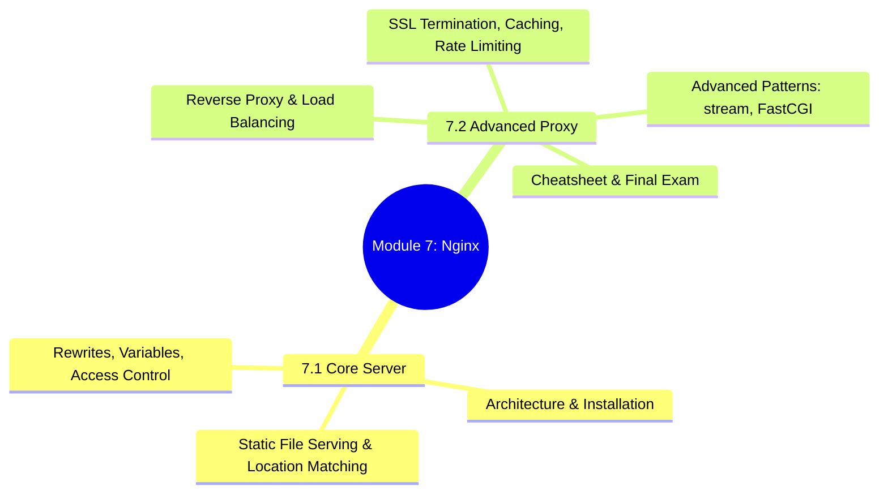
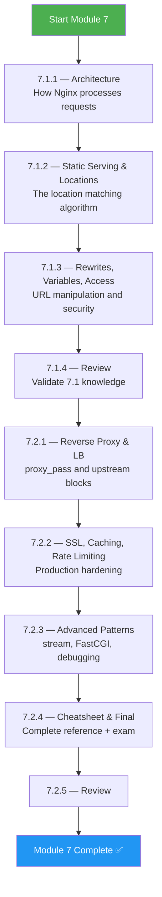
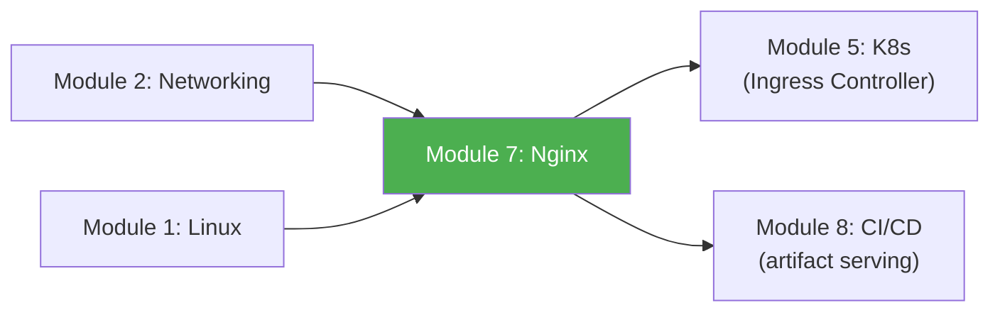

# Module 7 Approach Guide — Nginx Web Server

## Module Overview

---

## Who Is This Module For?

Nginx is the **most deployed web server and reverse proxy** in the world. It's the Kubernetes ingress controller, the CI/CD artifact server, the SSL terminator, the API gateway, and the static file server — often all in the same config file.

**Target audience:**
- Platform engineers configuring Nginx as a reverse proxy or load balancer
- DevOps engineers managing Kubernetes Ingress (which IS Nginx under the hood)
- Anyone who needs to understand SSL termination, caching, and rate limiting

---

## Prerequisites

| Prerequisite | Required? | Notes |
|---|---|---|
| Module 1 (Linux) completed | **Yes** | Nginx is a Linux service; you'll use systemctl, file permissions, log files |
| Module 2 (Networking) completed | **Yes** | HTTP, HTTPS, TLS, L4/L7 load balancing — all covered in Module 2 |
| Module 4 (Docker) recommended | Helpful | Many examples use Nginx in Docker containers |
| Module 5 (Kubernetes) recommended | Helpful | Nginx Ingress Controller connections |

---

## How to Approach This Module

### Study Strategy

1. **Install Nginx and configure it yourself** — Don't just read configs; write them, test them, break them.
2. **Master the location matching algorithm** — It's the #1 source of Nginx bugs. Draw the priority flowchart.
3. **Use `nginx -T` constantly** — It dumps the full resolved config. Verify what Nginx actually sees.
4. **Test with `curl -v`** — See headers, redirects, SSL info. Combine with `tcpdump` from Module 2.
5. **Read the error log first** — `tail -f /var/log/nginx/error.log` should be your default debugging step.

---

## Time Estimates

| Subchapter | Reading | Practice | Total |
|---|---|---|---|
| 7.1 Core Server | 3 hrs | 3 hrs | **6 hrs** |
| 7.2 Advanced Proxy | 3.5 hrs | 4 hrs | **7.5 hrs** |
| **Total** | **6.5 hrs** | **7 hrs** | **~13.5 hrs** |

> **Realistic timeline:** 1 week at 2 hours/day.

---

## Practice Lab Ideas

| Lab | Covers | Difficulty |
|---|---|---|
| Serve a static site with proper MIME types, gzip, and cache headers | 7.1 | ⭐⭐ |
| Configure location blocks: exact, prefix, regex — verify matching order with curl | 7.1 | ⭐⭐⭐ |
| Set up Nginx as a reverse proxy to 3 backend containers with round-robin | 7.2 | ⭐⭐⭐ |
| Configure Let's Encrypt SSL with auto-renewal, A+ SSL Labs score | 7.2 | ⭐⭐⭐ |
| Build a rate limiter that allows 10 req/s per IP with burst of 20 | 7.2 | ⭐⭐⭐ |
| Configure Nginx as a TCP load balancer for PostgreSQL using `stream` block | 7.2 | ⭐⭐⭐⭐ |

---

## What Success Looks Like

By the end of Module 7, you should be able to:

- [ ] Explain Nginx's event-driven architecture and worker process model
- [ ] Write location blocks and predict exactly which one matches a given URI
- [ ] Configure reverse proxying with proper header forwarding (`X-Forwarded-For`, etc.)
- [ ] Set up SSL/TLS termination with modern cipher suites
- [ ] Implement caching, rate limiting, and access control
- [ ] Debug Nginx issues using error logs, `nginx -T`, and `curl -v`
- [ ] Use the `stream` block for TCP/UDP proxying

---

## Connection to Other Modules

**Nginx IS the Kubernetes Ingress Controller** in most clusters. The `nginx.conf` you learn here is the same config that `ingress-nginx` generates from Ingress resources. SSL termination, rate limiting, and reverse proxying — these concepts carry directly into Module 5.

> **Next module:** [Module 8 — CI/CD](../8-CICD/Module_8_Approach_Guide.md)
