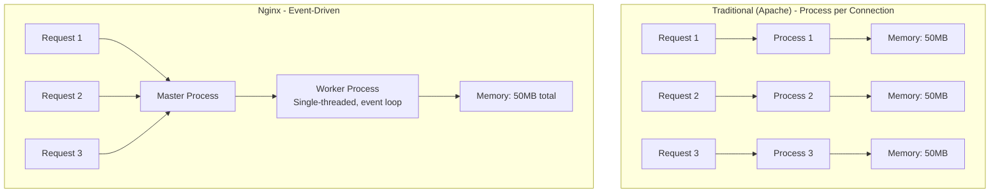
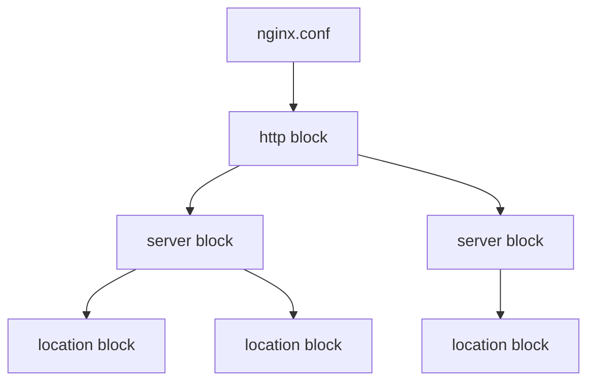

### 7.1.1 Nginx Architecture and Installation: The High-Performance Web Server

#### Why Nginx Matters

Nginx (pronounced "engine-x") powers over 30% of websites worldwide. It excels at:
- **Static file serving** – Efficiently serves HTML, CSS, JS, images
- **Reverse proxy** – Forwards requests to backend applications (Node.js, Python, Java)
- **Load balancer** – Distributes traffic across multiple servers
- **SSL termination** – Handles HTTPS encryption/decryption
- **Rate limiting** – Protects against DDoS and abuse

This note covers Nginx architecture and installation. Note 7.1.2 covers static file serving; note 7.1.3 is the subchapter review.

**Backward references:** Linux process management from Module 1 (master-worker model); networking from Module 2 (ports, TCP); package management from Module 1 (installation with apt/dnf).

---

## Part 1: Nginx Architecture – Why It's Fast

### Traditional vs Event-Driven Architecture



### Nginx Process Model

| Component | Role | Count |
|-----------|------|-------|
| **Master Process** | Reads config, binds ports, manages workers | 1 |
| **Worker Process** | Handles actual requests (event-driven) | Configurable (usually CPU cores) |
| **Cache Loader** | Loads disk cache into memory | 1 |
| **Cache Manager** | Manages cache expiration | 1 |

```bash
# View Nginx processes
ps aux | grep nginx
# root     12345  0.0  0.1  nginx: master process
# www-data 12346  0.0  0.2  nginx: worker process
# www-data 12347  0.0  0.2  nginx: worker process
```

### Why Event-Driven Is Faster

| Aspect | Apache (Process/Thread per connection) | Nginx (Event-driven) |
|--------|----------------------------------------|---------------------|
| **Memory per connection** | ~2-4MB (process) or ~2MB (thread) | ~500 bytes |
| **10,000 concurrent connections** | 20GB+ RAM | ~5MB RAM |
| **Context switching** | High | Low |
| **I/O handling** | Blocking | Non-blocking async |

---

## Part 2: Installing Nginx

### Debian/Ubuntu Installation

```bash
# Update package list
sudo apt update

# Install Nginx
sudo apt install -y nginx

# Check version
nginx -v
# nginx version: nginx/1.18.0

# Check status
sudo systemctl status nginx

# Enable at boot
sudo systemctl enable nginx

# Start Nginx
sudo systemctl start nginx

# Test default page
curl http://localhost
```

### RHEL/Rocky/AlmaLinux Installation

```bash
# Install EPEL (Extra Packages for Enterprise Linux)
sudo dnf install epel-release

# Install Nginx
sudo dnf install -y nginx

# Start and enable
sudo systemctl enable --now nginx

# Open firewall (if enabled)
sudo firewall-cmd --permanent --add-service=http
sudo firewall-cmd --permanent --add-service=https
sudo firewall-cmd --reload
```

### Installing from Official Nginx Repository (Latest Version)

```bash
# Debian/Ubuntu
sudo apt install -y curl gnupg2 ca-certificates lsb-release
curl -fsSL https://nginx.org/keys/nginx_signing.key | sudo gpg --dearmor -o /etc/apt/trusted.gpg.d/nginx.gpg
echo "deb https://nginx.org/packages/mainline/ubuntu $(lsb_release -cs) nginx" | sudo tee /etc/apt/sources.list.d/nginx.list
sudo apt update
sudo apt install -y nginx

# RHEL/Rocky
sudo tee /etc/yum.repos.d/nginx.repo << 'EOF'
[nginx-stable]
name=nginx stable repo
baseurl=https://nginx.org/packages/centos/$releasever/$basearch/
gpgcheck=1
enabled=1
gpgkey=https://nginx.org/keys/nginx_signing.key
module_hotfixes=true
EOF
sudo dnf install -y nginx
```

---

## Part 3: Nginx Configuration Structure

### Main Configuration File: `/etc/nginx/nginx.conf`

```nginx
# /etc/nginx/nginx.conf

# Master process configuration
user www-data;
worker_processes auto;           # Auto-detect CPU cores
pid /run/nginx.pid;

# Events block (connection handling)
events {
    worker_connections 1024;     # Max connections per worker
    use epoll;                   # Event model (Linux)
    multi_accept on;
}

# HTTP block (main configuration for web traffic)
http {
    # Basic settings
    sendfile on;
    tcp_nopush on;
    tcp_nodelay on;
    keepalive_timeout 65;
    types_hash_max_size 2048;

    # MIME types
    include /etc/nginx/mime.types;
    default_type application/octet-stream;

    # Logging
    access_log /var/log/nginx/access.log;
    error_log /var/log/nginx/error.log;

    # Gzip compression
    gzip on;
    gzip_vary on;
    gzip_proxied any;
    gzip_comp_level 6;
    gzip_types text/plain text/css text/xml text/javascript application/json application/javascript;

    # Virtual Hosts (server blocks)
    include /etc/nginx/conf.d/*.conf;
    include /etc/nginx/sites-enabled/*;
}
```

### Configuration Hierarchy



### Server Block (Virtual Host)

```nginx
# /etc/nginx/sites-available/example.com
server {
    listen 80;
    listen [::]:80;
    server_name example.com www.example.com;
    
    root /var/www/example.com;
    index index.html index.htm;
    
    location / {
        try_files $uri $uri/ =404;
    }
    
    location /images/ {
        expires 30d;
    }
    
    error_page 404 /404.html;
    location = /404.html {
        internal;
    }
}
```

### Enabling Site (Debian/Ubuntu convention)

```bash
# Create symbolic link from sites-available to sites-enabled
sudo ln -s /etc/nginx/sites-available/example.com /etc/nginx/sites-enabled/

# Test configuration
sudo nginx -t

# Reload Nginx
sudo systemctl reload nginx
```

---

## Part 4: Key Configuration Directives

### Core Directives

| Directive | Purpose | Example |
|-----------|---------|---------|
| `worker_processes` | Number of worker processes | `auto` or `4` |
| `worker_connections` | Connections per worker | `1024` |
| `user` | User for worker processes | `www-data` |
| `pid` | Process ID file | `/run/nginx.pid` |
| `include` | Include external file | `include /etc/nginx/conf.d/*.conf` |

### HTTP Block Directives

| Directive | Purpose | Example |
|-----------|---------|---------|
| `sendfile` | Efficient file transfer | `on` |
| `keepalive_timeout` | Keep connections alive | `65` (seconds) |
| `access_log` | Access log location | `/var/log/nginx/access.log` |
| `error_log` | Error log location | `/var/log/nginx/error.log warn` |
| `gzip` | Compression | `on` |

### Server Block Directives

| Directive | Purpose | Example |
|-----------|---------|---------|
| `listen` | Port and IP to listen on | `80`, `443 ssl`, `[::]:80` |
| `server_name` | Domain names | `example.com www.example.com` |
| `root` | Document root | `/var/www/html` |
| `index` | Default files | `index.html index.htm` |
| `error_page` | Custom error pages | `404 /404.html` |

---

## Part 5: Testing and Reloading Configuration

### Configuration Testing

```bash
# Test configuration syntax
sudo nginx -t
# nginx: configuration file /etc/nginx/nginx.conf test is successful

# Test with specific config file
sudo nginx -t -c /etc/nginx/nginx.conf

# Show configuration (after includes)
sudo nginx -T
```

### Reloading vs Restarting

| Operation | Command | Downtime | When to Use |
|-----------|---------|----------|-------------|
| **Reload** | `systemctl reload nginx` | Zero | Configuration changes |
| **Restart** | `systemctl restart nginx` | Brief (seconds) | After binary upgrade |
| **Graceful reload** | `nginx -s reload` | Zero | From within Nginx |

```bash
# Graceful reload (no downtime)
sudo nginx -s reload

# Reopen log files (log rotation)
sudo nginx -s reopen

# Stop quickly
sudo nginx -s stop

# Stop gracefully
sudo nginx -s quit
```

---

## Part 6: Nginx Logging

### Log Formats

```nginx
# Default combined format
log_format combined '$remote_addr - $remote_user [$time_local] '
                    '"$request" $status $body_bytes_sent '
                    '"$http_referer" "$http_user_agent"';

# Custom log format with more details
log_format detailed '$remote_addr - $remote_user [$time_local] '
                    '"$request" $status $body_bytes_sent '
                    '"$http_referer" "$http_user_agent" '
                    '$request_time $upstream_response_time';

# Use custom format
access_log /var/log/nginx/access.log detailed;
```

### Log Variables

| Variable | Meaning |
|----------|---------|
| `$remote_addr` | Client IP address |
| `$remote_user` | Username (if basic auth) |
| `$time_local` | Local time |
| `$request` | Full request line (e.g., `GET /index.html HTTP/1.1`) |
| `$status` | HTTP status code |
| `$body_bytes_sent` | Response body size |
| `$http_referer` | Referer header |
| `$http_user_agent` | User agent string |
| `$request_time` | Request processing time |
| `$upstream_response_time` | Upstream server response time |

---

## Quick Task: Install and Configure Nginx

*Practice installing and configuring Nginx.*

1. Install Nginx on your system.
2. Create a custom HTML file.
3. Create a server block for `test.local`.
4. Test the configuration and reload Nginx.
5. (Optional) Add an entry to `/etc/hosts` to test locally.

> **Ready Solution:**
>
> ```bash
> # Task 1
> sudo apt update && sudo apt install -y nginx
>
> # Task 2
> sudo mkdir -p /var/www/test.local
> echo "<h1>Hello from test.local</h1>" | sudo tee /var/www/test.local/index.html
>
> # Task 3
> sudo tee /etc/nginx/sites-available/test.local << 'EOF'
> server {
>     listen 80;
>     server_name test.local;
>     root /var/www/test.local;
>     index index.html;
>     
>     location / {
>         try_files $uri $uri/ =404;
>     }
> }
> EOF
>
> # Enable site
> sudo ln -s /etc/nginx/sites-available/test.local /etc/nginx/sites-enabled/
>
> # Task 4
> sudo nginx -t
> sudo systemctl reload nginx
>
> # Task 5 (optional)
> echo "127.0.0.1 test.local" | sudo tee -a /etc/hosts
> curl http://test.local
> ```

---

## Summary Table: Nginx Architecture

| Component | Role |
|-----------|------|
| **Master Process** | Reads config, binds ports, manages workers |
| **Worker Process** | Handles requests (event-driven) |
| **Cache Loader** | Loads disk cache into memory |
| **Cache Manager** | Manages cache expiration |

### Nginx Commands

| Command | Purpose |
|---------|---------|
| `sudo systemctl start nginx` | Start Nginx |
| `sudo systemctl stop nginx` | Stop Nginx |
| `sudo systemctl reload nginx` | Reload config (zero downtime) |
| `sudo systemctl restart nginx` | Restart (brief downtime) |
| `sudo nginx -t` | Test configuration |
| `sudo nginx -T` | Show full configuration |
| `sudo nginx -s reload` | Graceful reload |
| `sudo nginx -s quit` | Graceful stop |

### Configuration Files Location

| Distribution | Config Directory | Sites Available | Sites Enabled |
|--------------|------------------|-----------------|---------------|
| Debian/Ubuntu | `/etc/nginx/` | `/etc/nginx/sites-available/` | `/etc/nginx/sites-enabled/` |
| RHEL/Rocky | `/etc/nginx/` | `/etc/nginx/conf.d/` (no distinction) | Same as available |

---

**Next note (7.1.2)** will cover **Static File Serving and Location Matching** – `root` vs `alias`, `try_files`, location matching rules, and logging.

**Backward references:**
- Linux systemd from Module 1 (starting Nginx as a service)
- Package management from Module 1 (apt/dnf installation)
- File permissions from Module 1 (Nginx user `www-data`)
