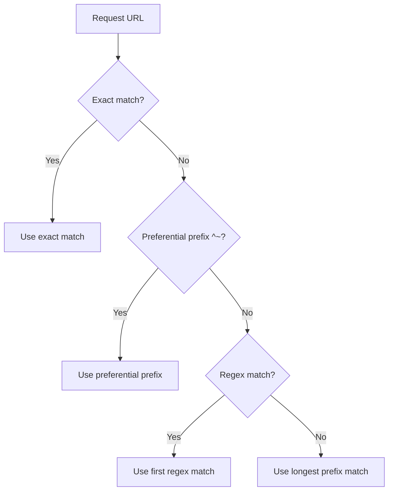

# 7.1.2 Static File Serving and Location Matching: Serving Content Efficiently

**Backlinks:** [7.1.1 — Nginx Architecture and Installation](./7.1.1_Nginx_Architecture_and_Installation.md)

**Next note:** [7.1.3 — Rewrites, Variables, Access Control, and Essential Directives](./7.1.3_Rewrites_Variables_Access_Control_and_Essential_Directives.md)

---

## Why Static File Serving Matters

Nginx excels at serving static files – HTML, CSS, JavaScript, images, videos. Understanding location matching and file serving directives allows you to:
- Configure multiple websites on one server (virtual hosts)
- Serve static assets efficiently
- Implement caching headers
- Create clean URLs with `try_files`
- Handle error pages gracefully

This note covers static file serving. Note 7.1.1 covered architecture; note 7.1.3 is the subchapter review.

**Backward references:** Filesystem from Module 1 (document root paths); HTTP from Module 2 (status codes, headers); Nginx configuration from 7.1.1 (server blocks).

---

## Part 1: Serving Static Files – root vs alias

### root Directive

`root` defines the document root directory. The URL path is appended to the root.

```nginx
server {
    listen 80;
    server_name example.com;
    root /var/www/example.com;
    
    location /images/ {
        # URL: /images/logo.png → /var/www/example.com/images/logo.png
    }
}
```

### alias Directive

`alias` replaces the URL path with a different filesystem path.

```nginx
server {
    listen 80;
    server_name example.com;
    root /var/www/example.com;
    
    location /static/ {
        # URL: /static/css/style.css → /var/www/static/css/style.css
        alias /var/www/static/;
    }
    
    location /images/ {
        # URL: /images/logo.png → /var/www/example.com/images/logo.png (root)
    }
}
```

### root vs alias – When to Use

| Directive | Behavior | Use Case |
|-----------|----------|----------|
| `root` | Appends URI to root path | Main document root, simple sites |
| `alias` | Replaces URI with alias path | Serving files from outside document root |

**Important:** `alias` with trailing slash matters:
```nginx
# Good – trailing slash
location /static/ {
    alias /var/www/static/;
}

# Bad – missing slash (creates double slash)
location /static/ {
    alias /var/www/static;
}
# URL: /static/style.css → /var/www/static/style.css (works)
# URL: /static/subdir/file.css → /var/www/staticsubdir/file.css (fails!)
```

---

## Part 2: index Directive

`index` specifies default files to serve when a directory is requested.

```nginx
server {
    root /var/www/example.com;
    
    # Try multiple index files
    index index.html index.htm index.php;
    
    location / {
        # Requests to / → /var/www/example.com/index.html
    }
}
```

### index with Subdirectories

```nginx
location /docs/ {
    index documentation.html;
}
# Request to /docs/ → /var/www/example.com/docs/documentation.html
```

---

## Part 3: try_files – The Swiss Army Knife

`try_files` checks for files in order and serves the first one that exists.

### Basic try_files Usage

```nginx
location / {
    # Try $uri, then $uri/, then serve 404
    try_files $uri $uri/ =404;
}

# Request: /about.html
# 1. Check if /var/www/example.com/about.html exists
# 2. If not, check if /var/www/example.com/about.html/ exists (directory)
# 3. If not, return 404
```

### try_files for Clean URLs (No .html extension)

```nginx
location / {
    try_files $uri $uri.html $uri/ =404;
}
# Request: /about
# 1. Check if /var/www/example.com/about exists
# 2. If not, check if /var/www/example.com/about.html exists
# 3. If not, check if directory exists
# 4. If not, 404
```

### try_files with Fallback to PHP

```nginx
location / {
    try_files $uri $uri/ /index.php?$args;
}
# Request: /users/123
# 1. Check if file exists
# 2. If not, route to index.php with query string
```

### try_files with Named Location

```nginx
location / {
    try_files $uri $uri/ @fallback;
}

location @fallback {
    proxy_pass http://backend;
}
```

---

## Part 4: Location Matching – How Nginx Routes Requests

Location blocks define how to handle different URL paths.

### Location Matching Types

| Type | Syntax | Priority | Example |
|------|--------|----------|---------|
| **Exact match** | `location = /path` | Highest | `location = /` |
| **Preferential prefix** | `location ^~ /path` | High | `location ^~ /static/` |
| **Regex match** | `location ~ /path` (case-sensitive) or `~*` (case-insensitive) | Medium | `location ~ \.php$` |
| **Prefix match** | `location /path` | Lowest | `location /` |

### Matching Priority Order



### Location Matching Examples

```nginx
server {
    listen 80;
    server_name example.com;
    root /var/www/example.com;
    
    # Exact match – highest priority
    location = / {
        index home.html;
    }
    
    # Preferential prefix – stops regex checking
    location ^~ /static/ {
        alias /var/www/static/;
        expires 30d;
    }
    
    # Case-insensitive regex – matches .php, .PHP, etc.
    location ~* \.php$ {
        fastcgi_pass unix:/var/run/php/php8.1-fpm.sock;
        include fastcgi_params;
    }
    
    # Case-sensitive regex
    location ~ \.jpg$ {
        expires 1y;
    }
    
    # Prefix match – lowest priority
    location / {
        try_files $uri $uri/ =404;
    }
}
```

### Testing Location Matching

```bash
# Nginx will show which location matches
sudo nginx -T | grep -A 10 "location"
```

| URL | Matches | Why |
|-----|---------|-----|
| `/` | `location = /` | Exact match |
| `/static/style.css` | `location ^~ /static/` | Preferential prefix (stops regex) |
| `/api/users` | `location /` | Prefix match (no regex) |
| `/image.jpg` | `location ~ \.jpg$` | Regex match |
| `/image.PNG` | `location ~* \.png$` (if defined) | Case-insensitive regex |

---

## Part 5: Static File Caching

### Setting Expires Headers

```nginx
location ~* \.(jpg|jpeg|png|gif|ico|css|js)$ {
    expires 30d;
    add_header Cache-Control "public, immutable";
}

location ~* \.(pdf|zip|gz)$ {
    expires 1y;
    add_header Cache-Control "public";
}
```

### Cache-Control Headers

| Header | Meaning |
|--------|---------|
| `public` | Cacheable by any cache (browser, CDN) |
| `private` | Cacheable only by browser |
| `no-cache` | Revalidate with server before using |
| `no-store` | Never cache |
| `immutable` | File will not change (great for hashed assets) |
| `max-age=31536000` | Cache for 1 year |

### Disable Caching for HTML

```nginx
location ~* \.html$ {
    expires -1;
    add_header Cache-Control "no-cache, no-store, must-revalidate";
}
```

---

## Part 6: Autoindex – Directory Listing

```nginx
location /downloads/ {
    alias /var/www/downloads/;
    autoindex on;
    autoindex_exact_size off;  # Show human-readable sizes (KB, MB)
    autoindex_localtime on;    # Show local time
}
```

**Security:** Only enable autoindex on specific, non-sensitive directories.

---

## Part 7: Error Pages

### Custom Error Pages

```nginx
server {
    error_page 404 /404.html;
    error_page 500 502 503 504 /50x.html;
    
    location = /404.html {
        internal;  # Only accessible internally
        root /var/www/errors;
    }
    
    location = /50x.html {
        internal;
        root /var/www/errors;
    }
}
```

### Error Page by Response Code

| Code | Meaning | Typical Page |
|------|---------|--------------|
| 400 | Bad Request | Custom error |
| 401 | Unauthorized | Login page |
| 403 | Forbidden | Access denied page |
| 404 | Not Found | Custom 404 page |
| 500 | Internal Server Error | Maintenance page |
| 502 | Bad Gateway | Gateway error page |
| 503 | Service Unavailable | Maintenance page |

---

## Part 7b: Named Locations and the `internal` Directive

### Named Locations (`@name`)

A named location is a special location that cannot be accessed directly by clients — it can only be jumped to via `try_files`, `error_page`, or `rewrite ... last`. This separates routing logic from handling logic.

```nginx
location / {
    try_files $uri $uri/ @fallback;   # Jump to @fallback if file not found
}

location @fallback {
    proxy_pass http://backend;        # Named location: proxies unmatched requests
}
```

**Rules:**
- Named locations start with `@`
- They cannot be nested inside other location blocks
- They cannot contain `@` sub-locations
- Frequently used with `try_files` and `error_page`

### The `internal` Directive

`internal` restricts a location so it can only be reached by internal Nginx redirects — **not by external client requests**. Clients who try to access the URL directly get `404`.

```nginx
error_page 404 /404.html;

location = /404.html {
    internal;           # Only Nginx can serve this — clients can't fetch /404.html directly
    root /var/www/errors;
}
```

**Why it matters:** Without `internal`, users can browse directly to `/404.html`, `/50x.html`, etc. — often a security/presentation concern.

### Key Variables for File Resolution

| Variable | Value | Example |
|----------|-------|---------|
| `$document_root` | Value of the active `root` directive | `/var/www/html` |
| `$request_filename` | Full filesystem path of requested file — combines `$document_root + $uri` | `/var/www/html/about.html` |
| `$uri` | Normalised URI (no query string) | `/about.html` |
| `$args` | Query string | `page=2&sort=asc` |
| `$request_uri` | Full original URI including query string | `/about.html?page=2` |

```nginx
# try_files uses $request_filename internally to check file existence
location / {
    try_files $uri $uri/ =404;
    # Nginx checks $document_root + $uri, then $document_root + $uri + "/"
}
```

---

## Part 8: Complete Static Site Configuration

```nginx
# /etc/nginx/sites-available/example.com
server {
    listen 80;
    listen [::]:80;
    server_name example.com www.example.com;
    
    root /var/www/example.com;
    index index.html;
    
    # Logging
    access_log /var/log/nginx/example.com.access.log;
    error_log /var/log/nginx/example.com.error.log;
    
    # Security headers
    add_header X-Frame-Options "SAMEORIGIN" always;
    add_header X-Content-Type-Options "nosniff" always;
    add_header X-XSS-Protection "1; mode=block" always;
    
    # Main location
    location / {
        try_files $uri $uri/ =404;
    }
    
    # Static assets with long cache
    location ~* \.(css|js|jpg|jpeg|png|gif|ico|svg|woff|woff2)$ {
        expires 1y;
        add_header Cache-Control "public, immutable";
        access_log off;  # Reduce log noise
    }
    
    # Protect hidden files
    location ~ /\. {
        deny all;
        access_log off;
        log_not_found off;
    }
    
    # Custom error pages
    error_page 404 /404.html;
    location = /404.html {
        internal;
    }
    
    error_page 500 502 503 504 /50x.html;
    location = /50x.html {
        internal;
    }
}
```

---

## Quick Task: Configure Static Site

*Configure Nginx to serve a static website.*

1. Create a static website directory with `index.html`, `style.css`, and an image.
2. Create a server block for `mystatic.local`.
3. Configure long cache headers for CSS, JS, and images.
4. Add a custom 404 page.
5. Test the configuration.

> **Ready Solution:**
>
> ```bash
> # Task 1
> sudo mkdir -p /var/www/mystatic
> echo "<h1>My Static Site</h1>" | sudo tee /var/www/mystatic/index.html
> echo "body { color: blue; }" | sudo tee /var/www/mystatic/style.css
>
> # Task 2
> sudo tee /etc/nginx/sites-available/mystatic << 'EOF'
> server {
>     listen 80;
>     server_name mystatic.local;
>     root /var/www/mystatic;
>     index index.html;
>
>     location / {
>         try_files $uri $uri/ =404;
>     }
>
>     location ~* \.(css|js|jpg|jpeg|png|gif|ico)$ {
>         expires 30d;
>         add_header Cache-Control "public, immutable";
>     }
>
>     error_page 404 /404.html;
>     location = /404.html {
>         internal;
>     }
> }
> EOF
>
> # Create 404 page
> echo "<h1>404 - Page Not Found</h1>" | sudo tee /var/www/mystatic/404.html
>
> # Task 3
> sudo ln -s /etc/nginx/sites-available/mystatic /etc/nginx/sites-enabled/
> sudo nginx -t
> sudo systemctl reload nginx
>
> # Test
> echo "127.0.0.1 mystatic.local" | sudo tee -a /etc/hosts
> curl http://mystatic.local
> curl http://mystatic.local/nonexistent
> ```

---

## Summary Table: Static Serving Directives

| Directive | Purpose | Example |
|-----------|---------|---------|
| `root` | Document root (appends URI) | `root /var/www/html` |
| `alias` | Path replacement (doesn't append URI) | `alias /var/www/static/` |
| `index` | Default files for directories | `index index.html` |
| `try_files` | Sequential file check | `try_files $uri $uri/ =404` |
| `error_page` | Custom error pages | `error_page 404 /404.html` |
| `expires` | Cache control header | `expires 30d` |
| `autoindex` | Directory listing | `autoindex on` |

### Location Matching Priority

| Priority | Type | Syntax |
|----------|------|--------|
| 1 | Exact match | `location = /path` |
| 2 | Preferential prefix | `location ^~ /path` |
| 3 | Regex (case-sensitive) | `location ~ \.php$` |
| 4 | Regex (case-insensitive) | `location ~* \.jpg$` |
| 5 | Prefix (longest match) | `location /path` |

### Common Static File Types

| Type | Cache Duration | Extension |
|------|----------------|-----------|
| HTML | Short (no cache or 1 hour) | `.html`, `.htm` |
| CSS/JS | Long (1 year with versioning) | `.css`, `.js` |
| Images | Long (30 days to 1 year) | `.jpg`, `.png`, `.gif`, `.svg` |
| Fonts | Long (1 year) | `.woff`, `.woff2`, `.ttf` |
| Archives | Long (1 year) | `.zip`, `.tar.gz` |

---

**Next note:** [7.1.3 — Rewrites, Variables, Access Control, and Essential Directives](./7.1.3_Rewrites_Variables_Access_Control_and_Essential_Directives.md)
