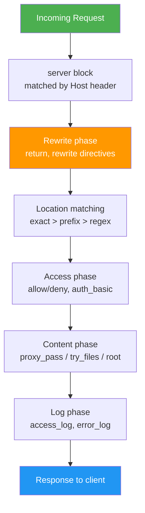

# 7.1.3 Rewrites, Variables, Access Control, and Essential Directives

**Backlinks:** [7.1.1 — Nginx Architecture](./7.1.1_Nginx_Architecture_and_Installation.md) | [7.1.2 — Static File Serving](./7.1.2_Static_File_Serving_and_Location_Matching.md) | [7.1.4 — Subchapter 7.1 Review](./7.1.4_Subchapter_Review.md)

**Next note:** [7.1.4 — Subchapter 7.1 Review](./7.1.4_Subchapter_Review.md)

---


### Nginx Request Processing Pipeline



## Why These Directives Matter

Notes 7.1.1 and 7.1.2 covered architecture, static serving, and location matching. This note covers the **remaining essential directives** that appear constantly in real Nginx configurations:

- URL redirects and rewrites (`return`, `rewrite`)
- The `map` module for clean conditional logic
- Nginx variables — what exists and how to use them
- Access control (`allow`/`deny`, `auth_basic`, `limit_except`)
- Hardening directives (`server_tokens`, `client_max_body_size`)
- The `if` directive and why it is dangerous

---

## Part 1: `return` — Simple Redirects and Responses

`return` immediately terminates request processing and sends a response. It is the **preferred way to do redirects** — faster and simpler than `rewrite`.

### Syntax

```nginx
return code [text];
return code URL;
return URL;
```

### Common Uses

```nginx
# 301 permanent redirect
server {
    listen 80;
    server_name example.com;
    return 301 https://example.com$request_uri;   # HTTP → HTTPS
}

# 301 redirect with domain change
server {
    listen 80;
    server_name www.example.com;
    return 301 https://example.com$request_uri;   # www → non-www
}

# 302 temporary redirect
location /old-page {
    return 302 /new-page;
}

# Return a plain-text response (useful for health checks)
location /health {
    return 200 "OK\n";
    add_header Content-Type text/plain;
}

# Return JSON
location /ping {
    return 200 '{"status":"ok"}';
    add_header Content-Type application/json;
}

# Block a path
location /admin {
    return 403;
}
```

### Return vs Redirect Codes

| Code | Name | Use Case | Browser Behaviour |
|------|------|----------|------------------|
| `301` | Moved Permanently | Domain/URL change (SEO-safe) | Browser caches redirect permanently |
| `302` | Found (Temporary) | A/B testing, maintenance | Not cached |
| `303` | See Other | POST → GET redirect after form submission | Not cached |
| `307` | Temporary Redirect | Keeps HTTP method (POST stays POST) | Not cached |
| `308` | Permanent Redirect | Keeps HTTP method permanently | Cached |

---

## Part 2: `rewrite` — Pattern-Based URL Rewriting

`rewrite` uses a regex to match and transform the URI. Use `return` when possible; use `rewrite` when you need regex capture groups.

### Syntax

```nginx
rewrite regex replacement [flag];
```

### Flags

| Flag | Behaviour |
|------|-----------|
| `last` | Stop processing rewrites; start new location search with new URI |
| `break` | Stop processing rewrites; continue with current location using new URI |
| `redirect` | Return 302 redirect to client |
| `permanent` | Return 301 redirect to client |

### Examples

```nginx
# Remove trailing slash
rewrite ^/(.*)/$ /$1 permanent;

# Redirect /products/123 to /items/123
rewrite ^/products/(\d+)$ /items/$1 permanent;

# Add .html extension internally (no redirect to client)
rewrite ^/([^.]+)$ /$1.html last;

# Lowercase URLs
rewrite ^/([A-Z].*)$ /$1 redirect;
```

### `last` vs `break` — Critical Distinction

```nginx
server {
    root /var/www;

    location /one {
        rewrite ^/one$ /two last;     # Start new location search for /two
        # Nginx now searches for location matching /two
    }

    location /two {
        return 200 "You reached /two\n";
    }
}

# With break:
location /downloads/ {
    rewrite ^/downloads/(.*)$ /files/$1 break;
    # URI becomes /files/... but stays in this location block
    # Nginx serves the file from this location, not from a new location search
}
```

> **Rule of thumb:** `last` = restart location lookup (like a redirect inside Nginx). `break` = use new URI but stay in current location.

---

## Part 3: `map` — Clean Conditional Variable Mapping

`map` creates a new variable whose value depends on another variable. It's the **clean alternative to chains of `if` blocks** and is evaluated lazily (only when the variable is actually used).

### Syntax (must be in `http` block)

```nginx
map $source_variable $new_variable {
    default   fallback_value;
    "pattern" value;
    ~regex    value;
}
```

### Examples

**Map mobile vs desktop:**
```nginx
http {
    map $http_user_agent $is_mobile {
        default        0;
        ~*iPhone       1;
        ~*Android      1;
        ~*iPad         1;
    }

    server {
        location / {
            if ($is_mobile) {
                return 302 https://m.example.com$request_uri;
            }
            try_files $uri $uri/ =404;
        }
    }
}
```

**Map upstream by subdomain:**
```nginx
map $host $backend_pool {
    default           "main_backend";
    api.example.com   "api_backend";
    app.example.com   "app_backend";
    ~^(\w+)\.example  "tenant_backend";
}

server {
    location / {
        proxy_pass http://$backend_pool;
    }
}
```

**Cache bypass by request type:**
```nginx
map $request_method $skip_cache {
    default 0;
    POST    1;
    PUT     1;
    DELETE  1;
    PATCH   1;
}

server {
    location / {
        proxy_cache_bypass $skip_cache;
        proxy_no_cache     $skip_cache;
        proxy_pass http://backend;
    }
}
```

**Map rate-limit zone by authenticated status:**
```nginx
map $cookie_session $limit_key {
    default    $binary_remote_addr;  # Unauthenticated: limit by IP
    ~.+        $cookie_session;      # Authenticated: limit by session
}

limit_req_zone $limit_key zone=api:10m rate=30r/s;
```

---

## Part 4: Nginx Variables Reference

Nginx has a rich set of built-in variables. Understanding them is key to writing dynamic configurations.

### Request Variables

| Variable | Value | Example |
|----------|-------|---------|
| `$uri` | Normalised URI (no query string, decoded) | `/about` |
| `$request_uri` | Full original URI including query string | `/about?ref=home` |
| `$args` | Query string (without `?`) | `ref=home&page=2` |
| `$arg_NAME` | Value of a specific query parameter | `$arg_ref` → `home` |
| `$request_method` | HTTP method | `GET`, `POST`, `DELETE` |
| `$request_filename` | Full filesystem path of the requested file | `/var/www/html/about.html` |
| `$document_root` | Active `root` directive value | `/var/www/html` |
| `$is_args` | `?` if query string exists, empty otherwise | `?` or `` |

### Connection Variables

| Variable | Value | Example |
|----------|-------|---------|
| `$remote_addr` | Client IP (string) | `192.168.1.1` |
| `$binary_remote_addr` | Client IP (binary, 4 bytes IPv4) | Used in shared memory zones |
| `$server_addr` | Server IP address | `10.0.0.5` |
| `$server_name` | Matched `server_name` value | `example.com` |
| `$server_port` | Port Nginx is listening on | `80`, `443` |
| `$scheme` | Protocol | `http` or `https` |

### Header Variables

| Variable | Value |
|----------|-------|
| `$http_NAME` | Value of any request header (`-` → `_`, lowercase) |
| `$http_host` | `Host` header value |
| `$http_user_agent` | `User-Agent` header |
| `$http_referer` | `Referer` header |
| `$http_x_forwarded_for` | `X-Forwarded-For` chain |
| `$http_x_api_key` | `X-Api-Key` custom header |

### Response/Upstream Variables

| Variable | Value |
|----------|-------|
| `$status` | HTTP response status code sent to client |
| `$upstream_addr` | Backend address used | `10.0.0.1:8080` |
| `$upstream_status` | Status code from upstream | `200` |
| `$upstream_response_time` | Time to receive response from upstream |
| `$upstream_cache_status` | `HIT`, `MISS`, `BYPASS`, `EXPIRED` |
| `$sent_http_NAME` | Value of response header being sent |

---

## Part 5: Access Control — `allow` and `deny`

Allow/deny rules restrict access by IP address. Nginx evaluates them in order; the first match wins.

```nginx
# Protect admin panel — allow only trusted IP
location /admin {
    allow 192.168.1.0/24;   # Allow office network
    allow 10.0.0.5;          # Allow specific IP
    deny all;                # Block everyone else
}

# Allow specific networks, deny rest
location /internal-api {
    allow 10.0.0.0/8;
    allow 172.16.0.0/12;
    allow 192.168.0.0/16;
    deny all;
}

# Deny specific bad actor, allow everyone else
location / {
    deny 203.0.113.5;
    allow all;
}
```

> **Order matters:** Nginx reads allow/deny rules top-to-bottom; the **first matching rule wins**. Always put most-specific rules first.

### Combining with `geo` Module

For larger IP sets, use `geo` (defined in `http` block):

```nginx
geo $blocked_ip {
    default         0;
    203.0.113.0/24  1;    # Block this subnet
    198.51.100.5    1;    # Block this IP
}

server {
    location / {
        if ($blocked_ip) {
            return 403;
        }
        try_files $uri $uri/ =404;
    }
}
```

---

## Part 6: HTTP Basic Authentication — `auth_basic`

`auth_basic` prompts clients for a username/password using the HTTP Basic Auth protocol. Credentials are stored in an `htpasswd`-format file.

```bash
# Create password file
sudo apt install apache2-utils
sudo htpasswd -c /etc/nginx/.htpasswd admin      # -c creates new file
sudo htpasswd /etc/nginx/.htpasswd developer     # add second user
```

```nginx
location /private {
    auth_basic "Restricted Area";
    auth_basic_user_file /etc/nginx/.htpasswd;
    try_files $uri $uri/ =404;
}

# Disable auth for a sub-path (nested override)
location /private/public-asset {
    auth_basic off;
    try_files $uri =404;
}
```

> **Security note:** HTTP Basic Auth sends credentials Base64-encoded (not encrypted). Always use it **only over HTTPS**.

---

## Part 7: `limit_except` — Restrict HTTP Methods

`limit_except` allows only the listed methods; everything else is blocked.

```nginx
location /api/data {
    # Only allow GET and HEAD; block POST, DELETE, etc.
    limit_except GET HEAD {
        deny all;
    }
    proxy_pass http://backend;
}

location /api/resource {
    # Only allow GET, POST from internal network; deny others from everywhere
    limit_except GET POST {
        allow 10.0.0.0/8;
        deny all;
    }
    proxy_pass http://backend;
}
```

---

## Part 8: Hardening Directives

### `server_tokens` — Hide Nginx Version

By default, Nginx includes its version number in error pages and the `Server` response header. This leaks version information to attackers.

```nginx
http {
    server_tokens off;
}
```

```bash
# Before server_tokens off:
curl -I http://example.com
# Server: nginx/1.24.0

# After server_tokens off:
# Server: nginx
```

### `client_max_body_size` — Upload Size Limits

Controls the maximum size of the request body (file uploads, POST data). Default is `1m` (1 MB). Returns `413 Request Entity Too Large` if exceeded.

```nginx
http {
    client_max_body_size 10m;   # Global default: 10MB
}

server {
    location /upload {
        client_max_body_size 100m;   # Allow 100MB for upload endpoint
    }

    location /api {
        client_max_body_size 1m;    # Restrict API JSON payloads to 1MB
    }
}
```

### `client_body_timeout` and `client_header_timeout`

```nginx
http {
    client_body_timeout   12s;  # Time to receive the full request body
    client_header_timeout 12s;  # Time to receive request headers
    send_timeout          10s;  # Time between two successive writes to client
    keepalive_timeout     65s;  # Time to keep idle connection open
    keepalive_requests    1000; # Max requests per keepalive connection
}
```

### Complete Hardening Block

```nginx
http {
    # Version hiding
    server_tokens off;

    # Upload limits
    client_max_body_size 10m;

    # Timeouts
    client_body_timeout   12s;
    client_header_timeout 12s;
    send_timeout          10s;
    keepalive_timeout     65s;

    # Buffer limits (prevent buffer overflow attacks)
    client_body_buffer_size    1k;
    client_header_buffer_size  1k;
    large_client_header_buffers 2 1k;
}
```

---

## Part 9: `if` Directive — Use Sparingly

The `if` directive in Nginx is **not a general-purpose conditional**. It has surprising and dangerous behaviour inside `location` blocks. The Nginx community has a well-known warning: **"if is evil"**.

### What `if` Does Well (safe uses)

```nginx
# Safe: at server level — check scheme, redirect HTTP
server {
    if ($scheme = http) {
        return 301 https://$host$request_uri;
    }
}

# Safe: check request method
if ($request_method = POST) {
    # ... fine at server level
}
```

### Why `if` Inside `location` Is Dangerous

```nginx
# DANGEROUS — unexpected behaviour
location / {
    set $flag 0;
    if ($request_method = POST) {
        set $flag 1;
    }
    if ($flag = 1) {
        proxy_pass http://backend;    # This does NOT work reliably
    }
    try_files $uri =404;              # This may or may not run
}
```

**Why it breaks:** Inside a `location`, `if` creates an implicit nested location. Only directives from the **winning `if` block** take effect — other directives in the parent location are silently dropped.

### Safe Alternatives to `if`

| Intent | Instead of `if` | Use |
|--------|----------------|-----|
| Different upstream by variable | `if ($mobile)` | `map` + `proxy_pass http://$backend` |
| Redirect by condition | `if ($scheme = http)` | Fine at `server` level; use `return` |
| Different cache behaviour by method | `if ($method = POST)` | `map` + `proxy_cache_bypass $skip` |
| Block by IP | `if ($remote_addr = ...)` | `allow`/`deny` |
| Block by user agent | `if ($http_user_agent ~* bot)` | `map` + `return 403` |

---

## Quick Task: Rewrites and Access Control

1. Configure Nginx to redirect all `http://` traffic to `https://` using `return`.
2. Restrict `/admin` to only the IP `127.0.0.1`.
3. Add HTTP Basic Auth to `/private` with a user `devuser`.
4. Hide the Nginx version in response headers.
5. Set a 50 MB upload limit for `/upload`.

> **Ready Solution:**
>
> ```bash
> # Task 3: Create password file
> sudo htpasswd -c /etc/nginx/.htpasswd devuser
>
> # Tasks 1-5: Config
> sudo tee /etc/nginx/sites-available/hardened << 'EOF'
> server {
>     listen 80;
>     server_name example.local;
>     return 301 https://$host$request_uri;        # Task 1
> }
>
> server {
>     listen 443 ssl;
>     server_name example.local;
>     root /var/www/html;
>
>     ssl_certificate    /etc/nginx/ssl/example.crt;
>     ssl_certificate_key /etc/nginx/ssl/example.key;
>
>     server_tokens off;                           # Task 4
>     client_max_body_size 50m;                    # Task 5 (global)
>
>     location / {
>         try_files $uri $uri/ =404;
>     }
>
>     location /admin {                            # Task 2
>         allow 127.0.0.1;
>         deny all;
>         try_files $uri $uri/ =404;
>     }
>
>     location /private {                          # Task 3
>         auth_basic "Restricted";
>         auth_basic_user_file /etc/nginx/.htpasswd;
>         try_files $uri $uri/ =404;
>     }
>
>     location /upload {
>         client_max_body_size 50m;               # Task 5 (location override)
>         proxy_pass http://localhost:3000;
>     }
> }
> EOF
>
> sudo nginx -t && sudo systemctl reload nginx
> ```

---

## Summary Table: Rewrites and Access Control

### `return` vs `rewrite`

| Directive | Speed | Regex | Use Case |
|-----------|-------|-------|----------|
| `return code URL` | Fastest (no regex) | No | Simple redirects, HTTP→HTTPS |
| `rewrite regex replacement` | Slower | Yes | Pattern capture, complex transforms |

### Access Control Directives

| Directive | Purpose | Example |
|-----------|---------|---------|
| `allow IP/CIDR` | Allow specific IP or range | `allow 192.168.1.0/24` |
| `deny IP/CIDR` | Block specific IP or range | `deny 203.0.113.5` |
| `deny all` | Block everyone (use after allows) | `deny all` |
| `auth_basic` | Prompt for username/password | `auth_basic "Private"` |
| `auth_basic_user_file` | Path to htpasswd file | `/etc/nginx/.htpasswd` |
| `limit_except` | Restrict HTTP methods | `limit_except GET { deny all; }` |

### Hardening Directives

| Directive | Default | Recommended |
|-----------|---------|-------------|
| `server_tokens` | `on` | `off` |
| `client_max_body_size` | `1m` | `10m` (adjust per endpoint) |
| `client_body_timeout` | `60s` | `12s` |
| `client_header_timeout` | `60s` | `12s` |

### `map` Module Quick Reference

```nginx
# In http block
map $source_var $dest_var {
    default      "fallback";
    "exact"      "value";
    ~regex       "value";       # case-sensitive regex
    ~*iregex     "value";       # case-insensitive regex
}
```

---

**Next note:** [7.1.4 — Subchapter 7.1 Review](./7.1.4_Subchapter_Review.md) — cheatsheet and interview prep for Nginx fundamentals.
