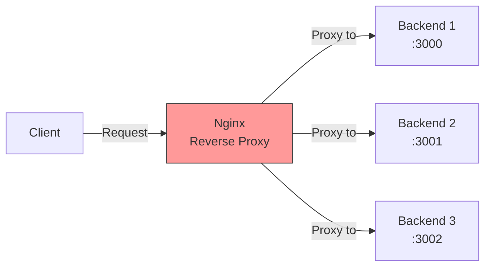

### 7.2.1 Reverse Proxy and Load Balancing: Scaling Applications

#### Why Reverse Proxy and Load Balancing Matter

Modern applications consist of multiple backend services. A reverse proxy:
- **Hides backend complexity** – Clients talk to one endpoint
- **Provides load balancing** – Distributes traffic across multiple servers
- **Terminates SSL** – Centralizes certificate management
- **Adds security** – Protects backend servers from direct exposure

This note covers reverse proxy and load balancing. Note 7.2.2 covers SSL, caching, and rate limiting; note 7.2.3 is the subchapter review.

**Backward references:** HTTP from Module 2 (headers, methods); Networking from Module 2 (TCP ports); Upstream servers from Module 5 (Kubernetes Services).

---

## Part 1: What is a Reverse Proxy?



### Forward Proxy vs Reverse Proxy

| Type | Client Perspective | Server Perspective | Use Case |
|------|-------------------|-------------------|----------|
| **Forward Proxy** | Client knows about proxy | Server sees proxy IP | Corporate internet access |
| **Reverse Proxy** | Client thinks it's the server | Server sees proxy IP | Load balancing, security |

---

## Part 2: Basic Reverse Proxy with proxy_pass

### Simple Reverse Proxy

```nginx
server {
    listen 80;
    server_name api.example.com;
    
    location / {
        proxy_pass http://localhost:3000;
        proxy_set_header Host $host;
        proxy_set_header X-Real-IP $remote_addr;
        proxy_set_header X-Forwarded-For $proxy_add_x_forwarded_for;
        proxy_set_header X-Forwarded-Proto $scheme;
    }
}
```

### proxy_pass URL Trailing Slash Behavior

| proxy_pass URL | Request `/api/users` | Result |
|----------------|---------------------|--------|
| `proxy_pass http://backend:8080` | → | `http://backend:8080/api/users` |
| `proxy_pass http://backend:8080/` | → | `http://backend:8080/users` |
| `proxy_pass http://backend:8080/v1` | → | `http://backend:8080/v1/users` |
| `proxy_pass http://backend:8080/v1/` | → | `http://backend:8080/v1/users` (strips `/api`) |

```nginx
# Examples
location /api/ {
    proxy_pass http://backend:8080/;  # Strips /api
}
# /api/users → http://backend:8080/users

location /api/ {
    proxy_pass http://backend:8080/v1/;  # Replaces /api with /v1
}
# /api/users → http://backend:8080/v1/users

location / {
    proxy_pass http://backend:8080;  # Preserves full path
}
# /api/users → http://backend:8080/api/users
```

### Essential proxy_set_header Directives

```nginx
location / {
    proxy_pass http://backend;
    
    # Pass original host header
    proxy_set_header Host $host;
    
    # Pass real client IP
    proxy_set_header X-Real-IP $remote_addr;
    
    # Pass forwarded-for chain
    proxy_set_header X-Forwarded-For $proxy_add_x_forwarded_for;
    
    # Pass original protocol (http/https)
    proxy_set_header X-Forwarded-Proto $scheme;
}
```

---

## Part 3: Load Balancing with Upstream

### Upstream Block

```nginx
upstream backend_servers {
    # Server definitions
    server backend1.example.com:8080 weight=3;
    server backend2.example.com:8080;
    server backend3.example.com:8080 backup;
    
    # Load balancing method
    least_conn;
    
    # Keepalive connections
    keepalive 32;
}

server {
    listen 80;
    server_name api.example.com;
    
    location / {
        proxy_pass http://backend_servers;
        proxy_http_version 1.1;
        proxy_set_header Connection "";
        proxy_set_header Host $host;
        proxy_set_header X-Real-IP $remote_addr;
    }
}
```

### Load Balancing Algorithms

| Algorithm | Directive | Description |
|-----------|-----------|-------------|
| **Round Robin** (default) | (none) | Requests distributed sequentially |
| **Least Connections** | `least_conn;` | Send to server with fewest active connections |
| **IP Hash** | `ip_hash;` | Same client IP always goes to same server |
| **Generic Hash** | `hash $request_uri consistent;` | Hash of any variable |
| **Random** | `random two least_conn;` | Random with two choices |

### Server Options

| Option | Purpose | Example |
|--------|---------|---------|
| `weight=N` | Relative weight | `weight=3` (3x traffic) |
| `max_fails=N` | Failures before marking down | `max_fails=3` |
| `fail_timeout=N` | Time to consider failure | `fail_timeout=30s` |
| `backup` | Backup server (used when others fail) | `backup` |
| `down` | Mark server as down | `down` |
| `max_conns=N` | Max concurrent connections | `max_conns=100` |

### Load Balancing Examples

**Weighted Round Robin:**
```nginx
upstream backend {
    server backend1 weight=3;  # Gets 3x traffic
    server backend2 weight=1;
    server backend3 weight=1;
}
# Total weight = 5, backend1 gets 60% of traffic
```

**IP Hash (Sticky Sessions):**
```nginx
upstream backend {
    ip_hash;
    server backend1;
    server backend2;
    server backend3;
}
# Same client IP always goes to same backend
```

**Least Connections with Backup:**
```nginx
upstream backend {
    least_conn;
    server backend1 max_fails=3 fail_timeout=30s;
    server backend2 max_fails=3 fail_timeout=30s;
    server backup1 backup;
}
```

---

## Part 4: Health Checks

### Passive Health Checks (Built-in)

```nginx
upstream backend {
    server backend1 max_fails=3 fail_timeout=30s;
    server backend2 max_fails=3 fail_timeout=30s;
}
```

| Parameter | Default | Meaning |
|-----------|---------|---------|
| `max_fails` | 1 | Number of failures to mark server down |
| `fail_timeout` | 10s | Time server is marked down, also time to count failures |

### Active Health Checks (Nginx Plus)

```nginx
upstream backend {
    zone backend 64k;
    
    server backend1;
    server backend2;
    
    health_check interval=5s fails=3 passes=2 uri=/health;
}
```

---

## Part 5: Proxy Timeouts and Buffering

### Timeout Directives

| Directive | Default | Purpose |
|-----------|---------|---------|
| `proxy_connect_timeout` | 60s | Time to connect to upstream |
| `proxy_send_timeout` | 60s | Time to send request to upstream |
| `proxy_read_timeout` | 60s | Time to read response from upstream |

```nginx
location /api/ {
    proxy_pass http://backend;
    proxy_connect_timeout 10s;
    proxy_send_timeout 30s;
    proxy_read_timeout 90s;  # Long for slow APIs
}
```

### Buffering Directives

```nginx
location / {
    proxy_pass http://backend;
    
    # Disable buffering (for streaming/SSE)
    proxy_buffering off;
    
    # Buffer size
    proxy_buffer_size 4k;
    proxy_buffers 8 4k;
    
    # Buffer for large responses
    proxy_busy_buffers_size 8k;
}
```

---

## Part 6: WebSocket Proxying

WebSockets require special handling (upgrade headers).

```nginx
location /ws/ {
    proxy_pass http://websocket_backend;
    proxy_http_version 1.1;
    proxy_set_header Upgrade $http_upgrade;
    proxy_set_header Connection "upgrade";
    proxy_set_header Host $host;
    proxy_set_header X-Real-IP $remote_addr;
    proxy_read_timeout 3600s;  # Long timeout for WebSockets
}
```

---

## Part 7: Complete Reverse Proxy Configuration

### Example: Microservices Gateway

```nginx
upstream auth_service {
    least_conn;
    server auth1:8080 max_fails=3;
    server auth2:8080 max_fails=3;
    keepalive 32;
}

upstream api_service {
    least_conn;
    server api1:8080 weight=3;
    server api2:8080 weight=2;
    server api3:8080 weight=1;
    keepalive 64;
}

upstream websocket_service {
    server ws1:8080;
    server ws2:8080;
}

server {
    listen 443 ssl http2;
    server_name api.example.com;
    
    ssl_certificate /etc/nginx/ssl/cert.pem;
    ssl_certificate_key /etc/nginx/ssl/key.pem;
    
    # Common proxy headers
    proxy_set_header Host $host;
    proxy_set_header X-Real-IP $remote_addr;
    proxy_set_header X-Forwarded-For $proxy_add_x_forwarded_for;
    proxy_set_header X-Forwarded-Proto $scheme;
    
    # Auth endpoints
    location /auth/ {
        proxy_pass http://auth_service/;
        proxy_connect_timeout 5s;
        proxy_read_timeout 30s;
    }
    
    # API endpoints
    location /api/ {
        proxy_pass http://api_service/;
        proxy_connect_timeout 10s;
        proxy_read_timeout 60s;
    }
    
    # WebSocket endpoints
    location /ws/ {
        proxy_pass http://websocket_service/;
        proxy_http_version 1.1;
        proxy_set_header Upgrade $http_upgrade;
        proxy_set_header Connection "upgrade";
        proxy_read_timeout 3600s;
    }
    
    # Health check endpoint (no proxy)
    location /health {
        access_log off;
        return 200 "healthy\n";
        add_header Content-Type text/plain;
    }
}
```

---

## Quick Task: Configure Reverse Proxy

*Set up Nginx as a reverse proxy for a backend application.*

1. Run a simple HTTP server on port 3000 (e.g., `python3 -m http.server 3000`).
2. Configure Nginx to proxy `/` to `http://localhost:3000`.
3. Add proper proxy headers.
4. Test that requests reach the backend.

> **Ready Solution:**
>
> ```bash
> # Task 1
> python3 -m http.server 3000 &
>
> # Task 2-3
> sudo tee /etc/nginx/sites-available/proxy << 'EOF'
> server {
>     listen 80;
>     server_name proxy.local;
>
>     location / {
>         proxy_pass http://localhost:3000;
>         proxy_set_header Host $host;
>         proxy_set_header X-Real-IP $remote_addr;
>         proxy_set_header X-Forwarded-For $proxy_add_x_forwarded_for;
>     }
> }
> EOF
>
> sudo ln -s /etc/nginx/sites-available/proxy /etc/nginx/sites-enabled/
> sudo nginx -t
> sudo systemctl reload nginx
>
> # Task 4
> echo "127.0.0.1 proxy.local" | sudo tee -a /etc/hosts
> curl http://proxy.local
> ```

---

## Summary Table: Reverse Proxy Directives

| Directive | Purpose | Example |
|-----------|---------|---------|
| `proxy_pass` | Forward request to backend | `proxy_pass http://backend:8080` |
| `proxy_set_header` | Set request headers | `proxy_set_header Host $host` |
| `proxy_buffering` | Enable/disable buffering | `proxy_buffering off` |
| `proxy_connect_timeout` | Connection timeout | `proxy_connect_timeout 5s` |
| `proxy_read_timeout` | Read timeout | `proxy_read_timeout 60s` |

### Load Balancing Algorithms

| Algorithm | Directive | Use Case |
|-----------|-----------|----------|
| Round Robin | (default) | Equal traffic distribution |
| Least Connections | `least_conn;` | Variable request duration |
| IP Hash | `ip_hash;` | Sticky sessions (no cookies) |
| Random | `random two least_conn;` | Large backend pools |

### Upstream Server Options

| Option | Default | Purpose |
|--------|---------|---------|
| `weight=1` | 1 | Traffic weight |
| `max_fails=1` | 1 | Failures to mark down |
| `fail_timeout=10s` | 10s | Down time |
| `backup` | - | Backup server |
| `down` | - | Mark as down |

---

**Next note (7.2.2)** will cover **SSL Termination, Caching, and Rate Limiting** – HTTPS configuration, Let's Encrypt, proxy caching, and rate limiting.

**Backward references:**
- HTTP from Module 2 (headers, methods)
- Load balancing from Module 2 (L7 concepts)
- Nginx configuration from 7.1.1 (server blocks)
