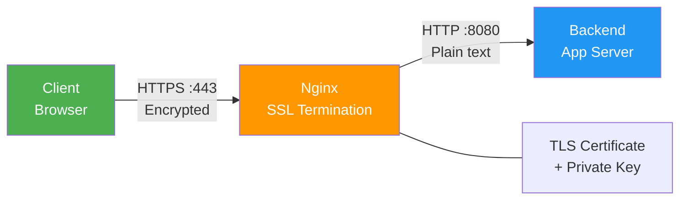

# 7.2.2 SSL Termination, Caching, and Rate Limiting: Security and Performance

**Backlinks:** [7.2.1 — Reverse Proxy and Load Balancing](./7.2.1_Reverse_Proxy_and_Load_Balancing.md)

**Next note:** [7.2.3 — Advanced Nginx Patterns](./7.2.3_Advanced_Nginx_Patterns.md)

---


### SSL Termination Flow



## Why These Features Matter

Production Nginx deployments need:
- **SSL/TLS termination** – Encrypt traffic, build trust
- **Caching** – Reduce backend load, improve response times
- **Rate limiting** – Protect against DDoS and brute force attacks

This note covers SSL, caching, and rate limiting. Note 7.2.1 covered reverse proxy; note 7.2.3 is the subchapter review.

**Backward references:** TLS/SSL from Module 2 (handshake, certificates); HTTP caching from Module 2 (Cache-Control headers); Nginx configuration from 7.1.1 and 7.2.1.

---

## Part 1: SSL/TLS Termination

### Basic SSL Configuration

```nginx
server {
    listen 443 ssl http2;
    server_name example.com;
    
    # Certificate paths
    ssl_certificate /etc/nginx/ssl/example.com.crt;
    ssl_certificate_key /etc/nginx/ssl/example.com.key;
    
    # Protocol versions (disable outdated)
    ssl_protocols TLSv1.2 TLSv1.3;
    
    # Cipher suites (strong encryption)
    ssl_ciphers ECDHE-ECDSA-AES128-GCM-SHA256:ECDHE-RSA-AES128-GCM-SHA256;
    ssl_prefer_server_ciphers on;
    
    # Session caching
    ssl_session_cache shared:SSL:10m;
    ssl_session_timeout 10m;
    
    # HSTS (HTTP Strict Transport Security)
    add_header Strict-Transport-Security "max-age=31536000" always;
    
    location / {
        proxy_pass http://backend;
    }
}
```

### HTTP to HTTPS Redirect

```nginx
server {
    listen 80;
    server_name example.com;
    return 301 https://$server_name$request_uri;
}
```

### Self-Signed Certificate (Development)

```bash
# Generate self-signed certificate
sudo openssl req -x509 -nodes -days 365 -newkey rsa:2048 \
    -keyout /etc/nginx/ssl/example.key \
    -out /etc/nginx/ssl/example.crt \
    -subj "/CN=example.com"
```

### Let's Encrypt with Certbot

```bash
# Install certbot
sudo apt install certbot python3-certbot-nginx

# Obtain and install certificate
sudo certbot --nginx -d example.com -d www.example.com

# Auto-renewal (certbot adds cron job)
sudo certbot renew --dry-run
```

### SSL Best Practices

| Setting | Recommended Value | Why |
|---------|------------------|-----|
| `ssl_protocols` | `TLSv1.2 TLSv1.3` | Disable SSLv3, TLSv1.0, TLSv1.1 |
| `ssl_ciphers` | Modern ciphers | Strong encryption |
| `ssl_session_cache` | `shared:SSL:10m` | Reuse sessions (40000 sessions) |
| `ssl_session_timeout` | `10m` | Session lifetime |
| `ssl_prefer_server_ciphers` | `on` | Server chooses ciphers |

### OCSP Stapling — Faster SSL Handshakes

Normally, a browser must contact the CA's OCSP server during the TLS handshake to verify the certificate hasn't been revoked — adding latency. **OCSP stapling** lets Nginx fetch and cache that OCSP response itself, then "staple" it to the handshake. The client trusts Nginx's cached response instead of contacting the CA directly.

```nginx
server {
    listen 443 ssl http2;
    
    ssl_certificate /etc/letsencrypt/live/example.com/fullchain.pem;
    ssl_certificate_key /etc/letsencrypt/live/example.com/privkey.pem;
    ssl_trusted_certificate /etc/letsencrypt/live/example.com/chain.pem;  # CA chain for OCSP
    
    # Enable OCSP stapling
    ssl_stapling on;
    ssl_stapling_verify on;
    
    # DNS resolver for Nginx to look up OCSP endpoints
    resolver 8.8.8.8 8.8.4.4 valid=300s;
    resolver_timeout 5s;
}
```

| Directive | Purpose |
|-----------|---------|
| `ssl_stapling on` | Nginx fetches and caches OCSP response |
| `ssl_stapling_verify on` | Verify OCSP response signature |
| `ssl_trusted_certificate` | CA certificate chain needed for verification |
| `resolver` | DNS resolver Nginx uses to contact CA OCSP endpoints |

**Benefit:** Removes a round-trip to the CA from every new TLS handshake. Especially impactful on mobile connections.

### SSL Certificate Types

| Type | Use Case | Cost |
|------|----------|------|
| **Self-signed** | Development, internal | Free |
| **Let's Encrypt** | Production websites | Free |
| **Domain Validated (DV)** | Basic websites | Low |
| **Organization Validated (OV)** | Business websites | Medium |
| **Extended Validation (EV)** | High-trust sites | High |

---

## Part 2: Proxy Caching

### Basic Proxy Cache Configuration

```nginx
# Define cache path (in http block)
proxy_cache_path /var/cache/nginx levels=1:2 keys_zone=my_cache:10m \
                 max_size=1g inactive=60m use_temp_path=off;

server {
    location / {
        proxy_cache my_cache;
        proxy_cache_key "$scheme$request_method$host$request_uri";
        proxy_cache_valid 200 302 60m;
        proxy_cache_valid 404 1m;
        proxy_cache_valid any 1m;
        
        # Bypass cache for certain conditions
        proxy_cache_bypass $http_cache_control;
        proxy_no_cache $http_pragma;
        
        # Add cache status header
        add_header X-Cache-Status $upstream_cache_status;
        
        proxy_pass http://backend;
    }
}
```

### Cache Path Parameters

| Parameter | Meaning | Example |
|-----------|---------|---------|
| `levels` | Directory levels | `1:2` (2-level hierarchy) |
| `keys_zone` | Shared memory zone | `name:size` |
| `max_size` | Maximum cache size | `1g`, `10g` |
| `inactive` | Time before eviction | `60m`, `24h` |
| `use_temp_path` | Use temp directory | `off` (recommended) |

### Cache Validity

```nginx
# Different durations per status code
proxy_cache_valid 200 302 60m;   # Success: 1 hour
proxy_cache_valid 404 1m;        # Not found: 1 minute
proxy_cache_valid 500 502 503 504 10s;  # Errors: 10 seconds
proxy_cache_valid any 1m;        # Everything else: 1 minute
```

### Cache Bypass Rules

```nginx
# Don't cache authenticated requests
proxy_cache_bypass $cookie_session;
proxy_no_cache $cookie_session;

# Don't cache POST requests
proxy_cache_bypass $request_method;
proxy_no_cache $request_method;
```

### Cache Status Headers

| Status | Meaning |
|--------|---------|
| `HIT` | Served from cache |
| `MISS` | Not in cache, fetched from backend |
| `EXPIRED` | Expired, fetched from backend |
| `UPDATING` | Expired, serving stale while updating |
| `BYPASS` | Bypassed (explicitly) |

### Cache Purge (Nginx Plus)

```nginx
location ~ /purge(/.*) {
    allow 127.0.0.1;
    deny all;
    proxy_cache_purge my_cache "$scheme$request_method$host$1";
}
```

---

## Part 3: FastCGI Cache (for PHP)

For PHP applications (WordPress, Laravel, etc.):

```nginx
# Define FastCGI cache
fastcgi_cache_path /var/cache/nginx/fastcgi levels=1:2 keys_zone=php_cache:10m inactive=60m;

server {
    location ~ \.php$ {
        fastcgi_pass unix:/var/run/php/php8.1-fpm.sock;
        fastcgi_cache php_cache;
        fastcgi_cache_key "$scheme$request_method$host$request_uri";
        fastcgi_cache_valid 200 302 60m;
        fastcgi_cache_valid 404 1m;
        add_header X-Cache-Status $upstream_cache_status;
        
        include fastcgi_params;
        fastcgi_param SCRIPT_FILENAME $document_root$fastcgi_script_name;
    }
}
```

---

## Part 4: Rate Limiting

### Request Rate Limiting

```nginx
# Define limit zone (in http block)
limit_req_zone $binary_remote_addr zone=api_limit:10m rate=10r/s;

server {
    location /api/ {
        limit_req zone=api_limit burst=20 nodelay;
        proxy_pass http://backend;
    }
}
```

### Rate Limiting Parameters

| Parameter | Meaning | Example |
|-----------|---------|---------|
| `zone` | Shared memory zone | `zone=api_limit:10m` |
| `rate` | Request rate | `10r/s`, `30r/m` |
| `burst` | Queue size | `burst=20` |
| `nodelay` | Process burst immediately | `nodelay` |

### Rate Limiting Examples

```nginx
# API: 10 requests per second, burst 20
limit_req zone=api_limit burst=20 nodelay;

# Login: 5 requests per minute
limit_req zone=login_limit rate=5r/m burst=5;

# Stricter for authenticated endpoints
limit_req zone=auth_limit rate=100r/s burst=100;
```

### Connection Rate Limiting

```nginx
# Limit connections per IP
limit_conn_zone $binary_remote_addr zone=conn_limit:10m;

server {
    location /downloads/ {
        limit_conn conn_limit 10;  # Max 10 connections per IP
        proxy_pass http://backend;
    }
}
```

### Rate Limit by API Key (Using Variable)

```nginx
# Rate limit by API key instead of IP
limit_req_zone $http_x_api_key zone=api_key_limit:10m rate=100r/s;

server {
    location /api/ {
        limit_req zone=api_key_limit burst=50;
        proxy_pass http://backend;
    }
}
```

### Returning Rate Limit Headers

```nginx
limit_req_status 429;  # Default is 503

location /api/ {
    limit_req zone=api_limit burst=20;
    limit_req_status 429;
    proxy_pass http://backend;
}
```

---

## Part 5: Gzip Compression

```nginx
http {
    # Enable Gzip
    gzip on;
    gzip_vary on;
    gzip_proxied any;
    gzip_comp_level 6;
    gzip_min_length 1000;
    gzip_types
        text/plain
        text/css
        text/xml
        text/javascript
        application/json
        application/javascript
        application/xml+rss
        application/rss+xml
        image/svg+xml;
}
```

### Gzip Directives

| Directive | Default | Purpose |
|-----------|---------|---------|
| `gzip on` | off | Enable compression |
| `gzip_comp_level` | 6 | Compression level (1-9) |
| `gzip_min_length` | 20 | Minimum size to compress |
| `gzip_types` | text/html | MIME types to compress |
| `gzip_vary` | off | Add Vary: Accept-Encoding |
| `gzip_proxied` | off | Compress proxied responses |

---

## Part 6: Security Headers

```nginx
server {
    # HSTS (Force HTTPS)
    add_header Strict-Transport-Security "max-age=31536000; includeSubDomains; preload" always;
    
    # Prevent clickjacking
    add_header X-Frame-Options "SAMEORIGIN" always;
    
    # Prevent MIME type sniffing
    add_header X-Content-Type-Options "nosniff" always;
    
    # XSS protection
    add_header X-XSS-Protection "1; mode=block" always;
    
    # Referrer policy
    add_header Referrer-Policy "strict-origin-when-cross-origin" always;
    
    # Content Security Policy (CSP)
    add_header Content-Security-Policy "default-src 'self'; script-src 'self' 'unsafe-inline'; style-src 'self' 'unsafe-inline'" always;
    
    # Permissions policy
    add_header Permissions-Policy "geolocation=(), microphone=(), camera=()" always;
}
```

---

## Part 7: Complete Production Configuration

```nginx
# /etc/nginx/nginx.conf
user www-data;
worker_processes auto;
pid /run/nginx.pid;

events {
    worker_connections 4096;
    use epoll;
    multi_accept on;
}

http {
    # Basic settings
    sendfile on;
    tcp_nopush on;
    tcp_nodelay on;
    keepalive_timeout 65;
    types_hash_max_size 2048;
    
    # MIME types
    include /etc/nginx/mime.types;
    default_type application/octet-stream;
    
    # Logging
    access_log /var/log/nginx/access.log;
    error_log /var/log/nginx/error.log warn;
    
    # Gzip
    gzip on;
    gzip_vary on;
    gzip_proxied any;
    gzip_comp_level 6;
    gzip_types text/plain text/css text/xml text/javascript application/json application/javascript;
    
    # Cache
    proxy_cache_path /var/cache/nginx levels=1:2 keys_zone=web_cache:100m max_size=10g inactive=60m;
    
    # Rate limiting
    limit_req_zone $binary_remote_addr zone=api_limit:10m rate=10r/s;
    limit_conn_zone $binary_remote_addr zone=conn_limit:10m;
    
    # Upstreams
    upstream backend {
        least_conn;
        server 10.0.0.1:8080 max_fails=3 fail_timeout=30s;
        server 10.0.0.2:8080 max_fails=3 fail_timeout=30s;
        keepalive 32;
    }
    
    # Server block
    server {
        listen 443 ssl http2;
        listen [::]:443 ssl http2;
        server_name example.com;
        
        # SSL
        ssl_certificate /etc/nginx/ssl/example.crt;
        ssl_certificate_key /etc/nginx/ssl/example.key;
        ssl_protocols TLSv1.2 TLSv1.3;
        ssl_ciphers HIGH:!aNULL:!MD5;
        ssl_session_cache shared:SSL:10m;
        ssl_session_timeout 10m;
        
        # Security headers
        add_header Strict-Transport-Security "max-age=31536000" always;
        add_header X-Frame-Options "SAMEORIGIN" always;
        add_header X-Content-Type-Options "nosniff" always;
        
        # Rate limiting
        limit_req zone=api_limit burst=20 nodelay;
        
        # Proxy
        location / {
            proxy_pass http://backend;
            proxy_http_version 1.1;
            proxy_set_header Connection "";
            proxy_set_header Host $host;
            proxy_set_header X-Real-IP $remote_addr;
            proxy_set_header X-Forwarded-For $proxy_add_x_forwarded_for;
            proxy_set_header X-Forwarded-Proto $scheme;
            
            # Cache
            proxy_cache web_cache;
            proxy_cache_key "$scheme$request_method$host$request_uri";
            proxy_cache_valid 200 302 60m;
            proxy_cache_valid 404 1m;
            add_header X-Cache-Status $upstream_cache_status;
            
            # Timeouts
            proxy_connect_timeout 5s;
            proxy_send_timeout 30s;
            proxy_read_timeout 30s;
        }
        
        # Health check
        location /health {
            access_log off;
            return 200 "healthy\n";
        }
    }
    
    # HTTP redirect
    server {
        listen 80;
        listen [::]:80;
        server_name example.com;
        return 301 https://$server_name$request_uri;
    }
}
```

---

## Quick Task: Configure SSL and Rate Limiting

*Practice SSL and rate limiting configuration.*

1. Generate a self-signed certificate.
2. Configure Nginx to listen on HTTPS.
3. Add HTTP to HTTPS redirect.
4. Configure rate limiting for the API endpoint.
5. Test with curl.

> **Ready Solution:**
>
> ```bash
> # Task 1
> sudo mkdir -p /etc/nginx/ssl
> sudo openssl req -x509 -nodes -days 365 -newkey rsa:2048 \
>     -keyout /etc/nginx/ssl/example.key \
>     -out /etc/nginx/ssl/example.crt \
>     -subj "/CN=localhost"
>
> # Task 2-4
> sudo tee /etc/nginx/sites-available/ssl-site << 'EOF'
> # Rate limiting zone
> limit_req_zone $binary_remote_addr zone=test_limit:10m rate=1r/s;
>
> server {
>     listen 443 ssl;
>     server_name localhost;
>     
>     ssl_certificate /etc/nginx/ssl/example.crt;
>     ssl_certificate_key /etc/nginx/ssl/example.key;
>     
>     location /api/ {
>         limit_req zone=test_limit burst=3 nodelay;
>         limit_req_status 429;
>         return 200 "API response\n";
>     }
> }
>
> server {
>     listen 80;
>     server_name localhost;
>     return 301 https://$server_name$request_uri;
> }
> EOF
>
> sudo ln -s /etc/nginx/sites-available/ssl-site /etc/nginx/sites-enabled/
> sudo nginx -t
> sudo systemctl reload nginx
>
> # Task 5
> # Test HTTPS
> curl -k https://localhost/api/test
>
> # Test rate limiting (10 requests fast)
> for i in {1..10}; do curl -k -s -o /dev/null -w "%{http_code}\n" https://localhost/api/test; done
> # First few: 200, later: 429
> ```

---

## Summary Table: SSL, Cache, Rate Limiting

### SSL Directives

| Directive | Purpose | Example |
|-----------|---------|---------|
| `ssl_certificate` | Certificate file | `/etc/nginx/ssl/cert.pem` |
| `ssl_certificate_key` | Private key | `/etc/nginx/ssl/key.pem` |
| `ssl_protocols` | TLS versions | `TLSv1.2 TLSv1.3` |
| `ssl_ciphers` | Cipher suites | `ECDHE-ECDSA-AES128-GCM-SHA256` |
| `ssl_session_cache` | Session cache | `shared:SSL:10m` |

### Cache Directives

| Directive | Purpose | Example |
|-----------|---------|---------|
| `proxy_cache_path` | Define cache | `keys_zone=mycache:10m` |
| `proxy_cache` | Enable cache | `proxy_cache mycache` |
| `proxy_cache_key` | Cache key | `$scheme$host$uri` |
| `proxy_cache_valid` | Validity per code | `200 302 60m` |
| `proxy_cache_bypass` | Bypass conditions | `$http_cache_control` |

### Rate Limiting Directives

| Directive | Purpose | Example |
|-----------|---------|---------|
| `limit_req_zone` | Define rate limit zone | `zone=api:10m rate=10r/s` |
| `limit_req` | Apply rate limit | `limit_req zone=api burst=20` |
| `limit_conn_zone` | Define connection limit | `zone=conn:10m` |
| `limit_conn` | Apply connection limit | `limit_conn conn 10` |
| `limit_req_status` | Custom status code | `429` |

### Security Headers

| Header | Purpose | Value |
|--------|---------|-------|
| `Strict-Transport-Security` | Force HTTPS | `max-age=31536000` |
| `X-Frame-Options` | Prevent clickjacking | `SAMEORIGIN` |
| `X-Content-Type-Options` | Prevent MIME sniffing | `nosniff` |
| `X-XSS-Protection` | XSS protection | `1; mode=block` |

---

**Next note:** [7.2.3 — Advanced Nginx Patterns](./7.2.3_Advanced_Nginx_Patterns.md) — reverse proxy, load balancing, SSL, caching, rate limiting cheatsheet and interview questions.
