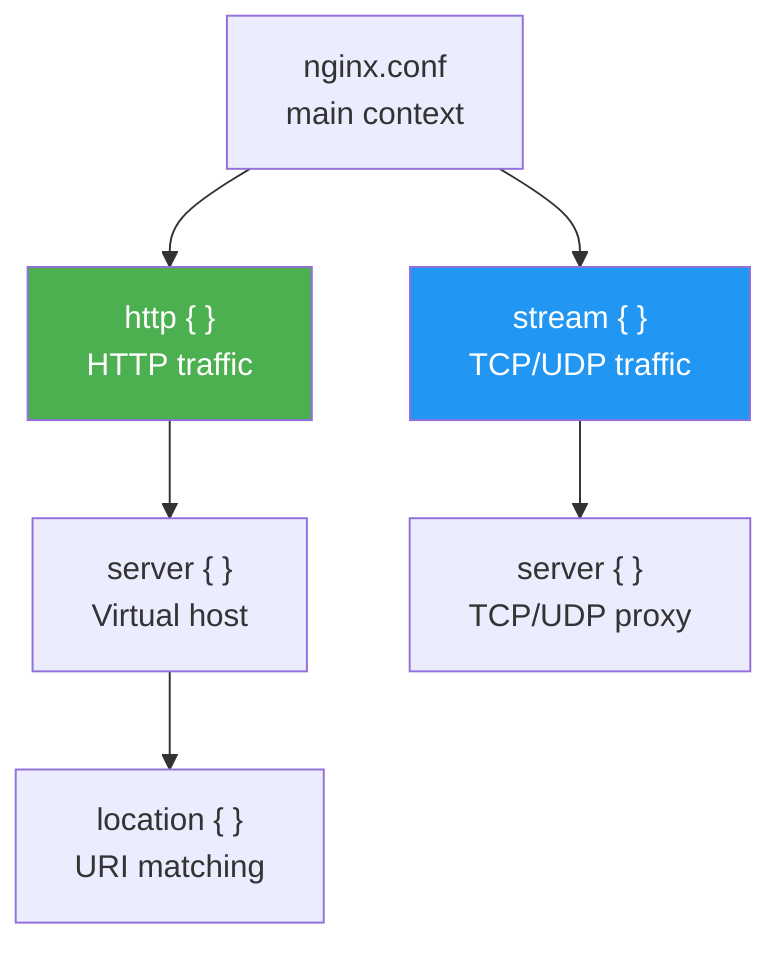

# 7.2.3 Advanced Nginx Patterns: Stream Proxy, PHP-FPM, sub_filter, and Debugging

**Backlinks:** [7.2.1 — Reverse Proxy and Load Balancing](./7.2.1_Reverse_Proxy_and_Load_Balancing.md) | [7.2.2 — SSL Termination, Caching, Rate Limiting](./7.2.2_SSL_Termination_Caching_and_Rate_Limiting.md) | [7.2.5 — Subchapter 7.2 Review](./7.2.5_Subchapter_Review.md)

**Next note:** [7.2.4 — Nginx Cheatsheet and Module 7 Final Exam](./7.2.4_Nginx_Cheatsheet_and_Final_Exam.md)

---


### Nginx Block Types



## Why These Patterns Matter

Notes 7.2.1 and 7.2.2 covered the HTTP proxy layer. This note covers patterns that come up in real production systems but are often poorly understood:

- **`stream` block** — Nginx as a TCP/UDP load balancer (MySQL, Redis, gRPC, DNS)
- **PHP-FPM with `fastcgi_pass`** — How PHP applications actually run behind Nginx
- **`add_header` inheritance gotcha** — A silent bug that wipes security headers
- **`sub_filter`** — Rewrite response body content on the fly
- **Debugging Nginx** — How to diagnose configuration and runtime problems

---

## Part 1: `stream` Block — TCP and UDP Proxying

The `http` block handles HTTP/HTTPS traffic. The **`stream` block** handles raw TCP and UDP traffic — useful for load balancing databases, message queues, game servers, DNS, and any non-HTTP protocol.

> **Requirement:** The `stream` module must be compiled in (included in all official Nginx packages and Docker images).

### Basic TCP Proxy

```nginx
# /etc/nginx/nginx.conf  (top level — NOT inside http block)
stream {
    upstream mysql_cluster {
        server db1.internal:3306;
        server db2.internal:3306;
    }

    server {
        listen 3306;
        proxy_pass mysql_cluster;
    }
}
```

### TCP Load Balancing with Health Check

```nginx
stream {
    upstream redis_nodes {
        least_conn;
        server redis1:6379 max_fails=3 fail_timeout=10s;
        server redis2:6379 max_fails=3 fail_timeout=10s;
        server redis3:6379 backup;
    }

    server {
        listen 6379;
        proxy_pass redis_nodes;
        proxy_connect_timeout 5s;
        proxy_timeout 30s;      # Idle connection timeout (stream equivalent of proxy_read_timeout)
    }
}
```

### UDP Proxy (DNS Load Balancing)

```nginx
stream {
    upstream dns_servers {
        server 8.8.8.8:53;
        server 8.8.4.4:53;
    }

    server {
        listen 53 udp;          # udp keyword required for UDP
        proxy_pass dns_servers;
        proxy_responses 1;      # Expected number of UDP response datagrams per request
        proxy_timeout 5s;
    }
}
```

### SSL Passthrough (SNI-based Routing)

For TLS traffic where you want the backend to handle SSL (not Nginx), use `ssl_preread` to inspect the SNI without decrypting:

```nginx
stream {
    map $ssl_preread_server_name $backend {
        api.example.com   api_servers;
        app.example.com   app_servers;
        default           default_servers;
    }

    upstream api_servers {
        server 10.0.0.1:443;
        server 10.0.0.2:443;
    }

    upstream app_servers {
        server 10.0.0.3:443;
    }

    server {
        listen 443;
        ssl_preread on;         # Read SNI without decrypting
        proxy_pass $backend;
    }
}
```

### `stream` vs `http` Block — Comparison

| Feature | `http` block | `stream` block |
|---------|-------------|----------------|
| Protocol | HTTP/HTTPS | TCP/UDP (any protocol) |
| Load balancing | ✅ | ✅ |
| SSL termination | ✅ | ✅ (with `ssl` param) |
| SSL passthrough | ❌ | ✅ (with `ssl_preread`) |
| Content inspection | ✅ (headers, body) | ❌ (opaque bytes) |
| Caching | ✅ | ❌ |
| Rate limiting | ✅ | ✅ (connections only) |
| Use cases | Websites, APIs | DB, Redis, gRPC, DNS, MQTT |

---

## Part 2: PHP-FPM with `fastcgi_pass`

When running PHP applications (WordPress, Laravel, Symfony), Nginx does **not** execute PHP itself. Instead, it forwards PHP requests to **PHP-FPM** (FastCGI Process Manager) via the FastCGI protocol.

### How It Works

```
Client → Nginx (HTTP) → PHP-FPM (FastCGI) → PHP script → Response
```

- Nginx receives the HTTP request
- Nginx matches `.php` files in a `location` block
- Nginx forwards via `fastcgi_pass` to PHP-FPM's Unix socket or TCP port
- PHP-FPM executes the PHP script and returns the output
- Nginx sends the response back to the client

### Basic PHP-FPM Configuration

```nginx
server {
    listen 80;
    server_name php-app.example.com;
    root /var/www/php-app;
    index index.php index.html;

    # Serve static files directly
    location / {
        try_files $uri $uri/ /index.php?$args;
    }

    # Forward .php files to PHP-FPM
    location ~ \.php$ {
        # Security: don't process PHP in upload directories
        try_files $uri =404;

        fastcgi_pass unix:/var/run/php/php8.2-fpm.sock;  # Unix socket (faster)
        # fastcgi_pass 127.0.0.1:9000;                   # TCP (alternative)

        fastcgi_index index.php;
        fastcgi_param SCRIPT_FILENAME $document_root$fastcgi_script_name;
        include fastcgi_params;  # Standard FastCGI parameters (/etc/nginx/fastcgi_params)
    }

    # Deny direct access to .htaccess files
    location ~ /\.ht {
        deny all;
    }
}
```

### Key `fastcgi_param` Variables

| Parameter | Value | Purpose |
|-----------|-------|---------|
| `SCRIPT_FILENAME` | `$document_root$fastcgi_script_name` | **Required** — full filesystem path of the PHP file |
| `QUERY_STRING` | `$query_string` | URL query string |
| `REQUEST_METHOD` | `$request_method` | GET, POST, etc. |
| `CONTENT_TYPE` | `$content_type` | Request Content-Type |
| `CONTENT_LENGTH` | `$content_length` | Request body size |

> **The most common PHP-FPM mistake:** Forgetting `$document_root` in `SCRIPT_FILENAME`. If you write just `$fastcgi_script_name`, PHP gets a relative path and returns a blank page.

### FastCGI Caching for PHP (WordPress/Laravel)

```nginx
# Define cache (in http block)
fastcgi_cache_path /var/cache/nginx/fastcgi levels=1:2 keys_zone=php_cache:100m inactive=60m;
fastcgi_cache_key "$scheme$request_method$host$request_uri";

server {
    # Cache bypass: don't cache logged-in users or POST requests
    set $skip_cache 0;
    if ($request_method = POST)         { set $skip_cache 1; }
    if ($query_string != "")            { set $skip_cache 1; }
    if ($cookie_wordpress_logged_in)    { set $skip_cache 1; }
    if ($cookie_PHPSESSID)              { set $skip_cache 1; }

    location ~ \.php$ {
        fastcgi_pass unix:/var/run/php/php8.2-fpm.sock;
        fastcgi_param SCRIPT_FILENAME $document_root$fastcgi_script_name;
        include fastcgi_params;

        fastcgi_cache php_cache;
        fastcgi_cache_valid 200 302 60m;
        fastcgi_cache_valid 404 1m;
        fastcgi_cache_bypass $skip_cache;
        fastcgi_no_cache $skip_cache;
        add_header X-FastCGI-Cache $upstream_cache_status;
    }
}
```

### PHP-FPM Pool Configuration (`/etc/php/8.2/fpm/pool.d/www.conf`)

```ini
[www]
user = www-data
group = www-data

; Unix socket (faster than TCP)
listen = /var/run/php/php8.2-fpm.sock
listen.owner = www-data
listen.group = www-data

; Process manager
pm = dynamic
pm.max_children = 50
pm.start_servers = 5
pm.min_spare_servers = 5
pm.max_spare_servers = 10
pm.max_requests = 500     ; Restart worker after N requests (prevents memory leaks)
```

---

## Part 3: `add_header` Inheritance Gotcha

This is one of the most common silent bugs in Nginx configurations. **When a child block (`location` or nested `server`) defines even one `add_header` directive, ALL `add_header` directives from parent blocks are completely ignored for that child.**

### The Trap

```nginx
server {
    # Parent security headers
    add_header X-Frame-Options "SAMEORIGIN" always;
    add_header X-Content-Type-Options "nosniff" always;
    add_header Strict-Transport-Security "max-age=31536000" always;

    location / {
        try_files $uri $uri/ =404;
        # No add_header here → inherits all 3 parent headers ✅
    }

    location /api/ {
        add_header X-Cache-Status $upstream_cache_status always;  # Add one header
        proxy_pass http://backend;
        # BUG: X-Frame-Options, X-Content-Type-Options, HSTS are ALL GONE ❌
        # Only X-Cache-Status is sent for /api/ responses
    }
}
```

### Why This Happens

Nginx's `add_header` inheritance model: headers are inherited from the parent **only if the current level defines zero `add_header` directives**. The moment you add any `add_header` in a child block, the parent's headers are no longer inherited.

### The Fix: Repeat All Headers

```nginx
server {
    location /api/ {
        # Must repeat all security headers when adding any new header
        add_header X-Frame-Options "SAMEORIGIN" always;
        add_header X-Content-Type-Options "nosniff" always;
        add_header Strict-Transport-Security "max-age=31536000" always;
        add_header X-Cache-Status $upstream_cache_status always;   # New header
        proxy_pass http://backend;
    }
}
```

### Better Fix: Use `include` for Reusable Header Snippets

```nginx
# /etc/nginx/snippets/security-headers.conf
add_header X-Frame-Options "SAMEORIGIN" always;
add_header X-Content-Type-Options "nosniff" always;
add_header Strict-Transport-Security "max-age=31536000; includeSubDomains" always;
add_header Referrer-Policy "strict-origin-when-cross-origin" always;
add_header X-XSS-Protection "1; mode=block" always;
```

```nginx
server {
    location / {
        include snippets/security-headers.conf;
        try_files $uri $uri/ =404;
    }

    location /api/ {
        include snippets/security-headers.conf;    # Include all base headers
        add_header X-Cache-Status $upstream_cache_status always;  # Add extra
        proxy_pass http://backend;
    }
}
```

> **Rule:** Every location that uses `add_header` must explicitly include **all** desired headers. Never rely on parent `add_header` inheritance when the child has its own.

---

## Part 4: `sub_filter` — Rewrite Response Body

`sub_filter` performs a string search-and-replace on the response body as it passes through Nginx. Useful for URL rewriting in proxied responses, injecting content, or fixing hardcoded references.

> **Requirement:** The `ngx_http_sub_module` must be compiled in (included in most Nginx packages).

```nginx
location / {
    proxy_pass http://backend;

    # Replace http:// links with https:// in HTML responses
    sub_filter 'http://old-domain.com' 'https://new-domain.com';
    sub_filter_once off;   # Replace ALL occurrences (not just first)

    # Only apply to HTML responses
    sub_filter_types text/html text/css application/javascript;
}
```

### Inject Analytics Script into Every HTML Page

```nginx
location / {
    proxy_pass http://backend;

    sub_filter '</body>' '<script src="/analytics.js"></script></body>';
    sub_filter_once on;   # Only inject once per page
    sub_filter_types text/html;

    # Required: disable compression on the proxied response before sub_filter
    proxy_set_header Accept-Encoding "";
}
```

> **Important:** `sub_filter` cannot work on compressed responses. You must tell the upstream not to send gzip by removing the `Accept-Encoding` header with `proxy_set_header Accept-Encoding ""`.

### `sub_filter` Directives

| Directive | Default | Purpose |
|-----------|---------|---------|
| `sub_filter old new` | — | Replace `old` with `new` in response body |
| `sub_filter_once on/off` | `on` | Replace first occurrence only (`on`) or all (`off`) |
| `sub_filter_types` | `text/html` | MIME types to apply substitution to |
| `sub_filter_last_modified` | `off` | Preserve `Last-Modified` header |

---

## Part 5: Debugging Nginx

When Nginx behaves unexpectedly, these tools and techniques help diagnose the problem.

### Level 1: Syntax and Configuration Check

```bash
# Test configuration without restarting
sudo nginx -t

# Show fully expanded configuration (all includes merged)
sudo nginx -T

# Show Nginx binary info and compiled modules
nginx -V 2>&1 | tr ' ' '\n'
```

### Level 2: Error Log Analysis

```bash
# Tail the error log in real-time
sudo tail -f /var/log/nginx/error.log

# Filter by severity
sudo grep "\[error\]" /var/log/nginx/error.log
sudo grep "\[crit\]"  /var/log/nginx/error.log
sudo grep "\[warn\]"  /var/log/nginx/error.log

# Check access log for status codes
sudo awk '{print $9}' /var/log/nginx/access.log | sort | uniq -c | sort -rn
# Output: count of each HTTP status code (200, 404, 502, etc.)
```

### Log Levels

| Level | Meaning |
|-------|---------|
| `debug` | Detailed debugging (very verbose) |
| `info` | Informational messages |
| `notice` | Normal but significant events |
| `warn` | Warnings |
| `error` | Request processing errors |
| `crit` | Critical — requires immediate attention |
| `alert` | Alert |
| `emerg` | Emergency — Nginx cannot function |

```nginx
# Set error log level
error_log /var/log/nginx/error.log warn;    # Default: only warn and above
error_log /var/log/nginx/error.log debug;   # Full debug (only in testing — extremely verbose)
```

### Level 3: Debug Logging for a Specific IP

Instead of enabling `debug` globally (which floods logs), enable it only for connections from a specific IP:

```nginx
events {
    debug_connection 192.168.1.100;   # Debug only requests from this IP
    debug_connection 10.0.0.0/8;      # Debug entire subnet
}
```

### Level 4: `curl` for Request Inspection

```bash
# Show response headers
curl -I https://example.com

# Show full request + response headers (verbose)
curl -v https://example.com

# Test with specific Host header (virtual hosting)
curl -H "Host: example.com" http://10.0.0.5/

# Follow redirects
curl -L http://example.com

# Check cache status header
curl -sI https://example.com/api/data | grep -i cache

# Time each phase
curl -w "DNS: %{time_namelookup}s\nConnect: %{time_connect}s\nTTFB: %{time_starttransfer}s\nTotal: %{time_total}s\n" \
     -o /dev/null -s https://example.com
```

### Level 5: Common Errors and Fixes

| Error | Cause | Fix |
|-------|-------|-----|
| `502 Bad Gateway` | Backend not running or unreachable | Check backend: `curl http://localhost:3000`; check `proxy_read_timeout` |
| `504 Gateway Timeout` | Backend too slow | Increase `proxy_read_timeout` |
| `413 Request Entity Too Large` | Body exceeds `client_max_body_size` | Increase `client_max_body_size` |
| `403 Forbidden` | File permissions or `deny all` rule | Check `ls -la /var/www`; check allow/deny order |
| `404 Not Found` | Wrong `root`, wrong `try_files`, or file doesn't exist | Check `nginx -T` for active `root`; verify file path |
| `[emerg] bind() to 0.0.0.0:80 failed (98: Address already in use)` | Another process using port 80 | `sudo ss -tlnp | grep :80`; kill conflicting process |
| `[emerg] "worker_processes" directive duplicate` | Config included twice | `nginx -T` to find duplicate |
| `upstream timed out (110: Connection timed out)` | Backend unresponsive | Check backend health; adjust `proxy_connect_timeout` |

### Level 6: `strace` and `lsof` for Deep Debugging

```bash
# Find Nginx worker PID
pgrep -a nginx

# What files is an Nginx worker using?
sudo lsof -p <worker_pid> | grep -E "log|conf|sock"

# Trace system calls of an Nginx worker (shows every file/network operation)
sudo strace -p <worker_pid> -e trace=network,file 2>&1 | head -50
```

---

## Part 6: `resolver` Directive — DNS for Upstream

When `proxy_pass` uses a variable (e.g., `proxy_pass http://$backend`), Nginx needs to resolve the hostname at runtime. By default, Nginx only resolves upstream hostnames at startup — if the IP changes, Nginx doesn't pick it up. The `resolver` directive enables runtime DNS.

```nginx
http {
    resolver 8.8.8.8 8.8.4.4 valid=30s;   # Re-resolve every 30 seconds
    resolver_timeout 5s;

    server {
        set $upstream "api.example.com";

        location / {
            proxy_pass http://$upstream;    # Variable → requires resolver
        }
    }
}
```

> **Why it matters in Kubernetes:** When backend pods are recreated, their IPs change. If using a Kubernetes Service DNS name in `proxy_pass` with a variable, the `resolver` directive ensures Nginx picks up the new IPs without a restart.

---

## Quick Task: Debug a Broken Configuration

*Diagnose and fix a broken Nginx setup.*

1. Intentionally introduce a syntax error in your Nginx config.
2. Use `nginx -t` to identify the error.
3. Enable `debug` logging for your local IP.
4. Test a request and review the debug log.
5. Fix the error and reload Nginx.

> **Ready Solution:**
>
> ```bash
> # Task 1: Introduce error
> echo "bad directive;" | sudo tee -a /etc/nginx/nginx.conf
>
> # Task 2: Detect error
> sudo nginx -t
> # nginx: [emerg] unknown directive "bad" ...
>
> # Task 3: Revert the error
> sudo sed -i '/^bad directive;$/d' /etc/nginx/nginx.conf
>
> # Task 4: Enable debug logging (temporary)
> sudo tee /etc/nginx/conf.d/debug.conf << 'EOF'
> events {
>     debug_connection 127.0.0.1;
> }
> EOF
>
> # Actually set error_log to debug level in a test server block
> sudo tee /etc/nginx/conf.d/debug-test.conf << 'EOF'
> server {
>     listen 8080;
>     error_log /var/log/nginx/debug.log debug;
>     location / {
>         return 200 "debug test\n";
>     }
> }
> EOF
>
> sudo nginx -t && sudo systemctl reload nginx
>
> # Task 4: Generate request and review
> curl http://localhost:8080/
> sudo tail -20 /var/log/nginx/debug.log
>
> # Task 5: Clean up
> sudo rm /etc/nginx/conf.d/debug.conf /etc/nginx/conf.d/debug-test.conf
> sudo nginx -t && sudo systemctl reload nginx
> ```

---

## Summary Table: Advanced Patterns

### `stream` Block Quick Reference

| Directive | Purpose | Example |
|-----------|---------|---------|
| `stream { }` | Top-level TCP/UDP block | Outside `http {}` |
| `listen PORT` | TCP port | `listen 3306` |
| `listen PORT udp` | UDP port | `listen 53 udp` |
| `proxy_pass upstream` | Forward to upstream | `proxy_pass mysql_cluster` |
| `proxy_timeout` | Idle connection timeout | `proxy_timeout 30s` |
| `ssl_preread on` | Read SNI without decrypting | `ssl_preread on` |

### FastCGI Quick Reference

| Directive | Purpose |
|-----------|---------|
| `fastcgi_pass` | Forward to PHP-FPM | `unix:/var/run/php/php8.2-fpm.sock` |
| `fastcgi_param SCRIPT_FILENAME` | Full PHP file path — **must include `$document_root`** |
| `include fastcgi_params` | Standard FastCGI environment variables |
| `fastcgi_cache` | Enable FastCGI response caching |

### `add_header` Inheritance Rule

```
Parent has headers A, B, C
Child has NO add_header     → inherits A, B, C   ✅
Child adds header D         → only D is sent      ❌ (A, B, C dropped silently)
Child adds include + D      → A, B, C, D sent     ✅
```

### Debugging Commands

| Command | Purpose |
|---------|---------|
| `sudo nginx -t` | Test config syntax |
| `sudo nginx -T` | Show full expanded config |
| `sudo tail -f /var/log/nginx/error.log` | Watch errors live |
| `curl -v https://example.com` | Full request/response trace |
| `curl -I https://example.com` | Response headers only |
| `sudo lsof -p $(pgrep nginx)` | Files open by Nginx |

---

**Next note:** [7.2.4 — Nginx Cheatsheet and Module 7 Final Exam](./7.2.4_Nginx_Cheatsheet_and_Final_Exam.md) — complete command and directive reference, 6 scenario exam questions, module completion checklist.
