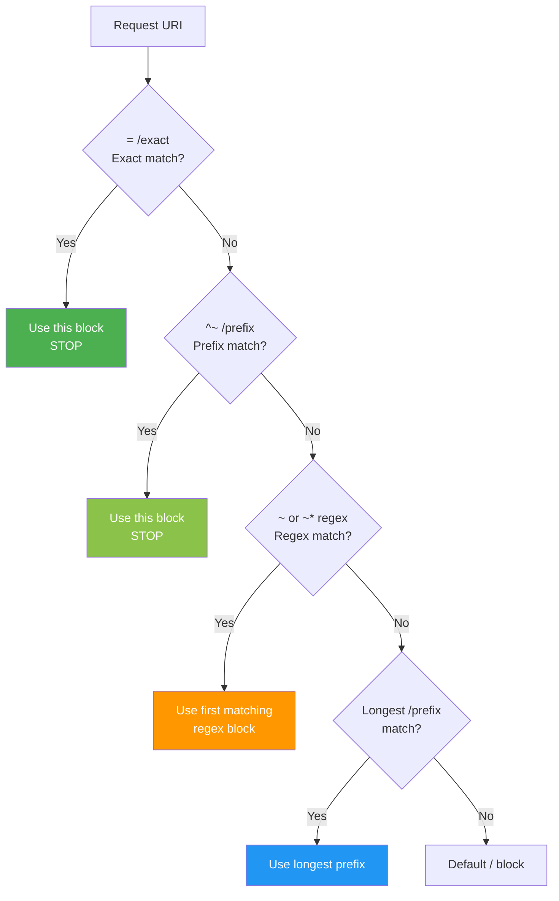

# 7.2.4 Complete Nginx Cheatsheet and Module 7 Final Exam

**Backlinks:** [7.2.1 — Reverse Proxy](./7.2.1_Reverse_Proxy_and_Load_Balancing.md) | [7.2.2 — SSL, Caching, Rate Limiting](./7.2.2_SSL_Termination_Caching_and_Rate_Limiting.md) | [7.2.3 — Advanced Nginx Patterns](./7.2.3_Advanced_Nginx_Patterns.md) | [7.1.3 — Rewrites, Variables, Access Control](../Subchapter_7.1/7.1.3_Rewrites_Variables_Access_Control_and_Essential_Directives.md) | [7.2.5 — Subchapter 7.2 Review](./7.2.5_Subchapter_Review.md)

**Next note:** [7.2.5 — Subchapter 7.2 Review](./7.2.5_Subchapter_Review.md)

This note is the complete **Module 7 Nginx cheatsheet** covering all directives and concepts from Subchapters 7.1–7.2, followed by the **Final Exam** with scenario-based questions.

---

### Location Matching Priority



## Part 1: Complete Nginx Command Reference

### 1.1 System Commands

```bash
# Service management
sudo systemctl start nginx
sudo systemctl stop nginx
sudo systemctl restart nginx        # Brief downtime
sudo systemctl reload nginx         # Zero-downtime config reload
sudo systemctl enable nginx         # Start on boot
sudo systemctl status nginx

# Nginx binary signals
sudo nginx -s reload                # Graceful reload (no downtime)
sudo nginx -s quit                  # Graceful shutdown (drain connections)
sudo nginx -s stop                  # Fast shutdown
sudo nginx -s reopen                # Reopen log files (log rotation)

# Configuration inspection
sudo nginx -t                       # Test config syntax
sudo nginx -T                       # Show full expanded config (all includes)
nginx -v                            # Show Nginx version
nginx -V                            # Show version + compiled modules + build flags

# CLI overrides (essential for Docker / container deployments)
nginx -g 'daemon off;'              # Set global directive from CLI (Docker foreground mode)
nginx -g 'worker_processes 4;'      # Override worker count without editing config
nginx -e /dev/stderr                # Send error log to stderr (container logging)
nginx -c /custom/path/nginx.conf    # Use a custom config file path

# Process inspection
ps aux | grep nginx                 # List Nginx processes
pgrep -a nginx                      # PIDs only
```

### 1.2 Configuration File Locations

| Distribution | Main Config | Sites Available | Sites Enabled | Conf.d |
|-------------|-------------|-----------------|---------------|--------|
| Debian/Ubuntu | `/etc/nginx/nginx.conf` | `/etc/nginx/sites-available/` | `/etc/nginx/sites-enabled/` | `/etc/nginx/conf.d/` |
| RHEL/Rocky/AlmaLinux | `/etc/nginx/nginx.conf` | `/etc/nginx/conf.d/` | (same) | `/etc/nginx/conf.d/` |
| Docker (official image) | `/etc/nginx/nginx.conf` | — | — | `/etc/nginx/conf.d/` |

```bash
# Enable a site (Debian/Ubuntu)
sudo ln -s /etc/nginx/sites-available/mysite /etc/nginx/sites-enabled/

# Test and reload
sudo nginx -t && sudo systemctl reload nginx
```

### Docker / Container Patterns

In containers, Nginx must run in the **foreground** (not as a daemon) and log to **stdout/stderr** (not files):

```dockerfile
# Official Nginx Docker image already handles this, but for custom images:
FROM nginx:1.25-alpine

# Logs → stdout/stderr (container logging best practice)
RUN ln -sf /dev/stdout /var/log/nginx/access.log \
 && ln -sf /dev/stderr /var/log/nginx/error.log

# Inject config via volume or COPY
COPY nginx.conf /etc/nginx/nginx.conf
COPY conf.d/ /etc/nginx/conf.d/

# Foreground mode
CMD ["nginx", "-g", "daemon off;"]
```

```bash
# Override config at runtime with environment variables + envsubst
# Dockerfile:
CMD ["/bin/sh", "-c", "envsubst '$$BACKEND_HOST $$BACKEND_PORT' < /etc/nginx/templates/default.conf.template > /etc/nginx/conf.d/default.conf && nginx -g 'daemon off;'"]
```

| CLI Flag | Purpose | Docker Use Case |
|----------|---------|-----------------|
| `nginx -g 'daemon off;'` | Run in foreground | Required — container must stay running |
| `nginx -e /dev/stderr` | Errors to stderr | Container log collection (Fluentd, CloudWatch) |
| `nginx -c /custom/nginx.conf` | Custom config path | Mount config via volume at non-standard path |
| `nginx -g 'worker_processes 2;'` | Override directive | Tune workers per container CPU limit |

---

## Part 2: Configuration Structure Cheatsheet

### 2.1 Full Config Skeleton

```nginx
# /etc/nginx/nginx.conf
user www-data;
worker_processes auto;
worker_rlimit_nofile 65536;
pid /run/nginx.pid;

events {
    worker_connections 4096;
    use epoll;
    multi_accept on;
}

# TCP/UDP proxying (stream module)
stream {
    # TCP/UDP load balancing here
}

http {
    # MIME types
    include /etc/nginx/mime.types;
    default_type application/octet-stream;

    # Performance
    sendfile on;
    tcp_nopush on;
    tcp_nodelay on;
    keepalive_timeout 65;
    open_file_cache max=10000 inactive=30s;

    # Security
    server_tokens off;
    client_max_body_size 10m;

    # Logging
    access_log /var/log/nginx/access.log;
    error_log  /var/log/nginx/error.log warn;

    # Compression
    gzip on;
    gzip_comp_level 6;
    gzip_types text/plain text/css text/xml text/javascript application/json application/javascript;

    # Rate limiting zones
    limit_req_zone $binary_remote_addr zone=api:10m rate=10r/s;
    limit_conn_zone $binary_remote_addr zone=conn:10m;

    # Cache paths
    proxy_cache_path /var/cache/nginx levels=1:2 keys_zone=web_cache:100m max_size=10g;

    # Variable mapping
    map $http_user_agent $is_mobile {
        default 0;
        ~*iPhone 1;
        ~*Android 1;
    }

    # Upstream pools
    upstream backend {
        least_conn;
        server 10.0.0.1:8080 max_fails=3 fail_timeout=30s;
        server 10.0.0.2:8080 max_fails=3 fail_timeout=30s;
        server 10.0.0.3:8080 backup;
        keepalive 32;
    }

    # Virtual hosts
    include /etc/nginx/conf.d/*.conf;
    include /etc/nginx/sites-enabled/*;
}
```

### 2.2 Server Block Patterns

```nginx
# Pattern 1: Static website
server {
    listen 80;
    server_name example.com www.example.com;
    root /var/www/example;
    index index.html;

    location / { try_files $uri $uri/ =404; }

    location ~* \.(css|js|jpg|png|gif|ico|woff2)$ {
        expires 1y;
        add_header Cache-Control "public, immutable";
        access_log off;
    }
}

# Pattern 2: HTTP → HTTPS redirect
server {
    listen 80;
    server_name _;               # Catch-all
    return 301 https://$host$request_uri;
}

# Pattern 3: HTTPS reverse proxy
server {
    listen 443 ssl http2;
    server_name api.example.com;

    ssl_certificate     /etc/letsencrypt/live/example.com/fullchain.pem;
    ssl_certificate_key /etc/letsencrypt/live/example.com/privkey.pem;
    ssl_protocols TLSv1.2 TLSv1.3;
    ssl_session_cache shared:SSL:10m;
    ssl_stapling on;
    ssl_stapling_verify on;
    ssl_trusted_certificate /etc/letsencrypt/live/example.com/chain.pem;
    resolver 8.8.8.8 valid=300s;

    add_header Strict-Transport-Security "max-age=31536000; includeSubDomains" always;
    add_header X-Frame-Options "SAMEORIGIN" always;
    add_header X-Content-Type-Options "nosniff" always;

    location / {
        proxy_pass http://backend;
        proxy_http_version 1.1;
        proxy_set_header Connection "";
        proxy_set_header Host $host;
        proxy_set_header X-Real-IP $remote_addr;
        proxy_set_header X-Forwarded-For $proxy_add_x_forwarded_for;
        proxy_set_header X-Forwarded-Proto $scheme;
        proxy_next_upstream error timeout http_502 http_503;
        proxy_connect_timeout 5s;
        proxy_read_timeout 60s;
    }
}
```

---

## Part 3: Directives Quick Reference

### 3.1 Core / Main Block

| Directive | Purpose | Example |
|-----------|---------|---------|
| `worker_processes` | Worker count | `auto` |
| `worker_rlimit_nofile` | File descriptor limit per worker | `65536` |
| `worker_connections` | Max connections per worker | `4096` |
| `use` | Event model | `epoll` (Linux) |
| `multi_accept` | Accept all pending connections at once | `on` |
| `pid` | PID file path | `/run/nginx.pid` |

### 3.2 HTTP Performance

| Directive | Purpose | Default | Recommended |
|-----------|---------|---------|-------------|
| `sendfile` | Efficient file transfer | `off` | `on` |
| `tcp_nopush` | Send headers + file in one packet | `off` | `on` (with sendfile) |
| `tcp_nodelay` | No Nagle algorithm delay | `off` | `on` |
| `keepalive_timeout` | Idle connection lifetime | `75s` | `65s` |
| `open_file_cache` | Cache file descriptors in memory | `off` | `max=10000 inactive=30s` |
| `gzip` | Response compression | `off` | `on` |
| `gzip_comp_level` | Compression level (1–9) | `1` | `6` |

### 3.3 Static Serving

| Directive | Purpose | Example |
|-----------|---------|---------|
| `root` | Document root (appends URI) | `root /var/www/html` |
| `alias` | Path replacement (replaces URI) | `alias /var/www/static/` |
| `index` | Default files for directory | `index index.html` |
| `try_files` | Try files in order | `try_files $uri $uri/ =404` |
| `error_page` | Custom error pages | `error_page 404 /404.html` |
| `expires` | Cache expiry header | `expires 1y` |
| `autoindex` | Directory listing | `autoindex on` |
| `internal` | Block direct client access | `internal` |

### 3.4 Location Matching Priority

| Priority | Type | Syntax | Stop Regex? |
|----------|------|--------|-------------|
| 1 | Exact | `= /path` | Yes |
| 2 | Preferential prefix | `^~ /path` | Yes |
| 3 | Regex (case-sensitive) | `~ pattern` | No |
| 4 | Regex (case-insensitive) | `~* pattern` | No |
| 5 | Prefix (longest wins) | `/path` | No |

### 3.5 Rewrites and Redirects

| Directive | Purpose | Example |
|-----------|---------|---------|
| `return code URL` | Fast redirect or response | `return 301 https://$host$request_uri` |
| `rewrite regex repl` | Pattern-based URL rewrite | `rewrite ^/old/(.*)$ /new/$1 permanent` |
| `rewrite ... last` | Rewrite + restart location lookup | `rewrite ^/(.*)$ /$1.html last` |
| `rewrite ... break` | Rewrite + continue in current location | `rewrite ^/dl/(.*)$ /files/$1 break` |

### 3.6 Access Control and Security

| Directive | Purpose | Example |
|-----------|---------|---------|
| `allow` | Allow IP/CIDR | `allow 192.168.1.0/24` |
| `deny` | Deny IP/CIDR | `deny all` |
| `auth_basic` | HTTP Basic Auth prompt | `auth_basic "Restricted"` |
| `auth_basic_user_file` | Path to htpasswd file | `/etc/nginx/.htpasswd` |
| `limit_except` | Restrict HTTP methods | `limit_except GET { deny all; }` |
| `server_tokens` | Hide Nginx version | `server_tokens off` |
| `client_max_body_size` | Max upload size | `client_max_body_size 50m` |

### 3.7 Reverse Proxy

| Directive | Purpose | Example |
|-----------|---------|---------|
| `proxy_pass` | Forward to backend | `proxy_pass http://backend:8080` |
| `proxy_set_header` | Modify request headers | `proxy_set_header Host $host` |
| `proxy_http_version` | HTTP version to use | `proxy_http_version 1.1` |
| `proxy_buffering` | Buffer backend responses | `proxy_buffering off` |
| `proxy_connect_timeout` | Backend connect timeout | `5s` |
| `proxy_read_timeout` | Backend read timeout | `60s` |
| `proxy_next_upstream` | Retry conditions | `error timeout http_502` |
| `proxy_intercept_errors` | Use Nginx error pages for backend errors | `on` |

### 3.8 Load Balancing

| Algorithm | Directive | Use Case |
|-----------|-----------|----------|
| Round Robin | (default) | Equal capacity servers |
| Least Connections | `least_conn;` | Variable-length requests |
| IP Hash | `ip_hash;` | Sticky sessions without cookies |
| Random | `random two least_conn;` | Very large pools |
| Generic Hash | `hash $request_uri consistent;` | Cache affinity |

| Server Option | Default | Purpose |
|--------------|---------|---------|
| `weight=N` | 1 | Traffic weight multiplier |
| `max_fails=N` | 1 | Failures before marking down |
| `fail_timeout=N` | 10s | Down duration + failure window |
| `backup` | — | Use only when all primary servers fail |
| `down` | — | Permanently mark as down |
| `max_conns=N` | — | Max simultaneous connections |
| `keepalive N` | — | Idle connection pool size |

### 3.9 SSL/TLS

| Directive | Purpose | Example |
|-----------|---------|---------|
| `ssl_certificate` | Certificate chain | `/etc/letsencrypt/.../fullchain.pem` |
| `ssl_certificate_key` | Private key | `/etc/letsencrypt/.../privkey.pem` |
| `ssl_protocols` | Allowed TLS versions | `TLSv1.2 TLSv1.3` |
| `ssl_ciphers` | Cipher suites | `ECDHE-RSA-AES128-GCM-SHA256:...` |
| `ssl_session_cache` | Session cache | `shared:SSL:10m` |
| `ssl_session_timeout` | Session lifetime | `10m` |
| `ssl_stapling` | OCSP stapling | `on` |
| `ssl_stapling_verify` | Verify OCSP response | `on` |
| `ssl_trusted_certificate` | CA chain for OCSP | `/path/to/chain.pem` |

### 3.10 Caching

| Directive | Purpose | Example |
|-----------|---------|---------|
| `proxy_cache_path` | Define cache | `levels=1:2 keys_zone=cache:100m max_size=10g` |
| `proxy_cache` | Enable cache for location | `proxy_cache web_cache` |
| `proxy_cache_key` | Cache lookup key | `"$scheme$request_method$host$uri"` |
| `proxy_cache_valid` | TTL per status code | `200 302 60m; 404 1m` |
| `proxy_cache_bypass` | Bypass conditions | `$http_cache_control` |
| `proxy_no_cache` | Don't save to cache | `$cookie_session` |
| `$upstream_cache_status` | HIT / MISS / BYPASS / EXPIRED | `add_header X-Cache $upstream_cache_status` |

### 3.11 Rate Limiting

| Directive | Purpose | Example |
|-----------|---------|---------|
| `limit_req_zone` | Define zone | `$binary_remote_addr zone=api:10m rate=10r/s` |
| `limit_req` | Apply to location | `limit_req zone=api burst=20 nodelay` |
| `limit_req_status` | Status code on limit | `429` |
| `limit_conn_zone` | Connection limit zone | `$binary_remote_addr zone=conn:10m` |
| `limit_conn` | Apply connection limit | `limit_conn conn 10` |

### 3.12 Advanced Patterns

| Directive | Purpose | Example |
|-----------|---------|---------|
| `fastcgi_pass` | Forward to PHP-FPM | `unix:/var/run/php/php8.2-fpm.sock` |
| `fastcgi_param SCRIPT_FILENAME` | PHP file path | `$document_root$fastcgi_script_name` |
| `sub_filter old new` | Rewrite response body | `sub_filter 'http://' 'https://'` |
| `sub_filter_once` | Replace first or all | `off` (all occurrences) |
| `resolver` | DNS for variable upstreams | `resolver 8.8.8.8 valid=30s` |
| `map $src $dst` | Variable mapping | Replaces chains of `if` |

### 3.13 Security Headers Quick Reference

```nginx
add_header Strict-Transport-Security "max-age=31536000; includeSubDomains; preload" always;
add_header X-Frame-Options "SAMEORIGIN" always;
add_header X-Content-Type-Options "nosniff" always;
add_header X-XSS-Protection "1; mode=block" always;
add_header Referrer-Policy "strict-origin-when-cross-origin" always;
add_header Content-Security-Policy "default-src 'self'" always;
add_header Permissions-Policy "geolocation=(), microphone=(), camera=()" always;
```

> ⚠️ **Remember:** Any `add_header` in a child location block **drops all parent `add_header` directives**. Use `include snippets/security-headers.conf` to avoid repetition.

---

## Part 4: Variables Quick Reference

| Variable | Value |
|----------|-------|
| `$uri` | Normalised URI (no query string) |
| `$request_uri` | Full URI with query string |
| `$args` | Query string |
| `$arg_NAME` | Specific query param value |
| `$request_method` | GET, POST, DELETE, etc. |
| `$remote_addr` | Client IP (string) |
| `$binary_remote_addr` | Client IP (binary — use in zones) |
| `$scheme` | `http` or `https` |
| `$host` | Host header value |
| `$server_name` | Matched server_name |
| `$http_NAME` | Any request header (dashes → underscores) |
| `$document_root` | Active root directive value |
| `$request_filename` | Full filesystem path of requested file |
| `$upstream_cache_status` | HIT / MISS / BYPASS / EXPIRED / UPDATING |
| `$upstream_response_time` | Time for backend to respond |
| `$sent_http_NAME` | Response header being sent |

---

## Part 5: Common Configuration Patterns

### Pattern: Multi-Tenant Subdomain Routing

```nginx
map $host $tenant {
    default          "default";
    ~^(\w+)\.app     $1;        # Extract subdomain
}

server {
    listen 443 ssl http2;
    server_name ~^(?<sub>\w+)\.app\.example\.com$;

    location / {
        proxy_set_header X-Tenant $sub;
        proxy_pass http://backend;
    }
}
```

### Pattern: API Gateway with Multiple Backends

```nginx
upstream auth_svc  { server auth:8080;  keepalive 16; }
upstream user_svc  { server users:8080; keepalive 16; }
upstream order_svc { server orders:8080 weight=2; server orders2:8080; keepalive 32; }

server {
    listen 443 ssl http2;

    location /auth/   { proxy_pass http://auth_svc/;  }
    location /users/  { proxy_pass http://user_svc/;  }
    location /orders/ { proxy_pass http://order_svc/; }

    location /health  { return 200 "ok\n"; access_log off; }
}
```

### Pattern: WordPress with FastCGI Cache

```nginx
fastcgi_cache_path /var/cache/nginx/wp levels=1:2 keys_zone=wp_cache:100m inactive=60m;

server {
    root /var/www/wordpress;

    set $skip_cache 0;
    if ($request_method = POST)          { set $skip_cache 1; }
    if ($query_string != "")             { set $skip_cache 1; }
    if ($cookie_wordpress_logged_in)     { set $skip_cache 1; }
    if ($request_uri ~* "/(wp-admin|wp-login)") { set $skip_cache 1; }

    location / { try_files $uri $uri/ /index.php?$args; }

    location ~ \.php$ {
        fastcgi_pass unix:/var/run/php/php8.2-fpm.sock;
        fastcgi_param SCRIPT_FILENAME $document_root$fastcgi_script_name;
        include fastcgi_params;
        fastcgi_cache wp_cache;
        fastcgi_cache_valid 200 60m;
        fastcgi_cache_bypass $skip_cache;
        fastcgi_no_cache $skip_cache;
        add_header X-Cache $upstream_cache_status;
    }
}
```

---

## Part 6: Module 7 Final Exam

### Question 1: Location Matching and Static Serving

**Scenario:** An Nginx server has the following configuration:

```nginx
server {
    listen 80;
    server_name shop.example.com;
    root /var/www/shop;

    location = /favicon.ico   { access_log off; expires 1y; }
    location ^~ /static/      { expires 30d; }
    location ~ \.php$         { fastcgi_pass unix:/run/php/php8.2-fpm.sock; include fastcgi_params; fastcgi_param SCRIPT_FILENAME $document_root$fastcgi_script_name; }
    location ~* \.(jpg|png)$  { expires 7d; }
    location /                { try_files $uri $uri/ /index.php?$args; }
}
```

**Questions:**
- a) Which location matches `/static/logo.png`? Why does the `.png` regex not match?
- b) Which location matches `/cart/checkout.php`?
- c) A user requests `/products` (no file extension). The file `/var/www/shop/products` does not exist, but `/var/www/shop/products/index.php` does. Trace the full `try_files` resolution.
- d) What is wrong with the `fastcgi_param SCRIPT_FILENAME` directive and what happens if `$document_root` is omitted?

**Answer:**

**a)** `location ^~ /static/` matches. The `^~` preferential prefix modifier tells Nginx: once this prefix matches, **stop checking regex locations**. The `~* \.(jpg|png)$` regex is never evaluated for paths under `/static/`.

**b)** `location ~ \.php$` matches. No exact match, no preferential prefix match. Nginx evaluates regex locations in order; `\.php$` matches `/cart/checkout.php`.

**c)** `try_files $uri $uri/ /index.php?$args` resolution for `/products`:
1. Check `/var/www/shop/products` → file does not exist
2. Check `/var/www/shop/products/` → directory exists
3. Nginx looks for `index` in that directory → finds `/var/www/shop/products/index.php`
4. Request is internally redirected to `/products/index.php`
5. This matches `location ~ \.php$` → forwarded to PHP-FPM

**d)** If `SCRIPT_FILENAME` is set to just `$fastcgi_script_name` (without `$document_root`), PHP-FPM receives a relative path like `/cart/checkout.php` instead of the absolute path `/var/www/shop/cart/checkout.php`. PHP cannot open the file and returns a blank response or "File not found" error.

---

### Question 2: Load Balancing and Health

**Scenario:** You have 3 backend servers. Server traffic distribution requirements:
- `app1:8080` should receive twice as much traffic as the others
- `app2:8080` should be a standard server
- `app3:8080` should only be used when both `app1` and `app2` fail
- Servers should be marked down after 3 failures within 20 seconds
- Each marked-down server should recover attempts after 60 seconds

**Question:** Write the complete `upstream` block. What is the default load balancing algorithm and why is it appropriate here? If you needed session stickiness, what would you change?

**Answer:**

```nginx
upstream app_pool {
    # Default: round-robin (appropriate for equal-ish response times)
    server app1:8080 weight=2 max_fails=3 fail_timeout=60s;
    server app2:8080 weight=1 max_fails=3 fail_timeout=60s;
    server app3:8080 backup;

    keepalive 32;
}
```

**Why round-robin is appropriate:** The servers have defined weights, so traffic is distributed 2:1:0(backup). Round-robin respects weights. If response times varied greatly, `least_conn` would be better.

**For session stickiness without cookies:**
```nginx
upstream app_pool {
    ip_hash;    # Replace round-robin with ip_hash
    server app1:8080 weight=2;
    server app2:8080;
    server app3:8080 backup;
}
```
`ip_hash` hashes the client's IP and always routes the same IP to the same backend (as long as it's up).

---

### Question 3: SSL, Security Headers, and the `add_header` Gotcha

**Scenario:** A team's production Nginx config has:

```nginx
server {
    listen 443 ssl;
    add_header X-Frame-Options "SAMEORIGIN" always;
    add_header X-Content-Type-Options "nosniff" always;
    add_header Strict-Transport-Security "max-age=31536000" always;

    location / {
        try_files $uri $uri/ =404;
    }

    location /api/ {
        add_header X-Cache-Status $upstream_cache_status always;
        proxy_cache web_cache;
        proxy_cache_valid 200 10m;
        proxy_pass http://backend;
    }
}
```

**Question:** A security scanner reports that `/api/` responses are missing `X-Frame-Options`, `X-Content-Type-Options`, and `HSTS` headers. The team insists they're defined in the `server` block. What is the root cause? Write the fixed `/api/` location block.

**Answer:**

**Root cause:** The `add_header` inheritance rule. When a `location` block defines **any** `add_header` directive, all `add_header` directives from parent blocks (`server` in this case) are **silently dropped** for that location. The `/api/` location adds `X-Cache-Status`, which causes Nginx to ignore the three security headers from the `server` block.

**Fix — repeat all headers in the child location:**

```nginx
location /api/ {
    # Must explicitly repeat all security headers because add_header doesn't inherit
    add_header X-Frame-Options "SAMEORIGIN" always;
    add_header X-Content-Type-Options "nosniff" always;
    add_header Strict-Transport-Security "max-age=31536000" always;
    add_header X-Cache-Status $upstream_cache_status always;

    proxy_cache web_cache;
    proxy_cache_valid 200 10m;
    proxy_pass http://backend;
}
```

**Better fix — use an include snippet:**

```nginx
# /etc/nginx/snippets/security-headers.conf
add_header X-Frame-Options "SAMEORIGIN" always;
add_header X-Content-Type-Options "nosniff" always;
add_header Strict-Transport-Security "max-age=31536000" always;
```

```nginx
location /api/ {
    include snippets/security-headers.conf;
    add_header X-Cache-Status $upstream_cache_status always;
    proxy_cache web_cache;
    proxy_cache_valid 200 10m;
    proxy_pass http://backend;
}
```

---

### Question 4: Rate Limiting and Access Control

**Scenario:** You are building an API gateway with these requirements:
- `/api/public/` — 20 requests/second per IP, burst of 50
- `/api/auth/login` — maximum 5 requests/minute per IP (brute-force protection)
- `/admin/` — accessible only from `10.0.0.0/8` network
- All HTTP methods except `GET` and `POST` must be blocked on `/api/`

**Question:** Write the complete rate limiting zones (in `http` block) and the server block with location rules.

**Answer:**

```nginx
# http block
limit_req_zone $binary_remote_addr zone=public_api:10m rate=20r/s;
limit_req_zone $binary_remote_addr zone=login:10m rate=5r/m;

server {
    listen 443 ssl http2;
    server_name api.example.com;

    # Restrict HTTP methods on all /api/ endpoints
    location /api/ {
        limit_except GET POST {
            deny all;
        }

        # Default proxy — overridden by sub-locations below
        proxy_pass http://backend;
    }

    location /api/public/ {
        limit_except GET POST { deny all; }
        limit_req zone=public_api burst=50 nodelay;
        limit_req_status 429;
        proxy_pass http://backend;
    }

    location = /api/auth/login {
        limit_req zone=login burst=5;
        limit_req_status 429;
        proxy_pass http://auth_backend;
    }

    location /admin/ {
        allow 10.0.0.0/8;
        deny all;
        proxy_pass http://admin_backend;
    }
}
```

---

### Question 5: Debugging a 502/504

**Scenario:** After a deployment, Nginx starts returning `502 Bad Gateway` for all `/api/` requests. The new backend is a Node.js app running on port 3001. The Nginx config says `proxy_pass http://localhost:3000`.

**Question:** Walk through the complete debugging process. What commands do you run, in what order, and what is the fix?

**Answer:**

**Step 1: Confirm Nginx is running and config is valid**
```bash
sudo systemctl status nginx
sudo nginx -t
```

**Step 2: Check Nginx error logs for the actual error**
```bash
sudo tail -50 /var/log/nginx/error.log
# Likely: "connect() failed (111: Connection refused) while connecting to upstream"
# This confirms Nginx is trying to reach localhost:3000 but nothing is listening there
```

**Step 3: Verify what is actually listening on ports**
```bash
sudo ss -tlnp | grep -E "3000|3001"
# Shows Node.js is on :3001, nothing on :3000
```

**Step 4: Verify the backend directly**
```bash
curl http://localhost:3001/api/health
# Should return 200
```

**Step 5: Fix the Nginx configuration**
```bash
sudo nano /etc/nginx/sites-available/api

# Change:
proxy_pass http://localhost:3000;
# To:
proxy_pass http://localhost:3001;
```

**Step 6: Test and reload**
```bash
sudo nginx -t
sudo systemctl reload nginx
curl http://api.example.com/api/health
```

**If it was a 504 instead of 502:**
- 504 = backend is reachable but too slow
- Fix: increase `proxy_read_timeout` or investigate backend performance
```nginx
location /api/ {
    proxy_pass http://localhost:3001;
    proxy_read_timeout 120s;    # Increase from default 60s
}
```

---

### Question 6: Advanced — `stream`, PHP-FPM, and `map`

**Scenario:** A platform team needs three things:
- a) A TCP load balancer for a PostgreSQL cluster on port 5432
- b) A PHP WordPress site with FastCGI caching, where logged-in users bypass the cache
- c) Route mobile users (detected via User-Agent) to `http://mobile-backend:8080` and desktop users to `http://desktop-backend:8080`, without using `if` inside location

**Question:** Write the configuration for each requirement.

**Answer:**

**a) PostgreSQL TCP Load Balancer:**
```nginx
# Top-level stream block (outside http {})
stream {
    upstream postgres_cluster {
        least_conn;
        server pg1.internal:5432 max_fails=3 fail_timeout=30s;
        server pg2.internal:5432 max_fails=3 fail_timeout=30s;
        server pg3.internal:5432 backup;
    }

    server {
        listen 5432;
        proxy_pass postgres_cluster;
        proxy_connect_timeout 5s;
        proxy_timeout 300s;    # Long timeout for idle DB connections
    }
}
```

**b) WordPress with FastCGI cache + logged-in bypass:**
```nginx
# http block
fastcgi_cache_path /var/cache/nginx/wp levels=1:2 keys_zone=wp:100m inactive=60m;

server {
    listen 80;
    server_name blog.example.com;
    root /var/www/wordpress;

    # Skip cache conditions
    set $skip_cache 0;
    if ($request_method = POST)               { set $skip_cache 1; }
    if ($query_string != "")                  { set $skip_cache 1; }
    if ($cookie_wordpress_logged_in)          { set $skip_cache 1; }
    if ($cookie_wp-postpass_)                 { set $skip_cache 1; }
    if ($request_uri ~* "/(wp-admin|wp-login\.php|xmlrpc\.php)") {
        set $skip_cache 1;
    }

    location / {
        try_files $uri $uri/ /index.php?$args;
    }

    location ~ \.php$ {
        try_files $uri =404;
        fastcgi_pass unix:/var/run/php/php8.2-fpm.sock;
        fastcgi_param SCRIPT_FILENAME $document_root$fastcgi_script_name;
        include fastcgi_params;
        fastcgi_cache wp;
        fastcgi_cache_valid 200 60m;
        fastcgi_cache_bypass $skip_cache;
        fastcgi_no_cache $skip_cache;
        add_header X-FastCGI-Cache $upstream_cache_status;
    }
}
```

**c) Mobile/Desktop routing with `map` (no `if` in location):**
```nginx
# http block
map $http_user_agent $device_backend {
    default          "desktop-backend:8080";
    ~*iPhone         "mobile-backend:8080";
    ~*Android        "mobile-backend:8080";
    ~*iPad           "mobile-backend:8080";
    ~*Mobile         "mobile-backend:8080";
}

server {
    listen 80;
    server_name example.com;

    location / {
        proxy_pass http://$device_backend;    # Variable upstream resolved at runtime
        proxy_set_header Host $host;
        proxy_set_header X-Real-IP $remote_addr;
        resolver 127.0.0.1 valid=30s;        # Required for variable upstream
    }
}
```

---

## Module 7 Completion Checklist

Before moving to Module 8, confirm you understand:

**Subchapter 7.1 — Nginx Core**
- [ ] Nginx master-worker architecture and why event-driven beats process-per-connection
- [ ] `epoll`, `multi_accept`, `worker_rlimit_nofile`, `open_file_cache`
- [ ] Installation on Debian/Ubuntu and RHEL/Rocky
- [ ] `nginx.conf` structure: main → events → http → server → location
- [ ] `nginx -t`, `nginx -T`, `nginx -s reload`, `systemctl reload nginx`
- [ ] `root` vs `alias` — when each is correct, trailing slash rules
- [ ] `try_files` — file resolution order, named locations (`@fallback`)
- [ ] Location matching priority (exact > `^~` > regex > prefix)
- [ ] `internal` directive — blocks direct client access
- [ ] Static file caching with `expires` and `Cache-Control`
- [ ] `return` vs `rewrite` — when to use each, `last` vs `break` flags
- [ ] `map` directive — clean alternative to `if` chains
- [ ] Nginx built-in variables (`$uri`, `$remote_addr`, `$http_*`, etc.)
- [ ] `allow`/`deny` — order matters, first match wins
- [ ] `auth_basic` and `htpasswd`
- [ ] `limit_except` — restrict HTTP methods
- [ ] `server_tokens off` — hide version
- [ ] `client_max_body_size` — upload limits

**Subchapter 7.2 — Proxy, SSL, and Advanced**
- [ ] `proxy_pass` and proxy header forwarding (`X-Real-IP`, `X-Forwarded-For`, `X-Forwarded-Proto`)
- [ ] `upstream` block — server pools, weights, `max_fails`, `fail_timeout`, `backup`
- [ ] Load balancing algorithms: round-robin, `least_conn`, `ip_hash`, random
- [ ] Keepalive connection pool (`keepalive`, `proxy_http_version 1.1`, `Connection ""`)
- [ ] `proxy_next_upstream` — retry on failure
- [ ] `proxy_intercept_errors` — use Nginx error pages for backend errors
- [ ] WebSocket proxying (`Upgrade`, `Connection upgrade`, long `proxy_read_timeout`)
- [ ] SSL/TLS: `ssl_protocols TLSv1.2 TLSv1.3`, session cache, OCSP stapling
- [ ] Let's Encrypt with certbot + auto-renewal
- [ ] HTTP → HTTPS redirect with `return 301`
- [ ] Security headers (HSTS, X-Frame-Options, CSP, etc.) and `add_header` inheritance rule
- [ ] Proxy caching: `proxy_cache_path`, `proxy_cache`, `proxy_cache_key`, bypass/no-cache
- [ ] Cache status header (`$upstream_cache_status`: HIT, MISS, BYPASS, EXPIRED)
- [ ] Rate limiting: `limit_req_zone`, `limit_req`, `burst`, `nodelay`, `429` status
- [ ] Connection limiting: `limit_conn_zone`, `limit_conn`
- [ ] `stream` block — TCP/UDP load balancing (MySQL, Redis, PostgreSQL, DNS)
- [ ] `ssl_preread` — SNI-based routing without decryption
- [ ] `fastcgi_pass` — PHP-FPM workflow, `SCRIPT_FILENAME` must include `$document_root`
- [ ] FastCGI caching — `fastcgi_cache_path`, `fastcgi_cache`, bypass for logged-in users
- [ ] `add_header` inheritance gotcha — child block drops parent headers
- [ ] `sub_filter` — rewrite response body (requires disabling `Accept-Encoding`)
- [ ] Debugging: `nginx -t`, `nginx -T`, error log levels, `debug_connection`, `curl -v`
- [ ] `resolver` directive — runtime DNS for variable upstreams

---

**End of Module 7**

**Next note:** [7.2.5 — Subchapter 7.2 Review](./7.2.5_Subchapter_Review.md) — cheatsheet and interview prep for reverse proxy, SSL, caching, advanced patterns.

Congratulations on completing Module 7! You have mastered Nginx as a production-grade web server, reverse proxy, TCP/UDP load balancer, SSL terminator, caching layer, and security gateway. These skills are directly applied in every cloud-native deployment pipeline.
