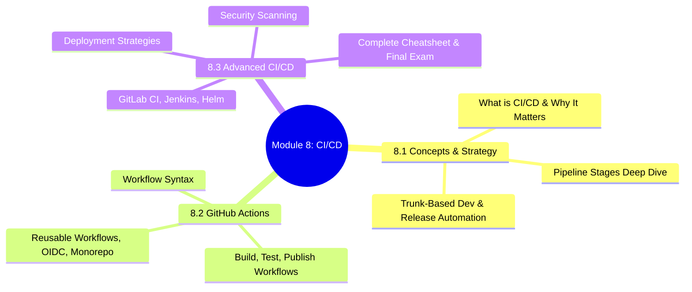
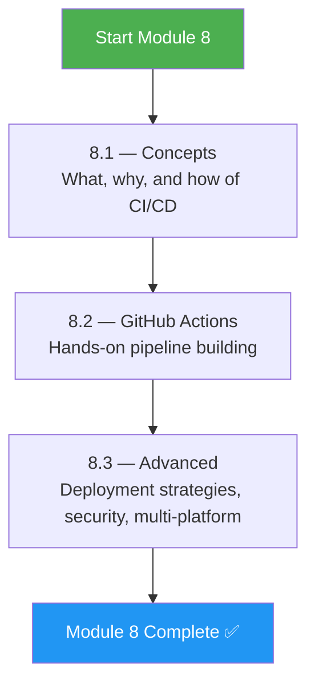
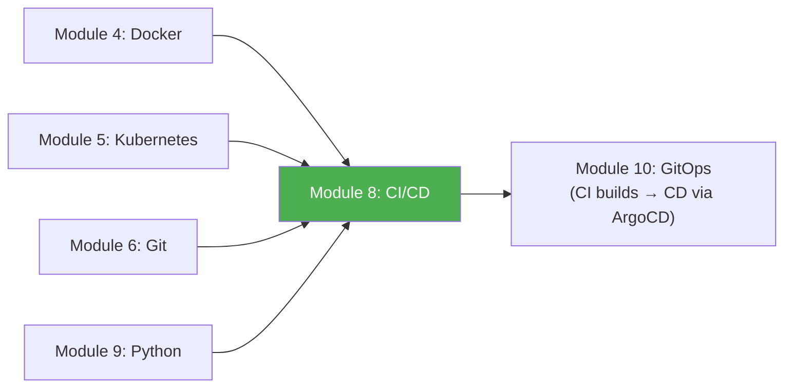

# Module 8 Approach Guide — CI/CD Pipelines

## Module Overview

---

## Who Is This Module For?

CI/CD is the **engine of modern software delivery**. Every commit triggers a pipeline that builds, tests, scans, and deploys. Understanding CI/CD deeply means understanding how code goes from a developer's laptop to production — safely, automatically, and repeatably.

**Target audience:**
- DevOps engineers building and maintaining CI/CD pipelines
- Platform engineers designing golden paths for development teams
- Anyone who wants to automate the path from `git push` to production deployment

---

## Prerequisites

| Prerequisite | Required? | Notes |
|---|---|---|
| Module 4 (Docker) completed | **Yes** | Pipelines build Docker images constantly |
| Module 5 (Kubernetes) completed | **Yes** | Pipelines deploy to Kubernetes clusters |
| Module 6 (Git) completed | **Yes** | CI/CD triggers from Git events — branches, tags, PRs |
| A GitHub account | **Yes** | Module 8.2 uses GitHub Actions extensively |
| Module 3 (Shell Scripting) completed | Recommended | Pipeline steps are often shell scripts |

---

## How to Approach This Module

### Study Strategy

1. **8.1 is theory — read it carefully** — Understand pipeline stages, branching strategies, and release patterns BEFORE writing YAML.
2. **Build a real GitHub Actions pipeline** — Don't just read examples. Create a repo, push code, watch the pipeline run.
3. **Start simple, add stages incrementally** — Build → Test → Lint → Scan → Deploy. Don't try to build everything at once.
4. **Study deployment strategies with diagrams** — Blue-green, canary, and rolling updates are interview favorites.
5. **Read the GitHub Actions marketplace** — Understanding reusable actions saves hours of reinventing the wheel.

---

## Time Estimates

| Subchapter | Reading | Practice | Total |
|---|---|---|---|
| 8.1 Concepts & Strategy | 3 hrs | 1.5 hrs | **4.5 hrs** |
| 8.2 GitHub Actions | 3 hrs | 4 hrs | **7 hrs** |
| 8.3 Advanced CI/CD | 3.5 hrs | 4 hrs | **7.5 hrs** |
| **Total** | **9.5 hrs** | **9.5 hrs** | **~19 hrs** |

> **Realistic timeline:** 1.5–2 weeks at 2 hours/day.

---

## Practice Lab Ideas

| Lab | Covers | Difficulty |
|---|---|---|
| Write a GitHub Actions workflow that runs `pytest` on every push | 8.2 | ⭐⭐ |
| Build a multi-stage pipeline: lint → test → build Docker image → push to GHCR | 8.2 | ⭐⭐⭐ |
| Set up OIDC authentication from GitHub Actions to AWS (no static credentials) | 8.2 | ⭐⭐⭐ |
| Implement a canary deployment strategy with automatic rollback | 8.3 | ⭐⭐⭐⭐ |
| Add Trivy container scanning and Snyk dependency scanning to a pipeline | 8.3 | ⭐⭐⭐ |
| Build a reusable workflow that 5 different repos can call | 8.2 | ⭐⭐⭐⭐ |
| Set up a GitLab CI pipeline for comparison with GitHub Actions | 8.3 | ⭐⭐⭐ |

---

## What Success Looks Like

By the end of Module 8, you should be able to:

- [ ] Design a CI/CD pipeline from scratch for any application type
- [ ] Write GitHub Actions workflows with matrix builds, caching, and artifacts
- [ ] Implement OIDC-based cloud authentication (no static secrets in pipelines)
- [ ] Set up reusable workflows for organizational consistency
- [ ] Explain blue-green, canary, and rolling deployment strategies
- [ ] Add security scanning (SAST, SCA, container scanning) to pipelines
- [ ] Compare GitHub Actions, GitLab CI, and Jenkins and choose appropriately

---

## Connection to Other Modules

**CI/CD is the delivery mechanism.** Git (Module 6) triggers pipelines. Docker (Module 4) builds images in pipelines. Kubernetes (Module 5) is the deployment target. Python (Module 9) writes the automation scripts. GitOps (Module 10) takes the artifacts CI produces and reconciles them into the cluster.

> **Next module:** [Module 9 — Python](../9-Python/Module_9_Approach_Guide.md)
