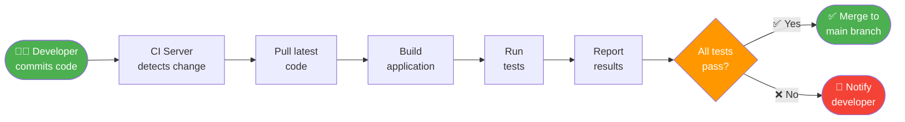
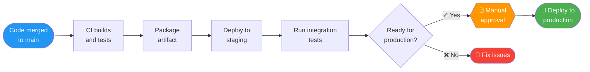
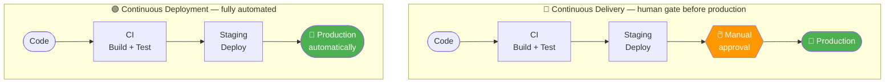
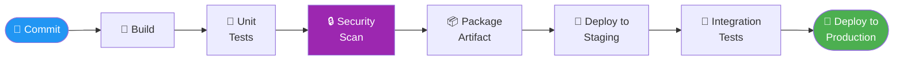
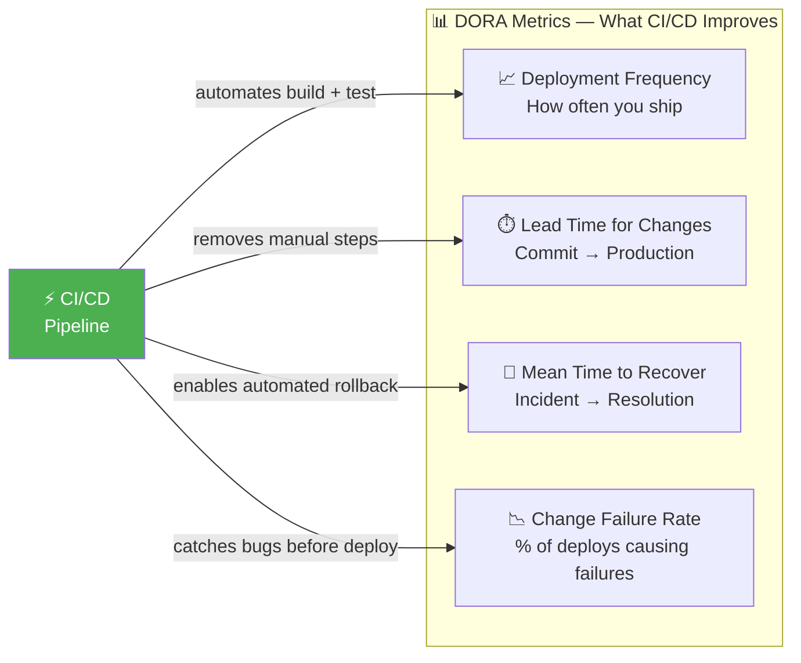
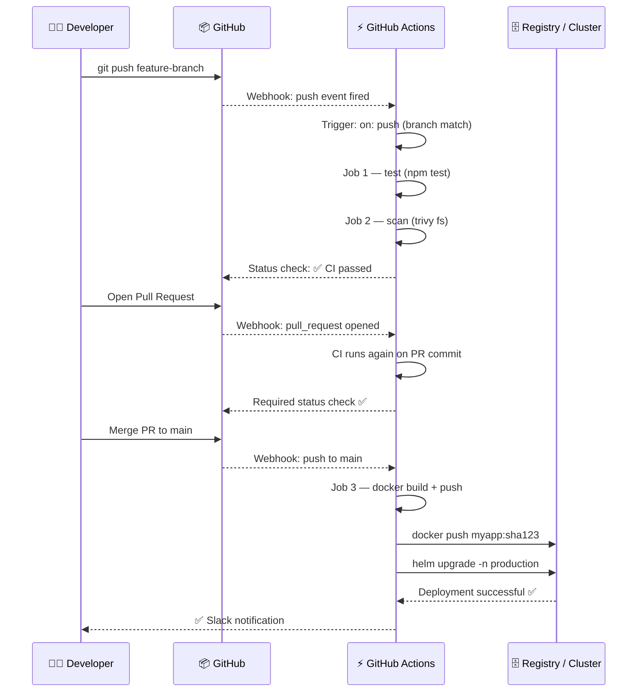

# 8.1.1 What is CI/CD and Why It Matters: Automating the Path to Production

**Backlinks:** [Module 3 — Shell Scripting](../../3-Shell-Scripting/) (scripts used inside pipeline steps) | [Module 4 — Docker](../../4-Docker/) (building container images as artifacts) | [Module 5 — Kubernetes](../../5-Kubernetes/) (deploying to clusters) | [Module 6 — Git](../../6-Git/) (commits trigger pipelines; branching strategy drives pipeline design) | [Module 7 — Nginx](../../7-Nginx/) (deployed application; reverse proxy as deployment target)

**Next note:** [8.1.2 — Pipeline Stages Deep Dive](./8.1.2_Pipeline_Stages_Deep_Dive.md)

---

## Why CI/CD Matters

Before CI/CD, software releases were painful:
- Developers worked in isolation for weeks ("integration hell")
- Manual testing took days
- Deployments were risky, done after hours
- Rollbacks meant scrambling to fix issues

CI/CD transforms this by automating the entire journey from code commit to production.

This note covers CI/CD fundamentals. Note 8.1.2 covers pipeline stages; note 8.1.3 is the subchapter review.

---

## Part 1: What is Continuous Integration (CI)?

**Continuous Integration** is the practice of automatically building and testing every code change as soon as it's committed.



### CI Core Principles

| Principle | What It Means | Why It Matters |
|-----------|---------------|----------------|
| **Commit frequently** | Push code multiple times per day | Smaller changes = easier to debug |
| **Build automatically** | Every commit triggers a build | Catch errors immediately |
| **Test automatically** | Run tests on every build | No broken code reaches main |
| **Fix broken builds immediately** | Stop everything to fix | Don't let broken code accumulate |

### Without CI (The Old Way)

```
Week 1: Developer A works on feature
Week 2: Developer B works on feature
Week 3: Merge both features → CONFLICTS!
Week 4: Fix conflicts, manual testing → MORE BUGS!
Week 5: Late night deployment → ROLLBACK!
```

### With CI

```
10:00 AM: Developer commits code → CI builds → tests pass → merged
10:15 AM: Developer commits code → CI builds → tests fail → fixed immediately
10:30 AM: Code is always in deployable state
```

---

## Part 2: What is Continuous Delivery (CD)?

**Continuous Delivery** extends CI by automatically packaging and deploying code to staging environments, keeping the software always ready for production release.



### Continuous Delivery vs Continuous Deployment

| Aspect | Continuous Delivery | Continuous Deployment |
|--------|---------------------|----------------------|
| **Production deployment** | Manual approval required | Fully automated |
| **Risk** | Lower (human reviews) | Higher (no human gate) |
| **Speed** | Fast (minutes to approve) | Instant (seconds after tests) |
| **Best for** | Regulated industries, complex systems | Web apps, microservices, confident teams |



---

## Part 3: The CI/CD Pipeline

A pipeline is the automated sequence of steps that code goes through from commit to production.



### Pipeline Stages Overview

| Stage | What Happens | Tools | Time Estimate |
|-------|--------------|-------|---------------|
| **Build** | Compile code, install dependencies | Maven, npm, Go build | 1-5 minutes |
| **Unit Tests** | Test individual components | JUnit, pytest, Jest | 1-3 minutes |
| **Security Scan** | Find vulnerabilities | Trivy, Snyk, SonarQube | 2-5 minutes |
| **Package** | Create deployable artifact | JAR, Docker image | 1-2 minutes |
| **Deploy to Staging** | Deploy to test environment | kubectl, Helm, Ansible | 1-3 minutes |
| **Integration Tests** | Test with real dependencies | Postman, Cypress | 2-10 minutes |
| **Deploy to Production** | Release to users | kubectl, Helm | 1-3 minutes |

---

## Part 4: Benefits of CI/CD

### For Developers

| Benefit | Before CI/CD | After CI/CD |
|---------|--------------|-------------|
| **Time to feedback** | Days or weeks | Minutes |
| **Bug fixing** | Hard to find which commit broke it | Immediate (broken build is the last commit) |
| **Context switching** | Constant interruptions | Get notified only when build breaks |
| **Deployment stress** | High (late nights, rollbacks) | Low (automated, repeatable) |

### For the Business

| Benefit | Impact |
|---------|--------|
| **Faster time to market** | Features reach users in hours, not months |
| **Higher quality** | Automated testing catches bugs early |
| **Reduced risk** | Small, frequent deployments = easier to roll back |
| **Happy customers** | Bugs fixed faster, new features arrive sooner |

### Real-World Metrics: The Four DORA Metrics

**DORA** (DevOps Research and Assessment) is a Google research program that identified **four key metrics** that predict software delivery performance. These are the industry-standard benchmarks used in every DevOps maturity assessment and are frequently asked in interviews.

| DORA Metric | Definition | Elite | High | Medium | Low |
|-------------|-----------|-------|------|--------|-----|
| **Deployment frequency** | How often code reaches production | On-demand (multiple/day) | Weekly–monthly | Monthly–every 6 months | Fewer than once per 6 months |
| **Lead time for changes** | Time from commit to production | Less than 1 hour | 1 day–1 week | 1–6 months | More than 6 months |
| **Mean time to recover (MTTR)** | Time to restore service after incident | Less than 1 hour | Less than 1 day | 1 day–1 week | More than 6 months |
| **Change failure rate** | % of deployments causing failures | 0–15% | 16–30% | 16–30% | 46–60% |

*(Source: 2023 State of DevOps Report — DORA / Google Cloud)*

> **Why DORA matters:** These four metrics are **not opinions** — they are statistically validated across thousands of organizations. Teams that score "Elite" on all four ship faster **and** have fewer failures. CI/CD is the primary mechanism for improving all four simultaneously: automated testing reduces change failure rate, pipeline automation reduces lead time, and automated rollbacks reduce MTTR.



> **Interview tip:** When asked "How do you measure DevOps success?", answer with DORA metrics. When asked "How do you improve them?", answer with CI/CD practices from this module.

---

## Part 5: CI/CD Tools Landscape

### Popular CI/CD Tools

| Tool | Type | Best For | Learning Curve |
|------|------|----------|----------------|
| **GitHub Actions** | Cloud (SaaS) | GitHub users, small to medium teams | Low |
| **GitLab CI** | Cloud or self-hosted | GitLab users, all-in-one platform | Low |
| **Jenkins** | Self-hosted | Large enterprises, complex pipelines | High |
| **CircleCI** | Cloud | Fast, simple pipelines | Low |
| **Azure Pipelines** | Cloud | Microsoft ecosystem | Medium |
| **ArgoCD** | Kubernetes-native | GitOps deployments | Medium |
| **Tekton** | Kubernetes-native | Cloud-native, customizable | High |

### CI/CD Tools Comparison

| Feature | GitHub Actions | Jenkins | GitLab CI | CircleCI |
|---------|---------------|---------|-----------|----------|
| **Hosting** | Cloud | Self-hosted | Both | Cloud |
| **Price (small team)** | Free (2000 min/month) | Free (server cost) | Free (400 min/month) | Free (6000 min/month) |
| **Configuration** | YAML | Groovy/Declarative | YAML | YAML |
| **Marketplace** | Large (GitHub Marketplace) | Largest (Jenkins plugins) | Built-in | Moderate |
| **Kubernetes integration** | Good | Good | Good | Good |

---

## Part 5b: How Git Commits Connect to Pipelines

Every CI/CD system watches a Git repository. When you push a commit or open a pull request, a **webhook** (an HTTP POST from GitHub/GitLab to the CI server) fires within seconds and triggers your pipeline.



> **What is a webhook?** When you push to GitHub, GitHub sends an HTTP POST request to a configured URL — in this case, GitHub Actions' internal endpoint. This is how pipelines start within seconds of a push without polling. Think of it as GitHub calling a phone number (`POST /run-pipeline`) to say "new code arrived."

---

## Part 6: CI/CD Anti-Patterns (What NOT to Do)

| Anti-Pattern | Why It's Bad | Fix |
|--------------|--------------|-----|
| **Long-running branches** | Integration hell, huge merge conflicts | Merge to main daily |
| **Slow tests** | Developers lose patience, skip running tests | Parallelize tests, optimize slow ones |
| **Flaky tests** | Erode trust in CI; people ignore failures | Fix or remove flaky tests |
| **Broken builds left unfixed** | Team gets used to red builds | Fix immediately or revert commit |
| **Manual deployment steps** | Human error, inconsistency | Automate everything |
| **Deploying on Fridays** | Hard to get help if something breaks | Deploy early week, Monday-Thursday |

---

## Quick Task: Identify CI/CD Opportunities

*Think about a project you know and answer these questions.*

1. How long does it take from code commit to production?
2. What manual steps are currently in that process?
3. Which of those steps could be automated?
4. What's the biggest risk in your current deployment process?

> **Ready Solution (Example answers):**
>
> 1. "Currently 2 days – manual testing takes 1 day, deployment takes another day"
> 2. "Manual testing, building JAR files by hand, copying files to servers"
> 3. "Building, testing, packaging, and deployment can all be automated"
> 4. "Human error during manual file copying – wrong version deployed"

---

## Summary Table: CI/CD Definitions

| Term | Definition |
|------|------------|
| **Continuous Integration (CI)** | Automatically building and testing every code change |
| **Continuous Delivery (CD)** | Automatically packaging and deploying to staging, ready for production release |
| **Continuous Deployment (CD)** | Automatically deploying every change to production |
| **Pipeline** | Automated sequence of steps from commit to production |
| **Artifact** | Deployable output (JAR file, Docker image, etc.) |
| **Build** | Process of compiling code and packaging dependencies |

### CI/CD Benefits Summary

| Stakeholder | Key Benefit |
|-------------|-------------|
| Developer | Fast feedback, less context switching |
| Tester | Automated regression tests, focus on new features |
| Operations | Repeatable deployments, easy rollbacks |
| Business | Faster time to market, higher quality |

---

**Next note:** [8.1.2 — Pipeline Stages Deep Dive](./8.1.2_Pipeline_Stages_Deep_Dive.md) — detailed look at Build, Test, Scan, and Deploy stages with practical examples.
