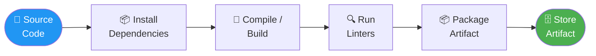
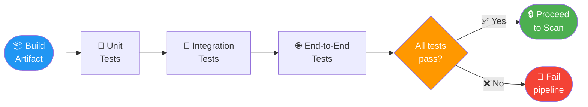
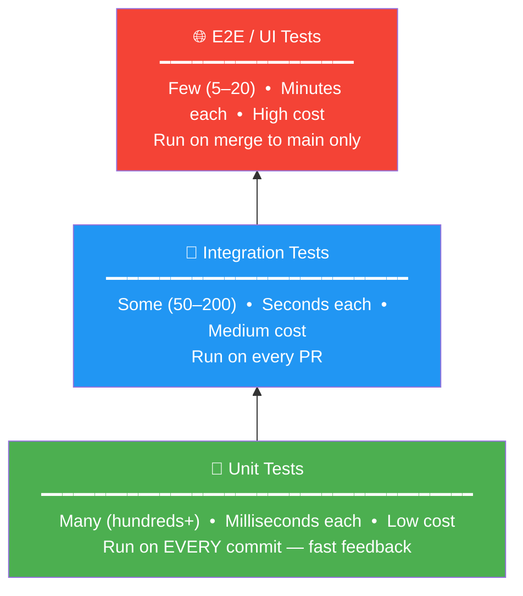
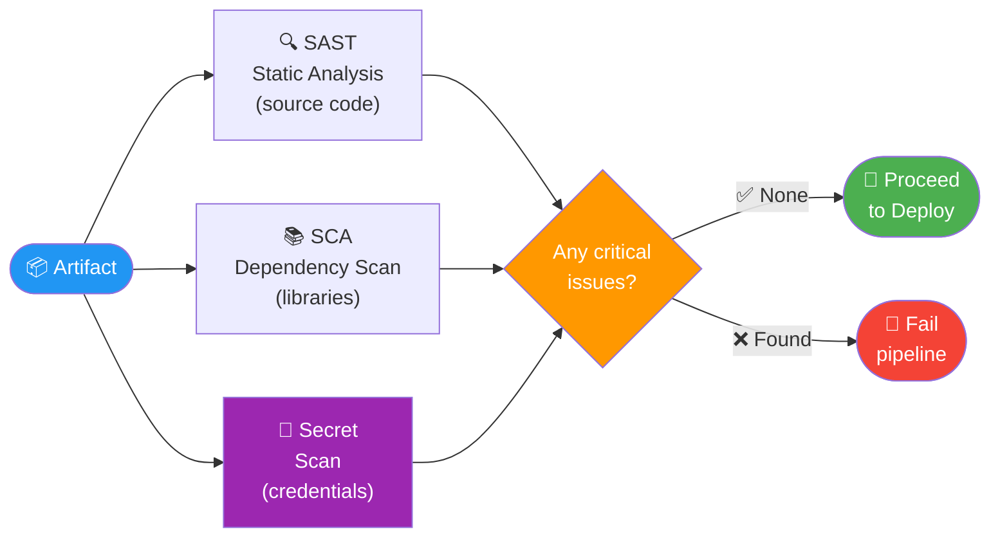
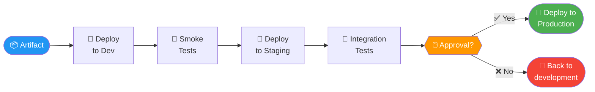
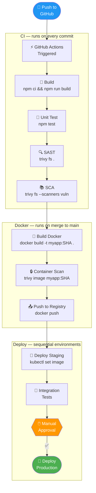

# 8.1.2 Pipeline Stages Deep Dive: Building, Testing, Scanning, Deploying

**Backlinks:** [Module 4 — Docker](../../4-Docker/) (building images; Trivy scanning) | [Module 5 — Kubernetes](../../5-Kubernetes/) (deployments; `kubectl` commands) | [Module 6 — Git](../../6-Git/) (commit SHA used as artifact version tag) | [8.1.1 — What is CI/CD](./8.1.1_What_is_CI_CD_and_Why_It_Matters.md)

**Next note:** [8.1.3 — Trunk-Based Development, Branch Protection, and Release Automation](./8.1.3_Trunk_Based_Dev_Branch_Protection_and_Release_Automation.md)

---

## Why Understanding Pipeline Stages Matters

A CI/CD pipeline is only as strong as its weakest stage. Each stage serves a specific purpose:
- **Build** – Creates the deployable artifact
- **Test** – Validates functionality
- **Scan** – Finds security vulnerabilities
- **Deploy** – Releases to environments

This note covers each stage in detail. Note 8.1.1 covered CI/CD fundamentals; note 8.1.3 is the subchapter review.

---

## Part 1: The Build Stage – Creating Artifacts

The build stage transforms source code into a deployable artifact.



> **`npm ci` vs `npm install`:** `npm ci` is the CI-optimised install command. It reads `package-lock.json` exactly (reproducible), deletes `node_modules` first (clean slate), and fails if `package.json` and `package-lock.json` are out of sync. `npm install` is more lenient — it modifies `package-lock.json` to resolve conflicts, which means two runs can produce different results. **Always use `npm ci` in pipelines.**

### Build Stage by Language

| Language | Build Command | Output Artifact | Package Manager |
|----------|---------------|-----------------|-----------------|
| **Node.js** | `npm ci && npm run build` | `dist/` folder | npm, yarn |
| **Python** | `pip install -r requirements.txt` | None (copy source) | pip, poetry |
| **Go** | `go build -o myapp` | Binary executable | go mod |
| **Java (Maven)** | `mvn clean package` | JAR/WAR file | Maven, Gradle |
| **Rust** | `cargo build --release` | Binary executable | cargo |
| **Docker** | `docker build -t myapp:tag .` | Docker image | - |

### Build Stage Best Practices

| Practice | Why | Example |
|----------|-----|---------|
| **Use dependency caching** | Speeds up builds | Cache `node_modules`, `~/.m2` |
| **Pin dependency versions** | Reproducible builds | `package-lock.json`, `requirements.txt` with versions |
| **Run linters** | Catch style issues early | ESLint, pylint, golint |
| **Fail fast** | Stop build on first error | `set -e` in scripts |
| **Use `.dockerignore`** | Smaller build context | Exclude `node_modules`, `.git` |

### Build Artifact Types

| Artifact Type | Example | Storage | Used For |
|---------------|---------|---------|----------|
| **JAR/WAR** | `app-1.0.jar` | Artifact repository (Nexus, Artifactory) | Java apps |
| **Docker image** | `myapp:latest` | Container registry (Docker Hub, ECR, GHCR) | Containerized apps |
| **Binary** | `myapp-linux-amd64` | Artifact repository | Go, Rust apps |
| **Static files** | `index.html`, `bundle.js` | CDN, S3 bucket | Frontend apps |

---

## Part 2: The Test Stage – Validating Functionality

Tests ensure code works as expected and doesn't break existing functionality.



### Types of Tests

| Test Type | What It Tests | Speed | Runs In CI? | Example |
|-----------|---------------|-------|-------------|---------|
| **Unit tests** | Single function/class | Fast (<1s each) | Yes | `assertEquals(2, add(1,1))` |
| **Integration tests** | Multiple components | Medium (seconds) | Yes | Test database connection |
| **Contract tests** | API compatibility | Fast | Yes | Pact, OpenAPI validation |
| **End-to-end (E2E) tests** | Full user journey | Slow (minutes) | Maybe (staging) | Selenium, Cypress |
| **Performance tests** | Load handling | Very slow | No (nightly) | k6, JMeter |

### Test Commands by Language

```bash
# Node.js (Jest)
npm test
npm run test:coverage

# Python (pytest)
pytest tests/
pytest --cov=myapp tests/

# Go
go test ./...
go test -cover ./...

# Java (Maven)
mvn test
mvn verify
```

### Test Pyramid

The test pyramid shows the ideal ratio of test types — many cheap fast tests at the **base**, few expensive slow tests at the **top**. Read it bottom-up: the widest layer (unit tests) is the foundation.



> **Direction matters — read bottom to top:** Unit tests are the wide, stable base. E2E tests are the narrow, slow tip. `flowchart BT` (bottom-to-top) shows this correctly — more tests at the bottom = cheaper CI.

> **Why this ratio matters:** If you have 500 unit tests that run in 30 seconds and only 10 E2E tests that run in 5 minutes, your pipeline stays fast. Inverting the pyramid (many E2E, few unit tests) makes the pipeline take 45+ minutes and developers stop running tests locally.

| Level | Count | Speed | Cost to Fix |
|-------|-------|-------|-------------|
| **Unit tests** | Many (1000+) | Milliseconds | Low |
| **Integration tests** | Some (50-200) | Seconds | Medium |
| **E2E tests** | Few (5-20) | Minutes | High |

### Test Best Practices

| Practice | Why |
|----------|-----|
| **Run unit tests first** | Fastest feedback, catch basic errors |
| **Parallelize tests** | Reduce pipeline time |
| **Fail fast** | Stop on first test failure |
| **Run integration tests in staging** | Real environment, safe to break |
| **Don't run E2E tests on every commit** | Too slow; run on merge to main |

### Flaky Test Detection and Quarantine

A **flaky test** passes and fails non-deterministically — same code, different results on different runs. Flaky tests erode trust in CI: developers start ignoring red builds, and real bugs slip through. Detecting and managing flaky tests is a critical CI discipline.

**How to detect flaky tests:**

```bash
# Jest — retry failing tests to detect flakiness
npx jest --detectOpenHandles --forceExit --retry 2
# If a test fails on first run but passes on retry, it's flaky

# pytest — use pytest-rerunfailures
pip install pytest-rerunfailures
pytest --reruns 3 --reruns-delay 1 tests/
# A test that passes on rerun is flagged as flaky

# Go — run tests multiple times
go test -count=5 ./...
# If a test passes 4/5 times, it's flaky
```

**The Quarantine Pattern:**

Instead of deleting flaky tests (which removes coverage) or ignoring them (which normalizes red builds), **quarantine** them: move them to a separate test suite that runs on a different schedule.

```bash
# Jest — mark flaky tests with a custom tag
describe('payment flow', () => {
  // eslint-disable-next-line jest/no-disabled-tests
  it.skip('processes payment (QUARANTINED: flaky — race condition in mock)', () => {
    // ...
  });
});

# pytest — use a marker
@pytest.mark.flaky(reruns=3, reason="JIRA-1234: intermittent timeout on CI")
def test_payment_webhook():
    ...
```

```yaml
# GitHub Actions — run quarantined tests separately
jobs:
  stable-tests:
    steps:
      - run: pytest tests/ -m "not flaky"    # main test suite — must pass

  quarantined-tests:
    steps:
      - run: pytest tests/ -m "flaky" --reruns 3
        continue-on-error: true               # doesn't block pipeline
```

**Flaky test management rules:**

| Rule | Why |
|------|-----|
| **Track in a ticket** | Every quarantined test has a JIRA/issue with an owner and ETA |
| **Review weekly** | Quarantine is temporary — fix or delete within 2 weeks |
| **Count flaky tests** | If quarantine grows > 5% of total tests, stop new features and fix |
| **Alert on new flakiness** | Use `--retry` in CI — if a test needed a retry, open an issue automatically |

> **Common causes of flakiness:** Race conditions (async code without `await`), shared mutable state between tests, time-dependent assertions (`Date.now()`), network calls to real services, tests relying on execution order.

---

## Part 3: The Scan Stage – Security and Quality

Security scanning catches vulnerabilities before they reach production.



### Security Scan Types

| Type | Full Name | What It Finds | When | Tools |
|------|-----------|---------------|------|-------|
| **SAST** | Static Application Security Testing | Code vulnerabilities (SQL injection, XSS) | After build | Trivy, SonarQube, Semgrep |
| **SCA** | Software Composition Analysis | Vulnerable dependencies | After build | Trivy, Snyk, OWASP DC |
| **DAST** | Dynamic Application Security Testing | Runtime vulnerabilities | In staging | OWASP ZAP, Burp Suite |
| **Container Scan** | Container image vulnerabilities | OS packages, misconfigurations | After build | Trivy, Grype, Clair |
| **Secret Scan** | Hardcoded secrets | API keys, passwords | During build | TruffleHog, Gitleaks |

### Example: Trivy Scan Commands

```bash
# Scan filesystem for code vulnerabilities
trivy fs --severity CRITICAL,HIGH .

# Scan Docker image
trivy image myapp:latest --severity CRITICAL

# Scan filesystem and fail on critical issues
trivy fs --exit-code 1 --severity CRITICAL .

# Scan with SARIF output (for GitHub)
trivy fs --format sarif --output trivy-results.sarif .
```

### Security Policies

| Severity | Action | Example |
|----------|--------|---------|
| **Critical** | Fail pipeline, block deployment | Remote code execution, SQL injection |
| **High** | Fail pipeline, require review | XSS, CSRF |
| **Medium** | Warning, allow deployment | Information disclosure |
| **Low** | Log only | Best practice violations |

---

## Part 4: The Deploy Stage – Releasing to Environments

The deploy stage pushes artifacts to target environments.



### Environment Types

| Environment | Purpose | Who Uses It | Data | Deployment Frequency |
|-------------|---------|-------------|------|---------------------|
| **Development** | Local testing | Developers | Mock data | Every commit |
| **CI** | Pipeline testing | CI system | Test data | Every commit |
| **Integration** | Component testing | QA | Anonymized | Multiple times/day |
| **Staging** | Pre-production | QA, Product | Copy of production | Daily |
| **Production** | Real users | Customers | Real data | Varies (daily/weekly) |

### Deployment Methods

| Method | Description | Downtime | Rollback | Complexity |
|--------|-------------|----------|----------|------------|
| **Copy files** | Replace files on server | Yes (seconds) | Manual | Low |
| **Docker pull** | Pull new image, restart | Yes (seconds) | `git revert` + restart | Medium |
| **Kubernetes rolling update** | Gradual pod replacement | Zero | `kubectl rollout undo` | Medium |
| **Blue/Green** | Switch traffic between two environments | Zero | Switch back | High |
| **Canary** | Gradual traffic shift | Zero | Stop shift | High |

### Deployment Commands by Target

```bash
# Copy files via SSH
scp -r ./dist/ user@server:/var/www/html/

# Docker (simple)
docker pull myapp:latest
docker stop myapp
docker rm myapp
docker run -d --name myapp -p 80:80 myapp:latest

# Kubernetes
kubectl set image deployment/myapp myapp=myapp:latest
kubectl rollout status deployment/myapp

# Helm
helm upgrade myapp ./chart --set image.tag=latest
```

---

## Part 5: Complete Pipeline Example



### Pipeline Time Estimates

| Stage | Time (minutes) |
|-------|----------------|
| Build | 2 |
| Unit Tests | 1 |
| SAST | 2 |
| SCA | 1 |
| Docker Build | 3 |
| Container Scan | 1 |
| Push to Registry | 1 |
| Deploy to Staging | 2 |
| Integration Tests | 5 |
| **Total** | **18 minutes** |

---

## Quick Task: Design a Pipeline

*Design a CI/CD pipeline for a simple web application.*

**Application:** Node.js + React frontend, Express backend, PostgreSQL database. Deployed to Kubernetes.

**Questions:**
1. What stages would you include?
2. What tests would you run at each stage?
3. What security scans are needed?
4. How would you deploy to staging and production?

> **Ready Solution:**
>
> 1. **Stages:** Build → Unit Test → SAST/SCA → Docker Build → Scan → Deploy Staging → Integration Test → Deploy Production
>
> 2. **Tests:**
>    - Unit tests: Jest for frontend, Mocha for backend
>    - Integration tests: API tests with Supertest
>    - E2E tests: Cypress (staging only)
>
> 3. **Security scans:**
>    - SAST: Trivy on source code
>    - SCA: Trivy on package.json
>    - Container scan: Trivy on Docker image
>    - Secret scan: TruffleHog
>
> 4. **Deployment:**
>    - Staging: `kubectl apply -f k8s/staging/`
>    - Production: Manual approval, then `kubectl apply -f k8s/prod/`

---

## Summary Table: Pipeline Stages

| Stage | Purpose | Tools | Success Criteria |
|-------|---------|-------|------------------|
| **Build** | Create artifact | npm, maven, go build | Exit code 0 |
| **Unit Test** | Test individual components | Jest, pytest, JUnit | All tests pass |
| **SAST** | Find code vulnerabilities | Trivy, SonarQube | No critical/high |
| **SCA** | Find vulnerable dependencies | Trivy, Snyk | No critical/high |
| **Container Scan** | Scan Docker image | Trivy, Grype | No critical/high |
| **Deploy Staging** | Deploy to test env | kubectl, helm | Deployment successful |
| **Integration Test** | Test with real dependencies | Postman, Cypress | All tests pass |
| **Deploy Production** | Release to users | kubectl, helm | Zero-downtime success |

### Test Types Summary

| Test | Speed | Environment | Runs Every Commit? |
|------|-------|-------------|-------------------|
| Unit | Fast | CI container | Yes |
| Integration | Medium | CI container | Yes |
| E2E | Slow | Staging | No (merge to main) |
| Performance | Very slow | Staging | No (nightly) |

### Security Scan Severity Actions

| Severity | Action |
|----------|--------|
| Critical | Block deployment |
| High | Block deployment (or require approval) |
| Medium | Warning, allow deployment |
| Low | Log only |

---

**Next note:** [8.1.3 — Trunk-Based Development, Branch Protection, and Release Automation](./8.1.3_Trunk_Based_Dev_Branch_Protection_and_Release_Automation.md) — cheatsheet and scenario-based interview questions for CI/CD fundamentals.
