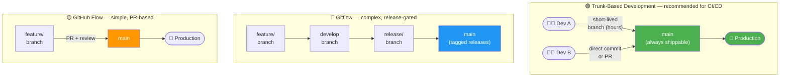
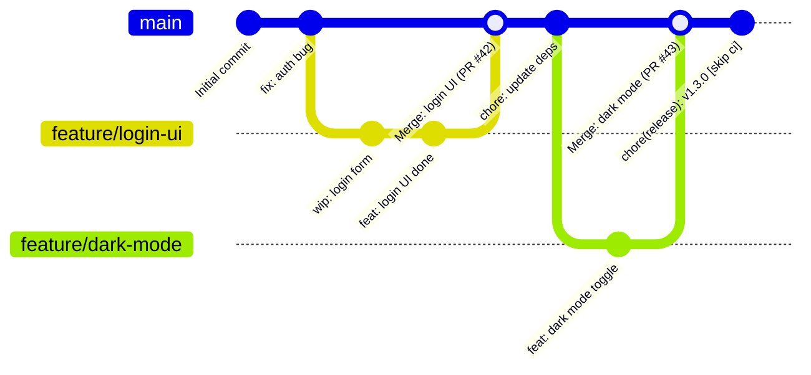
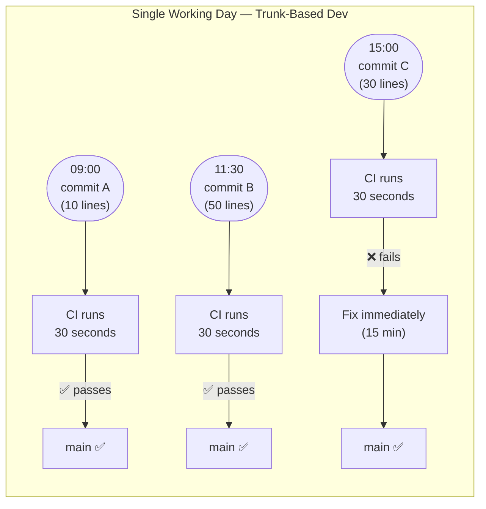
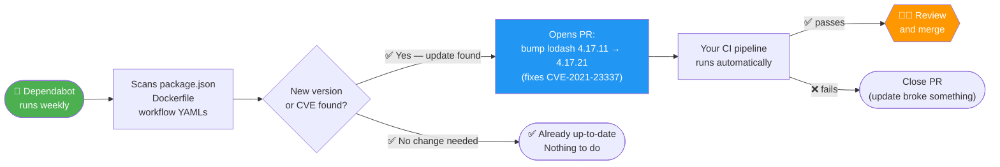
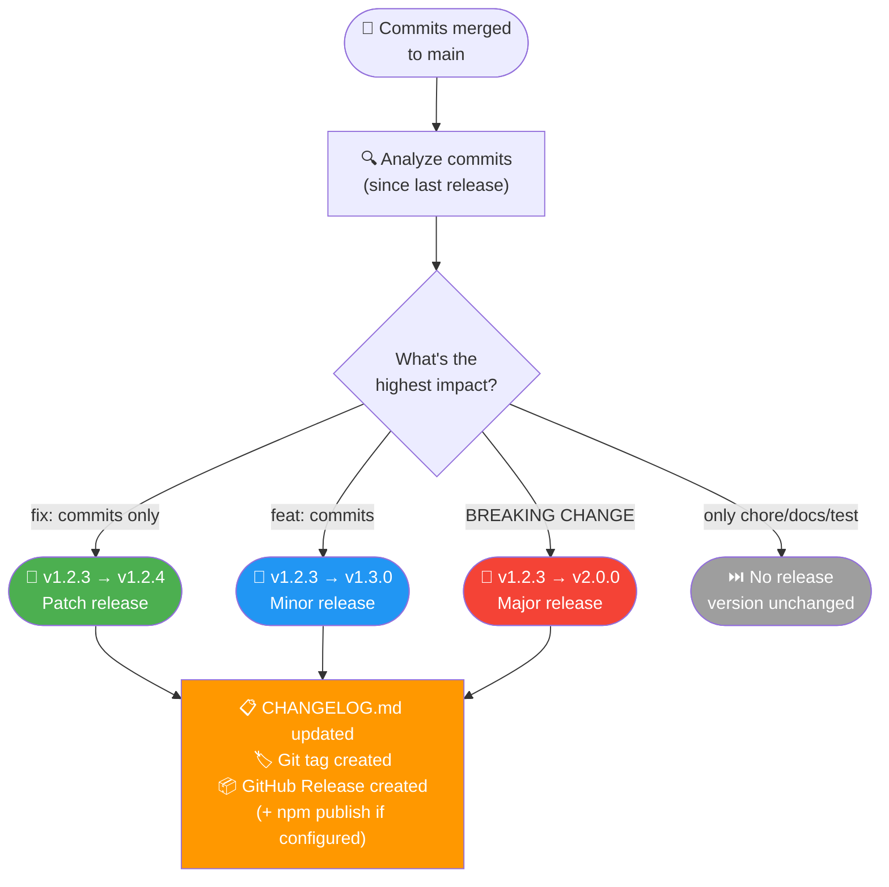

# 8.1.3 Trunk-Based Development, Branch Protection, and Release Automation

**Backlinks:** [Module 6 — Git](../../6-Git/) (branching strategies; tags; Conventional Commits from 6.2.3; hooks from 6.3.3) | [8.1.1 — What is CI/CD](./8.1.1_What_is_CI_CD_and_Why_It_Matters.md) | [8.1.4 — Subchapter 8.1 Review](./8.1.4_Subchapter_Review.md)

**Next note:** [8.1.4 — Subchapter 8.1 Review](./8.1.4_Subchapter_Review.md)

---

## Why Git Workflow Strategy Matters for CI/CD

Your Git branching strategy **directly determines how your pipeline runs**. A team that merges to `main` ten times a day has a completely different CI/CD topology than a team that merges once a sprint. This note covers the strategies, protection rules, and automation tools that make CI/CD reliable at scale.

---

## Part 1: Branching Strategies — Choosing the Right One

### The Three Main Strategies



### Strategy Comparison

| Aspect | Trunk-Based | GitHub Flow | Gitflow |
|--------|-------------|-------------|---------|
| **Branch lifetime** | Hours (or direct commits) | Days (PR lifecycle) | Weeks/months |
| **Integration frequency** | Multiple times per day | Once per feature | Once per sprint |
| **CI/CD compatibility** | Excellent — designed for it | Good | Poor — long integration gaps |
| **Merge conflicts** | Rare (small, frequent merges) | Occasional | Frequent (long-lived branches) |
| **Release control** | Feature flags | PR approval | Release branch |
| **Best for** | Teams doing CD, microservices | Teams doing CD with code review gate | Teams with scheduled releases (mobile, firmware) |

### Trunk-Based Development (TBD) — Deep Dive

In TBD, every developer merges to `main` (the trunk) at least once per day. There is no long-lived `develop` branch.



> **What the graph shows:** Feature branches live for hours (2–3 commits), then merge to `main`. The `main` branch accumulates many small merges throughout the day. Each merge to `main` triggers CI. When semantic-release runs, it creates the `chore(release): v1.3.0 [skip ci]` commit (with `[skip ci]` to prevent an infinite loop).

**Key rules:**
1. Branches live for **hours, not days**
2. PRs are **small** (< 400 lines diff)
3. **Feature flags** hide incomplete features (code is deployed but disabled)
4. **CI must pass** before merge
5. The trunk is **always in a deployable state**



> **Why "always deployable" matters:** If main is always deployable, you can release at any moment — there is no "code freeze" or "stabilization sprint." Bugs are caught within minutes of introduction, not weeks.

---

## Part 2: Branch Protection Rules

Branch protection rules enforce quality gates — no one (not even admins) can merge broken or unreviewed code.

### Setting Up Branch Protection (GitHub)

**GitHub → Repository → Settings → Branches → Add rule → Branch name pattern: `main`**

```yaml
# Branch protection via GitHub CLI
gh api repos/:owner/:repo/branches/main/protection \
  --method PUT \
  --field required_status_checks='{"strict":true,"contexts":["ci/test","ci/build"]}' \
  --field enforce_admins=true \
  --field required_pull_request_reviews='{"required_approving_review_count":1}' \
  --field restrictions=null
```

### Protection Rules Reference

| Rule | What It Does | Why |
|------|-------------|-----|
| **Require status checks** | CI must pass before merge | No broken code reaches main |
| `strict: true` | Branch must be up-to-date with main before merge | Prevents "works on my branch" merges |
| **Require pull request reviews** | At least N approvals required | Code review gate |
| **Dismiss stale reviews** | New commits invalidate previous approvals | Prevents sneaking changes after review |
| **Require review from code owners** | CODEOWNERS file owners must approve | Domain experts review relevant changes |
| **Require signed commits** | Only GPG/SSH-signed commits accepted (see Module 6.2.3) | Proves commit identity |
| **Require linear history** | No merge commits — rebase/squash only | Clean, readable history |
| **Restrict pushes** | Only specific users/teams can push directly | Enforces PR workflow |
| **Enforce admins** | Rules apply to admins too | No bypassing for "emergencies" |

### CODEOWNERS File

`CODEOWNERS` auto-assigns reviewers based on which files changed:

```bash
# .github/CODEOWNERS
# Format: file/pattern   @owner1 @owner2

# All files → default owners
*                   @org/platform-team

# Frontend changes require frontend team
/frontend/          @org/frontend-team
*.tsx               @org/frontend-team

# Infrastructure changes require infra team
/terraform/         @org/infra-team
/k8s/               @org/infra-team
/.github/workflows/ @org/platform-team

# Security team reviews security-critical files
/auth/              @org/security-team
/crypto/            @org/security-team
```

> **How it works:** When a PR modifies `k8s/deployment.yaml`, GitHub automatically requests a review from `@org/infra-team`. The PR cannot be merged until that team approves, regardless of other approvals.

---

## Part 3: Dependabot — Automated Dependency Updates

Dependabot automatically opens PRs to update outdated or vulnerable dependencies. Configure it in `.github/dependabot.yml`:

```yaml
# .github/dependabot.yml
version: 2
updates:
  # npm dependencies
  - package-ecosystem: "npm"
    directory: "/"
    schedule:
      interval: "weekly"       # daily | weekly | monthly
      day: "monday"
      time: "09:00"
      timezone: "America/New_York"
    open-pull-requests-limit: 5
    labels:
      - "dependencies"
      - "automated"
    reviewers:
      - "myteam"
    ignore:
      # Skip major versions (breaking changes)
      - dependency-name: "react"
        update-types: ["version-update:semver-major"]

  # Docker base images
  - package-ecosystem: "docker"
    directory: "/"
    schedule:
      interval: "weekly"

  # GitHub Actions
  - package-ecosystem: "github-actions"
    directory: "/"
    schedule:
      interval: "weekly"

  # Python (pip)
  - package-ecosystem: "pip"
    directory: "/backend"
    schedule:
      interval: "weekly"

  # Terraform modules
  - package-ecosystem: "terraform"
    directory: "/terraform"
    schedule:
      interval: "monthly"
```

### How Dependabot Works



> **Auto-merge for patch updates:** Many teams auto-merge Dependabot PRs when CI passes for `patch` version bumps (no API changes). For `minor` and `major` bumps, human review is required.

```yaml
# .github/workflows/dependabot-automerge.yml
name: Auto-merge Dependabot PRs

on: pull_request

jobs:
  auto-merge:
    runs-on: ubuntu-latest
    if: github.actor == 'dependabot[bot]'
    steps:
      - name: Fetch Dependabot metadata
        id: metadata
        uses: dependabot/fetch-metadata@v1
        with:
          github-token: ${{ secrets.GITHUB_TOKEN }}

      - name: Auto-merge patch updates
        # Only auto-merge patch version bumps (safe — no API changes)
        if: steps.metadata.outputs.update-type == 'version-update:semver-patch'
        run: gh pr merge --auto --squash "$PR_URL"
        env:
          PR_URL: ${{ github.event.pull_request.html_url }}
          GITHUB_TOKEN: ${{ secrets.GITHUB_TOKEN }}
```

---

## Part 4: Conventional Commits and Release Automation

### Conventional Commits Standard

Conventional Commits is a specification for writing structured commit messages. It drives **automated changelog generation** and **semantic version bumping**.

```
<type>(<scope>): <description>

[optional body]

[optional footer]
```

**Types:**

| Type | SemVer Impact | Changelog Section | Example |
|------|--------------|-------------------|---------|
| `fix:` | Patch (1.0.X) | 🐛 Bug Fixes | `fix(auth): handle expired tokens correctly` |
| `feat:` | Minor (1.X.0) | ✨ Features | `feat(api): add pagination to /users endpoint` |
| `feat!:` or `BREAKING CHANGE:` | Major (X.0.0) | 💥 Breaking Changes | `feat!: rename userId to id in all responses` |
| `docs:` | None | 📚 Documentation | `docs: update README installation steps` |
| `chore:` | None | (not shown) | `chore: update eslint config` |
| `refactor:` | None | ♻️ Refactoring | `refactor(db): extract connection pooling` |
| `perf:` | None | ⚡ Performance | `perf: cache user lookups in Redis` |
| `test:` | None | (not shown) | `test: add unit tests for auth middleware` |
| `ci:` | None | (not shown) | `ci: add trivy security scan to pipeline` |

### semantic-release — Fully Automated Releases

`semantic-release` reads your commit history, determines the next version number, creates a Git tag, generates a `CHANGELOG.md`, and publishes the release — all automatically when code merges to `main`.

```bash
# Install semantic-release
npm install --save-dev semantic-release \
  @semantic-release/changelog \
  @semantic-release/git \
  @semantic-release/github
```

```json
// .releaserc.json — semantic-release configuration
{
  "branches": ["main"],
  "plugins": [
    "@semantic-release/commit-analyzer",     // reads commits, determines version bump
    "@semantic-release/release-notes-generator",  // generates changelog text
    ["@semantic-release/changelog", {
      "changelogFile": "CHANGELOG.md"        // writes CHANGELOG.md
    }],
    ["@semantic-release/npm", {
      "npmPublish": false                    // don't publish to npm (set true for packages)
    }],
    ["@semantic-release/git", {
      "assets": ["CHANGELOG.md", "package.json"],
      "message": "chore(release): ${nextRelease.version} [skip ci]"
    }],
    "@semantic-release/github"               // creates GitHub Release with notes
  ]
}
```

```yaml
# .github/workflows/release.yml
name: Release

on:
  push:
    branches: [ main ]

jobs:
  release:
    runs-on: ubuntu-latest
    permissions:
      contents: write        # to create GitHub Releases
      issues: write          # to comment on related issues
      pull-requests: write   # to comment on related PRs

    steps:
      - uses: actions/checkout@v4
        with:
          fetch-depth: 0     # semantic-release needs full git history

      - uses: actions/setup-node@v4
        with:
          node-version: '20'

      - run: npm ci

      - name: Release
        run: npx semantic-release
        env:
          GITHUB_TOKEN: ${{ secrets.GITHUB_TOKEN }}
          NPM_TOKEN: ${{ secrets.NPM_TOKEN }}   # only needed if publishing to npm
```

> **Why `fetch-depth: 0`?** By default `actions/checkout` fetches only the latest commit (a "shallow clone"). `semantic-release` needs the **full git history** to read every commit since the last release tag and calculate the correct version bump. Without `fetch-depth: 0` it would see zero commits and release nothing.

> **Why `[skip ci]` in the release commit message?** `semantic-release` creates a commit like `chore(release): 1.3.0 [skip ci]`. Without `[skip ci]`, that commit would trigger the CI/CD pipeline again, which would run `semantic-release` again, which would try to release again — an infinite loop. The `[skip ci]` string tells GitHub Actions to **not trigger** any workflow for that specific commit.

### What Happens When semantic-release Runs



### Enforcing Conventional Commits

Use `commitlint` + `husky` (Git hooks from Module 6.3.3) to reject malformed commit messages locally:

```bash
# Install
npm install --save-dev @commitlint/config-conventional @commitlint/cli husky

# commitlint.config.js
module.exports = { extends: ['@commitlint/config-conventional'] }

# Hook setup (package.json)
{
  "scripts": {
    "prepare": "husky install"
  }
}

# .husky/commit-msg  — runs before every commit
npx --no -- commitlint --edit "$1"
```

Now `git commit -m "updated stuff"` will **fail** with:
```
✖ subject may not be empty [subject-empty]
✖ type may not be empty [type-empty]
✖ found 1 problems, 0 warnings
```

---

## Part 5: Notifications — Keeping the Team Informed

Pipelines are useless if no one knows when they fail. Connect GitHub Actions to team communication tools.

### Slack Notifications

```yaml
# .github/workflows/ci.yml  — Slack notification on failure
- name: Notify Slack on failure
  if: failure()
  uses: slackapi/slack-github-action@v1.26.0
  with:
    channel-id: 'C1234567890'             # Slack channel ID
    slack-message: |
      ❌ *CI Failed* on `${{ github.repository }}`
      Branch: `${{ github.ref_name }}`
      Commit: `${{ github.sha }}`
      Actor: ${{ github.actor }}
      <${{ github.server_url }}/${{ github.repository }}/actions/runs/${{ github.run_id }}|View Run>
  env:
    SLACK_BOT_TOKEN: ${{ secrets.SLACK_BOT_TOKEN }}
```

```yaml
# Notify on success AND failure with different messages
- name: Notify Slack
  if: always()    # always() runs even when previous steps failed
  uses: slackapi/slack-github-action@v1.26.0
  with:
    channel-id: 'C1234567890'
    slack-message: |
      ${{ job.status == 'success' && '✅' || '❌' }} *CI ${{ job.status }}* — `${{ github.repository }}`
  env:
    SLACK_BOT_TOKEN: ${{ secrets.SLACK_BOT_TOKEN }}
```

### GitHub Deployment Environments and Status

```yaml
jobs:
  deploy:
    environment:
      name: production
      url: https://myapp.example.com    # shown in GitHub deployments tab
    steps:
      - name: Deploy
        run: kubectl apply -f k8s/prod/
```

GitHub automatically shows deployment status badges in the repository:
- ✅ Active deployment with link to the URL
- 🕒 In-progress deployment
- ❌ Failed deployment with link to logs

---

## Part 6: Complete Workflow — Trunk-Based CI/CD with Automation

Here is a complete example combining branch protection, conventional commits, semantic-release, and Slack notifications:

```mermaid
flowchart LR
    DEV(["👩‍💻 Developer"]) -->|"feat(api): add\npagination"| COMMIT_MSG["commitlint\nchecks message\n✅ valid"]
    COMMIT_MSG -->|"git push\nto feature branch"| PR["GitHub PR\nopened"]
    PR --> CI_PR["CI runs:\n• tests\n• lint\n• scan"]
    CI_PR -->|"✅ all pass\n+ 1 approval"| MERGE["Merge to\nmain ✅"]
    MERGE --> CI_MAIN["CI runs on main:\n• tests\n• build\n• docker push"]
    CI_MAIN --> RELEASE["semantic-release:\n• bumps version\n• creates tag\n• updates CHANGELOG"]
    RELEASE --> DEPLOY["CD pipeline:\n• deploy to staging\n• smoke tests\n• deploy to prod"]
    DEPLOY -->|"✅ success"| SLACK_OK(["✅ Slack:\n'Deployed v1.3.0'"])
    DEPLOY -->|"❌ failure"| SLACK_FAIL(["❌ Slack:\n'Deploy failed'"])

    style MERGE fill:#4CAF50,color:#fff
    style RELEASE fill:#2196F3,color:#fff
    style SLACK_OK fill:#4CAF50,color:#fff
    style SLACK_FAIL fill:#f44336,color:#fff
```



---

## Summary Tables

### Branching Strategy Quick Reference

| Strategy | CI Frequency | Best With | Avoid When |
|----------|-------------|-----------|------------|
| Trunk-Based | Multiple/day | CD, small PRs, feature flags | Teams not ready for frequent merges |
| GitHub Flow | Per feature | Continuous delivery with review | Very large features (use feature flags instead) |
| Gitflow | Per sprint | Scheduled releases, mobile | Teams doing CD (too much overhead) |

### Branch Protection Rule Checklist

| Rule | Recommended Setting |
|------|---------------------|
| Require status checks | ✅ Enable; add all CI job names |
| Branch up-to-date | ✅ `strict: true` |
| Required approvals | ✅ At least 1 |
| Dismiss stale reviews | ✅ Enable |
| Require CODEOWNERS | ✅ For security-critical paths |
| Require signed commits | Optional (enforce if compliance required) |
| Enforce admins | ✅ No exceptions |

### Conventional Commit Quick Reference

| Commit | Version Bump | Example |
|--------|-------------|---------|
| `fix:` | Patch `1.0.X` | `fix: handle null user in auth middleware` |
| `feat:` | Minor `1.X.0` | `feat: add dark mode toggle` |
| `feat!:` / `BREAKING CHANGE:` | Major `X.0.0` | `feat!: drop support for Node 14` |
| `chore:`, `docs:`, `test:` | None | `chore: update eslint rules` |

---

**Next note:** [8.1.4 — Subchapter 8.1 Review](./8.1.4_Subchapter_Review.md) — cheatsheet and interview prep for CI/CD fundamentals, pipeline stages, and trunk-based development.
