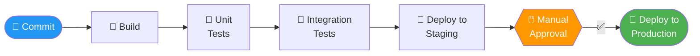

# 8.1.4 Subchapter 8.1 Review: Cheatsheet and Interview Prep

**Backlinks:** [8.1.1 — What is CI/CD](./8.1.1_What_is_CI_CD_and_Why_It_Matters.md) | [8.1.2 — Pipeline Stages Deep Dive](./8.1.2_Pipeline_Stages_Deep_Dive.md) | [8.1.3 — Trunk-Based Dev, Branch Protection, Release Automation](./8.1.3_Trunk_Based_Dev_Branch_Protection_and_Release_Automation.md)

**Next note:** [8.2.1 — GitHub Actions Workflow Syntax](../Subchapter_8.2/8.2.1_GitHub_Actions_Workflow_Syntax.md)

---

This review covers only the material presented in Notes 8.1.1 (What is CI/CD and Why It Matters) and 8.1.2 (Pipeline Stages Deep Dive). No forward referencing beyond what was explicitly introduced.

---

## Cheatsheet: CI/CD Fundamentals

### CI/CD Definitions

| Term | Definition |
|------|------------|
| **Continuous Integration (CI)** | Automatically building and testing every code change |
| **Continuous Delivery (CD)** | Automatically packaging and deploying to staging, ready for production release |
| **Continuous Deployment (CD)** | Automatically deploying every change to production |
| **Pipeline** | Automated sequence of steps from commit to production |
| **Artifact** | Deployable output (JAR file, Docker image, etc.) |

### CI/CD Benefits

| Stakeholder | Key Benefit |
|-------------|-------------|
| Developer | Fast feedback, less context switching |
| Tester | Automated regression tests |
| Operations | Repeatable deployments, easy rollbacks |
| Business | Faster time to market, higher quality |

### Pipeline Stages

| Stage | Purpose | Tools |
|-------|---------|-------|
| **Build** | Create artifact | npm, maven, go build |
| **Unit Test** | Test individual components | Jest, pytest, JUnit |
| **SAST** | Find code vulnerabilities | Trivy, SonarQube |
| **SCA** | Find vulnerable dependencies | Trivy, Snyk |
| **Container Scan** | Scan Docker image | Trivy, Grype |
| **Deploy Staging** | Deploy to test env | kubectl, helm |
| **Integration Test** | Test with real dependencies | Postman, Cypress |
| **Deploy Production** | Release to users | kubectl, helm |

### Build Commands by Language

| Language | Build Command | Artifact |
|----------|---------------|----------|
| Node.js | `npm ci && npm run build` | `dist/` folder |
| Python | `pip install -r requirements.txt` | Source code |
| Go | `go build -o myapp` | Binary |
| Java | `mvn clean package` | JAR file |
| Docker | `docker build -t myapp:tag .` | Docker image |

### Test Types

| Test Type | Speed | Runs Every Commit? | Example |
|-----------|-------|-------------------|---------|
| Unit | Fast | Yes | `assertEquals(2, add(1,1))` |
| Integration | Medium | Yes | Test database connection |
| E2E | Slow | No (merge to main) | Selenium, Cypress |

### Security Scan Types

| Type | Full Name | What It Finds | Tools |
|------|-----------|---------------|-------|
| SAST | Static Application Security Testing | Code vulnerabilities | Trivy, SonarQube |
| SCA | Software Composition Analysis | Vulnerable dependencies | Trivy, Snyk |
| DAST | Dynamic Application Security Testing | Runtime vulnerabilities | OWASP ZAP |
| Container Scan | Container image vulnerabilities | OS packages | Trivy, Grype |

### Security Severity Actions

| Severity | Action |
|----------|--------|
| Critical | Block deployment |
| High | Block deployment (or require approval) |
| Medium | Warning, allow deployment |
| Low | Log only |

### Environment Types

| Environment | Purpose | Data |
|-------------|---------|------|
| Development | Local testing | Mock data |
| Staging | Pre-production | Copy of production |
| Production | Real users | Real data |

### CI/CD Anti-Patterns

| Anti-Pattern | Fix |
|--------------|-----|
| Long-running branches | Merge to main daily |
| Slow tests | Parallelize, optimize |
| Flaky tests | Fix or remove |
| Broken builds left unfixed | Fix immediately or revert |
| Manual deployment steps | Automate everything |

---

## Comparison Tables

### CI vs CD vs Continuous Deployment

| Aspect | CI | Continuous Delivery | Continuous Deployment |
|--------|----|--------------------|-----------------------|
| **Automates** | Build + Test | Build + Test + Staging Deploy | Build + Test + Staging + Production |
| **Production deploy** | Manual | Manual approval | Fully automated |
| **Risk** | Low | Medium | Higher |
| **Speed to production** | Days | Hours | Minutes |

### Test Types Comparison

| Test | Scope | Speed | Cost to Fix | Environment |
|------|-------|-------|-------------|-------------|
| Unit | Function/class | Fast | Low | CI container |
| Integration | Component interaction | Medium | Medium | CI/Staging |
| E2E | Full user journey | Slow | High | Staging |

### Security Scan Types Comparison

| Scan | When | Finds | False Positive Rate |
|------|------|-------|---------------------|
| SAST | After build | Code flaws | Medium |
| SCA | After build | Vulnerable libs | Low |
| DAST | In staging | Runtime issues | Medium |
| Container | After build | OS packages | Low |

---

## Interview Questions (Scenario-Based)

These questions assume only knowledge from Subchapter 8.1. Answers reference only concepts from 8.1.1 and 8.1.2.

### Question 1

**Scenario:** A team takes 2 weeks to release a feature. The process is:
1. Code for 2 weeks
2. Manual testing for 2 days
3. Deployment (1 hour, often fails)

**Question:** What CI/CD practices would you introduce to improve this? What stages would you add to the pipeline?

**Answer:**

**Problems identified:**
- Long-running branches (integration hell)
- Manual testing (slow, error-prone)
- Deployments are manual and fragile

**Recommended CI/CD practices:**

1. **Continuous Integration (CI):**
   - Developers merge to main daily (not every 2 weeks)
   - Every commit triggers automated build and unit tests
   - Catch bugs immediately, not at end

2. **Automated Testing:**
   - Unit tests (run on every commit)
   - Integration tests (run on merge to main)
   - Replace 2-day manual testing with 10-minute automated tests

3. **Continuous Delivery (CD):**
   - Automated deployment to staging environment
   - Production deployment still requires approval (but one-click)

**Pipeline stages to add:**



**Expected improvements:**
- Time to release: 2 weeks → hours
- Testing time: 2 days → 10 minutes
- Deployment failures: 50% → <5%

### Question 2

**Scenario:** A Node.js application has 500 unit tests that take 15 minutes to run. Developers are skipping tests locally and CI builds are slow.

**Question:** How would you improve test performance without sacrificing quality?

**Answer:**

**Solutions:**

1. **Parallelize tests:**
```yaml
# GitHub Actions example
jobs:
  test:
    strategy:
      matrix:
        shard: [1, 2, 3, 4]
    steps:
      - run: npm run test -- --shard=${{ matrix.shard }}
```

2. **Run only relevant tests:**
```bash
# Only test changed files
jest --changedSince=main
```

3. **Separate test types:**
```yaml
# Fast tests (always run)
- run: npm run test:unit

# Slow tests (run only on main branch)
- if: github.ref == 'refs/heads/main'
  run: npm run test:integration
```

4. **Cache dependencies:**
```yaml
- uses: actions/cache@v3
  with:
    path: node_modules
    key: ${{ runner.os }}-node-${{ hashFiles('package-lock.json') }}
```

5. **Use faster test runner:**
```bash
# Replace Jest with Vitest (faster for Vite projects)
npm run test:vitest
```

6. **Remove flaky/duplicate tests:**
```bash
# Analyze test coverage
npm run test:coverage
# Remove tests that test the same thing
```

**Expected improvement:** 15 minutes → 2-3 minutes

### Question 3

**Scenario:** A security scan finds a critical vulnerability in a dependency. The pipeline is configured to block deployment on critical issues.

**Question:** What are your options? How would you handle this situation?

**Answer:**

**Immediate options:**

| Option | Action | Risk | When to Use |
|--------|--------|------|-------------|
| **Fix the dependency** | Update to patched version | Low | Patch available |
| **Override (with approval)** | Add to allowlist | Medium | False positive, or fix in progress |
| **Remove the dependency** | Replace with alternative | Medium | No patch available |
| **Roll back** | Revert to previous working state | Low | Recent change introduced issue |

**Step-by-step response:**

1. **Verify the vulnerability:**
```bash
# Check if it's a false positive
trivy fs --severity CRITICAL --ignore-unfixed .
# Check if patch exists
npm info some-package version
```

2. **If patch available (best case):**
```bash
npm update vulnerable-package
npm audit fix
# Commit and push
git add package-lock.json
git commit -m "fix: update vulnerable-package to 2.1.0"
git push
```

3. **If patch not available (workaround):**
```bash
# Override for this build only (with approval)
# Add to .trivyignore
echo "CVE-2024-1234" >> .trivyignore
# Document in ticket
```

4. **If false positive:**
```bash
# Add to ignore list with reason
echo "CVE-2024-1234 # False positive - library not used in production" >> .trivyignore
```

**Prevention for the future:**
- Use Dependabot/Renovate for automatic dependency updates
- Run security scans daily (not just on PRs)
- Have a vulnerability response playbook

### Question 4

**Scenario:** A team has a pipeline that takes 45 minutes to complete. Developers complain it's too slow and they merge less frequently.

**Question:** How would you optimize the pipeline? What techniques would you use?

**Answer:**

**Pipeline optimization techniques:**

1. **Parallelize independent stages:**
```yaml
jobs:
  build:
    runs-on: ubuntu-latest
  test-unit:
    needs: build
  test-integration:
    needs: build
  security-scan:
    needs: build
  # All three run in parallel after build
```

2. **Cache dependencies:**
```yaml
- uses: actions/cache@v3
  with:
    path: |
      node_modules
      ~/.npm
    key: ${{ runner.os }}-node-${{ hashFiles('package-lock.json') }}
```

3. **Use larger runners:**
```yaml
runs-on: ubuntu-latest-8-cores  # More CPU = faster
```

4. **Fail fast (stop on first failure):**
```yaml
jobs:
  test:
    strategy:
      fail-fast: true  # Stop all jobs if one fails
```

5. **Run only necessary tests:**
```bash
# Only test changed files
npm run test:changed

# Skip slow tests on PRs
if [ "$CI" = "true" ] && [ "$BRANCH" != "main" ]; then
  npm run test:fast
else
  npm run test:all
fi
```

6. **Use self-hosted runners (for large projects):**
```yaml
runs-on: self-hosted  # No cold starts
```

7. **Optimize Docker builds:**
```dockerfile
# Leverage layer caching
COPY package*.json ./
RUN npm ci  # This layer caches
COPY . .
```

**Expected results:**

| Technique | Time Saved |
|-----------|------------|
| Parallelization | 50% (if 2x parallel) |
| Caching | 30% (dependency install) |
| Larger runners | 25% (faster CPU) |
| Fail fast | 90% on failures |
| Selective tests | 70% on PRs |

**Target:** 45 minutes → 10-15 minutes

### Question 5

**Scenario:** A company wants to implement CD (Continuous Deployment) but the team is nervous about automatically deploying to production.

**Question:** How would you help them adopt CD safely? What practices would you put in place?

**Answer:**

**Safe CD adoption strategy:**

1. **Start with non-critical apps first:**
   - Deploy internal tools with CD first
   - Build confidence before customer-facing apps

2. **Implement safety features:**

```yaml
# Deployment pipeline with safety checks
jobs:
  deploy-production:
    # Only from main branch
    if: github.ref == 'refs/heads/main'
    
    # Require all previous stages to pass
    needs: [test, scan, deploy-staging]
    
    # Use deployment protection rules
    environment: production
```

3. **Feature flags for gradual rollout:**
```javascript
// Code is deployed but disabled by default
if (featureFlags.isEnabled('new-feature')) {
  // New code
} else {
  // Old code
}
```

4. **Automated rollback on failure:**
```yaml
- name: Deploy to production
  run: kubectl apply -f k8s/prod/

- name: Smoke test
  run: npm run test:smoke

- name: Rollback on failure
  if: failure()
  run: kubectl rollout undo deployment/myapp
```

5. **Canary deployments (start small):**
```yaml
# Deploy to 5% of traffic first
- name: Deploy canary
  run: kubectl set image deployment/myapp-canary myapp=myapp:latest

- name: Monitor canary
  run: ./monitor-canary.sh  # Check error rates

- name: Rollout to all
  run: kubectl set image deployment/myapp myapp=myapp:latest
```

6. **Monitoring and alerting:**
   - Track error rates, latency, throughput
   - Auto-rollback if error rate spikes
   - On-call rotation for production issues

7. **Deployment windows (gradual adoption):**
   - Week 1: Deploy only 9 AM - 5 PM
   - Week 2: Deploy 8 AM - 8 PM
   - Week 3: 24/7 deployment

**Safety checklist before CD:**

| Check | Status |
|-------|--------|
| Automated tests pass | ✓ |
| Security scans pass | ✓ |
| Canary deployment works | ✓ |
| Rollback tested | ✓ |
| Monitoring in place | ✓ |
| On-call rotation ready | ✓ |

---

## Topics Covered in This Subchapter (Self-Check)

| Topic | Found in Note |
|-------|---------------|
| CI definition and principles | 8.1.1 |
| CD vs Continuous Deployment | 8.1.1 |
| CI/CD benefits | 8.1.1 |
| CI/CD pipeline overview | 8.1.1 |
| CI/CD anti-patterns | 8.1.1 |
| Build stage (commands by language) | 8.1.2 |
| Test types (unit, integration, E2E) | 8.1.2 |
| Test pyramid | 8.1.2 |
| Security scan types (SAST, SCA, DAST) | 8.1.2 |
| Security severity actions | 8.1.2 |
| Environment types | 8.1.2 |
| Deployment methods | 8.1.2 |
| Complete pipeline example | 8.1.2 |
| `npm ci` vs `npm install` distinction | 8.1.2 |
| Test pyramid direction (bottom-to-top: unit is base) | 8.1.2 |

## Bridge Concepts (Not in Notes but Added for Clarity)

| Concept | Explanation |
|---------|-------------|
| `npm ci` | CI-optimised install: reads `package-lock.json` exactly, deletes `node_modules` first (clean slate), fails if lock file is out of sync. Use this in pipelines instead of `npm install` |
| `--changedSince` | Jest flag to only run tests for files changed since the specified branch/commit |
| `.trivyignore` | File listing CVE IDs to suppress in Trivy scans — always add a comment with reason and resolution date |
| Dependabot | GitHub bot that automatically opens PRs to update outdated or vulnerable dependencies |
| Canary deployment | Deploy to a small percentage of users first, monitor metrics, then increase percentage |
| Feature flags | Toggle features on/off without redeploying — enables trunk-based development |
| `[skip ci]` | String in a commit message that tells GitHub Actions to not trigger any workflow for that commit — used by semantic-release to prevent infinite release loops |
| `fetch-depth: 0` | `actions/checkout` parameter to fetch full git history (not just latest commit) — required by semantic-release and git-based changelogs |

---

---

**Next note:** [8.2.1 — GitHub Actions Workflow Syntax](../Subchapter_8.2/8.2.1_GitHub_Actions_Workflow_Syntax.md)

Congratulations on completing Subchapter 8.1 core concepts! You now understand CI/CD fundamentals and pipeline stages. Note 8.1.4 extends this with Git workflow strategies, branch protection, and automated releases that feed directly into your pipelines.
