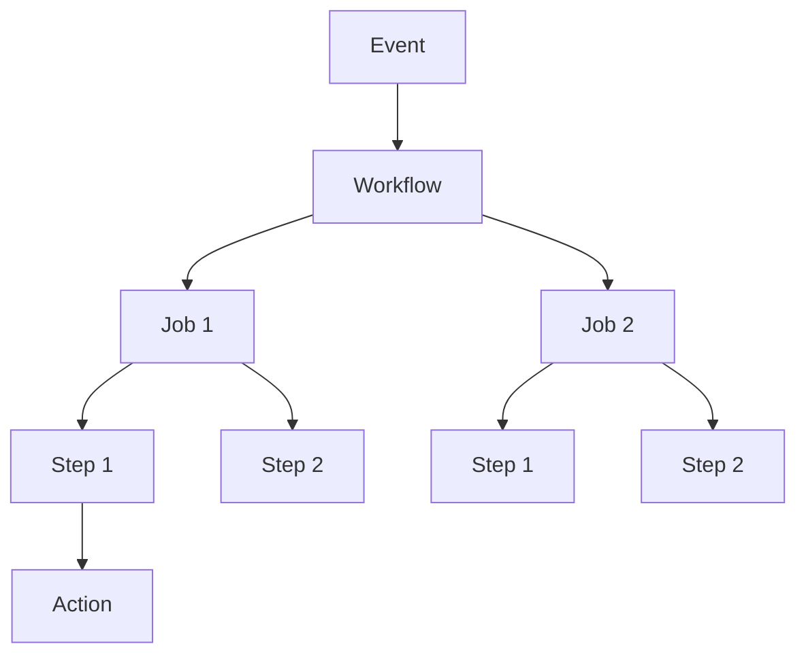

### 8.2.1 GitHub Actions Workflow Syntax: Your Pipeline as Code

#### Why GitHub Actions Matters

GitHub Actions is CI/CD built directly into GitHub. It allows you to:
- **Automate builds, tests, and deployments** – All in one place
- **Pipeline as code** – Workflows defined in `.github/workflows/*.yml`
- **Matrix builds** – Test across multiple versions/OSes
- **Rich ecosystem** – Thousands of pre-built actions

This note covers GitHub Actions workflow syntax. Note 8.2.2 covers building and testing; note 8.2.3 is the subchapter review.

**Backward references:** Git from Module 6 (workflows triggered by Git events); YAML from Module 5 (Kubernetes manifests); CI/CD concepts from 8.1.x.

---

## Part 1: GitHub Actions Basics

### Core Concepts



| Concept | Definition | Example |
|---------|------------|---------|
| **Event** | Trigger that starts a workflow | `push`, `pull_request`, `schedule` |
| **Workflow** | YAML file defining the automation | `.github/workflows/ci.yml` |
| **Job** | Set of steps that run on the same runner | `test`, `build`, `deploy` |
| **Step** | Individual task within a job | `Run: npm test` |
| **Action** | Reusable unit of code | `actions/checkout@v4` |
| **Runner** | Server that executes jobs | `ubuntu-latest`, `windows-latest` |

### Workflow File Location

```
.github/
└── workflows/
    ├── ci.yml           # Continuous Integration
    ├── cd.yml           # Continuous Delivery
    ├── security.yml     # Security scanning
    └── scheduled.yml    # Cron jobs
```

---

## Part 2: Basic Workflow Structure

### Minimal Workflow Example

```yaml
# .github/workflows/ci.yml
name: CI  # Workflow name (appears in GitHub Actions tab)

on:  # Events that trigger this workflow
  push:
    branches: [ "main" ]
  pull_request:
    branches: [ "main" ]

jobs:  # Jobs to run
  build:
    runs-on: ubuntu-latest  # Runner type
    
    steps:  # Steps in this job
    - name: Checkout code
      uses: actions/checkout@v4
      
    - name: Setup Node.js
      uses: actions/setup-node@v4
      with:
        node-version: '18'
        
    - name: Install dependencies
      run: npm ci
      
    - name: Run tests
      run: npm test
```

---

## Part 3: Workflow Triggers (on)

### Push and Pull Request Triggers

```yaml
on:
  # Push to any branch
  push
  
  # Push to specific branches
  push:
    branches:
      - main
      - develop
      - 'releases/**'  # matches releases/1.0, releases/2.0
      
  # Pull request to main
  pull_request:
    branches: [ "main" ]
    
  # Push to any branch except main
  push:
    branches-ignore:
      - main
      
  # Push to paths (only when certain files change)
  push:
    paths:
      - 'src/**'
      - 'tests/**'
    paths-ignore:
      - 'docs/**'
      - '*.md'
```

### Schedule Trigger (Cron)

```yaml
on:
  schedule:
    # Cron syntax: minute hour day month weekday
    - cron: '0 2 * * *'   # Daily at 2 AM UTC
    - cron: '0 0 * * 0'   # Weekly on Sunday
    - cron: '*/15 * * * *'  # Every 15 minutes
```

### Manual Trigger (Workflow Dispatch)

```yaml
on:
  workflow_dispatch:
    inputs:
      environment:
        description: 'Target environment'
        required: true
        default: 'staging'
        type: choice
        options:
          - staging
          - production
      version:
        description: 'Version to deploy'
        required: true
        type: string
```

### Multiple Triggers

```yaml
on:
  push:
    branches: [ main ]
  pull_request:
    branches: [ main ]
  schedule:
    - cron: '0 2 * * *'
  workflow_dispatch:
    inputs:
      debug:
        description: 'Enable debug'
        type: boolean
```

---

## Part 4: Jobs and Runners

### Job Definition

```yaml
jobs:
  # Simple job
  test:
    runs-on: ubuntu-latest
    steps:
      - run: echo "Testing..."
      
  # Job with dependencies
  build:
    needs: test  # Wait for test to complete
    runs-on: ubuntu-latest
    steps:
      - run: echo "Building..."
      
  # Job with multiple dependencies
  deploy:
    needs: [test, build]
    runs-on: ubuntu-latest
```

### Runner Types

| Runner | OS | Use Case | Cost |
|--------|-----|----------|------|
| `ubuntu-latest` | Ubuntu 22.04 | Linux builds, containers | Free (2000 min/month) |
| `ubuntu-22.04` | Ubuntu 22.04 | Specific version | Free |
| `ubuntu-20.04` | Ubuntu 20.04 | Legacy compatibility | Free |
| `windows-latest` | Windows Server 2022 | .NET, Windows apps | Free |
| `macos-latest` | macOS 12 | iOS, macOS apps | Free |
| `self-hosted` | Custom | Large repos, special hardware | Free (own infrastructure) |

### Matrix Builds

Test across multiple versions or environments:

```yaml
jobs:
  test:
    runs-on: ubuntu-latest
    strategy:
      matrix:
        node-version: [16, 18, 20]
        os: [ubuntu-latest, windows-latest]
        exclude:
          - os: windows-latest
            node-version: 16
    steps:
      - uses: actions/checkout@v4
      - uses: actions/setup-node@v4
        with:
          node-version: ${{ matrix.node-version }}
      - run: npm test
```

This creates 2x3 = 6 jobs (minus excluded = 5).

---

## Part 5: Steps and Actions

### Run Commands

```yaml
steps:
  # Single line command
  - name: Print message
    run: echo "Hello World"
    
  # Multi-line command
  - name: Install dependencies
    run: |
      npm ci
      npm run build
      
  # Working directory
  - name: Run in subdirectory
    working-directory: ./frontend
    run: npm test
    
  # Shell choice
  - name: Run bash script
    run: ./script.sh
    shell: bash
    
  # Environment variables
  - name: Use env var
    run: echo $MY_VAR
    env:
      MY_VAR: "hello"
```

### Using Actions

Actions are reusable units from GitHub Marketplace.

```yaml
steps:
  # Official actions
  - uses: actions/checkout@v4
  
  - uses: actions/setup-node@v4
    with:
      node-version: '18'
      
  - uses: actions/cache@v3
    with:
      path: ~/.npm
      key: ${{ runner.os }}-node-${{ hashFiles('package-lock.json') }}
      
  # Third-party actions
  - uses: actions/upload-artifact@v4
    with:
      name: build-output
      path: dist/
      
  # Docker container action
  - uses: docker://alpine:3.18
    with:
      args: /bin/sh -c "echo Hello"
```

---

## Part 6: Environment Variables and Secrets

### Built-in Variables

```yaml
steps:
  - name: Print GitHub context
    run: |
      echo "Repository: ${{ github.repository }}"
      echo "Branch: ${{ github.ref_name }}"
      echo "Commit SHA: ${{ github.sha }}"
      echo "Actor: ${{ github.actor }}"
      echo "Event: ${{ github.event_name }}"
```

### Common GitHub Context Variables

| Variable | Description | Example |
|----------|-------------|---------|
| `github.repository` | Owner/repo name | `octocat/Hello-World` |
| `github.ref_name` | Branch or tag name | `main` |
| `github.sha` | Commit SHA | `a1b2c3d4...` |
| `github.actor` | User who triggered | `octocat` |
| `github.event_name` | Trigger event | `push` |
| `github.workspace` | Working directory | `/home/runner/work/repo/repo` |

### Environment Variables

```yaml
jobs:
  build:
    env:
      NODE_ENV: production
      API_URL: https://api.example.com
    steps:
      - name: Use env
        run: echo $NODE_ENV
      - name: Step-level env
        env:
          STEP_VAR: "step value"
        run: echo $STEP_VAR
```

### Secrets

Secrets are encrypted environment variables stored in GitHub.

```yaml
steps:
  - name: Use secret
    run: echo "Deploying to ${{ secrets.DEPLOY_URL }}"
    env:
      DEPLOY_URL: ${{ secrets.DEPLOY_URL }}
      API_KEY: ${{ secrets.API_KEY }}
```

**Setting secrets:** GitHub → Repository → Settings → Secrets and variables → Actions

---

## Part 7: Conditional Execution

### if Conditions

```yaml
steps:
  - name: Run only on main branch
    if: github.ref == 'refs/heads/main'
    run: echo "Deploying..."
    
  - name: Run only on pull requests
    if: github.event_name == 'pull_request'
    run: npm run test:integration
    
  - name: Skip on certain branches
    if: github.ref_name != 'main'
    run: echo "Not main branch"
    
  - name: Run on success
    if: success()
    run: echo "All previous steps succeeded"
    
  - name: Run on failure
    if: failure()
    run: echo "Something failed"
```

### Continue on Error

```yaml
steps:
  - name: This might fail
    run: npm run flaky-test
    continue-on-error: true
    
  - name: This always runs
    run: echo "Even if previous step failed"
```

---

## Part 8: Artifacts and Caching

### Uploading Artifacts

```yaml
steps:
  - name: Build
    run: npm run build
    
  - name: Upload build artifact
    uses: actions/upload-artifact@v4
    with:
      name: dist-files
      path: dist/
      retention-days: 7
      
  - name: Upload multiple paths
    uses: actions/upload-artifact@v4
    with:
      name: all-outputs
      path: |
        dist/
        coverage/
        logs/
```

### Downloading Artifacts

```yaml
jobs:
  build:
    steps:
      - name: Build
        run: npm run build
      - name: Upload
        uses: actions/upload-artifact@v4
        with:
          name: build-output
          path: dist/
          
  deploy:
    needs: build
    steps:
      - name: Download artifact
        uses: actions/download-artifact@v4
        with:
          name: build-output
          path: ./dist
      - name: Deploy
        run: ./deploy.sh
```

### Caching Dependencies

```yaml
steps:
  - name: Cache npm
    uses: actions/cache@v3
    with:
      path: ~/.npm
      key: ${{ runner.os }}-node-${{ hashFiles('package-lock.json') }}
      restore-keys: |
        ${{ runner.os }}-node-
        
  - name: Cache pip
    uses: actions/cache@v3
    with:
      path: ~/.cache/pip
      key: ${{ runner.os }}-pip-${{ hashFiles('requirements.txt') }}
      
  - name: Cache Docker layers
    uses: actions/cache@v3
    with:
      path: /tmp/.buildx-cache
      key: ${{ runner.os }}-buildx-${{ github.sha }}
      restore-keys: |
        ${{ runner.os }}-buildx-
```

---

## Quick Task: Create a GitHub Actions Workflow

*Create a simple CI workflow for a Node.js project.*

1. Create `.github/workflows/ci.yml` in your repository.
2. Trigger on push to `main` and pull requests.
3. Run on `ubuntu-latest`.
4. Steps: checkout, setup Node.js, install dependencies, run tests.
5. Add caching for `node_modules`.

> **Ready Solution:**
>
> ```yaml
> # .github/workflows/ci.yml
> name: CI
>
> on:
>   push:
>     branches: [ main ]
>   pull_request:
>     branches: [ main ]
>
> jobs:
>   test:
>     runs-on: ubuntu-latest
>     
>     steps:
>     - name: Checkout code
>       uses: actions/checkout@v4
>       
>     - name: Setup Node.js
>       uses: actions/setup-node@v4
>       with:
>         node-version: '18'
>         
>     - name: Cache dependencies
>       uses: actions/cache@v3
>       with:
>         path: node_modules
>         key: ${{ runner.os }}-node-${{ hashFiles('package-lock.json') }}
>         
>     - name: Install dependencies
>       run: npm ci
>       
>     - name: Run tests
>       run: npm test
> ```

---

## Summary Table: GitHub Actions Syntax

### Workflow Structure

| Component | Syntax | Example |
|-----------|--------|---------|
| Name | `name:` | `name: CI` |
| Trigger | `on:` | `on: [push, pull_request]` |
| Job | `jobs:` | `jobs:` |
| Job name | `job_name:` | `test:` |
| Runner | `runs-on:` | `runs-on: ubuntu-latest` |
| Steps | `steps:` | `steps:` |
| Step name | `- name:` | `- name: Checkout` |
| Run command | `run:` | `run: npm test` |
| Use action | `uses:` | `uses: actions/checkout@v4` |

### Trigger Events

| Event | Syntax |
|-------|--------|
| Push | `on: push` |
| Pull request | `on: pull_request` |
| Schedule | `on: schedule: - cron: '0 2 * * *'` |
| Manual | `on: workflow_dispatch` |

### GitHub Context Variables

| Variable | Description |
|----------|-------------|
| `${{ github.repository }}` | Owner/repo name |
| `${{ github.ref_name }}` | Branch/tag name |
| `${{ github.sha }}` | Commit SHA |
| `${{ github.actor }}` | User who triggered |
| `${{ github.event_name }}` | Trigger event |
| `${{ secrets.MY_SECRET }}` | Encrypted secret |

### Matrix Build Syntax

```yaml
strategy:
  matrix:
    node-version: [16, 18, 20]
    os: [ubuntu-latest, windows-latest]
  fail-fast: true
```

---

**Next note (8.2.2)** will cover **Building, Testing, and Publishing Workflows** – building applications, running tests, publishing artifacts, and Docker images.

**Backward references:**
- Git from Module 6 (workflows triggered by Git events)
- YAML from Module 5 (syntax similar to Kubernetes manifests)
- CI/CD pipeline stages from 8.1.2 (implementing them in GitHub Actions)
