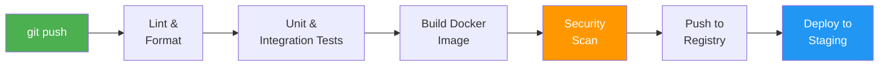

# 8.2.2 Building, Testing, and Publishing Workflows: From Code to Artifact

**Backlinks:** [Module 4 — Docker](../../4-Docker/) (building and pushing images; multi-platform builds) | [8.1.2 — Pipeline Stages](../Subchapter_8.1/8.1.2_Pipeline_Stages_Deep_Dive.md) (implementing stages in code) | [8.2.1 — GitHub Actions Syntax](./8.2.1_GitHub_Actions_Workflow_Syntax.md)

**Next note:** [8.2.3 — Reusable Workflows, OIDC Authentication, and Monorepo CI](./8.2.3_Reusable_Workflows_OIDC_and_Monorepo_CI.md)

---

## Why This Matters

Once you understand workflow syntax (8.2.1), you need to actually **do** things: build code, run tests, and publish artifacts. This note covers practical workflows for different languages and deployment targets.

---

### CI/CD Pipeline Flow



## Part 1: Node.js / JavaScript Workflow

### Complete Node.js CI/CD Workflow

```yaml
# .github/workflows/nodejs.yml
name: Node.js CI/CD

on:
  push:
    branches: [ main ]
    paths-ignore:
      - 'docs/**'
      - '**.md'
  pull_request:
    branches: [ main ]

jobs:
  test:
    runs-on: ubuntu-latest
    
    strategy:
      matrix:
        node-version: [16, 18, 20]
        
    steps:
    - uses: actions/checkout@v4
    
    - name: Use Node.js ${{ matrix.node-version }}
      uses: actions/setup-node@v4
      with:
        node-version: ${{ matrix.node-version }}
        cache: 'npm'
        
    - name: Install dependencies
      run: npm ci
      
    - name: Run linter
      run: npm run lint
      
    - name: Run unit tests
      run: npm test
      
    - name: Run tests with coverage
      run: npm run test:coverage
      
    - name: Upload coverage report
      uses: actions/upload-artifact@v4
      with:
        name: coverage-${{ matrix.node-version }}
        path: coverage/
        
  build:
    needs: test
    runs-on: ubuntu-latest
    if: github.ref == 'refs/heads/main'
    
    steps:
    - uses: actions/checkout@v4
    
    - name: Setup Node.js
      uses: actions/setup-node@v4
      with:
        node-version: '18'
        
    - name: Install dependencies
      run: npm ci
      
    - name: Build application
      run: npm run build
      
    - name: Upload build artifact
      uses: actions/upload-artifact@v4
      with:
        name: build
        path: dist/
        
  publish:
    needs: build
    runs-on: ubuntu-latest
    if: github.ref == 'refs/heads/main'
    
    steps:
    - uses: actions/checkout@v4
    
    - name: Download build artifact
      uses: actions/download-artifact@v4
      with:
        name: build
        path: dist/
        
    - name: Setup Node.js
      uses: actions/setup-node@v4
      with:
        node-version: '18'
        registry-url: 'https://registry.npmjs.org'
        
    - name: Publish to npm
      run: npm publish
      env:
        NODE_AUTH_TOKEN: ${{ secrets.NPM_TOKEN }}
```

---

## Part 2: Python Workflow

```yaml
# .github/workflows/python.yml
name: Python CI/CD

on:
  push:
    branches: [ main ]
  pull_request:
    branches: [ main ]

jobs:
  test:
    runs-on: ubuntu-latest
    
    strategy:
      matrix:
        python-version: ['3.9', '3.10', '3.11']
        
    steps:
    - uses: actions/checkout@v4
    
    - name: Set up Python ${{ matrix.python-version }}
      uses: actions/setup-python@v5
      with:
        python-version: ${{ matrix.python-version }}
        
    - name: Cache pip
      uses: actions/cache@v3
      with:
        path: ~/.cache/pip
        key: ${{ runner.os }}-pip-${{ hashFiles('requirements.txt') }}
        
    - name: Install dependencies
      run: |
        python -m pip install --upgrade pip
        pip install -r requirements.txt
        pip install pytest pytest-cov flake8
        
    - name: Lint with flake8
      run: |
        flake8 . --count --max-complexity=10 --statistics
        
    - name: Test with pytest
      run: |
        pytest tests/ --cov=myapp --cov-report=xml
        
    - name: Upload coverage to Codecov
      uses: codecov/codecov-action@v3
      with:
        file: ./coverage.xml
        
  build:
    needs: test
    runs-on: ubuntu-latest
    if: github.ref == 'refs/heads/main'
    
    steps:
    - uses: actions/checkout@v4
    
    - name: Set up Python
      uses: actions/setup-python@v5
      with:
        python-version: '3.11'
        
    - name: Build package
      run: |
        pip install build
        python -m build
        
    - name: Upload package
      uses: actions/upload-artifact@v4
      with:
        name: dist
        path: dist/
        
  publish:
    needs: build
    runs-on: ubuntu-latest
    if: github.ref == 'refs/heads/main'
    
    steps:
    - uses: actions/checkout@v4
    
    - name: Download package
      uses: actions/download-artifact@v4
      with:
        name: dist
        path: dist/
        
    - name: Publish to PyPI
      uses: pypa/gh-action-pypi-publish@release/v1
      with:
        password: ${{ secrets.PYPI_API_TOKEN }}
```

---

## Part 3: Go Workflow

```yaml
# .github/workflows/go.yml
name: Go CI/CD

on:
  push:
    branches: [ main ]
  pull_request:
    branches: [ main ]

jobs:
  test:
    runs-on: ubuntu-latest
    
    strategy:
      matrix:
        go-version: ['1.20', '1.21']
        
    steps:
    - uses: actions/checkout@v4
    
    - name: Set up Go
      uses: actions/setup-go@v5
      with:
        go-version: ${{ matrix.go-version }}
        
    - name: Cache Go modules
      uses: actions/cache@v3
      with:
        path: ~/go/pkg/mod
        key: ${{ runner.os }}-go-${{ hashFiles('go.sum') }}
        
    - name: Download dependencies
      run: go mod download
      
    - name: Run vet
      run: go vet ./...
      
    - name: Run tests
      run: go test -v -race -coverprofile=coverage.out ./...
      
    - name: Upload coverage
      uses: actions/upload-artifact@v4
      with:
        name: coverage
        path: coverage.out
        
  build:
    needs: test
    runs-on: ubuntu-latest
    if: github.ref == 'refs/heads/main'
    
    steps:
    - uses: actions/checkout@v4
    
    - name: Set up Go
      uses: actions/setup-go@v5
      with:
        go-version: '1.21'
        
    - name: Build binary
      run: |
        GOOS=linux GOARCH=amd64 go build -o myapp-linux-amd64
        GOOS=darwin GOARCH=amd64 go build -o myapp-darwin-amd64
        GOOS=windows GOARCH=amd64 go build -o myapp-windows-amd64.exe
        
    - name: Upload binaries
      uses: actions/upload-artifact@v4
      with:
        name: binaries
        path: myapp-*
```

---

## Part 4: Java (Maven) Workflow

```yaml
# .github/workflows/java.yml
name: Java CI/CD

on:
  push:
    branches: [ main ]
  pull_request:
    branches: [ main ]

jobs:
  test:
    runs-on: ubuntu-latest
    
    steps:
    - uses: actions/checkout@v4
    
    - name: Set up JDK 17
      uses: actions/setup-java@v4
      with:
        java-version: '17'
        distribution: 'temurin'
        cache: maven
        
    - name: Run tests
      run: mvn test
      
    - name: Run integration tests
      run: mvn verify
      
    - name: Generate coverage report
      run: mvn jacoco:report
      
    - name: Upload coverage
      uses: actions/upload-artifact@v4
      with:
        name: coverage
        path: target/site/jacoco/
        
  build:
    needs: test
    runs-on: ubuntu-latest
    if: github.ref == 'refs/heads/main'
    
    steps:
    - uses: actions/checkout@v4
    
    - name: Set up JDK 17
      uses: actions/setup-java@v4
      with:
        java-version: '17'
        distribution: 'temurin'
        
    - name: Build with Maven
      run: mvn package -DskipTests
      
    - name: Upload JAR
      uses: actions/upload-artifact@v4
      with:
        name: jar
        path: target/*.jar
```

---

## Part 5: Docker Build and Push Workflow

```yaml
# .github/workflows/docker.yml
name: Docker Build and Push

on:
  push:
    branches: [ main ]
    tags:
      - 'v*'
  pull_request:
    branches: [ main ]

env:
  REGISTRY: ghcr.io
  IMAGE_NAME: ${{ github.repository }}

jobs:
  build-and-push:
    runs-on: ubuntu-latest
    
    permissions:
      contents: read
      packages: write
      
    steps:
    - name: Checkout repository
      uses: actions/checkout@v4
      
    - name: Set up Docker Buildx
      uses: docker/setup-buildx-action@v3
      
    - name: Log in to GitHub Container Registry
      uses: docker/login-action@v3
      with:
        registry: ${{ env.REGISTRY }}
        username: ${{ github.actor }}
        password: ${{ secrets.GITHUB_TOKEN }}
        
    - name: Log in to Docker Hub
      uses: docker/login-action@v3
      with:
        username: ${{ secrets.DOCKER_USERNAME }}
        password: ${{ secrets.DOCKER_TOKEN }}
        
    - name: Extract metadata
      id: meta
      uses: docker/metadata-action@v5
      with:
        images: |
          ${{ env.REGISTRY }}/${{ env.IMAGE_NAME }}
          ${{ secrets.DOCKER_USERNAME }}/${{ github.event.repository.name }}
        tags: |
          type=ref,event=branch
          type=ref,event=pr
          type=semver,pattern={{version}}
          type=semver,pattern={{major}}.{{minor}}
          type=sha,format=short
          
    - name: Build and push Docker image
      uses: docker/build-push-action@v5
      with:
        context: .
        push: ${{ github.event_name != 'pull_request' }}
        tags: ${{ steps.meta.outputs.tags }}
        labels: ${{ steps.meta.outputs.labels }}
        cache-from: type=gha
        cache-to: type=gha,mode=max
```

### Multi-Platform Docker Builds (linux/amd64 + linux/arm64)

ARM chips (Apple M-series, AWS Graviton, Raspberry Pi) use the `linux/arm64` architecture. By default, `docker build` only builds for your current machine's architecture — if you build on an x86 laptop, the image only runs on x86 servers. `docker buildx` enables building for **multiple platforms in one command**, producing a single image manifest that Docker automatically serves the correct binary for:

```
Manifest: ghcr.io/org/myapp:v1.2.3
  └── linux/amd64  → for x86 servers, GitHub Actions runners
  └── linux/arm64  → for AWS Graviton, Apple M1/M2, Raspberry Pi
```

```yaml
# .github/workflows/docker-multiplatform.yml
name: Multi-Platform Docker Build

on:
  push:
    branches: [ main ]

jobs:
  build:
    runs-on: ubuntu-latest
    steps:
      - uses: actions/checkout@v4

      - name: Set up QEMU
        # QEMU is a CPU emulator. GitHub-hosted runners are x86_64 machines.
        # To build an ARM image (linux/arm64) on an x86 runner, Docker uses QEMU
        # to emulate an ARM processor in software. This is slower than native ARM
        # but means you don't need a separate ARM build machine.
        # Without QEMU, `--platform linux/arm64` would fail with "exec format error".
        uses: docker/setup-qemu-action@v3

      - name: Set up Docker Buildx
        uses: docker/setup-buildx-action@v3

      - name: Log in to GHCR
        uses: docker/login-action@v3
        with:
          registry: ghcr.io
          username: ${{ github.actor }}
          password: ${{ secrets.GITHUB_TOKEN }}

      - name: Build and push multi-platform image
        uses: docker/build-push-action@v5
        with:
          context: .
          platforms: linux/amd64,linux/arm64   # Build for both architectures
          push: true
          tags: ghcr.io/${{ github.repository }}:latest
          cache-from: type=gha                 # GitHub Actions cache for layers
          cache-to: type=gha,mode=max
```

> **Why `cache-from: type=gha`?** Docker layer caching is stored in GitHub's cache service. `mode=max` caches all layers (including intermediate ones), maximizing cache hits. Without this, every build re-downloads base images and re-runs `RUN npm ci` even if `package.json` didn't change.

---

## Part 6: Security Scanning Workflow

```yaml
# .github/workflows/security.yml
name: Security Scan

on:
  push:
    branches: [ main ]
  pull_request:
    branches: [ main ]
  schedule:
    - cron: '0 2 * * *'  # Daily scan

jobs:
  trivy-scan:
    runs-on: ubuntu-latest
    
    steps:
    - uses: actions/checkout@v4
    
    - name: Run Trivy vulnerability scanner
      uses: aquasecurity/trivy-action@master
      with:
        scan-type: 'fs'
        scan-ref: '.'
        format: 'sarif'
        output: 'trivy-results.sarif'
        severity: 'CRITICAL,HIGH'
        
    - name: Upload Trivy results to GitHub Security tab
      uses: github/codeql-action/upload-sarif@v3
      with:
        sarif_file: 'trivy-results.sarif'
        
  snyk-scan:
    runs-on: ubuntu-latest
    
    steps:
    - uses: actions/checkout@v4
    
    - name: Run Snyk to check for vulnerabilities
      uses: snyk/actions/node@master
      env:
        SNYK_TOKEN: ${{ secrets.SNYK_TOKEN }}
      with:
        args: --severity-threshold=high
```

---

## Part 7: Multi-Stage Workflow with Dependencies

```yaml
# .github/workflows/full-pipeline.yml
name: Full CI/CD Pipeline

on:
  push:
    branches: [ main ]

env:
  REGISTRY: ghcr.io
  IMAGE_NAME: ${{ github.repository }}

jobs:
  # Stage 1: Lint and Test
  lint-and-test:
    runs-on: ubuntu-latest
    steps:
      - uses: actions/checkout@v4
      - uses: actions/setup-node@v4
        with:
          node-version: '18'
      - run: npm ci
      - run: npm run lint
      - run: npm test
      - uses: actions/upload-artifact@v4
        with:
          name: test-results
          path: test-results/
          
  # Stage 2: Build and Scan (depends on test)
  build-and-scan:
    needs: lint-and-test
    runs-on: ubuntu-latest
    steps:
      - uses: actions/checkout@v4
      - name: Build Docker image
        run: docker build -t ${{ env.IMAGE_NAME }} .
      - name: Scan image with Trivy
        uses: aquasecurity/trivy-action@master
        with:
          image-ref: ${{ env.IMAGE_NAME }}
          severity: CRITICAL,HIGH
          exit-code: '1'
          
  # Stage 3: Push to Registry (depends on scan)
  push-to-registry:
    needs: build-and-scan
    runs-on: ubuntu-latest
    if: github.ref == 'refs/heads/main'
    steps:
      - uses: actions/checkout@v4
      - uses: docker/login-action@v3
        with:
          registry: ${{ env.REGISTRY }}
          username: ${{ github.actor }}
          password: ${{ secrets.GITHUB_TOKEN }}
      - name: Build and push
        uses: docker/build-push-action@v5
        with:
          push: true
          tags: ${{ env.REGISTRY }}/${{ env.IMAGE_NAME }}:latest
          
  # Stage 4: Deploy to Staging (depends on push)
  deploy-staging:
    needs: push-to-registry
    runs-on: ubuntu-latest
    environment: staging
    steps:
      - uses: actions/checkout@v4
      - name: Deploy to Kubernetes
        run: |
          kubectl set image deployment/myapp myapp=${{ env.REGISTRY }}/${{ env.IMAGE_NAME }}:latest
          kubectl rollout status deployment/myapp
          
  # Stage 5: Smoke Test (depends on deploy)
  smoke-test:
    needs: deploy-staging
    runs-on: ubuntu-latest
    steps:
      - name: Run smoke tests
        run: |
          curl --fail https://staging.example.com/health
          
  # Stage 6: Deploy to Production (manual approval)
  deploy-production:
    needs: smoke-test
    runs-on: ubuntu-latest
    environment: production
    if: github.ref == 'refs/heads/main'
    steps:
      - name: Deploy to production
        run: |
          kubectl set image deployment/myapp myapp=${{ env.REGISTRY }}/${{ env.IMAGE_NAME }}:latest
          kubectl rollout status deployment/myapp
```

---

## Quick Task: Create a Docker Build Workflow

*Create a GitHub Actions workflow that builds and pushes a Docker image.*

1. Create `.github/workflows/docker-build.yml`.
2. Trigger on push to `main` and on tags.
3. Build Docker image.
4. Push to GitHub Container Registry (GHCR).
5. Add tags for `latest` and git SHA.

> **Ready Solution:**
>
> ```yaml
> # .github/workflows/docker-build.yml
> name: Docker Build
>
> on:
>   push:
>     branches: [ main ]
>     tags:
>       - 'v*'
>
> env:
>   REGISTRY: ghcr.io
>   IMAGE_NAME: ${{ github.repository }}
>
> jobs:
>   build:
>     runs-on: ubuntu-latest
>     
>     permissions:
>       contents: read
>       packages: write
>       
>     steps:
>     - name: Checkout
>       uses: actions/checkout@v4
>       
>     - name: Log in to GHCR
>       uses: docker/login-action@v3
>       with:
>         registry: ${{ env.REGISTRY }}
>         username: ${{ github.actor }}
>         password: ${{ secrets.GITHUB_TOKEN }}
>         
>     - name: Build and push
>       uses: docker/build-push-action@v5
>       with:
>         push: true
>         tags: |
>           ${{ env.REGISTRY }}/${{ env.IMAGE_NAME }}:latest
>           ${{ env.REGISTRY }}/${{ env.IMAGE_NAME }}:${{ github.sha }}
> ```

---

## Summary Table: Build Commands by Language

| Language | Install | Build | Test |
|----------|---------|-------|------|
| Node.js | `npm ci` | `npm run build` | `npm test` |
| Python | `pip install -r requirements.txt` | `python -m build` | `pytest` |
| Go | `go mod download` | `go build` | `go test` |
| Java (Maven) | `mvn dependency:resolve` | `mvn package` | `mvn test` |
| Docker | `docker build` | N/A | N/A |

### GitHub Actions Caching Keys

| Language | Cache Path | Key Example |
|----------|------------|-------------|
| Node.js | `~/.npm` | `${{ runner.os }}-node-${{ hashFiles('package-lock.json') }}` |
| Python | `~/.cache/pip` | `${{ runner.os }}-pip-${{ hashFiles('requirements.txt') }}` |
| Go | `~/go/pkg/mod` | `${{ runner.os }}-go-${{ hashFiles('go.sum') }}` |
| Maven | `~/.m2` | `${{ runner.os }}-m2-${{ hashFiles('pom.xml') }}` |

### Docker Metadata Tags — What Each Type Produces

| Tag Type | Config | Example Output | When Generated |
|----------|--------|----------------|----------------|
| Branch ref | `type=ref,event=branch` | `main`, `feature-xyz` | Push to any branch |
| PR number | `type=ref,event=pr` | `pr-42` | Pull request |
| SemVer full | `type=semver,pattern={{version}}` | `1.2.3` | Git tag `v1.2.3` |
| SemVer major.minor | `type=semver,pattern={{major}}.{{minor}}` | `1.2` | Git tag `v1.2.3` |
| Short SHA | `type=sha,format=short` | `abc1234` (7 chars) | Every build |
| Latest | `type=raw,value=latest` | `latest` | Manually set |

> **`type=sha,format=short`** generates a 7-character commit SHA tag (e.g., `abc1234`). The full SHA is 40 chars — too long for image tags. `format=short` truncates it to the standard Git short-SHA length. This makes every build uniquely and immutably identifiable: you can always reproduce exactly which code produced `myapp:abc1234`.

---

**Next note:** [8.2.3 — Reusable Workflows, OIDC Authentication, and Monorepo CI](./8.2.3_Reusable_Workflows_OIDC_and_Monorepo_CI.md) — cheatsheet and interview prep for GitHub Actions workflows.
