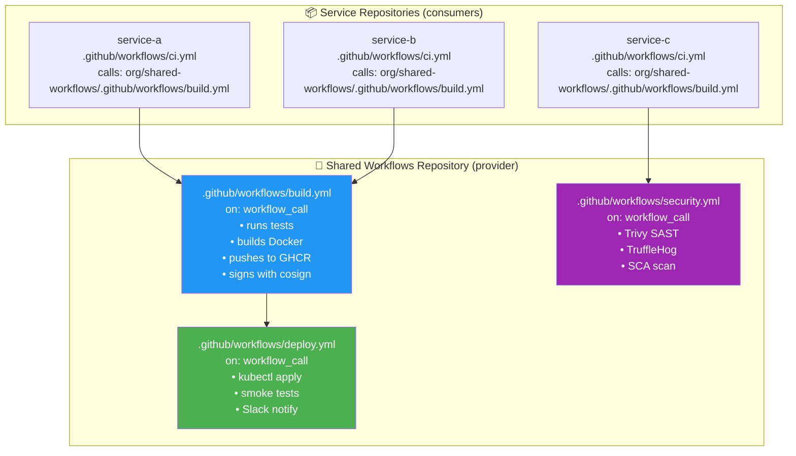
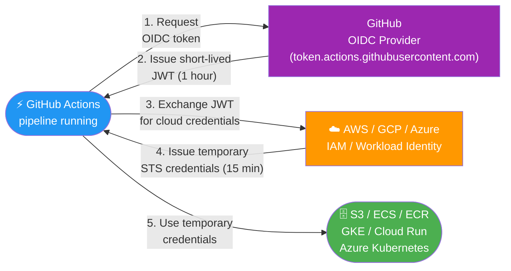
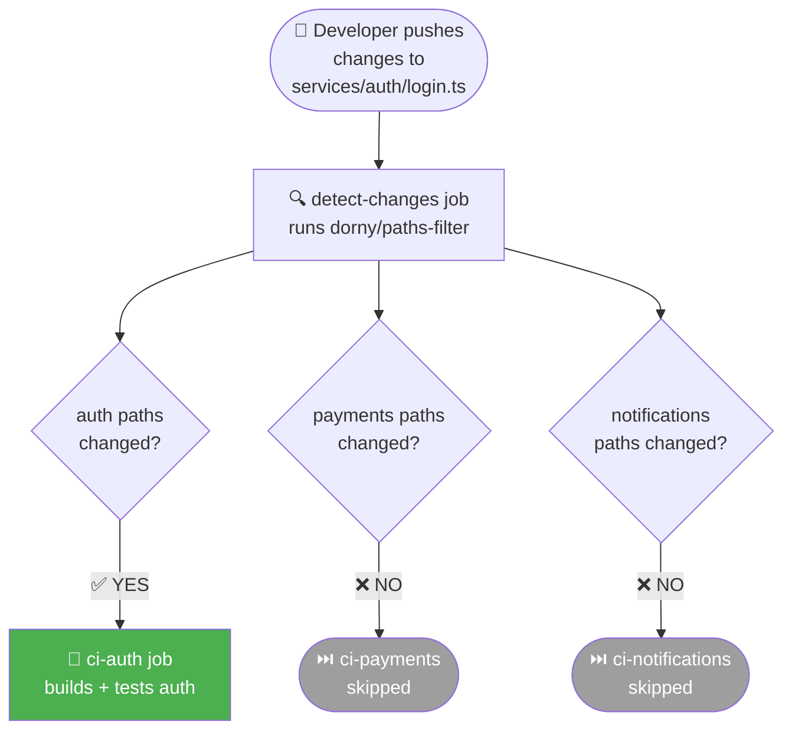
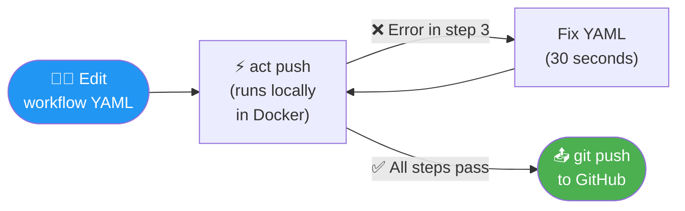

# 8.2.3 Reusable Workflows, OIDC Authentication, and Monorepo CI

**Backlinks:** [Module 6 — Git](../../6-Git/) (monorepo structure; path-based triggers) | [8.2.1 — GitHub Actions Syntax](./8.2.1_GitHub_Actions_Workflow_Syntax.md) | [8.2.2 — Building Workflows](./8.2.2_Building_Test_and_Publish_Workflows.md) | [8.2.4 — Subchapter 8.2 Review](./8.2.4_Subchapter_Review.md)

**Next note:** [8.2.4 — Subchapter 8.2 Review](./8.2.4_Subchapter_Review.md)

---

## Why These Patterns Matter

Once you have basic GitHub Actions working, the next problem is **scale**:
- You have 20 microservices — do you copy-paste the same CI workflow 20 times?
- Every service deploys to AWS — do you store long-lived `AWS_ACCESS_KEY_ID` secrets in all 20 repos?
- You push code but the pipeline takes 45 minutes — how do you test it locally?
- Your monorepo has 10 services — how do you only build the ones that changed?

This note answers all four questions.

---

## Part 0: The `workflow_run` Trigger — Chaining Workflows

Before reusable workflows, the `workflow_run` trigger lets one workflow start after another completes — even across different workflow files. It is the "call this workflow when that one finishes" pattern.

```yaml
# .github/workflows/deploy.yml
on:
  workflow_run:
    workflows: ["CI"]          # name of the workflow to wait for
    types: [completed]         # fire when CI completes (any result)
    branches: [main]

jobs:
  deploy:
    # Only deploy if CI actually passed
    if: ${{ github.event.workflow_run.conclusion == 'success' }}
    runs-on: ubuntu-latest
    steps:
      - name: Deploy
        run: kubectl set image deployment/myapp myapp:${{ github.event.workflow_run.head_sha }}
```

**`workflow_run` vs `needs:`:**

| Feature | `needs:` | `workflow_run` |
|---------|---------|----------------|
| Scope | Within one workflow file | Across different workflow files |
| Trigger | Sequential jobs in same run | New workflow run |
| Use case | Stage ordering | Separate CI and CD workflows |
| Security | Same permissions | CD can have different secrets from CI |

> **Common pattern:** CI workflow (`ci.yml`) runs on every PR and push. CD workflow (`deploy.yml`) uses `workflow_run: [CI]` to deploy only when CI passes on `main` — the CD file doesn't need to re-define the test stages.

---

## Part 1: Reusable Workflows — DRY Pipelines

A **reusable workflow** is a GitHub Actions workflow that can be called from another workflow — like a function call. One team maintains the CI standard; all services consume it.



### Defining a Reusable Workflow

The **provider** workflow uses `on: workflow_call:` instead of `on: push:`.

```yaml
# .github/workflows/build-and-push.yml  (in org/shared-workflows repo)
name: Reusable Build and Push

on:
  workflow_call:              # This makes it callable from other workflows
    inputs:
      image-name:
        description: 'Docker image name'
        required: true
        type: string
      dockerfile:
        description: 'Path to Dockerfile'
        required: false
        type: string
        default: './Dockerfile'
      node-version:
        required: false
        type: string
        default: '20'
    secrets:
      registry-token:         # Caller must pass secrets explicitly
        required: true
    outputs:
      image-tag:              # Return values to the caller
        description: 'The built image tag'
        value: ${{ jobs.build.outputs.tag }}

jobs:
  build:
    runs-on: ubuntu-latest
    outputs:
      tag: ${{ steps.meta.outputs.version }}

    steps:
      - uses: actions/checkout@v4

      - name: Set up Node.js
        uses: actions/setup-node@v4
        with:
          node-version: ${{ inputs.node-version }}

      - name: Install and test
        run: |
          npm ci
          npm test

      - name: Log in to GHCR
        uses: docker/login-action@v3
        with:
          registry: ghcr.io
          username: ${{ github.actor }}
          password: ${{ secrets.registry-token }}    # from caller

      - name: Extract metadata
        id: meta
        uses: docker/metadata-action@v5
        with:
          images: ghcr.io/${{ inputs.image-name }}
          tags: type=sha,format=short

      - name: Build and push
        uses: docker/build-push-action@v5
        with:
          file: ${{ inputs.dockerfile }}
          push: true
          tags: ${{ steps.meta.outputs.tags }}
```

### Calling a Reusable Workflow

The **caller** workflow uses `uses:` at the job level (not step level):

```yaml
# .github/workflows/ci.yml  (in org/service-a repo)
name: CI

on:
  push:
    branches: [ main ]
  pull_request:
    branches: [ main ]

jobs:
  # Call the shared build workflow
  build:
    uses: org/shared-workflows/.github/workflows/build-and-push.yml@main
    with:
      image-name: org/service-a
      node-version: '18'
    secrets:
      registry-token: ${{ secrets.GITHUB_TOKEN }}

  # Use the output from the reusable workflow
  deploy:
    needs: build
    runs-on: ubuntu-latest
    steps:
      - name: Deploy with image tag
        run: |
          kubectl set image deployment/service-a \
            service-a=ghcr.io/org/service-a:${{ needs.build.outputs.image-tag }}
```

### Reusable Workflow Rules and Gotchas

| Rule | Detail |
|------|--------|
| **Trigger must be `workflow_call`** | The provider workflow must include `on: workflow_call:` |
| **Secrets must be passed explicitly** | `secrets: inherit` passes ALL caller secrets; or list them individually |
| **Job-level `uses`** | Reusable workflows are called at the `jobs:` level, not `steps:` level |
| **`@ref` required** | Always pin to a SHA or tag: `uses: org/repo/.github/workflows/build.yml@v1.2` |
| **Called workflows count toward limits** | Nested calls limited to 4 levels deep |
| **Cannot use local actions** | The called workflow runs in its own repository context |

### `secrets: inherit` vs Explicit Secret Passing

When calling a reusable workflow, you can pass secrets two ways:

```yaml
# Option 1: inherit — passes ALL caller secrets to the called workflow
jobs:
  build:
    uses: org/shared-workflows/.github/workflows/build.yml@main
    with:
      image-name: myapp
    secrets: inherit        # ⚠️ ALL repo secrets are available in the called workflow
```

```yaml
# Option 2: explicit — passes only the secrets the workflow needs
jobs:
  build:
    uses: org/shared-workflows/.github/workflows/build.yml@main
    with:
      image-name: myapp
    secrets:
      registry-token: ${{ secrets.GITHUB_TOKEN }}    # only this secret is passed
      # SLACK_TOKEN, AWS_KEY, etc. are NOT available in the called workflow
```

**When to use which:**

| Approach | Use When | Risk |
|----------|----------|------|
| **`secrets: inherit`** | Calling a workflow **within the same repo** or a trusted org-internal workflow | Low (same trust boundary) |
| **Explicit secrets** | Calling a **third-party** or **cross-org** reusable workflow | None (principle of least privilege) |
| **`secrets: inherit`** | Rapid prototyping — simplify initial setup | Medium (refactor to explicit later) |
| **Explicit secrets** | Production, security-sensitive deployments | None (recommended default) |

> **Security rule of thumb:** Default to **explicit secret passing**. Use `secrets: inherit` only when the called workflow is maintained by the same team/org. A reusable workflow with `secrets: inherit` can read `PRODUCTION_DB_PASSWORD` even if it only needs `GITHUB_TOKEN` — this violates least privilege.

---

## Part 2: Composite Actions — Reusable Step Sequences

A **composite action** packages a sequence of steps that can be reused across workflows **at the step level** (unlike reusable workflows which are job-level).

```
Reusable Workflow = callable JOB (runs on its own runner)
Composite Action  = callable STEP SEQUENCE (runs inline on the caller's runner)
```

### Defining a Composite Action

```yaml
# .github/actions/setup-and-cache/action.yml
name: 'Setup Node.js with Cache'
description: 'Checkout, setup Node.js, restore cache, and install dependencies'

inputs:
  node-version:
    description: 'Node.js version to use'
    required: false
    default: '20'
  working-directory:
    description: 'Directory containing package.json'
    required: false
    default: '.'

outputs:
  cache-hit:
    description: 'Whether cache was restored'
    value: ${{ steps.cache.outputs.cache-hit }}

runs:
  using: 'composite'    # This makes it a composite action
  steps:
    - uses: actions/checkout@v4

    - uses: actions/setup-node@v4
      with:
        node-version: ${{ inputs.node-version }}

    - name: Cache npm
      id: cache
      uses: actions/cache@v3
      with:
        path: ${{ inputs.working-directory }}/node_modules
        key: ${{ runner.os }}-node-${{ hashFiles(format('{0}/package-lock.json', inputs.working-directory)) }}

    - name: Install dependencies
      if: steps.cache.outputs.cache-hit != 'true'
      shell: bash
      working-directory: ${{ inputs.working-directory }}
      run: npm ci
```

### Using a Composite Action

```yaml
jobs:
  test:
    runs-on: ubuntu-latest
    steps:
      # Use composite action — all 4 steps above run here
      - name: Setup Node.js environment
        uses: ./.github/actions/setup-and-cache   # local action
        with:
          node-version: '18'
          working-directory: './frontend'

      # Continue with your steps
      - name: Run tests
        run: npm test
        working-directory: ./frontend

  build:
    runs-on: ubuntu-latest
    steps:
      - name: Setup Node.js environment
        uses: ./.github/actions/setup-and-cache   # reuse the same action
        with:
          node-version: '18'

      - name: Build
        run: npm run build
```

---

## Part 3: OIDC Authentication — Keyless Cloud Access

### The Problem with Static Secrets

The traditional approach to deploying to AWS/GCP/Azure from GitHub Actions is to store long-lived credentials as repository secrets:

```yaml
# ❌ Old approach — risky
- name: Configure AWS
  uses: aws-actions/configure-aws-credentials@v4
  with:
    aws-access-key-id: ${{ secrets.AWS_ACCESS_KEY_ID }}
    aws-secret-access-key: ${{ secrets.AWS_SECRET_ACCESS_KEY }}
    aws-region: us-east-1
```

**Problems:**
- Long-lived keys can be leaked (accidentally committed, stolen from logs)
- Keys must be rotated manually
- If a repo is compromised, the key is compromised until rotated

### OIDC — Identity-Based, Keyless Authentication

**OpenID Connect (OIDC)** lets GitHub Actions prove its identity to cloud providers using a short-lived JWT token. No secrets stored, no rotation needed.



### OIDC with AWS

**Step 1 — Configure AWS trust (one-time, in Terraform or AWS Console):**

```hcl
# terraform/github-oidc.tf
resource "aws_iam_openid_connect_provider" "github" {
  url             = "https://token.actions.githubusercontent.com"
  client_id_list  = ["sts.amazonaws.com"]
  thumbprint_list = ["6938fd4d98bab03faadb97b34396831e3780aea1"]
  # thumbprint_list: the SHA-1 fingerprint of GitHub's OIDC server TLS certificate.
  # AWS uses this to verify it's talking to the real GitHub OIDC endpoint, not an impersonator.
  # This value is stable (GitHub doesn't rotate it often), but you can regenerate it:
  # openssl s_client -connect token.actions.githubusercontent.com:443 2>/dev/null \
  #   | openssl x509 -fingerprint -noout -sha1 | tr -d ':' | cut -d= -f2 | tr '[:upper:]' '[:lower:]'
}

resource "aws_iam_role" "github_actions" {
  name = "github-actions-cicd"

  assume_role_policy = jsonencode({
    Version = "2012-10-17"
    Statement = [{
      Effect    = "Allow"
      Principal = { Federated = aws_iam_openid_connect_provider.github.arn }
      Action    = "sts:AssumeRoleWithWebIdentity"
      Condition = {
        StringLike = {
          # Only allow from your specific repo and branch
          "token.actions.githubusercontent.com:sub" = "repo:org/myrepo:ref:refs/heads/main"
        }
      }
    }]
  })
}

# Attach only the permissions needed (ECR push, ECS deploy)
resource "aws_iam_role_policy_attachment" "ecr" {
  role       = aws_iam_role.github_actions.name
  policy_arn = "arn:aws:iam::aws:policy/AmazonEC2ContainerRegistryPowerUser"
}
```

**Step 2 — Use OIDC in GitHub Actions:**

```yaml
jobs:
  deploy:
    runs-on: ubuntu-latest
    permissions:
      id-token: write    # REQUIRED — allows requesting OIDC JWT
      contents: read

    steps:
      - uses: actions/checkout@v4

      - name: Configure AWS credentials (OIDC — no secrets!)
        uses: aws-actions/configure-aws-credentials@v4
        with:
          role-to-assume: arn:aws:iam::123456789012:role/github-actions-cicd
          aws-region: us-east-1
          # No aws-access-key-id or aws-secret-access-key needed!

      - name: Push to ECR
        run: |
          aws ecr get-login-password | docker login --username AWS --password-stdin 123456789012.dkr.ecr.us-east-1.amazonaws.com
          docker build -t 123456789012.dkr.ecr.us-east-1.amazonaws.com/myapp:${{ github.sha }} .
          docker push 123456789012.dkr.ecr.us-east-1.amazonaws.com/myapp:${{ github.sha }}
```

### OIDC with GCP

```yaml
jobs:
  deploy:
    runs-on: ubuntu-latest
    permissions:
      id-token: write
      contents: read

    steps:
      - uses: actions/checkout@v4

      - name: Authenticate to Google Cloud
        uses: google-github-actions/auth@v2
        with:
          workload_identity_provider: 'projects/123/locations/global/workloadIdentityPools/github/providers/github'
          service_account: 'github-actions@myproject.iam.gserviceaccount.com'

      - name: Deploy to Cloud Run
        uses: google-github-actions/deploy-cloudrun@v2
        with:
          service: myapp
          region: us-central1
          image: gcr.io/myproject/myapp:${{ github.sha }}
```

### OIDC vs Static Secrets Comparison

| Aspect | Static Secrets | OIDC |
|--------|---------------|------|
| **Credential lifetime** | Permanent (until rotated) | 15–60 minutes |
| **Storage** | GitHub secrets | No storage needed |
| **Rotation** | Manual | Automatic (every run) |
| **Scope control** | One key = all permissions | Per-repo, per-branch conditions |
| **Audit trail** | Hard to trace | Full IAM CloudTrail logs |
| **Leak risk** | High | Minimal (expires in minutes) |
| **Setup complexity** | Low | Medium (one-time IAM config) |

---

## Part 4: Monorepo CI — Only Build What Changed

In a **monorepo**, all services live in one repository. Naively, every commit triggers CI for all 20 services — slow and wasteful. The solution is **path filtering**.

```
monorepo/
├── services/
│   ├── auth/          ← only rebuild if auth/ changed
│   ├── payments/      ← only rebuild if payments/ changed
│   └── notifications/ ← only rebuild if notifications/ changed
├── packages/
│   └── shared-lib/    ← rebuild ALL services if this changes
└── .github/
    └── workflows/
        ├── auth.yml
        ├── payments.yml
        └── notifications.yml
```

### Strategy 1: Native `paths:` Filter (Simple)

```yaml
# .github/workflows/auth.yml
name: Auth Service CI

on:
  push:
    branches: [ main ]
    paths:
      - 'services/auth/**'       # Only trigger if auth changed
      - 'packages/shared-lib/**' # Or if shared library changed
      - '.github/workflows/auth.yml'  # Or if this workflow changed

jobs:
  test-and-build:
    runs-on: ubuntu-latest
    steps:
      - uses: actions/checkout@v4
      - run: cd services/auth && npm ci && npm test
```

**Limitation:** On PRs, if none of the `paths` match, the job is **skipped** (not failed). Branch protection rules treat a skipped required check as a failure by default — you need to handle this with `dorny/paths-filter`.

### Strategy 2: `dorny/paths-filter` (Robust Monorepo)

```yaml
# .github/workflows/monorepo-ci.yml
name: Monorepo CI

on:
  push:
    branches: [ main ]
  pull_request:
    branches: [ main ]

jobs:
  # Step 1: Detect which services changed
  detect-changes:
    runs-on: ubuntu-latest
    outputs:
      auth: ${{ steps.filter.outputs.auth }}
      payments: ${{ steps.filter.outputs.payments }}
      notifications: ${{ steps.filter.outputs.notifications }}
      shared: ${{ steps.filter.outputs.shared }}

    steps:
      - uses: actions/checkout@v4

      - name: Detect changed services
        id: filter
        uses: dorny/paths-filter@v3
        with:
          filters: |
            auth:
              - 'services/auth/**'
              - 'packages/shared-lib/**'
            payments:
              - 'services/payments/**'
              - 'packages/shared-lib/**'
            notifications:
              - 'services/notifications/**'
              - 'packages/shared-lib/**'
            shared:
              - 'packages/shared-lib/**'

  # Step 2: Only run if auth or shared-lib changed
  ci-auth:
    needs: detect-changes
    if: needs.detect-changes.outputs.auth == 'true'
    runs-on: ubuntu-latest
    steps:
      - uses: actions/checkout@v4
      - name: Test auth service
        run: cd services/auth && npm ci && npm test
      - name: Build auth Docker image
        run: docker build -t myapp/auth:${{ github.sha }} services/auth/

  # Step 3: Only run if payments changed
  ci-payments:
    needs: detect-changes
    if: needs.detect-changes.outputs.payments == 'true'
    runs-on: ubuntu-latest
    steps:
      - uses: actions/checkout@v4
      - name: Test payments service
        run: cd services/payments && mvn test

  # Step 4: If shared-lib changed, rebuild ALL services
  ci-notify:
    needs: detect-changes
    if: needs.detect-changes.outputs.notifications == 'true'
    runs-on: ubuntu-latest
    steps:
      - uses: actions/checkout@v4
      - name: Test notifications service
        run: cd services/notifications && go test ./...
```

### Monorepo Path Filter Visualized



> **Time saved:** Instead of running CI for all 20 services on every commit (45 min), only 1-2 changed services run CI (3-5 min).

---

## Part 5: `act` — Run GitHub Actions Locally

`act` is an open-source tool that runs GitHub Actions workflows locally using Docker. This eliminates the "push and wait 5 minutes to see if the YAML is valid" cycle.

### Installation

```bash
# macOS
brew install act

# Linux
curl https://raw.githubusercontent.com/nektos/act/master/install.sh | sudo bash

# Windows (via scoop)
scoop install act
```

### Basic Usage

```bash
# List all workflows and their triggers
act --list

# Run the default push event (simulates git push)
act push

# Run a specific workflow
act push -W .github/workflows/ci.yml

# Run a specific job within a workflow
act push -j test

# Run with a specific event payload
act pull_request -e event.json

# Run with custom secrets
act push --secret AWS_KEY=fake --secret SLACK_TOKEN=fake

# Dry run — show what would run without executing
act push --dryrun

# Use a specific Docker image (default: node:16-buster-slim)
act push -P ubuntu-latest=ghcr.io/catthehacker/ubuntu:act-22.04
```

### `.actrc` — Persistent Configuration

```bash
# .actrc — created in your project root or ~/.actrc
-P ubuntu-latest=ghcr.io/catthehacker/ubuntu:act-22.04
-P ubuntu-22.04=ghcr.io/catthehacker/ubuntu:act-22.04
--secret-file .env.act          # Load secrets from file
```

```bash
# .env.act — local secrets for act (add to .gitignore!)
GITHUB_TOKEN=your_personal_access_token
AWS_ACCESS_KEY_ID=fake_for_local
SLACK_BOT_TOKEN=fake_for_local
```

### What `act` Can and Cannot Do

| Feature | Supported | Notes |
|---------|-----------|-------|
| `run:` steps | ✅ | Runs in Docker container |
| `uses: actions/checkout@v4` | ✅ | Works |
| `uses: actions/cache@v3` | ⚠️ | Partial — local cache only |
| `uses: docker/*` | ⚠️ | Needs Docker-in-Docker setup |
| Matrix builds | ✅ | All matrix combinations |
| `secrets.*` | ✅ | Pass with `--secret` or `--secret-file` |
| `github.token` authentication | ⚠️ | Use PAT instead |
| Deployment environments | ❌ | Not supported |
| GitHub Packages / GHCR push | ⚠️ | Needs real PAT |
| Self-hosted runner features | ❌ | Not emulated |

### Typical `act` Development Workflow



> **Without `act`:** Edit YAML → commit → push → wait 5 min → read error → repeat. Typically 30-60 min to fix a YAML bug.
> **With `act`:** Edit YAML → `act push` → 30s feedback. Fix in 5 min.

---

## Part 6: Self-Hosted Runners — When GitHub-Hosted Isn't Enough

### Why Self-Hosted?

| Reason | Detail |
|--------|--------|
| **Cost** | Large repos can hit GitHub's free minute limits fast |
| **Speed** | Own hardware can be faster than shared runners |
| **Private network** | Access internal databases, private registries |
| **Special hardware** | GPU builds, ARM, custom tools |
| **Compliance** | Code must not leave your infrastructure |

### Registering a Self-Hosted Runner

```bash
# 1. Download the runner (from GitHub Settings → Actions → Runners → New)
mkdir actions-runner && cd actions-runner
curl -o actions-runner-linux-x64-2.311.0.tar.gz -L \
  https://github.com/actions/runner/releases/download/v2.311.0/actions-runner-linux-x64-2.311.0.tar.gz
tar xzf actions-runner-linux-x64-2.311.0.tar.gz

# 2. Configure (token from GitHub Settings → Actions → Runners)
./config.sh \
  --url https://github.com/ORG/REPO \
  --token YOUR_TOKEN \
  --name my-runner \
  --labels self-hosted,linux,x64,prod   # custom labels for targeting

# 3. Run as a service (Linux)
sudo ./svc.sh install
sudo ./svc.sh start
```

### Using Self-Hosted Runners in Workflows

```yaml
jobs:
  build:
    runs-on: [self-hosted, linux, x64]   # match your runner labels
    steps:
      - uses: actions/checkout@v4
      - run: npm ci && npm test
```

### Security Best Practices for Self-Hosted Runners

| Risk | Mitigation |
|------|-----------|
| Malicious PRs can run code on your runner | **Never** use self-hosted runners for public repo PRs |
| Persistent state between runs | Use ephemeral runners (new VM per job) |
| Runner has too much access | Run runner as non-root; minimal IAM permissions |
| Compromised runner escapes container | Use containerized runners (e.g., Actions Runner Controller on K8s) |

### Actions Runner Controller (ARC) — Kubernetes-Native

For production, run self-hosted runners as ephemeral Kubernetes pods:

```yaml
# values.yaml for ARC Helm chart
githubConfigUrl: https://github.com/ORG/REPO
githubConfigSecret: arc-github-secret
minRunners: 0         # scale to zero when idle
maxRunners: 10        # max concurrent runners
containerMode:
  type: kubernetes    # each job gets a fresh pod
template:
  spec:
    containers:
      - name: runner
        image: ghcr.io/actions/actions-runner:latest
        resources:
          requests:
            cpu: "500m"
            memory: "1Gi"
```

---

## Summary Tables

### When to Use What

| Tool/Pattern | Use When |
|-------------|----------|
| **Reusable workflow** | Same CI job sequence needed in 3+ repos |
| **Composite action** | Same step sequence needed in 3+ workflows in one repo |
| **OIDC auth** | Deploying to AWS/GCP/Azure — always prefer over static keys |
| **`paths:` filter** | Single repo, simple path filtering |
| **`dorny/paths-filter`** | Monorepo with complex dependency graph |
| **`act`** | Local workflow debugging, fast YAML iteration |
| **Self-hosted runner** | Private network access, cost, compliance, special hardware |

### OIDC Trust Conditions

| Condition | `sub` claim pattern |
|-----------|---------------------|
| Any branch | `repo:org/repo:*` |
| Main branch only | `repo:org/repo:ref:refs/heads/main` |
| Any tag | `repo:org/repo:ref:refs/tags/*` |
| Specific environment | `repo:org/repo:environment:production` |
| Pull requests | `repo:org/repo:pull_request` |

---

**Next note:** [8.2.4 — Subchapter 8.2 Review](./8.2.4_Subchapter_Review.md) — cheatsheet and interview prep for GitHub Actions workflows, reusable patterns, OIDC, and monorepo CI.
