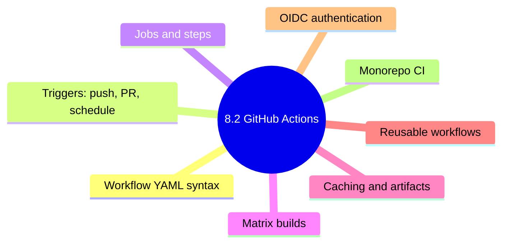

# 8.2.4 Subchapter 8.2 Review: Cheatsheet and Interview Prep

**Backlinks:** [8.2.1 — GitHub Actions Workflow Syntax](./8.2.1_GitHub_Actions_Workflow_Syntax.md) | [8.2.2 — Building, Testing, and Publishing Workflows](./8.2.2_Building_Test_and_Publish_Workflows.md) | [8.2.3 — Reusable Workflows, OIDC, and Monorepo CI](./8.2.3_Reusable_Workflows_OIDC_and_Monorepo_CI.md)

**Next note:** [8.3.1 — Deployment Strategies Explained](../Subchapter_8.3/8.3.1_Deployment_Strategies_Explained.md)



---

This review covers only the material presented in Notes 8.2.1 (GitHub Actions Workflow Syntax) and 8.2.2 (Building, Testing, and Publishing Workflows). No forward referencing beyond what was explicitly introduced.

---

## Cheatsheet: GitHub Actions

### Workflow Structure

```yaml
name: Workflow Name

on:
  push:
    branches: [ main ]
  pull_request:
    branches: [ main ]

jobs:
  job_name:
    runs-on: ubuntu-latest
    steps:
      - name: Step name
        uses: actions/checkout@v4
      - name: Run command
        run: echo "Hello"
```

### Trigger Events

| Event | Syntax |
|-------|--------|
| Push | `on: push` |
| Pull request | `on: pull_request` |
| Schedule (cron) | `on: schedule: - cron: '0 2 * * *'` |
| Manual | `on: workflow_dispatch` |
| Path filter | `on: push: paths: - 'src/**'` |

### Runner Types

| Runner | OS | Use Case |
|--------|-----|----------|
| `ubuntu-latest` | Ubuntu 22.04 | Linux builds, containers |
| `windows-latest` | Windows Server 2022 | .NET, Windows apps |
| `macos-latest` | macOS 12 | iOS, macOS apps |
| `self-hosted` | Custom | Large repos, special hardware |

### Matrix Build Syntax

```yaml
strategy:
  matrix:
    node-version: [16, 18, 20]
    os: [ubuntu-latest, windows-latest]
  fail-fast: true
```

### GitHub Context Variables

| Variable | Description |
|----------|-------------|
| `${{ github.repository }}` | Owner/repo name |
| `${{ github.ref_name }}` | Branch/tag name |
| `${{ github.sha }}` | Commit SHA |
| `${{ github.actor }}` | User who triggered |
| `${{ github.event_name }}` | Trigger event |
| `${{ secrets.MY_SECRET }}` | Encrypted secret |

### Conditional Execution

| Condition | Syntax |
|-----------|--------|
| Branch | `if: github.ref == 'refs/heads/main'` |
| Event | `if: github.event_name == 'pull_request'` |
| Success | `if: success()` |
| Failure | `if: failure()` |
| Always | `if: always()` |

### Build Commands by Language

| Language | Install | Build | Test |
|----------|---------|-------|------|
| Node.js | `npm ci` | `npm run build` | `npm test` |
| Python | `pip install -r requirements.txt` | `python -m build` | `pytest` |
| Go | `go mod download` | `go build` | `go test` |
| Java (Maven) | `mvn dependency:resolve` | `mvn package` | `mvn test` |

### Artifact Actions

| Action | Purpose |
|--------|---------|
| `actions/upload-artifact@v4` | Upload build outputs |
| `actions/download-artifact@v4` | Download artifacts |
| `actions/cache@v3` | Cache dependencies |

### Docker Actions

| Action | Purpose |
|--------|---------|
| `docker/login-action@v3` | Log in to registry |
| `docker/build-push-action@v5` | Build and push images |
| `docker/setup-buildx-action@v3` | Set up Buildx |
| `docker/metadata-action@v5` | Generate tags |

### Security Scanning Actions

| Action | Purpose |
|--------|---------|
| `aquasecurity/trivy-action` | Vulnerability scanning |
| `github/codeql-action/upload-sarif` | Upload SARIF results |
| `snyk/actions/node` | Snyk scanning |

---

## Comparison Tables

### Event Types Comparison

| Event | Use Case | Triggered By |
|-------|----------|--------------|
| `push` | CI on commits | Code push |
| `pull_request` | PR validation | PR open/update |
| `schedule` | Nightly tasks | Cron schedule |
| `workflow_dispatch` | Manual runs | User click |

### Runner OS Comparison

| OS | Best For | Limitations |
|----|----------|-------------|
| Ubuntu | Most builds, containers | Windows-specific tests |
| Windows | .NET, PowerShell | Slower startup |
| macOS | iOS, macOS apps | Limited minutes |

### Artifact Storage

| Setting | Default | Max |
|---------|---------|-----|
| Retention days | 90 | 90 |
| Artifact size | - | 10GB |
| Upload timeout | - | 60 minutes |

---

## Interview Questions (Scenario-Based)

These questions assume only knowledge from Subchapter 8.2. Answers reference only concepts from 8.2.1 and 8.2.2.

### Question 1

**Scenario:** A team wants to run tests on Node.js versions 16, 18, and 20, on both Ubuntu and Windows. They want to exclude Node.js 16 on Windows because of a known issue.

**Question:** How would you configure the matrix strategy in GitHub Actions?

**Answer:**

```yaml
jobs:
  test:
    runs-on: ${{ matrix.os }}
    strategy:
      matrix:
        node-version: [16, 18, 20]
        os: [ubuntu-latest, windows-latest]
        exclude:
          - os: windows-latest
            node-version: 16
    steps:
      - uses: actions/checkout@v4
      - uses: actions/setup-node@v4
        with:
          node-version: ${{ matrix.node-version }}
      - run: npm ci
      - run: npm test
```

**Resulting matrix:** 2 OS × 3 versions = 6 jobs, minus 1 excluded = 5 jobs.

| OS | Node 16 | Node 18 | Node 20 |
|----|---------|---------|---------|
| Ubuntu | ✓ | ✓ | ✓ |
| Windows | ✗ (excluded) | ✓ | ✓ |

### Question 2

**Scenario:** A workflow needs to run only when code in `src/` or `tests/` changes, but not when documentation files change.

**Question:** How would you configure the `on` trigger?

**Answer:**

```yaml
on:
  push:
    branches: [ main ]
    paths:
      - 'src/**'
      - 'tests/**'
    paths-ignore:
      - 'docs/**'
      - '**.md'
      - '**.txt'
  pull_request:
    branches: [ main ]
    paths:
      - 'src/**'
      - 'tests/**'
```

**Explanation:**
- `paths` – only trigger when these paths change
- `paths-ignore` – don't trigger when these paths change
- Both can be used together (union of conditions)

### Question 3

**Scenario:** A CI workflow takes 15 minutes. Most of the time is spent installing dependencies (10 minutes). The team wants to speed it up.

**Question:** How would you use caching to improve performance? Write the configuration.

**Answer:**

```yaml
jobs:
  build:
    runs-on: ubuntu-latest
    steps:
      - uses: actions/checkout@v4
      
      - name: Cache npm dependencies
        uses: actions/cache@v3
        with:
          path: ~/.npm
          key: ${{ runner.os }}-node-${{ hashFiles('package-lock.json') }}
          restore-keys: |
            ${{ runner.os }}-node-
            
      - name: Install dependencies
        run: npm ci
        
      - name: Run tests
        run: npm test
```

**Cache key strategy:**
- Exact match: `ubuntu-node-abc123` (from package-lock.json hash)
- Partial match: `ubuntu-node-` (fallback for cache misses)

**Expected improvement:** 10 minutes → 30 seconds (95% reduction)

### Question 4

**Scenario:** A workflow needs to build a Docker image, push it to GHCR, and then deploy to Kubernetes. The deploy step should only run if the push succeeds.

**Question:** How would you structure the jobs with dependencies?

**Answer:**

```yaml
jobs:
  build-and-push:
    runs-on: ubuntu-latest
    outputs:
      image-tag: ${{ steps.meta.outputs.tags }}
    steps:
      - uses: actions/checkout@v4
      - name: Build and push
        id: meta
        uses: docker/build-push-action@v5
        with:
          push: true
          tags: ghcr.io/${{ github.repository }}:latest
          
  deploy:
    needs: build-and-push  # Wait for build-and-push to complete
    runs-on: ubuntu-latest
    if: success()  # Only run if build-and-push succeeded
    steps:
      - name: Deploy to Kubernetes
        run: |
          kubectl set image deployment/myapp myapp=${{ needs.build-and-push.outputs.image-tag }}
          kubectl rollout status deployment/myapp
```

**Key concepts:**
- `needs:` – job dependency
- `if: success()` – run only on success (default behavior)
- `outputs:` – pass data between jobs

### Question 5

**Scenario:** A team wants to run security scans daily, even if no code has changed. They also want to be able to trigger the scan manually.

**Question:** How would you configure the workflow triggers?

**Answer:**

```yaml
name: Security Scan

on:
  schedule:
    # Daily at 2 AM UTC
    - cron: '0 2 * * *'
  workflow_dispatch:
    inputs:
      severity:
        description: 'Minimum severity'
        required: false
        default: 'HIGH'
        type: choice
        options:
          - LOW
          - MEDIUM
          - HIGH
          - CRITICAL

jobs:
  security-scan:
    runs-on: ubuntu-latest
    steps:
      - uses: actions/checkout@v4
      
      - name: Run Trivy scan
        uses: aquasecurity/trivy-action@master
        with:
          scan-type: 'fs'
          scan-ref: '.'
          severity: ${{ github.event.inputs.severity || 'HIGH' }}
          
      - name: Upload results
        uses: github/codeql-action/upload-sarif@v3
        with:
          sarif_file: 'trivy-results.sarif'
```

**Features:**
- Scheduled run (daily at 2 AM)
- Manual trigger with severity input
- Default severity HIGH if not specified

---

## Topics Covered in This Subchapter (Self-Check)

| Topic | Found in Note |
|-------|---------------|
| Workflow file location (.github/workflows/*.yml) | 8.2.1 |
| Workflow structure (name, on, jobs) | 8.2.1 |
| Trigger events (push, pull_request, schedule, workflow_dispatch) | 8.2.1 |
| Runner types (ubuntu, windows, macos, self-hosted) | 8.2.1 |
| Matrix builds | 8.2.1 |
| Steps and actions | 8.2.1 |
| Environment variables and secrets | 8.2.1 |
| GitHub context variables | 8.2.1 |
| Conditional execution (if, success, failure) | 8.2.1 |
| Artifact upload/download | 8.2.1 |
| Caching dependencies | 8.2.1 |
| Node.js workflow | 8.2.2 |
| Python workflow | 8.2.2 |
| Go workflow | 8.2.2 |
| Java (Maven) workflow | 8.2.2 |
| Docker build and push workflow | 8.2.2 |
| Security scanning with Trivy | 8.2.2 |
| Multi-stage workflow with dependencies | 8.2.2 |
| `timeout-minutes:` and `permissions:` at job level | 8.2.1 |
| `restore-keys:` fallback cache strategy | 8.2.1 |
| `$GITHUB_OUTPUT` file mechanism (not an env var) | 8.2.1 |
| Multi-platform Docker builds with QEMU and buildx | 8.2.2 |
| Docker layer cache types (`type=gha` vs `type=local`) | 8.2.2 |
| Metadata action tag types (`type=sha,format=short`) | 8.2.2 |

## Bridge Concepts (Not in Notes but Added for Clarity)

| Concept | Explanation |
|---------|-------------|
| `npm ci` | Faster, stricter npm install that uses `package-lock.json` exactly — always use in CI |
| `buildx` | Docker CLI plugin for multi-platform builds (`linux/amd64` + `linux/arm64`) |
| `GHCR` | GitHub Container Registry (`ghcr.io`) — free private/public container storage included with GitHub |
| `SARIF` | Static Analysis Results Interchange Format — a standard JSON schema for security scan results. Uploading a `.sarif` file to GitHub via `codeql-action/upload-sarif` populates the **Security → Code scanning** tab in the repository UI |
| `hashFiles()` | GitHub Actions function that returns an MD5 hash of one or more files. Used as cache keys: `hashFiles('package-lock.json')` changes when `package-lock.json` changes, invalidating the cache exactly when dependencies change |
| `restore-keys` | Fallback prefix list for cache lookup — used when the exact key misses (e.g., after updating a dependency). Finds the closest older cache rather than starting from nothing |
| `permissions:` | Scope the `GITHUB_TOKEN` to only the capabilities the job needs (`packages: write` for GHCR, `security-events: write` for SARIF upload, `id-token: write` for OIDC) |

---

---

**Next note:** [8.3.1 — Deployment Strategies Explained](../Subchapter_8.3/8.3.1_Deployment_Strategies_Explained.md)

Congratulations on completing Subchapter 8.2 core content! You can now create GitHub Actions workflows for any language, build and test code, publish artifacts and Docker images, and implement multi-stage pipelines. Note 8.2.4 extends this with reusable workflows, the `workflow_run` trigger for chaining CI → CD, keyless cloud authentication via OIDC, composite actions, and monorepo path-filtering patterns.
