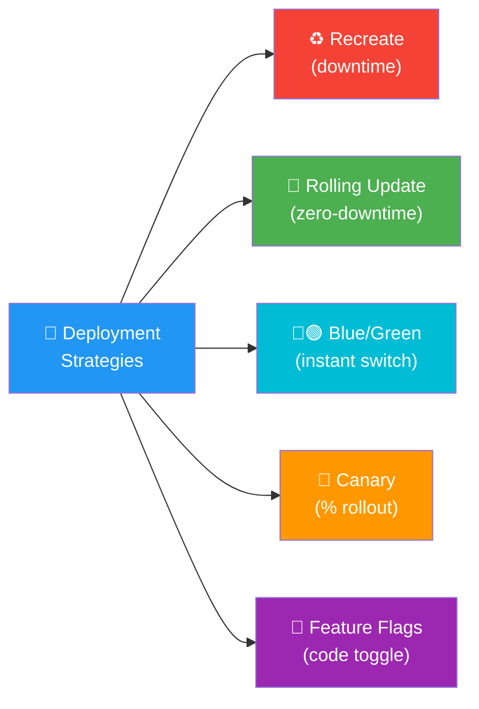
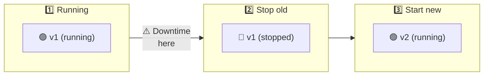
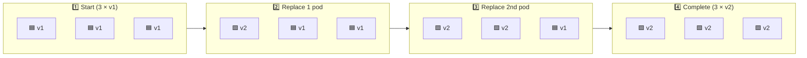
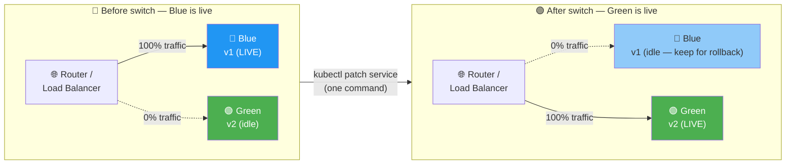
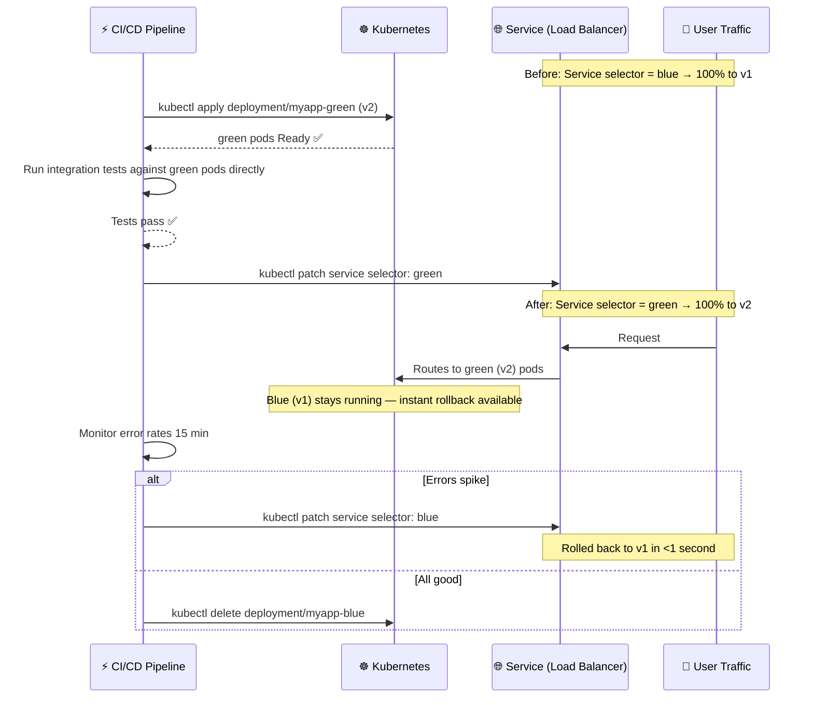
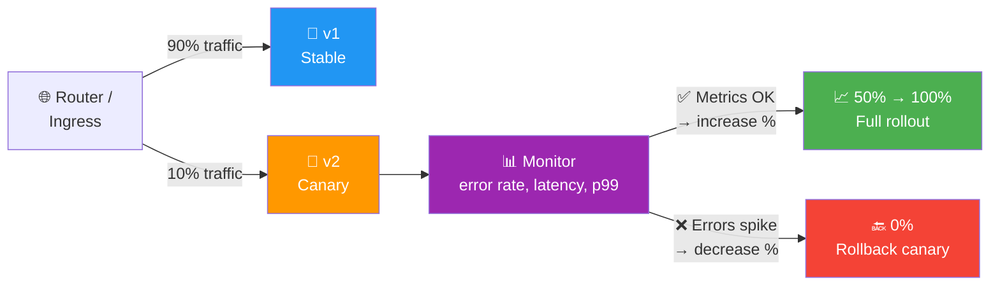
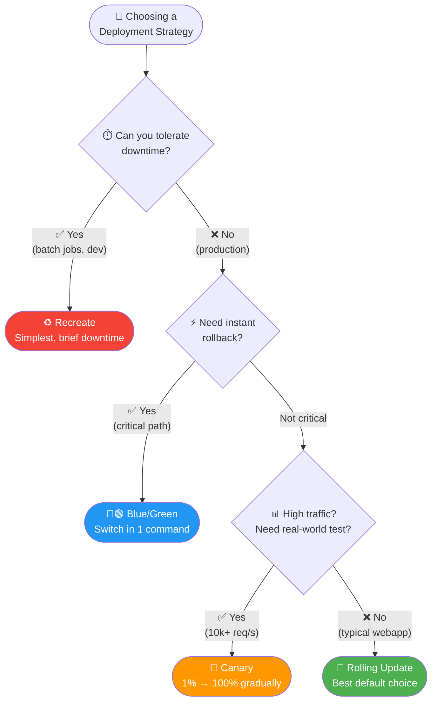
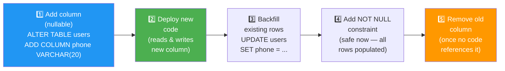

# 8.3.1 Deployment Strategies Explained: Getting Code to Users Safely

**Backlinks:** [Module 4 — Docker](../../4-Docker/) (container deployments) | [Module 5 — Kubernetes](../../5-Kubernetes/) (rolling updates; `kubectl rollout`; Istio traffic splitting) | [Module 7 — Nginx](../../7-Nginx/) (upstream weights for canary; traffic splitting) | [8.1.2 — Pipeline Stages](../Subchapter_8.1/8.1.2_Pipeline_Stages_Deep_Dive.md) (deploy stage context)

**Next note:** [8.3.2 — Security Scanning in CI/CD](./8.3.2_Security_Scanning_in_CI_CD.md)

---

## Why Deployment Strategies Matter

How you deploy is as important as what you deploy. The wrong strategy can cause:
- **Downtime** – Users can't access your app
- **Data loss** – Migrations gone wrong
- **Bad user experience** – Errors during deployment
- **Slow rollbacks** – Can't revert quickly

This note covers deployment strategies. Note 8.3.2 covers security scanning; note 8.3.3 is the subchapter review.

---

## Part 1: Deployment Strategies Overview



### Strategy Comparison

| Strategy | Downtime | Rollback Speed | Complexity | Risk | Best For |
|----------|----------|----------------|------------|------|----------|
| **Recreate** | Yes (seconds to minutes) | Slow | Low | High | Batch jobs, dev environments |
| **Rolling Update** | Zero | Fast | Low | Medium | Most web apps |
| **Blue/Green** | Zero | Instant | Medium | Low | Critical apps, zero-downtime required |
| **Canary** | Zero | Instant | High | Very Low | High-traffic apps, gradual rollout |
| **Feature Flags** | Zero | Instant | High | Very Low | Trunk-based development |

---

## Part 2: Recreate (Simple Replace)

The simplest strategy: stop old version, start new version.



### How It Works

```bash
# Docker example
docker stop myapp
docker rm myapp
docker run -d --name myapp myapp:v2

# Kubernetes example (Recreate strategy)
kubectl delete deployment myapp
kubectl apply -f deployment-v2.yaml
```

### Pros and Cons

| Pros | Cons |
|------|------|
| Simple to implement | Downtime (seconds to minutes) |
| No version conflicts | Users see errors during deployment |
| Works with any architecture | Rollback also has downtime |

### When to Use

- Batch jobs (offline processing)
- Development environments
- Non-critical internal tools
- When downtime is acceptable

---

## Part 3: Rolling Update (Gradual Replacement)

Replaces old pods/instances one by one, keeping the app available.



### Kubernetes Rolling Update

```yaml
apiVersion: apps/v1
kind: Deployment
metadata:
  name: myapp
spec:
  replicas: 3
  strategy:
    type: RollingUpdate
    rollingUpdate:
      maxSurge: 1        # Can create 1 extra pod
      maxUnavailable: 0  # No downtime (0 pods unavailable)
  template:
    spec:
      containers:
      - name: myapp
        image: myapp:v2
```

```bash
# Trigger rolling update
kubectl set image deployment/myapp myapp=myapp:v2
kubectl rollout status deployment/myapp
```

### Rolling Update Parameters

| Parameter | Meaning | Example |
|-----------|---------|---------|
| `maxSurge` | Extra pods allowed | `1` (1 extra), `25%` (of replicas) |
| `maxUnavailable` | Pods that can be down | `0` (no downtime), `1` (one at a time) |

### Pros and Cons

| Pros | Cons |
|------|------|
| Zero downtime | Slower deployment (takes time) |
| Easy rollback (`kubectl rollout undo`) | In-flight requests may fail |
| Works with most apps | Mixed versions during rollout |
| Built into Kubernetes | Database migrations tricky |

### When to Use

- Most production web applications
- When zero downtime is required
- When you can handle mixed versions

---

## Part 4: Blue/Green (Two Environments)

Maintain two identical environments: Blue (current) and Green (new). Switch traffic instantly.



### How It Works

```yaml
# Blue deployment (current version)
apiVersion: apps/v1
kind: Deployment
metadata:
  name: myapp-blue
spec:
  replicas: 3
  template:
    spec:
      containers:
      - name: myapp
        image: myapp:v1

---
# Green deployment (new version)
apiVersion: apps/v1
kind: Deployment
metadata:
  name: myapp-green
spec:
  replicas: 3
  template:
    spec:
      containers:
      - name: myapp
        image: myapp:v2

---
# Service (switches between blue and green)
apiVersion: v1
kind: Service
metadata:
  name: myapp
spec:
  selector:
    version: blue  # Change to "green" to switch
```

### Switching Traffic

```bash
# Switch from blue to green
kubectl patch service myapp -p '{"spec":{"selector":{"version":"green"}}}'

# Rollback (switch back to blue)
kubectl patch service myapp -p '{"spec":{"selector":{"version":"blue"}}}'
```



### Pros and Cons

| Pros | Cons |
|------|------|
| Instant switch | Requires 2x resources |
| Instant rollback | Database migration complexity |
| No mixed versions | More complex infrastructure |
| Easy testing before switch | Stateful apps difficult |

### When to Use

- Critical applications
- When instant rollback is required
- When you have spare capacity
- E-commerce, financial systems

---

## Part 5: Canary Deployment (Percentage Rollout)

Gradually shift traffic from old to new version, starting with a small percentage.



### Canary with Kubernetes and Istio

```yaml
# VirtualService for traffic splitting
apiVersion: networking.istio.io/v1beta1
kind: VirtualService
metadata:
  name: myapp
spec:
  hosts:
  - myapp
  http:
  - route:
    - destination:
        host: myapp-v1
        weight: 90
    - destination:
        host: myapp-v2
        weight: 10
```

### Canary with Nginx

```nginx
upstream backend {
    server myapp-v1:8080 weight=90;
    server myapp-v2:8080 weight=10;
}
```

### Canary Rollout Steps

| Step | Traffic to v2 | Duration | Check |
|------|---------------|----------|-------|
| 1 | 1% | 5 minutes | Error rate, latency |
| 2 | 5% | 10 minutes | Error rate, latency |
| 3 | 20% | 30 minutes | Error rate, latency |
| 4 | 50% | 1 hour | Error rate, latency |
| 5 | 100% | - | Complete |

### What Metrics to Watch During Canary

Before increasing traffic percentage, verify the canary is healthy:

| Metric | Healthy Threshold | Stop Canary If |
|--------|-------------------|----------------|
| **HTTP error rate** | < 1% (same as baseline) | Error rate > 2× baseline |
| **p99 latency** | Within 10% of baseline | Latency > 50% above baseline |
| **5xx responses** | 0 new 5xx errors | Any 5xx from canary pods |
| **Business metric** | Conversion rate ≥ baseline | Conversion drops > 5% |

### Canary vs A/B Testing — They Look the Same but Aren't

Both route a percentage of traffic to a different version. The **intent** and **stopping condition** differ:

| Aspect | Canary | A/B Testing |
|--------|--------|-------------|
| **Goal** | Verify new code is **stable** | Determine which version **performs better** |
| **Stop condition** | Error rate spikes → roll back | Statistical significance reached |
| **Duration** | Hours (until stable) | Days/weeks (needs data) |
| **Traffic split** | Gradual increase (1% → 100%) | Fixed split (50/50) |
| **Rollback** | Yes, if errors | No — pick winner and ship |
| **Who decides** | Monitoring (automated) | Data/product team (human) |

### Shadow Deployment (Bonus: Zero-Risk Testing)

**Shadow deployment** sends a copy of every production request to the new version, but **discards the response** — users only ever see the old version's response. The new version processes real traffic without any user impact.

```
User request → v1 (real response to user)
             ↘ v2 (shadow — processes but discards response)
```

Use it when you want to test a new version with real production traffic volume before switching any users. Requires a traffic mirroring tool (Istio `mirror:`, AWS ALB mirroring, or nginx `mirror` module from 7.2.4).

### Pros and Cons

| Pros | Cons |
|------|------|
| Lowest risk | Complex infrastructure |
| Real-world validation | Requires traffic splitting |
| Quick rollback | Monitoring required |
| Canary catches issues early | Longer rollout time |

### When to Use

- High-traffic applications
- Machine learning models (A/B testing)
- When you can't afford any downtime
- Teams with good observability

---

## Part 6: Feature Flags (Toggle-Based)

Deploy code but keep features disabled until ready.

```javascript
// Code is deployed but hidden
if (featureFlags.isEnabled('new-checkout')) {
  // New checkout flow
} else {
  // Old checkout flow
}
```

### Feature Flag Tools

| Tool | Type | Best For |
|------|------|----------|
| **LaunchDarkly** | SaaS | Enterprise feature management |
| **Flagsmith** | Open-source/SaaS | Self-hosted options |
| **Unleash** | Open-source | Customizable |
| **ConfigMap (K8s)** | Simple | Basic toggles |

### Feature Flag in Kubernetes

```yaml
# ConfigMap as feature flags
apiVersion: v1
kind: ConfigMap
metadata:
  name: feature-flags
data:
  new-checkout: "false"
  dark-mode: "true"
```

### Pros and Cons

| Pros | Cons |
|------|------|
| Deploy anytime | Code complexity |
| Instant toggles | Flag cleanup needed |
| A/B testing ready | Testing overhead |
| No infrastructure changes | Technical debt risk |

### When to Use

- Trunk-based development
- Mobile apps (can't deploy instantly)
- Testing in production
- Gradual feature rollout

---

## Part 7: Choosing the Right Strategy

### Decision Tree



### Strategy Selection Guide

| Scenario | Recommended Strategy | Why |
|----------|---------------------|-----|
| Batch job, nightly run | Recreate | Downtime acceptable |
| Simple web app | Rolling Update | Good balance |
| E-commerce checkout | Blue/Green | Instant rollback |
| High-traffic API | Canary | Gradual, low risk |
| Mobile app | Feature Flags | Can't deploy instantly |
| Database migration | Blue/Green + Feature Flags | Need both |

---

## Part 8: Database Migrations with Deployments

Database migrations are the hardest part of deployment.

### Migration Strategies

| Strategy | How | Risk | Downtime |
|----------|-----|------|----------|
| **Backward-compatible changes only** | Add columns, don't remove | Low | None |
| **Blue/Green with dual-write** | Write to both databases | Medium | None |
| **Maintenance window** | Take app offline | High | Yes |
| **Feature flags** | Deploy code, migrate later | Medium | None |

### Backward-Compatible Migration Example

```sql
-- Safe: Add column (no downtime)
ALTER TABLE users ADD COLUMN phone VARCHAR(20);

-- Not safe: Remove column (needs coordination)
ALTER TABLE users DROP COLUMN old_column;
```

### Migration Pattern



---

## Quick Task: Choose a Deployment Strategy

*For each scenario, choose the best deployment strategy.*

1. **Scenario A:** Internal reporting tool, used by 10 people. Can have brief downtime.
2. **Scenario B:** E-commerce website, Black Friday traffic. Cannot have any downtime.
3. **Scenario C:** High-traffic API with 10,000 requests/second. Need to test with 1% of traffic.
4. **Scenario D:** Mobile app that users update weekly.

> **Ready Solution:**
>
> 1. **Recreate** – Simple, downtime acceptable for internal tool
> 2. **Blue/Green** – Zero downtime, instant rollback for critical app
> 3. **Canary** – Gradual rollout, monitor with 1% traffic first
> 4. **Feature Flags** – Can't deploy instantly, use toggles

---

## Summary Table: Deployment Strategies

| Strategy | Downtime | Rollback Speed | Complexity | Resources |
|----------|----------|----------------|------------|-----------|
| Recreate | Yes (seconds) | Slow | Low | 1x |
| Rolling Update | Zero | Fast | Low | 1x (+surge) |
| Blue/Green | Zero | Instant | Medium | 2x |
| Canary | Zero | Instant | High | 1x (+monitoring) |
| Feature Flags | Zero | Instant | High | 1x |

### Kubernetes Deployment Commands

| Strategy | Command |
|----------|---------|
| Rolling Update | `kubectl set image deployment/myapp myapp=v2` |
| Rolling Update (rollback) | `kubectl rollout undo deployment/myapp` |
| Blue/Green (switch) | `kubectl patch service myapp -p '{"spec":{"selector":{"version":"green"}}}'` |
| Canary | Use Istio or Nginx traffic splitting |

### Database Migration Best Practices

| Rule | Why |
|------|-----|
| Add columns, don't remove | Safe, backward-compatible |
| Deploy code first, then migrate | Code can work with old schema |
| Use feature flags for schema changes | Rollback without migration |
| Test rollback before deploying | Ensure you can revert |

---

**Next note:** [8.3.2 — Security Scanning in CI/CD](./8.3.2_Security_Scanning_in_CI_CD.md) — SAST, DAST, SCA, container scanning, and secret detection.
