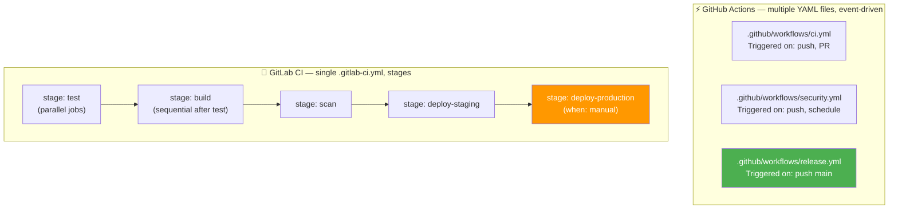
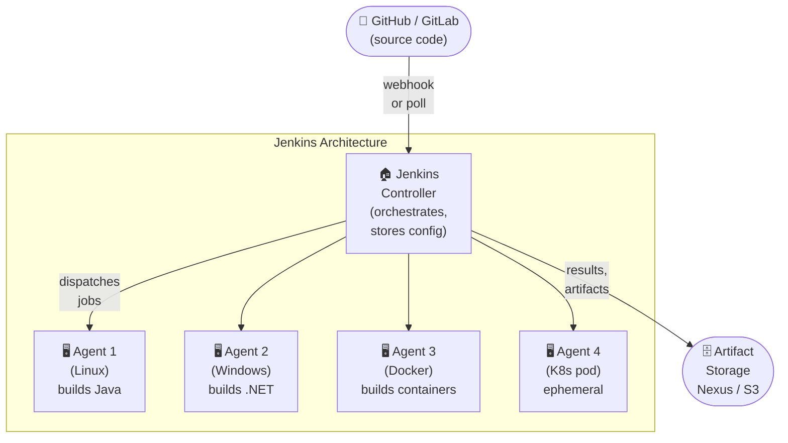
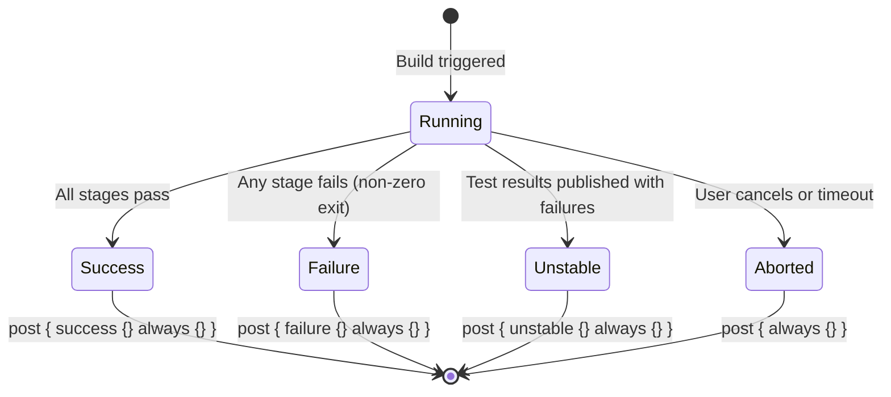
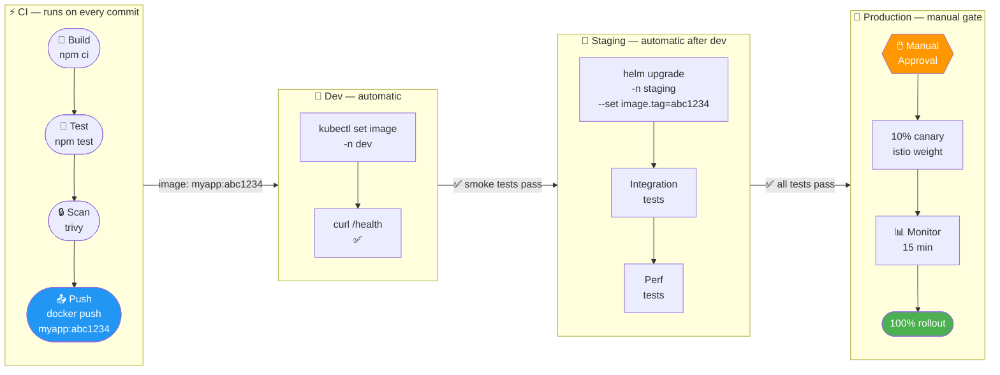
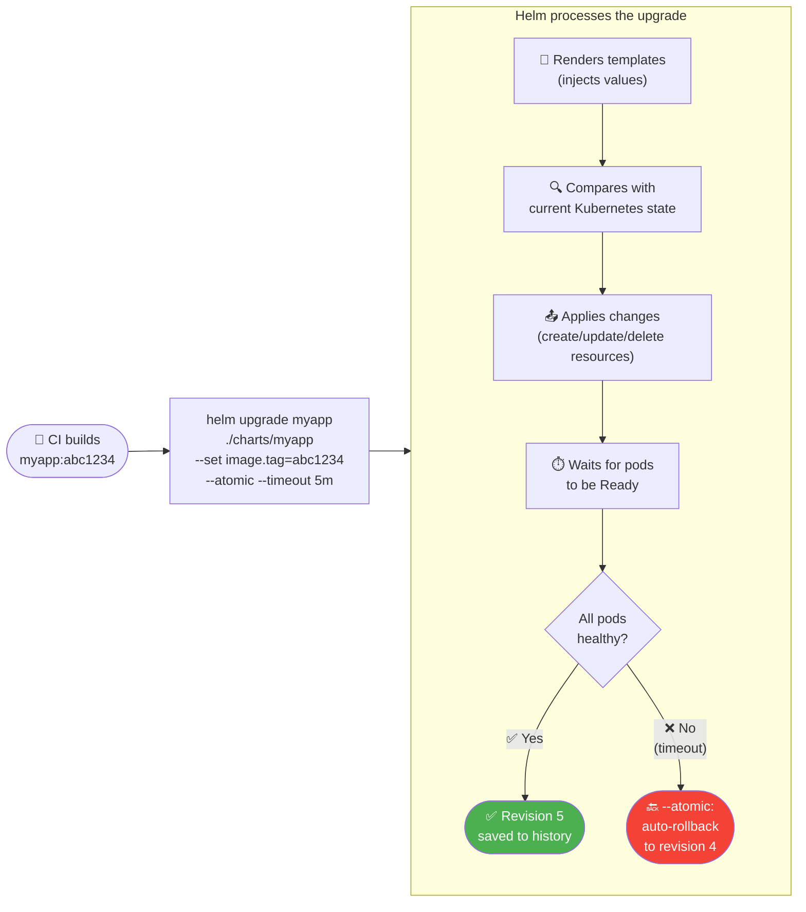

# 8.3.3 GitLab CI, Jenkins, Multi-Environment Promotion, and Helm Deployments

**Backlinks:** [Module 5 — Kubernetes](../../5-Kubernetes/) (Helm charts; `kubectl`; namespaces per environment) | [Module 7 — Nginx](../../7-Nginx/) (deployed application) | [8.3.1 — Deployment Strategies](./8.3.1_Deployment_Strategies_Explained.md) | [8.3.5 — Subchapter 8.3 Review](./8.3.5_Subchapter_Review_Plus_Final_Exam.md)

**Next note:** [8.3.4 — Complete CI/CD Cheatsheet and Module 8 Final Exam](./8.3.4_Complete_CICD_Cheatsheet_and_Final_Exam.md)

> **Looking ahead — Module 10 (GitOps / ArgoCD):** The promotion pipeline you just built is a **push-based** CD model — your pipeline runs `helm upgrade` against the cluster. Module 10 introduces the **pull-based** GitOps model where ArgoCD watches a Git repository and automatically synchronises the cluster to match. Push-based CD (this module) and GitOps (Module 10) are complementary: CI builds and pushes the image (push), ArgoCD detects the new image tag in Git and syncs the cluster (pull).

---

## Why Other CI/CD Platforms Matter

GitHub Actions dominates new projects, but the real world has many CI/CD platforms in use. Enterprise environments often run Jenkins (15+ years of history); teams using GitLab for SCM use GitLab CI natively; some organizations host their own infrastructure. Understanding the core concepts transfers across all platforms.

---

## Part 1: GitLab CI/CD

GitLab CI is configured via a **`.gitlab-ci.yml`** file in the repository root. It is deeply integrated with GitLab's SCM, registry, and Kubernetes integration.

### Core Concepts Compared to GitHub Actions

| Concept | GitHub Actions | GitLab CI |
|---------|---------------|-----------|
| Config file | `.github/workflows/*.yml` | `.gitlab-ci.yml` (one file) |
| Trigger | `on:` | Implicit (all pushes) or `rules:` |
| Job | `jobs.<name>:` | Top-level key in `stages:` |
| Steps | `steps:` | `script:` |
| Runner | `runs-on:` | `tags:` (match GitLab runner tags) |
| Secrets | GitHub Secrets | GitLab CI Variables |
| Artifact storage | `actions/upload-artifact` | `artifacts:` keyword |
| Docker registry | GHCR | GitLab Container Registry (built-in) |
| Cache | `actions/cache` | `cache:` keyword |

### `.gitlab-ci.yml` Structure

```yaml
# .gitlab-ci.yml — GitLab CI pipeline

# 1. Define stages — jobs in same stage run in parallel
#    stages run sequentially
stages:
  - test
  - build
  - scan
  - deploy-staging
  - deploy-production

# 2. Global variables (available in all jobs)
variables:
  DOCKER_IMAGE: $CI_REGISTRY_IMAGE:$CI_COMMIT_SHORT_SHA
  NODE_VERSION: "20"

# 3. Define jobs
test:
  stage: test
  image: node:20-alpine          # Docker image to run job in
  cache:
    key: "$CI_COMMIT_REF_SLUG"   # cache per branch
    paths:
      - node_modules/
  script:
    - npm ci
    - npm run lint
    - npm test
  coverage: '/Lines\s*:\s*(\d+\.?\d*)%/'   # regex to extract coverage
  artifacts:
    reports:
      junit: test-results.xml    # JUnit report for GitLab UI
    paths:
      - coverage/
    expire_in: 7 days

build-docker:
  stage: build
  image: docker:24
  services:
    - docker:24-dind               # Docker-in-Docker
  before_script:
    - docker login -u $CI_REGISTRY_USER -p $CI_REGISTRY_PASSWORD $CI_REGISTRY
  script:
    - docker build -t $DOCKER_IMAGE .
    - docker push $DOCKER_IMAGE
  only:
    - main                         # Only run on main branch
  # ⚠️  NOTE: `only:` is DEPRECATED in GitLab CI. Use `rules:` instead (shown below).
  # `only:` still works but is frozen — new features only go into `rules:`.
  # Equivalent with rules:
  # rules:
  #   - if: '$CI_COMMIT_BRANCH == "main"'

security-scan:
  stage: scan
  image:
    name: aquasec/trivy:latest
    entrypoint: [""]
  script:
    - trivy image --severity CRITICAL,HIGH --exit-code 1 $DOCKER_IMAGE
  needs: [build-docker]            # Run after build (not after all stage jobs)

deploy-staging:
  stage: deploy-staging
  image: bitnami/kubectl:latest
  environment:
    name: staging
    url: https://staging.example.com
  script:
    - kubectl set image deployment/myapp myapp=$DOCKER_IMAGE
    - kubectl rollout status deployment/myapp
  only:
    - main

deploy-production:
  stage: deploy-production
  image: bitnami/kubectl:latest
  environment:
    name: production
    url: https://example.com
  when: manual                     # Requires manual click to deploy
  script:
    - kubectl set image deployment/myapp myapp=$DOCKER_IMAGE --namespace=production
    - kubectl rollout status deployment/myapp --namespace=production
  only:
    - main
```

### GitLab CI Built-In Variables

| Variable | Value | Equivalent |
|----------|-------|------------|
| `$CI_COMMIT_SHA` | Full commit SHA | `github.sha` |
| `$CI_COMMIT_SHORT_SHA` | Short SHA (8 chars) | `github.sha` (short) |
| `$CI_COMMIT_REF_NAME` | Branch or tag name | `github.ref_name` |
| `$CI_PROJECT_PATH` | `org/repo` | `github.repository` |
| `$CI_REGISTRY` | `registry.gitlab.com` | `ghcr.io` |
| `$CI_REGISTRY_IMAGE` | Full image path | `ghcr.io/${{ github.repository }}` |
| `$CI_PIPELINE_ID` | Pipeline number | `github.run_id` |

### GitLab CI `rules:` — Advanced Trigger Control

`rules:` replaces the older `only:`/`except:` and supports complex conditions:

```yaml
deploy-production:
  stage: deploy-production
  rules:
    # Run on main branch
    - if: '$CI_COMMIT_BRANCH == "main"'
      when: manual           # require manual click
    # Run on tags matching v*
    - if: '$CI_COMMIT_TAG =~ /^v\d+\.\d+\.\d+$/'
      when: on_success       # automatic on version tags
    # Skip everything else
    - when: never
  script:
    - ./deploy.sh
```

### GitLab vs GitHub Actions: Pipeline Visual



---

## Part 2: Jenkins Fundamentals

Jenkins is the most-deployed CI/CD server in enterprise environments. It predates GitHub Actions by a decade and has the largest plugin ecosystem (~1800 plugins).

### Jenkins Architecture



| Component | Role |
|-----------|------|
| **Controller** | Orchestrates builds, stores config, serves UI. Never runs builds directly. |
| **Agent (node)** | Machine that runs jobs. Can be permanent VMs or ephemeral Docker/K8s pods. |
| **Executor** | Slot on an agent for running one job concurrently. Agents can have multiple executors. |
| **Workspace** | Directory on agent where job files are checked out and build runs. |

### Jenkinsfile — Pipeline as Code

Jenkins pipelines are defined in a `Jenkinsfile` using Groovy DSL (Declarative or Scripted). Declarative is preferred — it is structured and has better tooling.

```groovy
// Jenkinsfile — Declarative Pipeline
pipeline {
    agent {
        docker {
            image 'node:20-alpine'   // run all stages in this container
            args '-v /root/.npm:/root/.npm'  // mount npm cache
        }
    }

    environment {
        REGISTRY       = 'registry.example.com'
        IMAGE_NAME     = "${REGISTRY}/myapp"
        IMAGE_TAG      = "${env.GIT_COMMIT.take(8)}"   // short SHA
        SLACK_CHANNEL  = '#ci-notifications'
    }

    options {
        timeout(time: 30, unit: 'MINUTES')   // fail if pipeline takes >30 min
        buildDiscarder(logRotator(numToKeepStr: '10'))  // keep last 10 builds
        disableConcurrentBuilds()            // one build at a time per branch
    }

    triggers {
        pollSCM('H/5 * * * *')   // poll Git every 5 minutes (or use webhooks)
    }

    stages {
        stage('Install') {
            steps {
                sh 'npm ci'
            }
        }

        stage('Lint & Test') {
            parallel {
                stage('Lint') {
                    steps { sh 'npm run lint' }
                }
                stage('Test') {
                    steps {
                        sh 'npm test -- --reporter=junit --reporter-options output=test-results.xml'
                    }
                    post {
                        always {
                            junit 'test-results.xml'   // publish test results in UI
                        }
                    }
                }
            }
        }

        stage('Build Docker Image') {
            when {
                branch 'main'    // only on main branch
            }
            steps {
                script {
                    docker.build("${IMAGE_NAME}:${IMAGE_TAG}")
                }
            }
        }

        stage('Security Scan') {
            when { branch 'main' }
            steps {
                sh """
                    trivy image \
                        --severity CRITICAL,HIGH \
                        --exit-code 1 \
                        ${IMAGE_NAME}:${IMAGE_TAG}
                """
            }
        }

        stage('Push to Registry') {
            when { branch 'main' }
            steps {
                withCredentials([usernamePassword(
                    credentialsId: 'registry-creds',
                    usernameVariable: 'REG_USER',
                    passwordVariable: 'REG_PASS'
                )]) {
                    sh """
                        docker login ${REGISTRY} -u ${REG_USER} -p ${REG_PASS}
                        docker push ${IMAGE_NAME}:${IMAGE_TAG}
                    """
                }
            }
        }

        stage('Deploy to Staging') {
            when { branch 'main' }
            steps {
                sh "kubectl set image deployment/myapp myapp=${IMAGE_NAME}:${IMAGE_TAG} -n staging"
                sh "kubectl rollout status deployment/myapp -n staging"
            }
        }

        stage('Deploy to Production') {
            when { branch 'main' }
            input {
                message 'Deploy to production?'
                ok 'Yes, deploy!'
            }
            steps {
                sh "kubectl set image deployment/myapp myapp=${IMAGE_NAME}:${IMAGE_TAG} -n production"
            }
        }
    }

    post {
        success {
            slackSend channel: env.SLACK_CHANNEL,
                      color: 'good',
                      message: "✅ Build successful: ${env.JOB_NAME} #${env.BUILD_NUMBER}"
        }
        failure {
            slackSend channel: env.SLACK_CHANNEL,
                      color: 'danger',
                      message: "❌ Build failed: ${env.JOB_NAME} #${env.BUILD_NUMBER}\n${env.BUILD_URL}"
        }
        always {
            cleanWs()    // clean workspace after build
            // NOTE: cleanWs() requires the "Workspace Cleanup Plugin" in Jenkins.
            // Without it you get: No such DSL method 'cleanWs' found
            // Install via: Manage Jenkins → Plugins → Available → "Workspace Cleanup"
        }
    }
}
```

### Jenkins Build States and `post {}` Blocks



> **`unstable` vs `failure`:** A stage that runs `junit 'test-results.xml'` and finds failing tests marks the build `UNSTABLE` (yellow) not `FAILURE` (red). This lets the pipeline continue (run reports, notifications) while signalling that tests need fixing — it's a softer failure state. Use `post { unstable { ... } }` to send different notifications for test regressions vs build errors.

### Jenkins Key Concepts

| Concept | Explanation |
|---------|-------------|
| `stage()` | Logical grouping of steps — shown as column in Stage View |
| `parallel {}` | Run multiple stages simultaneously (like GitHub Actions matrix) |
| `when {}` | Conditional execution — `branch`, `tag`, `environment`, `expression` |
| `input {}` | Pause pipeline and wait for human click (like GitHub environment approval) |
| `post {}` | Runs after pipeline completes — `success`, `failure`, `always`, `unstable` |
| `withCredentials` | Injects secrets from Jenkins Credential Store into environment variables |
| `options {}` | Pipeline-wide settings: timeout, log rotation, concurrent build control |
| `environment {}` | Global env vars for the pipeline |

### Jenkins Shared Libraries — Reusable Pipeline Code

Jenkins Shared Libraries are the Jenkins equivalent of GitHub's reusable workflows. They let you define common pipeline logic **once** in a central repository and import it into hundreds of Jenkinsfiles with a single `@Library` annotation.

**Library repository structure:**

```
jenkins-shared-library/           # central Git repo
├── vars/                         # global functions — callable from any Jenkinsfile
│   ├── standardPipeline.groovy   # full pipeline template
│   ├── dockerBuild.groovy        # docker build + push step
│   └── notifySlack.groovy        # Slack notification step
├── src/                          # (optional) helper classes
│   └── org/company/Utils.groovy
└── resources/                    # (optional) non-Groovy files
    └── templates/
        └── Dockerfile.template
```

```groovy
// vars/standardPipeline.groovy — reusable pipeline template
def call(Map config) {
    // config: [service: 'myapp', language: 'node', nodeVersion: '20']
    pipeline {
        agent { docker { image "${config.language}:${config.nodeVersion}-alpine" } }

        stages {
            stage('Install') {
                steps { sh 'npm ci' }
            }
            stage('Test') {
                steps { sh 'npm test' }
            }
            stage('Build Docker') {
                when { branch 'main' }
                steps {
                    script {
                        def tag = env.GIT_COMMIT.take(8)
                        docker.build("registry.example.com/${config.service}:${tag}")
                        docker.image("registry.example.com/${config.service}:${tag}").push()
                    }
                }
            }
            stage('Deploy') {
                when { branch 'main' }
                steps {
                    sh "helm upgrade ${config.service} ./charts/${config.service} " +
                       "--set image.tag=${env.GIT_COMMIT.take(8)} --atomic"
                }
            }
        }

        post {
            failure { notifySlack(channel: '#ci', status: 'FAILED') }
            success { notifySlack(channel: '#ci', status: 'SUCCESS') }
        }
    }
}
```

```groovy
// vars/notifySlack.groovy — reusable notification step
def call(Map params) {
    slackSend channel: params.channel,
              color: params.status == 'SUCCESS' ? 'good' : 'danger',
              message: "${params.status}: ${env.JOB_NAME} #${env.BUILD_NUMBER}\n${env.BUILD_URL}"
}
```

**Using the shared library in a Jenkinsfile:**

```groovy
// Jenkinsfile (in service-a repo) — 4 lines!
@Library('my-shared-library') _

standardPipeline(
    service: 'service-a',
    language: 'node',
    nodeVersion: '20'
)
```

**Configuring the library in Jenkins:**

1. Go to **Manage Jenkins → System → Global Pipeline Libraries**
2. Add a library:
   - **Name:** `my-shared-library`
   - **Default version:** `main`
   - **Source:** Git → `https://github.com/org/jenkins-shared-library.git`

| Concept | GitHub Actions | Jenkins |
|---------|---------------|---------|
| **Reusable pipeline** | `uses: org/workflows/.github/workflows/ci.yml@main` | `@Library('shared-lib')` + `standardPipeline(...)` |
| **Reusable step** | Composite action (`.github/actions/setup/action.yml`) | `vars/dockerBuild.groovy` — callable as `dockerBuild(...)` |
| **Where it lives** | Separate GitHub repo | Separate Git repo configured in Jenkins global settings |
| **Versioning** | `@main`, `@v1.2`, `@sha` | Branch/tag configured in library settings |

> **Why shared libraries matter for Jenkins:** Without them, 50 Jenkinsfiles across 50 repos each define their own pipeline stages. When you need to add a security scan step, you edit 50 files. With a shared library, you edit **one** `standardPipeline.groovy` and all 50 repos pick up the change on next build.

### GitHub Actions vs GitLab CI vs Jenkins

| Aspect | GitHub Actions | GitLab CI | Jenkins |
|--------|---------------|-----------|---------|
| **Config format** | YAML | YAML | Groovy (Jenkinsfile) |
| **Hosting** | Cloud (GitHub.com) | Cloud or self-hosted | Self-hosted only |
| **Plugin ecosystem** | Marketplace (~20k actions) | Built-in features | ~1800 plugins |
| **Cost (small team)** | Free (2000 min/month) | Free (400 min/month) | Free + server cost |
| **Learning curve** | Low | Low–Medium | High (Groovy, plugins) |
| **Kubernetes-native** | Good (via actions) | Good (native integration) | Good (Kubernetes plugin) |
| **Parallel jobs** | `matrix:` strategy | `parallel:` in stages | `parallel {}` block |
| **Reusable pipelines** | Reusable workflows (`workflow_call`) | `include:` templates | Shared Libraries (`@Library`) |
| **Best for** | New projects on GitHub | GitLab users | Enterprise, complex pipelines |

---

## Part 3: Multi-Environment Promotion Pipeline

A **promotion pipeline** moves an artifact through environments gate by gate. The same Docker image (tagged by commit SHA) flows from dev → staging → production — never rebuilt.



### Promotion Pipeline in GitHub Actions

```yaml
# .github/workflows/promotion.yml
name: Promotion Pipeline

on:
  push:
    branches: [ main ]

env:
  IMAGE: ghcr.io/${{ github.repository }}:${{ github.sha }}

jobs:
  # ─── Stage 1: CI ────────────────────────────────────────────────────────────
  ci:
    runs-on: ubuntu-latest
    steps:
      - uses: actions/checkout@v4
      - uses: actions/setup-node@v4
        with: { node-version: '20' }
      - run: npm ci && npm test

  build-and-push:
    needs: ci
    runs-on: ubuntu-latest
    permissions: { contents: read, packages: write }
    steps:
      - uses: actions/checkout@v4
      - uses: docker/login-action@v3
        with:
          registry: ghcr.io
          username: ${{ github.actor }}
          password: ${{ secrets.GITHUB_TOKEN }}
      - run: |
          docker build -t ${{ env.IMAGE }} .
          trivy image --severity CRITICAL --exit-code 1 ${{ env.IMAGE }}
          docker push ${{ env.IMAGE }}

  # ─── Stage 2: Dev (automatic) ───────────────────────────────────────────────
  deploy-dev:
    needs: build-and-push
    runs-on: ubuntu-latest
    environment:
      name: development
      url: https://dev.example.com
    steps:
      - name: Deploy to dev namespace
        run: |
          kubectl set image deployment/myapp myapp=${{ env.IMAGE }} -n dev
          kubectl rollout status deployment/myapp -n dev
      - name: Smoke test
        run: |
          sleep 10
          curl --fail https://dev.example.com/health

  # ─── Stage 3: Staging (automatic after dev) ─────────────────────────────────
  deploy-staging:
    needs: deploy-dev
    runs-on: ubuntu-latest
    environment:
      name: staging
      url: https://staging.example.com
    steps:
      - uses: actions/checkout@v4
      - name: Deploy to staging with Helm
        run: |
          helm upgrade myapp ./charts/myapp \
            --namespace staging \
            --create-namespace \
            --set image.repository=ghcr.io/${{ github.repository }} \
            --set image.tag=${{ github.sha }} \
            --atomic \        # rollback automatically if deploy fails
            --timeout 5m
      - name: Run integration tests
        run: npm run test:integration
        env:
          API_URL: https://staging.example.com

  # ─── Stage 4: Production (manual gate) ──────────────────────────────────────
  deploy-production:
    needs: deploy-staging
    runs-on: ubuntu-latest
    environment:
      name: production           # GitHub environment with required reviewers configured
      url: https://example.com
    steps:
      - uses: actions/checkout@v4
      - name: Deploy to production with Helm
        run: |
          helm upgrade myapp ./charts/myapp \
            --namespace production \
            --set image.repository=ghcr.io/${{ github.repository }} \
            --set image.tag=${{ github.sha }} \
            --atomic \
            --timeout 10m
```

---

## Part 4: Helm Deployments in CI/CD

`kubectl set image` is simple but limited — it only changes one image tag. **Helm** allows you to manage all Kubernetes resources as a versioned, parameterized package.

### Why Helm Over Raw `kubectl`

| Aspect | `kubectl apply` | Helm |
|--------|----------------|------|
| **Configuration** | Hardcoded YAML | Values file + templating |
| **Rollback** | `kubectl rollout undo` (1 deploy only) | `helm rollback` (any previous release) |
| **Environment differences** | Separate YAML files | Single chart + per-env values |
| **History** | No record | Full release history |
| **Atomic deploys** | Manual | `--atomic` flag rolls back on failure |
| **Dependencies** | Manual | `helm dependency update` |

### Helm Chart Structure for CI/CD

```
charts/myapp/
├── Chart.yaml           # chart metadata
├── values.yaml          # default values (dev)
├── values-staging.yaml  # staging overrides
├── values-prod.yaml     # production overrides
└── templates/
    ├── deployment.yaml
    ├── service.yaml
    ├── ingress.yaml
    └── _helpers.tpl
```

```yaml
# charts/myapp/values.yaml — default (dev)
replicaCount: 1

image:
  repository: ghcr.io/org/myapp
  tag: latest              # overridden by --set image.tag=$SHA in CI
  pullPolicy: Always

resources:
  requests:
    cpu: "100m"
    memory: "128Mi"
  limits:
    cpu: "500m"
    memory: "512Mi"

ingress:
  host: dev.example.com
```

```yaml
# charts/myapp/values-prod.yaml — production overrides only
replicaCount: 5            # more replicas

resources:
  requests:
    cpu: "500m"
    memory: "512Mi"
  limits:
    cpu: "2"
    memory: "2Gi"

ingress:
  host: example.com
```

```yaml
# charts/myapp/templates/deployment.yaml
apiVersion: apps/v1
kind: Deployment
metadata:
  name: {{ .Release.Name }}
spec:
  replicas: {{ .Values.replicaCount }}
  template:
    spec:
      containers:
        - name: myapp
          image: "{{ .Values.image.repository }}:{{ .Values.image.tag }}"
          resources:
            {{- toYaml .Values.resources | nindent 12 }}
```

### Helm CI/CD Commands

```bash
# Validate chart BEFORE deploying (run this in CI before helm upgrade)
helm lint ./charts/myapp -f values-prod.yaml   # checks YAML syntax and required fields
helm template myapp ./charts/myapp \            # renders templates locally, no cluster needed
  -f values-prod.yaml \
  --set image.tag=$SHA | kubectl apply --dry-run=client -f -  # validate against K8s API schema

# Install (first time)
helm install myapp ./charts/myapp \
  --namespace production \
  --create-namespace \
  -f charts/myapp/values-prod.yaml \
  --set image.tag=$SHA

# Upgrade (subsequent deploys)
helm upgrade myapp ./charts/myapp \
  --namespace production \
  -f charts/myapp/values-prod.yaml \
  --set image.tag=$SHA \
  --atomic \             # rollback if upgrade fails within --timeout
  --timeout 5m \
  --wait                 # wait for pods to be Ready

# View release history
helm history myapp -n production

# Rollback to previous release
helm rollback myapp 3 -n production   # rollback to revision 3

# Dry run (show what would change)
helm upgrade myapp ./charts/myapp \
  --dry-run \
  --set image.tag=$SHA
```

> **What `--atomic` actually does when a deploy fails:** Helm applies all the rendered Kubernetes resources. If any pod fails to reach `Ready` state within `--timeout`, Helm automatically runs `helm rollback` to the previous revision. Without `--atomic`, a failed deploy leaves the release in a `FAILED` state — Kubernetes is partially updated and you must manually roll back. **Always use `--atomic --timeout Nm` in production pipelines.** Common timeout values: staging = 3–5 minutes, production = 10 minutes.

> **`helm lint` vs `helm template`:** `helm lint` checks the chart's own structure (missing required values, malformed templates). `helm template` fully renders the chart to Kubernetes YAML — piping it to `kubectl apply --dry-run=client` validates the rendered output against the Kubernetes API schema without actually deploying. Run both in CI to catch errors before they reach the cluster.

### Helm Deployment Flow



---

## Summary Tables

### CI/CD Platform Quick Reference

| Feature | GitHub Actions | GitLab CI | Jenkins |
|---------|---------------|-----------|---------|
| Config file | `.github/workflows/*.yml` | `.gitlab-ci.yml` | `Jenkinsfile` |
| Parallel jobs | `matrix:` | `parallel:` | `parallel {}` |
| Manual gate | `environment` + required reviewers | `when: manual` | `input {}` |
| Secrets | Repository/Org secrets | CI Variables | Credentials Store |
| Docker build | `docker/build-push-action` | `docker:dind` service | `docker.build()` |
| Artifact storage | `upload/download-artifact` | `artifacts:` | `archiveArtifacts` |

### Helm vs `kubectl` Decision

| Situation | Use |
|-----------|-----|
| One-off deployment, simple app | `kubectl apply` |
| Multiple environments with different configs | Helm + values files |
| Need rollback history | Helm |
| Complex app with many K8s resources | Helm |
| Learning/experimentation | `kubectl` |
| Production CI/CD | Helm |

### Multi-Environment Promotion Pattern

| Environment | Trigger | Approval | Tests Run |
|-------------|---------|----------|-----------|
| Dev | Automatic (every merge to main) | None | Smoke tests |
| Staging | Automatic (after dev passes) | None | Integration + performance |
| Production | Manual gate | Required reviewers | Smoke tests post-deploy |

---

**Next note:** [8.3.4 — Complete CI/CD Cheatsheet and Module 8 Final Exam](./8.3.4_Complete_CICD_Cheatsheet_and_Final_Exam.md)
