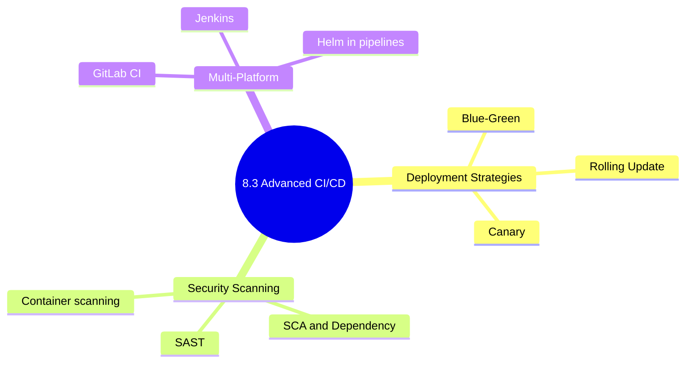

# 8.3.5 Subchapter 8.3 Review: Deployment Strategies and Security Scanning

**Backlinks:** [8.3.1 — Deployment Strategies](./8.3.1_Deployment_Strategies_Explained.md) | [8.3.2 — Security Scanning in CI/CD](./8.3.2_Security_Scanning_in_CI_CD.md) | [8.3.3 — GitLab CI, Jenkins & Helm](./8.3.3_GitLab_CI_Jenkins_Self_Hosted_and_Helm.md) | [8.3.4 — Complete CI/CD Cheatsheet](./8.3.4_Complete_CICD_Cheatsheet_and_Final_Exam.md)

**Next note:** [9.1.1 — Python Basics, Data Types, and Control Flow](../../9-Python/Subchapter_9.1/9.1.1_Python_Basics_Data_Types_and_Control_Flow.md)



---

This review covers only the material presented in Notes 8.3.1 (Deployment Strategies Explained) and 8.3.2 (Security Scanning in CI/CD).

---

## Cheatsheet: Deployment Strategies and Security Scanning

### Deployment Strategies Comparison

| Strategy | Downtime | Rollback Speed | Complexity | Resources |
|----------|----------|----------------|------------|-----------|
| Recreate | Yes | Slow | Low | 1x |
| Rolling Update | Zero | Fast | Low | 1x (+surge) |
| Blue/Green | Zero | Instant | Medium | 2x |
| Canary | Zero | Instant | High | 1x (+monitoring) |
| Feature Flags | Zero | Instant | High | 1x |

### Kubernetes Deployment Commands

| Strategy | Command |
|----------|---------|
| Rolling Update | `kubectl set image deployment/myapp myapp=v2` |
| Rolling Update (rollback) | `kubectl rollout undo deployment/myapp` |
| Blue/Green (switch) | `kubectl patch service myapp -p '{"spec":{"selector":{"version":"green"}}}'` |
| Canary | Use Istio or Nginx traffic splitting |

### Security Scan Types

| Type | What | When | Tools |
|------|------|------|-------|
| SAST | Code vulnerabilities | After commit | Trivy, SonarQube |
| SCA | Dependency vulnerabilities | After dependency install | Trivy, Snyk |
| Container | OS packages, misconfigs | After build | Trivy, Grype |
| Secret | Hardcoded secrets | During commit | TruffleHog, Gitleaks |
| DAST | Runtime vulnerabilities | In staging | OWASP ZAP |

### Trivy Scan Commands

| Command | Purpose |
|---------|---------|
| `trivy fs .` | SAST scan |
| `trivy fs --scanners vuln .` | SCA scan |
| `trivy image myapp:latest` | Container scan |
| `trivy config Dockerfile` | Dockerfile scan |
| `trivy fs --severity CRITICAL --exit-code 1 .` | Fail on critical |

### Rolling Update Parameters

| Parameter | Meaning | Example |
|-----------|---------|---------|
| `maxSurge` | Extra pods allowed | `1`, `25%` |
| `maxUnavailable` | Pods that can be down | `0`, `1` |

### Database Migration Best Practices

| Rule | Why |
|------|-----|
| Add columns, don't remove | Safe, backward-compatible |
| Deploy code first, then migrate | Code can work with old schema |
| Use feature flags for schema changes | Rollback without migration |

---

## Comparison Tables

### Deployment Strategy Decision Guide

| Scenario | Recommended Strategy |
|----------|---------------------|
| Batch job, nightly run | Recreate |
| Simple web app | Rolling Update |
| E-commerce checkout | Blue/Green |
| High-traffic API | Canary |
| Mobile app | Feature Flags |

### Security Tool Comparison

| Tool | SAST | SCA | Container | Secret | DAST |
|------|------|-----|-----------|--------|------|
| Trivy | ✓ | ✓ | ✓ | ✗ | ✗ |
| Snyk | ✓ | ✓ | ✓ | ✓ | ✗ |
| SonarQube | ✓ | ✓ | ✗ | ✗ | ✗ |
| TruffleHog | ✗ | ✗ | ✗ | ✓ | ✗ |
| OWASP ZAP | ✗ | ✗ | ✗ | ✗ | ✓ |

### Severity Actions

| Severity | Action |
|----------|--------|
| CRITICAL | Fail pipeline, block deployment |
| HIGH | Fail pipeline (or require approval) |
| MEDIUM | Warning, allow deployment |
| LOW | Log only |

---

## Topics Covered in This Subchapter (Self-Check)

| Topic | Found in Note |
|-------|---------------|
| Deployment strategy comparison (downtime, rollback, complexity) | 8.3.1 |
| Recreate deployment — when and how | 8.3.1 |
| Rolling update — `maxSurge`, `maxUnavailable` | 8.3.1 |
| Blue/Green — `kubectl patch service selector` | 8.3.1 |
| Canary — traffic weight splitting (Istio, Nginx) | 8.3.1 |
| Feature flags — `LaunchDarkly`, `ConfigMap` toggles | 8.3.1 |
| Database migration patterns (backward-compatible) | 8.3.1 |
| "Shift left" security principle | 8.3.2 |
| SAST — static code analysis | 8.3.2 |
| SCA — dependency vulnerability scanning | 8.3.2 |
| Container scanning — OS packages and misconfigs | 8.3.2 |
| Secret detection — TruffleHog, Gitleaks | 8.3.2 |
| DAST — runtime vulnerability testing | 8.3.2 |
| OWASP Top 10 | 8.3.2 |
| SBOM generation with Trivy/Syft | 8.3.2 |
| Image signing with cosign (keyless OIDC) | 8.3.2 |
| Supply chain attack types and mitigations | 8.3.2 |
| Canary vs A/B testing distinction | 8.3.1 |
| Shadow deployment pattern | 8.3.1 |
| Canary health metrics (error rate, p99 latency) | 8.3.1 |
| Grype container scanner commands | 8.3.2 |
| `.trivyignore` format and best practices | 8.3.2 |
| Fulcio CA and Rekor transparency log | 8.3.2 |

## Bridge Concepts (Added for Clarity)

| Concept | Explanation |
|---------|-------------|
| `QEMU` | CPU emulator that lets an x86 GitHub runner build ARM Docker images |
| `maxSurge: 25%` | During a rolling update Kubernetes can temporarily create 25% extra pods |
| `maxUnavailable: 0` | Zero pods are allowed to be unready during rollout — true zero-downtime |
| `cosign` | Part of the Sigstore project; provides keyless container image signing |
| `SBOM` | Software Bill of Materials — complete inventory of every package in your app |
| `Rekor` | Public transparency log (Sigstore) where cosign signatures are stored — tamper-evident, append-only |
| `Fulcio` | Sigstore's free Certificate Authority that issues short-lived (10-min) signing certs tied to your CI/CD OIDC identity |
| CVE | Common Vulnerabilities and Exposures — global ID for known security issues (e.g. `CVE-2021-44228` = Log4Shell) |
| `.trivyignore` | File listing CVE IDs to suppress in Trivy scans — always include a comment with reason and resolution date |
| `grype` | Alternative container scanner from Anchore — complementary to Trivy, different vulnerability database |
| Canary vs A/B | Canary = validate new code stability (roll back on errors). A/B = compare two versions to find which performs better (statistical decision). Both split traffic but for different goals |
| Shadow deployment | Route a copy of production traffic to a new version but discard its response — zero user impact, real traffic load testing |
| `--atomic` (Helm) | If any pod fails to reach Ready within `--timeout`, Helm automatically rolls back to the previous release revision |

---

**Next note:** [8.3.4 — Complete CI/CD Cheatsheet and Module 8 Final Exam](./8.3.4_Complete_CICD_Cheatsheet_and_Final_Exam.md)

---

## Interview Questions (Scenario-Based)

### Question 1: CI/CD Pipeline Design (10 minutes)

**Scenario:** A team has a Node.js application with the following requirements:
- Run tests on every commit
- Build Docker image on merge to main
- Scan for vulnerabilities before deploying
- Deploy to staging, then to production with approval

**Question:** Design a GitHub Actions workflow with these stages. Show the YAML structure.

**Answer:**

```yaml
name: CI/CD Pipeline

on:
  push:
    branches: [ main ]
  pull_request:
    branches: [ main ]

jobs:
  test:
    runs-on: ubuntu-latest
    steps:
      - uses: actions/checkout@v4
      - uses: actions/setup-node@v4
        with:
          node-version: '18'
      - run: npm ci
      - run: npm test
      
  build-and-scan:
    needs: test
    runs-on: ubuntu-latest
    if: github.ref == 'refs/heads/main'
    steps:
      - uses: actions/checkout@v4
      - name: Build image
        run: docker build -t myapp:${{ github.sha }} .
      - name: Scan image
        uses: aquasecurity/trivy-action@master
        with:
          image-ref: myapp:${{ github.sha }}
          severity: CRITICAL,HIGH
          exit-code: '1'
      - name: Push image
        run: docker push myapp:${{ github.sha }}
        
  deploy-staging:
    needs: build-and-scan
    runs-on: ubuntu-latest
    environment: staging
    steps:
      - name: Deploy to staging
        run: kubectl set image deployment/myapp myapp=myapp:${{ github.sha }}
        
  deploy-production:
    needs: deploy-staging
    runs-on: ubuntu-latest
    environment: production
    steps:
      - name: Deploy to production
        run: kubectl set image deployment/myapp myapp=myapp:${{ github.sha }}
```

---

### Question 2: Choose Deployment Strategy (5 minutes)

**Scenario:** An e-commerce website expects 10,000 requests/second during Black Friday. The team needs to deploy a new checkout feature with zero risk.

**Question:** Which deployment strategy would you recommend? Why? What are the trade-offs?

**Answer:**

**Recommended strategy:** **Canary deployment**

**Why:**
- Start with 1% of traffic to the new version
- Monitor error rates and latency
- Gradually increase if metrics are good
- Instant rollback (stop canary)
- Lowest risk for high-traffic systems

**Trade-offs:**

| Pros | Cons |
|------|------|
| Minimal user impact if bug | Requires traffic splitting infrastructure |
| Real-world validation before full rollout | Longer deployment time (1-2 hours) |
| Instant rollback | Monitoring and observability required |
| Can be automated | More complex than rolling update |

**Implementation (Istio example):**
```yaml
apiVersion: networking.istio.io/v1beta1
kind: VirtualService
metadata:
  name: checkout
spec:
  http:
  - route:
    - destination:
        host: checkout-v1
        weight: 99
    - destination:
        host: checkout-v2
        weight: 1
```

**Canary rollout plan:**
1. 1% for 10 minutes – monitor errors
2. 5% for 20 minutes – monitor errors
3. 20% for 30 minutes – monitor errors
4. 50% for 1 hour – monitor errors
5. 100% – full rollout

---

### Question 3: Security Scanning (10 minutes)

**Scenario:** A security scan finds a CRITICAL vulnerability in a dependency (log4j version 2.14.1). The pipeline is configured to block deployment on CRITICAL findings.

**Question:** What are your options? How would you handle this situation?

**Answer:**

**Options (in priority order):**

1. **Fix the dependency (best option):**
```bash
# Update to patched version
npm update log4j  # or mvn upgrade
# or
# package.json: "log4j": "^2.17.0"
# Rebuild and test
```

2. **If no patch available (temporary override):**
```bash
# Add to .trivyignore with justification
echo "CVE-2021-44228 # Log4Shell - awaiting patch from vendor, ETA 2024-01-15" >> .trivyignore
```

3. **If the library is not actually used:**
```bash
# Remove unused dependency
npm remove log4j
# or
# Exclude from scan (if false positive)
```

4. **If feature can be disabled:**
```bash
# Disable vulnerable feature via configuration
# Deploy without fix, but with mitigation
```

**Step-by-step response:**
1. **Verify the vulnerability:**
```bash
trivy fs --severity CRITICAL --ignore-unfixed .
# Confirm it's not a false positive
```

2. **Check if patch exists:**
```bash
npm info log4j version
# If >= 2.17.0, patch available
```

3. **Fix and redeploy:**
```bash
npm update log4j
npm test
git add package.json package-lock.json
git commit -m "fix: upgrade log4j to 2.17.0"
git push
```

4. **If patch not available (document override):**
```bash
# Create ticket to track
# Add to .trivyignore with expiration date
```

---

### Question 4: Blue/Green Deployment (10 minutes)

**Scenario:** You need to deploy a new version of a critical API using blue/green deployment. The current version is running as `myapp-blue`. The database schema changed (added a new column).

**Question:** How would you handle the database migration? Write the step-by-step process.

**Answer:**

**Step-by-step process:**

**Phase 1: Backward-compatible change (no downtime)**
```sql
-- Add new column as nullable
ALTER TABLE users ADD COLUMN phone VARCHAR(20);
```

**Phase 2: Deploy green environment**
```bash
# Deploy green with new code that uses the new column
kubectl apply -f deployment-green.yaml
kubectl wait --for=condition=ready pod -l version=green
```

**Phase 3: Test green environment**
```bash
# Run integration tests against green
kubectl port-forward service/myapp-green 8080:80
npm run test:integration
```

**Phase 4: Switch traffic to green**
```bash
# Update service selector from blue to green
kubectl patch service myapp -p '{"spec":{"selector":{"version":"green"}}}'
```

**Phase 5: Monitor**
```bash
# Check error rates
kubectl logs -l version=green --tail=100
```

**Phase 6: Clean up blue (after verification)**
```bash
kubectl delete deployment myapp-blue
```

**If rollback needed:**
```bash
# Switch back to blue
kubectl patch service myapp -p '{"spec":{"selector":{"version":"blue"}}}'
```

**Database considerations:**
| Change Type | Safe? | Strategy |
|-------------|-------|----------|
| Add column (nullable) | Yes | Do before deployment |
| Add column (not null) | No | Add with default, then deploy |
| Remove column | No | Deploy code that doesn't use it, then remove |
| Rename column | No | Add new, dual-write, then remove old |

---

### Question 5: Pipeline Optimization (10 minutes)

**Scenario:** A CI pipeline takes 25 minutes. Breakdown:
- Checkout: 0.5 min
- Install dependencies: 10 min
- Run unit tests: 3 min
- Build Docker image: 5 min
- Run container scan: 3 min
- Deploy to staging: 2 min
- Run integration tests: 2 min

**Question:** How would you optimize this pipeline? What techniques would you use?

**Answer:**

**Optimization techniques:**

1. **Parallelize independent stages:**
```yaml
jobs:
  test:
    runs-on: ubuntu-latest
    steps:
      - run: npm test
  build:
    runs-on: ubuntu-latest
    steps:
      - run: docker build -t myapp .
  container-scan:
    needs: build
    runs-on: ubuntu-latest
    steps:
      - run: trivy image myapp:latest
```

2. **Cache dependencies:**
```yaml
- uses: actions/cache@v3
  with:
    path: ~/.npm
    key: ${{ runner.os }}-node-${{ hashFiles('package-lock.json') }}
```

3. **Use larger runner:**
```yaml
runs-on: ubuntu-latest-8-cores  # Faster builds
```

4. **Optimize Docker layer caching:**
```dockerfile
# Before: COPY . . (invalidates cache)
# After: COPY package*.json ./ (caches dependencies)
COPY package*.json ./
RUN npm ci  # Cached unless package.json changes
COPY . .
```

5. **Fail fast (stop on first failure):**
```yaml
strategy:
  fail-fast: true
```

**Expected improvements:**

| Stage | Before | After | Technique |
|-------|--------|-------|-----------|
| Install deps | 10 min | 1 min | Caching |
| Build Docker | 5 min | 2 min | Layer caching |
| Container scan | 3 min | 2 min | Parallel with tests |
| **Total** | **25 min** | **~8 min** | Combined |

---

### Question 6: Security Pipeline (10 minutes)

**Scenario:** A company wants to implement security scanning for all code changes. They have:
- 20 microservices
- 500 dependencies across all services
- Daily vulnerability reports required

**Question:** Design a security pipeline that includes SAST, SCA, and container scanning. Where should each scan run?

**Answer:**

**Security pipeline design:**

```yaml
name: Security Pipeline

on:
  push:
    branches: [ main ]
  pull_request:
    branches: [ main ]
  schedule:
    - cron: '0 2 * * *'  # Daily full scan

jobs:
  # Fast scans on every PR (fail fast)
  quick-scans:
    runs-on: ubuntu-latest
    if: github.event_name == 'pull_request'
    steps:
      - uses: actions/checkout@v4
      - name: SAST (fast)
        uses: aquasecurity/trivy-action@master
        with:
          scan-type: 'fs'
          severity: 'CRITICAL'
          exit-code: '1'
      - name: SCA (fast)
        uses: aquasecurity/trivy-action@master
        with:
          scan-type: 'fs'
          scanners: 'vuln'
          severity: 'CRITICAL'
          
  # Full scans on main branch
  full-scans:
    runs-on: ubuntu-latest
    if: github.ref == 'refs/heads/main'
    steps:
      - uses: actions/checkout@v4
      - name: SAST (full)
        uses: aquasecurity/trivy-action@master
        with:
          scan-type: 'fs'
          severity: 'CRITICAL,HIGH'
      - name: SCA (full)
        uses: aquasecurity/trivy-action@master
        with:
          scan-type: 'fs'
          scanners: 'vuln'
          severity: 'CRITICAL,HIGH'
      - name: Build and scan container
        run: |
          docker build -t myapp:latest .
          trivy image --severity CRITICAL,HIGH myapp:latest
          
  # Nightly full scan (all services)
  nightly:
    runs-on: ubuntu-latest
    if: github.event_name == 'schedule'
    strategy:
      matrix:
        service: [service1, service2, ...]  # 20 services
    steps:
      - uses: actions/checkout@v4
        with:
          repository: company/${{ matrix.service }}
      - name: Full security scan
        uses: aquasecurity/trivy-action@master
        with:
          scan-type: 'fs'
          scanners: 'vuln,secret'
          severity: 'CRITICAL,HIGH,MEDIUM'
      - name: Upload results to dashboard
        uses: github/codeql-action/upload-sarif@v3
        
  # Secret scanning on every push
  secrets:
    runs-on: ubuntu-latest
    steps:
      - uses: actions/checkout@v4
        with:
          fetch-depth: 0
      - name: TruffleHog
        uses: trufflesecurity/trufflehog@main
        with:
          path: ./
```

**Scan placement strategy:**

| Scan Type | When | Why |
|-----------|------|-----|
| SAST | Every PR | Fast, catches code issues early |
| SCA | Every PR (critical only) | Block critical vulns immediately |
| Container | Main branch | After build, before deploy |
| Secret | Every push | Prevent secrets in Git |
| Full scan | Nightly | Catch lower severity issues |

---

---

**Next note:** [8.3.4 — Complete CI/CD Cheatsheet and Module 8 Final Exam](./8.3.4_Complete_CICD_Cheatsheet_and_Final_Exam.md)

Congratulations on completing Subchapter 8.3 content! You now understand all major deployment strategies and security scanning techniques. Note 8.3.3 extends this with other CI platforms (GitLab CI, Jenkins), self-hosted runners, and Helm-based deployments. Note 8.3.4 contains the complete Module 8 cheatsheet and final exam.
