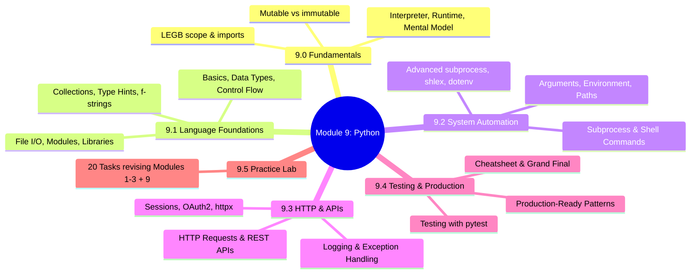
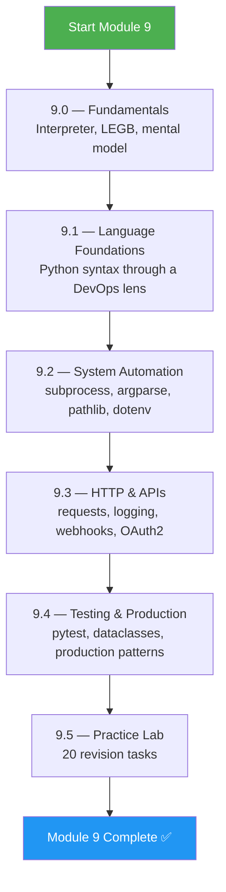
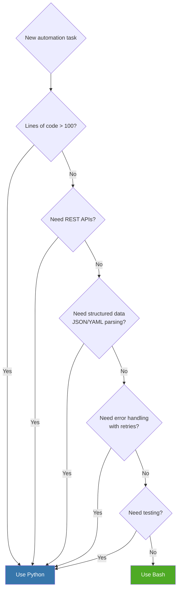
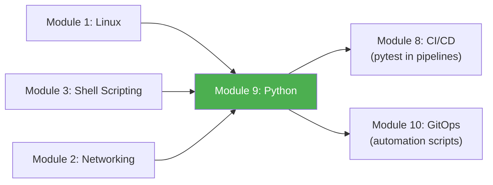

# Module 9 Approach Guide — Python for DevOps

## Module Overview

---

## Who Is This Module For?

Python is the **second language of DevOps** (after bash). When scripts exceed ~100 lines, when you need to call REST APIs, when you need structured logging, when you need testing — Python replaces bash. This module teaches Python specifically through a DevOps/Platform Engineering lens.

**Target audience:**
- DevOps engineers who automate with bash but need more power
- Platform engineers building internal tools, webhook handlers, and API clients
- Anyone who writes Python "scripts" but wants production-grade patterns (testing, logging, error handling)

---

## Prerequisites

| Prerequisite | Required? | Notes |
|---|---|---|
| Module 1 (Linux) completed | **Yes** | Python scripts run on Linux and call Linux commands |
| Module 3 (Shell Scripting) completed | **Yes** | You need to understand what Python is replacing and when |
| Module 2 (Networking) completed | Recommended | HTTP concepts needed for 9.3 |
| Python 3.9+ installed | **Yes** | `python3 --version`; install with `apt install python3 python3-pip python3-venv` |
| Module 8 (CI/CD) completed | Recommended | pytest integration in pipelines |

---

## How to Approach This Module

### Study Strategy

1. **If you already know Python** — Skim 9.1 but DO read 9.1.3 (collections + type hints). Start deep from 9.2.
2. **If Python is new** — Read 9.1 slowly. Type every example. Use the REPL (`python3`) to experiment.
3. **Every code example should be runnable** — Create a `devops-scripts/` directory and build real tools.
4. **Write tests from day one** — 9.4 covers pytest, but start writing tests as soon as you hit 9.2.
5. **Compare with bash constantly** — Ask "could I have done this in bash?" If yes, which is cleaner?

### The Bash vs Python Decision

---

## Time Estimates

| Subchapter | Reading | Practice | Total |
|---|---|---|---|
| 9.0 Fundamentals | 1 hr | 0.5 hr | **1.5 hrs** |
| 9.1 Language Foundations | 3 hrs | 3 hrs | **6 hrs** |
| 9.2 System Automation | 2.5 hrs | 3 hrs | **5.5 hrs** |
| 9.3 HTTP & APIs | 3 hrs | 3.5 hrs | **6.5 hrs** |
| 9.4 Testing & Production | 3 hrs | 4 hrs | **7 hrs** |
| 9.5 Practice Lab | — | 4 hrs | **4 hrs** |
| **Total** | **12.5 hrs** | **18 hrs** | **~30 hrs** |

> **Realistic timeline:** 3 weeks at 2 hours/day. If you already know Python basics, skim 9.0 and 9.1 — jump straight to 9.2.

---

## Practice Lab Ideas

| Lab | Covers | Difficulty |
|---|---|---|
| Write a script that reads a YAML config, validates it, and prints a summary | 9.1 | ⭐⭐ |
| Build a CLI tool with `argparse` that runs `kubectl` commands with retries | 9.2 | ⭐⭐⭐ |
| Write a Slack webhook notifier for deployment events | 9.3 | ⭐⭐⭐ |
| Build a REST API health checker that polls 10 endpoints and reports status | 9.3 | ⭐⭐⭐ |
| Create a GitHub API client with OAuth2 token refresh and pagination | 9.3 | ⭐⭐⭐⭐ |
| Write a complete deployment script with pytest tests, logging, and retry logic | 9.4 | ⭐⭐⭐⭐ |
| Build a Python CLI that replaces a 200-line bash script — compare readability | 9.1–9.4 | ⭐⭐⭐⭐ |

---

## What Success Looks Like

By the end of Module 9, you should be able to:

- [ ] Write Python scripts with type hints, f-strings, and proper structure
- [ ] Use `subprocess.run()` safely with `shlex.split()` and error handling
- [ ] Build CLI tools with `argparse` and environment variable loading
- [ ] Make HTTP requests with `requests.Session()`, handle pagination, implement retries
- [ ] Set up structured logging with `logging.getLogger(__name__)`
- [ ] Write pytest tests with fixtures, parametrize, and mocking
- [ ] Use dataclasses, `lru_cache`, and context managers in production code
- [ ] Know when to use Python vs bash for any given task

---

## Connection to Other Modules

**Python fills the gap bash can't.** Linux commands (Module 1) are called via `subprocess`. HTTP concepts (Module 2) are used via `requests`. Shell scripting patterns (Module 3) are replaced when they get too complex. CI/CD pipelines (Module 8) run pytest. GitOps automation (Module 10) uses Python for custom tooling.

> **Next module:** [Module 10 — GitOps & ArgoCD](../10-GitOps-ArgoCD/Module_10_Approach_Guide.md)
