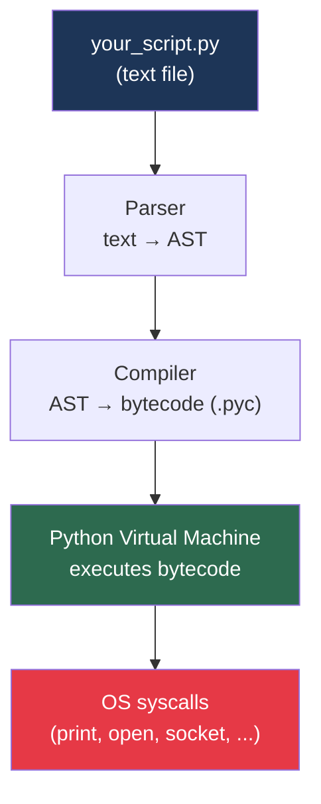
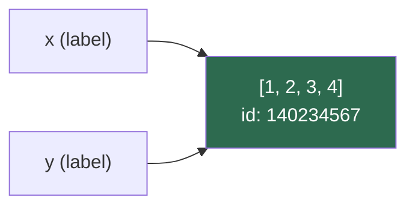
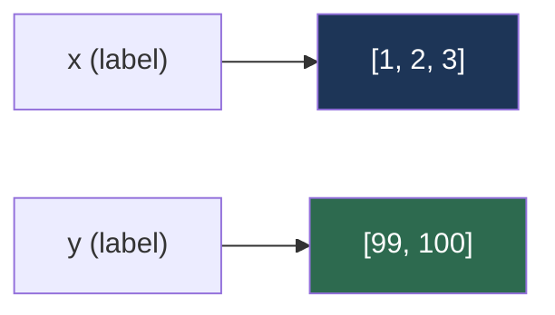
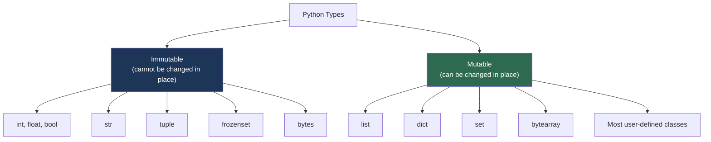
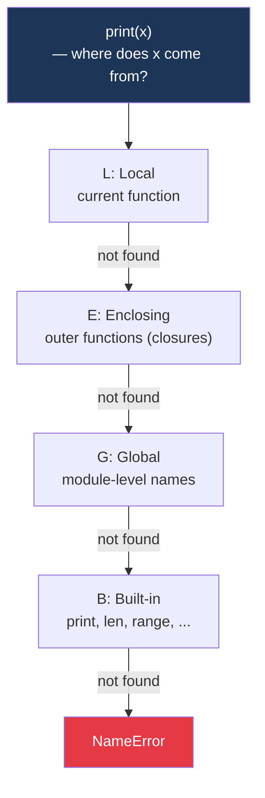
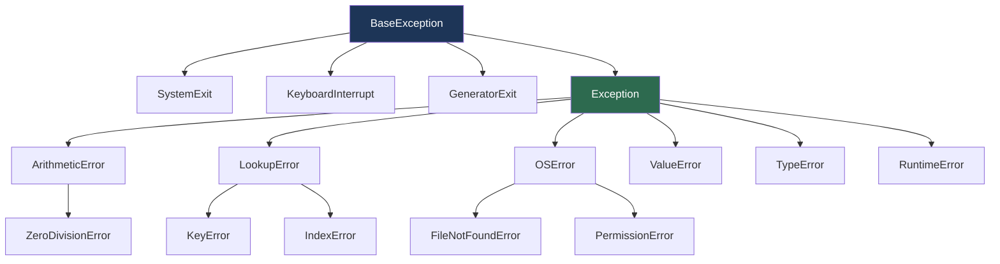
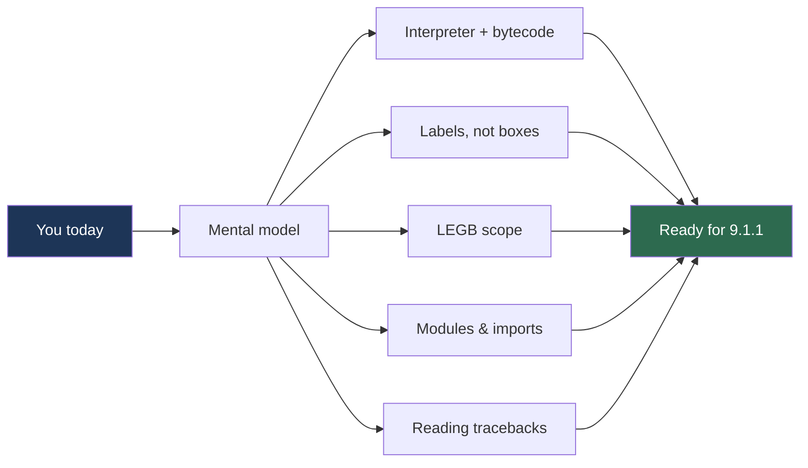

# 9.0.1 Python Interpreter, Runtime, and Mental Model

**Backlinks:** [Module 1 — Linux](../../1-Linux/) (shebangs, `$PATH`, processes) · [Module 3 — Shell Scripting](../../3-Shell-Scripting/) (the tool you are upgrading from)

**Next note:** [9.1.1 — Python Basics, Data Types, and Control Flow](../Subchapter_9.1/9.1.1_Python_Basics_Data_Types_and_Control_Flow.md)

---

## Why This Note Exists

Most Python tutorials jump straight to `print("hello")` without explaining **what Python actually is** or **how it works under the hood**. You end up writing code that works but can't explain:

- Why does `import` sometimes fail even though the file exists?
- Why does modifying a list inside a function affect the caller, but not when you reassign it?
- What does `if __name__ == "__main__":` actually mean?
- What is the difference between `python3 script.py` and `python3 -m script`?
- Why do two variables pointing to the same list behave differently from two variables pointing to the same integer?

This note builds the **mental model** so every other Python note clicks into place.

> **Tip:** If you already write Python daily and can explain all five questions above, skim this and jump to [9.1.1](../Subchapter_9.1/9.1.1_Python_Basics_Data_Types_and_Control_Flow.md). Otherwise, read slowly — this is the foundation every note builds on.

---

## Part 1: What Is Python, Really?

### Python Is an Interpreter + a Language + a Standard Library



When you run `python3 hello.py`, these steps happen invisibly:

1. **Parse** — Python reads the `.py` file and converts text into an Abstract Syntax Tree (AST).
2. **Compile** — AST is compiled to **bytecode** (a lower-level instruction format). Cached in `__pycache__/*.pyc`.
3. **Execute** — The Python Virtual Machine (VM) runs the bytecode instruction by instruction.

> **Key insight:** Python is **not** a "scripting language" vs a "real language". It is a **compiled, then interpreted** language. The compilation to bytecode happens automatically every time you run it. This is the same model as Java (which compiles to JVM bytecode).

### Seeing It Yourself

```bash
# Run a script — .pyc file gets auto-created
python3 hello.py
ls __pycache__/
# hello.cpython-311.pyc

# Decompile bytecode to see what the VM actually executes
python3 -c "import dis; dis.dis(compile('x = 1 + 2', '<str>', 'exec'))"
#   1           0 LOAD_CONST               0 (3)
#               2 STORE_NAME               0 (x)
#               4 LOAD_CONST               1 (None)
#               6 RETURN_VALUE
```

Notice: `1 + 2` was **not** stored as-is. The compiler already evaluated it to `3` at compile time (a peephole optimisation).

### CPython vs PyPy vs Others

| Implementation | Written in | What it is | When to use |
|---|---|---|---|
| **CPython** | C | Reference implementation — what you get from python.org and `apt install python3` | **Always, unless you have a reason not to** |
| **PyPy** | RPython | JIT-compiled Python — 4-10× faster for pure Python code | Long-running CPU-bound workloads |
| **Jython** | Java | Runs on JVM — can import Java classes | Legacy JVM integration |
| **MicroPython** | C | Tiny Python for microcontrollers | Embedded/IoT |
| **PyScript/Pyodide** | WebAssembly | Python in the browser | Client-side demos |

> **Practical note:** When someone says "Python" they mean CPython 99% of the time. Every example in these notes uses CPython.

---

## Part 2: Where Does Python Live on Your System?

### The `which` Puzzle

```bash
which python3
# /usr/bin/python3

ls -l /usr/bin/python3
# lrwxrwxrwx 1 root root 10 Aug 17 10:00 /usr/bin/python3 -> python3.11

python3 --version
# Python 3.11.4

# The site-packages directory (where pip installs libraries)
python3 -c "import site; print(site.getsitepackages())"
# ['/usr/lib/python3.11/site-packages']
```

### The `sys.path` — How Python Finds Imports

When you write `import requests`, Python searches directories in this order:

```python
import sys
for p in sys.path:
    print(p)
# ''                              <- current script's directory
# /usr/lib/python311.zip
# /usr/lib/python3.11
# /usr/lib/python3.11/lib-dynload
# /home/alice/.local/lib/python3.11/site-packages
# /usr/lib/python3.11/site-packages
```


> **Warning:** The #1 most common beginner bug: creating a file named `requests.py` in your project folder, then running `import requests` — Python imports **your** file instead of the library because the current directory is searched first. **Never name a script the same as a library.**

### Virtual Environments — The Whole Story

A venv is literally just **a folder with a Python binary and an empty `site-packages`**. When activated, it prepends itself to `$PATH` so `python3` and `pip` resolve to the venv's copies.

```bash
python3 -m venv .venv
ls .venv/
# bin/  include/  lib/  pyvenv.cfg

cat .venv/pyvenv.cfg
# home = /usr/bin
# include-system-site-packages = false
# version = 3.11.4

source .venv/bin/activate
which python3
# /home/alice/proj/.venv/bin/python3

python3 -c "import sys; print(sys.path)"
# [..., '/home/alice/proj/.venv/lib/python3.11/site-packages']
#                ^^^^^^^^^^ now isolated
```

> **Tip:** Add `.venv/` to `.gitignore`. Never commit virtual environments. Commit `requirements.txt` instead — it describes *what* to install, not the installed files themselves.

---

## Part 3: Everything Is an Object (The Reference Model)

This is **the** concept that separates Python novices from Python engineers.

### In Python, Variables Are Labels, Not Boxes

In C, a variable is a named memory location that holds a value. In Python, a **variable is a label** that points to an **object** somewhere in memory.

```python
x = [1, 2, 3]
y = x            # y is a *second label* on the same list
y.append(4)
print(x)         # [1, 2, 3, 4]   <- BOTH changed
print(y)         # [1, 2, 3, 4]
print(id(x) == id(y))  # True — same object
```



### Rebinding vs Mutation

```python
x = [1, 2, 3]
y = x

y = [99, 100]    # REBINDING — y now points to a NEW list
print(x)         # [1, 2, 3]   <- unchanged
print(y)         # [99, 100]
```



| Operation | Effect |
|---|---|
| `y = x` | New label on the same object |
| `y = [...]` | Rebind `y` to a new object (old object unaffected) |
| `y.append(4)` | Mutate the object `y` points to (all other labels see it) |
| `y += [4]` on list | Mutates in place (equivalent to `y.extend([4])`) |
| `y = y + [4]` on list | Creates new list, rebinds `y` |

### Mutable vs Immutable Types



```python
# Immutable — "changing" creates a new object
s = "hello"
t = s
t = t + " world"    # new string created
print(s)            # "hello"  (unchanged)
print(t)            # "hello world"

# Mutable — changes visible through all labels
lst = [1, 2]
lst2 = lst
lst2.append(3)
print(lst)          # [1, 2, 3]
```

### Function Arguments — The #1 Gotcha

```python
def append_item(items, item):
    items.append(item)    # MUTATES the caller's list

def reassign_items(items):
    items = [99]          # REBINDS local name — caller unaffected

data = [1, 2, 3]

append_item(data, 4)
print(data)    # [1, 2, 3, 4]  <- caller sees mutation

reassign_items(data)
print(data)    # [1, 2, 3, 4]  <- caller's list unchanged
```

> **Rule:** Python passes **references by value**. The function receives a copy of the *label*, not a copy of the object. Mutations are visible to the caller; rebinds are not.

### The Mutable-Default-Argument Trap

```python
# ❌ BUG — default list is created ONCE at function definition
def add_log(msg, log=[]):
    log.append(msg)
    return log

print(add_log("A"))   # ['A']
print(add_log("B"))   # ['A', 'B']   <- surprise! same list reused

# ✅ FIX — use None sentinel
def add_log(msg, log=None):
    if log is None:
        log = []
    log.append(msg)
    return log

print(add_log("A"))   # ['A']
print(add_log("B"))   # ['B']   <- correct
```

> **Warning:** Linters (ruff, pylint) flag `def f(x=[])` as a bug. **Always use `None` as the default for mutable arguments.**

---

## Part 4: Names, Namespaces, and the LEGB Rule

Every name lookup in Python searches four scopes in order: **L → E → G → B**.



### LEGB in Action

```python
x = "global"                      # G

def outer():
    x = "enclosing"               # E

    def inner():
        x = "local"               # L
        print(x)                  # → "local"

    inner()
    print(x)                      # → "enclosing"

outer()
print(x)                          # → "global"
print(len)                        # B — <built-in function len>
```

### `global` and `nonlocal`

By default, **assigning** to a name inside a function creates a **local** variable — even if a name with the same spelling exists outside.

```python
count = 0

def increment():
    count = count + 1        # UnboundLocalError!

increment()
# Why? The assignment `count = ...` makes `count` local,
# but we try to READ it before it's assigned.
```

Fix:

```python
count = 0

def increment():
    global count             # "I really mean the module-level count"
    count = count + 1

increment()
print(count)                 # 1
```

For nested functions, use `nonlocal`:

```python
def make_counter():
    n = 0
    def tick():
        nonlocal n           # modify the `n` in the enclosing scope
        n += 1
        return n
    return tick

c = make_counter()
print(c(), c(), c())         # 1 2 3
```

> **Tip:** Minimise use of `global`. Prefer passing state explicitly as arguments or wrapping state in a class. `global` makes code hard to test.

---

## Part 5: The Import System Deep Dive

### Modules vs Packages

| Concept | What it is | Example |
|---|---|---|
| **Module** | A single `.py` file | `utils.py` |
| **Package** | A directory containing `__init__.py` (optional since 3.3) and other modules | `myapp/` with `__init__.py`, `routes.py`, etc. |
| **Sub-package** | A package inside a package | `myapp/api/` with its own `__init__.py` |

Example layout:

```
myproject/
├── main.py
├── myapp/
│   ├── __init__.py
│   ├── config.py
│   └── api/
│       ├── __init__.py
│       └── routes.py
```

### Import Forms

```python
# 1. Whole module — preferred, explicit
import myapp.config
print(myapp.config.DEBUG)

# 2. Specific names — common
from myapp.config import DEBUG, VERSION

# 3. Rename on import — avoid name clashes
import myapp.config as cfg
print(cfg.DEBUG)

# 4. Star import — ❌ AVOID (pollutes namespace, unclear dependencies)
from myapp.config import *
```

### `if __name__ == "__main__":` Explained Properly

Every Python file has a special variable `__name__`:

- When **run as a script** (`python3 hello.py`) → `__name__ == "__main__"`
- When **imported** (`import hello`) → `__name__ == "hello"`

```python
# calc.py
def add(a, b):
    return a + b

def main():
    print(add(2, 3))

if __name__ == "__main__":
    main()
```

| How you run it | `__name__` value | Does `main()` execute? |
|---|---|---|
| `python3 calc.py` | `"__main__"` | **Yes** |
| `import calc` from another file | `"calc"` | **No** — the function is just defined |

> **Why this matters:** It lets a file work as both a **library** (safe to import) and a **script** (runs when executed directly). Without this guard, importing `calc` would immediately run `main()`, which you rarely want.

### Running a Module vs a Script

```bash
# As script — uses the file's location as sys.path[0]
python3 myapp/api/routes.py

# As module — uses current directory as sys.path[0],
#   and Python can resolve package-relative imports
python3 -m myapp.api.routes
```

> **Rule of thumb:** If your file uses `from myapp.config import DEBUG` (a package-relative import), run it with `python3 -m myapp.api.routes`. If it's a standalone script with no package imports, `python3 script.py` is fine.

---

## Part 6: Errors, Tracebacks, and How to Read Them

A Python error ("exception") produces a **traceback** — a stack of function calls showing exactly where it failed.

```python
# app.py
def load_config(path):
    with open(path) as f:
        return f.read()

def main():
    cfg = load_config("/etc/myapp.conf")
    print(cfg)

main()
```

```
Traceback (most recent call last):
  File "/home/alice/app.py", line 9, in <module>
    main()
  File "/home/alice/app.py", line 6, in main
    cfg = load_config("/etc/myapp.conf")
  File "/home/alice/app.py", line 3, in load_config
    with open(path) as f:
FileNotFoundError: [Errno 2] No such file or directory: '/etc/myapp.conf'
```

### How to Read a Traceback

1. **Read BOTTOM to TOP.** The error message is at the bottom; the call chain is above it.
2. The **last frame** (bottom-most `File ...` line) is where the error *occurred*.
3. Frames above it show **how you got there**.
4. The error type (`FileNotFoundError`) tells you *what* went wrong; the message tells you *what data* was involved.

### The Exception Hierarchy (Partial)



```python
# Catch specific > catch general
try:
    with open("/etc/myapp.conf") as f:
        data = f.read()
except FileNotFoundError:
    print("Config missing — using defaults")
except PermissionError:
    print("Need sudo to read config")
except OSError as e:
    print(f"Unexpected OS error: {e}")
```

> **Rule:** Never write bare `except:` — it also catches `KeyboardInterrupt` (Ctrl+C) and `SystemExit`, making programs impossible to stop. Use `except Exception:` if you really need a catch-all.

---

## Part 7: The Python Toolchain Every DevOps Engineer Should Know

| Tool | Purpose | Install |
|---|---|---|
| `python3` | Interpreter | apt/dnf/brew |
| `pip` | Package installer | Bundled with Python 3.4+ |
| `venv` | Virtual environments | Built-in |
| `pipx` | Install CLI tools globally in isolated envs | `apt install pipx` |
| `uv` | Fast pip/venv replacement (written in Rust) | `pipx install uv` |
| `ruff` | Linter + formatter (replaces flake8, isort, black) | `pipx install ruff` |
| `mypy` | Static type checker | `pipx install mypy` |
| `pytest` | Test runner | `pip install pytest` in a venv |
| `ipython` | Better REPL with tab-completion and syntax highlighting | `pip install ipython` |

### The Modern Minimal Workflow

```bash
# 1. New project
mkdir myproject && cd myproject
python3 -m venv .venv
source .venv/bin/activate

# 2. Install tools INSIDE the venv
pip install requests pytest ruff mypy

# 3. Freeze for reproducibility
pip freeze > requirements.txt

# 4. Lint, type-check, test
ruff check .
mypy .
pytest
```

> **Tip:** Aliases worth adding to `~/.bashrc`:
> ```bash
> alias venv='python3 -m venv .venv && source .venv/bin/activate'
> alias va='source .venv/bin/activate'
> alias vd='deactivate'
> ```

---

## Part 8: A Mental Model Checklist

Before moving to [9.1.1](../Subchapter_9.1/9.1.1_Python_Basics_Data_Types_and_Control_Flow.md), you should be able to answer **yes** to each of these:

- [ ] I can explain what a `.pyc` file is and where it lives.
- [ ] I know the difference between CPython and PyPy.
- [ ] I understand why `sys.path` order matters (and the `requests.py` pitfall).
- [ ] I can explain a venv as "a folder with a Python binary and its own `site-packages`".
- [ ] I can predict whether a function mutation will affect the caller.
- [ ] I know when to use `global` vs `nonlocal` vs passing arguments.
- [ ] I can explain `if __name__ == "__main__":` in one sentence.
- [ ] I can read a traceback bottom-to-top and identify the line where the error occurred.
- [ ] I know what tool to use for: installing deps (pip), isolating envs (venv), installing CLIs (pipx), linting (ruff), testing (pytest).

If any box is unchecked — re-read that section before moving on. Every later note assumes this foundation.

---

## Summary



**What you now know:**

- Python is a **compile-then-interpret** language; `.pyc` files cache bytecode.
- `CPython` is the default; PyPy, Jython, MicroPython serve niche needs.
- `sys.path` drives imports; virtual environments isolate per-project dependencies.
- Variables are **labels on objects**, not containers. Mutations leak through all labels; rebinds don't.
- Mutable defaults are a trap — use `None` sentinels.
- Name lookup follows **LEGB**: Local → Enclosing → Global → Built-in.
- `import x` loads a module (a `.py` file or a package directory).
- `if __name__ == "__main__":` separates script-mode from library-mode execution.
- Tracebacks are read bottom-to-top; the last frame shows the failing line.

**Next:** [9.1.1 — Python Basics, Data Types, and Control Flow](../Subchapter_9.1/9.1.1_Python_Basics_Data_Types_and_Control_Flow.md) — now with the runtime model in hand, syntax will be straightforward.
