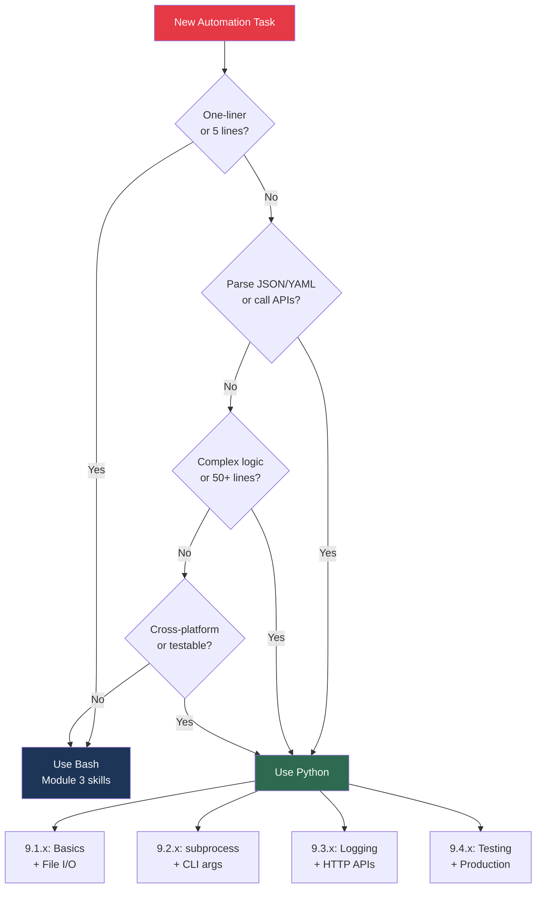
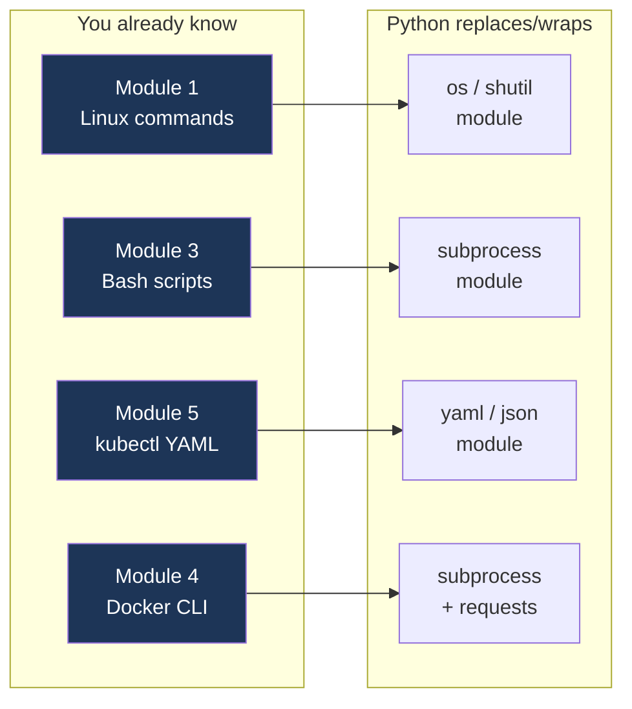
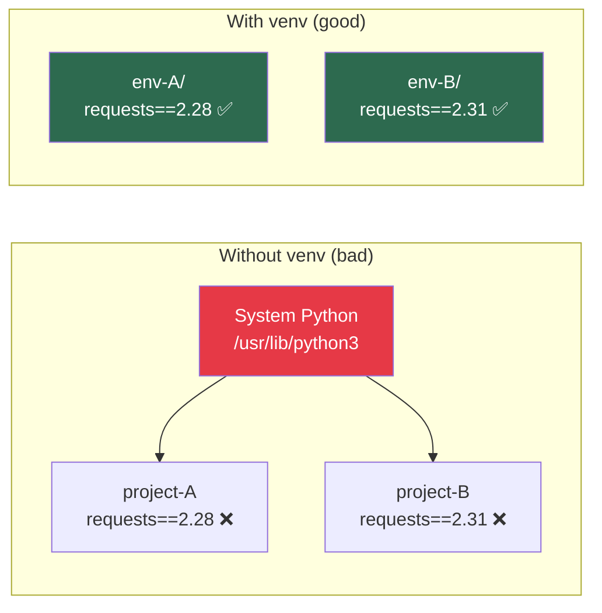
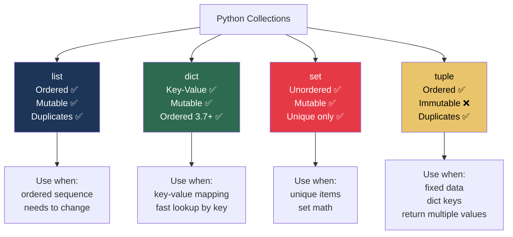

# 9.1.1 Python Basics, Data Types, and Control Flow: Your First Python Scripts

**Backlinks:** [Module 1 — Linux](../../1-Linux/) (file operations, environment variables, processes — all revisited in Python) | [Module 3 — Shell Scripting](../../3-Shell-Scripting/) (Bash scripts you will now rewrite in Python) | [Module 4 — Docker](../../4-Docker/) (Docker CLI called via subprocess later in 9.2.1) | [Module 5 — Kubernetes](../../5-Kubernetes/) (kubectl commands and YAML manifests parsed in Python)

**Next note:** [9.1.2 — File I/O, Modules, and Libraries](./9.1.2_File_IO_Modules_and_Libraries.md)

---

## Why Python for Platform Engineers

Bash is great for small scripts, but Python excels at:
- **Complex logic** — conditionals, loops, data structures
- **Data processing** — JSON, YAML, CSV, APIs
- **Cross-platform** — same code on Linux, macOS, Windows
- **Rich ecosystem** — thousands of libraries for any task
- **Maintainability** — easier to read and test than complex Bash
- **Testability** — `pytest` lets you unit-test every function (Module 9.4)

This note covers Python basics. Note 9.1.2 covers file I/O and modules; note 9.1.3 is the subchapter review; note 9.1.4 covers collections, type hints, and f-strings.

---

## Part 0: Where Python Fits in the DevOps Toolchain

Before writing a line of code, understand when to use Python vs other tools you already know:





> **Key insight for beginners:** Python does not replace Linux, Bash, Docker, or Kubernetes. It *orchestrates* them. You still run `kubectl apply`, `docker build`, and `nginx -t` — you just call them *from Python* instead of from a shell script, gaining error handling, retries, logging, and testability.

---

## Part 1: Python vs Bash — When to Use Which

| Task | Better Tool | Why |
|------|-------------|-----|
| One-liner file operations | Bash | Concise, no boilerplate |
| Complex conditionals | Python | Readable, explicit |
| Data parsing (JSON, YAML) | Python | Built-in libraries |
| API calls with retries | Python | `requests` + decorators |
| System automation (< 10 lines) | Bash | Quick and simple |
| System automation (50+ lines) | Python | Maintainable, testable |
| Cross-platform scripts | Python | Works everywhere |
| Running shell pipelines (`grep \| awk`) | Bash | Native pipeline syntax |
| Parsing `kubectl` JSON output | Python | `json.loads()` is cleaner |

---

## Part 2: Installing Python and Virtual Environments

### Check Python Installation

```bash
# Check Python version
python3 --version
# Python 3.10.12

# Check pip (package manager)
pip3 --version
```

### What is a Virtual Environment?

> **Beginner explanation:** When you `pip install requests`, where does it go? By default, it goes into your system Python — shared by every script on your machine. If project A needs `requests==2.28` and project B needs `requests==2.31`, they conflict. A **virtual environment** creates an isolated copy of Python with its own `site-packages` folder, so each project has its own versions. It is just a directory (`myproject_env/`) containing a Python binary and an empty `lib/` folder.



```bash
# Create virtual environment
python3 -m venv myproject_env

# Activate it (Linux/macOS)
source myproject_env/bin/activate

# Your prompt changes:
# (myproject_env) user@host:~$

# Install packages (now isolated to this env)
pip install requests pytest

# Deactivate (go back to system Python)
deactivate

# See all installed packages
pip list
```

> **`venv` vs `virtualenv` vs `conda`:**
> - `venv` — built into Python 3, preferred for most use cases
> - `virtualenv` — older third-party tool, slightly faster, supports Python 2
> - `conda` — from Anaconda, manages Python version itself + non-Python deps (data science)
> For platform engineering: **use `venv`** — it's built-in and needs no installation.

### requirements.txt

```bash
# Generate requirements file (snapshot of current env)
pip freeze > requirements.txt

# Install from requirements file (reproduce env)
pip install -r requirements.txt
```

Example `requirements.txt`:
```
requests==2.31.0
pytest==7.4.0
pyyaml==6.0.1
```

> **Why pin exact versions?** In CI/CD (Module 8), pipelines must be reproducible. `requests>=2.0` means tomorrow's build might use `requests==3.0` which breaks your script. Pin exact versions in `requirements.txt`.

---

## Part 3: Your First Python Script

### Hello, World!

```python
#!/usr/bin/env python3
# hello.py - First Python script

print("Hello, World!")
```

```bash
chmod +x hello.py
./hello.py
# Hello, World!
```

> **What is `#!/usr/bin/env python3`?** This is a "shebang". When Linux executes `./script.py`, it reads the first line to find the interpreter. `env python3` finds `python3` in your `$PATH` — works even if Python is installed in `/usr/local/bin/` or inside a `venv`.

### The Python REPL

> **What is the REPL?** REPL stands for **Read-Eval-Print Loop**. It is an interactive Python session where you type one expression and Python immediately evaluates and prints it. Essential for experimenting before writing scripts.

```bash
# Start REPL
python3
>>> 2 + 2
4
>>> "hello".upper()
'HELLO'
>>> exit()
```

### Running Python — All Methods

```bash
# Run script
python3 script.py

# Interactive REPL
python3

# Run one-liner without a file
python3 -c "print('hello from command line')"

# Run with debugger (pdb)
python3 -m pdb script.py

# Check syntax only (no execution)
python3 -m py_compile script.py

# Run module as script (common pattern)
python3 -m pytest          # Run pytest
python3 -m http.server     # Start simple HTTP server
python3 -m json.tool       # Pretty-print JSON
```

---

## Part 4: Variables and Data Types

### Basic Types

```python
# String — text data
name = "Alice"
multi_line = """This is
a multi-line
string"""

# Integer — whole numbers
age = 30
count = -5

# Float — decimal numbers
price = 19.99
temperature = -3.5

# Boolean — True or False (capital T and F — Python is case-sensitive)
is_active = True
is_deleted = False

# None — represents "no value" (equivalent to null in other languages)
result = None
```

### f-strings — The Modern Way to Format Strings

> **Beginner note:** Python has three ways to format strings. Always use **f-strings** (Python 3.6+) — they are the fastest and most readable:

```python
name = "Alice"
age = 30
server = "web-01"
cpu = 87.5

# ❌ Old way: string concatenation (avoid)
print("Hello " + name + ", you are " + str(age))

# ❌ Old way: .format() (avoid for new code)
print("Hello {}, you are {}".format(name, age))

# ✅ Modern: f-strings (use this)
print(f"Hello {name}, you are {age}")

# f-strings support expressions
print(f"CPU is {cpu:.1f}%")          # 87.5 → "87.5%"
print(f"CPU is {cpu:.0f}%")          # 87.5 → "88%"
print(f"Double age: {age * 2}")       # 60
print(f"Upper: {name.upper()}")       # ALICE
print(f"Server: {server!r}")          # 'web-01' (repr format, useful for debugging)

# Multi-line f-string
message = (
    f"Server: {server}\n"
    f"CPU:    {cpu:.1f}%\n"
    f"User:   {name}"
)
```

### Type Checking and Conversion

```python
# Check type
print(type(name))   # <class 'str'>
print(type(age))    # <class 'int'>

# Type conversion
str_number = "123"
int_number = int(str_number)     # 123
float_number = float(str_number) # 123.0
str_again = str(int_number)      # "123"

# Safe type check with isinstance
if isinstance(age, int):
    print("age is an integer")

# isinstance also accepts a tuple of types
if isinstance(age, (int, float)):
    print("age is numeric")
```

---

## Part 5: Collections — Lists, Dictionaries, Sets, Tuples



### Lists (Ordered, Mutable)

```python
# Create list
fruits = ["apple", "banana", "orange"]
numbers = [1, 2, 3, 4, 5]
mixed = [1, "hello", 3.14, True]   # Python lists can mix types

# Access elements (0-indexed)
print(fruits[0])    # apple  — first element
print(fruits[-1])   # orange — last element (negative = count from end)
print(fruits[-2])   # banana — second to last

# Slicing [start:end:step] — end is EXCLUSIVE
print(fruits[0:2])  # ['apple', 'banana']  — index 0 and 1
print(fruits[:2])   # ['apple', 'banana']  — from beginning
print(fruits[1:])   # ['banana', 'orange'] — to end
print(fruits[::2])  # ['apple', 'orange']  — every other item
print(fruits[::-1]) # ['orange', 'banana', 'apple'] — reversed

# Modify
fruits.append("grape")        # Add to end
fruits.insert(1, "blueberry") # Insert at index 1, shifts others right
fruits.remove("banana")       # Remove first occurrence by value
popped = fruits.pop()         # Remove AND return last element
fruits[0] = "cherry"          # Replace in place

# Search
if "apple" in fruits:
    print("Found!")

# Length
len(fruits)   # number of items
```

### List Comprehensions — The Pythonic Way

> **Why this matters:** List comprehensions are used *everywhere* in Python DevOps scripts. They replace `for` loops that build lists, making code shorter and faster.

```python
# Traditional loop
squares = []
for i in range(10):
    squares.append(i * i)

# List comprehension — same result, one line
squares = [i * i for i in range(10)]
# [0, 1, 4, 9, 16, 25, 36, 49, 64, 81]

# With filter condition
even_squares = [i * i for i in range(10) if i % 2 == 0]
# [0, 4, 16, 36, 64]

# Real platform engineering example: extract pod names from kubectl JSON
pod_names = [item['metadata']['name'] for item in data['items']]

# Filter only running pods
running_pods = [
    item['metadata']['name']
    for item in data['items']
    if item['status']['phase'] == 'Running'
]
```

### Dictionaries (Key-Value Pairs, Mutable)

```python
# Create dictionary
user = {
    "name": "Alice",
    "age": 30,
    "email": "alice@example.com"
}

# Access values
print(user["name"])            # Alice — raises KeyError if key missing
print(user.get("phone"))       # None  — safe, no KeyError
print(user.get("phone", "N/A")) # "N/A" — with default value

# Modify
user["age"] = 31                # Update existing key
user["phone"] = "555-1234"      # Add new key

# Remove
del user["email"]               # Delete key
phone = user.pop("phone")       # Delete and return value
phone = user.pop("phone", None) # Delete, return None if missing (safe)

# Check if key exists
if "name" in user:
    print(user["name"])

# Iterate — most common patterns
for key in user:
    print(key, user[key])

for key, value in user.items():  # ← use this most often
    print(f"{key}: {value}")

# Dictionary comprehension
squares = {i: i * i for i in range(5)}
# {0: 0, 1: 1, 2: 4, 3: 9, 4: 16}
```

### Sets (Unordered, Unique, Mutable)

```python
# Create set
unique_numbers = {1, 2, 3, 3, 4}  # {1, 2, 3, 4} — duplicates removed
unique_list = set([1, 2, 2, 3])    # {1, 2, 3}

# Set operations (useful for comparing lists of resources)
deployed_pods = {"pod-a", "pod-b", "pod-c"}
expected_pods  = {"pod-a", "pod-b", "pod-d"}

print(deployed_pods | expected_pods)  # Union:        all pods
print(deployed_pods & expected_pods)  # Intersection: pods in both
print(deployed_pods - expected_pods)  # Difference:   in deployed but NOT expected → extra
print(expected_pods - deployed_pods)  # Difference:   in expected but NOT deployed → missing!
```

### Tuples (Ordered, Immutable)

```python
# Create tuple — parentheses (optional) + comma
coordinates = (10, 20)
rgb = (255, 0, 255)
single_item = (5,)  # ← comma is REQUIRED for single-item tuple

# Can't modify (immutable) — this prevents accidental changes
# coordinates[0] = 15  # TypeError!

# Most common use: returning multiple values from a function
def get_user():
    return "Alice", 30, "alice@example.com"  # Python auto-packs as tuple

name, age, email = get_user()  # Tuple unpacking (destructuring)

# Swap without temp variable (uses tuple packing/unpacking)
a, b = 1, 2
a, b = b, a    # a=2, b=1
```

---

## Part 6: Control Flow

### If/Elif/Else

```python
age = 25

if age < 18:
    print("Minor")
elif age < 65:
    print("Adult")
else:
    print("Senior")

# Logical operators
if age >= 18 and age < 65:
    print("Working age")

if age < 18 or age > 65:
    print("Not working age")

# One-line ternary (conditional expression)
status = "Adult" if age >= 18 else "Minor"

# Walrus operator := (Python 3.8+) — assign AND test in one step
# Useful in while loops and comprehensions
import re
log_line = "2024-01-15 ERROR database timeout"
if match := re.search(r'ERROR (.+)', log_line):
    print(f"Error found: {match.group(1)}")  # prints "database timeout"
# Without walrus: would need separate match = ...; if match: ...
```

### For Loops

```python
fruits = ["apple", "banana", "orange"]

# Basic iteration
for fruit in fruits:
    print(fruit)

# With index — use enumerate(), not range(len())
for i, fruit in enumerate(fruits):
    print(f"{i}: {fruit}")

# Range
for i in range(5):        # 0, 1, 2, 3, 4
    print(i)

for i in range(2, 5):     # 2, 3, 4
    print(i)

for i in range(0, 10, 2): # 0, 2, 4, 6, 8 (step=2)
    print(i)

# Dictionary — always use .items()
user = {"name": "Alice", "age": 30}
for key, value in user.items():
    print(f"{key}: {value}")
```

### While Loops

```python
count = 0
while count < 5:
    print(count)
    count += 1

# Infinite loop with break — common polling pattern in platform scripts
while True:
    status = check_deployment_status()
    if status == "Ready":
        break
    print("Waiting for deployment...")
    time.sleep(5)

# Continue — skip rest of loop body for this iteration
for i in range(10):
    if i % 2 == 0:
        continue       # skip even numbers
    print(i)           # only prints odd numbers
```

---

## Part 7: Functions

### Basic Functions

```python
def greet():
    """Simple function with no parameters.
    
    The triple-quoted string is a docstring — it documents the function.
    Access it with: help(greet) or greet.__doc__
    """
    print("Hello!")

def add(a, b):
    """Function with parameters and return value"""
    return a + b

# Call functions
greet()
result = add(5, 3)  # 8
```

### Default Arguments and Keyword Arguments

```python
def greet(name="World", loud=False):
    message = f"Hello, {name}!"
    if loud:
        message = message.upper()
    print(message)

greet()                      # Hello, World!
greet("Alice")               # Hello, Alice!
greet("Alice", loud=True)    # HELLO, ALICE!
greet(loud=True, name="Bob") # HELLO, BOB! (keyword args, any order)
```

### Variable Arguments (*args, **kwargs)

```python
# *args — variable number of POSITIONAL arguments → becomes a tuple
def sum_all(*args):
    return sum(args)

sum_all(1, 2, 3)        # 6
sum_all(1, 2, 3, 4, 5)  # 15

# **kwargs — variable number of KEYWORD arguments → becomes a dict
def print_config(**kwargs):
    for key, value in kwargs.items():
        print(f"{key}: {value}")

print_config(host="localhost", port=5432, ssl=True)

# Both together (order matters: positional, *args, keyword, **kwargs)
def build_command(base_cmd, *flags, timeout=30, **options):
    print(f"cmd={base_cmd}, flags={flags}, timeout={timeout}, opts={options}")
```

### Lambda Functions (Anonymous)

```python
# Lambda: small single-expression function
square = lambda x: x * x
print(square(5))  # 25

# Most useful with sort(), sorted(), map(), filter()
pods = [{"name": "pod-c", "age": 10}, {"name": "pod-a", "age": 5}]
pods.sort(key=lambda p: p["name"])       # sort by name
pods.sort(key=lambda p: p["age"])        # sort by age

numbers = [1, 2, 3, 4, 5]
squared  = list(map(lambda x: x * x, numbers))
evens    = list(filter(lambda x: x % 2 == 0, numbers))
# But list comprehension is cleaner for these cases:
squared  = [x * x for x in numbers]
evens    = [x for x in numbers if x % 2 == 0]
```

---

## Part 8: Practical Examples for Platform Engineers

### Example 1: Parse Log Line

```python
#!/usr/bin/env python3
import re

def parse_log_line(line):
    """Extract timestamp, level, and message from log line"""
    pattern = r'(\d{4}-\d{2}-\d{2} \d{2}:\d{2}:\d{2}) (\w+) (.*)'
    match = re.match(pattern, line)
    if match:
        return {
            'timestamp': match.group(1),
            'level':     match.group(2),
            'message':   match.group(3)
        }
    return None

log_line = "2024-01-15 10:30:45 ERROR Failed to connect to database"
parsed = parse_log_line(log_line)
print(f"Level: {parsed['level']}, Message: {parsed['message']}")
```

### Example 2: Count Errors by Type

```python
#!/usr/bin/env python3
from collections import defaultdict

def count_errors(log_file):
    """Count errors by category from log file"""
    error_counts = defaultdict(int)   # defaultdict explained in 9.1.4

    with open(log_file, 'r') as f:
        for line in f:
            if 'ERROR' in line:
                if 'Database' in line:
                    error_counts['database'] += 1
                elif 'Network' in line:
                    error_counts['network'] += 1
                else:
                    error_counts['other'] += 1

    return dict(error_counts)
```

### Example 3: Check Disk Usage

```python
#!/usr/bin/env python3
import shutil

def check_disk_usage(path='/', threshold=90):
    """Check if disk usage exceeds threshold percentage"""
    usage = shutil.disk_usage(path)
    percent = (usage.used / usage.total) * 100

    if percent > threshold:
        print(f"WARNING: Disk usage at {percent:.1f}%")
        return False
    else:
        print(f"OK: Disk usage at {percent:.1f}%")
        return True

check_disk_usage('/')
```

---

## Quick Task: Write Your First Python Scripts

1. Write a script that prints numbers 1 to 10 using a for loop.
2. Write a function that takes a list of numbers and returns the sum and average.
3. Create a dictionary of three servers with their IPs, then print each with an f-string.
4. Write a script that asks the user for a number and prints whether it's even or odd.

> **Ready Solution:**
>
> ```python
> # Task 1
> for i in range(1, 11):
>     print(i)
>
> # Task 2
> def stats(numbers):
>     total = sum(numbers)
>     average = total / len(numbers)
>     return total, average   # returns tuple
>
> total, avg = stats([10, 20, 30, 40, 50])
> print(f"Sum: {total}, Average: {avg}")
>
> # Task 3
> servers = {
>     "web":   "192.168.1.10",
>     "db":    "192.168.1.20",
>     "cache": "192.168.1.30"
> }
> for name, ip in servers.items():
>     print(f"{name} server IP: {ip}")
>
> # Task 4
> number = int(input("Enter a number: "))
> parity = "even" if number % 2 == 0 else "odd"
> print(f"{number} is {parity}")
> ```

---

## Summary Tables

### Data Types

| Type | Example | Mutable | When to Use |
|------|---------|---------|-------------|
| `str` | `"hello"` | No | Text, names, paths |
| `int` | `42` | No | Counts, ports, exit codes |
| `float` | `3.14` | No | CPU%, memory ratios |
| `bool` | `True` | No | Flags, status |
| `list` | `[1, 2, 3]` | Yes | Ordered sequences |
| `dict` | `{"a": 1}` | Yes | Key-value config/data |
| `set` | `{1, 2, 3}` | Yes | Unique items, diffs |
| `tuple` | `(1, 2, 3)` | No | Fixed records, returns |
| `None` | `None` | No | Missing/null value |

### Control Flow

| Construct | Syntax | When to Use |
|-----------|--------|-------------|
| If/elif/else | `if cond: ... elif: ... else: ...` | Branching logic |
| Ternary | `x if cond else y` | Inline one-liner |
| Walrus `:=` | `if m := re.search(...):` | Assign + test at once |
| For loop | `for item in iterable:` | Known iterations |
| While loop | `while condition:` | Unknown iterations |
| Break | `break` | Exit loop early |
| Continue | `continue` | Skip this iteration |

### Function Syntax

| Component | Syntax | Note |
|-----------|--------|------|
| Define | `def name(params):` | |
| Docstring | `"""Description"""` | First line of body |
| Return | `return value` | Multiple: returns tuple |
| Default arg | `def f(p=default):` | Must come after positional |
| *args | `def f(*args):` | Tuple of positional |
| **kwargs | `def f(**kwargs):` | Dict of keyword |
| Lambda | `lambda x: x * x` | Single expression only |

---

**Next note (9.1.2)** covers **File I/O, Modules, and Libraries** — reading/writing files, `os`, `sys`, `shutil`, JSON/YAML parsing, and regex.
