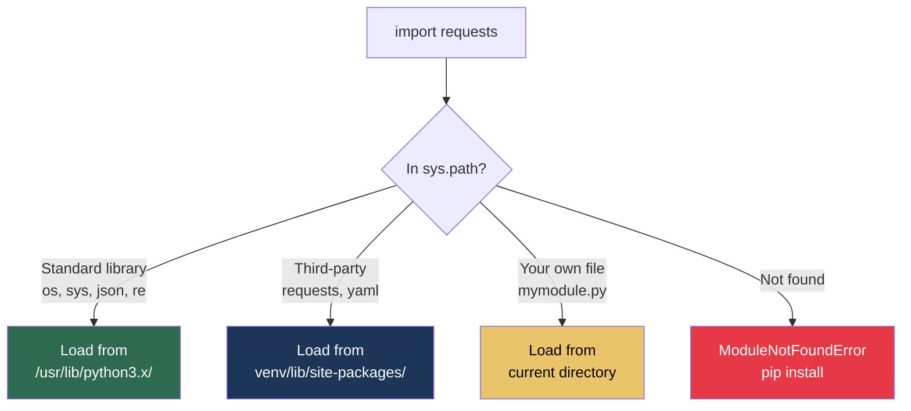
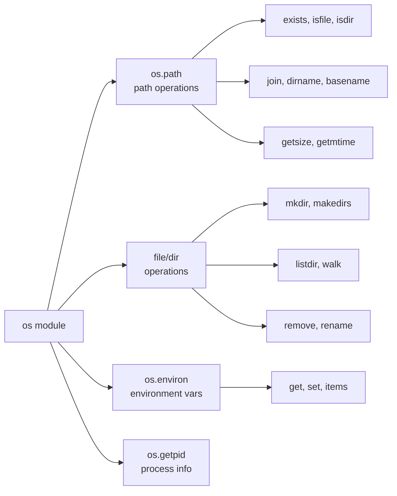

# 9.1.2 File I/O, Modules, and Libraries: Working with Files and Configurations

**Backlinks:** [9.1.1 — Python Basics](./9.1.1_Python_Basics_Data_Types_and_Control_Flow.md) | [Module 1 — Linux](../../1-Linux/) (filesystem paths, `/etc/`, `/var/log/`) | [Module 5 — Kubernetes](../../5-Kubernetes/) (ConfigMaps and Secrets are YAML/JSON files parsed here)

**Next note:** [9.1.3 — Collections, Type Hints, and f-strings](./9.1.3_Collections_Type_Hints_and_Fstrings.md)

---

## Why File I/O Matters

Platform engineers constantly work with files:
- Reading configuration files (YAML, JSON, INI)
- Writing logs
- Parsing CSV/TSV data
- Modifying system files

Python's file handling is both powerful and intuitive. This note covers file operations and essential modules.

---

## Part 0: How Python Modules Work

> **Beginner explanation:** A **module** is just a `.py` file. When you write `import os`, Python finds the file `os.py` (or a compiled equivalent) in its `sys.path` and loads it. **Standard library modules** come with Python — no `pip install` needed. **Third-party modules** (like `pyyaml`, `requests`) must be installed with `pip`.



| Module | Type | Install? | Purpose |
|--------|------|----------|---------|
| `os` | Standard | No | OS interface |
| `sys` | Standard | No | System parameters |
| `json` | Standard | No | JSON parsing |
| `re` | Standard | No | Regex |
| `shutil` | Standard | No | File operations |
| `datetime` | Standard | No | Date/time |
| `yaml` | Third-party | `pip install pyyaml` | YAML parsing |
| `requests` | Third-party | `pip install requests` | HTTP clients |
| `pytest` | Third-party | `pip install pytest` | Testing |

---

## Part 1: Reading and Writing Files

### Opening Files with `open()`

```python
# Open file for reading (default mode)
file = open('data.txt', 'r')
content = file.read()
file.close()  # MUST close, or file stays locked and buffer isn't flushed

# ✅ Better: context manager — closes automatically, even if exception occurs
with open('data.txt', 'r') as file:
    content = file.read()
# File is closed here automatically
```

> **Why use `with open()`?** If an exception happens inside the `with` block, Python still closes the file. Without `with`, an exception before `file.close()` would leave the file open, wasting OS resources and potentially causing data loss.

### File Modes

| Mode | Read | Write | Create | Truncate | Notes |
|------|------|-------|--------|----------|-------|
| `'r'` | ✅ | ❌ | ❌ | ❌ | Default. `FileNotFoundError` if missing |
| `'w'` | ❌ | ✅ | ✅ | ✅ | Creates or **overwrites** |
| `'a'` | ❌ | ✅ | ✅ | ❌ | Append to end |
| `'x'` | ❌ | ✅ | ✅ | — | Exclusive: `FileExistsError` if exists |
| `'b'` | — | — | — | — | Binary mode suffix: `'rb'`, `'wb'` |
| `'+'` | — | — | — | — | Read+write: `'r+'`, `'w+'` |

### Reading Files

```python
# Read entire file as one string — fine for small files
with open('config.txt', 'r') as f:
    content = f.read()
    print(content)

# ✅ Read line by line — memory-efficient for large files (1 line at a time)
with open('large.log', 'r') as f:
    for line in f:
        print(line.strip())  # strip() removes leading/trailing whitespace + \n

# Read all lines into a list at once
with open('data.txt', 'r') as f:
    lines = f.readlines()        # ['line1\n', 'line2\n', ...]
    for line in lines:
        print(line.strip())

# Read specific number of characters (useful for headers)
with open('file.txt', 'r') as f:
    first_100 = f.read(100)
```

> **Large file best practice:** For log files (often GB+), always iterate `for line in f:` instead of `f.read()`. This reads one line at a time, keeping memory near zero regardless of file size. We use this pattern in the log parser later.

### Writing Files

```python
# Write string (creates or overwrites)
with open('output.txt', 'w') as f:
    f.write("Hello, World!\n")
    f.write("Second line\n")

# Write list of lines at once
lines = ["Line 1\n", "Line 2\n", "Line 3\n"]
with open('output.txt', 'w') as f:
    f.writelines(lines)

# Append to existing file (used for log files)
with open('log.txt', 'a') as f:
    f.write("New log entry\n")
```

### Handling File Errors

```python
try:
    with open('nonexistent.txt', 'r') as f:
        content = f.read()
except FileNotFoundError:
    print("File not found!")
except PermissionError:
    print("Permission denied!")
except IOError as e:
    print(f"I/O error: {e}")
```

---

## Part 2: The `os` Module — Operating System Interface



### File and Directory Operations

```python
import os

# Current working directory
cwd = os.getcwd()
print(f"Current directory: {cwd}")

# Change directory
os.chdir('/tmp')

# List directory contents
files = os.listdir('/var/log')
print(files[:5])  # First 5 files

# Create directory
os.mkdir('new_dir')
os.makedirs('parent/child/grandchild', exist_ok=True)  # Creates all intermediate dirs

# Remove directory
os.rmdir('empty_dir')          # Only empty directories
import shutil
shutil.rmtree('non_empty_dir') # Remove directory and ALL contents (no recycle bin!)

# Check if path exists
if os.path.exists('/etc/passwd'):
    print("passwd exists")

# Type checks
print(os.path.isfile('/etc/passwd'))  # True
print(os.path.isdir('/etc'))          # True

# File metadata
size  = os.path.getsize('/etc/passwd')           # size in bytes
import time
mtime = os.path.getmtime('/etc/passwd')          # modification time (float)
print(f"Modified: {time.ctime(mtime)}")
```

### Walk Directory Trees

```python
import os

# os.walk() yields (root, dirs, files) for every directory recursively
# This is how Python traverses a directory tree
for root, dirs, files in os.walk('/var/log'):
    # Skip hidden directories
    dirs[:] = [d for d in dirs if not d.startswith('.')]

    for file in files:
        full_path = os.path.join(root, file)
        print(full_path)

# Example: find all .log files older than 7 days
import time

seven_days_ago = time.time() - (7 * 24 * 3600)
for root, dirs, files in os.walk('/var/log'):
    for f in files:
        if f.endswith('.log'):
            path = os.path.join(root, f)
            if os.path.getmtime(path) < seven_days_ago:
                print(f"Old log: {path}")
```

### Path Manipulation

```python
import os

# ✅ Always use os.path.join() — never string concatenation for paths
path = os.path.join('var', 'log', 'nginx', 'access.log')
# var/log/nginx/access.log  (uses / on Linux, \ on Windows)

# Split path components
dir_name  = os.path.dirname('/var/log/nginx/access.log')   # /var/log/nginx
base_name = os.path.basename('/var/log/nginx/access.log')  # access.log

# Split extension
name, ext = os.path.splitext('archive.tar.gz')
# name='archive.tar', ext='.gz'  (only splits the LAST extension)

# Absolute path and user home
abs_path = os.path.abspath('script.py')          # /current/dir/script.py
home     = os.path.expanduser('~/.bashrc')        # /home/alice/.bashrc
```

### Environment Variables

```python
import os

# ✅ Safe way — returns None (or default) if not set
db_host = os.environ.get('DB_HOST', 'localhost')
db_port = os.environ.get('DB_PORT', '5432')

# Set environment variable (affects current process ONLY)
os.environ['APP_MODE'] = 'production'

# Subprocess will inherit os.environ
import subprocess
subprocess.run(['python', 'child.py'])  # child sees APP_MODE=production

# Check if variable exists
if 'PATH' in os.environ:
    print(os.environ['PATH'])
```

---

## Part 3: The `sys` Module — System-Specific Parameters

```python
import sys

# Command-line arguments
# Running: python script.py --port 8080 --debug
print(f"Script: {sys.argv[0]}")    # script.py
print(f"Args: {sys.argv[1:]}")     # ['--port', '8080', '--debug']

# Exit with code
sys.exit(0)   # Success
sys.exit(1)   # General error
sys.exit(2)   # Usage/argument error

# Python version info
print(f"Python {sys.version}")
if sys.version_info < (3, 8):
    print("Python 3.8+ required")
    sys.exit(1)

# Stdout/stderr — write directly
sys.stdout.write("to stdout\n")
sys.stderr.write("to stderr\n")

# Module search path
for path in sys.path:
    print(path)

sys.path.append('/my/custom/path')  # Add custom module directory
```

---

## Part 4: The `shutil` Module — High-Level File Operations

```python
import shutil

# Copy file (shutil.copy2 preserves metadata: timestamps, permissions)
shutil.copy('source.txt', 'destination.txt')    # copy content only
shutil.copy2('source.txt', 'dest.txt')          # copy content + metadata

# Copy entire directory tree
shutil.copytree('src_dir', 'dst_dir')           # dst_dir must NOT exist
shutil.copytree('src_dir', 'dst_dir', dirs_exist_ok=True)  # Python 3.8+

# Move file/directory (rename if same filesystem, else copy+delete)
shutil.move('old_location.txt', 'new_location.txt')

# Remove directory and ALL contents (no confirmation!)
shutil.rmtree('temp_dir')

# Disk usage stats
usage = shutil.disk_usage('/')
print(f"Total: {usage.total / (1024**3):.1f} GB")
print(f"Used:  {usage.used  / (1024**3):.1f} GB")
print(f"Free:  {usage.free  / (1024**3):.1f} GB")
print(f"Used%: {usage.used / usage.total * 100:.1f}%")

# Find command on PATH (like `which` in bash)
nginx_path = shutil.which('nginx')
print(f"nginx at: {nginx_path}")   # /usr/sbin/nginx or None if not found
```

---

## Part 5: Working with Config Files

### JSON

```python
import json

# Write JSON to file
data = {
    "name": "Alice",
    "age": 30,
    "email": "alice@example.com",
    "is_active": True
}

with open('user.json', 'w') as f:
    json.dump(data, f, indent=2)   # indent=2 for human-readable output

# Read JSON from file
with open('user.json', 'r') as f:
    loaded = json.load(f)
    print(loaded['name'])          # Alice

# Parse JSON string (e.g., from subprocess output or API response)
json_string = '{"name": "Bob", "age": 25}'
parsed = json.loads(json_string)   # .loads() = load from String
print(parsed['name'])              # Bob

# Convert Python object to JSON string
json_str = json.dumps(data, indent=2)  # .dumps() = dump to String
```

> **`json.load()` vs `json.loads()`:**
> - `json.load(f)` — reads from an open **file object** (streams)
> - `json.loads(s)` — parses from a **string** (the `s` stands for string)
> Same pattern: `json.dump()` writes to file, `json.dumps()` returns a string.

### YAML — `pip install pyyaml`

```python
import yaml

# YAML config (nested structure matches Kubernetes manifests exactly)
config = {
    'server': {
        'host': 'localhost',
        'port': 8080
    },
    'database': {
        'host': 'postgres.example.com',
        'port': 5432,
        'name': 'myapp'
    }
}

# Write YAML to file
with open('config.yaml', 'w') as f:
    yaml.dump(config, f, default_flow_style=False)  # False = block style

# Read YAML from file
with open('config.yaml', 'r') as f:
    loaded = yaml.safe_load(f)     # ← ALWAYS use safe_load, never load()
    print(loaded['server']['host'])
```

> **`yaml.safe_load()` vs `yaml.load()`:** `yaml.load()` can execute arbitrary Python code embedded in YAML (a security vulnerability). `yaml.safe_load()` only parses basic data types (strings, ints, lists, dicts). **Always use `yaml.safe_load()`** when reading YAML you didn't write yourself — e.g., user-supplied Kubernetes manifests.

### INI/ConfigParser

```python
import configparser

config = configparser.ConfigParser()
config.read('config.ini')   # reads silently if file missing

# Access values — all returned as strings by default
db_host = config.get('database', 'host')           # 'localhost'
db_port = config.getint('database', 'port')        # 5432  ← auto-converts to int
debug   = config.getboolean('app', 'debug')        # True  ← 'true'/'false'/'yes'/'no'

# Write INI file
config['database'] = {'host': 'localhost', 'port': '5432'}
config['app']      = {'debug': 'true'}

with open('config.ini', 'w') as f:
    config.write(f)
```

Example `config.ini`:
```ini
[database]
host = localhost
port = 5432
name = myapp

[app]
debug = true
log_level = INFO
```

> **`getint()` / `getboolean()` / `getfloat()`:** These helper methods auto-convert the string values from INI files to Python types. Without them you'd need `int(config.get('database', 'port'))` everywhere.

---

## Part 6: The `datetime` Module

```python
from datetime import datetime, date, timedelta

# Current date and time
now = datetime.now()
print(f"Now:  {now}")
print(f"Date: {now.date()}")
print(f"Year: {now.year}, Month: {now.month}, Day: {now.day}")

# Format datetime as string
formatted = now.strftime("%Y-%m-%d %H:%M:%S")  # 2024-01-15 10:30:45
iso_format = now.isoformat()                    # 2024-01-15T10:30:45.123456

# Parse string to datetime
dt = datetime.strptime("2024-01-15 10:30:45", "%Y-%m-%d %H:%M:%S")

# Date arithmetic
tomorrow   = now + timedelta(days=1)
last_week  = now - timedelta(weeks=1)
next_hour  = now + timedelta(hours=1)

# Compare
if now > last_week:
    print("Now is later")

# Time since an event (useful for monitoring)
event_time = datetime(2024, 1, 15, 10, 0, 0)
age = now - event_time
print(f"Event was {age.days} days and {age.seconds // 3600} hours ago")
```

---

## Part 7: The `re` Module — Regular Expressions

```python
import re

# Search — find first match anywhere in string
text = "The IP address is 192.168.1.100"
match = re.search(r'\d+\.\d+\.\d+\.\d+', text)
if match:
    print(f"Found IP: {match.group()}")  # 192.168.1.100

# Findall — find ALL matches
log = "Error 404 at 10:00, Error 500 at 10:05"
errors = re.findall(r'Error \d+', log)
print(errors)  # ['Error 404', 'Error 500']

# Sub — replace pattern
text     = "User alice logged in"
redacted = re.sub(r'alice', 'REDACTED', text)
print(redacted)  # User REDACTED logged in

# Compile — reuse pattern for performance (compile once, match many)
ip_pattern = re.compile(r'\d{1,3}\.\d{1,3}\.\d{1,3}\.\d{1,3}')
matches    = ip_pattern.findall("IPs: 192.168.1.1 and 10.0.0.1")
print(matches)  # ['192.168.1.1', '10.0.0.1']

# Groups — capture parts of the match
match = re.match(r'(\d{4})-(\d{2})-(\d{2})', '2024-01-15')
if match:
    year, month, day = match.groups()
    print(f"Year: {year}, Month: {month}, Day: {day}")
```

### Common Regex Patterns for Platform Engineers

| Pattern | Matches | Example |
|---------|---------|---------|
| `\d{1,3}\.\d{1,3}\.\d{1,3}\.\d{1,3}` | IP address | `192.168.1.1` |
| `\w+@\w+\.\w+` | Email (basic) | `alice@example.com` |
| `\d{4}-\d{2}-\d{2}` | Date YYYY-MM-DD | `2024-01-15` |
| `\d{2}:\d{2}:\d{2}` | Time HH:MM:SS | `10:30:45` |
| `https?://\S+` | URL | `https://example.com/path` |
| `[0-9a-f]{7,40}` | Git SHA | `abc1234` or full SHA |
| `v\d+\.\d+\.\d+` | SemVer tag | `v1.2.3` |

---

## Part 8: Practical Example — Nginx Log Parser

```python
#!/usr/bin/env python3
import re
import sys
from collections import defaultdict

def parse_nginx_log(log_file):
    """Parse Nginx access log and extract statistics"""
    # Pattern matches: IP - - [timestamp] "REQUEST" STATUS SIZE
    pattern = r'(\d+\.\d+\.\d+\.\d+) - - \[(.*?)\] "(.*?)" (\d+) (\d+)'

    stats = {
        'total_requests': 0,
        'status_counts':  defaultdict(int),
        'ip_counts':      defaultdict(int),
        'error_requests': []
    }

    with open(log_file, 'r') as f:
        for line in f:          # Memory-efficient: one line at a time
            match = re.match(pattern, line)
            if match:
                ip, timestamp, request, status, size = match.groups()

                stats['total_requests'] += 1
                stats['status_counts'][status] += 1
                stats['ip_counts'][ip] += 1

                if status.startswith('4') or status.startswith('5'):
                    stats['error_requests'].append({
                        'ip':        ip,
                        'status':    status,
                        'request':   request,
                        'timestamp': timestamp
                    })

    return stats

def print_stats(stats):
    print(f"Total requests: {stats['total_requests']}")
    print("\nTop status codes:")
    for status, count in sorted(stats['status_counts'].items()):
        print(f"  {status}: {count}")

    print("\nTop 5 IPs:")
    top_ips = sorted(stats['ip_counts'].items(), key=lambda x: x[1], reverse=True)[:5]
    for ip, count in top_ips:
        print(f"  {ip}: {count} requests")

    print(f"\nErrors: {len(stats['error_requests'])}")
    for err in stats['error_requests'][:3]:
        print(f"  {err['timestamp']} - {err['ip']} - {err['status']}")

if __name__ == "__main__":
    if len(sys.argv) != 2:
        print(f"Usage: {sys.argv[0]} <log_file>")
        sys.exit(1)

    stats = parse_nginx_log(sys.argv[1])
    print_stats(stats)
```

---

## Quick Task: File I/O Practice

1. Write a script that reads a file and counts the number of lines, words, and characters.
2. Write a script that parses a JSON config file and prints the values.
3. Write a function that finds all IP addresses in a log file using regex.
4. Write a script that backs up a directory using `shutil.copytree`.

> **Ready Solution:**
>
> ```python
> # Task 1
> def file_stats(filename):
>     with open(filename, 'r') as f:
>         content = f.read()
>     return content.count('\n'), len(content.split()), len(content)
>
> # Task 2
> import json
> with open('config.json', 'r') as f:
>     config = json.load(f)
>     for key, value in config.items():
>         print(f"{key}: {value}")
>
> # Task 3
> import re
> def find_ips(filename):
>     pattern = re.compile(r'\d{1,3}\.\d{1,3}\.\d{1,3}\.\d{1,3}')
>     ips = set()
>     with open(filename, 'r') as f:
>         for line in f:
>             ips.update(pattern.findall(line))
>     return list(ips)
>
> # Task 4
> import shutil
> from datetime import datetime
>
> def backup_dir(source, dest_parent):
>     timestamp = datetime.now().strftime("%Y%m%d_%H%M%S")
>     dest = f"{dest_parent}/{timestamp}"
>     shutil.copytree(source, dest)
>     print(f"Backed up {source} to {dest}")
> ```

---

## Summary Tables

### File Modes

| Mode | Read | Write | Create | Truncate |
|------|------|-------|--------|----------|
| `'r'` | ✅ | ❌ | ❌ | ❌ |
| `'w'` | ❌ | ✅ | ✅ | ✅ |
| `'a'` | ❌ | ✅ | ✅ | ❌ |
| `'x'` | ❌ | ✅ | ✅ (fail if exists) | — |

### Common Modules Quick Reference

| Module | Key Functions | Notes |
|--------|--------------|-------|
| `os` | `getcwd`, `listdir`, `walk`, `path.join`, `environ.get` | OS interface |
| `sys` | `argv`, `exit()`, `version_info` | System params |
| `shutil` | `copy2`, `copytree`, `move`, `rmtree`, `disk_usage`, `which` | High-level files |
| `json` | `load(f)`, `loads(s)`, `dump(d,f)`, `dumps(d)` | JSON parse/write |
| `yaml` | `safe_load(f)`, `dump(d,f)` | pip install pyyaml |
| `configparser` | `read()`, `get()`, `getint()`, `getboolean()` | INI files |
| `datetime` | `now()`, `strftime()`, `strptime()`, `timedelta` | Date/time ops |
| `re` | `search()`, `findall()`, `sub()`, `compile()`, `match()` | Regex |

### Path Operations

| Operation | `os.path` | Notes |
|-----------|-----------|-------|
| Join | `os.path.join(a, b, c)` | OS-safe separator |
| Directory | `os.path.dirname(path)` | Parent dir |
| Filename | `os.path.basename(path)` | Last component |
| Extension | `os.path.splitext(path)` | `(name, '.ext')` |
| Exists? | `os.path.exists(path)` | |
| Is file? | `os.path.isfile(path)` | |
| Is dir? | `os.path.isdir(path)` | |
| Size | `os.path.getsize(path)` | Bytes |

> **Note:** `pathlib.Path` is a more modern, object-oriented way to handle paths and is covered in detail in [9.2.2](../Subchapter_9.2/9.2.2_Arguments_Environment_and_Path_Handling.md).

---

**Next note (9.1.3)** covers Collections, Type Hints, and f-strings — advanced data structures and modern Python patterns.
