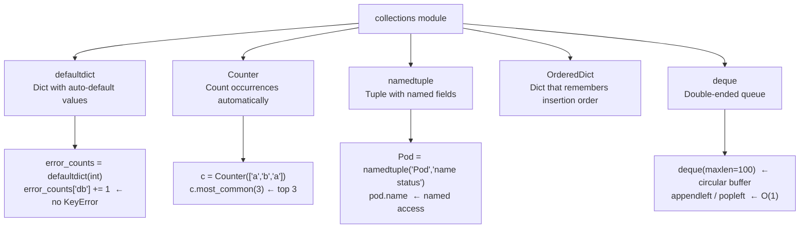

# 9.1.3 Collections, Type Hints, and f-strings Deep Dive

**Backlinks:** [9.1.1 — Python Basics](./9.1.1_Python_Basics_Data_Types_and_Control_Flow.md) | [9.1.2 — File I/O](./9.1.2_File_IO_Modules_and_Libraries.md) | [9.1.4 — Subchapter Review](./9.1.4_Subchapter_Review.md)

**Next note:** [9.1.4 — Subchapter 9.1 Review](./9.1.4_Subchapter_Review.md)

---

## Why This Note Exists

Notes 9.1.1 and 9.1.2 introduced the core language. This note fills three gaps that appear constantly in platform engineering code but weren't covered:

1. **`collections` module** — `defaultdict`, `Counter`, `namedtuple`, `OrderedDict` — used in real scripts but never explained
2. **Type hints** — modern Python codebases annotate function signatures; reading and writing them is expected in interviews and code reviews
3. **f-string formatting** — full reference for number formatting, alignment, padding — the difference between readable dashboards and unreadable output

---

## Part 1: The `collections` Module

The `collections` module provides specialized container types that fill common gaps in the built-in `dict`, `list`, and `tuple`.



### `defaultdict` — Auto-Initialize Missing Keys

> **Problem it solves:** With a regular dict, `d['key'] += 1` raises `KeyError` if `'key'` doesn't exist yet. You'd have to write `d['key'] = d.get('key', 0) + 1` every time. `defaultdict` eliminates this boilerplate.

```python
from collections import defaultdict

# defaultdict(int) → missing key returns 0
error_counts = defaultdict(int)
for line in log_lines:
    if 'ERROR' in line:
        error_type = parse_error_type(line)
        error_counts[error_type] += 1   # no KeyError, starts at 0
# error_counts = {'db': 5, 'network': 2, 'timeout': 8}

# defaultdict(list) → missing key returns []
pods_by_node = defaultdict(list)
for pod in pod_list:
    pods_by_node[pod['node']].append(pod['name'])
# pods_by_node = {'node-1': ['pod-a', 'pod-b'], 'node-2': ['pod-c']}

# defaultdict(dict) → missing key returns {}
config_by_env = defaultdict(dict)
config_by_env['prod']['db_host'] = 'prod-db.example.com'
config_by_env['dev']['db_host']  = 'localhost'

# Convert back to regular dict for JSON serialization
normal_dict = dict(error_counts)
```

### `Counter` — Count Occurrences Automatically

> **Problem it solves:** Counting how many times each item appears in a list or string is a very common task. `Counter` does it in one line and provides `most_common()` to rank results.

```python
from collections import Counter

# Count from a list
status_codes = ['200', '404', '200', '500', '200', '404']
c = Counter(status_codes)
print(c)                  # Counter({'200': 3, '404': 2, '500': 1})
print(c['200'])           # 3
print(c['999'])           # 0 (no KeyError for missing keys!)
print(c.most_common(2))   # [('200', 3), ('404', 2)] — top 2

# Count from a string
letter_counts = Counter("mississippi")
print(letter_counts.most_common(3))  # [('s', 4), ('i', 4), ('p', 2)]

# Real example: find most common error types
def top_errors(log_file, n=10):
    errors = []
    with open(log_file) as f:
        for line in f:
            if 'ERROR' in line:
                # Extract the error message (after "ERROR")
                parts = line.split('ERROR', 1)
                if len(parts) > 1:
                    errors.append(parts[1].strip()[:80])  # first 80 chars

    c = Counter(errors)
    for msg, count in c.most_common(n):
        print(f"{count:5d}  {msg}")

# Counter arithmetic
c1 = Counter({'a': 3, 'b': 2})
c2 = Counter({'b': 1, 'c': 5})
print(c1 + c2)  # Counter({'c': 5, 'a': 3, 'b': 3})
print(c1 - c2)  # Counter({'a': 3, 'b': 1})  ← only positive counts kept
```

### `namedtuple` — Tuple with Named Fields

> **Problem it solves:** Tuples like `(pod_name, namespace, status, restart_count)` are positional — `pod[3]` is unreadable. `namedtuple` lets you write `pod.restart_count` while keeping tuple immutability and performance.

```python
from collections import namedtuple

# Define a named tuple type
Pod  = namedtuple('Pod',  ['name', 'namespace', 'status', 'restarts'])
Node = namedtuple('Node', ['name', 'ip', 'cpu_pct', 'memory_pct'])

# Create instances
pod1 = Pod(name='web-abc', namespace='production', status='Running', restarts=0)
pod2 = Pod(name='db-xyz',  namespace='production', status='CrashLoopBackOff', restarts=15)

# Access by name (readable)
print(pod1.name)         # web-abc
print(pod2.restarts)     # 15
if pod2.restarts > 5:
    print(f"Pod {pod2.name} is crash-looping!")

# Still a tuple — can unpack
name, ns, status, restarts = pod1
print(status)            # Running

# Convert to dict (useful for JSON)
print(pod1._asdict())    # {'name': 'web-abc', 'namespace': 'production', ...}

# Update one field (returns new namedtuple — immutable)
pod3 = pod1._replace(restarts=1)
print(pod3.restarts)     # 1

# Practical: parse kubectl output into namedtuples
def parse_pods(kubectl_json):
    pods = []
    for item in kubectl_json['items']:
        pods.append(Pod(
            name      = item['metadata']['name'],
            namespace = item['metadata']['namespace'],
            status    = item['status']['phase'],
            restarts  = sum(
                c.get('restartCount', 0)
                for c in item['status'].get('containerStatuses', [])
            )
        ))
    return pods
```

### `deque` — Double-Ended Queue

> **Problem it solves:** `list.pop(0)` is O(n) — it shifts every element. `deque` provides O(1) appends and pops from both ends. Also supports `maxlen` for circular buffers (keep last N items).

```python
from collections import deque

# Circular buffer — keep last 100 log lines
recent_logs = deque(maxlen=100)
for line in all_lines:
    recent_logs.append(line)  # automatically drops oldest when full
# Now recent_logs has at most 100 items

# Use as a queue (FIFO)
task_queue = deque()
task_queue.append('task1')   # append to right
task_queue.append('task2')
task_queue.appendleft('urgent')  # prepend to left
next_task = task_queue.popleft() # pop from left → FIFO
print(next_task)  # urgent

# Use as a stack (LIFO)
stack = deque()
stack.append('a')
stack.append('b')
top = stack.pop()  # pop from right → LIFO
print(top)  # b
```

---

## Part 2: Type Hints — Modern Python Annotations

> **Why type hints matter for platform engineers:** You will encounter type-annotated code in every modern Python project. You need to read it fluently. In code reviews and interviews, adding type hints shows professional Python knowledge. They also enable IDE auto-complete and catch bugs before runtime.

> **Important:** Type hints are **optional** and **not enforced at runtime** by default. Python still runs if types are wrong. Type hints are checked by tools like `mypy`, `pyright`, or your IDE.

### Basic Type Hints

```python
# Variable annotations
name: str = "Alice"
age: int = 30
is_active: bool = True
score: float = 9.5
items: list = []        # less specific
items: list[str] = []   # more specific (Python 3.9+)

# Function annotations
def add(a: int, b: int) -> int:
    return a + b

def greet(name: str, loud: bool = False) -> str:
    msg = f"Hello, {name}!"
    return msg.upper() if loud else msg

def find_pod(name: str) -> dict | None:  # Python 3.10+ union syntax
    # returns dict or None
    pass
```

### `from typing import` — For Python 3.8 and Earlier

```python
from typing import List, Dict, Optional, Union, Tuple, Any

# Before Python 3.9 — use typing module
def get_pods(namespace: str) -> List[Dict[str, Any]]:
    pass

def find_pod(name: str) -> Optional[Dict]:    # Optional[X] = X | None
    pass

def process(value: Union[str, int]) -> str:   # Union[X, Y] = X | Y
    pass

def get_coords() -> Tuple[float, float]:      # fixed-size tuple
    return 1.0, 2.0
```

### Python 3.9+ Simplified Syntax

```python
# Python 3.9+ — no need to import from typing for basic types
def get_pods(namespace: str) -> list[dict[str, str]]:
    pass

def find_pod(name: str) -> dict | None:       # | instead of Union
    pass

def get_env(key: str, default: str | None = None) -> str | None:
    pass
```

### Common Type Hints for Platform Engineering

```python
import subprocess
from pathlib import Path

# Working with files
def read_config(path: str | Path) -> dict:
    pass

# Working with subprocess results
def run_kubectl(args: list[str]) -> tuple[bool, str, str]:
    # returns: (success, stdout, stderr)
    pass

# Working with environment variables
def load_env(prefix: str = '') -> dict[str, str]:
    pass

# Working with HTTP responses
def check_health(urls: list[str], timeout: int = 10) -> dict[str, bool]:
    pass

# Callable type hint (functions as arguments)
from typing import Callable
def retry(func: Callable, max_attempts: int = 3) -> Any:
    pass
```

### Type Checking with `mypy`

```bash
# Install mypy
pip install mypy

# Check a file
mypy script.py

# Check with strict mode
mypy --strict script.py

# Common output
# script.py:10: error: Argument 1 to "add" has incompatible type "str"; expected "int"
```

> **When to use type hints in platform engineering scripts:**
> - **Always annotate function signatures** — shows intent, helps IDE auto-complete
> - **Annotate complex data structures** — `dict[str, list[str]]` says more than `dict`
> - **Optional for local variables** — only add if it improves readability
> - **Run `mypy` in CI/CD** — catch type errors before runtime

---

## Part 3: f-string Complete Reference

f-strings (format strings, Python 3.6+) are the standard for string formatting. This section covers every format specifier you'll need in platform scripts.

### Format Specifier Syntax

```
f"{value:{fill}{align}{width}.{precision}{type}}"
```

```mermaid
flowchart LR
    F["f\"{cpu_pct:>8.1f}%\""]
    F --> ALIGN["> = right align\n< = left align\n^ = center"]
    F --> WIDTH["8 = minimum width\n(pad with spaces)"]
    F --> PREC[".1 = 1 decimal place"]
    F --> TYPE["f = float\nd = integer\ns = string\nx = hex\nb = binary"]
```

### Number Formatting

```python
n = 87654.321
pct = 87.6

# Decimals
f"{pct:.0f}"    # "88"      — 0 decimal places (rounds)
f"{pct:.1f}"    # "87.6"    — 1 decimal place
f"{pct:.3f}"    # "87.600"  — 3 decimal places

# Thousands separator
f"{n:,.0f}"     # "87,654"  — comma separator, no decimals
f"{n:,.2f}"     # "87,654.32"

# Width and alignment
f"{pct:8.1f}"   # "    87.6" — right-align in 8 chars
f"{pct:<8.1f}"  # "87.6    " — left-align
f"{pct:^8.1f}"  # "  87.6  " — center

# Custom fill character
f"{pct:*>10.1f}"  # "****87.6" — fill with *

# Signs
f"{n:+.1f}"     # "+87654.3"  — always show sign
f"{-n:+.1f}"    # "-87654.3"

# Integers
port = 8080
f"{port:05d}"   # "08080"    — zero-pad to 5 digits
f"{port:>10d}"  # "      8080" — right-align in 10

# Hex, binary, octal
n = 255
f"{n:x}"        # "ff"    — lowercase hex
f"{n:X}"        # "FF"    — uppercase hex
f"{n:#x}"       # "0xff"  — with 0x prefix
f"{n:b}"        # "11111111" — binary
f"{n:o}"        # "377"   — octal

# Scientific notation
big = 1_000_000_000
f"{big:.2e}"    # "1.00e+09"
f"{big:.2E}"    # "1.00E+09"
```

### String Formatting

```python
service = "nginx"
status  = "running"

# Alignment
f"{service:<15}"   # "nginx          " — left-align, 15 wide
f"{service:>15}"   # "          nginx" — right-align
f"{service:^15}"   # "     nginx     " — center

# String truncation (precision for strings)
long_msg = "This is a very long message"
f"{long_msg:.10}"  # "This is a " — truncate to 10 chars

# Padding with character
f"{service:-<15}"  # "nginx----------" — fill with -
f"{service:=>15}"  # "==========nginx"

# Production-quality table output
def print_pod_table(pods: list[dict]) -> None:
    header = f"{'NAME':<30} {'NAMESPACE':<15} {'STATUS':<20} {'RESTARTS':>8}"
    print(header)
    print("-" * len(header))
    for pod in pods:
        print(
            f"{pod['name']:<30} "
            f"{pod['namespace']:<15} "
            f"{pod['status']:<20} "
            f"{pod['restarts']:>8}"
        )
```

### Date and Time Formatting

```python
from datetime import datetime

now = datetime.now()

f"{now:%Y-%m-%d}"           # 2024-01-15
f"{now:%Y-%m-%d %H:%M:%S}"  # 2024-01-15 10:30:45
f"{now:%d/%m/%Y}"           # 15/01/2024
f"{now:%I:%M %p}"           # 10:30 AM
f"{now:%Y%m%d_%H%M%S}"      # 20240115_103045  ← good for filenames

# In f-string directly
print(f"Started at: {datetime.now():%Y-%m-%d %H:%M:%S}")
```

### f-string Expressions and Debugging

```python
x = 42
y = [1, 2, 3]

# Any expression works inside {}
f"Sum: {sum(y)}"               # Sum: 6
f"Max: {max(y)}"               # Max: 3
f"Length: {len(y)}"            # Length: 3
f"Upper: {'hello'.upper()}"    # Upper: HELLO

# Debugging with = (Python 3.8+)  — prints name AND value
f"{x=}"                        # "x=42"
f"{y=}"                        # "y=[1, 2, 3]"
f"{sum(y)=}"                   # "sum(y)=6"

# Multi-line f-string
report = (
    f"=== Health Report ===\n"
    f"CPU:     {cpu:.1f}%\n"
    f"Memory:  {mem:.1f}%\n"
    f"Disk:    {disk:.1f}%\n"
    f"Status:  {'OK' if cpu < 90 else 'WARN'}"
)
```

---

## Part 4: Practical Example — Production Health Dashboard

Combining `Counter`, `namedtuple`, and f-string formatting into a real script:

```python
#!/usr/bin/env python3
"""
pod_dashboard.py — Display Kubernetes pod health summary
"""

import json
import subprocess
import sys
from collections import Counter, defaultdict, namedtuple
from typing import Optional

# Type definition with namedtuple
PodInfo = namedtuple('PodInfo', ['name', 'namespace', 'status', 'node', 'restarts'])

def get_all_pods(namespace: str = '--all-namespaces') -> list[PodInfo]:
    """Fetch all pods using kubectl and return as PodInfo list"""
    if namespace == '--all-namespaces':
        cmd = ['kubectl', 'get', 'pods', '--all-namespaces', '-o', 'json']
    else:
        cmd = ['kubectl', 'get', 'pods', '-n', namespace, '-o', 'json']

    result = subprocess.run(cmd, capture_output=True, text=True)
    if result.returncode != 0:
        print(f"kubectl failed: {result.stderr}", file=sys.stderr)
        return []

    data = json.loads(result.stdout)
    pods = []

    for item in data.get('items', []):
        restarts = sum(
            c.get('restartCount', 0)
            for c in item['status'].get('containerStatuses', [])
        )
        pods.append(PodInfo(
            name      = item['metadata']['name'],
            namespace = item['metadata']['namespace'],
            status    = item['status'].get('phase', 'Unknown'),
            node      = item['spec'].get('nodeName', 'unscheduled'),
            restarts  = restarts
        ))

    return pods

def print_dashboard(pods: list[PodInfo]) -> None:
    """Print formatted dashboard"""
    status_counts  = Counter(p.status for p in pods)
    pods_per_node  = Counter(p.node   for p in pods)
    crashers       = [p for p in pods if p.restarts > 5]

    # Header
    print(f"\n{'='*60}")
    print(f"{'POD HEALTH DASHBOARD':^60}")
    print(f"{'='*60}")
    print(f"Total pods: {len(pods)}")

    # Status summary
    print(f"\n{'STATUS SUMMARY':}")
    print(f"  {'Status':<20} {'Count':>6}")
    print(f"  {'-'*27}")
    for status, count in status_counts.most_common():
        marker = '✅' if status == 'Running' else '⚠️ '
        print(f"  {marker} {status:<18} {count:>6}")

    # Node distribution
    print(f"\n{'NODE DISTRIBUTION':}")
    print(f"  {'Node':<30} {'Pods':>6}")
    print(f"  {'-'*37}")
    for node, count in pods_per_node.most_common():
        bar = '█' * min(count, 20)
        print(f"  {node:<30} {count:>4}  {bar}")

    # Crash-looping pods
    if crashers:
        print(f"\n{'⚠️  HIGH RESTART PODS':}")
        print(f"  {'Name':<35} {'NS':<15} {'Restarts':>8}")
        print(f"  {'-'*60}")
        for p in sorted(crashers, key=lambda x: x.restarts, reverse=True):
            print(f"  {p.name:<35} {p.namespace:<15} {p.restarts:>8}")
    else:
        print(f"\n✅ No pods with excessive restarts")

    print(f"{'='*60}\n")

if __name__ == '__main__':
    ns = sys.argv[1] if len(sys.argv) > 1 else '--all-namespaces'
    pods = get_all_pods(ns)
    if pods:
        print_dashboard(pods)
    else:
        print("No pods found or kubectl error")
        sys.exit(1)
```

---

## Summary Tables

### `collections` Module

| Class | Typical Usage | Key Methods |
|-------|--------------|-------------|
| `defaultdict(int)` | Count occurrences without init | `d[key] += 1` — no KeyError |
| `defaultdict(list)` | Group items by key | `d[key].append(item)` |
| `Counter(iterable)` | Count and rank | `.most_common(n)`, `+=`, `-=` |
| `namedtuple('T', fields)` | Typed tuples | `.name`, `._asdict()`, `._replace()` |
| `deque(maxlen=n)` | Circular buffer / queue | `.append()`, `.popleft()`, `.appendleft()` |

### Type Hint Quick Reference

| Type | Python 3.9+ | Python 3.8 (typing) |
|------|-------------|---------------------|
| String | `str` | `str` |
| Integer | `int` | `int` |
| List of str | `list[str]` | `List[str]` |
| Dict str→int | `dict[str, int]` | `Dict[str, int]` |
| Optional str | `str \| None` | `Optional[str]` |
| Either type | `str \| int` | `Union[str, int]` |
| Any type | `Any` (import) | `Any` (from typing) |
| Callable | `Callable` (import) | `Callable` (from typing) |

### f-string Format Specifiers

| Specifier | Meaning | Example Output |
|-----------|---------|---------------|
| `:.1f` | 1 decimal place | `87.6` |
| `:,.0f` | Comma + 0 decimals | `87,654` |
| `:05d` | Zero-pad int to 5 | `08080` |
| `:<15` | Left-align width 15 | `nginx          ` |
| `:>15` | Right-align width 15 | `         nginx` |
| `:^15` | Center width 15 | `     nginx     ` |
| `:-<15` | Left-align, fill `-` | `nginx----------` |
| `:.2e` | Scientific notation | `1.00e+09` |
| `:#x` | Hex with prefix | `0xff` |
| `:%Y-%m-%d` | Date format | `2024-01-15` |
| `{x=}` | Debug: name=value | `x=42` |

---

**End of Subchapter 9.1**

You now have the complete Python foundation: basics, file I/O, modules, the full `collections` toolkit, type hints, and production-quality f-string formatting.

**Next:** [9.2.1 — Subprocess and Running Shell Commands](../Subchapter_9.2/9.2.1_Subprocess_and_Running_Shell_Commands.md) — where Python reaches back into the Linux tools you already know from Module 1, 3, 4, and 5.
