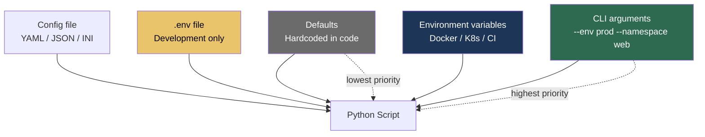

# 9.2.2 Arguments, Environment, and Path Handling: Building Professional CLI Tools

**Backlinks:** [9.2.1 — Subprocess and Running Shell Commands](./9.2.1_Subprocess_and_Running_Shell_Commands.md) | [Module 1 — Linux](../../1-Linux/) (env vars: `export`, `$VAR`) | [Module 3 — Shell Scripting](../../3-Shell-Scripting/) (Bash `$1`, `$2` positional arguments)

**Next note:** [9.2.3 — Advanced subprocess, shlex, and dotenv](./9.2.3_Advanced_Subprocess_shlex_and_dotenv.md)

---

## Why This Matters

Professional Python scripts need to:
- Accept command-line arguments (like `--help`, `--verbose`, `--namespace`)
- Read configuration from environment variables (twelve-factor app pattern)
- Load `.env` files in development
- Handle file paths across different operating systems safely

This note covers `argparse`, environment variables, `python-dotenv`, and `pathlib`.

---

## Part 0: How Configuration Reaches a Script



> **Priority rule (most platforms follow this):** CLI args > env vars > config file > defaults. Each layer overrides the one below it. This is the [twelve-factor app](https://12factor.net/) pattern used by Docker, Kubernetes, and Heroku.

---

## Part 1: `argparse` — Professional Command-Line Arguments

> **vs Bash `$1 $2`:** In Bash, `$1` is the first argument. There's no automatic `--help`, no type conversion, no default values. `argparse` generates all of that automatically.

### Basic Argument Parsing

```python
import argparse

parser = argparse.ArgumentParser(
    description='Deploy application to Kubernetes',
    # ArgumentDefaultsHelpFormatter automatically shows defaults in --help
    formatter_class=argparse.ArgumentDefaultsHelpFormatter
)

# Positional argument (required, no --flag)
parser.add_argument('environment', help='Target environment')

# Optional arguments (start with --)
parser.add_argument('-n', '--namespace',  default='default',   help='Kubernetes namespace')
parser.add_argument('-v', '--verbose',    action='store_true', help='Enable verbose output')
parser.add_argument('-o', '--output',     help='Output file')
parser.add_argument('--replicas',         type=int, default=3,  help='Replica count')
parser.add_argument('--mode',             choices=['fast', 'slow', 'auto'], default='auto')

args = parser.parse_args()

# Use arguments
print(f"Deploying to {args.environment} in namespace {args.namespace}")
if args.verbose:
    print("Verbose mode enabled")
```

Running the script:
```bash
python deploy.py production --namespace web -v --replicas 5
# Deploying to production in namespace web
# Verbose mode enabled

python deploy.py --help
# usage: deploy.py [-h] [-n NAMESPACE] [-v] [-o OUTPUT] [--replicas REPLICAS]
#                  [--mode {fast,slow,auto}]
#                  environment
# ...
# defaults are shown automatically (ArgumentDefaultsHelpFormatter)
```

### Argument Types and Validations

```python
import argparse
from pathlib import Path

parser = argparse.ArgumentParser()

# Type conversion
parser.add_argument('--port',      type=int,   default=8080)
parser.add_argument('--timeout',   type=float, default=30.0)

# nargs — number of arguments
parser.add_argument('--files',     nargs='+',   help='One or more files')   # 1+
parser.add_argument('--tags',      nargs='*',   help='Zero or more tags')   # 0+
parser.add_argument('--coords',    nargs=2,     type=float, help='x y')     # exactly 2
parser.add_argument('--config',    nargs='?',   help='Optional config')     # 0 or 1

# Required optional argument (oxymoron but common)
parser.add_argument('--host',  required=True, help='Database host')

# Custom type — use a function that converts or raises ValueError
def port_number(value: str) -> int:
    port = int(value)
    if not (1 <= port <= 65535):
        raise argparse.ArgumentTypeError(f"Port must be 1-65535, got {port}")
    return port

parser.add_argument('--port', type=port_number)

# Mutually exclusive group (only one can be provided)
group = parser.add_mutually_exclusive_group()
group.add_argument('-v', '--verbose', action='store_true')
group.add_argument('-q', '--quiet',   action='store_true')

args = parser.parse_args()
```

### Action Types

| Action | Effect | Example |
|--------|--------|---------|
| `store` (default) | Store the value | `--name Alice` → `args.name = 'Alice'` |
| `store_true` | Store `True` if flag present | `--verbose` → `args.verbose = True` |
| `store_false` | Store `False` if flag present | `--no-debug` → `args.debug = False` |
| `append` | Append to list | `--file a --file b` → `['a', 'b']` |
| `count` | Count occurrences | `-vvv` → `args.verbose = 3` |
| `version` | Print version and exit | `--version` |

```python
import argparse

parser = argparse.ArgumentParser()

# Verbosity level (count)
parser.add_argument('-v', '--verbose', action='count', default=0)
# -v → 1, -vv → 2, -vvv → 3

# Multiple files (append)
parser.add_argument('--file', action='append', dest='files')
# --file a.txt --file b.txt → ['a.txt', 'b.txt']

# Version
parser.add_argument('--version', action='version', version='%(prog)s 1.0.0')

args = parser.parse_args()

if args.verbose >= 2:
    print("Debug level logging")
elif args.verbose == 1:
    print("Info level logging")
```

### Custom Error Messages

```python
import argparse
import sys

parser = argparse.ArgumentParser()
parser.add_argument('--env', choices=['dev', 'staging', 'prod'])

args = parser.parse_args()

# Manually trigger argparse error (prints help + exits with code 2)
if args.env == 'prod' and not os.environ.get('PROD_CONFIRMED'):
    parser.error("--env prod requires PROD_CONFIRMED env var to be set")

# parser.exit(status, message) — exit with custom code
parser.exit(0, "Dry run complete\n")
```

### Subcommands (Like `git push`, `kubectl get`)

```python
import argparse

parser = argparse.ArgumentParser(description='Platform tool')
subparsers = parser.add_subparsers(dest='command', metavar='COMMAND')
subparsers.required = True   # error if no command given

# deploy command
deploy_p = subparsers.add_parser('deploy', help='Deploy to Kubernetes')
deploy_p.add_argument('--env',        required=True, choices=['dev', 'staging', 'prod'])
deploy_p.add_argument('--image',      required=True, help='Docker image:tag')
deploy_p.add_argument('-n', '--namespace', default='default')

# rollback command
rollback_p = subparsers.add_parser('rollback', help='Rollback a deployment')
rollback_p.add_argument('deployment', help='Deployment name')
rollback_p.add_argument('--revision', type=int, help='Target revision (default: previous)')

# status command
status_p = subparsers.add_parser('status', help='Show deployment status')
status_p.add_argument('deployment', nargs='?', help='Deployment name (all if omitted)')

args = parser.parse_args()

if args.command == 'deploy':
    print(f"Deploying {args.image} to {args.env}/{args.namespace}")
elif args.command == 'rollback':
    rev = f"to revision {args.revision}" if args.revision else "to previous"
    print(f"Rolling back {args.deployment} {rev}")
elif args.command == 'status':
    print(f"Status of {args.deployment or 'all deployments'}")
```

Usage:
```bash
python platform.py deploy --env prod --image myapp:v1.2.3 --namespace web
python platform.py rollback myapp --revision 3
python platform.py status
```

---

## Part 2: Environment Variables

### Reading Environment Variables

```python
import os

# ✅ Safe — returns None (or default) if not set
db_host = os.environ.get('DB_HOST', 'localhost')
db_port = int(os.environ.get('DB_PORT', '5432'))
debug   = os.environ.get('DEBUG', 'false').lower() in ('true', '1', 'yes')

# ❌ Unsafe — raises KeyError if not set
api_key = os.environ['API_KEY']

# Better: fail with helpful message
api_key = os.environ.get('API_KEY')
if not api_key:
    raise ValueError("API_KEY environment variable is required but not set")

# Check if variable exists
if 'KUBECONFIG' in os.environ:
    print(f"Kubeconfig: {os.environ['KUBECONFIG']}")
```

### Setting Environment Variables

```python
import os
import subprocess

# Set for current process only
os.environ['APP_MODE'] = 'production'

# All subprocesses inherit os.environ
subprocess.run(['python', 'child.py'])   # child sees APP_MODE=production

# ✅ Temporary env for one subprocess only
custom_env = {**os.environ, 'KUBECONFIG': '/path/to/prod-config', 'DEBUG': 'true'}
subprocess.run(['kubectl', 'get', 'pods'], env=custom_env)
```

### Loading `.env` Files with `python-dotenv`

> **Why `.env` files?** In development, you don't want to export 20 environment variables before running a script. A `.env` file lets you put them in one place. **Never commit `.env` to git** — it contains secrets.

```bash
# Install
pip install python-dotenv
```

```bash
# .env file (add to .gitignore!)
DB_HOST=localhost
DB_PORT=5432
DB_PASSWORD=my-secret-password
API_KEY=sk-12345
DEBUG=true
```

```python
from dotenv import load_dotenv
import os

# Load .env into os.environ (call early, before reading env vars)
load_dotenv()          # looks for .env in current directory
# or specify path:
load_dotenv('/path/to/.env')
# or override existing env vars (usually False):
load_dotenv(override=True)

# Now read as normal
db_host = os.environ.get('DB_HOST', 'localhost')
api_key  = os.environ.get('API_KEY')

# find_dotenv() — find .env by walking up the directory tree
from dotenv import load_dotenv, find_dotenv
load_dotenv(find_dotenv())   # finds .env in current dir or any parent
```

> **Production vs Development:** In production (Docker, Kubernetes), environment variables are injected by the container runtime — never load `.env` in production code. Use `load_dotenv()` only in development scripts. Kubernetes Secret → `envFrom` → `secretRef` is the production pattern (Module 5).

### Manual `.env` Loader (No Third-Party Library)

```python
import os

def load_env_file(filepath: str = '.env') -> None:
    """Load key=value pairs from .env file into os.environ"""
    try:
        with open(filepath, 'r') as f:
            for line in f:
                line = line.strip()
                if not line or line.startswith('#'):
                    continue
                if '=' in line:
                    key, _, value = line.partition('=')
                    key   = key.strip()
                    value = value.strip().strip('"').strip("'")  # remove quotes
                    os.environ.setdefault(key, value)   # don't override existing
    except FileNotFoundError:
        pass  # silently ignore missing .env in production
```

---

## Part 3: `pathlib` — Modern Path Handling

> **`pathlib` vs `os.path`:** `os.path` works but uses string operations and feels low-level. `pathlib.Path` is object-oriented — paths ARE objects with methods. `Path('/etc') / 'nginx' / 'nginx.conf'` is cleaner than `os.path.join('/etc', 'nginx', 'nginx.conf')`.

### Creating Paths

```python
from pathlib import Path

# Current and home directories
current = Path.cwd()          # /home/alice/project
home    = Path.home()         # /home/alice

# Create from string
config_path = Path('/etc/nginx/nginx.conf')
data_dir    = Path('./data')

# Join paths with / operator (cross-platform, safe)
log_path = Path('/var/log') / 'nginx' / 'access.log'
# /var/log/nginx/access.log

# From environment variable
kubeconfig = Path(os.environ.get('KUBECONFIG', '~/.kube/config')).expanduser()
# expanduser() resolves ~ to /home/alice
```

### Checking Path Properties

```python
from pathlib import Path

path = Path('/var/log/nginx/access.log')

# Existence checks
path.exists()       # True/False
path.is_file()      # True/False
path.is_dir()       # True/False
path.is_symlink()   # True/False

# Path components — very readable
path.name           # 'access.log'     ← filename only
path.stem           # 'access'         ← filename without extension
path.suffix         # '.log'           ← last extension
path.suffixes       # ['.log']         ← all extensions
path.parent         # Path('/var/log/nginx')
path.parents[0]     # Path('/var/log/nginx')
path.parents[1]     # Path('/var/log')
path.anchor         # '/'

# Resolve symlinks and relative parts
path.resolve()      # absolute path with symlinks resolved
path.is_absolute()  # True

# File metadata
stat = path.stat()
print(f"Size: {stat.st_size} bytes")
print(f"Modified: {stat.st_mtime}")

# Relative path between two paths
rel = Path('/var/log/nginx/access.log').relative_to('/var/log')
print(rel)   # nginx/access.log
```

### Reading and Writing Files

```python
from pathlib import Path

# Short-cut methods for simple read/write
content = Path('config.txt').read_text(encoding='utf-8')
data    = Path('image.jpg').read_bytes()

Path('output.txt').write_text('Hello, World!', encoding='utf-8')
Path('output.bin').write_bytes(b'\x00\x01\x02')

# For append — pathlib doesn't have append, use open()
with Path('log.txt').open('a') as f:
    f.write('New line\n')
```

### Directory Operations

```python
from pathlib import Path

# List directory (like os.listdir but returns Path objects)
for item in Path('/var/log').iterdir():
    print(item.name, 'DIR' if item.is_dir() else 'FILE')

# Glob — find files matching pattern (non-recursive)
for log_file in Path('/var/log').glob('*.log'):
    print(log_file)

# rglob — recursive glob (like find)
for py_file in Path('/home/alice').rglob('*.py'):
    print(py_file)

# Create directories
Path('parent/child').mkdir(parents=True, exist_ok=True)
# parents=True    → creates intermediate directories (like mkdir -p)
# exist_ok=True   → no error if already exists

# Remove file
Path('temp.txt').unlink(missing_ok=True)   # missing_ok: no error if not found

# Remove empty directory
Path('empty_dir').rmdir()

# Remove non-empty directory
import shutil
shutil.rmtree(Path('non_empty_dir'))
```

### Practical Examples

```python
from pathlib import Path
import shutil

def backup_configs(source_dir: str, backup_dir: str) -> int:
    """Back up all .conf files preserving directory structure"""
    source = Path(source_dir)
    backup = Path(backup_dir)
    backup.mkdir(parents=True, exist_ok=True)

    count = 0
    for conf_file in source.rglob('*.conf'):
        relative  = conf_file.relative_to(source)   # preserve structure
        dest      = backup / relative
        dest.parent.mkdir(parents=True, exist_ok=True)
        shutil.copy2(conf_file, dest)
        count += 1

    return count

def find_large_files(directory: str, min_mb: float = 100) -> list[dict]:
    """Find files larger than min_mb megabytes"""
    results = []
    for f in Path(directory).rglob('*'):
        if f.is_file():
            size_mb = f.stat().st_size / (1024 * 1024)
            if size_mb >= min_mb:
                results.append({'path': str(f), 'size_mb': round(size_mb, 2)})

    return sorted(results, key=lambda x: x['size_mb'], reverse=True)

def clean_old_files(directory: str, days: int = 7) -> int:
    """Delete files not accessed in last N days"""
    import time
    cutoff = time.time() - (days * 86400)
    deleted = 0
    for f in Path(directory).iterdir():
        if f.is_file() and f.stat().st_mtime < cutoff:
            f.unlink()
            deleted += 1
    return deleted
```

---

## Part 4: Complete CLI Tool Example

```python
#!/usr/bin/env python3
"""
k8s-deploy.py — Kubernetes deployment management tool
"""

import argparse
import logging
import subprocess
import sys
import os
from pathlib import Path
from typing import Optional

def setup_logging(verbose: bool = False) -> logging.Logger:
    level = logging.DEBUG if verbose else logging.INFO
    logging.basicConfig(
        level=level,
        format='%(asctime)s - %(levelname)s - %(message)s'
    )
    return logging.getLogger(__name__)

class K8sDeployTool:
    def __init__(self, namespace: str = 'default', kubeconfig: Optional[str] = None):
        self.namespace  = namespace
        self.kubeconfig = kubeconfig or os.environ.get('KUBECONFIG')
        self.logger     = logging.getLogger(self.__class__.__name__)

    def _kubectl(self, args: list[str]) -> tuple[bool, str, str]:
        """Run kubectl with namespace and kubeconfig"""
        cmd = ['kubectl', '-n', self.namespace]
        if self.kubeconfig:
            cmd += ['--kubeconfig', self.kubeconfig]
        cmd += args

        result = subprocess.run(cmd, capture_output=True, text=True, timeout=300)
        return result.returncode == 0, result.stdout, result.stderr

    def deploy(self, image: str, deployment: str, dry_run: bool = False) -> bool:
        """Deploy new image"""
        if dry_run:
            self.logger.info(f"[DRY RUN] Would set {deployment} image to {image}")
            return True

        self.logger.info(f"Setting {deployment} image to {image}")
        ok, out, err = self._kubectl(['set', 'image', f'deployment/{deployment}', f'app={image}'])
        if not ok:
            self.logger.error(f"set image failed: {err}")
            return False

        self.logger.info("Waiting for rollout...")
        ok, out, err = self._kubectl(['rollout', 'status', f'deployment/{deployment}', '--timeout=300s'])
        if ok:
            self.logger.info("Rollout complete!")
        else:
            self.logger.error(f"Rollout failed: {err}")
        return ok

    def rollback(self, deployment: str, revision: Optional[int] = None) -> bool:
        """Rollback deployment"""
        cmd = ['rollout', 'undo', f'deployment/{deployment}']
        if revision:
            cmd += [f'--to-revision={revision}']
        ok, out, err = self._kubectl(cmd)
        if ok:
            self.logger.info(f"Rolled back {deployment}")
        else:
            self.logger.error(f"Rollback failed: {err}")
        return ok

def parse_args() -> argparse.Namespace:
    parser = argparse.ArgumentParser(
        description='Kubernetes Deployment Tool',
        formatter_class=argparse.ArgumentDefaultsHelpFormatter
    )
    parser.add_argument('-n', '--namespace', default='default', help='Kubernetes namespace')
    parser.add_argument('-k', '--kubeconfig', help='Path to kubeconfig file')
    parser.add_argument('-v', '--verbose', action='store_true', help='Verbose output')

    sub = parser.add_subparsers(dest='command', metavar='COMMAND')
    sub.required = True

    # deploy
    dp = sub.add_parser('deploy', help='Deploy a new image version')
    dp.add_argument('deployment', help='Deployment name')
    dp.add_argument('--image',    required=True, help='New image:tag')
    dp.add_argument('--dry-run',  action='store_true', help='Print without executing')

    # rollback
    rp = sub.add_parser('rollback', help='Rollback a deployment')
    rp.add_argument('deployment', help='Deployment name')
    rp.add_argument('--revision', type=int, help='Target revision (default: previous)')

    return parser.parse_args()

def main() -> int:
    args   = parse_args()
    logger = setup_logging(args.verbose)
    tool   = K8sDeployTool(args.namespace, args.kubeconfig)

    if args.command == 'deploy':
        success = tool.deploy(args.image, args.deployment, args.dry_run)
    elif args.command == 'rollback':
        success = tool.rollback(args.deployment, getattr(args, 'revision', None))
    else:
        success = False

    return 0 if success else 1

if __name__ == '__main__':
    sys.exit(main())
```

---

## Quick Task: Build a CLI Tool

*Create a backup CLI tool.*

1. Accept `--source` and `--destination` arguments.
2. Accept `--verbose` flag.
3. Use `pathlib` to handle paths.
4. Copy files, preserving directory structure.

> **Ready Solution:**
>
> ```python
> #!/usr/bin/env python3
> import argparse, shutil, sys
> from pathlib import Path
>
> def backup(source: str, dest: str, verbose: bool = False) -> bool:
>     src, dst = Path(source), Path(dest)
>     if not src.exists():
>         print(f"Error: {source} does not exist", file=sys.stderr)
>         return False
>     dst.mkdir(parents=True, exist_ok=True)
>     count = 0
>     for f in src.rglob('*'):
>         if f.is_file():
>             rel  = f.relative_to(src)
>             out  = dst / rel
>             out.parent.mkdir(parents=True, exist_ok=True)
>             shutil.copy2(f, out)
>             count += 1
>             if verbose:
>                 print(f"  {f} → {out}")
>     print(f"Backed up {count} files from {source} to {dest}")
>     return True
>
> def main():
>     p = argparse.ArgumentParser(description='Backup files')
>     p.add_argument('--source',      required=True)
>     p.add_argument('--destination', required=True)
>     p.add_argument('--verbose',     action='store_true')
>     a = p.parse_args()
>     return 0 if backup(a.source, a.destination, a.verbose) else 1
>
> if __name__ == '__main__':
>     sys.exit(main())
> ```

---

## Summary Tables

### `argparse` Argument Types

| Type | Example | Value stored |
|------|---------|-------------|
| Positional | `add_argument('name')` | `args.name` |
| Optional string | `add_argument('-o', '--output')` | `args.output` |
| Boolean flag | `add_argument('-v', action='store_true')` | `args.v = True` |
| Integer | `add_argument('--port', type=int)` | `args.port = int(...)` |
| Choices | `add_argument('--env', choices=['dev','prod'])` | validates automatically |
| Multiple | `add_argument('--files', nargs='+')` | `args.files = [...]` |
| Required | `add_argument('--host', required=True)` | error if missing |
| Count | `add_argument('-v', action='count', default=0)` | `-vvv` → `3` |

### `pathlib` vs `os.path`

| Operation | `os.path` | `pathlib` |
|-----------|-----------|-----------|
| Join paths | `os.path.join(a, b)` | `Path(a) / b` |
| Get filename | `os.path.basename(p)` | `Path(p).name` |
| Get directory | `os.path.dirname(p)` | `Path(p).parent` |
| Split extension | `os.path.splitext(p)` | `Path(p).stem`, `.suffix` |
| Check exists | `os.path.exists(p)` | `Path(p).exists()` |
| Create dirs | `os.makedirs(p, exist_ok=True)` | `Path(p).mkdir(parents=True, exist_ok=True)` |
| List directory | `os.listdir(d)` | `Path(d).iterdir()` |
| Find by pattern | `glob.glob('**/*.py')` | `Path(d).rglob('*.py')` |
| Read text | `open(p).read()` | `Path(p).read_text()` |
| Write text | `open(p,'w').write()` | `Path(p).write_text()` |

### Environment Variables

| Operation | Code |
|-----------|------|
| Get with default | `os.environ.get('KEY', 'default')` |
| Get required | `os.environ.get('KEY') or raise ValueError(...)` |
| Check exists | `'KEY' in os.environ` |
| Set | `os.environ['KEY'] = 'value'` |
| Load `.env` file | `from dotenv import load_dotenv; load_dotenv()` |

---

**Next note (9.2.3)** covers Advanced subprocess patterns, shlex, and dotenv for real pipeline work.
