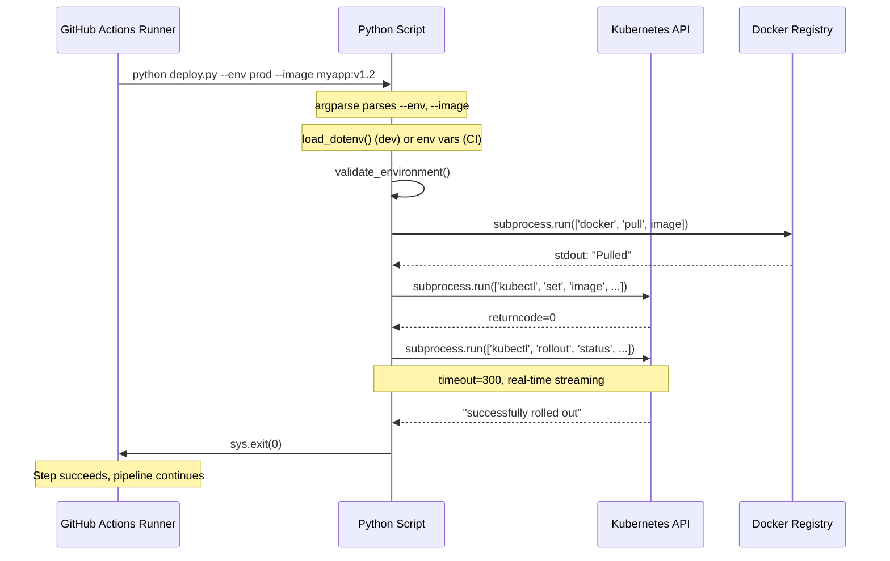
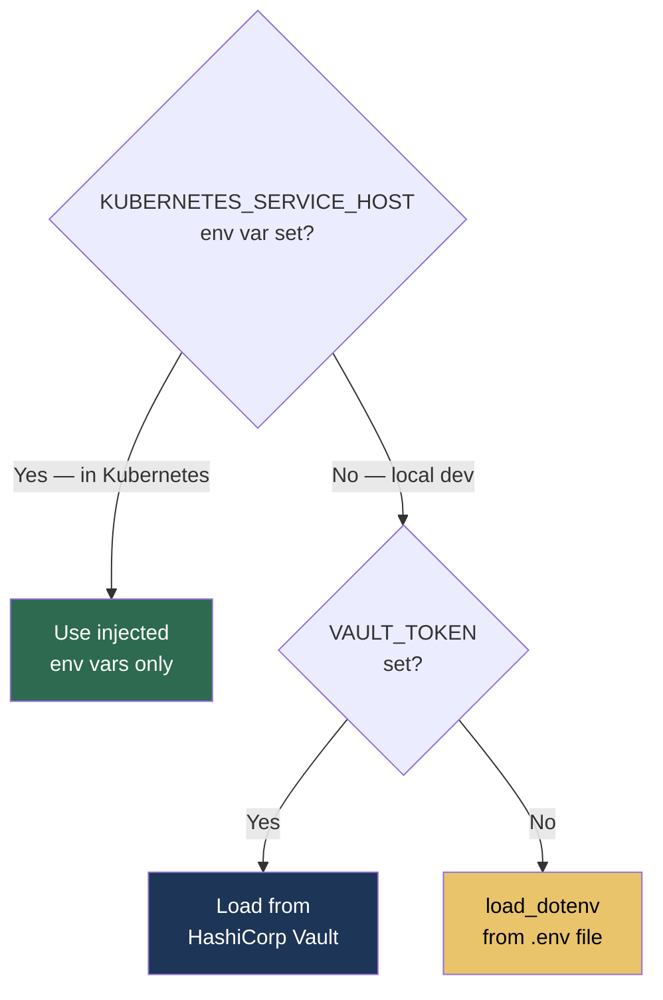

# 9.2.3 Advanced subprocess, shlex, and dotenv: Patterns for Real Pipelines

**Backlinks:** [9.2.1 — Subprocess Basics](./9.2.1_Subprocess_and_Running_Shell_Commands.md) | [9.2.2 — Arguments, Environment, and Path Handling](./9.2.2_Arguments_Environment_and_Path_Handling.md) | [9.2.4 — Subchapter Review](./9.2.4_Subchapter_Review.md) | [Module 8 — CI/CD](../../8-CICD/) (these patterns run inside GitHub Actions steps)

**Next note:** [9.2.4 — Subchapter 9.2 Review](./9.2.4_Subchapter_Review.md)

---

## Why This Note Exists

Notes 9.2.1–9.2.3 covered `subprocess.run()`, `argparse`, and `pathlib`. This note covers the *advanced* patterns used in real CI/CD pipelines and production automation:

- **`shlex` in depth** — tokenizing, joining, and quoting shell strings safely
- **`subprocess` process management** — killing hung processes, PID tracking, capturing to files
- **Parallel subprocess execution** — run multiple commands concurrently
- **`python-dotenv` advanced patterns** — multiple env files, vault integration stubs
- **Integration with Module 8** — how these patterns appear inside GitHub Actions Python steps

---

## Part 1: `shlex` — The Complete Guide

```mermaid
flowchart LR
    INPUT["\"kubectl get pods -n prod'\""]
    INPUT --> SHLEX[shlex.split]
    SHLEX --> LIST["['kubectl', 'get', 'pods', '-n', 'prod']"]
    LIST --> SUBPROCESS["subprocess.run(list)"]
    SUBPROCESS --> OS[OS kernel\nno shell\nno injection]

    INPUT2["['kubectl','get','pods']"]
    INPUT2 --> SHLEX2[shlex.join]
    SHLEX2 --> LOG["\"kubectl get pods\"\nfor display / logging"]

    style OS fill:#2d6a4f,color:#fff
    style LOG fill:#1d3557,color:#fff
```

### `shlex.split()` — String to Safe List

```python
import shlex

# Basic split — respects quotes
cmd = "kubectl get pods --field-selector 'status.phase=Running'"
print(shlex.split(cmd))
# ['kubectl', 'get', 'pods', '--field-selector', 'status.phase=Running']

# Without shlex.split — breaks on space inside quotes
print(cmd.split())
# ['kubectl', 'get', 'pods', '--field-selector', "'status.phase=Running'"]  ← wrong!

# Double quotes also work
cmd2 = 'docker run -e "MY_VAR=hello world" nginx'
print(shlex.split(cmd2))
# ['docker', 'run', '-e', 'MY_VAR=hello world', 'nginx']  ← correct!

# POSIX mode (default on Linux) — handles backslash escapes
cmd3 = r'grep -E "^ERROR|^WARN" /var/log/app.log'
args = shlex.split(cmd3)
subprocess.run(args, capture_output=True, text=True)

# Non-POSIX mode (useful on Windows)
args = shlex.split(cmd, posix=False)
```

### `shlex.join()` — List to Display String

```python
import shlex

# Safe for display/logging — properly quotes arguments with spaces
cmd = ['docker', 'run', '-v', '/path with spaces:/app', 'nginx']
print(shlex.join(cmd))
# docker run -v '/path with spaces:/app' nginx

# Use in logging — never log raw list for user-facing output
import logging
logger = logging.getLogger(__name__)
cmd = ['kubectl', 'apply', '-f', 'deploy.yaml']
logger.info(f"Running: {shlex.join(cmd)}")   # readable, paste-able
```

### `shlex.quote()` — Escape a Single Value

```python
import shlex

# Quote a single argument (useful when building display strings manually)
filename = "my file with spaces.txt"
print(shlex.quote(filename))   # 'my file with spaces.txt'

# Use in display (not for execution — use list for execution)
user = "alice; rm -rf /"
safe = shlex.quote(user)
print(f"Processing file for user: {safe}")
# Processing file for user: 'alice; rm -rf /'  ← injection escaped for display
```

### `shlex.Lexer` — Tokenize Complex Command Strings

```python
import shlex

# For parsing complex shell-like configuration strings
config_cmd = "app start --config /etc/app.conf --env 'key=val1 val2' --debug"
lexer = shlex.shlex(config_cmd, posix=True)
lexer.whitespace_split = True
tokens = list(lexer)
print(tokens)
# ['app', 'start', '--config', '/etc/app.conf', '--env', 'key=val1 val2', '--debug']
```

---

## Part 2: Advanced subprocess Patterns

### Capturing Output to a File Directly

```python
import subprocess

# Write output directly to a file (no loading into memory)
with open('build.log', 'w') as log_file:
    result = subprocess.run(
        ['docker', 'build', '-t', 'myapp:latest', '.'],
        stdout=log_file,    # write stdout to file
        stderr=log_file,    # write stderr to same file
    )

# Both stdout and stderr go to file, process succeeds/fails independently
print(f"Build exit code: {result.returncode}")
print(f"Full log saved to build.log")

# Read last N lines from log
import subprocess
lines = subprocess.run(
    ['tail', '-n', '20', 'build.log'],
    capture_output=True, text=True
).stdout
print(lines)
```

### Killing Hung Processes

```python
import subprocess
import signal
import time

def run_with_hard_kill(cmd: list[str], timeout: int = 30) -> tuple[int, str]:
    """Run command with graceful SIGTERM then hard SIGKILL"""
    proc = subprocess.Popen(cmd, stdout=subprocess.PIPE, stderr=subprocess.STDOUT, text=True)

    try:
        stdout, _ = proc.communicate(timeout=timeout)
        return proc.returncode, stdout

    except subprocess.TimeoutExpired:
        print(f"Timeout after {timeout}s — sending SIGTERM")
        proc.terminate()     # SIGTERM: ask nicely

        try:
            proc.wait(timeout=5)   # give 5s to clean up
        except subprocess.TimeoutExpired:
            print("Process did not terminate — sending SIGKILL")
            proc.kill()            # SIGKILL: force kill
            proc.wait()

        return -1, "KILLED"

# Usage
exit_code, output = run_with_hard_kill(['slow-command'], timeout=30)
```

### Tracking PID (Process ID)

```python
import subprocess
import os

# Get PID for monitoring or killing
proc = subprocess.Popen(['long-running-process'])
print(f"Started process with PID: {proc.pid}")

# Save PID to file (like a daemon)
with open('/var/run/myapp.pid', 'w') as f:
    f.write(str(proc.pid))

# Check if process is still running
if proc.poll() is None:
    print(f"Process {proc.pid} is still running")
else:
    print(f"Process exited with code {proc.returncode}")

# Kill by PID (from another process)
target_pid = int(open('/var/run/myapp.pid').read())
os.kill(target_pid, signal.SIGTERM)
```

### Parallel Subprocess Execution

> **Why parallel?** Running `docker build` for 3 services sequentially takes 3× as long. Running them in parallel is a major CI/CD speedup.

```python
import subprocess
from concurrent.futures import ThreadPoolExecutor, as_completed
import time

def run_command(cmd: list[str], name: str) -> dict:
    """Run command and return result with name"""
    start = time.time()
    result = subprocess.run(cmd, capture_output=True, text=True, timeout=300)
    return {
        'name':       name,
        'success':    result.returncode == 0,
        'stdout':     result.stdout,
        'stderr':     result.stderr,
        'duration':   time.time() - start,
        'returncode': result.returncode
    }

def run_parallel(tasks: list[tuple[str, list[str]]], max_workers: int = 4) -> list[dict]:
    """
    Run multiple commands in parallel.

    Args:
        tasks: List of (name, cmd) tuples
        max_workers: Max simultaneous processes

    Returns:
        List of result dicts (success, stdout, stderr, duration)
    """
    results = []
    with ThreadPoolExecutor(max_workers=max_workers) as executor:
        futures = {
            executor.submit(run_command, cmd, name): name
            for name, cmd in tasks
        }
        for future in as_completed(futures):
            result = future.result()
            status = '✅' if result['success'] else '❌'
            print(f"{status} {result['name']} ({result['duration']:.1f}s)")
            results.append(result)

    return results

# Real use case: build multiple Docker images in parallel
services = ['api', 'worker', 'scheduler', 'frontend']
tasks = [
    (service, ['docker', 'build', '-t', f'myapp/{service}:latest', f'./{service}'])
    for service in services
]

results = run_parallel(tasks, max_workers=4)
failed = [r for r in results if not r['success']]

if failed:
    print(f"\n{len(failed)} builds failed:")
    for f in failed:
        print(f"  {f['name']}: {f['stderr'][:200]}")
    import sys
    sys.exit(1)
```

### Streaming + Capture Combined

```python
import subprocess
import sys

def run_and_tee(cmd: list[str], log_file: str) -> int:
    """Run command: print to terminal AND save to file simultaneously"""
    output_lines = []

    proc = subprocess.Popen(
        cmd,
        stdout=subprocess.PIPE,
        stderr=subprocess.STDOUT,
        text=True,
        bufsize=1
    )

    for line in proc.stdout:
        sys.stdout.write(line)       # print live
        sys.stdout.flush()
        output_lines.append(line)   # collect for file

    proc.wait()

    with open(log_file, 'w') as f:
        f.writelines(output_lines)

    return proc.returncode

# Usage: like `tee` in bash
exit_code = run_and_tee(['make', 'build'], 'build.log')
```

---

## Part 3: `python-dotenv` Advanced Patterns

### Multiple `.env` Files (Environment Stacking)

```python
from dotenv import load_dotenv
from pathlib import Path

def load_layered_env(environment: str = 'dev') -> None:
    """
    Load environment variables in priority order (last wins):
    1. .env          — shared defaults (committed to repo)
    2. .env.local    — local overrides (in .gitignore)
    3. .env.<env>    — environment-specific (committed)
    4. .env.<env>.local — local env overrides (in .gitignore)
    """
    root = Path.cwd()
    env_files = [
        root / '.env',
        root / '.env.local',
        root / f'.env.{environment}',
        root / f'.env.{environment}.local',
    ]

    for env_file in env_files:
        if env_file.exists():
            load_dotenv(env_file, override=True)
            print(f"Loaded: {env_file.name}")

# Usage
import os
load_layered_env(os.environ.get('ENVIRONMENT', 'dev'))
```

### Validating Required Variables

```python
import os
from dotenv import load_dotenv

REQUIRED_VARS = {
    'DATABASE_URL':  'PostgreSQL connection string',
    'API_KEY':       'External API authentication key',
    'SECRET_KEY':    'Application secret for JWT signing',
}

OPTIONAL_VARS = {
    'LOG_LEVEL':     ('INFO', 'Logging level'),
    'PORT':          ('8080', 'HTTP server port'),
    'WORKERS':       ('4',    'Gunicorn worker count'),
}

def validate_environment() -> dict:
    """Validate and load all environment variables with clear error messages"""
    load_dotenv()
    missing = []
    config  = {}

    # Check required
    for var, description in REQUIRED_VARS.items():
        value = os.environ.get(var)
        if not value:
            missing.append(f"  {var}: {description}")
        else:
            config[var] = value

    if missing:
        raise EnvironmentError(
            "Missing required environment variables:\n" + "\n".join(missing) +
            "\nSet them in your .env file or environment."
        )

    # Load optional with defaults
    for var, (default, _) in OPTIONAL_VARS.items():
        config[var] = os.environ.get(var, default)

    return config

# Usage
try:
    config = validate_environment()
    print(f"Config loaded: port={config['PORT']}, workers={config['WORKERS']}")
except EnvironmentError as e:
    print(f"❌ {e}")
    import sys
    sys.exit(1)
```

### `.env` File with Secrets — Vault Integration Stub

```python
import os
import subprocess
from dotenv import load_dotenv

def load_env_with_vault_fallback() -> None:
    """
    Load env from .env file in dev, from Vault/AWS Secrets Manager in prod.
    Pattern: check if vault is available, use it; otherwise fall back to .env.
    """
    # Production: check for Vault
    vault_addr = os.environ.get('VAULT_ADDR')
    if vault_addr and os.environ.get('VAULT_TOKEN'):
        _load_from_vault()
        return

    # Development: load from .env file
    load_dotenv()

def _load_from_vault():
    """Fetch secrets from HashiCorp Vault via CLI"""
    result = subprocess.run(
        ['vault', 'kv', 'get', '-format=json', 'secret/myapp'],
        capture_output=True, text=True
    )
    if result.returncode == 0:
        import json
        secrets = json.loads(result.stdout)['data']['data']
        for key, value in secrets.items():
            os.environ.setdefault(key.upper(), str(value))
        print(f"Loaded {len(secrets)} secrets from Vault")
    else:
        raise RuntimeError(f"Vault read failed: {result.stderr}")
```

---

## Part 4: Integration with Module 8 — CI/CD Pipelines

These patterns appear inside GitHub Actions steps (Module 8.2.x). Here's how the Module 9 Python skills connect:



### Real GitHub Actions Python Step

```yaml
# .github/workflows/deploy.yml  (from Module 8 knowledge)
- name: Deploy to Kubernetes
  env:
    KUBECONFIG: ${{ secrets.KUBECONFIG_PROD }}
    DEPLOY_API_KEY: ${{ secrets.API_KEY }}
  run: |
    pip install pyyaml python-dotenv
    python scripts/deploy.py \
      --env prod \
      --image myapp:${{ github.sha }} \
      --namespace web \
      --verbose
```

The Python script called above uses:
- `argparse` (9.2.2) to parse `--env prod --image ... --namespace web --verbose`
- `os.environ.get('KUBECONFIG')` (9.2.2) for auth
- `subprocess.run(['kubectl', ...])` (9.2.1) to deploy
- `logging` (9.3.1) for structured output
- `sys.exit(0/1)` (9.1.2) to signal pipeline success/failure

### Writing Output Back to GitHub Actions

```python
import os

# Set a GitHub Actions output variable (consumed by later steps)
# $GITHUB_OUTPUT is a file path injected by GHA runner
def set_gha_output(name: str, value: str) -> None:
    """Set a GitHub Actions output variable"""
    output_file = os.environ.get('GITHUB_OUTPUT')
    if output_file:
        with open(output_file, 'a') as f:
            f.write(f"{name}={value}\n")
    else:
        # Running locally — just print
        print(f"::set-output name={name}::{value}")

# Usage in deploy script
set_gha_output('deployed_image', f"myapp:{image_tag}")
set_gha_output('deployment_time', datetime.now().isoformat())
```

```yaml
# In workflow — reading the output from another step
- id: deploy
  run: python deploy.py
- name: Notify
  run: echo "Deployed ${{ steps.deploy.outputs.deployed_image }}"
```

---

## Part 5: Building a Production CI Helper Script

```python
#!/usr/bin/env python3
"""
ci_helper.py — Platform CI/CD helper for Python automation in GitHub Actions

Demonstrates: subprocess, shlex, argparse, pathlib, parallel execution, GHA integration
"""

import argparse
import logging
import os
import shlex
import subprocess
import sys
from concurrent.futures import ThreadPoolExecutor, as_completed
from pathlib import Path
from typing import Optional

# ─── Setup ───────────────────────────────────────────────────────────────────

def setup_logging(verbose: bool = False) -> logging.Logger:
    fmt = '%(asctime)s %(levelname)-8s %(message)s' if verbose else '%(levelname)-8s %(message)s'
    logging.basicConfig(level=logging.DEBUG if verbose else logging.INFO, format=fmt)
    return logging.getLogger('ci')

def parse_args() -> argparse.Namespace:
    p = argparse.ArgumentParser(
        description='CI/CD helper script',
        formatter_class=argparse.ArgumentDefaultsHelpFormatter
    )
    p.add_argument('-v', '--verbose', action='store_true')
    sub = p.add_subparsers(dest='command', metavar='COMMAND')
    sub.required = True

    # build-push command
    bp = sub.add_parser('build-push', help='Build and push Docker images')
    bp.add_argument('--registry',    required=True, help='Registry URL')
    bp.add_argument('--tag',         required=True, help='Image tag (e.g. git sha)')
    bp.add_argument('--services',    nargs='+',     help='Services to build', default=['.'])
    bp.add_argument('--parallel',    type=int,      default=4, help='Parallel builds')
    bp.add_argument('--dry-run',     action='store_true')

    # validate command
    vp = sub.add_parser('validate', help='Validate K8s manifests')
    vp.add_argument('directory', nargs='?', default='.', help='Root directory')

    return p.parse_args()

# ─── Commands ─────────────────────────────────────────────────────────────────

def cmd_build_push(args: argparse.Namespace, log: logging.Logger) -> bool:
    """Build and push Docker images, optionally in parallel"""
    tasks = []
    for service in args.services:
        image = f"{args.registry}/{Path(service).name}:{args.tag}"
        build_cmd = ['docker', 'build', '-t', image, service]
        push_cmd  = ['docker', 'push', image]
        tasks.append((service, build_cmd, push_cmd, image))

    log.info(f"Building {len(tasks)} service(s) with tag {args.tag}")

    def build_and_push(task):
        svc, build_cmd, push_cmd, image = task
        if args.dry_run:
            log.info(f"[DRY RUN] Would run: {shlex.join(build_cmd)}")
            log.info(f"[DRY RUN] Would run: {shlex.join(push_cmd)}")
            return {'name': svc, 'success': True}

        for cmd in [build_cmd, push_cmd]:
            log.debug(f"Running: {shlex.join(cmd)}")
            r = subprocess.run(cmd, capture_output=True, text=True, timeout=600)
            if r.returncode != 0:
                log.error(f"{svc}: {cmd[1]} failed:\n{r.stderr}")
                return {'name': svc, 'success': False, 'error': r.stderr}

        log.info(f"✅ {svc}: pushed {image}")
        return {'name': svc, 'success': True}

    with ThreadPoolExecutor(max_workers=args.parallel) as ex:
        futures  = {ex.submit(build_and_push, t): t[0] for t in tasks}
        results  = [f.result() for f in as_completed(futures)]

    failed = [r for r in results if not r['success']]
    if failed:
        log.error(f"{len(failed)}/{len(tasks)} builds failed")
        return False

    log.info(f"All {len(tasks)} builds successful")
    return True

def cmd_validate(args: argparse.Namespace, log: logging.Logger) -> bool:
    """Validate K8s manifests with kubectl dry-run"""
    manifests = list(Path(args.directory).rglob('*.yaml')) + \
                list(Path(args.directory).rglob('*.yml'))
    manifests = [f for f in manifests if '.git' not in f.parts]

    log.info(f"Validating {len(manifests)} manifest files")
    errors = []

    for m in sorted(manifests):
        r = subprocess.run(
            ['kubectl', 'apply', '--dry-run=client', '-f', str(m)],
            capture_output=True, text=True, timeout=30
        )
        if r.returncode != 0:
            errors.append(f"{m}: {r.stderr.strip()}")
            log.error(f"❌ {m.name}: {r.stderr.strip()[:80]}")
        else:
            log.debug(f"✅ {m.name}")

    if errors:
        log.error(f"{len(errors)} validation errors")
        return False
    log.info("All manifests valid")
    return True

# ─── Entry Point ──────────────────────────────────────────────────────────────

def main() -> int:
    args = parse_args()
    log  = setup_logging(args.verbose)

    dispatch = {
        'build-push': cmd_build_push,
        'validate':   cmd_validate,
    }

    handler = dispatch.get(args.command)
    if not handler:
        log.error(f"Unknown command: {args.command}")
        return 2

    try:
        success = handler(args, log)
        return 0 if success else 1
    except KeyboardInterrupt:
        log.warning("Interrupted")
        return 130
    except Exception as e:
        log.exception(f"Unexpected error: {e}")
        return 1

if __name__ == '__main__':
    sys.exit(main())
```

Usage:
```bash
python ci_helper.py build-push --registry ghcr.io/myorg --tag abc1234 --services api worker
python ci_helper.py validate ./k8s/
python ci_helper.py -v build-push --dry-run --registry ghcr.io/myorg --tag test --services api
```

---

## Summary

### When to Use Each subprocess Pattern

| Scenario | Pattern |
|----------|---------|
| Run command, check success/fail | `subprocess.run(['cmd', 'arg'])` |
| Capture output | `subprocess.run(['cmd'], capture_output=True, text=True)` |
| Raise on failure | `subprocess.run(['cmd'], check=True)` |
| See output live AND capture | `Popen` + iterate `proc.stdout` line by line |
| Run in background | `Popen(['cmd'])` without `.wait()` |
| Safe string→list | `shlex.split("cmd --flag 'arg'")` |
| List→display string | `shlex.join(['cmd', '--flag', 'arg'])` |
| Multiple commands in parallel | `ThreadPoolExecutor` + `subprocess.run` per thread |
| Capture to file | `subprocess.run(['cmd'], stdout=open('file.log', 'w'))` |
| Kill if hung | `proc.terminate()` then `proc.kill()` |

### `.env` Loading Decision Tree



---

**End of Subchapter 9.2**

You now have the complete automation toolkit: safe subprocess execution, shell-string parsing, parallel builds, `.env` management, and direct integration with CI/CD pipelines.

**Next:** [9.3.1 — Logging and Exception Handling](../Subchapter_9.3/9.3.1_Logging_and_Exception_Handling.md) — where your scripts get the production-quality observability needed to debug failures in running containers and CI pipelines.
