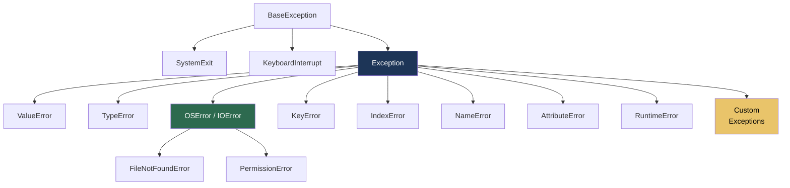

# 9.3.1 Logging and Exception Handling: Professional Error Management

**Backlinks:** [9.2.3 — Advanced subprocess](../Subchapter_9.2/9.2.3_Advanced_Subprocess_shlex_and_dotenv.md) | [Module 1 — Linux](../../1-Linux/) (`/var/log/syslog`, syslog concepts) | [Module 3 — Shell Scripting](../../3-Shell-Scripting/) (Bash exit codes — Python equivalents here) | [Module 8 — CI/CD](../../8-CICD/) (CI step logs: where Python logging output appears)

**Next note:** [9.3.2 — HTTP Requests and REST APIs](./9.3.2_HTTP_Requests_and_REST_APIs.md)

---

## Why Logging and Error Handling Matter

`print()` is fine for debugging on your laptop. Production code running in a Kubernetes pod, a CI/CD pipeline, or a cron job needs:
- **Log levels** — suppress debug noise in production, enable it when debugging
- **Log destinations** — console (for container logs), file (for persistence), syslog (for centralized logging)
- **Structured logging** — JSON format that ELK, Splunk, Datadog can parse and query
- **Proper error handling** — catch specific exceptions, log with traceback, exit with correct codes

---

## Part 0: How the Logging System Works

```mermaid
flowchart TD
    CODE["logger.info('message')"]
    CODE --> LOGGER[Named Logger\nlogging.getLogger\nname]
    LOGGER --> PROPAGATE{propagate=True\ndefault}
    PROPAGATE --> ROOT[Root Logger]
    ROOT --> H1[StreamHandler\nConsole/stdout]
    ROOT --> H2[FileHandler\napp.log]
    ROOT --> H3[RotatingFileHandler\napp.log.1 .2 .3]
    ROOT --> H4[SysLogHandler\n/dev/log]

    H1 --> F1[Formatter\n%(asctime)s - %(levelname)s]
    H2 --> F2[Formatter\nJSON or text]

    style ROOT fill:#1d3557,color:#fff
    style CODE fill:#2d6a4f,color:#fff
```

> **Key concept — logger hierarchy:** Every logger has a name like `'myapp'` or `'myapp.database'`. If a logger named `'myapp.database'` doesn't have handlers, it *propagates* to `'myapp'`, then to the root logger. This is why you can do `logging.basicConfig()` once at the top of your program and all loggers in all modules pick it up automatically.

> **Why `getLogger(__name__)`?** `__name__` is a Python special variable that equals the current module's import name (e.g., `'myapp.database'`). Using it as the logger name creates a logger hierarchy that mirrors your module hierarchy — you can set `logging.getLogger('myapp').setLevel(DEBUG)` to debug everything under `myapp`, or `logging.getLogger('myapp.database').setLevel(WARNING)` to suppress verbose DB logs while keeping others at DEBUG.

---

## Part 1: The `logging` Module — Basic Setup

### Log Levels

| Level | Value | When to Use | Example |
|-------|-------|-------------|---------|
| `DEBUG` | 10 | Detailed internal state | Variable values, function entry/exit |
| `INFO` | 20 | Normal operation milestones | "Server started on port 8080" |
| `WARNING` | 30 | Unexpected but recoverable | "Disk at 85%, threshold is 90%" |
| `ERROR` | 40 | Something failed | "Database connection refused" |
| `CRITICAL` | 50 | Application cannot continue | "Config file not found, cannot start" |

> **Rule of thumb:** `DEBUG` is for you while developing. `INFO` tells operators the system is healthy. `WARNING` means "look at this soon". `ERROR` means "something broke, fix it". `CRITICAL` means "the app died".

### Basic Configuration

```python
import logging

# Simplest setup — one line
logging.basicConfig(level=logging.INFO)
logging.info("Application started")    # appears
logging.debug("Detail")                # suppressed (below INFO)

# With format and file
logging.basicConfig(
    level=logging.INFO,
    format='%(asctime)s - %(name)s - %(levelname)s - %(message)s',
    datefmt='%Y-%m-%d %H:%M:%S',
    filename='app.log',   # log to file
    filemode='a'          # append (use 'w' to overwrite each run)
)

# Multiple destinations — use handlers (see Part 2)
# basicConfig only works before any logging is done
```

### Available Format Variables

| Variable | Description | Example |
|----------|-------------|---------|
| `%(asctime)s` | Human-readable time | `2024-01-15 10:30:45` |
| `%(name)s` | Logger name | `myapp.database` |
| `%(levelname)s` | Level name | `INFO`, `ERROR` |
| `%(levelno)s` | Level number | `20`, `40` |
| `%(message)s` | The log message | `User logged in` |
| `%(module)s` | Module (filename without `.py`) | `deploy` |
| `%(funcName)s` | Function name | `connect_db` |
| `%(lineno)d` | Line number | `42` |
| `%(pathname)s` | Full file path | `/app/deploy.py` |
| `%(process)d` | Process ID | `12345` |
| `%(thread)d` | Thread ID | `140234` |

---

## Part 2: Advanced Logging Configuration

### Multiple Handlers (Console + File)

```python
import logging

# ✅ Correct pattern: create logger, configure handlers manually
def setup_logging(name: str = 'myapp', level: int = logging.INFO,
                  log_file: str | None = None) -> logging.Logger:
    logger = logging.getLogger(name)
    logger.setLevel(logging.DEBUG)   # capture everything; handlers filter

    formatter = logging.Formatter(
        '%(asctime)s - %(name)s - %(levelname)s - %(message)s',
        datefmt='%Y-%m-%d %H:%M:%S'
    )

    # Console handler — INFO and above
    console = logging.StreamHandler()
    console.setLevel(level)
    console.setFormatter(formatter)
    logger.addHandler(console)

    # File handler — DEBUG and above (more verbose)
    if log_file:
        file_h = logging.FileHandler(log_file)
        file_h.setLevel(logging.DEBUG)
        file_h.setFormatter(formatter)
        logger.addHandler(file_h)

    return logger

# Usage
logger = setup_logging('deploy', logging.INFO, '/var/log/deploy.log')
logger.debug("This goes to file only")
logger.info("This goes to both console and file")
logger.error("Error: both destinations")
```

### Rotating File Handlers

```python
import logging
from logging.handlers import RotatingFileHandler, TimedRotatingFileHandler

# Size-based rotation: rotate when file exceeds 5MB, keep 3 backups
size_handler = RotatingFileHandler(
    'app.log',
    maxBytes=5 * 1024 * 1024,   # 5 MB
    backupCount=3                # keep app.log, app.log.1, app.log.2, app.log.3
)

# Time-based rotation: rotate at midnight, keep 30 days
time_handler = TimedRotatingFileHandler(
    'app.log',
    when='midnight',    # 'H'=hourly, 'D'=daily, 'W0'=Monday, 'midnight'
    interval=1,
    backupCount=30
)

logger = logging.getLogger('myapp')
logger.addHandler(size_handler)
logger.setLevel(logging.INFO)
```

### JSON Structured Logging

> **Why JSON logging?** Container log aggregation tools (ELK, Splunk, Datadog, Loki) can parse JSON and index fields. You can then query `level:ERROR AND service:api` or chart `response_time` over time. Plain text logs require regex parsing.

```python
import logging
import json
from datetime import datetime, timezone

class JSONFormatter(logging.Formatter):
    """Emit each log record as a single JSON line"""

    def format(self, record: logging.LogRecord) -> str:
        entry = {
            'timestamp': datetime.now(timezone.utc).isoformat(),
            'level':     record.levelname,
            'logger':    record.name,
            'message':   record.getMessage(),
            'module':    record.module,
            'function':  record.funcName,
            'line':      record.lineno,
        }

        # Extra fields passed via extra={} or LoggerAdapter
        for key in ('request_id', 'user_id', 'service', 'duration_ms', 'pod_name'):
            if hasattr(record, key):
                entry[key] = getattr(record, key)

        # Exception info
        if record.exc_info:
            entry['exception'] = self.formatException(record.exc_info)

        return json.dumps(entry, ensure_ascii=False)

def setup_json_logging(service: str = 'myapp') -> logging.Logger:
    handler = logging.StreamHandler()
    handler.setFormatter(JSONFormatter())
    logger = logging.getLogger(service)
    logger.addHandler(handler)
    logger.setLevel(logging.INFO)
    logger.propagate = False    # don't also send to root logger
    return logger

# Usage
logger = setup_json_logging('deploy-service')
logger.info("Deployment started", extra={'pod_name': 'deploy-pod-abc', 'service': 'api'})
# Output: {"timestamp": "2024-01-15T10:30:45.123+00:00", "level": "INFO",
#           "logger": "deploy-service", "message": "Deployment started",
#           "pod_name": "deploy-pod-abc", "service": "api", ...}
```

### `dictConfig` — Config-as-Data (Production Pattern)

> **Why `dictConfig`?** In production, you want logging configuration to come from a config file, not hardcoded calls. `logging.config.dictConfig()` takes a dict (from YAML or JSON) and sets up the entire logging system.

```python
import logging.config

LOGGING_CONFIG = {
    'version': 1,
    'disable_existing_loggers': False,   # keep any loggers already created
    'formatters': {
        'json': {
            '()': 'myapp.logging.JSONFormatter',   # custom formatter class
        },
        'text': {
            'format': '%(asctime)s - %(name)s - %(levelname)s - %(message)s',
        }
    },
    'handlers': {
        'console': {
            'class':     'logging.StreamHandler',
            'formatter': 'json',
            'stream':    'ext://sys.stdout',
        },
        'file': {
            'class':      'logging.handlers.RotatingFileHandler',
            'formatter':  'text',
            'filename':   '/var/log/myapp.log',
            'maxBytes':   10 * 1024 * 1024,  # 10MB
            'backupCount': 5,
        }
    },
    'root': {
        'level':    'INFO',
        'handlers': ['console', 'file'],
    },
    'loggers': {
        'myapp.database': {
            'level': 'WARNING',   # suppress verbose DB logs
        },
        'urllib3': {
            'level': 'WARNING',   # suppress noisy HTTP lib logs
        }
    }
}

logging.config.dictConfig(LOGGING_CONFIG)
logger = logging.getLogger('myapp')
logger.info("Service started")
```

### `LoggerAdapter` — Adding Context to All Messages

```python
import logging

class RequestContextLogger(logging.LoggerAdapter):
    """Add request_id to every log message without passing extra={} every time"""

    def process(self, msg: str, kwargs: dict) -> tuple[str, dict]:
        # Add context fields to every message
        extra = kwargs.setdefault('extra', {})
        extra.update(self.extra)
        return msg, kwargs

# Usage
base_logger = logging.getLogger('myapp')

def handle_request(request_id: str):
    # Create adapter with context — all log calls include request_id
    log = RequestContextLogger(base_logger, {'request_id': request_id})
    log.info("Processing request")    # includes request_id automatically
    log.debug("Fetching from DB")    # includes request_id automatically
```

---

## Part 3: Exception Handling with try/except

### Exception Hierarchy



> **Catch specific, not broad:** Always catch the most specific exception possible. `except Exception:` catches everything including bugs in your own code — you'll hide real errors. `except FileNotFoundError:` only catches missing files, which is what you intended.

### Basic Exception Handling

```python
try:
    # Code that might fail
    number = int(input("Enter a number: "))
    result = 10 / number
    print(f"Result: {result}")
except ValueError:
    # int() failed — user entered non-numeric
    print("That's not a valid number!")
except ZeroDivisionError:
    # Division by zero
    print("Can't divide by zero!")
except Exception as e:
    # Unexpected — log it
    logging.exception(f"Unexpected error: {e}")
    raise   # re-raise after logging so caller knows it failed
```

### Full `try/except/else/finally`

```python
try:
    file = open('data.txt', 'r')
    content = file.read()
except FileNotFoundError:
    print("File not found")
    content = ""
except PermissionError:
    print("Permission denied")
    content = ""
else:
    # Runs ONLY if NO exception occurred
    print(f"Read {len(content)} bytes successfully")
finally:
    # ALWAYS runs — whether exception or not
    if 'file' in dir() and not file.closed:
        file.close()
    print("Cleanup complete")
    # Note: with open() is better — use finally for other resources
```

### Raising Exceptions

```python
# Raise built-in exceptions
def validate_port(port: int) -> None:
    if not isinstance(port, int):
        raise TypeError(f"Port must be int, got {type(port).__name__}")
    if not (1 <= port <= 65535):
        raise ValueError(f"Port must be 1-65535, got {port}")

# Custom exception hierarchy
class PlatformError(Exception):
    """Base exception for this platform tool"""
    pass

class ConfigurationError(PlatformError):
    """Raised when configuration is invalid or missing"""
    pass

class DeploymentError(PlatformError):
    """Raised when deployment fails"""
    def __init__(self, service: str, reason: str):
        self.service = service
        self.reason  = reason
        super().__init__(f"Deployment of '{service}' failed: {reason}")

# Exception chaining (shows original cause)
try:
    import yaml
    with open('config.yaml') as f:
        config = yaml.safe_load(f)
except FileNotFoundError as e:
    raise ConfigurationError("config.yaml not found") from e
# "During handling of the above exception, another exception occurred"
```

---

## Part 4: Logging Exceptions

### `logging.exception()` vs `logging.error()` with `exc_info=True`

```python
import logging

try:
    result = 10 / 0
except ZeroDivisionError:
    # logging.exception() = logging.error() + exc_info=True + works INSIDE except block
    logging.exception("Division by zero occurred")
    # Output:
    # ERROR:root:Division by zero occurred
    # Traceback (most recent call last):
    #   File "script.py", line 3, in <module>
    #     result = 10 / 0
    # ZeroDivisionError: division by zero

    # Equivalent — explicit
    logging.error("Division by zero occurred", exc_info=True)

    # Use exc_info=True for WARNING level (exception() is always ERROR)
    logging.warning("This is recoverable", exc_info=True)
```

> **`logging.exception()` only works inside `except:` blocks.** Call it while an exception is active. If you call it outside, it logs `NoneType: None`. Use `logging.error(..., exc_info=True)` if you need to log an exception object you stored earlier.

### `traceback` Module — Get Traceback as String

```python
import logging
import traceback

try:
    risky_operation()
except Exception as e:
    # Get the full traceback as a string
    tb_string = traceback.format_exc()
    logging.error(f"Operation failed:\n{tb_string}")

    # Or get just the exception line
    logging.error(f"Error: {traceback.format_exception_only(type(e), e)}")
```

> **`traceback.format_exc()` vs `logging.exception()`:** `logging.exception()` is the idiomatic way — it calls `traceback.format_exc()` internally and attaches it to the log record. Use `traceback.format_exc()` directly when you need the traceback as a string for storing, sending to an API, or custom formatting.

---

## Part 5: Practical Example — Production-Ready Script

```python
#!/usr/bin/env python3
"""
Production-ready script with logging and error handling
"""

import argparse
import logging
import logging.config
import sys
import os
from pathlib import Path

# ─── Custom Exceptions ────────────────────────────────────────────────────────

class ConfigError(Exception):
    """Configuration problem"""

class DeployError(Exception):
    """Deployment problem"""

# ─── Logging Setup ────────────────────────────────────────────────────────────

def setup_logging(level: int = logging.INFO, log_file: str | None = None) -> logging.Logger:
    """Configure root logger with console and optional file handler"""
    fmt = '%(asctime)s - %(name)s - %(levelname)s - %(message)s'
    handlers: list[logging.Handler] = [logging.StreamHandler()]
    if log_file:
        Path(log_file).parent.mkdir(parents=True, exist_ok=True)
        handlers.append(logging.FileHandler(log_file))

    logging.basicConfig(level=level, format=fmt, handlers=handlers)
    # Quieten noisy third-party loggers
    logging.getLogger('urllib3').setLevel(logging.WARNING)
    logging.getLogger('boto3').setLevel(logging.WARNING)
    return logging.getLogger('deploy')

# ─── Application Logic ────────────────────────────────────────────────────────

class Deployer:
    def __init__(self, environment: str, logger: logging.Logger):
        self.env    = environment
        self.logger = logger

    def validate_config(self) -> None:
        """Raise ConfigError if required env vars are missing"""
        required = ['DB_HOST', 'DB_PASSWORD', 'API_KEY']
        missing  = [v for v in required if not os.environ.get(v)]
        if missing:
            raise ConfigError(f"Missing env vars: {', '.join(missing)}")
        self.logger.info("Configuration validation passed")

    def deploy(self) -> bool:
        """Perform deployment — returns True on success"""
        self.logger.info(f"Starting deployment to {self.env}")

        try:
            self.validate_config()
            self.logger.info("Building artifacts...")
            self.logger.info("Deploying to cluster...")
            self.logger.info(f"Deployment to {self.env} completed successfully")
            return True

        except ConfigError as e:
            self.logger.error(f"Configuration error: {e}")
            return False
        except DeployError as e:
            self.logger.error(f"Deployment error: {e}")
            self.logger.exception("Full traceback:")
            return False
        except Exception as e:
            self.logger.critical(f"Unexpected error: {e}", exc_info=True)
            return False

# ─── CLI ──────────────────────────────────────────────────────────────────────

def main() -> int:
    parser = argparse.ArgumentParser()
    parser.add_argument('--env',       choices=['dev', 'staging', 'prod'], default='dev')
    parser.add_argument('--log-level', choices=['DEBUG', 'INFO', 'WARNING', 'ERROR'],
                        default='INFO')
    parser.add_argument('--log-file')
    parser.add_argument('-v', '--verbose', action='store_true')
    args = parser.parse_args()

    level  = logging.DEBUG if args.verbose else getattr(logging, args.log_level)
    logger = setup_logging(level, args.log_file)
    logger.info(f"Starting deployment tool for {args.env}")

    deployer = Deployer(args.env, logger)
    success  = deployer.deploy()

    if success:
        logger.info("✅ Deployment finished successfully")
        return 0
    else:
        logger.error("❌ Deployment failed")
        return 1

if __name__ == '__main__':
    sys.exit(main())
```

---

## Quick Task: Logging Practice

1. Configure logging to write to both console and file.
2. Create a function that reads a file and handles `FileNotFoundError` with proper logging.
3. Create a custom exception class and raise it with context.

> **Ready Solution:**
>
> ```python
> import logging, sys
>
> # Task 1: dual-destination logging
> logging.basicConfig(
>     level=logging.DEBUG,
>     format='%(asctime)s - %(levelname)s - %(message)s',
>     handlers=[logging.StreamHandler(), logging.FileHandler('app.log')]
> )
> logger = logging.getLogger(__name__)
>
> # Task 2: file reading with proper logging
> def read_config(filepath: str) -> str | None:
>     try:
>         with open(filepath, 'r') as f:
>             content = f.read()
>         logger.info(f"Loaded config from {filepath} ({len(content)} bytes)")
>         return content
>     except FileNotFoundError:
>         logger.error(f"Config file not found: {filepath}")
>         return None
>
> # Task 3: custom exception
> class ConfigError(Exception):
>     pass
>
> def require_env(var: str) -> str:
>     val = os.environ.get(var)
>     if not val:
>         raise ConfigError(f"Required env var {var!r} is not set")
>     return val
> ```

---

## Summary Tables

### Logging Quick Reference

| Action | Code |
|--------|------|
| Basic setup | `logging.basicConfig(level=logging.INFO, format='...')` |
| Get logger | `logger = logging.getLogger(__name__)` |
| Log message | `logger.info("msg")` / `logger.error("msg")` |
| Log exception | `logger.exception("msg")` (inside `except`) |
| Add handler | `logger.addHandler(handler)` |
| Rotating file | `RotatingFileHandler('f.log', maxBytes=5e6, backupCount=3)` |
| JSON output | Custom `JSONFormatter` class |
| Config-as-data | `logging.config.dictConfig(dict)` |
| Context adapter | `LoggerAdapter(logger, {'request_id': id})` |

### Handlers

| Handler | Destination |
|---------|-------------|
| `StreamHandler` | Console (stdout/stderr) |
| `FileHandler` | Single file |
| `RotatingFileHandler` | Rotate by file size |
| `TimedRotatingFileHandler` | Rotate by time (daily etc.) |
| `SysLogHandler` | Syslog / journald |

### Exception Handling Patterns

| Pattern | Use |
|---------|-----|
| `try/except SomeError:` | Handle expected error |
| `try/except/else:` | Code that runs if NO exception |
| `try/finally:` | Always-run cleanup |
| `raise CustomError() from e` | Chain exception cause |
| `logging.exception("msg")` | Log with traceback (inside except) |
| `logging.error("msg", exc_info=True)` | Same but any log level |

---

**Next note (9.3.2)** covers **HTTP Requests and REST APIs** — the `requests` library, making GET/POST/PUT/DELETE calls, authentication, and error handling.
